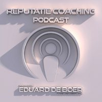

> **Historisch archief.** Deze aflevering verscheen op 3-12-2012 als onderdeel van ReputatieCoaching (2012–2016). De oorspronkelijke tekst is hieronder historisch bewaard. Diensten, contactgegevens, links, tools en adviezen kunnen inmiddels verouderd zijn.



**Transcriptiestatus:** Volledige transcriptie uit het oorspronkelijke archief.

In deze podcast leg ik uit wat een podcast is en hoe je ernaar kunt luisteren. Daarna leg ik uit wat het woord "reputatie" nu eigenlijk betekent en waar het woord "blog" vandaan komt.  
De podcast sluit af met een korte toelichting op wat we in de nieuwe versie van WordPress kunnen verwachten aan verbeteringen en veranderingen.

Hallo allemaal en hartelijk welkom op deze bijzondere dag. Mijn naam is Eduard de Boer –ook wel bekend als de ReputatieCoach– en ik ben de host voor vandaag!

Twee weken geleden was een bijzondere dag, omdat ik toen live ging met de site [www.reputatiecoaching.nl](https://www.reputatiecoaching.nl) en vandaag is het ook weer een gedenkwaardige dag: na werkelijk maandenlang testen en experimenteren met audio-apparatuur, software enzovoorts ga ik nu dan daadwerkelijk live met mijn eerste echte podcast: de ReputatieCoaching Podcast!

In deze podcast komen de volgende onderwerpen aan bod:

- [Over de ReputatieCoaching Podcast](https://web.archive.org/web/20121203000026/http://www.reputatiecoaching.nl/over-de-reputatiecoaching-podcast/)
- [Wat is ‘reputatie’?](https://web.archive.org/web/20121203220056/http://www.reputatiecoaching.nl/reputatie/)
- Blog voor je reputatie
- [WordPress 3.5 komt eraan](https://web.archive.org/web/20121203020017/http://www.reputatiecoaching.nl/wordpress-3-5-komt-eraan/)

En natuurlijk heb ik ook echt jullie feedback nodig, want zonder jullie reacties en vragen heb ik geen idee waar jullie mee worstelen om je online reputatie op te vijzelen. Of misschien heb je wel een negatieve reputatie opgebouwd en heb je advies nodig over hoe je daarmee moet omgaan.

Je krijgt hierbij van mij de garantie dat ik jouw geval anoniem zal behandelen, als je mij daar om vraagt.

Wil je advies of hulp, stuur dan een mailtje naar [info@reputatiecoaching.nl](mailto:info@reputatiecoaching.nl) of spreek je bericht in op: 084 - 883 15 56. Ook kun je onder elk blogbericht reageren. Geef me wel even de tijd om over je situatie/geval/vraag/probleem na te denken om te zien of ik je kan helpen. Ik zal je sowieso binnen 24 uur laten weten dat ik je bericht heb ontvangen.

Nou, ik vind dat ik hiermee je in deze eerste podcast van meer dan voldoende informatie heb voorzien. Ik wil je ook niet meteen ontmoedigen of afschrikken. Als er bepaalde dingen zijn die je niet helemaal duidelijk waren, schroom dan niet dit gewoon bijvoorbeeld onder aan deze transcriptie te vragen in de vorm van een reactie. Vroeger kon namelijk niemand bloggen, dus we hebben het allemaal moeten leren!

Dit was het voor vandaag! Ik zie je graag terug in de volgende podcast! Kijk in de tussentijd af en toe eens op de site naar nieuwe artikelen, of abonneer je op de RSS-feed. (Mocht je niet weten wat dat is: dat leg ik onder andere de volgende keer uit!)

Doei!!
