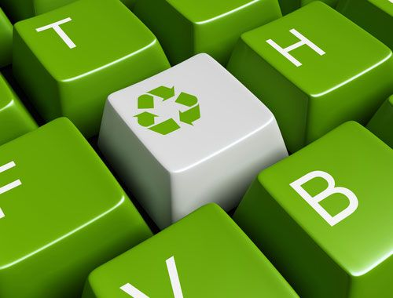
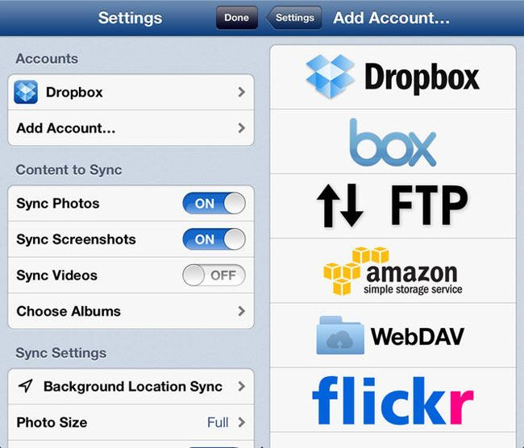
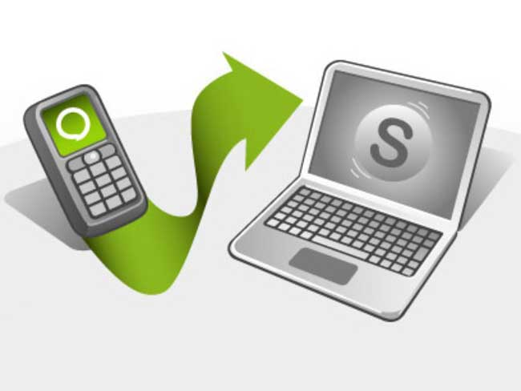

> **Historisch archief.** Deze aflevering verscheen op 19-08-2013 als onderdeel van ReputatieCoaching (2012–2016). De oorspronkelijke tekst is hieronder historisch bewaard. Diensten, contactgegevens, links, tools en adviezen kunnen inmiddels verouderd zijn.



**Transcriptiestatus:** Volledige transcriptie uit het oorspronkelijke archief.

**Het is vakantietijd! En op dit moment ben ik daadwerkelijk op vakantie! We zitten nu lekker met het gezin in Zuid-Frankrijk. Ik wilde je echter niet zonder podcast laten zitten. Daarom heb ik deze podcast van tevoren ingesproken.**

***Historische afbeelding niet beschikbaar: ReputatieCoaching Podcast*
Overal lees je dat je luisteraars van je podcast en lezers van je weblog niet zomaar in de kou moet laten staan door een soort van “radiostilte”. Zeker als je eenmaal een kring van trouwe “volgers” hebt opgebouwd, werkt dit averechts.**

**Dat was dan ook de belangrijkste reden voor mij om toch gewoon een podcast (en nog meer content) online te laten verschijnen, terwijl ik op vakantie ben.**

**Het enige nadeel is dat ik mogelijk niet snel kan reageren op e-mail, voicemail of reacties op de site. Dat moet je me dan even vergeven.**

**Omdat ik deze podcast in de week voorafgaand aan onze vakantie heb ingesproken, kan ik je natuurlijk niet van actueel nieuws voorzien. Want dat nieuws moest op het moment van inspreken natuurlijk nog plaatsvinden. Dit breng ik dan eventueel na mijn vakantie als nieuws wat dan wellicht “passé” is, maar toch vermeldenswaardig.**

**In de periode voorafgaand aan mijn vakantie heb ik zogenaamde “green content” verzameld. Dat is content die tijdloos, of zo goed als tijdloos is. Dit soort content blijft ook goed scoren in de zoekmachines, in tegenstelling tot bijvoorbeeld mijn berichten van vorige week over Corpus Justitia. Dat soort nieuws is erg tijdsgevoelig en heeft een beperkte figuurlijke “houdbaarheid”.**

**Mijn naam is Eduard de Boer –bekend als de ReputatieCoach– en ik heet je van harte welkom bij deze 38e ReputatieCoaching Podcast.**

De onderwerpen voor vandaag… Het eerste onderwerp van vandaag gaat over evergreen content; dat leek me wel toepasselijk voor deze podcast. Dat topic sluit ik af met een aantal tips voor het vinden en schrijven van evergreen content.

Als tweede heb ik weer een video van Matt Cutts over hoe Google zich inzet voor het detecteren van Engelstalige spam en zoekmachine spam in andere talen. Daarna kom ik met wat tips voor goede iPhone apps om de foto’s te backuppen van je smartphone.

Voor het geval je vaak wordt afgeleid tijdens je werk, heb ik een 7-tal tips voor het verbeteren van je concentratie en tenslotte heb ik nog 5 tips waarmee jij ervoor kunt zorgen dat jouw video’s hoger scoren in YouTube en Google.

## Evergreen content

Zoals ik in de introductie al vertelde, is “evergreen content” tijdloos of zo goed als tijdloos. Deze blijft altijd interessant voor je lezers. En de kans is ook groot dat er altijd mensen blijven komen die ernaar op zoek zijn. Als jij dan die content kunt bieden die men zoekt, creëer je een constante stroom van nieuw verkeer naar je website. Zo kun je dus de omvang van je publiek gestaag vergroten.



Als je de artikelen en podcasts op mijn site [www.reputatiecoaching.nl](https://www.reputatiecoaching.nl) bekijkt, vind je zowel nieuws, als tijdloze content. Een voorbeeld van de tijdloze content die ik op mijn site heb staan, zijn de instructievideo’s.

Andere voorbeelden van “evergreen content” zijn lijstjes met tips, bepaalde oefeningen, product reviews, video’s en beschouwende artikelen. Hoewel het dateren van content vaak indruist tegen het principe van “evergreen content”, kan het ook in je voordeel werken.

Zo kun je natuurlijk jaarlijks nieuwe en originele content produceren voor terugkerende evenementen of data. Zo heeft Content Marketing Spreker [Arend Landman](http://www.arendlandman.nl/) op 12 augustus 2010 een artikel geschreven over angst voor vrijdag de 13e, ook wel “paraskeviadekatriafobie” genaamd. Het fenomeen van angst voor vrijdag de 13e komt een aantal keren per jaar terug en dit maakt het dus “altijd groen”. Dit artikel scoort nog steeds in de top 3 van de zoekresultaten, als je zoekt op “angst voor vrijdag de 13e” of op “[paraskeviadekatriafobie](http://www.arendlandman.nl/2010/08/angst-voor-vrijdag-de-13e-heet-paraskeviadekatriafobie-symboliek-van-het-getal-dertien-de-twaalf-met-de-dertiende-in-het-midden/)”.

Ook artikelen over Valentijnsdag, Moederdag, Vaderdag, Kerstmis, Sinterklaas en dergelijke kun je als evergreen content beschouwen, hoewel die evenementen slechts één keer per jaar terugkeren.

Arend Landman heeft honderden evergreen artikelen geschreven. Dit zorgt er dan ook voor dat maandelijks duizenden mensen zijn weblog bezoeken en zijn artikelen lezen.

Denk jij zelf ook eens na over evergreen content voor jouw bedrijf, waarmee je je website beter en steviger op de kaart kunt zetten. Als ik nog eens terugkijk naar schilderes Brechtje Hendriks die vorige week een vraag stelde over het [gebruik van Pinterest en Instagram](https://www.reputatiecoaching.nl/37), kan ik me zo voorstellen dat zij bepaalde onderdelen van haar workshops online kan publiceren in artikelen, ondersteund met foto’s en video’s; bijvoorbeeld bepaalde verftechnieken.

Om je op gang te brengen geef ik je hier een paar tips voor het schrijven van evergreen content:

```
  * Schrijf bewust NIET voor experts, maar voor beginners – Soms wil je graag de diepgang van je kennis tentoon spreiden, maar dit is vaak minder groen dan je denkt. Want experts zoeken veel minder voor hulp online, want zij weten het meeste al of denken het meeste al wel te weten. Het zijn juist de beginners die op zoek gaan naar informatie.
  * Vermijd TE technische termen – Omdat je content voor beginners is, kan overmatig gebruik van technische (vak)termen hen afschrikken. Aan de andere kant zou je een reeks van artikelen kunnen schrijven, waarbij je in elk artikel een technische term in beginnerstaal uitlegt. Dat is dan wel weer evergreen.
  * Beperk de scope van je artikel – Als je over teveel zaken uitweidt, wordt je artikel langer en minder leesbaar voor beginners. Behoud je focus.
  * Link vanuit je evergreen artikel veel naar andere artikelen op je site – Omdat mensen meer via de evergreen content op je site terecht zullen komen, moet je juist ook linken naar andere gerelateerde stukken proza op je site. Hierdoor leid je de bezoekers door je site en stil je hun honger naar nog meer kennis.
  * Update je evergreen content indien nodig – Soms is bepaalde content toch aan verandering onderhevig en dus kan het voorkomen dat je een artikel iets moet aanpassen om het weer semi-tijdsonafhankelijk te maken.
  * Gebruik mogelijk “oude content” voor het maken van evergreen content – Soms kun je bestaande content nieuw leven inblazen door het te herschrijven, waarbij je het tijdselement eruit haalt.
  * Gebruik vragen van je klanten/patiënten als inspiratie – Heel vaak krijg je van je klanten of patiënten dezelfde vragen. Verzamel deze vragen en schrijf een apart artikel voor elke vraag. Zo bouw je ook een assortiment van tijdloze maar vooral waardevolle content op!
```

Maar schrijf niet alleen maar tijdloze, groene content. Ook artikelen die extreem tijdsgevoelig zijn kunnen verkeer naar je site trekken en daarmee je bekendheid vergroten. Bovendien laat je daarmee zien dat je ook de actualiteit volgt en op de hoogte bent van wat er speelt in jouw vakgebied.

Op de site “moz.com” staat een interessant artikel uit 2012, dat verder ingaat op “evergreen content”. In dit artikel met de titel “[The True Power of Evergreen Content - A Case Study](https://moz.com/blog/the-true-power-of-evergreen-content-a-case-study)” beschrijft Nick Eubanks heel goed wat evergreen content allemaal voor jouw site kan betekenen. In de show notes op [www.reputatiecoaching.nl/38](https://www.reputatiecoaching.nl/38) vind je niet alleen zoals altijd de transcriptie van deze podcast, maar ook de links naar alle artikelen die ik heb gebruikt bij het samenstellen van deze podcast.

En een fantastisch voorbeeld over hoe je evergreen content kunt gebruiken voor het groeien van je business kun je lezen op de site van [Marcus Sheridan](http://www.thesaleslion.com/), ook wel bekend als de “Sales Lion”. Zijn zwembadbedrijfje maakte een heel moeilijke tijd door, na het instorten van de onroerend goed markt in de VS in 2008.

Hij besloot alle vragen van zijn klanten die hij de afgelopen jaren had gekregen online te publiceren en te beantwoorden. Hierdoor is zijn bedrijf één van de meest succesvolle zwembadbedrijven van Amerika geworden. Het advies wat hij geeft is zó simpel, dat het door iedereen uitvoerbaar is:

“Neem de top 50 lijst met vragen die je dagelijks van klanten en prospects krijgt en behandel die stuk voor stuk in een aparte blogpost.”

In een aflevering van de “[Social Media Examiner Podcast](http://www.socialmediaexaminer.com/)” van Michael Stelzner kun je luisteren naar een interview met Marcus Sheridan over de relatie tussen bloggen en contentmarketing. De link naar deze podcastaflevering vind je onderaan in de show notes van deze ReputatieCoaching Podcast.

## Google strijdt tegen spam in alle talen

Een aantal video’s van Google is ook in zekere zin “evergreen”. Zo verscheen er eerder deze maand een video van Matt Cutts waarin de vraag wordt behandeld, of Google dezelfde maatregelen neemt om spam te weren in de Engelstalige zoekresultaten, als voor andere talen.

Volgens Matt doet Google haar best om spam over de hele wereld te bestrijden, zowel link spam, als content spam. Google probeert de algoritmes voor elke taal te laten werken. Daarnaast hebben ze ook in veel landen lokale mensen zitten die online speuren naar spam. Hiermee wordt spam in 48 talen rond de wereld bestreden.

Google nodigt iedereen uit om een spamrapport of een tweet te sturen, wanneer je spam in de zoekresultaten denkt te zien. Ook kun je een bericht achterlaten in de Google Webmaster fora.

## Backup de foto’s op je smartphone!

De regio Midden-Nederland heeft nog vakantie, waar wij op dit moment ook van genieten. Maar vooral in vakanties maken we vaak veel foto’s. En naarmate de camera’s in smartphones steeds beter worden, maken we niet alleen veel foto’s op vakanties, maar ook gedurende ons gewone leven.

We bewaren deze foto’s op onze smartphones of tablets en posten af en toe eens een foto op de social media, zoals Facebook, Twitter of Google+. Maar hoeveel foto’s heb jij nu op je smartphone? 1.000? 2.000? Meer?

Heb je er wel eens over nagedacht of je het erg vindt als je al deze foto’s in één keer kwijtraakt? Ben je dan in één klap de laatste twee, drie of meer jaar van je leven grotendeels kwijt?

Dan ga ik nog een stap verder… Hoeveel foto’s heb je op je laptop of desktop computer staan? Heb je daar wel een backup van? Wordt het niet eens tijd dat goed in te regelen?

Over dit laatste wil ik alleen maar zeggen: zorg ervoor dat je altijd een backup hebt van al je foto’s op een externe USB-harddisk. En maak gebruik van de [1 TB opslagcapaciteit](https://www.reputatiecoaching.nl/26/) die je GRATIS krijgt als je een account aanmaakt bij Flickr, zoals ik al in [podcast 26](https://www.reputatiecoaching.nl/26) meldde.

Ook al heb je dat allemaal gedaan, als je dan niet geregeld de foto’s van je smartphone downloadt op je computer en naar je USB-disk en Flickr stuurt, dan nóg loop je het risico dat je ofwel door verlies van je smartphone of door een technische storing de duizenden foto’s op je telefoon kwijtraakt.

[](http://clk.tradedoubler.com/click?p=24371&a=2033474&g=11696689&url=https://itunes.apple.com/nl/app/camerasync/id406645727?mt=8)Daarvoor heb ik onlangs een leuke app gevonden, in ieder geval voor de iPhone. Deze app heet “[CameraSync](http://clk.tradedoubler.com/click?p=24371&a=2033474&g=11696689&url=https://itunes.apple.com/nl/app/camerasync/id406645727?mt=8)”. Zoals zoveel apps kan ook deze iPhone app automatisch je foto’s backuppen naar Flickr. Maar daarnaast kan het ook je foto’s bewaren op Dropbox, Box.com, Amazon S3, een WebDAV-server, Microsoft SkyDrive of Google Drive.

Het mooie eraan is dat je die app zó kunt instellen dat hij alleen bijvoorbeeld je foto’s en video’s uploadt als je in de buurt bent van een bekend WiFi-netwerk. Ook kun je ervoor kiezen om eerst in ieder geval een backup te maken van je foto’s en pas daarna van je video’s, of omgekeerd.

Als je eenmaal de app hebt opgestart, hoef je er niet meer naar om te kijken. Want zodra je in de buurt komt van een bekend WiFi-netwerk, begint de app met het uploaden van je foto’s, zodat ze veilig ergens worden bewaard in de cloud.

Voordat ik op vakantie ging heb ik eerst nog even een volledige backup van m’n iPhone gemaakt en een aparte backup van alle foto’s en video’s. Daarna heb ik het grootste gedeelte van de foto’s gewist op de telefoon. Zo had ik weer 6 GB aan vrije ruimte om nog wat meer podcasts te downloaden, die ik nu tijdens de vakantie aan het luisteren ben.



De app “[CameraSync](http://clk.tradedoubler.com/click?p=24371&a=2033474&g=11696689&url=https://itunes.apple.com/nl/app/camerasync/id406645727?mt=8)” kost EUR 2,69 maar ik vind het zijn geld dubbel en dwars waard. Ik heb nu namelijk geen angst meer, omdat mijn foto’s en video’s automatisch worden bewaard op drie punten in de cloud.

Een andere manier om je foto’s te backuppen is door het downloaden van de Facebook app, of de Google+ app. In de Facebook app ga je naar de tab “Foto’s” en klik je sync. Dan worden al je foto’s in het vervolg ook automatisch op Facebook bewaard. Alleen biedt Facebook een maximum van 2 gigabyte aan gratis opslagcapaciteit.

Als je gebruik maakt van de Google+ app kun je ook automatisch je foto’s in de achtergrond laten backuppen naar Google+. Google geeft je op dit moment 25 GB gratis. Maar dat is dan wel gedeeld met je mail, documenten en andere bestanden en met je foto’s.

Bij beide oplossingen blijven de foto’s als privé gemarkeerd, totdat jij ze publiekelijk maakt. Dus je hoeft je geen zorgen te maken dat de foto’s per ongeluk zichtbaar worden voor de halve wereld.

Let alleen wel op, als je ergens in het buitenland bent. Stel dat je in Nederland een vrijwel onbeperkte databundel hebt en je hebt dataroaming aan staan, dan veroorzaakt dit een flinke toename van je datakosten. Daarom raad ik je aan de apps dusdanig in te stellen, dat ze alleen foto’s uploaden, als je bereik hebt via WiFi. En ook dan moet je in het buitenland oppassen, want als je in een hotel bijvoorbeeld 5 uur WiFi-tijd koopt, dan kan het zijn dat je daar doorheen bent, zonder dat je er erg in hebt.

## 7 manieren om geconcentreerd te blijven en afleiding te vermijden

Als je inmiddels terug bent van je vakantie en weer helemaal vol energie aan het werk bent, dan merk je weer hoe vervelend het kan zijn als je lekker geconcentreerd bezig bent en je wordt door iemand of iets gestoord of afgeleid…

Wist je dat het gemiddeld 25 minuten kost om dan weer terug te keren naar dezelfde concentratie (als het je al lukt)? Op deze manier verliezen we met z’n allen gemiddeld iets meer dan 2 uur per dag aan al die verstoringen. Dat is erg jammer.


Zelf merk ik dat het nieuwe werken voor mij werkt. Dikwijls ben ik thuis op mijn kantoor geconcentreerd aan het werk en meld dat dan ook aan het gezin. Die komen mij dan in elk geval niet storen. Maar dan nog zijn er zoveel storingsbronnen in je omgeving, die vaak wel ervoor zorgen dat je wordt gestoord.

Op het weblog van Sid Savara –een bekende Personal Development Trainer– kwam ik de volgende zeven tips tegen om gefocussed te blijven door te voorkomen dat je wordt gestoord. Deze heb ik aangevuld met mijn eigen bevindingen.

**Als eerste: stop met het checken van je mail en social media!** En zet alle bliepjes, piepjes, badges en animaties die aangeven dat er een nieuw mailtje of Facebook berichtje voor je is, UIT! Sommige mensen checken hun mail soms wel 40 keer per uur!

Veel mensen verliezen ook veel tijd in de social media. Zij verwarren het druk lezen van andermans bezigheden, zorgen, beslommeringen of het bekijken van de vakantiefoto’s van vrienden met druk aan het werk zijn.

Ik heb tegenwoordig zowel op mijn grote computer, als op de iPhone en iPad alle waarschuwingsgeluiden voor mail en andere applicaties uit staan. Helaas toont MacOS X altijd een badge met het aantal nieuwe mails, dus die schakel ik dan ook uit, als ik echt aan het werk ben.

Op m’n smartphone heb ik Facebook verwijderd: ik werk gewoon via [m.facebook.com](http://m.facebook.com/) in Safari op m’n iPhone als ik daar behoefte aan heb. Opeens hoef ik minder vaak m’n telefoon op te laden en word ik veel minder gestoord!

**Als tweede: stop met het beantwoorden van je telefoon.** Hoevaak komt het nu werkelijk voor dat iemand je echt op dat moment moet spreken? Ik durf te wedden dat dat niet vaak voorkomt. Laat je telefoongesprekken binnenkomen op je voicemail.

Zo maak ik gebruik van de diensten van Xoip, wat je kunt vinden op [www.xoip.com](http://www.xoip.com). Daar heb ik diverse 084-nummers en 087-telefoonnummers voor verschillende doeleinden. En het zijn alleen deze nummers die ik naar de buitenwereld communiceer. Het mooie van Xoip is dat je je eigen bereikbaarheidsschema kunt instellen.



Zo laat ik bijvoorbeeld bepaalde nummers ‘s avonds of in het weekend automatisch in de voicemail komen, terwijl ze gedurende de dag doorschakelen naar Skype of mijn mobiele telefoon. Een ander Xoip-nummer komt altijd bij m’n telefoniste terecht, die van half negen ‘s ochtends tot negen uur ‘s avonds de gesprekken beantwoordt en mij dagelijks een e-mail stuurt met alle ontvangen boodschappen.

En waar ik zo blij mee ben, is dat Xoip tenminste mijn voicemail als een .WAV-bestandje per e-mail naar mij toestuurt. Zo kan ik ook overal de voicemail afluisteren, of als iemand een voicemail inspreekt op de ReputatieCoaching Hotline, deze in de podcast laten horen.

Dus: durf je telefoon eens wat vaker op stil te zetten, waarbij je de trilfunctie ook hebt uitgeschakeld. En leg ‘m dan ook op de kop op je bureau, zodat je helemaal niet ziet dat je wordt gebeld. Mensen die echt iets van je nodig hebben, spreken wel de voicemail in.

**Als derde: verdedig je werkplek.** Soms is dit in kantooromgevingen zo simpel als de deur van je kantoor te sluiten, als je echt geconcentreerd wilt werken. Maar met de hedendaagse kantoortuinen is dat niet altijd even gemakkelijk.

Op je computer kun je verschillende browsers voor verschillende doeleinden gebruiken. Zo gebruik ik persoonlijk Chrome om ingelogd te blijven op Gmail, Google+ en Google Drive. Ik ben namelijk een extreem enthousiast gebruiker van Google Docs, waardoor ik zo goed als geen documenten of presentaties meer schrijf op mijn computer. Het heeft ook als voordeel dat ik een document waar ik mee ben begonnen overal kan oppakken en uitbreiden op bijvoorbeeld de iPad.

Safari en Firefox gebruik ik dan om op andere accounts ingelogd te zijn. Zo hou ik de werkzaamheden gescheiden.

Hetzelfde geldt ook voor je fysieke werkplek. Probeer ook daar persoonlijke zaken weg te houden.

**Ten vierde… Nu ik het toch over je fysieke werkplek heb: ruim je bureau op.** De meeste mensen worden erg afgeleid van een bureau dat vol ligt met rommel. Rommel maakt het moeilijk je te concentreren. Uit onderzoek is ook gebleken dat alleen al het zien van rommel je emotioneel kan uitputten. Doe jezelf dus een plezier en ruim nu meteen je bureau op.

Sommige mensen zijn ook productiever als ze minder “rommel” op het bureaublad van hun computer hebben staan en kiezen daarvoor graag voor een fullscreen tekstverwerker, die alle andere storende invloeden verbergt.

**Als vijfde: zet een koptelefoon op, of stop oordopjes in je oren.** Vooral als je werkt in van die moderne kantoortuinen, in een koffieshop of andere gedeelde werkomgeving kun je erg afgeleid worden door alle geluiden om je heen. Als je van muziek houdt en je beter werkt met muziek erbij, luister dan naar muziek. Download muziek op je smartphone of abonneer je op Spotify, SoundCloud, Rdio of een soortgelijke dienst. Ga echter niet proberen naar podcasts te luisteren, wanneer je moet werken. Doordat het vaak informatie is, waar je iets van kunt leren, ga je geconcentreerd zitten luisteren en wordt je alsnog afgeleid.

Een extra voordeel van zitten werken met oordopjes in, is dat je naar je omgeving het signaal afgeeft dat je niet gestoord wilt worden; ook al heb je niet eens muziek op staan.

**Tip nummer 6: plan je werk en bereid je voor.** Zorg ervoor dat alles wat je nodig hebt om je werk voor de komende paar uur te doen, in de buurt hebt liggen. Zodoende voorkom je dat je op moet staan om het te pakken, waardoor je concentratie dus weer wordt doorbroken.

Maak van te voren ook een lijstje van de dingen die je in het komende tijdslot gaat doen. Begin dan met datgene waar je het meeste tegenop ziet en pak dan de overige, wellicht triviale zaken op.

**Tip 7: neem pauzes tussen activiteiten en pauzeer frequent.** Zo voorkom je dat je je focus gedurende een activiteit verliest. Durf jezelf ook te belonen, als je taken hebt afgerond.

Als jij in staat bent je beter te concentreren, komt dit je productiviteit ten goede. En als je productiever bent, valt dit ook je baas of opdrachtgever op. Dit vergroot de reputatie in je directe omgeving. En schroom niet tijd voor jezelf te claimen voor je werkzaamheden en om je volledig af te sluiten om het gedaan te krijgen: ook dit siert je als professional.

## 5 tips voor beter scoren met YouTube video’s

*Historische afbeelding niet beschikbaar: YouTube*
Als laatste onderwerp voor vandaag heb ik vijf tips voor je, hoe je beter kunt scoren met je video’s op YouTube, als in Google. In [podcast 36](https://www.reputatiecoaching.nl/36/) vertelde ik je al hoe je een aantal video’s in één keer kunt uploaden zonder als spammer te worden gezien en gaf ik je een gouden tip voor het hoger scoren met video’s door een correcte ondertiteling bij elke video te uploaden.

**1. Bestandsnaam en titel van je video**
Goed scoren met video’s begint bij het begin. En het begin is de bestandsnaam die je aan je video geeft, in combinatie met de titel van je video. De bestandsnaam wordt namelijk door YouTube opgeslagen en kun je niet meer veranderen. Wel wordt die gebruikt bij het zoeken van video’s.

Standaard geeft YouTube elke video de bestandsnaam als titel. Dit kun je wel wijzigen. En je kunt dit ook eventueel ooit naderhand nog eens aanpassen. Gebruik derhalve goede zoektermen in zowel de bestandsnaam, als in de titel van de video. Houd een maximum lengte van zo’n 50-60 karakters aan en begin met je meest belangrijke zoektermen.

**2. Je website of URL van je blogpost bovenaan in de beschrijving**
Bij een voorvertoning van je video op YouTube worden slechts de eerste twee regels van de beschrijving getoond. Plaats daarom de URL van je site of van je blogpost meteen aan het begin van je video-omschrijving. Zo wordt die altijd weergegeven. Dat is goed, want elke URL die je in de omschrijving plaatst, is clickable!

De beschrijving kan overigens maximaal 5.000 karakters zijn. Gebruik die ruimte! Schrijf een mooi en uniek stuk proza bij/over elke video en gebruik ook daarin de keywords waarop je wilt dat je video gevonden kan worden.

**3. Gebruik de tags!**
Je kunt tientallen tags bij je video kwijt. Zet daar alle relevante zoektermen in, die je maar kunt bedenken. Overdrijf echter niet, anders wordt je alsnog weer afgestraft vanwege het stuffen van keywords.

Vul daar in elk geval de naam van je videokanaal in, je bedrijfsnaam, de plaats, provincie en land waar de video is opgenomen, als dat van toepassing is, en andere trefwoorden. Vergeet overigens niet je video op “Openbaar” te zetten, want anders kan die ondanks al je mooie trefwoorden alsnog niet worden gevonden.

**4. Schakel reacties in**
Zelf krijg ik niet zoveel reacties op de video’s. Wellicht komt dat doordat dat niet zo in de aard van de bezoekers ligt. Want de video’s worden wel bekeken. Als je reacties inschakelt, wees er dan op voorbereid dat je ook zult moeten reageren op opmerkingen die de mensen plaatsen.

**5. Deel je video’s**
“Delen is het nieuwe vermenigvuldigen”. Dus deel je video’s zo vaak mogelijk op zoveel mogelijk plaatsen en sociale media. Embed de video’s in artikelen op je site en upload ze ook naar andere video sites. Hoewel YouTube de grootste is, zijn er nog veel meer sites waar je video’s kunt uploaden. Zo kun je extra awareness creëren voor je naam of je bedrijf.

Met deze vijf tips om beter te worden gevonden met je video’s, kom ik dan weer aan het einde van de podcast van vandaag. Als je de podcast leuk vindt en je hebt inderdaad wat aan alle informatie die ik met je deel, help mij dan met het verder verbeteren en promoten van deze podcast. Deel ‘m op Twitter, like ‘m op Facebook of geef een “+1” op Google+. Het zou helemaal super zijn, als je een bericht achterlaat op iTunes of LinkedIn.

Als je een vraag of een probleem hebt met betrekking tot je online reputatie of de vindbaarheid van je website, kun je een mailtje sturen naar [podcast@reputatiecoaching.nl](mailto:podcast@reputatiecoaching.nl). Als je dat te lastig vindt, of als je de podcast beluistert terwijl je in de auto zit en je hebt acuut een vraag, spreek dan een boodschap in op de ReputatieCoaching Hotline, op nummer: 084 - 883 15 56. Mogelijk behandel ik je vraag of probleem dan in een artikel of in de podcast.

Als laatste kun je je ook inschrijven voor de nieuwsbrief. Dan ontvang je altijd als eerste het laatste nieuws wat ik publiceer en automatisch elk kwartaal het ReputatieCoaching Podcast Boek van het afgelopen kwartaal. Surf daartoe naar [www.reputatiecoaching.nl/nieuwsbrief](https://www.reputatiecoaching.nl/nieuwsbrief) en schrijf je meteen in.

En je kunt rechtstreeks op de website een voicemail achterlaten, door op de tab aan de rechterkant van elke pagina te klikken, en je bericht in te spreken. Dit was [ReputatieCoaching Podast aflevering 38](https://www.reputatiecoaching.nl/38) en mijn naam is [Eduard de Boer](http://nl.linkedin.com/in/eduarddeboer).

Let wel, ik ben tot en met eind augustus op vakantie, dus ik kan mogelijk niet zo snel reageren op je berichten. Wel doe ik mijn best om af en toe de mail te checken.

Ik wens je de komende week weer succes met het werken aan je reputatie, zodat je meteen je reputatie voor jou kunt laten werken!

Tot volgende keer!

Doei!

[info\_box]Hieronder het overzicht van de links die in deze podcast aan bod komen:

```
  * [CameraSync](http://clk.tradedoubler.com/click?p=24371&a=2033474&g=11696689&url=https://itunes.apple.com/nl/app/camerasync/id406645727?mt=8) – voor het backuppen van de foto’s op je iPhone (iTunes)
  * [Xoip](http://www.xoip.com/) – voor maximale bereikbaarheid
  * “[7 Ways To Beat Distraction and Improve Concentration](http://sidsavara.com/personal-development/improve-concentration-distraction-free-work-environment)” (Sid Savara)
  * “[The True Power of Evergreen Content - A Case Study](https://moz.com/blog/the-true-power-of-evergreen-content-a-case-study)” (moz.com, 14 september 2012)
  * “[Blogging for Business: How Content Can Improve Your Sales](http://www.socialmediaexaminer.com/blogging-for-business-how-content-can-improve-your-sales/)” (Social Media Examiner” (21 september 2012)
  * “[How To Optimise YouTube Videos – 5 Top Tips](http://www.hallaminternet.com/2013/business-benefit-youtube-part-2/)” (Hallam Internet, 12 augustus 2013)[/info_box]
```
