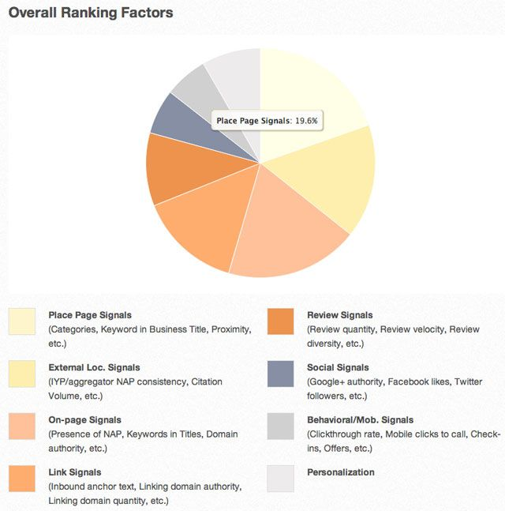

> **Historisch archief.** Deze aflevering verscheen op 26-08-2013 als onderdeel van ReputatieCoaching (2012–2016). De oorspronkelijke tekst is hieronder historisch bewaard. Diensten, contactgegevens, links, tools en adviezen kunnen inmiddels verouderd zijn.



**Transcriptiestatus:** Volledige transcriptie uit het oorspronkelijke archief.

**Ik ben op dit moment nog steeds op vakantie. Inmiddels is dit de laatste week en volgende week maandag heb ik weer al het nieuws doorgespit om je bij te kunnen praten over de laatste ontwikkelingen op het gebied van lokale SEO, content en video marketing en reputatiemanagement.**

***Historische afbeelding niet beschikbaar: ReputatieCoaching Podcast*
Evenals de podcast van vorige week heb ik ook deze podcast vóór onze vakantie ingesproken en ook nu breng ik je een paar nieuwtjes en wetenswaardigheden, in combinatie met wat evergreen content.**

**Allereerst wil ik het vandaag hebben over het kopen van reviews en de prijzen van reviews, waarna ik automatisch op Yelp kom, die het daar beslist niet mee eens is. Via Yelp kom ik op de lokale ranking factoren in Google voor 2013. En inmiddels heb ik al ruim twee maand het effect van de plugin “Tweet old post” kunnen meten. Dus ook daarover meer.**

**Verder wordt het steeds belangrijker dat je ook met je website gaat scoren in Bing en is de vraag aan Google of het gebruik van stockfoto’s een negatief effect heeft op je rankings.**

**Mijn naam is Eduard de Boer –bekend als de ReputatieCoach– en ik heet je van harte welkom bij deze 39e ReputatieCoaching Podcast.**

Voordat ik overga op de onderwerpen van vandaag wil ik nog even terugkomen op de podcast van vorige week. Daarin had ik het over evergreen content. Heb jij al eens nagedacht over wat voor soort groene en bovenal tijdloze content jij kunt produceren voor jouw business?

Neem gerust contact op, als je hier wat tips voor wilt hebben. Post een reactie onderaan de show notes van deze podcast, die je kunt vinden op [www.reputatiecoaching.nl/39](https://web.archive.org/web/20131023225914/http://www.reputatiecoaching.nl:80/39/), spreek een bericht in op de ReputatieCoaching Hotline op 084 - 883 15 56 of spreek een voicemail in door middel van de tab aan de rechterkant van de pagina op de site. Natuurlijk kun je ook een berichtje sturen naar [podcast@reputatiecoaching.nl](mailto:podcast@reputatiecoaching.nl).

Vorige podcast had ik het ook over backups en voornamelijk het backuppen van de foto’s op je smartphone. Maar nu wil ik toch even een verhaal aanhalen over backups in het algemeen.

Vorige week hoorde ik namelijk weer een horror-story over backups. Het bleek dat een gerenommeerd bedrijf jarenlang haar SAP-data met alle bedrijfsgegevens keurig dagelijks dacht te archiveren op tape. Maar toen een consultant probeerde een tape terug te zetten, bleek er niets op te staan. Ongeacht welke tape hij probeerde terug te zetten: ze waren allemaal leeg! Het bleek dus dat het bedrijf in kwestie jarenlang helemaal geen backup had van haar bedrijfskritische data. Moet je je eens voorstellen wat voor ellende het bedrijf zou hebben ondervonden, als het ooit eens alle bedrijfsgegevens kwijt zou raken!


Dit is niet eerder aan het licht gekomen, omdat nooit iemand heeft geprobeerd de backup terug te zetten. Ik neem aan dat binnen het bedrijf waar jij werkt, ook met enige regelmaat backups worden gemaakt… Maar heeft iemand al eens geprobeerd een backup terug te zetten? Ik zou het maar eens proberen!

Ook als je thuis backups maakt: controleer eens of je wel daadwerkelijk data opslaat… En als je backups maakt van je weblog: bekijk eens zo’n backup op Dropbox, pak ‘m uit en zie of alles er wel in zit…

Dan over op de daadwerkelijke onderwerpen voor deze podcast.

## Wat kost een review? Reviews kopen of niet?

In Amerika is het helemaal hot. Daar schijnen ondernemers te worden overladen met e-mails die hen aanbieden om goede Google reviews te posten. Ook als je even gaat Googelen op zoek naar waar en hoe je Engelstalige Google reviews kunt kopen, dan vind je de aanbiedingen te kust en te keur. Je vindt ze niet alleen als bedrijf via de zoekmachines, maar de bedrijven adverteren ook brutaal op sites als eBay.

Op Marktplaats vind je ze echter niet, maar ook als je gaat zoeken op “reviews kopen”, dan vind je teksten zoals ik in de show notes heb opgenomen:[Historische afbeelding: bekijk bron](https://lh4.googleusercontent.com/JKtZDWsjHcIQHuD81k_5nkynimq5w4ziQNdrvabdjyoPQ2qQKdBLz2fx_-y1aZnStU3D8SoQAf4XAg2pqj_fINIYdYpMzUm7ol-YfjoYq1wOZDvkvkSTdwCj0Q)

De bekende local search specialist Mike Blumenthal ging ook op onderzoek uit. In Amerika kwam hij ook niet alleen sites tegen waar je 5-sterren reviews kon kopen, maar ook sites waar je Google+ volgers kunt kopen. Hij rekende uit dat een 5-sterren review gemiddeld US$1,40 per stuk kost.

Ik kon in Nederland niet zo snel een site vinden die echt reviews te koop aanbiedt. Wel vond ik een aantal sites die Facebook Likes en Facebook, Twitter en Pinterest volgers aanbieden. De prijs voor een Like, of een Twitter volger is slechts een paar cent! Je kunt zelfs Duitse Facebook likes kopen. Ongelofelijk!

Hoever wil je gaan? Ik heb al een paar keer met ondernemers te maken gehad, die volgers op een Twitter account hebben gekocht, of Pinterest volgers enzovoorts. Maar afgezien van het bedrag wat je hiervoor betaalt: wat is hier nu de waarde van? Je hebt wat “social proof”, maar hoe geloofwaardig komt het over als je een hele grote -maar bovenal stilzwijgende- schare van Twitter-volgers hebt?

Iedere keer als ik dit te horen krijg, raad ik het de mensen af. En als ze besluiten het toch te doen, dan haal ik mijn handen er af. Ik wil niet met dit soort praktijken worden geassocieerd.

Een tijdje geleden had ik een tandarts die heeft gewoon een mooie Oral B elektrische tandenborstel verloot onder de eerste 50 likes! En die had hij binnen een paar dagen! Dan beloon je tenminste mensen voor het Like’n van je site en je content.

Maar terug naar reviews. Google is tegen op het commercieel verkrijgen van reviews, evenals Yelp. Yelp heeft in het verleden al dikwijls bedrijven 90 dagen lang aan de virtuele schandpaal genageld door een bericht op de Yelp-pagina van het bedrijf te posten, dat het bedrijf zich schuldig heeft gemaakt aan het illegaal verkrijgen van reviews.

Eerder deze maand heeft Yelp weer acht bedrijven gelynched. Daarvan heb ik een afbeelding in de show notes opgenomen.

[Historische afbeelding: bekijk bron](https://lh6.googleusercontent.com/I7s3AwWZwJWgPQHfQUJzRUGdM4pP_8vWLoso4D-jS9zrnDx1bgm4qdsbCmS-noODfBIdtnIrCVy7v-p6OiKSB82op3ilaxAtyA1BgQ7yh4VCY8WRNrrshVKcWw)

Google is wat dat betreft nog wel wat milder: het enige wat op Google+ kan gebeuren is dat reviews niet worden vertoond. Je wordt niet meteen online besmeurd met virtuele pek en veren.

## Hoe krijg je goede reviews op een eerlijke manier?

Iedereen weet inmiddels wel dat goede reviews helpen bij het opbouwen van je online reputatie en mogelijk ook het hoger scoren in de zoekresultaten, alhoewel dit laatste nog ter discussie staat. In elk geval helpen veel sterretjes en positieve verhalen over je bedrijf bij het werven van klanten die op zoek gaan naar reviews.

Maar als je geen reviews mag kopen en mensen ook niet mag belonen voor reviews… Hoe zorg je er dan voor dat je een gestage stroom van nieuwe reviews op gang brengt?

Tja, allereerst moet je natuurlijk tevreden klanten of patiënten hebben. Daar moet je al hard voor werken, temeer daar je ontevreden klanten vaak het snelst geneigd zijn een negatieve review te posten. Je moet er continu aan werken om te weten wie je positief gestemde klanten zijn en wie ontevreden is. Afhankelijk van het type business waar je in zit, zou je sowieso al regelmatig een soort van klanttevredenheidsonderzoek moeten uitvoeren.


Als je weet wie je tevreden klanten zijn, moet je ze vragen een testimonial of online review te plaatsen. Als je handig bent, verzamel je niet alle reviews op één site, maar spreid je je kansen en je risico, door reviews te verzamelen op Google+, Yelp en Facebook. Daarna kun je nog eens kijken naar andere sites, zoals bijvoorbeeld “allebedrijvenin.nl”, YelloYello.nl, Tupalo.nl enzovoorts.

Als een klant zegt dat hij/zij met alle plezier een review schrijft, wacht je een paar weken. Wel kun je die persoon ook vragen waar hij of zij de review gaat posten. Als het na een paar weken nog niet is gebeurd kun je het laten zitten tot een volgend moment dat je die klant of patiënt weer ziet, of je kunt een vriendelijke reminder sturen.

Bewaar ook alle geposte testimonials in een apart document, dat je goed opslaat. Zo kun je de testimonials ook nog gebruiken, mochten ze een keer onverhoopt online verdwijnen.

Als je eenmaal een testimonial van een goede en tevreden klant hebt, kun je ook vragen of zij of hij bereid is een videotestimonial te doen. Dat is natuurlijk nog veel krachtiger, zeker als je meerdere video reviews op je website hebt staan!

Wees voorbereid op het feit dat nog niet veel mensen reviews of testimonials posten. Ik heb wel eens gezien bij ondernemers dat ze een soort van stroomdiagram voor de klanten hadden gemaakt, zodat een klant zelf snel en eenvoudig kon kiezen waar en vooral hoe hij een review kon posten.

Wat je ook kunt doen is na bijvoorbeeld een bezoek of behandeling je patiënten of klanten een mail sturen met daarin de vraag hoe hij of zij het heeft ervaren. Daar is op zich niets mis mee.

Al met al gaat het pas fout, als je gaat betalen of belonen voor de reviews. Dus blijf daar verre van!

Reviews hebben vaak vooral invloed op de plaats in de lokale zoekresultaten. David Mihm is een wereldwijd erkende specialist op het gebied van ranking in Google+ Lokaal. Elk jaar publiceert hij samen met tientallen andere wereldbekende specialisten een lijst met alle factoren die volgens hen van invloed zijn op de lokale zoekresultaten.

## Lokale ranking factoren van 2013

Recentelijk heeft David Mihm, samen met een groot aantal specialisten de lijst voor 2013 opgesteld. De namen van al deze specialisten heb ik opgenomen in de show notes en ik zal ze in de podcast niet allemaal opnoemen:

```
  * Nyagoslav Zhekov
  * Aaron Weiche
  * David Wallace
  * James Svoboda
  * Mat Siltala
  * Andrew Shotland
  * Darren Shaw
  * Search Influence Team
  * Conrad Saam
  * Cathy Hillen-Rulloda
  * Jim Rudnick
  * Phil Rozek
  * Ed Reese
  * Mike Ramsey
  * Dave Oremland
  * Nick Neels
  * Casey Meraz
  * Matt Marko
  * Lisa Kolb
  * Matthew Hunt
  * Susan Hallam
  * Greg Gifford
  * Miriam Ellis
  * Adam Dorfman
  * Caleb Donegan
  * Dana DiTomaso
  * Jon Colman
  * Don Campbell
  * Linda Buquet
  * Phil Britton
  * Mary Bowling
  * Mike Blumenthal
  * Dev Basu
  * Thomas Ballantyne
```

Ongeacht wie je van deze imposante lijst op Internet opzoekt, je vindt geheid honderden verwijzingen naar zijn of haar naam. Dit is echt de crème de la crème met kennis van lokale zoekmachine ranking in de wereld.



In de show notes vind je een link naar het artikel op moz.com, waar alle factoren staan beschreven met een toelichting. Op zich is een aantal factoren de afgelopen jaren aardig constant gebleven, zoals:

```
  * Toekenning van de correcte categorie(ën)
  * Fysieke adres in de plaats waarin wordt gezocht
  * Consistente citations van hoge kwaliteit op sites die autoriteit hebben, betrouwbaar zijn en relevant zijn voor de industrie.
  * Duidelijke naam, adres, postcode, plaats en telefoonnummer vermelding op de bedrijfswebsite.
  * De locatie van je bedrijf als trefwoord in title tags en header tags.
  * Veel reviews op zowel Google+ Lokaal, als op andere sites.
  * Een handvol kwalitatief goede inkomende links van sites met een zekere autoriteit.
```

Wat wel duidelijk is, is dat het belang van reviews toeneemt, evenals de kwaliteit van de bedrijfsvermeldingen. Kwaliteit geldt daar inmiddels boven kwantiteit. En evenals in de organische resultaten wordt het misbruiken van trefwoorden in de bedrijfsnaam ook afgestraft.

Deze analyse van David Mihm gaat voornamelijk over Amerikaanse sites. Daar is een aantal sites waar je per se gelist MOET zijn met je bedrijf, wil je enige kans van scoren in de lokale zoekresultaten hebben. In Nederland is het niet altijd even duidelijk, welke sites Google hier nu als belangrijk bestempelt. Het ligt voor de hand dat in elk geval de Kamer van Koophandel gegevens en de bedrijfsgegevens op de Telefoongids.nl als erg zwaarwegend worden meegenomen.

Daarna volgt een groot aantal sites, waaronder natuurlijk Google+ Lokaal, Yelp, TomTom Places, Facebook, allebedrijvenin.nl, openingstijden.nl en nog tientallen andere. Dat is precies de reden dat ik je aanraad om je bedrijf op zoveel mogelijk algemene sites aan te melden, evenals op lokale en branche-specifieke sites.

En om je daarbij te helpen heb ik ook afgelopen week weer een paar instructievideo’s gepubliceerd, zodat je zelf snel en eenvoudig je eigen bedrijf nog beter op de kaart kunt zetten.

Nu ik het daarover heb, over die instructievideo’s. Ik ben eigenlijk erg benieuwd of jij ook iets doet met die instructies. Controleer je bijvoorbeeld of je bedrijfsgegevens wel kloppen op die sites en meld je je ook aan, als je ziet dat je niet vermeld staat? Heb je überhaupt iets aan die video’s, of zijn ze wat jou betreft volledig overbodig, omdat je toch wel weet hoe je het beste je bedrijf overal kunt promoten? Laat het me weten in de reacties onder de transcriptie, of spreek een bericht in op de voicemail of op de Hotline.

Laat het me ook weten, als je nieuwsgierig bent naar bepaalde specifieke sites, of je je daar moet aanmelden en zo ja: hoe? Ik help je graag verder, maar het helpt mij als ik weet waar jij als luisteraar behoefte aan hebt. Dus: laat het me weten!

Binnenkort zal ik een speciale instructievideo maken, waarin ik je laat zien hoe je te weten kunt komen op welke lokale of branche-specifieke sites je concurrenten allemaal staan. Want als je in staat bent om jouw bedrijf vermeld te krijgen op alle sites, waar al je grootste concurrenten staan en nog een aantal sites waar bedrijven vaak niet staan vermeld, heb je een gerede kans om boven je concurrenten te scoren in de lokale zoekresultaten.

En zoals ik al vaker heb gezegd: het belang van scoren in de lokale zoekresultaten wordt al maar groter dan de positie van je bedrijfsvermelding in de organische resultaten.

Op de videomarketing tips van vorige week heb ik dan ook meteen een aanvulling… Namelijk, als je een bedrijfsvideo post op YouTube, zet in de beschrijving van de video ook je bedrijfsvermelding, dus: de naam, het adres, de postcode, plaats en het telefoonnummer van je bedrijf. Als je mijn video’s aandachtig hebt bekeken, heb je kunnen zien dat ik hier ook vaak gebruik van maak.

## Het effect van de WordPress plugin “Tweet old Post”

Laatst heb ik in [[podcast 29](/nl/archief/reputatiecoaching/029/)](/nl/archief/reputatiecoaching/029/) beloofd na een tijdje terug te komen op het effect van de plugin “[Tweet Old Post](https://wordpress.org/plugins/tweet-old-post/)”. Welnu, deze podcast lijkt me een mooi moment, want dat is al weer een goede 10 weken (ofwel tweeeneenhalve maand) geleden.

Ik zal je nu daar alles over uit de doeken doen. Allereerst: welke site was het? Omdat ik de meting niet wilde verstoren heb ik dat stil gehouden, maar nu zal ik je het vertellen. Het is een site die ik ooit hebt gemaakt om mogelijk extra verkeer te genereren voor de trouwreportages van [Allround Fotografie](http://www.allround-fotografie.com/bruidsreportage/), te weten: [www.trouwdag-tips.info](https://web.archive.org/web/20130522092639/http://www.trouwdag-tips.info:80/).

Lange tijd heb ik daar zelf artikelen op geschreven, leuke artikelen door anderen op laten publiceren en links naar andere artikelen op Internet geplaatst. Maar de site was op sterven na dood, omdat ik door al mijn andere activiteiten daar geen tijd meer voor had. Het enige wat ik af en toe nog deed, was verzamelingen met links naar leuke artikelen posten. Dat proces had ik dermate vereenvoudigd, dat het mij dagelijks een paar minuten kostte om een paar links te verzamelen en te publiceren.

In de afgelopen 10 weken heb ik af en toe nog eens een link-lijstje gepost, evenals ik voor die tijd deed. De pagina met zo’n lijstje werd gepost en gedeeld op de Facebook fanpagina. Naast het activeren van de plugin en deze actie heb ik verder niet veel gedaan. Dus is mijn mening dat het een redelijk representatieve test is voor het effect van de plugin, sinds ik mijn grote inspanningen rond september/oktober 2012 heb gestaakt.

Ik moet zeggen dat ik op Twitter de afgelopen weken nog wel eens wat reacties heb gekregen, dat ik “oud nieuws” aan het tweeten was. Daar heb ik niet op gereageerd en heb ik gewoon voor lief genomen. Ik wilde de resultaten echt zo min mogelijk beïnvloeden.

Nu ben je natuurlijk nieuwsgierig naar het effect van de plugin. Nog even ter informatie: het gebruikte Twitter-account heeft op dit moment 991 volgers. Helaas ben ik vergeten te onderzoeken hoeveel volgers er in de afgelopen twee maanden zijn bijgekomen. Maar ik zag wel dat er elke week een paar volgers bij kwamen, terwijl dat voorheen ook stil stond.

Ik zal je niet langer op mijn bevindingen laten wachten. Ja, het had echt effect. VEEL effect! In de show notes kun je de grafiek zien vanaf 1 oktober 2012 tot en met 12 augustus 2013. In die grafiek zie je hoe vanaf begin juni het aantal bezoeken via sociale verwijzingen is toegenomen. Dit is dus puur als gevolg van de plugin:[Historische afbeelding: bekijk bron](https://lh4.googleusercontent.com/aikGDmGa9QcV-0LTJGAHQMyb997qDQNWUFPkpraUq3hISpazcvMsFGZ3m3dZKAQYTbldbs5SAvfzfye-KWx9mFRNNsv5asg4Md3x_uB0tHR4OOzjwsCAtihODA)

Om e.e.a. nog beter toe te lichten: in de periode 1 oktober 2012 tot en met 10 juni 2013 heeft de site in totaal 52 bezoekers gekregen via Twitter. Dat is grofweg zo’n 7 per maand.

In de periode van 1 oktober 2012 tot en met 12 augustus 2013 heeft de site maar liefst 322 bezoekers via Twitter gekregen. Dat zijn er dus 322 - 52 = 270 in een periode van ongeveer twee maanden. Dat komt op een gemiddelde van zo’n 135 bezoekers per maand: een stijging van iets meer dan 1.900%.

OK, mogelijk is de test niet helemaal wetenschappelijk, maar ik vind dit toch echt een opzienbarend resultaat. Zeker als je groenere content hebt op je site en ook een grotere of actievere groep van Twitter volgers, dan denk ik dat je op deze manier echt meer bezoekers naar je site kunt trekken.

Inmiddels heb ik ook al één opdrachtgever geholpen om de plugin aan het werk te krijgen op zijn WordPress blog. We gaan ook zijn site de komende tijd goed in de gaten houden om te zien of we meer verkeer kunnen creëren, dankzij deze plugin.

Graag help ik jou verder om dit ook voor jouw WordPress site in te stellen. Laat het me maar weten, als je van mijn aanbod gebruik wilt maken. Dan gaan we ook samen er nog eens wat beter aan meten.

## Zorg dat je ook gaat scoren in Bing

Langzaamaan wordt het toch steeds belangrijker dat je ook met je website content beter gaat scoren in Bing, de zoekmachine van Microsoft. Ik hoor je vragen: “Hoezo? Google is toch de grootste?”. Op zich klopt dat, maar Bing is druk aan de weg aan het timmeren en het marktaandeel van Bing neemt ook langzaam maar zeker toe.

Het marktaandeel van Bing in juni 2013 lag volgens Comscore toch 3,5% hoger dan in 2011. Maar zoals ik al eerder zei wordt Bing ook gebruikt als Facebook je geen resultaten kan tonen voor de Graph Search.

Wat voor jou belangrijk is om te weten, is dat Apple binnenkort in het najaar iOS7 zal uitbrengen voor haar apparaten. In iOS7 is binnen Siri, de spraak assistent van de iPhone, Google als standaard zoekmachine vervangen door Bing. Ik heb geen idee hoeveel mensen daadwerkelijk gebruik maken van de spraakherkenningsassistent Siri op de iPhone en dan ook nog eens om gegevens op te zoeken, maar dit zou een verandering in verkeer op je site teweeg kunnen brengen. Ik wilde het in elk geval toch even met je delen, zodat je ervan op de hoogte bent.

## Hebben stockfoto’s een negatief effect op je rankings?

Zoals je weet wordt Google niet blij, als zij duplicate content detecteert. Sites die klakkeloos content van andere sites kopiëren konden voorheen nog goed scoren in de zoekmachine, maar dit werkt tegenwoordig niet meer.

Maar veel mensen en bedrijven gebruiken vaak dezelfde stockfoto’s voor hun websites, die ze kopen bij bijvoorbeeld [istockphoto.com](http://www.istockphoto.com/). Ook is er veel gratis fotomateriaal op Internet beschikbaar en foto’s die je vrijelijk mag gebruiken.

Als je het strikt bekijkt, is het meervoudig gebruik van dezelfde stockfoto, ook al is die gekocht, ook duplicate content. Nu is de vraag of Google pagina’s met stockfoto’s ook sneller als negatief beoordeelt, dan pagina’s waarop geen stockfoto’s worden gebruikt.

Matt Cutts van Google heeft hier een tijdje geleden een video over gemaakt, die ik in de show notes heb opgenomen:

Hiermee kom ik dan weer aan het einde van de podcast van vandaag. Als je de podcast leuk vindt en je hebt inderdaad wat aan alle informatie die ik met je deel, help mij dan met het verder verbeteren en promoten van deze podcast. Deel ‘m op Twitter, like ‘m op Facebook of geef een “+1” op Google+. Het zou helemaal super zijn, als je een bericht achterlaat op iTunes of LinkedIn.

Als je een vraag of een probleem hebt met betrekking tot je online reputatie of de vindbaarheid van je website, kun je een mailtje sturen naar [podcast@reputatiecoaching.nl](mailto:podcast@reputatiecoaching.nl). Als je dat te lastig vindt, of als je de podcast beluistert terwijl je in de auto zit en je hebt acuut een vraag, spreek dan een boodschap in op de ReputatieCoaching Hotline, op nummer: 084 - 883 15 56. Mogelijk behandel ik je vraag of probleem dan in een artikel of in de podcast.

Als laatste kun je je ook inschrijven voor de nieuwsbrief. Dan ontvang je altijd als eerste het laatste nieuws wat ik publiceer en automatisch elk kwartaal het ReputatieCoaching Podcast Boek van het afgelopen kwartaal. Surf daartoe naar [www.reputatiecoaching.nl/nieuwsbrief](https://web.archive.org/web/20131205063155/http://www.reputatiecoaching.nl/nieuwsbrief/) en schrijf je meteen in.

En je kunt rechtstreeks op de website een voicemail achterlaten, door op de tab aan de rechterkant van elke pagina te klikken, en je bericht in te spreken. Dit was [ReputatieCoaching Podast aflevering 39](https://web.archive.org/web/20131023225914/http://www.reputatiecoaching.nl:80/39/) en mijn naam is [Eduard de Boer](http://nl.linkedin.com/in/eduarddeboer).

Let wel, ik ben tot en met eind augustus op vakantie, dus ik kan mogelijk niet zo snel reageren op je berichten. Wel doe ik mijn best om af en toe de mail te checken.

Ik wens je de komende week weer succes met het werken aan je reputatie, zodat je meteen je reputatie voor jou kunt laten werken!

Tot volgende week!

Doei!

[info\_box]Hieronder het overzicht van de links die in deze podcast aan bod komen:

```
  * [Tweet Old Post](https://wordpress.org/plugins/tweet-old-post/) – plugin voor WordPress
  * “[The 2013 Local Search Ranking Factors](https://moz.com/local-search-ranking-factors)” (moz.com, 7 augustus 2013)
  * “[In Search of The Purchased Google Review. Yours for $1.40 ea.](http://blumenthals.com/blog/2013/08/09/in-search-of-the-purchased-google-review-yours-for-1-40-ea/)” (Mike Blumenthal, 9 augustus 2013)
  * “[Yelp Brings Out the Scarlet Letter Again](http://screenwerk.com/2013/08/12/yelp-brings-out-the-scarlet-letter-again/)” (Screenwerk, 12 augustus 2013)
  * “[Yelp Outs More Businesses With Another Batch Of Paid Review Alerts](http://searchengineland.com/yelp-outs-more-businesses-with-another-batch-of-paid-review-alerts-169476)” (Search Engine Land, 12 augustus 2013)[/info_box]
```
