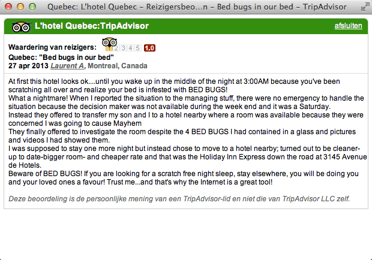
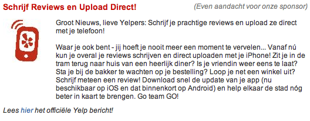

> **Historisch archief.** Deze aflevering verscheen op 2-09-2013 als onderdeel van ReputatieCoaching (2012–2016). De oorspronkelijke tekst is hieronder historisch bewaard. Diensten, contactgegevens, links, tools en adviezen kunnen inmiddels verouderd zijn.



**Transcriptiestatus:** Volledige transcriptie uit het oorspronkelijke archief.

**Hallo, mijn naam is Eduard de Boer –bekend als de ReputatieCoach– en ik heet je hartelijk welkom bij deze 40e ReputatieCoaching Podcast.**

\*\*[*Historische afbeelding niet beschikbaar: ReputatieCoaching Podcast*](https://web.archive.org/web/20131010084553/http://www.reputatiecoaching.nl/wp-content/uploads/2012/12/Reputatie-Coaching-Podcast-logo-200x200.jpg)Inmiddels ben ik alweer twee dagen terug van een heerlijke vakantie. Gedurende mijn vakantie is er volgens mij meer dan voldoende content online gekomen, terwijl ik mijn accu’s aan het opladen was in Frankrijk. Straks heb ik meer nieuws over dit experiment met contentmarketing.\*\*

**Gedurende mijn vakantie heb ik verder niets gedaan voor wat betreft het lezen van al het nieuws dat mij via de RSS-feeds bereikt. Dus toen ik begon met de voorbereidingen van deze podcast, stonden er een goede 1.300 artikelen klaar om te scannen op relevante inhoud voor de podcast.**

**Daaruit heb een beperkte selectie voor je gemaakt en een groot aantal andere onderwerpen heb ik genoteerd om later nog eens iets over te vertellen. Verder wil ik geen tijd verliezen, dus steek ik meteen van wal.**

Na de toelichting over mijn bevindingen met mijn contentmarketing experiment tijdens de vakantie kom met een paar andere onderwerpen. Het kon niet uitblijven… Ik heb nieuwtjes van Google. Als eerste zijn Google Maps en Waze nu echt geïntegreerd en inmiddels is Google Helpouts officieel aangekondigd. Ook heeft Google een officiële FAQ gepubliceerd over Google Authorship en zijn Google Hangouts binnenkort te volgen in HD.

Er lijkt een duidelijk verband te zijn ontdekt tussen de Google +1’s en de ranking in de zoekmachines… Maar is dat zo? Daarmee vind ik dat ik wel weer genoeg nieuws over Google heb.

Reviews… Als het goed is ben je altijd bezig met het spotten van kansen en gelegenheden om reviews te krijgen voor je bedrijf of je dienstverlening. Als dat niet zo is, dan zou ik er maar snel mee beginnen, want goede reviews leveren een positieve bijdrage aan je online reputatie.
Maar een negatieve review geven kan je geld kosten; dat ondervond een Canadees in Montreal, die tijdens een overnachting in een hotel werd gebeten door bedluizen.

En als je op Twitter vraagt om reviews op Yelp, gebruik dan niet @Yelp om aan te geven dat je een review op Yelp wilt.
Groupon ken je vast wel. Maar wist je dat het slecht met ze gaat? In Amerika beginnen ze nu al bedrijven te chanteren met slechte reviews op Yelp als je geen business met ze wilt doen.

Het laatste nieuwtje over Yelp van vandaag gaat over de recent vernieuwde Yelp app.

De links in deze podcast vind je zoals gewoonlijk in de shownotes, op [www.reputatiecoaching.nl/40](https://web.archive.org/web/20150312093135/http://www.reputatiecoaching.nl/40/).

## Content marketing experiment tijdens mijn vakantie

Zoals je wellicht weet, zien de zoekmachines graag dat je regelmatig goede content publiceert op je website. Dat helpt voor het verhogen van de gebruikerservaring. Het is tenslotte niet leuk voor gebruikers om te zien dat je al een paar weken geen nieuwe, verse content op je site hebt gepubliceerd. En als gebruikers niet meer naar je site komen, bestaat de kans dat je content ook lager gaat scoren in de zoekresultaten.

Met dit in het achterhoofd heb ik ter voorbereiding van onze vakantie:

```
  * 2 podcasts gemaakt
  * 2 podcast video’s gemaakt
  * 7 instructievideo’s gemaakt
  * en een aantal artikelen geschreven
```

Al deze content heb ik tijdens mijn afwezigheid van twee weken automatisch online laten verschijnen. Zo kwam er soms een paar dagen elke dag een artikel en soms zat er een dag tussen. Het lijkt erop, alsof het goed is gegaan, want de artikelen zijn gewoon gepubliceerd op de aangegeven tijden, ze zijn gelezen, gedeeld op de sociale media en ook hebben zich alweer meer luisteraars aangemeld voor de ReputatieCoaching Nieuwsbrief.

Mocht jij je nog niet hebben ingeschreven, doe dat dan nu. Want begin volgende maand komt het nieuwe ReputatieCoaching Podcast Boek uit, met daarin de transcripties van de podcasts van het derde kwartaal van 2013. Alleen de abonnees op de nieuwsbrief ontvangen de PDF-versie, die ze kunnen kopiëren op hun tablet, smartphone of eReader. Je kunt je inschrijven voor de nieuwsbrief, op </nieuwsbrief>.

Maar terugkomend op mijn contentmarketing experiment. Zoals ik al zei is dit allemaal goed verlopen en ik wil graag met je delen hoe ik dit heb aangepakt, wat er fout is gegaan en wat er allemaal bij komt kijken. Daarom schrijf ik binnenkort een aparte blogpost, waarin ik dit uit de doeken doe.

## Google Maps en Waze nu geïntegreerd

In [podcast 29](/nl/archief/reputatiecoaching/029/) vertelde ik je dat Waze in juni 2013 was overgenomen door Google en sprak ik de verwachting uit dat Google de krenten uit de Waze-pap zou halen om haar eigen product, Google Maps, te verbeteren en/of uit te breiden.

Nou, dat is inderdaad gebeurd. Op het weblog van Google Maps is allereerst te lezen dat je in Google Maps nu de realtime updates krijgt van Waze-gebruikers, zoals ongelukken, werkzaamheden, wegafsluitingen etc. Echter, deze updates zijn op dit moment alleen nog maar beschikbaar in de Android en iOS Google Maps in Argentinië, Brazilië, Chili, Colombia, Duitsland, Ecuador, Frankrijk, Mexico, Panama, Verenigd Koninkrijk, de USA en Zwitserland. Helaas moeten we in Nederland nog even wachten.

Daarnaast zijn er ook een paar vernieuwingen in Waze. Als eerste kun je Google Search in de Waze app gebruiken voor het opzoeken van adressen. En in de Waze Map Editor is nu Google Maps Streetview geïmplementeerd, waardoor community members nog gemakkelijker correcties kunnen aangeven.

## Google Hangouts in HD

Zelf heb ik al een paar keer geëxperimenteerd met Google Hangouts voor het voeren van gesprekken met diverse mensen en ook heb ik al een aantal Google Hangouts on Air gevolgd of bijgewoond. Hoewel ik de videokwaliteit al erg goed vond, gaat Google nu een stapje verder…

Steeds meer laptops en desktops zijn uitgerust met HD camera’s. Dus de komende tijd gaat Google ook HD-video introduceren op de Google Hangouts. Google is overigens overgestapt van H.264 naar VP8. De reden dat Google is overgestapt naar haar eigen videoformaat, is dat H.264 teveel processing power vergt, als je een aantal mensen in HD wilt laten streamen. Voor mobiele apparaten wordt nog wel H.264 ondersteund.

De volgende feature die binnenkort in Google Hangouts verschijnt, is Real Time Chat. Hierbij kunnen deelnemers van een Hangout met elkaar chatten via tekstberichten. De verwachting is, dat deze uitbreiding over een paar manden wordt uitgerold.

## Google Helpouts aangekondigd

Dan Google Helpouts. In [podcast 36](https://web.archive.org/web/20150312093030/http://www.reputatiecoaching.nl/36/) had ik het al over het gerucht dat Google met Helpouts ging komen. Dat gerucht is waarheid geworden. Dat wil zeggen dat Google de dienst Helpouts heeft aangekondigd, maar de service is nog niet beschikbaar. Je kunt meer informatie over Google Helpouts vinden op <http://helpouts.google.com>.

Daar is te lezen dat de dienst nog niet beschikbaar is, maar dat je je kunt aanmelden, als je interesse hebt. Zodra er dan nieuws komt over Google Helpouts, wordt je door Google op de hoogte gebracht via e-mail.

Een paar randvoorwaarden voor het aanbieden van Helpouts zijn al bekend:

```
  * Aanbieders van diensten moeten tenminste 18 jaar zijn, gebruikers tenminste 13 jaar
  * Google Wallet moet worden gebruikt voor het betalen
  * Google neemt 20% van de opbrengsten
```

Het is nog niet bekend hoe één en ander zich verder zal ontwikkelen, bijvoorbeeld hoe Google gaat voorkomen dat diensten die in het ene land niet zijn toegestaan, via een Helpout uit een ander land worden aangeboden, of diensten die vallen onder de beschermde beroepen, zoals dokters, psychiaters enzovoorts.

Wel lijkt het voor de hand te liggen dat allerhande coaches hun diensten via Helpouts gaan aanbieden. Je snapt natuurlijk wel, dat ik mij meteen heb aangemeld! Zodra ik nieuws van Google hierover krijg of lees, laat ik je het natuurlijk zo snel mogelijk weten.

## Google Authorship FAQ

Google Authorship… Ik kan niet vaak genoeg vertellen hoe belangrijk het voor jouw online reputatie is, dat je je Google Authorship claimt. Buiten wat informatie die Google in haar support-forum had staan over hoe je het moest instellen, was er niet zo bijster veel bekend. Maar enige tijd geleden heeft Google een lijst met veelgestelde vragen en bijbehorende antwoorden op haar [Webmaster Central weblog](http://googlewebmastercentral.blogspot.nl/2013/08/relauthor-frequently-asked-advanced.html) geplaatst.

Een paar belangrijke punten uit dit artikel:

```
  1. Authorship mag alleen worden gebruikt op pagina’s die door één auteur zijn geschreven. Google ondersteunt op dit moment nog geen content, waar meerdere auteurs aan hebben gewerkt.
  2. De afbeeldingen die worden gebruikt moeten echte foto’s van mensen zijn. Afbeeldingen van mascottes of logo’s zijn dus niet toegestaan.
  3. Als je artikelen in meerdere talen publiceert, moet je nog steeds teruglinken naar één en hetzelfde Google+ profiel. Je mag dus niet een apart profiel voor elke taal hebben.
  4. Als je niet wilt dat je foto bij de resultaten wordt vertoond kun je dat uitschakelen, bijvoorbeeld door je profiel verborgen te maken.
  5. Authorship is geen Publishership. Dit zijn twee volledig aparte mechanismen om relaties aan te geven. Authorship heeft betrekking op mensen die artikelen schrijven, Publishership is voor bedrijven die de publisher zijn van een totale website. Volgens Google doet zij op dit moment nog niet veel met Publishership.
  6. Authorship is niet bedoeld voor bijvoorbeeld productbeschrijvingen of productpagina’s, maar voor echte artikelen die een kop, intro en een body hebben.
```

## Verband tussen Google +1’ en ranking

Soms lees je berichten op een site met een hoge mate van autoriteit, die je dan voor waar aanneemt. Zo is er op de site [moz.com](https://moz.com) een artikel van Cyrus Shepard gepubliceerd, waarin de resultaten beschrijft van een onderzoek van Dr. Matt Peters naar het verband tussen Google +1’s en de positie in de zoekresultaten.

In het verleden is hier ook wel eens over gerept, maar toen was het nooit echt aangetoond. In het artikel “[Amazing Correlation Between Google +1s and Higher Search Rankings](https://moz.com/blog/google-plus-correlations)” lijkt dit nu dus wel aangetoond. Maar…

Helaas. Zelfs Matt Cutts van Google heeft op dit artikel gereageerd. Hij zegt dat Google de +1’s niet gebruikt voor het bepalen van de positie in de zoekresultaten. Er is volgens hem dus geen **direct** verband tussen Google +1’s en je rankings.

Maar er kan wel een logisch **gevolg** zijn van het delen van content op Google+ en het krijgen van +1’s. Want doordat een post +1’s krijgt, komt het bij meer mensen onder de aandacht. En dus wordt de kans vergroot dat mensen een link naar de post opnemen in hun artikelen of blogposts. Dus zo krijg je **indirect** via Google+ links naar je content.

Je moet nu dus niet meteen als een gek allemaal +1’s gaan verzamelen voor jouw content. Het advies is nog steeds om goede, interessante en unieke content te produceren. Die wordt op den duur heus wel beloond met +1’s door anderen en als het interessant is voor bepaalde doelgroepen, bestaat de kans dat één of meer mensen uit je doelgroep wel naar jouw content gaan linken.

## PageSpeed niet belangrijker voor mobiele ranking volgens Matt Cutts

Tot voor kort leek een aantal tekenen er op te wijzen dat Google extra waarde hecht aan het snel laden van mobiele websites. Dit lijkt op zich ook logisch, want bij een mobiel apparaat heb je over het algemeen een geringere bandbreedte. Dus als een webpage dan veel grote bestanden bevat, kost dit in de meeste gevallen over een mobiele verbinding meer tijd, dan over een vaste verbinding.

Ook het feit dat je in de Google PageSpeed tool apart het laden van een webpagina op een desktop en op een mobiel apparaat kunt testen lijkt hierop te wijzen.

Recentelijk heeft Matt Cutts in een video de vraag behandeld of de laadsnelheid van een pagina belangrijker is voor mobiele sites en of het werkelijk iets is wat de positie in de zoekresultaten kan beïnvloeden, als voor de rest alles hetzelfde is.

In onderstaande video kun je het antwoord beluisteren. Matt antwoordt op het tweede deel van de vraag dat tragere sites inderdaad lager kunnen scoren in de zoekresultaten. Maar Google kijkt niet naar absolute tijden, zoals bijvoorbeeld in seconden. Want het web reageert anders in verschillende delen van de wereld. De laadsnelheid wordt dus vergeleken met sites die uit dezelfde “buurt” of “regio” komen wordt zo dus relatief vergeleken. Dit is dus onafhankelijk van of de site op een mobiel apparaat of op een desktop wordt bekeken.

Mogelijk gaat Google in de toekomst de laadtijd van pagina’s op mobiele apparaten wel meenemen in haar ranking algoritme, maar op dit moment worden laadtijden van mobiele sites dus niet anders beoordeeld dan die van sites die via een desktop worden bekeken.

## Negatieve reviews kunnen je geld kosten

Het doel van review sites is het verzamelen van reviews. Als het goed is zijn reviews een objectieve beschrijving van een gebruikerservaring bij een bedrijf, zoals bijvoorbeeld een restaurant of hotel.


De Canadees Laurent Azoulay verbleef in april 2013 in Hotel Quebec in Montreal. Midden in de nacht werd hij wakker, doordat hij door bedluizen in zijn been werd gebeten. Gelukkig had hij de tegenwoordigheid van geest om er een paar in een glas te vangen en met zijn vangst ging hij naar de receptie. Daar werd hem een schamele vergoeding van $40 geboden en een overnachting in een ander hotel, omdat het hotel in kwestie geheel vol zat.

De gast weigerde daarop in te gaan en verliet de volgende middag het hotel, nadat hij aankomende gasten ook had gewaarschuwd voor de bedluizen. Het behoeft verder geen toelichting dat die mensen stantepede omkeerden en hun heil zochten in een ander hotel.

Ook postte de man een review op TripAdvisor, een populaire site voor reizigers. Daar beschreef hij zijn belevenis in zijn volle glorie. Dit review staat op dit moment nog steeds op TripAdivsor en ik kon hem op trefwoorden “Hotel Quebec TripAdvisor bed bugs” meteen vinden. De review heb ik ook in de show notes opgenomen.



Als gevolg het publiceren van deze review liep de clientèle van Hotel Quebec aanzienlijk terug.

Vervolgens werd de gast door een advocaat van het hotel aangeklaagd voor $95.000 als gevolg van gederfde inkomsten. De man weigert zijn review offline te nemen en is ook niet bereid de schadevergoeding te betalen.

Pas dus zeker op met negatieve reviews in landen als Amerika, waar iedereen elkaar maar om het minste of geringste aanklaagt. Of zorg ervoor dat je bewijs hebt, net zoals de hotelgast die dus de bedluizen had gevangen. Bijzonder genoeg wordt dat dus ook niet weersproken bij de aanklacht. De man wordt aangeklaagd om zijn negatieve review.

## Gebruik niet @Yelp, als je via Twitter om een review vraagt

[Vorige podcast](https://web.archive.org/web/20131023225914/http://www.reputatiecoaching.nl:80/39/) had ik het er ook al over: Yelp wil niet dat je reviews koopt. Maar volgens Yelp (en overigens ook volgens Google) mag je niet om reviews vragen. Yelp zegt dat je alleen aan klanten mag melden dat je op Yelp vermeld staat. Meer niet.

Toch zijn er veel bedrijven, zeker in Amerika, die ongegeneerd hun klanten vragen om een review, terwijl ze er ook de tekst **@Yelp** bij zetten. Dat is niet bijster handig, want zo ziet Yelp precies welke bedrijven allemaal om reviews vragen, zodat ze snel en adequaat de desbetreffende bedrijven een virtuele draai om de oren kunnen geven.

## Groupon USA verlaagt zich tot chantage met slechte reviews

In Nederland of elders in Europa heb ik er nog niet over gehoord, maar in Amerika lijkt het echt heel erg slecht te gaan met Groupon. Zo heeft een “Area Sales Manager” van Groupon in San Francisco een restaurant extreem negatieve reviews gegeven, omdat het bedrijf niet meer wilde samenwerken met Groupon, vanwege slechte ervaringen in het verleden.

Dit incident gaat op dit moment de hele wereld rond en plaatst daarmee Groupon Amerika en ook daarbuiten in een slecht daglicht. Als gevolg hiervan is ook de aandelenkoers van Groupon toen bijna 5% gedaald.

Zo zie je wat een verkeerde actie, die vervolgens breed wordt uitgemeten in de sociale media, teweeg kan brengen. Ook geeft het een signaal af voor bedrijven, dat ze extreem op hun qui vive moeten zijn voor wat betreft het handelen van hun werknemers. Voordat je het weet dalen je aandelen in waarde, omdat één van je employees iets onhandigs doet.

En aan de andere kant kunnen we hieruit leren dat het ook niet handig is om bedrijven te chanteren met negatieve reviews. Want het Yelp-account van die Groupon medewerker is inmiddels verwijderd.

## Yelp app vernieuwd

Het laatste nieuwtje van deze podcast gaat ook over Yelp. Sinds een paar weken is er een nieuwe Yelp app. Het belangrijkste aan deze nieuwe versie is dat je nu ook vanaf je mobiel reviews kunt posten. Dat kon voorheen namelijk niet.



Hiermee kom ik dan weer aan het einde van de podcast van vandaag. Als je de podcast leuk vindt en je hebt inderdaad wat aan alle informatie die ik met je deel, help mij dan met het verder verbeteren en promoten van deze podcast. Deel ‘m op Twitter, like ‘m op Facebook of geef een “+1” op Google+. Het zou helemaal super zijn, als je een bericht achterlaat op iTunes of LinkedIn.

Als je een vraag of een probleem hebt met betrekking tot je online reputatie of de vindbaarheid van je website, kun je een mailtje sturen naar [podcast@reputatiecoaching.nl](mailto:podcast@reputatiecoaching.nl). Als je dat te lastig vindt, of als je de podcast beluistert terwijl je in de auto zit en je hebt acuut een vraag, spreek dan een boodschap in op de ReputatieCoaching Hotline, op nummer: 084 - 883 15 56. Mogelijk behandel ik je vraag of probleem dan in een artikel of in de podcast.

Als laatste kun je je ook inschrijven voor de nieuwsbrief. Dan ontvang je altijd als eerste het laatste nieuws wat ik publiceer en automatisch elk kwartaal het ReputatieCoaching Podcast Boek van het afgelopen kwartaal. Surf daartoe naar [www.reputatiecoaching.nl/nieuwsbrief](https://web.archive.org/web/20131205063155/http://www.reputatiecoaching.nl/nieuwsbrief/) en schrijf je meteen in.

En je kunt rechtstreeks op de website een voicemail achterlaten, door op de tab aan de rechterkant van elke pagina te klikken, en je bericht in te spreken. Dit was [ReputatieCoaching Podast aflevering 40](https://web.archive.org/web/20150312093135/http://www.reputatiecoaching.nl/40/) en mijn naam is [Eduard de Boer](http://nl.linkedin.com/in/eduarddeboer/nl).

Ik wens je de komende week weer succes met het werken aan je reputatie, zodat je meteen je reputatie voor jou kunt laten werken!

Tot volgende week!

Doei!

[info\_box]Hieronder het overzicht van de links die in deze podcast aan bod komen:

```
  * “[New features ahead: Google Maps and Waze apps better than ever](http://google-latlong.blogspot.nl/2013/08/new-features-ahead-google-maps-and-waze.html)” (Google Maps blog, 20 augustus 2013)
  * “[Waze Brings Google Search and Street View to the Community](http://www.waze.com/blog/waze-brings-google-search-and-street-view-to-the-community/)” (Waze blog, 20 augustus 2013)
  * “[Google Plus Hangouts to Upgrade to HD](https://www.reelseo.com/google-hangouts-upgrade-hd/)” (RealSEO, 28 augustus 2013)
  * “[rel=”author” frequently asked (advanced) questions](http://googlewebmastercentral.blogspot.nl/2013/08/relauthor-frequently-asked-advanced.html)” (Google Webmaster Central Blog, 21 augustus 2013)
  * “[Amazing Correlation Between Google +1s and Higher Search Rankings](https://moz.com/blog/google-plus-correlations)” (MOZ Blog, 20 augustus 2013)
  * “[Hotel Sues Guest For 95K Over Bad Review, Bedbugs](https://web.archive.org/web/20130901040224/http://blog.sweetiq.com:80/2013/08/hotel-sues-guest-for-95k-over-bad-review/?)” (SweetIQ, 22 augustus 2013)
  * “[Tip: If You’re Asking for Yelp Reviews on Twitter, Don’t Tweet @Yelp](http://www.smallbusinesssem.com/if-youre-asking-for-yelp-reviews-on-twitter-dont-tweet-yelp/7542/)” (Small Business Search Marketing, 23 augustus 2013)
  * “[Groupon Rep Threatens Sf Restaurant, Posts Bad Reviews](https://web.archive.org/web/20130827123855/http://blog.sweetiq.com/2013/08/groupon-rep-threatens-sf-restaurant-posts-bad-reviews/)” (SweetIQ, 18 augustus 2013)
  * "[Oh snap, Yelp app: now post reviews straight from your mobile device!](http://officialblog.yelp.com/2013/08/oh-snap-yelp-app-now-post-reviews-straight-from-your-mobile-device.html) (Yelp Web Log, 13 augustus 2013)[/info_box]
```
