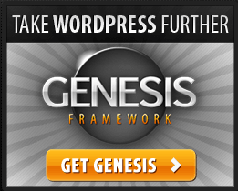
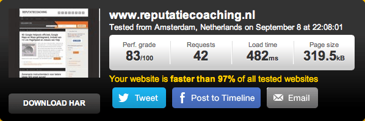
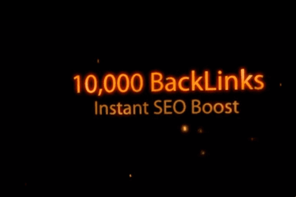

> **Historisch archief.** Deze aflevering verscheen op 9-09-2013 als onderdeel van ReputatieCoaching (2012–2016). De oorspronkelijke tekst is hieronder historisch bewaard. Diensten, contactgegevens, links, tools en adviezen kunnen inmiddels verouderd zijn.

**Transcriptiestatus:** Volledige transcriptie uit het oorspronkelijke archief.

**Hallo en hartelijk welkom bij deze 41e aflevering van de ReputatieCoaching Podcast.**

***Historische afbeelding niet beschikbaar: ReputatieCoaching Podcast*
Mijn naam is Eduard de Boer, ook bekend als de ReputatieCoach. Dit is dé podcast die je moet beluisteren als je wilt werken aan je online reputatie en je online vindbaarheid wilt verbeteren. Dit alles kan je helpen om jezelf beter op de online kaart te plaatsen, waardoor je als bedrijf meer business kunt doen.**

Ook als persoon kun je met de diverse tips aan de slag om bijvoorbeeld je online reputatie als accountant, banketbakker, ICT’er, artiest of wat dan ook te verbeteren.

Vandaag heb ik een paar onderwerpen voor je. Het eerste onderwerp gaat over de nieuwe site layout. Het tweede onderwerp van vandaag is de overname van Nokia door Microsoft. Daarna vertel ik je waarom je nooit 10.000 links voor 5 dollar moet kopen.
Een luisterares vroeg of ze meerdere domeinnamen naar hetzelfde weblog kon laten verwijzen om zo beter te scoren in de zoekmachines. Als afsluiting heb ik weer twee lijstjes voor je. Het eerste lijstje bevat 8 tips voor het bedenken en produceren van lokaal georiënteerde content en het tweede lijstje is een samenvatting van een artikel op Frankwatching met 10 tips voor betere social media updates.

## Site layout vernieuwd!

Trouwe bezoekers hebben het natuurlijk al wel gezien: de website is vernieuwd! Dat wil zeggen: ik heb een ander theme geïnstalleerd. Ik was namelijk bezig met pogingen de snelheid van de site verder te vergroten, maar ik liep tegen een aantal beperkingen aan en kreeg de laadtijd van de pagina’s op de site eigenlijk niet onder de vier seconden. Sterker nog: soms was de laadtijd wel zeven seconden of langer, terwijl voor een goede gebruikerservaring de gemiddelde laadtijd toch echt onder de twee seconden moet blijven.

[](http://www.studiopress.com)

Het trage laden van de pagina’s leek te liggen in het theme wat ik gebruikte. Ongeacht wat ik probeerde te verbeteren of versnellen aan de server: de site zelf zou toch niet echt veel sneller worden. Dus ging ik op zoek naar informatie over themes, die bekend stonden om hun korte laadtijden, maximale optimalisatie en ook nog eens responsive waren. Zo stuitte ik op twee frameworks voor WordPress themes, die door veel professionele weblogs worden gebruikt, te weten:

```
  * [Thesis](http://diythemes.com/), en
  * [Genesis](http://www.studiopress.com/)
```

Na flink wat te hebben gelezen, heb ik gekozen voor Genesis. Dit dus niet echt een theme op zich, maar een framework dat maximaal is geoptimaliseerd. Daar bovenop moet je dus dan nog een theme, of “child theme” zoals het binnen Genesis heet, kiezen en aanschaffen.

Mijn vorige theme had ik ook gewoon gekocht. Ik heb geen enkel probleem om geld te betalen voor iets waar ik baat bij heb. Maar bij elkaar was het Genesis Framework en het Streamline “child cheme” US$79,95, best wel prijzig voor een theme en dus aarzelde ik wel voor ik overging tot aanschaf. Die tachtig dollar bleek te zijn samengesteld uit zo’n zestig dollar voor het framework en twintig voor het theme.

Ik had zoveel positiefs gelezen over Genesis dat ik besloot het risico te lopen en het framework met theme kocht. En tjongejonge wat werd ik verrast!

Ik hoefde helemaal niet zoveel aan te passen en “Wauw!” wat laadden alle pagina’s opeens snel! Ik ging dan ook snel aan het testen met de [Google Pagespeed Insights tool](https://developers.google.com/speed/pagespeed/insights/) om te zien wat voor score de site nu kreeg bij Google. Die zat met het vorige theme zelfs nog onder de 80 punten van de 100 die je maximaal kunt scoren. Dat zat wel snor: alle pagina’s scoorden nu zo rond de 90 à 92 punten! Dat was mooi meegenomen!

De site voelde meteen ook een stuk sneller, dus naast dat ik geïnteresseerd was in de score volgens Google, was ik ook erg benieuwd naar de laadtijden van de pagina’s. Dus testte ik de snelheid met de [PingWebsite Speed Test](http://tools.pingdom.com/fpt/) tool. Die gaf keer op keer aan, dat de pagina’s nu laadden in zo’n 400 milliseconden! Dat noem ik nu nog eens een verbetering!



Ik liep wel tegen een paar kleine dingetjes aan, die ik nog moet fixen. Zo is het hoofddeel van de blogposts iets smaller dan voorheen en nu steken video’s iets uit aan de rechterkant. Dus moet ik met terugwerkende kracht de artikelen waar video’s in staan, deze iets kleiner tonen op de pagina: in plaats van 640 bij 360 pixels, moet ik ze nu op 600 bij 340 pixels weergeven.

Zelf ben ik supertevreden over het resultaat! Ik ben echter wel benieuwd wat jij vindt van het huidige design. Vind je het prettiger leesbaar en ervaar jij ook dat de site een stuk sneller is? Laat het me weten als een reactie onderaan de transcriptie van deze podcast. Die kun je vinden op [www.reputatiecoaching.nl/41](/nl/archief/reputatiecoaching/041/).

## Microsoft koopt Nokia

Afgelopen week werd bekend dat Nokia is overgenomen door Microsoft voor een slordige US$7.2 miljard. Maar ik hoor je denken: “Wat heeft dat te maken met lokale vindbaarheid, reputatie et cetera?”. Nou, het heeft totaal geen relatie met online reputatie, maar wel met lokale vindbaarheid…

Want het geval wil dat Nokia in 2007 het kaartenbedrijf Navteq heeft gekocht voor toentertijd US$8.1 miljard. Maar inmiddels is bekend geworden dat Nokia per jaar zo’n 1 miljard dollar verlies lijdt op Navteq. Op zich is dat niet bijzonder, want ook concurrent Google besteedt per jaar zo’n 1 miljard dollar aan het actueel houden van Google Maps. Dat zijn natuurlijk gigantische bedragen! En Google heeft nu eenmaal veel inkomsten en kan die kosten wel maken, hoewel Google Maps nog niet echt een winstgevend model is, maar een kostenpost.

Terugkomend op waarom dit mogelijk interessant is: Nokia heeft het kaartenmateriaal van Navteq beschikbaar gesteld op [here.com](http://here.com/). Dat is een regelrechte concurrent van Google Maps. Maar in de deal heeft Microsoft alleen de telefonietechnologie van Nokia gekocht. Daarmee is [Here](http://here.com/) dus nog steeds eigendom van Nokia. Microsoft gebruikt echter de data van [Here](http://here.com/) wel in licentie en blijft dat ook voor de komende jaren doen ten behoeve van [Bing Maps](http://www.bing.com/maps/).

Hoewel Bing Maps en Bing Local in Nederland nog niet echt voorhanden zijn, is mijn advies voor jou om je bedrijf nu toch ook alvast wel aan te melden op [Here.com](http://here.com/). Dan sta je er alvast vermeld, dat kan nooit kwaad! Als je je hebt aangemeld, zal Nokia naar het bedrijfsadres een kaartje sturen met een PIN-code om je aanmelding te bevestigen. Maar mocht je de wachttijd bij Google Maps al lang vinden, bereid je dan maar voor op een nog veel langere tijd bij Nokia. Ik moest zo’n zes of zeven weken wachten op het kaartje…

Oh, mocht je op zoek zijn naar de links van deze sites die ik hiervoor allemaal heb genoemd, die kun je vinden onderaan de show notes op [www.reputatiecoaching.nl/41/](/nl/archief/reputatiecoaching/041/).

## 10.000 links voor US$ 5?!

Hoewel je in het verleden hoger in de zoekresultaten kon komen, als je maar meer links naar je site had dan al je concurrenten, is dat tegenwoordig niet meer het geval. Toch zie je nog steeds aanbiedingen op Internet voor duizenden backlinks, contekstuele .EDU-backlinks, linkpiramides en honderden persberichten voor een schamele US$5. Zoek op de site [Fiverr.com](http://fiverr.com/gigs/search?query=backlinks) maar eens op het trefwoord “backlinks”. Ik vond tijdens het maken van deze podcast maar liefst 7.546 resultaten op deze zoekterm. Overigens, “Fiverr” schrijf je als: “F-I-V-E-R-R”.



Vooral mensen die een website hebben en af en toe eens iets lezen over het scoren in de zoekmachines stuiten vaak nog op allang achterhaalde informatie, waarin wordt beschreven dat je maar zoveel mogelijk links naar je site moet hebben, wil je hoger scoren dan je concurrenten. En dan lijkt zo’n “fantastische” aanbieding voor slechts US$5 te mooi om waar te zijn en een snelle, gemakkelijke en bovenal goedkope route naar de top in de zoekresultaten.

Meestal is datgene wat te mooi lijkt om waar te zijn, ook precies datgene te zijn… Namelijk: te mooi om waar te zijn! Oh, je krijgt heus wel je links! En meestal krijg je van de aanbieders ook nog wel een bonus of iets dergelijks, dus nog meer links. Geloof me: deze links helpen je echt niet naar de top! Nee, ze helpen je site eerder naar de kelder!

Stel je hebt met moeite de afgelopen twee jaar of zo een goede 50 backlinks naar je site gekregen. Moet je je eens voorstellen wat Google van jouw site gaat denken, als ze binnen een paar weken opeens 10.000 links naar jouw site detecteren. En wat als die links staan tussen allemaal porno-, viagra en casinogerelateerde links naar Engelstalige of anderstalige sites… Hoe waardevol zal Google die links dan vinden?

Juist: **NUL!** Of erger nog: **ONDER NUL!** Want het beleid van Google is dat je nooit links naar je site mag kopen en het ligt er dik bovenop dat die 10.000 links die je opeens het “verworven”, zijn gekocht. Dus wat er dan in het beste geval gebeurt, is dat je site niet meer vindbaar is in de zoekresultaten en als je een beetje pech hebt krijg je van Google een penalty, waardoor jouw site helemaal niet meer kan worden gevonden in Google. Hmmm… “From Hero to Zero for only US$5”… Daar word je dan echt niet vrolijk van!

Ik heb het al vaker gezegd: goede backlinks moet je verdienen. Daarom spreekt men tegenwoordig ook vaker van “linkearning” dan “linkbuilding”. En om je een indicatie te geven: mocht je een link op een kwalitatief goede site willen kopen, dan moet je al snel rekenen op zo’n EUR 100 per jaar of meer… Voor één link!

Mijn advies is dus: koop nooit of te nimmer links! Dat is gewoon het beste! Blijf goede content produceren met een zekere regelmaat, die ook nog eens interessant wordt gevonden door je lezers en bezoekers van je site. Houd dat vol! En blijf het volhouden! De route naar online succes kun je niet afsnijden!

## Meerdere domeinnamen voor hetzelfde weblog

Luisterares Brechtje vroeg laatst of het beter was voor de vindbaarheid om meerdere domeinnamen te koppelen aan hetzelfde weblog. Ze wilde zowel brechtjehendriks.com als brechtje.de laten verwijzen naar dezelfde content.

Kort gezegd moet je dit niet doen. Voor 2011 kon dit allemaal wel, maar Google is slimmer geworden door de jaren heen. In mei 2011 heeft Matt Cutts van Google al een video opgenomen, waarin hij zegt dat het op zich geen probleem hoeft te zijn:

Dus mijn advies aan Brechtje is om enkel en alleen een weblog in te richten op brechtjehendriks.com en de domeinnaam brechtje.de gewoon geclaimd te houden, om te voorkomen dat iemand anders zich die toeeigent.

Later van de week zal ik een artikel publiceren, waarin ik hier dieper op in ga.

## Lokale content hoeft niet duur te zijn

Soms zeggen mensen wel eens tegen mij dat ze ofwel geen tijd hebben voor het schrijven van content, of beter: lokaal georiënteerde content en dat het te duur is, als ze het laten doen. Dus geven ze hun geld liever uit aan een infographic of zo. Of nog erger: ze spenderen US$5 aan 10.000 backlinks, waar ik het eerder al over had.

Vaak wordt er dus moeilijk gedaan over content. Maar als je goed om je heenkijkt, is content **overal**! Denk eens aan:

```
  * Je medewerkers in het bedrijf
  * Het ontwerp of de architectuur van je pand
  * De geschiedenis van je pand
  * Je producten en diensten
  * Vragen die je vaak krijgt van klanten of patiënten
  * De menus en gerechten die je serveert
  * De waarden en normen in je bedrijf
  * De geschiedenis van je bedrijf
  * Je klanten
  * Je leveranciers
```

Al deze onderwerpen kun je op één of andere manier wel relateren aan je locatie. Wees creatief! Bedenk dat je heus niet vijf dagen in de week verse content hoeft te publiceren! En als je eenmaal inspiratie hebt: schrijf dan gewoon een paar stukken content die je in de toekomst online kunt laten verschijnen.

Als je dan verder wilt gaan met het produceren van lokaal-georiënteerde content kun je wellicht iets met de volgende 8 tips.

**1. Onderzoek je lokale zoektermen en maak een plan**

Voordat je je blog gaat optimaliseren voor betere lokale vindbaarheid, moet je weten waarop er zoal in je plaats of regio wordt gezocht door mensen. En je moet erachter komen welke lokale zoektermen verkeer naar je weblog brengen, het effect van dit verkeer en of je hiermee wel het juiste verkeer naar je website trekt. Want als mensen slechts doorklikken naar je site om daarna binnen een paar seconden op de “Back”-knop te klikken zonder iets te kopen of zich in te schrijven, dan heb je er niets aan.

**2. Associeer je producten/diensten met je locatie(s) in je blogposts**

Maar al te vaak zie je dat bedrijven in de artikelen of productbeschrijven op hun website zich helemaal niet richten op de locatie. Dat is een gemiste kans. Probeer je content zoveel mogelijk om je locatie te schrijven, zonder dat je “spammy” overkomt. Vergeet niet dat je voor mensen moet schrijven en niet voor de zoekmachines!

**3. Maak gebruik van lokale evenementen**

Lokale evenementen zijn bij uitstek geschikt om artikelen over te schrijven, die op één of andere manier zijn gerelateerd aan jouw bedrijf, je producten of je diensten. Als je op een beurs staat, zorg er dan voor dat je op de website van die beurs met al je bedrijfsgegevens correct wordt vermeld en wel natuurlijk een link naar je website staat.

Of denk er eens over of je wellicht een evenement voor een goed doel kunt sponsoren, om zo meer bekendheid te krijgen. Als er een podcast in of over je plaats is, probeer dan daarvoor uitgenodigd te worden, bijvoorbeeld voor een interview. Of vraag een lokale blogger of hij of zij je wil interviewen.

Radiostations, podcasters en bloggers zitten vrijwel altijd om content verlegen en zullen je dankbaar zijn, als je zelf met een origineel idee of initiatief komt.

**4. Vermeld andere lokale specialisten, buiten je eigen vakgebied**

Stel een fitness-centrum heeft een masseur en een fysiotherapeut onder haar dak. Laat die mensen dan ook eens artikelen publiceren op de website van het fitness-centrum.

Mocht dit niet het geval zijn, interview dan gewoon andere specialisten.

**5. Maak gebruik van de seizoenen**

Sommige content is echt seizoensgebonden en ook sommige bedrijven zijn seizoensgebonden. Zo kan ik me voorstellen dat mensen in de winter minder snel op zoek zijn naar een ijssalon. Op die momenten kan het handig zijn om artikelen te posten over andere positieve karakterstieken van het bedrijf, zoals bijvoorbeeld dat het gratis WiFi heeft, of over de achtergrond van de geserveerde koffie enzovoorts.

**6. Participeer in de lokale gemeenschap en deel je activiteiten**

Lokale bedrijven en organisaties zijn over het algemeen actiever in de lokale gemeenschap, dan landelijke merken en bedrijven. Bloggen over wat je doet, of over wat je medewerkers doen in lokale activiteiten kan ook kansen bieden voor lokaal getinte content. Maak anders ook eens een video van iets lokaals.

**7. Promoot je blog op de social media**

Als je je blogberichten in de social media promoot, denk er dan aan om de plaats of regio ook te gebruiken in de titel of aankondiging. Gebruik de plaatsnaam als hashtag in Twitter, Google+ of Facebook.

**8. Focus je niet alleen op lokale SEO, maar produceer ook waardevolle content**

Lokale SEO is belangrijk, natuurlijk! Maar het is slechts een deel van alles wat je moet doen, wil je je met je bedrijf of organisatie in je stad, plaats of regio onderscheiden van de rest. Dus naast dat je continu moet werken aan het verkrijgen van meer citations (je weet wel: bedrijfsvermeldingen met je bedrijfsnaam, je adres, postcode en telefoonnummer), moet je echt ook waardevolle lokale content produceren.

Er zijn nog steeds mensen die denken dat je met geen of weinig inspanning probleemloos in de top van de zoekresultaten terecht kunt komen. Nou, laat ik je dan uit je droom helpen: dat kan tegenwoordig echt niet meer. Je zult er aan moeten werken en hard! Het probleem is namelijk: als jij het niet doet, dan doet je concurrent het wel en vergroot hij of zij de voorsprong nóg meer!

## 10 tips voor betere social media updates

Zojuist had ik het over het promoten van je blog op de social media. Daar kan vaak ook nog wel het één en ander aan worden verbeterd. Op Frankwatching kwam ik het artikel “[10 tips voor betere social media updates](https://www.frankwatching.com/archive/2013/08/26/10-tips-voor-betere-social-media-updates-infographic/)” door Bianca van de Ketterij (van [iBianca](http://www.ibianca.nl/)) tegen. Bianca heeft aan de hand van een infographic van “[The Social Skinny](http://thesocialskinny.com/10-quick-tips-for-better-status-updates-infographic/)” een tiental nuttige aanbevelingen toegelicht.

Ik kan je aanraden de toelichtingen op haar tips te lezen in het artikel, waarvan je de link in de show notes vindt. Hier beperk ik me even tot het kort opsommen van de 10 tips:

```
  1. Meld interessante feiten
  2. Geef tips
  3. Deel je mening
  4. Vraag niet altijd; durf ook stellig te zijn
  5. Zorg voor actie
  6. Laat je volgers weten wat ze kunnen verwachten
  7. Gebruik eens een P.S. (Post Scriptum)
  8. Gebruik verkorte links
  9. Gebruik niet alleen tekst, maar ook beeld, zoals foto’s of video
  10. Vraag volgens naar hun mening
```

Met deze “10 tips voor betere social media updates” kom ik dan weer aan het einde van de podcast van vandaag. Als je de podcast leuk vindt en je hebt inderdaad wat aan alle informatie die ik met je deel, help mij dan met het verder verbeteren en promoten van deze podcast. Deel ‘m op Twitter, like ‘m op Facebook of geef een “+1” op Google+. Het zou helemaal super zijn, als je een bericht achterlaat op iTunes of LinkedIn.

Als je een vraag of een probleem hebt met betrekking tot je online reputatie of de vindbaarheid van je website, kun je een mailtje sturen naar [podcast@reputatiecoaching.nl](mailto:podcast@reputatiecoaching.nl). Als je dat te lastig vindt, of als je de podcast beluistert terwijl je in de auto zit en je hebt acuut een vraag, spreek dan een boodschap in op de ReputatieCoaching Hotline, op nummer: 084 - 883 15 56. Mogelijk behandel ik je vraag of probleem dan in een artikel of in de podcast.

Als laatste kun je je ook inschrijven voor de nieuwsbrief. Dan ontvang je altijd als eerste het laatste nieuws wat ik publiceer en automatisch elk kwartaal het ReputatieCoaching Podcast Boek van het afgelopen kwartaal. Surf daartoe naar [www.reputatiecoaching.nl/nieuwsbrief](/nl/archief/reputatiecoaching/041/) en schrijf je meteen in.

En je kunt ook rechtstreeks op de website een voicemail achterlaten, door op de tab aan de rechterkant van elke pagina te klikken, en je bericht in te spreken. Dit was [ReputatieCoaching Podast aflevering 41](/nl/archief/reputatiecoaching/041/) en mijn naam is [Eduard de Boer](http://nl.linkedin.com/in/eduarddeboer/nl).

Ik wens je de komende week weer succes met het werken aan je reputatie, zodat je meteen je reputatie voor jou kunt laten werken!

Tot volgende week!

Doei!

Hieronder het overzicht van de links die in deze podcast aan bod komen:

```
  * [Thesis](http://diythemes.com/) voor Wordpress
  * [Genesis](http://www.studiopress.com/) framework voor WordPress
  * [Google Pagespeed Insights](https://developers.google.com/speed/pagespeed/insights/)
  * [Pingdom Website Speed Test](http://tools.pingdom.com/fpt/)
  * [Here.com](http://here.com/)
  * [Bing Maps](http://www.bing.com/maps/)
  * “[Microsoft To Acquire Most Of Nokia For $7.2 Billion](https://www.seroundtable.com/microsoft-acquires-nokia-17317.html)” (SE Roundtable, 3 september 2013)
  * “[Microsoft Explains the Rationale Behind the Nokia Deal](http://allthingsd.com/20130902/microsoft-explains-the-rationale-behind-the-nokia-deal/)” (AllThings D, 2 september 2013)
  * “[10 tips voor betere social media updates](https://www.frankwatching.com/archive/2013/08/26/10-tips-voor-betere-social-media-updates-infographic/)” (Frankwatching, 26 augustus 2013)
```
