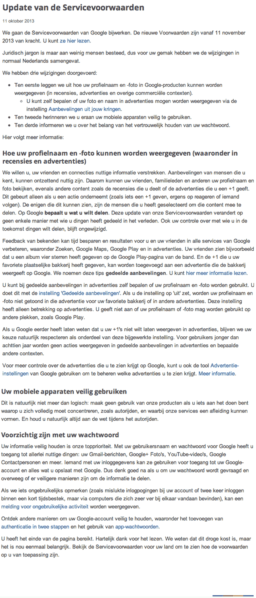
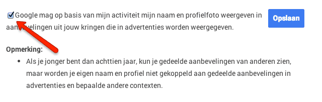
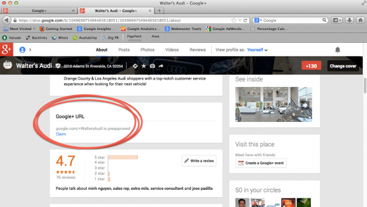

> **Historisch archief.** Deze aflevering verscheen op 14-10-2013 als onderdeel van ReputatieCoaching (2012–2016). De oorspronkelijke tekst is hieronder historisch bewaard. Diensten, contactgegevens, links, tools en adviezen kunnen inmiddels verouderd zijn.

**Transcriptiestatus:** Volledige transcriptie uit het oorspronkelijke archief.

***Historische afbeelding niet beschikbaar: ReputatieCoaching Podcast*
De podcast van vandaag begin ik met “Klout-orship”. Nee, geen “Authorship” maar inderdaad “Klout-orship”. Als je wilt weten wat dat nu weer is, blijf dan zeker luisteren! Dan is er weer nieuws over Yelp, Foursquare en Google, gevolgd door twee video’s van Matt Cutts. Als laatste heb ik vandaag Robert Spakman in de show voor een interview. Robert is oprichter en directeur van [Rooomer.com](http://www.rooomer.com/), het bedrijf achter [MeetingroomReview.com](http://www.meetingroomreview.com/), waar ik het vorige week over had.**

## “Klout-orship” op Bing

In de introductie noemde ik al “Klout-orship”. Ik refereerde daarmee niet aan Google Authorship. Over [Google Authorship instellen](https://web.archive.org/web/*/https://www.reputatiecoaching.nl/wiki/google-authorship/) heb ik al vaker geschreven. En lang geleden, in [podcast 8](/nl/archief/reputatiecoaching/008/) heb ik je al eens verteld over Klout.

Klout is een systeem wat op basis van jouw online activiteit en contacten etc. je een score van 1 tot 100 geeft, wat een indicatie is voor de mate waarin je anderen online kunt beïnvloeden. Op 21 januari, toen ik podcast 8 uitbracht, lag mijn Klout score rond de 51 à 52. Op dit moment is die 50. Dus blijkbaar heb ik mijn invloedssferen de afgelopen maanden nog niet echt vergroot.

Tot op heden heb ik altijd een beetje argwanend naar Klout gekeken, omdat ik me afvroeg in welke mate het nu zou kunnen bijdragen aan je online reputatie. Maar deze week is daar verandering in gekomen. Ik las namelijk op het weblog van Klout het artikel “[*Connect Your Social Profiles to Bing with Klout-verified Snapshots*](http://blog.klout.com/2013/10/bing-klout-verified-snapshots/)”.

Dit artikel beschrijft de koppeling tussen Klout en Bing, waarbij de Klout-gegevens die jij als openbaar markeert, worden getoond in de Bing zoekresultaten. OK, Bing is bij lange na niet zo populair als Google, maar toch zijn er ook mensen die Bing gebruiken voor hun zoektochten op Internet. En daarom is het natuurlijk altijd goed om je ook op Bing goed te presenteren en te profileren.

Ik heb [2-factor authenticatie aanstaan](https://web.archive.org/web/*/https://www.reputatiecoaching.nl/2-factor-authenticatie-op-linkedin-instellen/) op mijn LinkedIn profiel. Dus als ik dan wil inloggen moet ik mijn e-mailadres en wachtwoord invullen, waarna ik een SMS-je krijg met een extra code die ik ook moet invullen.

Echter, als gevolg van een storing met ofwel mijn iPhone, ofwel de verbinding met T-Mobile, kon ik tijdens het maken van deze podcast niet inloggen om dit zelf uit te proberen. T-Mobile krijgt van mij wel de pluim van de week, die ik al een tijd niet meer heb uitgedeeld. De reden dat de “Pluim van de week” naar T-Mobile gaat, is dat zij zelfs op zondagmiddag keurig en adequaat mij via Twitter proberen te helpen het probleem op te lossen.

Zodra ik hier verder in heb kunnen duiken, laat ik je het natuurlijk weten.

## Yelp nu ook mobiele reviews op Android

*Historische afbeelding niet beschikbaar: Logo Yelp*
Een paar afleveringen geleden, in [podcast 40](/nl/archief/reputatiecoaching/040/), vertelde ik je over de vernieuwde Yelp-app voor iOS. Vanaf dat moment was het mogelijk om op alle iDevices reviews te posten met behulp van de Yelp-app. Inmiddels is het duidelijk dat Yelp tevreden is over de resultaten. Want vanaf deze week is het ook voor Android-gebuikers mogelijk om met behulp van hun [Yelp app voor Android](http://officialblog.yelp.com/2013/10/android-users-prepare-for-a-thumb-workout-with-todays-addition-of-mobile-reviews.html) reviews te posten, terwijl ze onderweg zijn.

Yelp meldde hierover het volgende:

Het blijkt dus dat het gedrag van mobiele gebruikers erg lijkt op dat van desktop Yelp-gebruikers. Ondanks het feit dat je op een smartphone iets minder snel en foutloos kunt typen, nemen Yelpies toch de moeite om vergelijkbare reviews te typen, als ze voorheen alleen in de browser op hun desktop konden.

## Google past gebruikersvoorwaarden aan

*Historische afbeelding niet beschikbaar: Winterschoonmaak bij Google*
Google past haar gebruikersvoorwaarden per 11 november aanstaande aan. Dat het bedrijf daarbij moeite doet om transparant te zijn (en dus eventuele reacties op voorhand probeert te voorkomen), blijkt wel uit het feit dat ze niet alleen een artikel op haar website plaatst, maar mij vervolgens ook nog een mail stuurt en een blauwe balk bovenin de browser toont, terwijl ik ben ingelogd en op Google+ het bekende belletje rood kleuren met een nieuw bericht.

In de show notes –die je overigens kunt vinden op [www.reputatiecoaching.nl/46/](/nl/archief/reputatiecoaching/046/)– heb ik de tekst van het artikel overgenomen:



De belangrijkste wijzigingen zijn:

**1. Profielnamen en profielfoto’s kunnen worden weergegeven in recensies en advertenties**
Dit gebeurt alleen als jij dat toestaat. Je kunt dat eenvoudig uitzetten, door in te loggen op Google+, naar je Account-instellingen te gaan, verder te klikken op “Aanbevelingen uit jouw kringen” en het vinkje uit te zetten. Dit is ook te zien in het plaatje wat ik heb opgenomen in de show notes.



**2. Veilig gebruik op mobiele apparaten**
Google adviseert je om tijdens het rijden geen gebruik te maken van mobiele apparaten.

**3. Wees voorzichtig met je wachtwoord**
Google heeft nu ook opgenomen dat je voorzichtig moet omgaan met je wachtwoord. Wellicht is dit ten overvloede, maar het zal nu wel expliciet zijn opgenomen, om eventuele aansprakelijkheid te voorkomen.

Je kunt de volledige gebruikersvoorwaarden, zoals die voor Nederland gelden, lezen op de [Servicevoorwaarden van Google](https://www.google.nl/intl/nl/policies/terms/update/regional.html) pagina, waarvan ik de link in de show notes heb opgenomen.

## Custom Google+ URLs

Voor de grootheden in de wereld, waaronder artiesten en bepaalde merknamen was het al mogelijk: de zogenaamde vanity URLs op Google+. Zo was bijvoorbeeld Toyota vanaf augustus 2012 al gemakkelijk op Google+ te benaderen, door [+toyota](http://plus.google.com/+toyota/) als pagina op Google+ in te typen en Lady Gaga had een gemakkelijk te onthouden pagina [+LadyGaga](http://plus.google.com/+LadyGaga/) .

Voor gewone stervelingen bleven de vanity URLs echter nog buiten bereik. Maar sinds enige tijd lijken er meer en meer geverifieerde Google+ Zakelijke pagina’s hun eigen vanity URL te krijgen. Ik heb het voor alle pagina’s waar ik manager en/of eigenaar van ben gecontroleerd, maar kon het nog niet vinden. Op de site van [PCG Digital Marketing](http://www.pcgdigitalmarketing.com/20131001-google-plus-custom-url/) las ik dat je moet inloggen op Google+, naar de gewenste pagina gaan en als je daar dan het plaatje ziet, wat ik heb opgenomen in de show notes:



dan kun je je eigen Google+ vanity URL instellen. Let bij het instellen wel op, of de gewenste URL goed is. Want als je ’m eenmaal hebt geaccepteerd, kun je ’m niet meer wijzigen.

## Matt Cutts video’s

Afgelopen weken zijn er ook weer een paar video’s van Matt Cutts verschenen. De eerste video behandelt de vraag: “Waarom verandert de PageRank van mijn site niet?”. De vragensteller meldt dat hij meer waardevolle content heeft gepubliceerd, maar dat hij geen veranderingen in de PageRank ziet.

```
  * PageRank wordt slechts periodiek bijgewerkt en minder frequent dan voorheen. Tegenwoordig wordt de PageRank maar een paar keer per jaar geactualiseerd.
  * De toolbar PageRank wordt minder gebruikt, want Internet Explorer laat je tegenwoordig geen toolbars meer installeren en voor Chrome is er geen toolbar.
  * En niet geheel onbelangrijk: PageRank gaat niet over de content, maar over de links _naar_ en _binnenin_ je site. Een goede linkarchitectuur kan bijdragen tot een betere PageRank score.
```

Een andere video die deze week uitkwam, behandelde de vraag of het redirecten van gebruikers op basis geodata door Google wordt gezien als spam, omdat mogelijke andere content wordt getoond aan zoekmachines, dan aan de gebruikers.

```
  * Geo-informatie is geen spam. Dus het doorsturen van iemand naar een Franstalige pagina, als die bezoeker met een IP-adres uit Frankrijk je site bezoekt, is volledig legaal.
  * Zoals altijd moet je zoekmachines niet anders behandelen, als dat je een gebruiker behandelt. Dus als Googlebot op je site komt, check je het IP-adres en bepaal je uit welk land het komt.
  * Het tonen van content ‘X’ aan gebruikers en content ‘Y’ aan zoekmachines wordt beschouwd als “cloaking” en is niet toegestaan.
```

## 3 updates van Foursquare

*Historische afbeelding niet beschikbaar: Foursquare*
Ik had het zojuist over Yelp. Maar niet alleen Yelp is constant bezig met het verder uitbreiden en verbeteren van haar diensten. Ook Foursquare gaat gestaag door. Recentelijk heeft [Foursquare een paar updates doorgevoerd](http://www.pcgdigitalmarketing.com/20131001-google-plus-custom-url/).

De eerste uitbreiding is “real-time aanbevelingen”. Wanneer je ergens arriveert kan Foursquare je vertellen wat daar leuk of interessant is om te doen. Op dit moment heeft slechts een kleine groep van Foursquare gebruikers deze mogelijkheid, maar de komende tijd zal het voor steeds meer gebruikers worden aangezet.

Verder heb je een “Nearby” knop om te zien wie in de buurt is. Ik heb eens even in mijn Foursquare app gekeken, maar ik vind persoonlijk respectievelijk Leusden en Amsterdam nu niet echt uitermate dichtbij. Deze twee plaatsen kreeg ik namelijk te zien, waar vrienden recentelijk hadden ingecheckt.

De derde update is dat de app nu meteen de meest recente checkin van elke vriend laat zien. Als je dan meer wilt weten, dan kun je op de naam klikken en het profiel bekijken, evenals de historie.

## Interview met Robert Spakman van MeetingroomReview.com

Vorige week had ik het in de podcast over de nieuwe review website die ik had ontdekt naar aanleiding van een artikel op FrankWatching, te weten: “MeetingroomReview.com”.

**In de transcriptie vind je alleen de vragen. Voor de antwoorden verwijs ik je naar de audio van de podcast.**

In de show van vandaag heb ik Robert Spakman. Robert is oprichter en directeur van Rooomer –het bedrijf achter MeetingroomReview– en ik mag hem aan de tand voelen over dit succesvolle en bovenal nieuwe concept.


Robert, allereerst bedankt dat je tijd kon en wilde vrijmaken voor dit interview in de ReputatieCoaching Podcast. Ik vind het ontzettend leuk om je in de show te hebben, omdat ik verwacht dat een deel van de luisteraars naar aanleiding van dit gesprek meteen aan de slag kan.

```
  1. _Voordat we in het bedrijf Rooomer en de website MeetingroomReview.com duiken, Robert, kun je iets meer vertellen over de persoon “Robert Spakman”, zodat de luisteraars een idee hebben wie er tegenover me zit?_
  2. _Dan is er het bedrijf “Rooomer”, met drie ‘o’-s. Ik las op www.rooomer.com dat het bedrijf is opgericht in 2013 om een online brug te slaan tussen organisatoren van vergaderingen en vergaderlocaties. Kun je daar iets meer over vertellen?_
  3. _Dus Rooomer is voor het bij elkaar brengen van vergaderlocaties en de organisatoren van de vergaderingen. Op zich is dan het verzamelen van de mening van de bezoekers van vergaderlocaties een logische volgende stap. Hoe zien jullie de positie van MeetingroomReview.com tussen alle andere reviewsites die er al zijn? Ik denk dan bijvoorbeeld aan Trustpilot, Google+ Zakelijk, Allebedrijvenin, Yelp, YelloYello, etc._
  4. _Toen ik het artikel over het oprichten van MeetingroomReview op FrankWatching las, waren jullie volgens mij koud een week actief. En toch hadden jullie toen al meer dan 80 vergaderlocaties geïnteresseerd. Ik begrijp dat het concept dus meteen aansloeg. Wil je verklappen, hoe jullie zo snel zoveel bedrijven geïnteresseerd kregen? Met andere woorden: Wat is jullie geheim? Puur je focus?_
  5. _Wat kunnen aanbieders van vergaderruimtes allemaal melden, tonen of uploaden op de site? En gaan jullie dit nog verder uitbreiden?_
  6. _Moeten bedrijven meer betalen, naarmate ze meer content aanbieden? Want dat is een model wat je vaak ziet._
  7. _Je hoort en leest vaak dat review sites last hebben van spam, ofwel: fake reviews. Nu bestaan jullie nog maar extreem kort en dus zijn jullie nog niet zo bekend in de markt, waardoor ik persoonlijk de kans op spam laag acht. Ik heb begrepen dat jullie alle reviews lezen, dus: zien jullie al wel eens spam of fake reviews binnenkomen?_
  8. _En kunnen bedrijven jullie verzoeken een reactie die overduidelijk spam is, te verwijderen? Het lijkt me zo moeilijk om daar een lijn in te trekken. Hoe denken jullie daar straks mee om te gaan?_
  9. _Nu over de reviewers. Mag ik vragen hoeveel reviewers jullie nu hebben en hoeveel reviews er inmiddels zijn gepost? Zie je grote verschillen in aantallen reviews die de reviewers posten, of zijn er nog niet echt ‘die hard’ reviewers? En nu ik het toch over reviewers heb, wat bieden jullie voor hen? Hebben jullie ook één of andere vorm van gamification oftewel spelelement erin, zoals Yelp en Foursquare? Of denken jullie zoiets mogelijk in de toekomst te gaan invoeren?_
  10. _En nu we het toch over de toekomst hebben, kun je een tipje van de sluier oplichten voor wat we in de toekomst mogelijk op MeetingroomReview.com kunnen verwachten?_
  11. _Ik kan me voorstellen dat bedrijven met vergaderlocaties die dit interview of de ReputatieCoaching Podcast beluisteren geïnteresseerd zijn in meer informatie. Kun jij de luisteraars vertellen, waar ze meer informatie kunnen vinden, hoe ze met Rooomer en/of MeetingroomReview in contact kunnen komen et cetera? Ook is dit je kans om ze nogmaals te enthousiasmeren waarom ze hun bedrijfspagina op MeetingroomReview volledig moeten vullen._
```

Met dit interview van Robert Spakman van MeetingroomReview.com kom ik dan weer bijna aan het einde van de podcast van deze week.

Ik wil nog even vertellen dat ik eerder deze week mijn eerste korte webinar heb georganiseerd. Dit was enkele business partners, die graag wat meer uitleg wilden de WordPress plugin “WebinarExpress”, die ik speciaal hiervoor heb aangeschaft. Dat verliep soepeltjes en het geeft mij vertrouwen om nu op korte termijn daadwerkelijk mijn eerste webinar te gaan organiseren.

Als je de podcast leuk vindt en je hebt inderdaad wat aan alle informatie die ik met je deel, help mij dan met het verder verbeteren en promoten van deze podcast. Deel ‘m op Twitter, like ‘m op Facebook of geef een “+1” op Google+. Het zou helemaal super zijn, als je een bericht achterlaat op iTunes of LinkedIn.

Als je een vraag of een probleem hebt met betrekking tot je online reputatie of de vindbaarheid van je website, kun je een mailtje sturen naar [podcast@reputatiecoaching.nl](mailto:podcast@reputatiecoaching.nl). Als je dat te lastig vindt, of als je de podcast beluistert terwijl je in de auto zit en je hebt acuut een vraag, spreek dan een boodschap in op de ReputatieCoaching Hotline, op nummer: 084 - 883 15 56. Mogelijk behandel ik je vraag of probleem dan in een artikel of in de podcast.

Als laatste kun je je ook inschrijven voor de nieuwsbrief. Dan ontvang je altijd als eerste het laatste nieuws wat ik publiceer en automatisch elk kwartaal het ReputatieCoaching Podcast Boek van het afgelopen kwartaal. Surf daartoe naar [www.reputatiecoaching.nl/nieuwsbrief/](https://web.archive.org/web/*/https://www.reputatiecoaching.nl/nieuwsbrief/) en schrijf je meteen in.

En je kunt ook rechtstreeks op de website een voicemail achterlaten, door op de tab aan de rechterkant van elke pagina te klikken, en je bericht in te spreken. Dit was [ReputatieCoaching Podcast aflevering 46](/nl/archief/reputatiecoaching/046/) en mijn naam is [Eduard de Boer](http://nl.linkedin.com/in/eduarddeboer/nl).

Ik wens je de komende tijd weer succes met het werken aan je reputatie, zodat je meteen je reputatie voor jou kunt laten werken!

Tot volgende week!

Doei!

Links naar artikelen en sites die in deze podcast aan bod komen:

```
  * [Servicevoorwaarden van Google](https://www.google.nl/intl/nl/policies/terms/update/regional.html) (per 11 november 2013)
  * [MeetingroomReview.com](http://www.meetingroomreview.com/)
  * [Rooomer.com](http://www.rooomer.com/)
  * “[Find great places (and friends) nearby, right now, with the newly-updated Foursquare](http://www.pcgdigitalmarketing.com/20131001-google-plus-custom-url/)” (Foursquare, 9 oktober 2013)
  * “[Android Users: Prepare for a Thumb Workout with Today’s Addition of Mobile Reviews](http://officialblog.yelp.com/2013/10/android-users-prepare-for-a-thumb-workout-with-todays-addition-of-mobile-reviews.html)” (Yelp blog, 10 oktober 2013)
  * “[Connect Your Social Profiles to Bing with Klout-verified Snapshots](http://blog.klout.com/2013/10/bing-klout-verified-snapshots/)” (Klout Blog, 11 oktober 2013)
```
