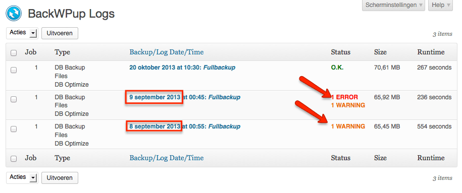
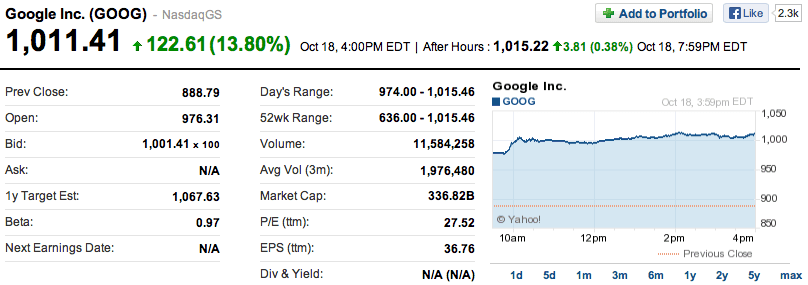
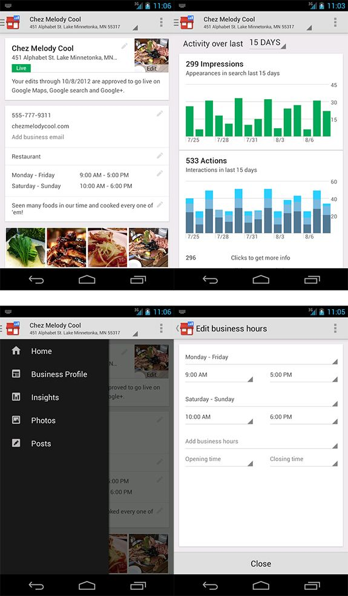
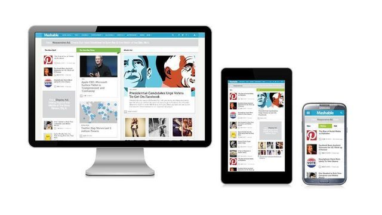

> **Historisch archief.** Deze aflevering verscheen op 21-10-2013 als onderdeel van ReputatieCoaching (2012–2016). De oorspronkelijke tekst is hieronder historisch bewaard. Diensten, contactgegevens, links, tools en adviezen kunnen inmiddels verouderd zijn.

**Transcriptiestatus:** Volledige transcriptie uit het oorspronkelijke archief.

***Historische afbeelding niet beschikbaar: ReputatieCoaching Podcast*
Het was vandaag weer eens ouderwets moeilijk om uit al het nieuws te kiezen. Allereerst wat nieuws over WordPress 3.7, die binnenkort uitkomt. Dan volgt de mening van Matt Cutts over guest blog spamming en vorige week ging de koers van Google door de duizend dollargrens!**

**Mike Blumenthal geeft antwoord op de vraag of je je bedrijfsomschrijving over alle sites uniek moet maken.**

**En scoort een site die gebaseerd is op het zogenaamde “responsive webdesign” nu hoger dan non-responsive sites? Hebben “black hat”-technieken nog wel zin om te scoren in de zoekresultaten? Ik heb tips voor het gebruik van LinkedIn tijdens seminars, congressen, conferenties en trainingen en wat je zelf kunt doen aan je lokale SEO, voordat je een expert inschakelt.**

**Dit alles en meer komt aan bod in deze podcast, dus blijf luisteren als er iets bij zit, wat je aanspreekt of waar je meer over wilt horen.**

## Terugblik op de vorige podcast

Voordat ik overga op de onderwerpen voor vandaag, nog even een korte terugblik op de [podcast van vorige week](/nl/archief/reputatiecoaching/046/). Daarin had ik een leuk interview met Robert Spakman van [MeetingRoomReview.com](http://www.meetingroomreview.com), een site specifiek voor het verzamelen van reviews van vergaderlocaties.

Zojuist keek ik nog weer eens naar de site en zag ook dat die alweer was veranderd. Zo worden op dit moment ook recentelijk gereviewde locaties getoond.

*Historische afbeelding niet beschikbaar: MeetingroomReview.com*

Eerder deze week heb ik ook een instructievideo gemaakt, waarin ik je laat zien hoe gemakkelijk het is om je [aan te melden als reviewer op MeetingRoomReview.com](https://web.archive.org/web/*/https://www.reputatiecoaching.nl/aanmelden-reviewer-meetingroomreview-com-instructievideo/). Deze instructievideo vind je op de website.

En alle links naar sites en relevante artikelen die ik heb geraadpleegd of gebruikt voor het samenstellen van deze podcast vind je onderaan de transcriptie van deze podcast, op: [www.reputatiecoaching.nl/47/](/nl/archief/reputatiecoaching/047/).

## WordPress 3.7

*Historische afbeelding niet beschikbaar: Waarom WordPress?*
Op dit moment is WordPress 3.6.1 de meest actuele versie, maar een paar dagen geleden is de [Release Candidate van WordPress 3.7](https://wordpress.org/news/2013/10/wordpress-3-7-release-candidate/) vrijgegeven. Dat houdt in dat binnenkort de officiële 3.7 versie uitkomt. En volgens het bericht op de officiële site van WordPress is dat al komende week!

In versie 3.7 zijn meer dan 400 bugs opgelost. Maar de grootste vernieuwing in deze versie is het automatisch updaten van WordPress met minor en security releases. Je kunt instellen dat jouw weblog automatisch bijblijft met de meest recente versie. Hoe één en ander precies in zijn werk gaat, zal ik uit de doeken doen, zodra versie 3.7 officieel is uitgekomen.

Hierdoor wordt het opeens nóg belangrijker om backups voor je site goed in te regelen. En ik zal je wat vertellen: ik kwam erachter dat de backup van ReputatieCoaching.nl niet goed werkte, toen ik weer eens in de log files dook. Het bleek dat BackWPup teveel geheugen vroeg, om de backup goed te kunnen uitvoeren en dat er sinds 9 september geen goede backups meer waren gemaakt! Gelukkig is er niets gebeurd in de tussentijd, maar anders had ik toch wel echt een probleem gehad!

[](https://web.archive.org/web/*/https://www.reputatiecoaching.nl/wp-content/uploads/2013/10/20131021-BackWPup-log-problemen.png)

Zo zie je maar dat mij ook dit soort problemen overkomen en je je dus helemaal niet schuldig hoeft te voelen, als jij achter dit soort zaken komt.

Ik had wel altijd een actuele backup van alle afbeeldingen op [Amazon S3](http://aws.amazon.com/s3/), maar ik heb besloten de backupstrategie per site toch iets te veranderen. Zo wordt nu de fysieke content (dus alle PHP-bestanden, afbeeldingen enz.) in een aparte “backup-job” eenmaal per week veiliggesteld, los van de database inhoud. Want vooral die laatste bevat de teksten van alle artikelen, die ik heb gepubliceerd. Ik moet er niet aan denken dat ik alle teksten kwijt zou zijn. En de database wordt nu elke nacht op [Dropbox](http://dropbox.z1e.nl) bewaard, waarbij ik de vijftien meest recente versies bewaar. Zo kan ik altijd maximaal 15 dagen terug.

Een voordeel hiervan is dat nachtelijke backup ook een stuk sneller gaat. In plaats van elke nacht de server een goede 270 seconden (ofwel: viereneenhalve minuut) behoorlijk zwaar te belasten, kost het maken van de backup van de database nu maar 7 seconden. Alleen moet ik voor de circa 50 andere WordPress blogs die op de server draaien, de backups natuurlijk wel op andere momenten starten, om te voorkomen dat de server helemaal overbelast raakt.

En reken maar dat ik de komende tijd natuurlijk scherp in de gaten houd, of de backups wel draaien!

## Hoe Google over guest blog spamming denkt

Deze week behandelde Matt Cutts de vraag hoe je tegenwoordig nog guest blogs kunt schrijven, zonder de indruk te wekken dat je voor de links betaald hebt. Matt zegt dat Google op basis van de meeste spammeldingen aardig goed kan zien of het een incidenteel guest blog is, of een bericht van iemand die op grote schaal spamberichten aan het posten is.

Betaalde links hebben vaak helemaal niet te maken met de context van de site, waar het artikel op staat. Veelal zijn deze spamberichten voorzien van keyword anchor teksten, terwijl valide guest blogs vaak (hopelijk) zijn geschreven door experts, met een stukje over de schrijver, waarom ze zijn uitgenodigd om op het blog te schrijven. Over het algemeen stoppen legitieme schrijvers niet zoveel keywords in de tekst, als spammers.

Toch zie je een heel spectrum aan kwaliteit voor wat betreft de artikelen. De laatste tijd ziet Google jammer genoeg toch steeds meer content van mindere kwaliteit. Google kijkt naar al deze criteria om te bepalen wat de kwaliteit van het artikel is: is het hoogwaardige kwaliteit of is het duidelijk spam?

Matt zegt verder dat het geen goed idee is om maar overal content te plaatsen, die overduidelijk een ietwat is aangepast, waardoor het wordt gezien als spam. Guest blogging moet je niet zien als een fulltime baan, maar iets wat je af en toe eens doet.

## Focus op social media, in plaats van op het verkrijgen van links?

Matt Cutts behandelde deze week wel een heel komische vraag van een gebruiker uit India. De vraag was ingegeven door het feit dat Google zo actief haar zoekresultaten aanpast, waardoor je tegenwoordig Google nog maar amper kon vertrouwen op de vertoonde resultaten. De vraag die erop volgde was of het wellicht beter was om leads te vergaren via social media, in plaats van door je positie in de zoekresultaten.

De video van Matt heb ik in de show notes opgenomen:

Hij “waarschuwt” de “black hat”-community dat het echt steeds moeilijker zal worden om door middel van illegale trucs en technieken hoger in de zoekresultaten te scoren.

Bovendien moet je volgens Matt ook niet op één paard wedden, maar je kansen (en dus ook je risico) spreiden. Daar hoort dan ook het actief gebruik van social media bij, evenals gedrukte media en billboards.

## Moet je je bedrijfsomschrijving variëren over alle lokale sites?

Mike Blumenthal, de bekende expert op het gebied van lokale SEO meldde dat het variëren van je bedrijfsomschrijvingen over de diverse lokale directory sites een minimale invloed heeft op de lokale rankings. Hij zegt:

Verder zegt hij:

En Mike gaat verder:

De essentie van deze uitspraak is het woord “strong”. Hij zegt dus dat sterke sites, in principe kunnen doen wat ze willen, terwijl juist de minder sterke sites een positieve invloed zouden kunnen hebben van unieke bedrijfsomschrijvingen.

## Google aandelen boven de US$1.000!

Nu ik het toch over Google heb: een paar dagen geleden ging de koers van een enkel aandeel van Google door de langverwachte grens van duizend dollar. Afgelopen vrijdag sloot het aandeel op een koers van US$1.011,41:



Dit is het resultaat van de aankondiging van Google dat zij het derde kwartaal van 2013 bijna 15 miljard dollar omzet hebben gedraaid.

## Alziende Google?

Recentelijk was er een klacht in het Google Webmaster Help forum, van een site eigenaar die zich afvroeg waarom zijn site niet goed scoorde in de zoekresultaten.

Het antwoord van John Mueller van Google daarop was:

Tja, dan word je wel ineens op je nummer gezet, als blijkt dat er een groot aantal fake profielen wordt gebruikt om +1’s aan de content te geven en de site en haar content te promoten.

Hieruit blijkt dat je echt geen moeite meer hoeft te doen om het systeem voor de gek te houden, want Google ziet toch alles. Reden temeer, om je aandacht te richten op het produceren van goede, unieke en relevante content.

## Google Places app voor Andoid

Helaas voor de Nederlandse Google+ Zakelijke paginabeheerders: je zult nog even moeten wachten. Maar de Amerikaanse Google+ Zakelijke beheerders kunnen vanaf nu op hun Android telefoon de pagina’s beheren.

Ze kunnen alle content aanpassen, zoals openingstijden, contactgegevens, bedrijfsomschrijving enzovoorts. Je kunt er ook foto’s en berichten mee posten op je zakelijke Google+ pagina, reageren op +1’s en vrijwel al het andere doen, wat je ook op een zakelijke Google+ pagina kunt doen.



Wat nog niet werkt, is het reageren op reviews van gebruikers, wat wel op de desktop versie kan. iOS gebruikers moeten een nog onbepaalde tijd wachten, want de app is nog niet voor de iDevices aangekondigd.

## Scoort responsive design hoger in Google?

Google is een groot promotor van responsive webdesign. Dat is een methode, waardoor websites er niet alleen op desktops goed uitzien, maar zichzelf aanpassen aan het device, waarop ze worden bekeken. Ze beantwoorden eigenlijk de vraag om goed vertoond te worden op elk device; vandaar het woord “responsive”.

“Op zich scoort jouw site niet hoger, doordat je er energie in hebt gestopt, om ’m responsive te maken”, zegt Google. Maar Google positioneert sites die niet mobielvriendelijk zijn gewoon lager, wanneer wordt gezocht op een mobiel apparaat.

John Mueller van Google zei hierover:

Maar volgens een [artikel](http://www.thesearchagents.com/2013/10/fortune-100-study-demonstrates-limitations-of-responsive-web-design/) op “TheSearchAgents” zitten er ook nog wel beperkingen aan responsive webdesign.



In dit artikel is te lezen dat uit een onderzoek is gebleken dat sites die specifiek voor mobiele apparaten waren ontwikkeld, beduidend hoger scoorden in de zoekresultaten, dan responsive websites. Van de 100 onderzochte Fortune 100 sites maakten slechts 9 bedrijven gebruik van responsive webdesign, terwijl 47 aparte mobiele sites hadden. De resterende 44 hadden slechts een site die alleen op desktops goed te zien was.

Ook de laadsnelheid van de websites varieerde enorm. Specifiek mobiele sites laadden het snelste, met een gemiddelde laadtijd van 2,9 seconde, terwijl responsive websites de meeste tijd nodig hadden om te laden: maar liefst gemiddeld 8,42 seconden. Desktop versies hingen daartussen met een gemiddelde laadtijd van 6,57 seconden.

Vooral de lange laadtijd voor responsive websites is klaarblijkelijk een belangrijke factor, waarom ècht mobiele sites hoger scoren: de laadtijd daarvan is een stuk korter. En een kortere laadtijd leidt tot een betere gebruikerservaring en daarmee veelal ook tot een hogere ranking in de zoekresultaten.

Op zich hoeven responsive websites helemaal niet traag te zijn. Zojuist heb ik het nog even gecontroleerd en [www.reputatiecoaching.nl](https://web.archive.org/web/*/https://www.reputatiecoaching.nl) laadt nog steeds in zo’n 750 milliseconden, dat is dus een aantal seconden minder, dan het vorige ontwerp, wat overigens ook responsive was.

## Domineert Yelp de lokale zoekresultaten in Google USA?

In de USA is een vreemd verschijnsel gaande. Op sommige lokaal-georiënteerde zoektermen toont Google alleen maar bedrijfspagina’s van bedrijven op Yelp. Als je bijvoorbeeld zoekt op “haircut Santa Monica”, dan krijg je maar liefst 10 resultaten van Yelp op de eerste pagina:

*Historische afbeelding niet beschikbaar: yelp-google-small*

Dat is erg bevreemdend, temeer daar Google zegt juist in het recente verleden verbeteringen in hun algoritme te hebben aangebracht, waardoor juist resultaten van meerdere domeinen getoond zouden moeten worden.

## Tips voor het gebruik van LinkedIn op conferenties en congressen

*Historische afbeelding niet beschikbaar: Linkedin*
Vaak ga je naar conferenties en congressen, zonder dat je eigenlijk een omlijnd idee hebt wat je daar gaat doen en/of zeggen. Hoewel je de kans hebt om daar veel nieuwe mensen te leren kennen, voelt het voor de meeste mensen niet echt gemakkelijk om op vreemden af te stappen en een praatje te beginnen.

Hoe kun je nu LinkedIn effectief inzetten, vóór, tijdens en na een evenement? Laten we om te beginnen eens kijken wat je zoal vooraf kunt doen:

```
  * Lees over de sprekers en bepaal welke sessies je wilt bijwonen
  * Als er een app voor het congres is, kijk wie zich verder nog heeft aangemeld en wie je daarvan kent. Bespreek vooraf een ontmoeting op de conferentie.
```

**Tijdens de conferentie:**

```
  * Als je het visitekaartje van iemand krijgt, zoek dan die persoon op, op LinkedIn en connect. Schrijf eventueel achterop het kaartje waar/hoe je de persoon in kwestie hebt ontmoet en wat je zoal hebt besproken.
  * Als je mensen de volgende dag spreekt, begin dan met bouwen aan een zakelijke relatie: vertel hoe je het hebt ervaren de persoon te ontmoeten en beter te leren kennen, en noem terloops iets, wat je in het LinkedIn profiel hebt gelezen. Dat laat zien dat je serieus in de persoon bent geïnteresseerd.
```

**Na het congres:**

```
  * Connect nogmaals via LinkedIn, stuur een berichtje, bouw zo verder aan de zakelijke relatie en blijf in contact.
  * Zoek de LinkedIn-profielen van de sprekers op en kijk of ze een blog hebben of anderszins artikelen publiceren. Abonneer je op hun nieuwsbrief om geïnformeerd te blijven.
  * Stuur een LinkedIn berichtje naar de sprekers met een korte opmerking wat je van hun presentatie hebt opgestoken.
  * Post eventueel een aanbeveling op de profielpagina van de spreker.
```

En duik ook eens in de contacten van mensen met wie je connected bent, om zo je contactenkring verder uit te breiden.

Maar heb je eigenlijk al wel een company page, oftewel een bedrijfspagina op LinkedIn? Natuurlijk is het een beetje afhankelijk van het type business waar je in zit, of een LinkedIn bedrijfspagina zin heeft voor jouw bedrijf. Zo kan ik me voorstellen dat het voor een cafetariahouder niet echt veel zin heeft, maar voor een carrièrecoach juist destemeer.

Stel je hebt een LinkedIn bedrijfspagina, post daar dan ook af en toe iets op. Je zou eens kunnen denken aan:

```
  * Inside informatie over, of interviews met mensen van je bedrijf
  * Vacatures en medewerkers die uitzonderlijk gepresteerd hebben
  * Tips en trucs
  * Grappige feiten en uitspraken
```

Hoewel deze laatste nog wel worden gelezen, neemt de populariteit hiervan af, vergeleken met de andere topics, waar je over zou kunnen posten.

## 6 acties die je zelf moet doen voor je lokale SEO, voordat je een expert inschakelt

*Historische afbeelding niet beschikbaar: Zet je bedrijf op de mobiele kaarten!*
Maar al te vaak krijg ik vragen van bedrijven en ondernemers hoe zij hun bedrijf hoger kunnen laten scoren in de lokale zoekresultaten. Steevast vraag ik ze dan of ze de onderstaande dingen zelf al hebben gedaan, want een goede lokale SEO begint bij jezelf:

```
  1. **Wees een paar maanden in business** – Je kunt niet verwachten dat je direct goed scoort in de lokale zoekresultaten, als je net begint. Dit houdt in dat je een website moet hebben en je Google+ Zakelijk pagina hebt geclaimd.
  2. **Bekijk of de lokale resultaten voor jouw zoektermen worden getoond** – Als ze niet worden getoond, kijk dan of ze wel verschijnen als je andere plaatsnamen intypt. Als er nog steeds niets wordt vertoond, denk dan na over relevante zoektermen die wèl lokale resultaten tonen.
  3. **Meld je aan bij alle grote algemene Nederlandse directories** – Ik heb ze al vaker vermeld. Zoek op “[instructievideos][/instructievideos/]” op de site en meld je sowieso bij alle sites aan, waar ik instructievideo’s van heb gepubliceerd. Kijk ook eens op welke sites je concurrenten worden getoond en meld je daar ook aan. Meld je ook aan bij topic-gerelateerde websites en directories.
  4. **Lees de webmaster richtlijnen van Google** en zorg dat jouw website aan de [Google Webmaster richtlijnen](https://support.google.com/webmasters/answer/35769?hl=nl) voldoet.
  5. **Spiek bij je concurrenten** – Doen zij dingen binnen de Webmaster richtlijnen van Google, die jij wellicht niet doet? En wat doen zij (of doen zij _niet_), wat jij wellicht kunt uitproberen?
  6. **Vraag je af, wat je precies van mij wilt** – Wil je hoger scoren, of wil je daadwerkelijk meer business? Want soms kan het optimaliseren van een landing pagina vele malen beter werken dan proberen hoger te komen in de (lokale) zoekresultaten. Of wil je meer reviews of testimonials? Een aantal van deze zaken kun je ook _nu_ al mee beginnen.
```

Samenvattend: lokale SEO is niet moeilijk, het is gewoon veel werk! Natuurlijk kan ik veel voor je doen en voor je site, maar je kunt het echt ook zelf! En mocht je er dan toch geen tijd voor hebben, dan kun je specifieke zaken aan mij uitbesteden, waardoor je de kosten voor je additionele marketinginspanningen relatief laag houdt.

Met dit topic kom ik dan weer aan het einde van deze podcast. Vandaag was het een flinke bloemlezing met een aantal korte items. Ik hoop dat je er ook weer wat van hebt opgestoken, waar jij je voordeel mee kunt doen.

Want denk erom: Rome is ook niet op één dag gebouwd. Zorg er daarom voor, dat je continu met kleine stapjes werkt aan het verbeteren van je online reputatie, en je online vindbaarheid om zo je business te vergroten.

Als je de podcast leuk vindt en je hebt inderdaad wat aan alle informatie die ik met je deel, help mij dan met het verder verbeteren en promoten van deze podcast. Deel ‘m op Twitter, like ‘m op Facebook of geef een “+1” op Google+. Het zou helemaal super zijn, als je een bericht achterlaat op iTunes of LinkedIn.

Als je een vraag of een probleem hebt met betrekking tot je online reputatie of de vindbaarheid van je website, kun je een mailtje sturen naar [podcast@reputatiecoaching.nl](mailto:podcast@reputatiecoaching.nl). Als je dat te lastig vindt, of als je de podcast beluistert terwijl je in de auto zit en je hebt acuut een vraag, spreek dan een boodschap in op de ReputatieCoaching Hotline, op nummer: 084 - 883 15 56. Mogelijk behandel ik je vraag of probleem dan in een artikel of in de podcast.

Als laatste kun je je ook inschrijven voor de nieuwsbrief. Dan ontvang je altijd als eerste het laatste nieuws wat ik publiceer en automatisch elk kwartaal het ReputatieCoaching Podcast Boek van het afgelopen kwartaal. Surf daartoe naar [www.reputatiecoaching.nl/nieuwsbrief/](https://web.archive.org/web/*/https://www.reputatiecoaching.nl/nieuwsbrief/) en schrijf je meteen in.

En je kunt ook rechtstreeks op de website een voicemail achterlaten, door op de tab aan de rechterkant van elke pagina te klikken, en je bericht in te spreken. Dit was [ReputatieCoaching Podcast aflevering 47](/nl/archief/reputatiecoaching/047/) en mijn naam is [Eduard de Boer](http://nl.linkedin.com/in/eduarddeboer/nl).

Ik wens je de komende week weer succes met het werken aan je reputatie, zodat je meteen je reputatie voor jou kunt laten werken!

Tot volgende week!

Doei!

Overzicht van de links die in deze podcast aan bod komen:

```
  * [MeetingRoomReview.com](http://www.meetingroomreview.com)
  * [Dropbox](http://dropbox.z1e.nl)
  * [Amazon S3](http://aws.amazon.com/s3/)
  * [Google Richtlijnen voor webmasters](https://support.google.com/webmasters/answer/35769?hl=nl)
  * “[Does Google serve different result according to responsive design?](http://webmasters.stackexchange.com/questions/54054/does-google-serve-different-result-according-to-responsive-design)” (StackExchange, 14 oktober 2013)
  * “[Fortune 100 Study Demonstrates Limitations of Responsive Web Design](http://www.thesearchagents.com/2013/10/fortune-100-study-demonstrates-limitations-of-responsive-web-design/)” (TheSearchAgents, 14 oktober 2013)
```
