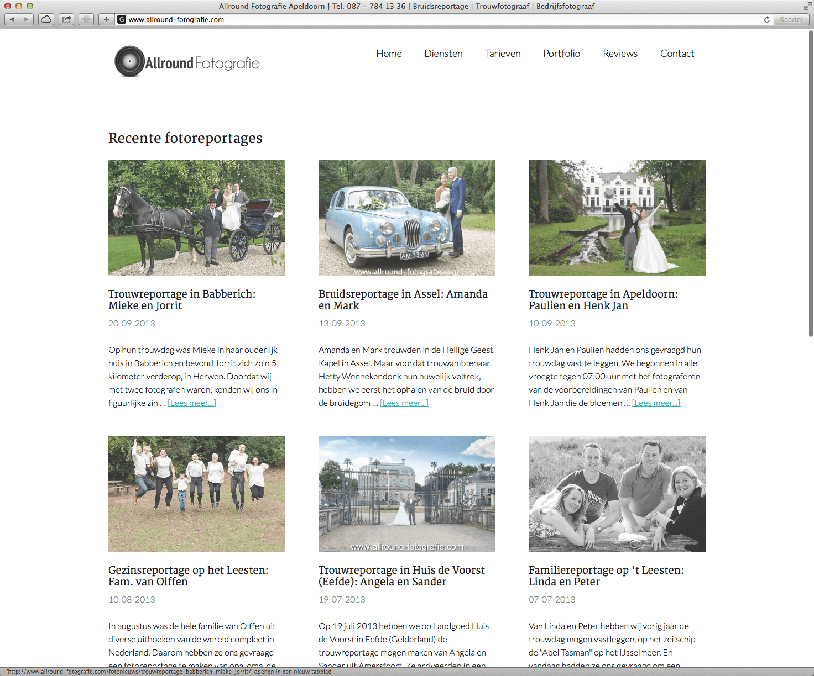
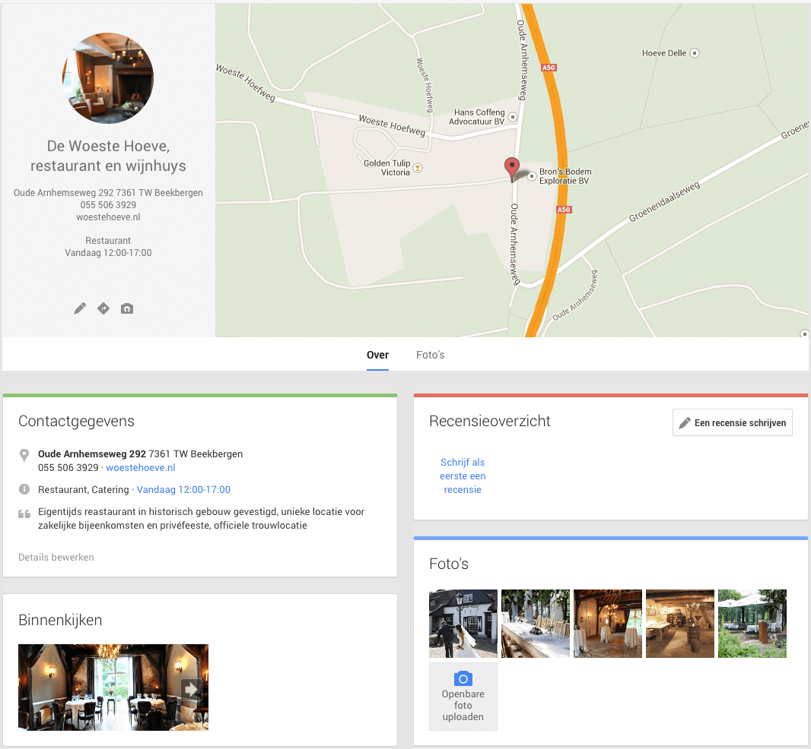
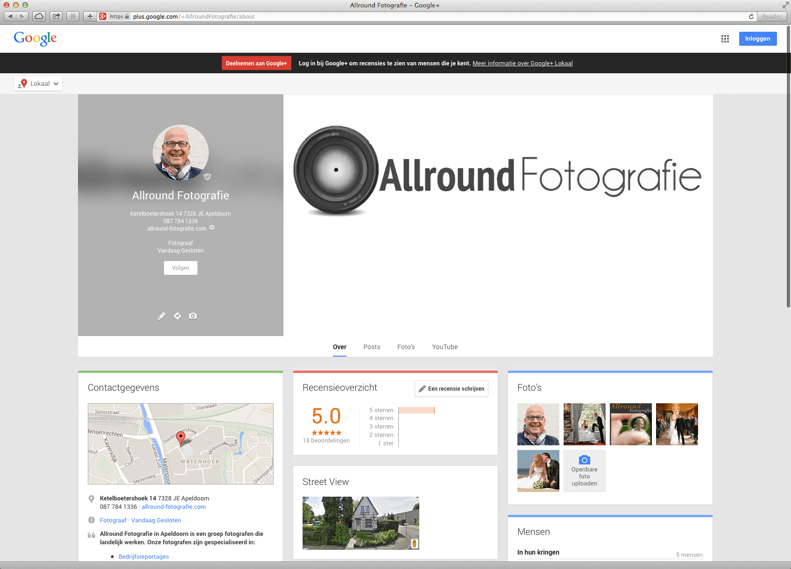
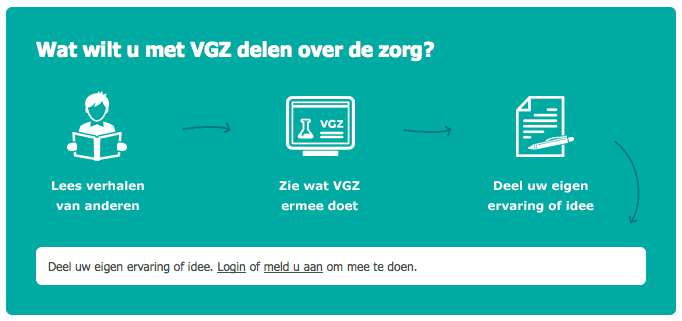

> **Historisch archief.** Deze aflevering verscheen op 18-11-2013 als onderdeel van ReputatieCoaching (2012–2016). De oorspronkelijke tekst is hieronder historisch bewaard. Diensten, contactgegevens, links, tools en adviezen kunnen inmiddels verouderd zijn.

**Transcriptiestatus:** Volledige transcriptie uit het oorspronkelijke archief.

\*\*[*Historische afbeelding niet beschikbaar: ReputatieCoaching Podcast*](https://web.archive.org/web/*/https://www.reputatiecoaching.nl/wp-content/uploads/2012/12/Reputatie-Coaching-Podcast-logo-200x200.jpg)Hallo, hallo en leuk dat je er bij bent, bij deze 51e aflevering van de ReputatieCoaching Podcast. Mijn naam is Eduard de Boer, ook bekend als de ReputatieCoach. Dit is dé podcast die je moet beluisteren als je meer wilt leren over online reputatie en reputatiemanagement en ook als je wilt werken aan je online reputatie en je online vindbaarheid wilt verbeteren. Dit alles kan je helpen om jezelf beter op de online kaart te plaatsen, waardoor je als bedrijf meer business kunt doen.\*\*

**Als persoon kun je met de diverse tips aan de slag om bijvoorbeeld je online reputatie als bergingsduiker, circusacrobaat, filosoof, kok, gezagvoerder of wat dan ook te verbeteren.**

Heb jij ook het gevoel dat de winter eraan komt? Ik was afgelopen paar dagen er even tussenuit: lekker even uitwaaien op het strand in Zeeland, met aansluitend nog een overnachting in Zuid-Limburg. Vrijdag was ik dus op het strand en was het zonnig en zelfs redelijk aangenaam weer.

[Historische afbeelding: Lekker weekendje weg in Zeeland](https://lh5.googleusercontent.com/--KdGQanpt74/Uojosa0PWnI/AAAAAAAAgcU/RVuljgEx50c/w600/IMG_4032.JPG)
Maar zaterdag reed ik richting Limburg en reed ik alleen maar door de mist… Koude mist. Ik vind dat niets, ik ben meer iemand van warm weer. Je zult mij ook nooit een zomervakantie zien inruilen voor een skivakantie. Wellicht komt dat, doordat ik ooit eens bij –37 graden Celsius heb geskied in Noord Canada. Dat vond ik geen pretje.

Maar goed, over op de content voor deze podcast…

Afgelopen week was een drukke week. Zo heb ik de vernieuwde website van Allround Fotografie live gebracht. Dat heeft veel tijd gekost. Daarnaast was Allround Fotografie opeens 7 reviews kwijt op Google+, op het moment dat Google+ bezig was met het doorvoeren van veranderingen in de layout. Die vernieuwde layout is inmiddels definitief en ook zijn de verloren reviews weer terug. Hierover zometeen meer…

In eerdere podcasts heb ik het al een paar keer gehad over “Gefilterde reviews” in relatie tot Yelp. Gefilterde reviews kon je pas bekijken als je een complexe captcha intypte. Dat is niet meer het geval: ze zijn nu gemakkelijker te bekijken, maar heten nu “Niet aanbevolen reviews”!

63% van de iPhone gebruikers maakt gebruik van Apple Kaarten c.q. Apple Maps. Hierdoor neemt de populariteit van Google Maps af. Vandaag heb ik een video voor je van Matt Cutts, waarin hij zegt dat je het beste onder je eigen naam reacties op weblogartikelen kunt posten. Afgelopen week werd in het Mediaplaza in de Jaarbeurs het Congres Content Marketing 2013 gehouden, waar ik je ook één en ander over te vertellen heb en de verzekeraar VGZ adverteert zelfs op televisie voor het feit dat zij online reviews verzamelt.

Als de topics die ik zojuist opsomde je aanspreken, blijf dan luisteren. Al zit er maar één interessant puntje voor je bij: blijf dan in figuurlijke zin aan de lijn, want wie weet steek je van de overige onderwerpen ook nog iets op. Als er niets bijzit wat je aanspreekt, schakel dan de podcast uit en laat me zo snel mogelijk weten wat je dan wel wilt horen. Je kunt me dit laten weten onderaan de show notes, op [www.reputatiecoaching.nl/51/](/nl/archief/reputatiecoaching/051/).

## Vragen van afgelopen week

In de [podcast van vorige week](/nl/archief/reputatiecoaching/050/) heb ik een deel van de vragen van **Frank Grootaarts** uit Nijmegen beantwoord. Ik heb toen ook toegezegd binnenkort nog een artikel te schrijven over hoe je sterretjes bij je vermeldingen krijg in Google, dus dat hou je nog tegoed. Afgelopen week had ik Frank ook aan de telefoon. Hij ziet helemaal het nut van een bedrijfspanorama voor zijn zaak en wil er graag één laten maken.

Frank vroeg ook hoe het kwam dat de reviews die hij had verzameld op Yelp, niet meer werden vertoond. Deze vraag beantwoord ik zometeen, als ik het over de vernieuwingen van Yelp heb.

**Robert-Jan** had een vraag over hoe ik de iets meer dan 60 WordPress sites die ik op mijn server host, actueel houd. Voorheen logde ik gemiddeld eenmaal per maand in op alle sites als admin om te zien of er iets was bij te werken. Dat deed ik dan ook meteen. Dat was behoorlijk arbeidsintensief, maar zag ik als mijn taak voor de diverse website-eigenaren.

Sinds WordPress 3.7 is het updaten van WordPress zelf een stuk eenvoudiger geworden, omdat WordPress zich nu tenminste zelf actueel houdt. Zo heb ik recentelijk een paar mailtjes van diverse websites gekregen, dat ze automatisch waren bijgewerkt naar 3.7.1.

Ik zie alleen nog niet dat plugins automatisch worden bijgewerkt. Ik heb inmiddels hiervoor wel een plugin gevonden, dus die heb ik meteen op een minder populaire website geïnstalleerd om te zien of die goed werkt. Binnenkort vertel ik je mijn bevindingen hiermee. Voor jouw informatie, de plugin heet “Advanced Automatic Updates”. Nogmaals, ik weet dus niet of die z’n werk goed doet, dus ik ga het eerst eens uitproberen.

[[Historische afbeelding: bekijk bron](https://marketpress.de/files/2013/02/backwpupbanner2.png)](http://marketpress.com/product/backwpup-pro/)

Essentieel bij automatische updates is wel, dat je je backups goed hebt ingeregeld. Zo vertelde ik Robert-Jan ook dat ik voor elke website een dedicated Gmailadres aanmaak, in combinatie met een Dropbox-account. De backup van de desbetreffende site, wordt dan op de Dropbox van het corresponderende account gemaakt. En ik deel de Dropbox-folders van alle accounts met mijn eigen Dropbox gebruikers-ID, zodat ik te allen tijd overal bij kan.

De derde vraag van afgelopen week was van **Suzanne** van [Wijnhandel B.J. de Logie uit Amsterdam](https://plus.google.com/107357851696942330555/about). Zij vroeg hoe het kwam dat ze geen vanity URL kon claimen voor de zakelijke Google+ pagina van de wijnhandel waarvoor zij de content beheert. Ook daar ben ik eens ingedoken en ik kwam erachter dat er twee Google+ pagina’s bleken te zijn voor dezelfde locatie. Suzanne logt in op de ene Google+ pagina, waar ze ook berichten post, terwijl de Bedrijfspanorama op de andere Google+ pagina staat, evenals de reviews.

[[Historische afbeelding: Wijnhandel B.J. de Logie in Amsterdam](https://lh4.googleusercontent.com/-kcuyXe8i3EM/UdZK2WTTZZI/AAAAAAAK6qU/mFAGiPlz_ZI/w580/photo.jpg)](https://plus.google.com/107357851696942330555/about)

Het is maar gelukkig dat de reviews op dezelfde pagina staan als de bedrijfspanorama. Want nu kan ze gewoon de eerste pagina verwijderen, en de tweede claimen. Als Suzanne dan de tweede pagina heeft geclaimd, kan ze ook de [vanity URL claimen op Google+](https://web.archive.org/web/*/https://www.reputatiecoaching.nl/google-vanity-url-claimen/).

## Vernieuwde website van Allround Fotografie is live

Het stond al zo lang op mijn ToDo-lijst: het vernieuwen van de website van Allround Fotografie. Het design was in 2008 nog wel hip, maar nu in 2013 schaamden we ons er bijna voor. Het moest dus gebeuren! Hoewel de originele site ooit is opgezet in Expression Engine, op zich een mooi Content Management Systeem, zijn er later nog een paar andere omgevingen aan toegevoegd.

Zo is er ooit een WordPressintallatie bij gekomen voor het weblog en later een aparte omgeving (met eigen beheerinterface) voor de FAQ’s. En sinds het overzetten van de website op de nieuwe webserver in Rotterdam, werkte Expression Engine ook niet meer zo lekker. Bovendien liep het ongeveer 4 jaar achter qua versie.

Maar ja, met honderden pagina’s met content die je niet geautomatiseerd kunt overzetten… Hoe begin je dan zo’n project? En hoe krijg je al die content over?

Simpel: begin met een schone WordPress-installatie en bedenk een goede indeling voor wat betreft categorieën en tags. Kies een mooi en responsive theme of template wat je aanspreekt, installeer de gewenste plugins en begin met de eerste pagina van de oude website door middel van CTRL-C/CTRL-V (lees: copy/paste) over te zetten. Doe dat nog een paar honderd keer, verander hier en daar wat dingetjes, upload extra foto’s en dan is het klaar:

[](/wp-content/uploads/2013/11/20131118-Allround-Fotografie-site.jpg)

Technisch gezien is het zo simpel, maar het was wel een puist werk. En ik heb nog niet alle content overgezet. Een deel van de artikelen uit het weblog moet nog over, evenals een aantal veelgestelde vragen en antwoorden uit de FAQ-module.

Toch hebben we de nieuwe website voor Allround Fotografie al wel live gezet. Eén van de redenen is dat er op het weblog van Places.NL een interview met mij is gepubliceerd met verwijzingen naar de site. En er zitten nog wat marketingactiviteiten aan te komen, dus kon de nieuwe site niet wachten.

In de nieuwe site heb ik alles uit de kast getrokken aan kennis en ervaring om de site maximaal tot zijn recht te laten komen, zowel qua gebruikerservaring, laadsnelheid, weergave en ranking in de organische en lokale zoekresultaten. Ook heb ik aardig hoge verwachtingen ten aanzien van het ranken van de foto’s die ik gebruik. Vandaag is het een week geleden dat de site live ging en ik zie nu op bijvoorbeeld de zoekterm “bruidsreportage” al foto’s verschijnen op de voorpagina in Google. Dat gaat dus de goede kant op.

Als je het leuk vindt, dan kan ik in een aantal artikelen beschrijven hoe en waarom ik bepaalde dingen heb gedaan. Ben je benieuwd wat er allemaal onderwater is gedaan en wat voor effect het heeft? En wil je weten welke plugins ik allemaal gebruik?

Welnu, het volledige effect weet ik zelf ook nog niet, daarvoor moet ik nog een tijdje wachten om het resultaat te kunnen zien. Nu ik zie dat ik binnen een week al twee foto’s op de voorpagina heb, heb ik er wel vertrouwen in, dat het goed komt. Natuurlijk houd ik alles nauwlettend in de gaten.

Maar als je binnenkort wilt weten wat ik allemaal heb gedaan, abonneer je dan nu alvast op de nieuwsbrief, op [www.reputatiecoaching.nl/nieuwsbrief/](https://web.archive.org/web/*/https://www.reputatiecoaching.nl/nieuwsbrief/). Bovendien krijg je dan elk kwartaal het ReputatieCoaching Podcast Boek met daarin de transcripties van alle podcasts van het afgelopen kwartaal.

Dit herinnert mij eraan dat ik nog het Podcast Boek van Q3 van 2013 moet afmaken. Die is door alle drukte onderaan mijn lijstje beland, maar niet getreurd: ik zet hem ook meteen weer bovenaan! Dus binnenkort kunnen de abonnees op de nieuwsbrief een mail tegemoet zien met daarin het ReputatieCoaching Podcast Boek van Q3/2013.

## Allround Fotografie verliest 7 reviews op Google+

Afgelopen week schreef ik er al een artikel over: eerst had Allround Fotografie met veel moeite eindelijk al 17 reviews verzameld en opeens [vond Google dat er nog maar 10 stonden](https://web.archive.org/web/*/https://www.reputatiecoaching.nl/heeft-google-problemen-met-tellen/). Het bijzondere van dit probleem was, dat als je zelf handmatig ging tellen, je toch 17 reviews zag staan!

Daarom maakte ik me ook niet zoveel zorgen, temeer daar er flink aan Google+ werd geknutseld en er gedurende zo’n anderhalve dag wel meer grotere en kleinere problemen te bespeuren waren. Daar ga ik zo nog even verder op in.

En toen de nieuwe weergave voor iedereen een feit was, zag Google opeens weer alle 17 reviews staan en kon ik dat aandachtspunt ook weer van mijn lijstje schrappen.

## Google+ heeft nieuwe weergave

Afgelopen week was het dus behoorlijk raak. Afgezien van het feit dat de Google+ pagina van Allround Fotografie reviews kwijtraakte, was het een tijdlang ook niet mogelijk om bijvoorbeeld foto’s te uploaden naar Google+ en werd de tijdlijn ook niet goed geactualiseerd.

Dit alles had te maken dat Google bezig was met het invoeren van een nieuwe weergave, waar zij 24 en 25 oktober al mee experimenteerde. Toen schreef ik er ook al over. Op een paar kleine dingen na, is de weergave zoals die toen tijdelijk was te zien, doorgevoerd.

Wat bijvoorbeeld niet gebeurt, is dat de foto’s, reviews en andere blokken van positie veranderen, als je de grootte van je browser varieert. Het aantal kolommen kan nu ook maximaal drie zijn, net als toen.

Maar wat veel mooier is, is de vernieuwde weergave van de banner. Aan de linkerkant van de banner staat nu een badge, ofwel een soort van verticaal georiënteerd visitekaartje met alle contactgegevens en nog wat meer. De foto die je in de banner kunt laten vertonen, heeft nog steeds een verhouding van 16x9, met een maximale resolutie van 2.120 pixels horizontaal, bij 1.192 pixels verticaal. Maar de foto wordt dus wel iets bedekt aan de linkerkant door een soort van frosted glas, waardoor de foto nog vagelijk is te zien en waar bovenop dus de contactgegevens staan.

Het belang van goede foto’s, waaronder eentje als omslagfoto, begint nu echt te tellen. Want als je geen foto kiest voor een zakelijke Google+ pagina, dan wordt een stuk van Google Maps met daarop de locatie van je bedrijf op de kaart getoond. Volgens mij is dat niet iets waar je als ondernemer op zit te wachten.

[](/wp-content/uploads/2013/11/20131118-Woeste-Hoeve-Googleplus.png)

Ik moet zeggen dat ik de vernieuwde weergave (en zeker de banner) een stuk mooier vind, dan de vorige. In de show notes heb ik een screenshot van de vernieuwde Google+ pagina van [+Allround Fotografie](http://google.com/+AllroundFotografie) opgenomen.

[](/wp-content/uploads/2013/11/20131118-Allround-Fotografie-Googleplus.jpg)

## Gefilterde reviews bij Yelp worden nu wel vertoond

[*Historische afbeelding niet beschikbaar: Logo Yelp*](https://www.yelp.nl/biz/allround-fotografie-apeldoorn)In de intro van deze podcast vertelde ik over Frank Grootaarts uit Nijmegen. Hij was heel voortvarend aan de slag gegaan met het verzamelen van reviews op een aantal sites, waaronder Yelp. Toen ik hem afgelopen week aan de telefoon had vroeg hij hoe het kwam dat hij slechts 2 reviews op Yelp zag, terwijl hij er eerst 5 had.

De bedrijfsvermelding van Frank is een typisch geval dat het virtuele slachtoffer is geworden van Yelp haar “gefilterde reviews”. In podcasts [31](/nl/archief/reputatiecoaching/031/), [36](/nl/archief/reputatiecoaching/036/), [44](/nl/archief/reputatiecoaching/044/) en [45](/nl/archief/reputatiecoaching/045/) zijn gefilterde reviews op Yelp al eens aan bod gekomen.

Samenvattend zijn gefilterde reviews, díe reviews, waarvan het Yelp filter denkt dat ze niet helemaal legitiem zijn. Hoewel niemand buiten Yelp precies weet hoe het filter wordt getriggerd, zijn er wel enkele voor de hand liggende triggers:

```
  * Onvolledig profiel (dus ook geen profielfoto)
  * Een extreem review (dus 1 of 5 sterren)
  * Geen vrienden op Yelp
  * Slechts één review gepost en verder geen activiteit
```

Ik heb het in het verleden ook wel eens gezien dat officiële reviews van echte Yelpies werden gefilterd, maar later (toen bijvoorbeeld het profiel verder werd gevuld) weer gewoon werden vertoond.

In elk geval, gefilterde reviews werden voorheen niet zonder meer getoond. Je moest eerst een captcha invullen, om ze te kunnen bekijken. Dat is afgelopen week veranderd. Ze zijn nu wel te bekijken en ze heten tegenwoordig “Niet aanbevolen reviews”. Yelp schrijft hierover op haar site, als je op de tekst van niet aanbevolen reviews klikt:

**Wat zijn Aanbevolen Reviews?**

Ik heb eens gekeken naar de reviews die Frank heeft gekregen. Het bleek dat de triggers die ik hierboven noemde allemaal wel op enigerlei wijze werden geraakt. Zo hadden alle profielen (nog) geen vrienden op Yelp. Eén persoon had echter al wel drie reviews gepost, maar ook geen foto en geen vrienden. Een andere Yelpie had wel een profielfoto, maar geen vrienden en nog maar één review gepost.

Zo zie je dat het op Yelp erg moeilijk is om legitieme reviews te krijgen. Op zich is het goed dat Yelp probeert spam tegen te gaan, maar het kan wel eens frustrerend zijn als jij probeert je business goed vertoond te krijgen op Yelp. Nu raad ik Frank niet aan om meteen vrienden te worden met alle mensen die op Yelp een review posten. Dat is ook weer opvallend.

Frank, ik adviseer je om gewoon door te gaan op de manier waarop je bezig bent.

Wat wellicht leuk is om te weten is dat ik gisteren een experiment heb gedaan. Ik had bij het Yelp-account van een opdrachtgever een “niet aanbevolen” review gespot, dat was geschreven door iemand die ik kende, die al een tijd niet meer actief was op Yelp, 2 reviews voorheen had gepost en wel een profielfoto had. Maar dat review werd dus niet standaard vertoond.

Ik heb deze persoon benaderd en gevraagd om twee dingen te doen: een derde review posten en de Yelp app op de iPhone te installeren en daarop in te loggen. Nadat ik het mailtje ontving dat die acties waren uitgevoerd, stond de review die eerst “niet aanbevolen” werd, opeens tussen de aanbevolen reviews.

Hiermee hebben we twee dingen aangetoond. Als eerste: het filter van Yelp werkt op realtime basis… Dus als iemand eventueel vertraagd actief wordt op Yelp, kunnen zijn of haar reviews per direct toch worden vertoond tussen de “aanbevolen reviews”. En het tweede: enige activiteit op een Yelp-account dat niet bijster actief is en slechts “niet aanbevolen” reviews heeft, kan resulteren in “aanbevolen reviews”!

Volgens mij zijn dat twee heel interessante leerpunten…

## 63% van de iPhone eigenaren gebruikt Apple Maps

Comscore is een bekend onderzoeksbureau in de Verenigde Staten. Het bureau heeft recentelijk een rapport gepubliceerd over het smartphone gebruik in de USA in de maanden juli, augustus en september 2013.

Andrew Shotland berekent op [zijn site](http://applemapsmarketing.com/2013/11/63-of-iphone-owners-use-apple-maps-says-comscore/) op basis van deze gegevens dat alleen al in de USA maar liefst 38 miljoen mensen, ofwel 63% van de iPhone / iPad gebruikers, Apple Maps of Apple Kaarten gebruikt.

In dezelfde periode is het gebruik van Google Maps met circa 21% gedaald. Dat komt neer op zo’n 16 miljoen gebruikers per maand, die de app minder gebruiken.

## Gebruik je eigen naam bij posten van reacties op weblogartikelen

Afgelopen week werd aan Matt Cutts de vraag gesteld of het wordt gezien als webspamming, als je reacties op weblogartikelen achterlaat met een link naar je site en of die vorm van linkbuilding is toegestaan.

Matt zegt dat hij zelf ook de hele dag door links en rechts reacties achterlaat op weblogartikelen, waarbij hij zijn eigen naam gebruikt en meestal met een link naar zijn eigen weblog:

En zolang je het niet tot je dagtaak hebt gemaakt om te reageren op bijvoorbeeld honderd weblogartikelen per dag, is dit geen probleem. Pas als blijkt dat dit het enige is waarmee je links naar je site probeert te verkrijgen, dan kunnen er bij Google alarmbellen afgaan, waarna je site bestraft kan worden.

## VGZ gaat ook in de recensiebusiness

Een paar weken geleden had ik het over [meetingroomreview.com](/nl/archief/reputatiecoaching/045/), een niche site voor vergaderlocaties, waarop deze hun reviews kunnen vergaren. Gisteravond keek ik eventjes tv en zag ik een commercial van VGZ, die ging over een nieuwe dienst met de naam “Samen delen”.

[](/wp-content/uploads/2013/11/20131118-VGZ-delen.png)

Hierbij kun je op de site van VGZ reviews posten van behandelingen, zorgverleners et cetera. Maar dit platform gaat nog een stap verder. Je kunt ook ideeën en suggesties posten, waar iemand van VGZ dan op reageert en al of niet iets mee doet.

Ook kunnen anderen weer reageren op berichten die reeds online staan. VGZ wil op die manier een betere interactie met haar klanten realiseren. Ik vond het leuk om te zien dat er nu eens een commercial tijdens primetime wordt uitgezonden over het posten (en dus delen) van beoordelingen in de zorg. Zo zie je dat het fenomeen reviews en online beoordelingen langzamerhand gemeengoed wordt.

## Congres Contentmarketing (#congrescm13)

Op dinsdag 12 november 2013 organiseerde het bureau [Entopic uit Amsterdam](http://www.entopic.com) voor de derde keer het jaarlijkse congres voor webredacteuren in Media Plaza in Utrecht (#congrescm13 ). Dit jaar was het evenement geheel gewijd aan contentmarketing. Dat is begrijpelijk want contentmarketing staat momenteel wereldwijd sterk in de belangstelling.

[caption id=“attachment\_1966” align=“alignright” width=“199”]*Historische afbeelding niet beschikbaar: Mark Schaefer op Congres Content Marketing 2013 (#congrescm13)*
Mark Schaefer (#congrescm13)[/caption]

Mensen sluiten zich steeds meer af voor reclameboodschappen. Daarom passen marketeers nieuwe methoden toe om klanten aan te trekken en te behouden. Eén de meest veelbelovende methoden is contentmarketing. Zelf ben ik hier ook druk mee bezig en in [podcast 42](/nl/archief/reputatiecoaching/042/) had ik hierover een interview met [Arend Landman uit Utrecht](/nl/archief/reputatiecoaching/042/).

De Verenigde Staten is voorloper als het gaat om contentmarketing. Daarom is het begrijpelijk dat twee van de vier keynotes werden gehouden door Amerikaanse sprekers. [C.C. Chapman](http://www.cc-chapman.com) en [Mark Schaefer](http://www.businessesgrow.com) verzorgden een inspirerende keynote.

[caption id="" align=“alignright” width=“200”][Historische afbeelding: C.C. Chapman (#congrescm13)](https://pbs.twimg.com/profile_images/378800000444527425/7733a645aa4f737ba9999ea0cb5a615b.png)
C.C. Chapman (#congrescm13)[/caption]

C.C. Chapman vroeg de mensen in de zaal wie er regelmatig blogt. Hij was enorm verbaasd dat slechts ongeveer tien van de meer dan 500 deelnemers hun hand opstaken. Als je tegenwoordig serieus met contentmarketing aan de slag wilt, is een eigen weblog ongeveer de basis.

Chapman nodigde de bloggers in de zaal uit om over het congres te bloggen. Inmiddels zijn er meerdere verslagen over het evenement verschenen:

```
  * [Blutarsky](http://www.blutarsky.nl/show-news/2013-11-14/13-tips-voor-amazing-content/)
  * [Henk Hofman](http://hphofman.wordpress.com/2013/11/12/congrescm13-niet-je-product-maar-je-verhaal/)
  * [Arend Landman](http://www.arendlandman.nl/2013/11/contentmarktingcongres-2013-entopic-zeven-tips-online-marketeers-webredacteuren/)
  * [Patrick Mackaaij](http://www.eenmanierom.nl/congres-content-marketing-webredactie-2013-congrescm13/)
  * [Irene Vink](http://finkelsteinandsons.com/2013/11/13/how-to-be-a-marketing-guru/)
  * [Nicole Wedler](http://nicolewedler.nl/2013/11/content-rules-zeker-op-content-marketing-congres-2013/)
```

Uit deze blogs en diverse tweets over het Congres Contentmarketing & Webredactie 2013 blijkt dat veel deelnemers enthousiast waren over het evenement. De concepten van contentmarketing zijn blijkbaar voor veel webredacteuren nieuw.

Hier volgen negen tips die geformuleerd zijn naar aanleiding van de keynote van C.C. Chapman:

```
  1. Omarm het idee dat je een uitgever bent en bouw je eigen media-imperium voor contentmarketing.
  2. Zorg ervoor dat je content waardevol is voor je doelgroepen, goed gevonden wordt door zoekmachines en gemakkelijk kan worden gedeeld via social media.
  3. Leer te werken met de vele tools die er bestaan om goede content te produceren. De enige manier om goed te worden in contentmarketing is het gewoon te doen en momentum te creëren.
  4. Maak je content persoonlijk en menselijk, en zorg ervoor dat jouw unieke stem erin doorklinkt. Kopieer niet zomaar de aanpak van anderen, want wat voor hen werkt, werkt misschien niet voor jou.
  5. Luister naar reacties op je content (onder andere via Google Alerts en Twilert) en houd ook de online activiteiten van concurrenten in de gaten.
  6. Bouw via je content, social media en persoonlijke ontmoetingen relaties op, want die heb je nodig als je als persoon of organisatie verder wilt groeien.
  7. Durf bij het produceren en promoten van content speels en experimenteel te zijn zonder idioot of ongepast over te komen.
  8. Wees je er steeds van bewust dat je contentmarketing bedrijft om iets te bereiken. Besteed daarom veel aandacht aan het ontwikkelen van een goede strategie.
  9. Denk visueel en maak plaatjes en video’s om je verhaal en je boodschap over te dragen.
```

Mark Schaefer verzorgde een interessante keynote over hoe essentieel content is om invloed te creëren. Arend Landman heeft daarover ook een [gastblog](https://web.archive.org/web/*/https://www.reputatiecoaching.nl/congres-contentmarketing-2013-congrescm13-mark-schaefer-onthulde-keynote-principes-van-online-invloed-uitoefenen/) geschreven op [www.reputatiecoaching.nl](https://web.archive.org/web/*/http://www.reputatiecoaching.nl).

Met deze negen tips van C.C. Chapman tijdens het Congres Content Marketing 2013 (#congrescm13) kom ik dan weer aan het einde van deze podcast.

Als je de podcast leuk vindt en je hebt inderdaad wat aan alle informatie die ik met je deel, help mij dan met het verder verbeteren en promoten van deze podcast. Deel ‘m op Twitter, like ‘m op Facebook of geef een “+1” op Google+. Het zou helemaal super zijn, als je een bericht achterlaat op iTunes of LinkedIn.

Als je een vraag of een probleem hebt met betrekking tot je online reputatie of de vindbaarheid van je website, kun je een mailtje sturen naar [podcast@reputatiecoaching.nl](mailto:podcast@reputatiecoaching.nl). Als je dat te lastig vindt, of als je de podcast beluistert terwijl je in de auto zit en je hebt acuut een vraag, spreek dan een boodschap in op de ReputatieCoaching Hotline, op nummer: 084 - 883 15 56. Mogelijk behandel ik je vraag of probleem dan in een artikel of in de podcast.

Als laatste kun je je ook inschrijven voor de nieuwsbrief. Dan ontvang je altijd als eerste het laatste nieuws wat ik publiceer en automatisch elk kwartaal het ReputatieCoaching Podcast Boek van het afgelopen kwartaal. Surf daartoe naar [www.reputatiecoaching.nl/nieuwsbrief/](https://web.archive.org/web/*/https://www.reputatiecoaching.nl/nieuwsbrief/) en schrijf je meteen in.

En je kunt ook rechtstreeks op de website een voicemail achterlaten, door op de tab aan de rechterkant van elke pagina te klikken, en je bericht in te spreken. Dit was [ReputatieCoaching Podast aflevering 51](/nl/archief/reputatiecoaching/051/) en mijn naam is [Eduard de Boer](http://nl.linkedin.com/in/eduarddeboer/nl).

Ik wens je de komende week weer succes met het werken aan je reputatie, zodat je meteen je reputatie voor jou kunt laten werken!

Tot volgende week!

Doei!

Links naar artikelen die in deze podcast aan bod komen:

```
  * [Entopic](http://www.entopic.com)
  * [C.C. Chapman](http://www.cc-chapman.com)
  * [Mark Schaefer](http://www.businessesgrow.com)
  * “[63% of iPhone Owners Use Apple Maps Says Comscore](http://applemapsmarketing.com/2013/11/63-of-iphone-owners-use-apple-maps-says-comscore/)” (Apple Maps Marketing.com, 11 november 2013)
  * “[Congres Contentmarketing 2013 (#congrescm13): Mark Schaefer onthulde in keynote principes van online invloed uitoefenen](https://web.archive.org/web/*/https://www.reputatiecoaching.nl/congres-contentmarketing-2013-congrescm13-mark-schaefer-onthulde-keynote-principes-van-online-invloed-uitoefenen/)” (ReputatieCoaching, 16 november 2013)
```
