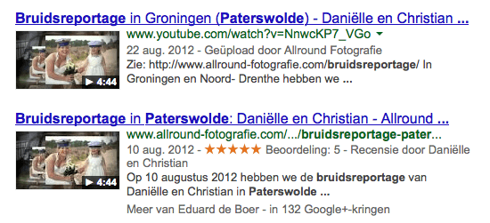
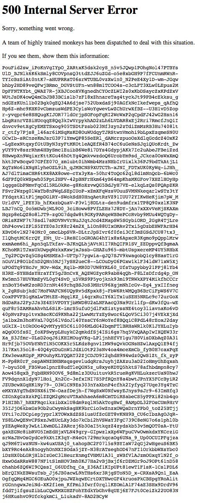
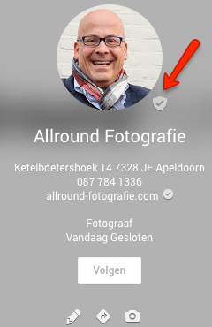
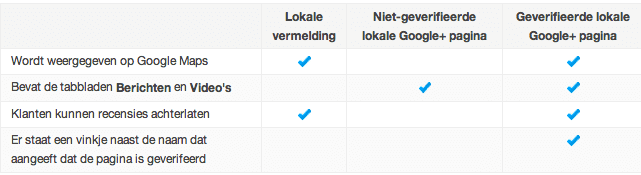

> **Historisch archief.** Deze aflevering verscheen op 25-11-2013 als onderdeel van ReputatieCoaching (2012–2016). De oorspronkelijke tekst is hieronder historisch bewaard. Diensten, contactgegevens, links, tools en adviezen kunnen inmiddels verouderd zijn.



**Transcriptiestatus:** Volledige transcriptie uit het oorspronkelijke archief.

***Historische afbeelding niet beschikbaar: ReputatieCoaching Podcast*
Als eerste heb ik goed nieuws, want zowel op iTunes, als op Stitcher wordt de podcast nu eindelijk weer goed vertoond! Verder heb ik mijn eerste bevindingen voor je met de Video SEO plugin van Joost de Valk, waar ik het in [podcast 50](https://www.reputatiecoaching.nl/50/) over had, naar aanleiding van een video van Matt Cutts over het gebruik van schema.org voor video. Binnen twee weken verschijnen foto’s van Allround Fotografie op de voorpagina van Google.**

**Afgelopen week was YouTube een half uur down! Google Map Maker is nu een aantal dagen down en Google Maps hecht meer waarde aan foto’s. Verder gaan Google, Bing en Yahoo de strijd aan tegen kinderporno en heb ik wat handige achtergrondinformatie over de verschillende pagina’s die er zijn in Google+.**

**Daarna volgen de instructies voor het veilig embedden van Google+ reviews op je eigen site en ook ga ik in op het belang van zogenaamde “owned media”. Tenslotte vertelt Matt Cutts van Google dat je de META-descriptions van je website niet moet dupliceren. Dus blijf luisteren, want er zitten vast ook voor jou vandaag weer leerzame en nuttige tips en adviezen tussen, waarmee jij je voordeel kunt doen.**

Welkom bij deze aflevering van de ReputatieCoaching Podcast. Mijn naam is [Eduard de Boer](https://plus.google.com/+EduarddeBoer), ook bekend als de ReputatieCoach. Dit is dé podcast die je moet beluisteren als je meer wilt leren over online reputatie en reputatiemanagement en ook als je wilt werken aan je online reputatie en je online vindbaarheid wilt verbeteren. Dit alles kan je helpen om jezelf beter op de online kaart te plaatsen, waardoor je als bedrijf meer business kunt doen.

Als persoon kun je met de diverse tips aan de slag om bijvoorbeeld je online reputatie als glazenwasser, waterbouwer, straatmaker, orthopedisch chirurg of welk beroep dan ook te verbeteren.

Je kunt de podcast van vandaag ook op de site teruglezen, op [www.reputatiecoaching.nl/52](https://www.reputatiecoaching.nl/52/).

Laat ik dan nu maar meteen doorgaan met de onderwerpen van vandaag…

## Podcast eindelijk weer goed vertoond op iTunes en Stitcher

Nou, het heeft dit keer vier weken gekost, want in [podcast 48](https://www.reputatiecoaching.nl/48/) had ik wederom een probleem met de RSS-feed van de podcast bij [Feedburner](http://www.feedburner.com) geconstateerd. Toen heb ik de feed wegehaald bij Feedburner en ondergebracht bij [Feedblitz](http://www.feedblitz.com). Op zich ging die migratie snel en soepel. Daarna heb ik binnen afzienbare tijd het probleem bij Stitcher grotendeels opgelost. Er ontbraken alleen nog een paar afleveringen in het overzicht op de site.

Hiervoor heb ik een mailtje naar de supportafdeling van Stitcher gestuurd en binnen een dag stonden alle podcasts weer netjes in het overzicht op de Stitcher.

iTunes kostte wat meer moeite en tijd. Ik zag dat het daar de afgelopen weken inderdaad niet goed ging met het overzicht van alle podcasts. En de ellende met Apple is dat je ze hierover niet rechtstreets kunt benaderen, zoals Stitcher. Je moet het doen met de informatie, die je op hun site vindt.

Omdat op iTunes maar niets gebeurde, dacht ik dat dit wellicht kwam, doordat ik ooit de Feedburner feed rechtstreeks aan iTunes had aangeboden. En in de Feedburner RSS-feed zat nu juist het probleem. Na verder te hebben gezocht, las ik ergens dat je bij het verhuizen van je feed, deze moet verwijderen in Feedburner. Dan krijg je de keuze om nog gedurende dertig dagen Feedburner deze nieuwe feed aan alle abonnees door te geven.

Dat heb ik gedaan en inderdaad was twee dagen later ook in iTunes alles weer in kannen en kruiken. Dus dit probleem kan ik nu eindelijk afsluiten. Het leuke was dat ik meteen een nieuw downloadrecord vestigde, toen dit was opgelost. Eergisteren waren op één dag namelijk maar liefst 53 downloads. Het vorige record stond op 52 downloads op één dag.

Voor de volledigheid nog even het ovezicht waar je de podcast nu dus goed kunt beluisteren:

```
  * [iTunes](https://itunes.apple.com/nl/podcast/reputatiecoaching-podcast/id584370482)
  * [Stitcher](http://www.stitcher.com/podcast/reputatie-coaching-podcast/reputatiecoaching)
  * [ReputatieCoaching Podcast RSS-feed](https://feeds.reputatiecoaching.nl/ReputatieCoachingPodcast) voor gebruik in diverse podcast applicaties
```

Natuurlijk is de podcast ook gewoon via je browser te beluisteren vanaf elk podcast artikel op de site. Die kun je wekelijks vinden op [www.reputatiecoaching.nl](http://www.reputatiecoaching.nl), gevolgd door het nummer van de podcast. Zo kun je podcast 52 dus ook beluisteren op [www.reputatiecoaching.nl/52](https://www.reputatiecoaching.nl/52/). Onderaan de transcriptie vind je de play-knop.
Op diezelfde pagina is ook de volledige transcriptie te lezen en kun je bovendien reacties of vragen achterlaten, naar aanleiding van deze podcast.

## YouTube Video’s in Google met eigen domeinnaam dankzij Video SEO plugin

[[Historische afbeelding: bekijk bron](https://lh3.googleusercontent.com/9xnaJ1nykwqGLfitD6AoS5dnia9hl5krNl-4A54h-aU=w200-h202-p-no)](http://yoast.com/wordpress/video-seo/)In [podcast 50](https://www.reputatiecoaching.nl/50/) heb ik de video van Matt Cutts met je gedeeld, waarin hij vertelt dat je zoveel mogelijk schema.org markup moet gebruiken voor het semantisch markeren van je video’s. Zijn stellige verhaal overtuigde mij om de [“Video SEO” plugin van Joost de Valk](http://yoast.com/wordpress/video-seo/) te kopen voor US$ 69 en die te installeren op de website van Allround Fotografie.

Deze plugin is dus inmiddels een goede twee weken operationeel op Allround Fotografie en ik begin al de eerste resultaten te zien. Naast dat de flitsende trouwvideo’s van Allround Fotografie in de zoekresultaten werden vertoond met de YouTube URL, worden ze nu ook in dezelfde resultaten getoond, alsof ze worden gehost op Allround Fotografie, dus met de domeinnaam: allround-fotografie.com.

Dat staat een stuk beter en nodigt mensen natuurlijk ook uit om door te klikken, zeker omdat de link naar de site van Allround Fotografie verwijst. Mensen die op zoek zijn naar informatie over een bruidsreportage klikken natuurlijk eerder door naar een zoekresultaat op de site van een fotograaf, dan naar YouTube. Desalniettemin hebben sommige van de flitsende trouwvideo’s al meer dan 1.800 views gehad, hetgeen ook goed is.

Ik ben natuurlijk enorm benieuwd wat dit met het verkeer naar de website zal doen. Daar kan ik nog niet veel over melden, omdat de nieuwe site van Allround Fotografie pas twee weken live staat. Wel heb ik in de show notes een afbeelding opgenomen om je te laten zien, hoe de zoekresultaten eruit komen te zien, als je deze mooie plugin koopt en installeert:

[caption id="" align=“aligncenter” width=“550”]
Nieuwe video zoekresultaten: let op eigen domeinnaam![/caption]

Op dat plaatje kun je zien dat de beide resultaten op dit moment onder elkaar worden vertoond. Zoals ik je vaker toezeg: zodra ik meer hierover te melden heb, zal ik het meteen met je delen!

## Foto’s Allround Fotografie op voorpagina Google

Nog wat nieuws over Allround Fotografie. Bij het maken van de nieuwe site is er veel nadruk gelegd op foto’s… Veel foto’s en natuurlijk mooie, aansprekende foto’s van bruiden, bruidegoms, beide echtelieden tezamen en andere gerelateerde foto’s.

Voorheen (in de oude website) uploadde ik altijd de foto’s naar een folder van de website, die op mijn eigen server stond. Om er maar voor te zorgen dat alle afbeeldingen dan snel werden geladen door de browsers van de bezoekers van de site haalde ik allerlei optimalisatie trucs uit, zoals inzet van “varnish” voor het cachen van statische content en gebruik maken van Amazon Cloudfront als Content Delivery Network, enzovoorts.

Tijdens het maken van de nieuwe site voor Allround ben ik een andere koers gaan varen. In plaats van alle foto’s op de eigen server te plaatsen en die daarmee te belasten, heb ik de foto’s geüpload naar de [Zakelijke Google+ pagina van Allround Fotografie](https://plus.google.com/+AllroundFotografie). Daarmee zijn de afbeeldingen gelijk redundant opgeslagen en worden ze tevens overal ter wereld snel geladen vanuit het dichtstbijzijnde Google datacenter. Het onlast bovendien ook nog eens mijn server en bespaart me kosten bij Amazon Cloudfront.

Dit waren natuurlijk een paar aardige redenen om dit experiment uit te voeren. Maar wat voor mij nog veel belangrijker was, was dat de foto’s daarmee op de infrastructuur van Google stonden en dus hopelijk ook beter zouden scoren in de zoekresultaten… Dat was nog maar afwachten…

Het is nu dus twee weken later, dus ik kan er nog niet zo heel veel over vertellen. Maar wat wel leuk is om te zien, is dat er al twee foto’s op de voorpagina van Google staan op bepaalde zoektermen. Als je verder in de zoekresultaten duikt, zie je al veel meer foto’s tevoorschijn komen, die ik heb geüpload naar de Google+ pagina. Dus ik ben benieuwd hoe zich dat in de toekomst verder ontwikkelt. Wat ik in elk geval er over kán vertellen, is dat het niet in je nadeel werkt.

Ik heb recentelijk een artikel geschreven over het [uploaden van foto’s naar je zakelijke Google+ pagina met Picasa](https://www.reputatiecoaching.nl/fotos-rechtstreeks-vanuit-picasa-uploaden-naar-je-zakelijke-google-pagina/) en binnenkort zal ik een instructievideo maken over hoe je dan op verschillende manieren de foto’s en andere afbeeldingen in je weblog of website kunt gebruiken.

## YouTube een half uur down!

Vorige week maandagavond tegen half twaalf ’s avonds kreeg je opeens een pagina met als titel “500 Internal Server Error”, als je naar YouTube surfde. Daaronder stond de melding:

A team of highly trained monkeys has been dispatched to deal with this situation.

If you see them, show them this information:

[caption id="" align=“aligncenter” width=“359”]
YouTube 500 Internal Server Error[/caption]

En daarna volgden tientallen regels met willekeurige letters, cijfers en symbolen. Alsof je dat zo even bijvoorbeeld door een telefoon kon doorgeven ;-)
In de show notes op [www.reputatiecoaching.nl/52](https://www.reputatiecoaching.nl/52/) vind je een screenshot van de melding die je wereldwijd kreeg, als je toen naar YouTube surfde.

Een goed half uur later was de site weer up en running. Op het officiële blog van YouTube is er niets over te vinden. En de enige melding die YouTube over dit incident deed, luidde:

## Google Map Maker tijdelijk offline en Google Maps toont drie resultaten

Afgelopen week ging (weliswaar tijdelijk) Google Map Maker “op slot”. Op dit moment kun je geen updates doorvoeren, of beoordelingen geven van updates. Ofwel: Map Maker is op dit moment read-only. Er vindt grootschalig onderhoud plaats.

Daarnaast is er een kleine verandering aangebracht in de nieuwe versie van Google Maps. Voorheen kreeg je in de vernieuwde Google Maps slechts één bedrijf te zien, als je een generieke lokale zoekterm invoerde, zoals bijvoorbeeld “schilder Deventer”. Maar sinds eerder deze week worden drie bedrijven getoond:

[caption id="" align=“aligncenter” width=“403”][Historische afbeelding: bekijk bron](https://lh4.googleusercontent.com/-IjPPODwPwqE/Uo3NAqGkuII/AAAAAAAAAG0/_1gm5XNvMvs/w403-h215-no/20131121-Maps-3pack.png)
Google Maps toont 3 zoekresultaten![/caption]

Over deze beide nieuwsfeiten heb ik van de week een [artikel](https://www.reputatiecoaching.nl/google-mapmaker-tijdelijk-uit-de-lucht-en-google-maps-toont-3-bedrijven/) gepubliceerd. Als je dat artikel bekijkt , zie je op de daarin getoonde screenshots dat foto’s steeds belangrijker worden voor bedrijfsvermeldingen. Wil je binnenkort nog opvallen, dan heb je ècht goede foto’s van je bedrijf nodig!

## Google, Bing en Yahoo samen in de strijd tegen kinderporno

Je hoort zo vaak dat er weer één of ander kinderpornonetwerk wordt opgerold. Zo zijn recentelijk wereldwijd 348 arrestaties verricht bij het oprollen van een wereldwijd kinderpornonetwerk.

Eerder deze week meldde de NOS dat [Google kinderporno gaat filteren](http://nos.nl/artikel/576732-google-gaat-kinderporno-filteren.html). De NOS meldde hierover het volgende:

De Britse premier Cameron had deze zomer om zo’n lijst gevraagd. Volgens directeur Eric Schmidt hebben zo’n 200 werknemers drie maanden aan het project gewerkt. Ook Microsoft en Yahoo gaan kinderporno beter weren in hun zoekmachines.

13.000 websites krijgen een waarschuwingslabel zodra ze in de resultatenlijst voorkomen. Voor YouTube is er speciale software gebouwd om kinderporno op beeld te herkennen en te verwijderen.

Premier Cameron kondigt later vandaag een nieuwe samenwerking aan met onder andere de Amerikaanse FBI om harder op te treden tegen kinderporno op internet.

Google meldde nog wel dat natuurlijk geen enkel algoritme perfect is en zoekmachines kunnen niet voorkomen dat er nieuwe afbeeldingen van kindermisbruik naar een site op Internet worden geüpload. Wel gaan de bedrijven binnenkort nog betere software inzetten om dit soort (en andere) afbeeldingen te detecteren, te rapporteren en te verwijderen.

De zoekgiganten gaan nu toch vaker buigen voor druk die uit de politiek komt, of uit de maatschappij. Zo heeft Google Maps afgelopen week nog gemeld dat zij een foto van een vermoorde jongen van 14 jaar in Richmond in de USA, [binnen acht dagen zou verwijderen](http://searchengineland.com/google-maps-makes-exception-speeds-up-process-to-replace-image-of-shooting-victim-177773). Normaal krijgt Google slechts eenmaal per één tot drie jaar nieuwe satellietbeelden…

## Verschillende pagina’s in Google+

Eergisteren kreeg ik de vraag van Oskar hoe het kon dat hij op één van zijn zakelijke Google+ pagina’s wèl de pagina’s *Berichten*, *Over*, *Foto’s* en *Video’s* had, maar op zijn andere zakelijke Google+ pagina niet. Ik heb hem uitgelegd dat er drie typen Google+ pagina’s zijn, te weten:

```
  1. Traditionele lokale vermelding
  2. Niet-geverifieerde lokale Google+ pagina
  3. Gerverifieerde lokale Google+ pagina
```

### Lokale vermeldingen

Lokale vermeldingen bevatten waarderingscijfers, recensies en de tabbladen *Over* en *Foto’s* onder de omslagfoto. Je kunt deze lokale vermeldingen verifiëren en beheren door op de knop *Deze pagina beheren* te klikken, die je in de vermelding ziet staan.

### Google+ pagina’s

[caption id="" align=“alignright” width=“240”][](https://plus.google.com/+AllroundFotografie) Geverifieerde Google+ pagina[/caption]

Als je in het verleden al eens een lokale (zakelijke) Google+ pagina hebt gemaakt, zie je alleen de pagina’s *Berichten*, *Over*, *Foto’s* en *Video’s*. Heb je bij je Google+ pagina niet de mogelijkheid om een recensie te posten, dan is de zakelijke Google+ pagina niet geverifieerd.

Als je je Google+ pagina wel verifieert, wordt een eventuele bestaande vermelding voor het bedrijf samengevoegd met de lokale Google+ pagina om één pagina te maken waarop een vinkje wordt weergegeven om aan te geven dat de pagina is geverifieerd. In de show notes heb ik een nieuwe badge opgenomen van een geverifieerde Google+ pagina. De rode pijl in de afbeelding wijst naar het vinkje, waar ik op doel.

De pagina’s van sommige bedrijfseigenaren die het dashboard van Places Zakelijk gebruiken, kunnen ook automatisch worden geüpgrade naar een geverifieerde zakelijke (lokale) Google+ pagina. Geverifieerde Google+ pagina’s beschikken over de functies van beide typen pagina’s die hierboven zijn beschreven: waarderingscijfers, recensies en berichten van de bedrijfseigenaar.

In de tabel in de show notes op [www.reputatiecoaching.nl/52](https://www.reputatiecoaching.nl/52/) kun je de verschillen nog eens rustig bekijken:



Toen dit Oskar duidelijk was, heeft hij dan ook meteen de niet-geverifieerde Google+ pagina geverifieerd. Volgens Google ontvangt hij binnen één tot twee weken een postkaart met daarop de PIN om het eigenaarschap te verifiëren en te bevestigen.

## “Niemand ‘zit’ op Google+”

Ik heb je nu net uitgelegd hoe je je Google+ pagina kunt verifiëren. Heb je dat nog niet gedaan, doe dat dan; zo moeilijk is het niet! Juist als je het idee hebt, dat niemand uit je vrienden- of kennissenkring actief is op Google+, moet je nu beginnen op Google+. Dat bewijst namelijk dat je vooraan loopt. Vergeet niet dat Google+ echt gestaag groeit en naar verwachting binnen nu en zo’n twee jaar Facebook heeft ingehaald.

Toegegeven, het is nog niet zo populair als Facebook, maar als je eerlijk bent: word jij niet een beetje Facebook-moe? Heb je al business via Facebook kunnen doen? Of ben je als ondernemer druk met Likes te verzamelen, in de hoop dat je daarmee je business in 2014 door het plafond laat gaan? Of denk je dat je met al die Likes hoger komt in de zoekmachines?

Als je hiermee druk bent: je Liked jezelf suf bij elke update van je vriendenkring, je re-tweet elke tweet van je prospects en je reageert op elke tweet of reactie van anderen, vraag jezelf dan eens af hoeveel business je al daarmee hebt gegenereerd… Merk je dat je met al die inspanningen beduidend meer business doet? Dan feliciteer ik je en nodig ik je graag uit voor een interview in een volgende podcast.

Heeft het je nog eigenlijk niets gebracht, bedenk dan eens hoeveel tijd je hiermee bezig bent. Doe jezelf een lol en hou een week lang elke dag bij, hoelang je op Facebook zit te lezen, te Liken, te reageren en alle tweets van je tweeps leest, erop reageert of ze re-tweet.

Als dit wekelijks meer dan twee uur is, zou je ook wekelijks bijvoorbeeld één blogbericht op je site kunnen zetten en ook een paar klanten of patiënten om een review kunnen vragen op Google+, Yelp, allebedrijvenin.nl of één van de andere sites waar je reviews aan het verzamelen bent, als het goed is.

## Owned media: Hou je EIGEN “publicatiekanaal”

Ik hoorde eerder deze week ook van een bedrijf dat elke twee weken een column schrijft in een regionale krant en deze de volgende dag (met toestemming van de uitgever van de krant) online zet op Facebook. En deze ondernemer is heus niet de enige die zijn toekomst probeert te bouwen op een stuk grond, waarvan die niet weet of het volgend jaar nog bestaat of wat ermee gebeurt…

Je moet altijd zorgen dat je een veilige thuisbasis hebt voor je business. Dat is je website, webshop en/of blog. Niet elke ondernemer heeft een webshop nodig, maar wel zou elke ondernemer een weblog moeten hebben, waar hij of zij met zekere regelmaat en vaste frequentie leuke, interessante, leerzame berichten post.

Je website, webshop en blog worden ook wel “Owned” media genoemd, evenals een mailinglist, brochures en ander fysiek reclamemateriaal.

Vaak worden Twitter, Google+ en Facebook ook onder de owned media geschaard. Toegegeven, je kunt erop publiceren wat je wilt, dus in die zin ben je eigenaar. Toch vind ik het niet echt “owned”. Want als Facebook zou ophouden te bestaan, heb jij niets. Je zag dit een tijdje geleden in [podcast 13](https://www.reputatiecoaching.nl/13/), waarin ik je vertelde dat het social media en bloggingplatform [Posterous ten einde](https://www.reputatiecoaching.nl/13/) was.

Gelukkig waren er toen allerlei mogelijkheden om te migreren naar WordPress.com, maar ook WordPress.com is niet van jezelf. Stel dat er een aantal onverlaten is wat de ergste discriminerende, hatende of anderszins aanstootgevende reacties op jouw WordPress.com-blog post, terwijl jij eventjes niet oplet… Dan kan WordPress.com zo maar besluiten jouw account offline te nemen en dan heb je niets meer.

De ondernemer waar ik het zojuist over had, zou beter kunnen beginnen met de column op een weblog op de eigen bedrijfswebsite te publiceren. En dan via de sociale media, zoals Facebook en Twitter verkeer naar de eigen website trekken. Als op die site dan ook nog eens de mogelijkheid wordt geboden om je te abonneren op een nieuwsbrief, dan zou die helemaal goed bezig zijn.

Op deze manier houdt hij de content in eigen beheer, evenals de mailinglist. Zelfs als een social media sites ermee ophoudt, heeft deze ondernemer alsnog rechtstreeks toegang tot zijn klanten.

Idealiter bouw je dus continu aan een mix van content, die je via verschillende kanalen distribueert en communiceert, waarbij je sowieso je eigen veilige “thuisbasis” in de vorm van je weblog houdt.

Bega dus niet de fout om **ALLEEN MAAR** op allemaal sites en kanalen je boodschappen en berichten te communiceren, zonder rekening te houden met je “thuisbasis”: je blog, website en/of webshop!

## Bewaar je reviews ook!

Hetzelfde geldt ook voor alle reviews, die je met veel pijn en moeite verzamelt. In de meeste gevallen zul je deze op externe sites verzamelen; sites die dus niet van jezelf zijn. Ook daar loop je continu het risico, dat je ze kwijt kunt raken.

Bewaar ze daarom allemaal, net als ik al eens in [podcast 43](https://www.reputatiecoaching.nl/43/) heb verteld over de aanbevelingen in LinkedIn. Ook die moet je veiligstellen.

Als ze dan om welke reden dan ook van een site verdwijnen, dan kun je ze altijd nog op je eigen site publiceren. Op dat moment is het namelijk geen duplicate content meer.

## Embed Google+ reviews op je eigen site of weblog

Het is niet verstandig om reviews van review sites op je eigen site te kopiëren en te plakken. Wat je zou kunnen doen is een screenshot maken van alle reviews en die als plaatje op je site publiceren. Dat zien de zoekmachines in elk geval niet als dubbele content.

Ik raad je ten sterkste af om de kat op het spek te binden en teksten van reviews van Google+ op je eigen site te kopiëren en te plakken. Maar er is wel een nette manier om die reviews (zeker de 5-sterren reviews) op je site te publiceren. Dat werkt als volgt:

```
  1. Ga als beheerder naar je zakelijke Google+ pagina (die je dus geverifieerd moet hebben, zoals je inmiddels weet)
  2. Zoek de gewenste review en deel deze als jezelf. Daarmee komt de review als bericht tussen je andere berichten op Google+ te staan.
  3. Kopieer en plak daarna de “embed”-code in je HTML-pagina(’s) et voilà: je hebt de review veilig op je eigen site staan.
```

Maar onthoud dat als Google+ ooit mocht stoppen, je dit review alsnog op je eigen site kwijt bent. Maak dus in elk geval ook een backup van het review, als is het maar een screenshot, die je zowel op je eigen harddisk bewaart, als op bijvoorbeeld Google Drive en Dropbox.

Binnenkort zal ik een instructievideo maken hoe je dit precies doet, voor het geval mijn beschrijving hierboven iets te complex overkomt.

## Matt Cutts: “Vermijd dubbele metatag-beschrijvingen”

In de video die ik heb opgenomen in de show notes behandelt Matt Cutts van Google een vraag uit Nederland. De vraag luidt:

Matt ziet slechts twee opties:

```
  1. Een pagina heeft een unieke metatag-beschrijving
  2. Een pagina heeft _geen_ metatag-beschrijving
```

Maar pagina’s die echt belangrijk zijn, zoals je homepage en andere relevante pagina’s, of pagina’s waarvan de automatisch gegenereerde metatag-beschrijving niet echt goed is, kun je wel voorzien van je eigen handgeschreven en bovenal unieke META-descriptions.

Met deze video en uitleg van Matt Cutts over dubbele metatag-beschrijvingen kom ik dan weer aan het einde van deze 52e podcast.

Als je de podcast leuk vindt en je hebt inderdaad wat aan alle informatie die ik met je deel, help mij dan met het verder verbeteren en promoten van deze podcast. Deel ‘m op Twitter, like ‘m op Facebook of geef een “+1” op Google+. Het zou helemaal super zijn, als je een bericht achterlaat op iTunes of LinkedIn.

Als je een vraag of een probleem hebt met betrekking tot je online reputatie of de vindbaarheid van je website, kun je een mailtje sturen naar [podcast@reputatiecoaching.nl](mailto:podcast@reputatiecoaching.nl). Als je dat te lastig vindt, of als je de podcast beluistert terwijl je in de auto zit en je hebt acuut een vraag, spreek dan een boodschap in op de ReputatieCoaching Hotline, op nummer: 084 - 883 15 56. Mogelijk behandel ik je vraag of probleem dan in een artikel of in de podcast.

Als laatste kun je je ook inschrijven voor de nieuwsbrief. Dan ontvang je altijd als eerste het laatste nieuws wat ik publiceer en automatisch elk kwartaal het ReputatieCoaching Podcast Boek van het afgelopen kwartaal. Surf daartoe naar [www.reputatiecoaching.nl/nieuwsbrief/](https://www.reputatiecoaching.nl/nieuwsbrief/) en schrijf je meteen in.

En je kunt ook rechtstreeks op de website een voicemail achterlaten, door op de tab aan de rechterkant van elke pagina te klikken, en je bericht in te spreken. Dit was [ReputatieCoaching Podast aflevering 52](https://www.reputatiecoaching.nl/52/) en mijn naam is [Eduard de Boer](http://nl.linkedin.com/in/eduarddeboer/nl).

Ik wens je de komende week weer succes met het werken aan je reputatie, zodat je meteen je reputatie voor jou kunt laten werken!

Tot volgende week!

Doei!

Overzicht van de links die in deze podcast aan bod komen:

```
  * “[Google gaat kinderporno filteren](http://nos.nl/artikel/576732-google-gaat-kinderporno-filteren.html)” (NOS, 19 november 2013)
  * “[Google Maps Makes Exception & Speeds Up Process To Replace Image Of Shooting Victim](http://searchengineland.com/google-maps-makes-exception-speeds-up-process-to-replace-image-of-shooting-victim-177773)” (Search Engine Land, 19 november 2013)
```
