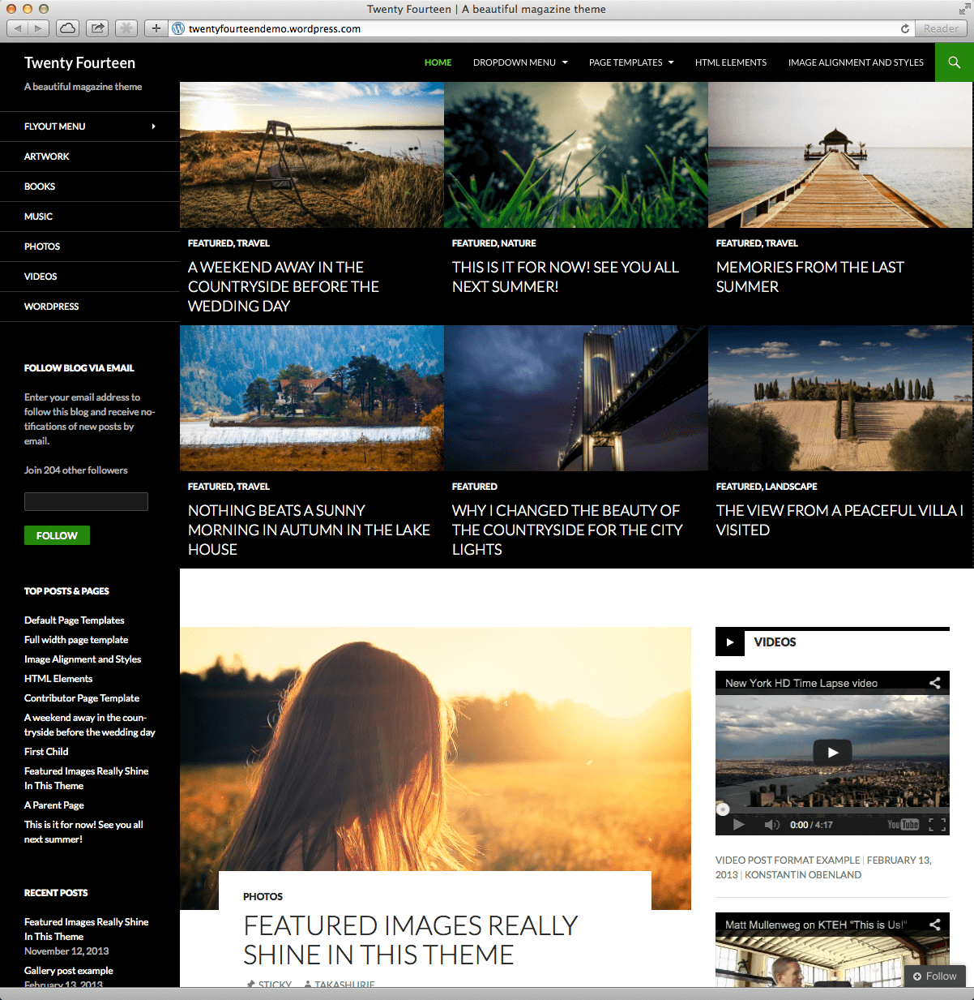
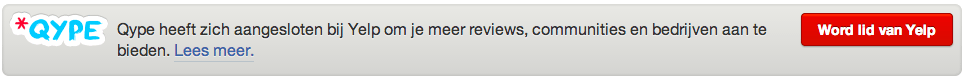
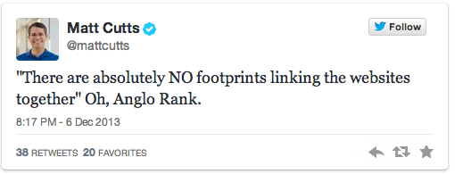
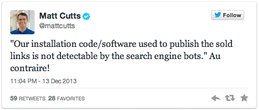
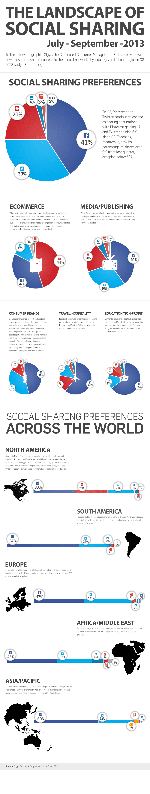

> **Historisch archief.** Deze aflevering verscheen op 16-12-2013 als onderdeel van ReputatieCoaching (2012–2016). De oorspronkelijke tekst is hieronder historisch bewaard. Diensten, contactgegevens, links, tools en adviezen kunnen inmiddels verouderd zijn.



**Transcriptiestatus:** Volledige transcriptie uit het oorspronkelijke archief.

***Historische afbeelding niet beschikbaar: ReputatieCoaching Podcast*
Tjongejonge, heb ik net vorige week beloofd dat ik deze week op tijd zou zijn met de podcast, red ik het weer niet! Ik vertel je zo waarom. Afgelopen week is WordPress 3.8 uitgekomen, daarover zo meer, evenals over de vernieuwingen in Google+ Hangouts en de samenvoeging van Yelp en Qype Nederland en andere ontwikkelingen bij Yelp en Twitter. Verder ruimt Google nu aan de lopende band linknetwerken op, vertelt Matt Cutts nogmaals over guest blogging en ik heb 15 contentmarketing voorspellingen voor 2014 voor je, rechtstreeks van de contentmarketing goeroes.**

**Hartelijk welkom bij deze aflevering van de ReputatieCoaching Podcast. Mijn naam is Eduard de Boer, ook bekend als de ReputatieCoach. Dit is dé podcast die je moet beluisteren als je meer wilt leren over online reputatie en reputatiemanagement en ook als je wilt werken aan je online reputatie en je online vindbaarheid wilt verbeteren. Dit alles kan je helpen om jezelf beter op de online kaart te plaatsen, waardoor je als bedrijf meer business kunt doen.**

Als persoon kun je met de diverse tips aan de slag om bijvoorbeeld je online reputatie als ambulancechauffeur, heilsoldaat, ornitoloog, vinoloog, zilversmid of wat dan ook te verbeteren.

De volledige transcriptie van deze podcast kun je zoals altijd vinden op de website, en wel op: www.reputatiecoaching.nl/55.

Allereerst: hoe komt het nu, dat ik ook deze week later dan normaal ben met het uitbrengen van de ReputatieCoaching Podcast, terwijl ik vorige week nog zo had gezegd dat ik deze week op tijd zou zijn? Ik vind dat ik je hiervoor een uitleg verschuldigd ben.

Welnu, vanuit Allround Fotografie hadden we een paar weken geleden onze medewerking toegezegd aan de Sterrenschool in Apeldoorn, bij het werven van donaties ten behoeve van 3FM Serious Request. Daarvoor hebben we vorige week met twee fotografen gedurende twee uur een fotoreportage gemaakt van alle circa 120 leerlingen van de Sterrenschool.

Daarbij hebben we de kinderen bewust niet voor zo’n saai achtergrondscherm gezet, maar op diverse punten buiten op het schoolplein.

We hebben daarvoor zoveel foto’s geknipt, dat ik afgelopen weekend vrijwel de hele zaterdag en zondag bezig ben geweest met het nabewerken van alle foto’s. Gisteravond moest ik ze allemaal online zetten, want de mail zou er vanmorgen uit gaan naar alle ouders en verzorgers van de leerlingen. Dat was dus even een race tegen de klok.

Enfin, dat is dus gelukt en inderdaad had ik gisteravond de meer dan 700 foto’s online staan. Helaas ging dat dus ten koste van de ReputatieCoaching Podcast: die moest het dus wederom ontgelden en kwam dus ook deze week te laat uit. Ik doe mijn best volgende week wel weer op tijd te zijn.

## WordPress 3.8 “Parker”

Matt Mullenweg had het een tijd geleden al aangekondigd, dat op 12 december versie 3.8 van Wordpress zou uitkomen en inderdaad is vorige week WordPress 3.8 met codenaam “Parker” vrijgegeven aan het grote publiek. Versie 3.8 is vernoemd naar Charlie Parker, een Amerikaanse jazz-saxofonist en muzikant.

De grootste en meest in het oog vallende verandering is de totaal vernieuwde interface van het Dashbord: alle grijstinten zijn weg, de menu’s zijn groter, dikker en duidelijker leesbaar. Ook is gekozen voor het lettertype “Open Sans”, waardoor de interface zowel beter leesbaar is op grote schermen, als op de kleinere schermen van mobiele apparaten.

De iconen voor de buttons in WordPress 3.8 zijn nu schaalbare afbeeldingen, waardoor ze op alle schermen er scherp en gestoken uitzien. En om het admin-interface feestje compleet te maken, kun je het Dashbord-theme nu ook in diverse kleuren instellen.

En na de templates 2010, 2011, 2012 en 2013 is er nu 2014. Dit template is natuurlijk responsive, zoals alle moderne WordPress templates. Je kunt op [twentyfourteendemo.wordpress.com](http://twentyfourteendemo.wordpress.com) een demonstratie bekijken van dit template. Het stelt je in staat om een soort van online magazine te maken. In de show notes heb ik een screenshot opgenomen en ik vind het er echt fantastisch mooi uitzien.

[](https://lh5.googleusercontent.com/-0rlgxjpF8S4/Uq9VEAzz8XI/AAAAAAAAAOk/Y80KpgLCl38/w926-h950-no/20131216-twenty-fourteen.png)

Als je een soort van online magazine uitbrengt, dan kun je hier heel goed mee uit de voeten. Ik ben er verder nog niet ingedoken, maar wat ik zo zag biedt het veel mogelijkheden.

## Google+ Hangouts vernieuwd

Google heeft geluisterd naar de wensen van de gebruikers voor wat betreft hun Google+ Hangouts. Tot voor kort kon je niet echt evenementen plannen om die uit te zenden in een Google+ Hangout on Air, maar nu wel. Ook kun je een countdown timer toevoegen en tot die tijd een trailer vertonen. De trailer verdwijnt, zodra de echte uitzending begint.

En je kunt nu ook besloten Hangouts on Air uitzenden. Voorheen waren Hangouts on Air altijd voor de hele wereld te bekijken, maar nu kun je dus een select gezelschap toegang geven tot je live uitzending, terwijl je toch ook bijvoorbeeld de mogelijkheid houdt om de uitzending op te nemen.

Langzamerhand wordt Google+ Hangouts nu echt een platform waarop je online uitzendingen kunt gaan verzorgen met functionaliteit, waar je voorheen alleen maar over kon dromen. Inmiddels kan ik eigenlijk geen additionele functionaliteit verzinnen, die ik er nog in zou willen hebben.

Heb jij al eens een Hangout gehouden met iemand anders? Ik merk zelf dat ik steeds minder Skype gebruik en vaker mijn toevlucht zoek tot een Google+ Hangout. Een reden daarvoor is ook dat je met Skype tegenwoordig je beeldscherm niet meer kunt delen, terwijl dit moeiteloos werkt in een Hangout. Vooral als je mensen dingen online wilt uitleggen over bijvoorbeeld het gebruik van een bepaalde website of een bepaald programma, dan is zo’n functionaliteit echt onontbeerlijk.

En mocht je nog niet genoeg hebben aan deze functies, dan kun je ook nog de Hangout gereedschapskist, of “toolbox” openen, en een aantal extra functionaliteiten toevoegen.

## Yelp en Qype NL samengevoegd

Yelp is al sinds oktober 2012 bezig het inlijven en integreren van Qype, van de gebruikers en de reviews. De afgelopen maanden zijn steeds meer landen overgezet naar Yelp en hoewel ik het nergens had gelezen, kwam ik vorige week achter dat Qype inmiddels is overgegaan in Yelp.

[[Historische afbeelding: bekijk bron](https://lh4.googleusercontent.com/3aKk5UNG-_otzBJL9oJk9clEqFsgJGqH0R7u_DimRi3VfL5t6hx0qJPiTi4iOFuFqnekIo7NcRTY6566gK8onrSZ0OxVLmacTNs-1eUTJP1ifPvTNU_SU7kibg)](https://lh4.googleusercontent.com/3aKk5UNG-_otzBJL9oJk9clEqFsgJGqH0R7u_DimRi3VfL5t6hx0qJPiTi4iOFuFqnekIo7NcRTY6566gK8onrSZ0OxVLmacTNs-1eUTJP1ifPvTNU_SU7kibg)

In [podcast 36](https://web.archive.org/web/20150312093030/http://www.reputatiecoaching.nl/36/) liet ik je zien dat het scherm van Qype nog de tekst vertoonde, dat Yelp ermee bezig was om Qype te integreren. Maar als je nu naar [www.qype.nl](http://www.qype.nl) gaat, dan kom je op de Nederlandse site van Yelp terecht. Met andere woorden: de integratie is afgerond!

[](https://lh3.googleusercontent.com/-DiT49QNycBs/Uq9VCwpjHcI/AAAAAAAAAOY/kqj6WkMpA0s/w963-h79-no/20131216-Qype-Yelp.png)

Mocht je dus reviews hebben gehad op Qype, dan kan het zomaar zijn dat deze nu dus zijn toegevoegd aan je reviews op Yelp. En mocht je al wel reviews op Qype hebben, maar nog niet op Yelp, dan zou ik maar eens snel gaan kijken op je bedrijfsvermelding op Yelp. Wellicht heb je nu opeens wèl een aantal reviews!

*Historische afbeelding niet beschikbaar: Logo Yelp*
Meer nieuws over Yelp: in Californië is er een “class-action law suit” aangespannen tegen Yelp. Er wordt geclaimd dat Yelp haar leden stimuleert om maar gratis reviews te posten en het enige wat ze ervoor terugkrijgen zijn diverse rankings, zoals “Elite”, “Hertog”, “Hertogin” et cetera. Ze ontvangen dus geen geldelijke beloning.

Volgens diverse welingelichte bronnen is de claim op voorhand gedoemd te falen. Het is nu eenmaal een bekend verschijnsel dat dit soort User-Generated-Content gratis wordt vervaardigd en men geen aanspraak *kan* maken op een financiële vergoeding.

Je kunt meer lezen op de site [www.yelpclassaction.info](http://www.yelpclassaction.info/). Ik ben overigens benieuwd wat er zou gebeuren als vervolgens alle bijdragers aan Wikipedia zich op een dergelijke wijze zouden verenigen om geld te krijgen voor alle content die ze in Wikipedia hebben gepubliceerd.

En zoals vrijwel elk kwartaal heeft Yelp ook weer wat getallen prijsgegeven over haar omvang enzovoorts. Hiervan wil ik er een paar met je delen:

```
  * **Verkeer**: 117 miljoen unieke bezoekers per maand
  * **Aantal app users**: 11,2 miljoen
  * **Aantal reviews**: 47 miljoen (25% komen er nu vanaf mobiel)
  * **Adverteerders**: 57.000
  * **Aantal geclaimde bedrijven op Yelp**: zo’n 1,3 miljoen
  * **Geplande omzet in 2013**: US$229 miljoen
```

Zoals je hieruit kunt opmaken, gaat het Yelp voor de wind: ze groeien nog steeds flink.

## Twitter komt nu ook in de buurt…

Eerst hadden we “Facebook Nearby”, maar nu zit ook “Twitter Nearby” eraan te komen. Het idee hiervan is dat als je je locatie aan Twitter doorgeeft, je tweets uit dezelfde buurt als waar jij je bevindt, kunt lezen, zelfs van mensen die je niet volgt.

Grappig genoeg lijkt dit tegenstrijdig met iets waar veel mensen sociale media mee associëren: het vrij zijn van geografische locatie en over grenzen heen communiceren met mensen die dezelfde interesses hebben als wij.

Wellicht wil Twitter proberen je zo lokale advertenties te vertonen, omdat ze weten waar je je bevindt?

Locatie is wel iets wat steeds belangrijker wordt, ondanks dat we meer en meer locatie-onafhankelijk gaan werken.

Daarom mijn steeds terugkerende mantra: zorg ervoor dat je op de lokale kaart komt te staan op zoveel mogelijk sites. Zeker als je een lokaal-opererende ondernemer bent met een klantenkring die voornamelijk uit je eigen plaats komt, dan is je lokale presence essentieel.

Meld je aan op Google+, claim je bedrijfsvermeldingen op Google+, Yelp, Foursquare, allebedrijvenin.nl enzovoorts. Denk erom dat je overal je bedrijfsgegevens consistent houdt!

## Google ruimt linknetwerken op

Google heeft het de laatste tijd echt gemunt op linknetwerken. Iets meer dan een week geleden maakte Matt Cutts bekend dat ze het linknetwerk “Anglo Rank” hadden kaltgestellt:



Korte tijd daarna begonnen diverse webmasters die hier in het verleden ooit gebruik van hadden gemaakt, de alom gevreesde “penalties” in webmaster tools te ontvangen.

De heren en dames achter het “Anglo Rank” netwerk geven echter niet op: ze hebben geschreven dat ze door zullen gaan met het uitbouwen van een nieuw netwerk. Hoe hardleers kun je zijn?

En afgelopen vrijdag meldde hij dat Google ook de backlinks van het netwerk “Backlinks.com” had gevonden en in waarde gereduceerd tot beneden nul:



En dit is al een tijdje aan de gang. Waar je eerst met backlinks vanuit linknetwerken naar jouw sites heel goed hogerop kon komen, wordt de ranking van jouw site of sites nu negatief beïnvloed door dit soort backlinks.

Blijf dus op het rechte pad, koop geen links van andere sites of services. Mogelijk helpt het je eventjes, maar op den duur ben je toch echt meestal de Sjaak. In het beste geval tellen de links niet meer mee, maar als je pech hebt, dan krijg je een penalty van Google aan je broek en kan je site of kunnen pagina’s uit je site mogelijk als sneeuw voor de zon uit de zoekresultaten verdwijnen.

De schade is wat minder als je net een nieuwe website bent begonnen, maar als je als hardwerkende ondernemer je site al tien jaar hebt, dan kan zo’n gebeurtenis voor een groot deel de nekslag van je online business zijn.

Blijf werken aan je contentmarketing: ga dus gewoon door met het vervaardigen van interessante berichten, video’s en wat dies meer zij. Ik heb ooit eens de volgende uitspraak gehoord:

In andere woorden: je inspanningen worden uiteindelijk heus beloond. Als jij wel interessante en unieke content vervaardigt, maar je concurrenten niet, dan neem je dus een grote voorsprong op je concurrenten.

## 15 contentmarketing voorspellingen voor 2014

En nu ik het toch over contentmarketing heb: ik kwam op Slideshare een interessante presentatie tegen met als titel “[50 Content Marketing Predictions for 2014](https://www.slideshare.net/CMI/cmi-predictions-2014)” van het Content Marketing Institute. Deze presentatie heb ik ook opgenomen in de show notes, op www.reputatiecoaching.nl/55.

```
  * _“Tenminste drie bedrijven uit de Fortune 500 nemen in 2014 een Chief Content Officer in dienst”_ (Joe Pulizzi)
  * _“2014 is het jaar van de short-form content: geluid, video, gifs, Instagram, Vine etc. worden populairder dan long-form content”_ (Julie Fleischer)
  * _“2014 is het jaar dat bedrijven echt beginnen met het opzetten van contentmarketing strategieën”_ (Robert Rose)
  * _“Slimme ondernemers zien content als een motor om hun merk of bedrijf bekendheid te geven”_ (Mitch Joel)
  * _“De moderne verkoper is een content connaisseur en iemand met een sterke persoonlijke brand”_ (Jill Rowley)
  * _“De behoefte aan vertaalde content groeit exponentieel; je kunt internationale markten niet met alleen Engelstalige content veroveren”_ (Val Swisher)
  * _“In 2014 zien we een enorme groei van contentmarketing automatisering”_ (Will Davis)
  * _“Social media zal meer worden gebruikt om engagement met video en andere content te creëren”_ (Barry Harrigan)
  * _“Content marketing wordt meer en beter uitgelijnd met de business doelen.”_ (Ahava Leibtag)
  * _“2014 wordt het jaar van het Publiek voor wat betreft contentmarketing en bedrijven zullen minder afhankelijk van Google willen worden”_ (Jeffrey K. Rohrs)
  * _“In 2014 is PR geen silo meer in de marketingafdeling, maar volledig geïntegreerd met de contentmarketing workflow in bedrijven”_ (Heidi Sullivan)
  * _“Waar voorheen kwantiteit van content belangrijk was, komt in 2014 als gevolg van de updates van Google de nadruk te liggen op **kwaliteit**”_ (Pawan Deshpande)
  * "_Goede e-mailadressen verzamelen van serieuze prospects en klanten wordt het belangrijkste doel in 2014. Twitter followers, Facebook fans en Google +1’s tellen niet, evenals aantallen bezoekers en RSS-feed abonnees. In 2014 is de inbox het doel en e-mail de killer app"_ (John Fox)
  * _“Volgend jaar is het jaar van kwalitatief betere en long-form content”_ (Carol Tice)
  * _“Steeds meer bedrijven zullen een hoofdredacteur aannemen of aanstellen die verantwoordelijk wordt voor alle content die binnen het bedrijf wordt geproduceerd”_ (Joakim Arhammar)
```

Wat ik interessant vind om te zien is dat de verschillende “contentmarketing goeroes” diverse tegenstrijdige voorspellingen doen, elk gebaseerd op hun eigen kennis, ervaring en inzichten. Maar goed, dat geeft niet. Je hoort in al deze voorspellingen wel door dat contentmarketing als fenomeen onontbeerlijk wordt en even gewoon als het traditionele publiceren van persberichten en nieuwsbrieven etc.

## Matt Cutts weer over guest blogging

Een paar dagen geleden bracht Matt Cutts zijn vierde video uit over guest blogging.

```
  * Gebruik guest blogging niet als je enige link building strategie
  * Verstuur geen massamailing naar duizenden willekeurige websites om maar een guest blog te mogen posten
  * Publiceer hetzelfde artikel niet op twee verschillende sites
  * Gebruik niet een artikel om het vervolgens in tienduizend varianten te spinnen en elders te posten
```

Echt, kwaliteit is essentieel!

Met deze video van Matt Cutts kom ik aan het einde van deze podcast.

## Facebook dominant in social sharing, Pinterest in e-commerce

Oh nee, nog even wat nieuws over Pinterest, Facebook en andere sociale netwerken. Ik kwam van de week een artikeltje tegen op Marketing Land, waarin werd verteld over het marktaandeel van de verschillende sociale media. Daarin kwam het volgende naar voren…

Facebook, Twitter en Pinterest waren gezamenlijk goed voor 91% van al het sociale delen online. Daarin vertegenwoordigde Facebook 41%, Twitter 30% en Pinterest 20%. LinkedIn stond op de vierde plaats met 4%.

Maar als je kijkt naar de e-commerce shares, dan komt Pinterest boven de andere sociale netwerken met 44%. Facebook was goed voor 37% en Twitter slechts voor 12%.

En op het gebied van media en publishing scoorde Pinterest met 20% weer achter Facebook, die 40% van het aandeel voor haar rekening nam. Twitter had in dat segment 30%.

[](https://lh6.googleusercontent.com/-bIoNZr8-e_0/Uq9Uvhfy4zI/AAAAAAAAANw/kM0mq3k0MDA/w1000/Gigya-Sharing-Infographic_Q3-2013.png)

Dit waren cijfers voor Noord-Amerika. Op de infographic van Gigya, die ik in de show notes heb opgenomen, kun je de verdeling van de sociale netwerken in Europa zien. Die is op dit moment als volgt:

```
  * Facebook 47%
  * Twitter 45%
  * Google+ 4%
  * LinkedIn 2%
  * Vkontakte 2%
```

Het platform Vkontakte kende ik niet eens, maar het blijkt een Russisch social netwerk te zijn.

Opvallend is dat Google+ zo rond de 3 à 4 procent schommelt voor wat betreft het aandeel in de social sharing. Als ik dan een voorspelling mag doen voor 2014, dan voorspel ik dat deze cijfers volgend jaar heel anders eruit zullen gaan zien. Ik verwacht dat Pinterest nog verder toeneemt op alle fronten en dat het aandeel van Google+ ook aanzienlijk zal groeien.

Met deze update over hoe er op de verschillende social media sites wordt gedeeld, kom ik dan toch echt aan het einde van deze podcast.

Je kunt merken dat het recentelijk in de Verenigde Staten Thanksgiving was en het einde van het jaar nadert: er is beduidend minder nieuws te melden dan in de periode tot en met november. Maar daar komt binnenkort ongetwijfeld weer verandering in, zeker als alle voorspellingen die ik eerder deze podcast noemde, uit gaan komen, als is het maar ten dele!

Wat wel duidelijk naar voren komt uit die voorspellingen, evenals uit alles wat je op dit moment op Internet leest, wordt het succes van jouw bedrijf in de nabije toekomst bepaald door de content die je produceert!

Ik breng de komende tijd ook gewoon de podcast uit, al zullen de uizendingen evenals vandaag mogelijk iets korter uitvallen dan dat je gewend bent. De tijd die ik vrijmaak doordat ik minder hoef te lezen, gebruik ik om een partij content te produceren voor een klein project, waarover ik je in het begin van het nieuwe jaar meer zal vertellen.

Als je de podcast leuk vindt en je hebt inderdaad wat aan alle informatie die ik met je deel, help mij dan met het verder verbeteren en promoten van deze podcast. Deel ‘m op Twitter, like ‘m op Facebook of geef een “+1” op Google+. Het zou helemaal super zijn, als je een bericht achterlaat op iTunes of LinkedIn.

Als je een vraag of een probleem hebt met betrekking tot je online reputatie of de vindbaarheid van je website, kun je een mailtje sturen naar [podcast@reputatiecoaching.nl](mailto:podcast@reputatiecoaching.nl). Als je dat te lastig vindt, of als je de podcast beluistert terwijl je in de auto zit en je hebt acuut een vraag, spreek dan een boodschap in op de ReputatieCoaching Hotline, op nummer: 084 - 883 15 56. Mogelijk behandel ik je vraag of probleem dan in een artikel of in de podcast.

Als laatste kun je je ook inschrijven voor de nieuwsbrief. Dan ontvang je altijd als eerste het laatste nieuws wat ik publiceer en automatisch elk kwartaal het ReputatieCoaching Podcast Boek van het afgelopen kwartaal. Surf daartoe naar [www.reputatiecoaching.nl/nieuwsbrief/](https://web.archive.org/web/20131205063155/http://www.reputatiecoaching.nl/nieuwsbrief/) en schrijf je meteen in.

En je kunt ook rechtstreeks op de website een voicemail achterlaten, door op de tab aan de rechterkant van elke pagina te klikken, en je bericht in te spreken. Dit was ReputatieCoaching Podcast aflevering 55 en mijn naam is [Eduard de Boer](http://nl.linkedin.com/in/eduarddeboer/nl).

Ik wens je de komende week weer succes met het werken aan je reputatie en de voorbereidingen voor Kerstmis. Blijf werken aan je reputatie, zodat je meteen je reputatie voor jou kunt laten werken!

Tot volgende week!

Doei!

Links naar sites en/of artikelen die in deze podcast aan bod komen:

```
  * “[Yelp Lawsuit Could Mean Guest Reviewers Can Get Back Pay](http://www.searchenginejournal.com/yelp-lawsuit-mean-guest-reviewers-can-get-back-pay/77373/)” (Search Engine Journal, 3 december 2013)
  * “[Report: Facebook Still Dominates Social Sharing, But Pinterest Is Now Tops For E-commerce](http://marketingland.com/report-facebook-twitter-dominate-social-sharing-but-pinterest-is-tops-for-ecommerce-67537)” (Marketing Land, 9 december 2013)
  * “[Trends in Social Sharing: The Rise of Pinterest](http://blog.gigya.com/trends-in-social-sharing-the-rise-of-pinterest/)” (Gigya blog, 9 december 2013)
  * “[50 Content Marketing Predictions for 2014](https://www.slideshare.net/CMI/cmi-predictions-2014)” (Content Marketing Institute, 13 december 2013)
```
