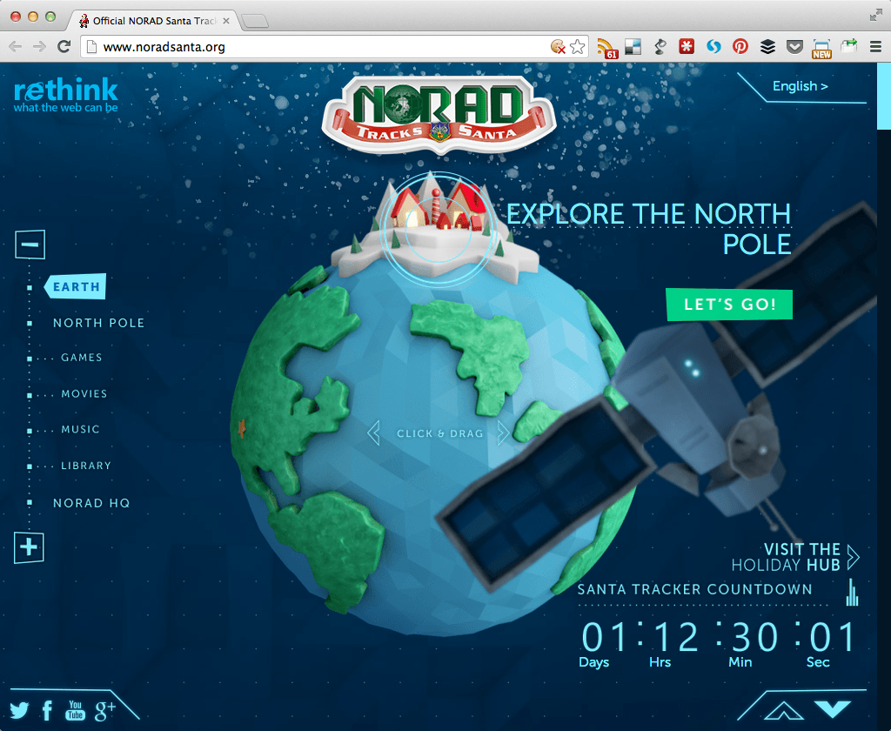
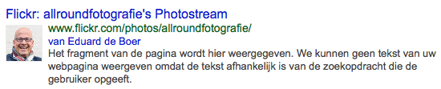

> **Historisch archief.** Deze aflevering verscheen op 23-12-2013 als onderdeel van ReputatieCoaching (2012–2016). De oorspronkelijke tekst is hieronder historisch bewaard. Diensten, contactgegevens, links, tools en adviezen kunnen inmiddels verouderd zijn.



**Transcriptiestatus:** Volledige transcriptie uit het oorspronkelijke archief.

***Historische afbeelding niet beschikbaar: ReputatieCoaching Podcast*
Nog twee dagen en dan is het Kerstmis. Omdat ik deze keer echt niet te laat wilde zijn met de podcast en ik ook nog eens druk ben met de voorbereidingen voor Kerstmis, heb ik de content voor deze podcast iets eerder verzameld dan normaal en de podcast ook iets eerder ingesproken, namelijk afgelopen zaterdag. Dat zal niets afdoen aan de kwaliteit van de content, want ik heb weer een aantal interessante nieuwtjes en weetjes voor je.**

**Ik kom eerst nog eventjes terug op het onderwerp van Pinterest Place Pins, waar ik het in [podcast 53](https://www.reputatiecoaching.nl/53/) ook al over had en heb ik nieuws over Google Authorship, want er worden beduidend minder profielfoto’s in de zoekresultaten vertoond dan voorheen en ik leg je uit hoe je Google Authorship op Flickr kunt activeren.**

**Verder vertelde Matt Cutts dat duplicate content eigenlijk helemaal niet iets is om bang voor te zijn, want zo’n 25–30% van het web bestaat uit duplicate content. Ik sluit af met een stuk over reactietijden van bedrijven, het antwoord op de vraag waarom je snel moet reageren op vragen die jou bereiken en wat jij er als kleine zelfstandige aan kunt doen om met weinig inspanning en bovenal GRATIS toch alle social media en grote review sites te monitoren.**

Hallo en hartelijk welkom bij deze aflevering van de ReputatieCoaching Podcast. Mijn naam is Eduard de Boer, ook bekend als de ReputatieCoach. Dit is dé podcast die je moet beluisteren als je meer wilt leren over online reputatie en reputatiemanagement en ook als je wilt werken aan je online reputatie en je online vindbaarheid wilt verbeteren. Dit alles kan je helpen om jezelf beter op de online kaart te plaatsen, waardoor je als bedrijf meer business kunt doen.

Als persoon kun je met de diverse tips aan de slag om bijvoorbeeld je online reputatie als timmerman, laborant, restaurantkok, meteoroloog, keukenhulp of wat dan ook te verbeteren.

In deze podcast komen diverse links aan de orde en ook heb ik het over een paar online video’s. Op [www.reputatiecoaching.nl/56](https://www.reputatiecoaching.nl/56/) kun je de volledige transcriptie teruglezen en ook de links opzoeken en de afbeeldingen en video’s bekijken:

[caption id="" align=“aligncenter” width=“512”][](https://lh4.googleusercontent.com/-QVruqyCfrRw/UrfB7HJ0AFI/AAAAAAAAAPk/dlEWDsmE3uU/w1024-h840-no/20131222-Santa-Tracker-screen.png) Track Santa op Norad[/caption]

Oh, voordat ik overga op de onderwerpen van vandaag even een update over de Kerstman. Er zijn diverse sites waar je ’m vanaf morgenavond kunt volgen in zijn reis rond de wereld terwijl hij overal zijn pakjes brengt. De bekendste sites zijn wel de [Track Santa op Norad](http://www.noradsanta.org/) en de [Google Santa Tracker](http://www.google.com/santatracker/). In de show notes heb ik een video van Norad opgenomen, waarin zij laten zien hoe zij de Kerstman volgen:

Dan over op de onderwerpen voor vandaag…

## Pinterest Place Pins voor betere lokale vindbaarheid

In [podcast 53](https://www.reputatiecoaching.nl/53/) vertelde ik je over een nieuwe feature in Pinterest, te weten “Place Pins”. Met deze nieuwe functionaliteit kun je je gepinde afbeeldingen en foto’s koppelen aan locaties. Wellicht is het niet voor iedereen duidelijk hoe dit werkt. Daarom heb ik afgelopen week hiervoor een instructievideo gemaakt, die ik met een [begeleidend artikel heb gepost op 42bis.nl](http://www.42bis.nl/2013/12/pinterest-place-pins-zet-je-pins-op-de-kaart/), om zo een groter publiek te bereiken.

Deze instructievideo heb ik opgenomen in de show notes:

```
  * Het instellen van een pinbord als kaart
  * Het koppelen van pins aan locaties
  * Hoe de kaarten er uitzien, als je pins erop hebt geplaatst
  * Hoe een pin op een kaart wordt vertoond
```

Ik denk dat je Place Pins goed kunt gebruiken voor het verstevigen van je lokale presence en het verbeteren van je rankings in de lokale zoekresultaten.

Daarvoor moet jouw bedrijfslocatie wel eerst op Foursquare staan. Je kunt je bedrijf binnen een paar minuten aanmelden, zoals je kunt zien in de video: “[Je bedrijf aanmelden op Foursquare](https://www.reputatiecoaching.nl/je-bedrijf-aanmelden-op-foursquare/)”, die ik een tijd geleden al heb gepubliceerd. Alleen kan het best lang duren, totdat je de verificatiecode per post krijgt toegestuurd. Eventueel kun je het proces bespoedigen, door een betaling van circa US$20 te doen. Dan is je bedrijf meteen geverifieerd.

Maar om Pinterest Place Pins te kunnen gebruiken is het voldoende als je je bedrijf hebt aangemeld, het hoeft niet per se geclaimd en geverifieerd te zijn. Echter, het kost wel zo’n 2–3 dagen tot je bedrijf zichtbaar is op Pinterest, nadat je het op Foursquare hebt aangemeld.

Mijn advies is om eens een paar foto’s van je bedrijf te pinnen en te koppelen aan je bedrijfslocatie op de kaart. Daarbij moet je in de omschrijving bij de foto natuurlijk je bedrijfsnaam, adres, postcode, plaats en telefoonnummer vermelden, evenals een aantal hash tags als clickable keywords.

Verder zou ik in het veld “bron” experimenteren met verschillende soorten URLs:

```
  1. Naar de Google+ pagina van je bedrijf
  2. Naar de voorpagina van je website
  3. Naar dieper gelegen content op je eigen site
  4. Naar je Facebookpagina
  5. Naar posts op Google+
  6. Naar je Flickr account
```

… enzovoorts…

Pin gewoon eens een stuk of tien tot twintig foto’s, waarbij je dus verwijst naar verschillende URLs en laat die foto’s staan. Om de indexering van de pagina’s met die content te bespoedigen, zou je het volgende kunnen doen:

```
  * de pin embedden in een artikel
  * de URL van de pagina met de pin tweeten
  * de URL van de pagina met de pin noemen in een Google+ post
```

Bekijk voor die tijd je positie in de lokale zoekresultaten en maak een screenshot voor alle zekerheid. Kijk dan vervolgens zo eens per week of per twee weken of je positie in de lokale zoekresultaten verbetert. Zoek wel op meerdere termen (die je als het goed is ook hebt gebruikt in de omschrijving bij de pin), om er zo zeker van de zijn dat je het goede meet.

Hoewel ik het niet kan garanderen, zegt mijn gevoel dat je op den duur door deze actie toch echt een betere positie moet hebben in de lokale zoekresultaten… Helemaal als je het combineert met het creëren van nog meer citations c.q. bedrijfsvermeldingen.

De tandartspraktijk in de instructievideo staat al bovenaan in de lokale zoekresultaten, dus nu maar eens zien of de ijssalon in Apeldoorn de komende weken of maanden ook naar de eerste plaats stijgt.

Dit artikel was mijn eerste artikel op 42bis.nl. Ik had pas na publicatie in de gaten dat ik in mijn profielinstellingen binnen WordPress ook mijn Google+ profiel kon opgeven. Dat heb ik natuurlijk meteen gedaan, evenals dat ik op mijn Google+ profiel heb aangegeven dat ik een bijdrager ben op 42bis.nl.

Zoals je begrijpt was dat voor het [activeren van Google Authorship](https://www.reputatiecoaching.nl/wiki/google-authorship/), om zo mijn foto eventueel in de zoekresultaten erbij vertoond te krijgen. Op het moment dat ik deze podcast maak staat mijn naamsvermelding met de link naar mijn Google+ profiel er (nog) niet bij. Maar ik heb de URL van het artikel in de [Structured Data Testing Tool](http://www.google.nl/webmasters/tools/richsnippets) van Google getest en volgens Google staat alles goed om mijn foto en de Google+ vermelding erbij te vertonen. In de show notes heb ik een screenshot van de resultaten opgenomen:

[Historische afbeelding: Google Authorship op 42bis.nl](https://lh5.googleusercontent.com/AyiV6hbm5oe3lU0IU13TmMjQjzhBTRx1fr2wQZ8E8mU=w554-h112-no)

42bis.nl is één van de blogs die zijn opgezet door [Xaviera Ringeling](https://plus.google.com/+XavieraRingeling/), met tientallen verschillende bloggers. Volgens mij willen de meeste bloggers op dat platform best graag extra exposure of kunnen ze het wel gebruiken. Ik heb even snel de eerste 15 pagina’s met zoekresultaten op de term “site:42bis.nl” doorgekeken om te zien hoe intensief Google Authorship wordt gebruikt door hedendaagse bloggers…

Wat mij dan zo verbaast, is dat alleen Xaviera Ringeling Google Authorship heeft geactiveerd en voor zover ik snel kon zien, geen of niet veel andere bloggers. Daar ligt een enorme kans, mensen! Als je al aan het bloggen bent, dan wil je toch bouwen aan je online bekendheid, herkenning, autoriteit en reputatie? Waarom stel je dan geen Authorship in? Dat is dan echt een gemiste kans.

## Google Authorship foto’s worden minder vertoond

Zoals je wellicht weet koppel je met behulp van Google Authorship de content die jij produceert aan je Google+ profiel.

Door een speciale link naar je Google+ profiel op te nemen in je artikel en op je Google+ profielpagina te linken naar de site waar je artikel staat, kan Google dan zien dat het content van jou is. Voordat we de beschikking hadden over [vanity URLS op Google+](https://www.reputatiecoaching.nl/google-vanity-url-claimen/) moest je die complexe URL met zo’n lange reeks cijfers opgeven als je Google+ profiel.

Maar John Mueller van Google heeft afgelopen week bekendgemaakt dat je ook je vanity URL mag gebruiken: voor Google is het allemaal hetzelfde.

Zo kan Google dan door de tijd een goed beeld krijgen van de onderwerpen waar jij over blogt en schrijft op de diverse sites op Internet. Hierdoor bouw je aan een online reputatie; en als je maar genoeg interessante content produceert die wordt gelezen en gedeeld, dan word je op een gegeven momen in de ogen van Google een autoriteit.

Je moet weten dat de aanwezigheid van een goede profielfoto naast de zoekresultaten de CTR ofwel Click Through Rate kan verdubbelen. Zo krijg je dus op een snelle en relatief eenvoudige wijze ook meer bezoekers naar je blog of het desbetreffende artikel.

Toen Google dit bekendmaakte zag je dat –vooral in Amerika– marketeers en bloggers hier volop insprongen, om maar hun foto in de zoekresultaten te krijgen. In het prille begin moest je je voor Authorship aanmelden, later kon je het zelf activeren op de manier, zoals ik zojuist vertelde.

Ook pagina’s met geen of vrijwel geen zinnige content konden met behulp van Google Authorship foto’s in de zoekresultaten laten verschijnen. Als je het volgens het principe van Google Authorship bekijkt is dat niet fair ten opzichte van bloggers en auteurs die wel relevante en unieke content produceren.

Afgelopen oktober kondigde Google daarom tijdens PubCon aan dat ze het aantal vertoonde foto’s met zo’n 15% zou gaan reduceren. Ook zou het vertonen van andere richt snippets, zoals review sterretjes worden teruggebracht.

Nou, dat eerste is afgelopen week gebeurd…

Matt Cutts zei hierover dan ook simpelweg:

Op de fora, Google+ en op Twitter zie je overal berichten waarin mensen klagen dat hun foto ineens niet meer wordt vertoond in de zoekresultaten. Ik denk dat hun content mogelijk niet relevant of interessant genoeg was volgens Google en dat daarom geen foto’s meer worden vertoond. Wel zie je soms nog de naam van de auteur in de zoekresultaten verschijnen, maar dan dus zonder foto…

## Google Authorship op Flickr

Het was al bekend dat je Google Authorship op je weblog kon krijgen natuurlijk, evenals op een aantal andere sites. Recentelijk heeft Google ook aangekondigd dat zij Authorship zou activeren op onder andere wordpress.com.

Maar toevallig kwam ik er eerder deze week achter dat je ook Google Authorship kunt instellen op Flickr. In de show notes heb ik een screenshot opgenomen, waarin je kunt zien dat het volgens de [Structured Data Testing Tool](http://www.google.nl/webmasters/tools/richsnippets) van Google nu goed ingesteld moet staan. Nu is het nog even wachten tot die content op Flickr is geïndexeerd en de nieuwe resultaten door Google worden vertoond.

[](http://www.flickr.com/photos/allroundfotografie/)

Het enige wat ik hiervoor heb gedaan is:

```
  * In Flickr als website de URL van mijn Google+ profiel opgeven met de toevoeging ‘&rel=author’ aan het einde van de URL
  * In mijn Google+ profiel onder het kopje “Bijdrager aan” een link naar flickr.com toevoegen
```

Zo gemakkelijk kan het dus zijn! Ik sta er zelfs soms ook versteld van!

## Duplicate content volgens Matt Cutts

Matt Cutts beantwoordt de vraag hoe Google omgaat met duplicate content en het effect dat dit kan hebben op de positie in de zoekmachines vanuit SEO-perspectief. Zoals je wellicht weet is duplicate content, dezelfde content die op meerdere plaatsen is gepubliceerd. In het verleden is Google hard opgetreden tegen duplicate content, maar dan met name tegen duplicate content van lage kwaliteit.

Matt begint met te vertellen dat zo’n 25–30% van alle content op het web bestaat uit duplicate content. Als voorbeeld haalt hij de manual-pagina’s voor Linux aan, die op tienduizenden sites wereldwijd staan. Dus duplicate content ontstaat gewoon; mensen citeren een uitspraak van een blogbericht en linken vervolgens naar het blogbericht enzovoorts.

Dit wil dus niet zeggen dat alle duplicate content meteen ook wordt gezien als spam. Als Google dit wel als spam zou bestempelen, dan is de kans groot dat dit zelfs een negatief effect op de kwaliteit van de zoekresultaten heeft.

Google zoekt ook specifiek naar duplicate content en als ze het vinden, wordt die content gegroepeerd en behandeld alsof het één stuk content is. Als Google zoekresultaten teruggeeft en twee pagina’s zijn vrijwel identiek, dan wordt er één pagina getoond en de andere dus niet.

Het is dus niet zo dat duplicate content in zijn algemeenheid als spam wordt behandeld, maar als iets wat geclusterd moet worden om er zo voor te zorgen dat het correct scoort in de zoekresultaten.

Aan de andere kant: als jij niets anders doet dan duplicate content publiceren en probeert zo de zoekresultaten te beïnvloeden, dan behoudt Google zich het recht voor om actie te ondernemen op jouw content om het alsnog als spam te markeren.

Matt zegt dat je je echt geen zorgen hoeft te maken, als je wat duplicate content op je site hebt, zolang je maar niet massaal bestaande content (al of niet geautomatiseerd) kopieert naar je site.

## Matt Cutts over IP-nummers voor internationale sites

Afgelopen week verscheen nog een video van Matt Cutts. Wellicht is deze voor de meeste luisteraars van de ReputatieCoaching Podcast niet echt relevant. De vraag is of je websites vanaf land-specifieke IP-nummers moeten komen, als je een bedrijf hebt dat in meerdere landen is vertegenwoordigd, waarbij voor elk land ook een aparte website is met een eigen domeinnaam.

Matt antwoordt dat idealiter elke landspecifieke website met een eigen domein ook moet worden gehost op een server met een IP-adres in dat land. Maar Google begrijpt dat dit vaak torenhoge kosten met zich mee kan brengen en dat het om andere redenen ook niet realistisch is, om dit te eisen.

Zolang je aparte top-level domeinnamen hebt, mag je gerust alle domeinnamen vanaf 1 IP-nummer laten komen. Google kan deze sites prima van elkaar onderscheiden.

## Community management top 100: welk merk reageert het snelst?

Op Frankwatching las ik deze week een leuk artikel over hoe snel de 100 grootste Nederlandse bedrijven reageren op berichten op hun openbare Facebook profiel. De titel van dit artikel is: “[Community management top 100: welk merk reageert het snelst?](https://www.frankwatching.com/archive/2013/12/19/community-management-top-100-welk-merk-reageert-het-snelst/)”.

In het onderzoek is onderscheid gemaakt tussen de reactietijd tijdens kantooruren en buiten kantooruren. Frappant was dat ABNAMRO overdag 31 minuten nodig had en ’s avonds slechts 13 minuten om te reageren. Met deze 13 minuten was ABNAMRO het snelst reagerende bedrijf. Vodafone scoort de eerste plaats met hun reactietijd tijdens kantooruren: gemiddeld 26 minuten!

Wist je dat 53% van de klanten tegenwoordig van grote merknamen verwacht dat deze binnen één uur reageren op een Tweet? Gelukkig ligt de lat zo hoog voor grote namen als vliegmaatschappijen en merken als Nike, CocaCola, McDonalds etc.

Want zeker voor zelfstandige ondernemers en kleine bedrijven is dit echt schier onmogelijk! Nu komt dit statement wel uit Amerika, waar de online communicatie en dialogen via de sociale media al een stuk gangbaarder zijn. Aan de andere kant: tegenwoordig kun je via Twitter ook je vlucht al omboeken bij KLM, of vragen stellen over je mobiele abonnenment bij bijvoorbeeld Vodafone en T-Mobile. Dus we halen in Nederland onze achterstand op Amerika in.

Uit een recent onderzoek in de USA waarin deze cijfers naar boven kwamen, werd ook duidelijk dat maar liefst 38% van de geïnterviewden een negatieve indruk krijgt van een merk, als dit niet binnen afzienbare tijd op een Tweet reageert.

47% van de populatie gaf aan eerder bereid te zijn een positieve review te posten, of het bedrijf positief te noemen in de social media als snel en adequaat wordt geantwoord.

## Reputatie van kleine zelfstandigen bewaken en verbeteren

Het is logisch dat je als zelfstandig ondernemer dit nooit of te nimmer zult kunnen evenaren. Gelukkig verwachten je klanten dat ook niet. Maar als je helemaal niet reageert op een bericht, dan heeft dit natuurlijk wel een negatief effect op je reputatie en dan loop je het risico dat er negatieve berichten over je bedrijf online komen. Dat wil je natuurlijk het liefst voorkomen.

Want wist je dan inmiddels 90% van je zakelijke klanten jouw bedrijf of het gewenste product of dienst op Internet opzoeken en bekijken wat anderen ervan vinden?

Zorg daarom voor een paar simpele zaken:

```
  1. **Heb een contactpagina die werkt** – Het klinkt gek, maar ik heb al een aantal keren gezien dat een formulier op een contactpagina niet, of niet meer werkt, of dat bepaalde customer care Twitter accounts niet in de gaten werden gehouden. In elk geval kwam de communicatie niet aan bij het bedrijf. Dat is natuurlijk dodelijk voor je online reputatie. Test dus ook af en toe je eigen contactpagina en andere contactmogelijkheden.
  2. **Toon overal een heldere link naar je contactpagina** – Bezoekers van je site hebben geen zin in lang zoeken naar hoe ze je kunnen bereiken. Zet daarom overal een duidelijke link naar je contactpagina en publiceer ook op elke pagina het telefoonnummer waar je op te bereiken bent.
  3. **Meld je gemiddelde reactietijd op je site** – Zet bij voorkeur op je contact-pagina wanneer mensen het beste met jouw bedrijf contact kunnen opnemen en wat ze kunnen verwachten ten aanzien van de reactietijd.
  4. **Hou niet alleen social media, maar ook alle grote review sites in de gaten** – Het is natuurlijk gemakkelijk overdag op je smartphone of ’s avonds op je tablet snel even Facebook, Twitter, Foursquare en Google+ langs te lopen om te zien of je nog ergens bent genoemd of dat mensen contact met je willen. Maar hou ook de diverse grote review sites in de gaten, om ook daar snel te kunnen reageren, als iemand een recensie over jouw bedrijf of dienstverlening post.
  5. **Huur een telefoniste in, als je zelf slecht bereikbaar bent** – Stel je hebt een bedrijf met verkzaamheden waarbij je vaak niet gestoord kunt worden, terwijl je bezig bent. Dan kun je natuurlijk je berichten naar je voicemail laten gaan. Maar wist je dat je dan vaak meer dan zo’n 60% misloopt! De meeste mensen hebben namelijk een hekel aan voicemail en spreken dus niets in. Voor een paar tientjes per maand heb je een telefoniste die persoonlijk tussen bijvoorbeeld 08:30 ’s ochtends en 21:00 ’s avonds de telefoon opneemt met jouw bedrijfsnaam. En jij krijgt de gegevens van alle telefoongesprekken in je mail. Dat vind ik echt ideaal!
```

En in het verleden heb ik je ook al eens geattendeerd op Google Alerts. Zo heb ik onder andere natuurlijk een alert aan staan, waarbij ik automatisch een mailtje krijg van Google, als zij ergens een pagina tegenkomen, waarbij mijn naam wordt vermeld. En komisch genoeg kreeg ik eerder deze week opeens een mailtje, met daarin de link naar mijn artikel over [Pinterest Place Pins](http://www.42bis.nl/2013/12/pinterest-place-pins-zet-je-pins-op-de-kaart/) op 42bis.nl. Daarvoor was het maandenlang rustig, omdat nergens mijn naam werd vermeld.

Nu hoefde ik natuurlijk niet te reageren, omdat ik zelf het artikel had gepubliceerd. Maar je ziet dat het principe gewoon werkt, ook al vergeet jij dat je het ooit überhaupt hebt ingesteld.

Op dit moment ben ik aan het experimenteren met een paar Google spreadsheets in combinatie met de functie ImportXML, om zo een realtime dashboard te maken, waarop je de reviews van je bedrijf, het aantal Likes, Followers en je Klout-score kunt monitoren. Ik zeg niet dat je de hele dag zo’n scherm open moet hebben staan als kleine ondernemer, maar door elke avond eventjes snel de spreadsheet te openen, hou je wel een vinger aan de pols en kun je zien als er ergens nieuwe reviews over jouw bedrijf of dienstverlening worden achtergelaten.

Helaas staan deze spreadsheets nu nog in de kinderschoenen. Ik wil er zelf nog iets meer mee experimenteren, ze iets uitbreiden en opleuken, zodat ik ze begin februari met je kan delen. Wellicht kunnen we dan met gezamelijke inspanning tot nog betere resultaten komen.

Als je de podcast leuk vindt en je hebt inderdaad wat aan alle informatie die ik met je deel, help mij dan met het verder verbeteren en promoten van deze podcast. Deel ‘m op Twitter, like ‘m op Facebook of geef een “+1” op Google+. Het zou helemaal super zijn, als je een bericht achterlaat op iTunes of LinkedIn.

Als je een vraag of een probleem hebt met betrekking tot je online reputatie of de vindbaarheid van je website, kun je een mailtje sturen naar [podcast@reputatiecoaching.nl](mailto:podcast@reputatiecoaching.nl). Als je dat te lastig vindt, of als je de podcast beluistert terwijl je in de auto zit en je hebt acuut een vraag, spreek dan een boodschap in op de ReputatieCoaching Hotline, op nummer: 084 - 883 15 56. Mogelijk behandel ik je vraag of probleem dan in een artikel of in de podcast.

Als laatste kun je je ook inschrijven voor de nieuwsbrief. Dan ontvang je altijd als eerste het laatste nieuws wat ik publiceer en automatisch elk kwartaal het ReputatieCoaching Podcast Boek van het afgelopen kwartaal. Surf daartoe naar [www.reputatiecoaching.nl/nieuwsbrief/](https://www.reputatiecoaching.nl/nieuwsbrief/) en schrijf je meteen in.

En je kunt ook rechtstreeks op de website een voicemail achterlaten, door op de tab aan de rechterkant van elke pagina te klikken, en je bericht in te spreken. Dit was [ReputatieCoaching Podcast aflevering 56](https://www.reputatiecoaching.nl/56/) en mijn naam is [Eduard de Boer](http://nl.linkedin.com/in/eduarddeboer/nl).

Ga de komende week lekker Kerstmis vieren met de mensen die je dierbaar zijn. Laat je online reputatie even voor wat het is en geniet!

Ik wens je in elk geval fantatische Kerstdagen en ik hoop je volgende week weer te ontmoeten in de podcast.

***Merry Christmas… Ho-Ho-Hooooo!!***

Links naar artikelen die in deze podcast aan bod komen:

```
  * “[Study: 72% Of Consumers Expect Brands To Respond Within An Hour To Complaints Posted On Twitter](http://marketingland.com/study-72-of-consumers-expect-brands-to-respond-within-an-hour-to-complaints-posted-on-twitter-63496)” (Marketing Land, 31 oktober 2013)
  * “[Community management top 100: welk merk reageert het snelst?](https://www.frankwatching.com/archive/2013/12/19/community-management-top-100-welk-merk-reageert-het-snelst/)” (Frankwatching, 19 december 2013)
```
