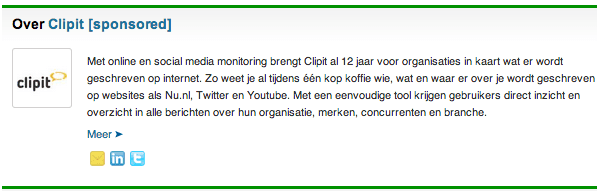

> **Historisch archief.** Deze aflevering verscheen op 30-12-2013 als onderdeel van ReputatieCoaching (2012–2016). De oorspronkelijke tekst is hieronder historisch bewaard. Diensten, contactgegevens, links, tools en adviezen kunnen inmiddels verouderd zijn.



**Transcriptiestatus:** Volledige transcriptie uit het oorspronkelijke archief.

***Historische afbeelding niet beschikbaar: ReputatieCoaching Podcast*
Tjonge, inmiddels is dit alweer de laatste podcast van 2013. Terwijl ik deze podcast inspreek, hoor ik overal in de verte vuurwerk knallen, als voorbode voor de jaarwisseling.**

**Morgen is het Oudjaarsdag en nemen we om middernacht afscheid van 2013 om dan 2014 welkom te heten. Zo’n laatste uitzending van het jaar is vaak typisch een moment om terug te blikken, want ook dit jaar is er weer veel gebeurd op het gebied van contentmarketing, social media, zoekmachines enzovoorts. Ik focus me vandaag even op de social media.**

**Begin 2013 postte ik een zevental trends die ik voorzag in 2013. We zullen zien wat daarvan is uitgekomen of terechtgekomen.**

**Op Frankwatching las ik een artikel dat de waarde en de bruikbaarheid van Google Alerts afneemt en dat je wellicht andere monitoring tools moet gaan zoeken, als je echt wilt weten wat er online zoal over je bedrijf of je merknaam wordt geschreven en gezegd.**

**En inmiddels zul je waarschijnlijk de naam “Hummingbird” in een groot aantal artikelen zijn tegengekomen. Maar wat is Hummingbird nu precies en hoe kun jij ervoor zorgen dat jouw content goed wordt beoordeeld door het Google Hummingbird algoritme?**

**Alle voornoemde onderwerpen komen in deze 57e ReputatieCoaching Podcast aan bod. Dus blijf luisteren als er één of meer onderwerpen bij zitten, die je aanspreken.**

Hartelijk welkom bij deze aflevering van de ReputatieCoaching Podcast. Mijn naam is Eduard de Boer, ook bekend als de ReputatieCoach. Dit is dé podcast die je moet beluisteren als je meer wilt leren over online reputatie en reputatiemanagement en ook als je wilt werken aan je online reputatie en je online vindbaarheid wilt verbeteren. Dit alles kan je helpen om jezelf beter op de online kaart te plaatsen, waardoor je als bedrijf meer business kunt doen.

Als persoon kun je met de diverse tips aan de slag om bijvoorbeeld je online reputatie als glazenwasser, beleidsadviseur, tegelzetter, stratenmaker of wat dan ook te verbeteren.

Vandaag is het de op één na laatste dag van 2013, dus ik houd deze podcast waarschijnlijk iets korter dan dat je normaal gewend bent. Want net als de afgelopen paar weken is het vrij rustig qua nieuws.

## Belangrijkste social media updates in 2013

Laat ik dan maar eens beginnen met de belangrijkste social media en internet marketing updates in 2013. Google is natuurlijk hard opgetreden tegen spam sites: die vind je gewoon niet meer terug in de zoekresultaten. Content marketing is heel belangrijk geworden, nog belangrijker dan het al was. Om tegenwoordig te worden gezien als autoriteit volstaat het posten van korte berichtjes van een paar honderd woorden niet meer: je moet echt de zogenaamde long-form en in-depth, ofwel lange en diepgaande content produceren. Maar laten we eens kijken naar de belangrijkste social media.

**Facebook**
*Historische afbeelding niet beschikbaar: Bedrijfspagina maken op Facebook*
Om te beginnen “Facebook”: op dit moment nog steeds het grootste social media netwerk. Facebook heeft dit jaar de “Graph Search” geïntroduceerd, waarmee je heel gericht kunt zoeken in je sociale netwerk. Dit biedt ook enorme kansen voor Internet marketeers. Je kunt namelijk zoeken op trefwoorden in berichten, status updates, pagina’s, groepen, apps, check-ins en reacties van Facebook vrienden en mensen die publiekelijk posten.

En in navolging van Twitter kwam Facebook dit jaar ook met clickable hashtags. Hiermee kun je gelijksoortige berichten op onderwerp groeperen. Je kunt nu dus klikken op een hashtag in Facebook, om zo alle content te zien die voor die hashtag beschikbaar is in het sociale netwerk. Zelf gebruik ik eigenlijk nog geen hashtags op Facebook en ik zie ze ook nog niet veel toegepast door de mensen met wie ik bevriend ben.

Wellicht wordt dit een nieuwe trend in 2014 en breken de hashtags op Facebook dan echt door… We zullen het zien. Hiermee heb ik meteen een voornemen voor 2014: meer hashtags op Facebook gebruiken. Ik schrijf het meteen op bij de andere voornemens.

**Twitter**
*Historische afbeelding niet beschikbaar: Twitter*
Twitter vertoont nu afbeeldingen in de feeds van mensen. Het is gebleken dat je door afbeeldingen in je tweets op te nemen, je de betrokkenheid van je publiek enorm kunt verbeteren. Dus zorg ervoor dat je visuele content in je tweets opneemt en die uploadt naar Twitter. Gebruik niet alleen een Instagram link, want die wordt niet meer in de feeds vertoond, noch worden die door Twitter geïndexeerd.

Eerder dit jaar heeft Twitter ook “Lead Generation Cards” geïntroduceerd. Hiermee kunnen marketeers direct vanuit tweets leads verzamelen. Twitteraars hoeven slechts eenmaal te klikken om een lead van een Lead Generation Card te worden. Ik ben hier nog niet in gedoken, dus als ik hier binnenkort tijd voor heb, zal ik eens zien wat dit concreet betekent.

**Google+**
[Historische afbeelding: Google+](https://lh3.googleusercontent.com/-4gVxvParT8A/UsCoovPMxyI/AAAAAAAAAQs/K7f8-Ghljyk/s200-no/googleplus-logo-200x200.jpg)
Google heeft dit jaar haar uiterste best gedaan om Google+ beter uit de verf te laten komen. De hele look and feel is op de schop gegaan en ook zijn “gerelateerde hashtags” geïmplementeerd. Hiermee worden automatisch hashtags aan een bericht toegevoegd. Hiermee kunnen marketeers op een nieuwe manier research doen naar onderwerpen, waarover binnen Google+ wordt geschreven.

Ook is het gebruik van Google+ dit jaar flink gegroeid. En Google heeft het Google+ dashboard vernieuwd. Hiermee kunnen bedrijven en individuen gemakkelijker hun online presence beheren in alle Google producten en diensten.

Wat ik zelf de belangrijkste en beste verbetering vindt aan Google+ is wel de introductie van Hangouts, Helpouts, het verlaten van het complexe Zagat-rating systeem voor lokale bedrijven en de herintroductie van de reviewsterretjes in de lokale zoekresultaten.

Hangouts moet je zien als een vervanger voor Skype: je kunt met maximaal 9 andere mensen in een Hangout samen videovergaderen. Ook kun je zo online presentaties houden. En Hangouts on Air bieden je de mogelijkheid om gratis je eigen webinars te organiseren, of andersoortige video-uitzendingen. Deze worden automatisch op YouTube opgeslagen, zodat je de content later nogmaals kunt gebruiken of hergebruiken.

Helpouts is (helaas) nog niet beschikbaar in Nederland. Het is een service, waarmee je op commerciële basis andere Google-gebruikers via video op afstand kunt trainen, helpen, assisteren en adviseren. Zo kun je dus je kennis en ervaring online te gelde maken.

Ruim een jaar lang heeft Google in de lokale zoekresultaten de zogenaamde “Zagat-rating” vertoond, een complex beoordelingsmechanisme voor lokale bedrijven, waarbij de hoogste score 30 punten bedroeg. Gedurende die tijd werden er ook geen review-sterretjes meer vertoond in de lokale zoekresultaten. Maar inmiddels is dat allemaal weer teruggedraaid en zijn de oude, vertrouwde review-sterretjes weer terug.

**Pinterest**
*Historische afbeelding niet beschikbaar: Pinterest*
Pinterest kwam dit jaar met Pinterest accounts voor bedrijven, waardoor je jouw website kunt koppelen aan aan Pinterest-account. Voor de rest lijkt dit vooralsnog niet echt veel meerwaarde te bieden, anders dan dat de autenticiteit van een geclaimd Pinterest-account duidelijk is voor iedereen op Pinterest.

En wat volgens mij natuurlijk een grote vlucht gaat nemen, zijn de [Pinterest Place Pins](http://www.42bis.nl/2013/12/pinterest-place-pins-zet-je-pins-op-de-kaart/), waar ik het ook in [podcast 53](https://www.reputatiecoaching.nl/53/) over had. Met Pinterest Place Pins kun je Pins op de kaart zetten; je koppelt ze dan aan locaties die in Foursquare zijn opgenomen.

Inmiddels heb ik een aantal Pins op de kaart gezet op Pinterest, om eens te zien wat het effect ervan is. Dat is nog heel recent, dus daar kan ik op dit moment verder niets zinnigs over melden. Gezien het lokale c.q. geografische karakter van de Place Pins, verwacht ik dat dit in de toekomst ook zal gaan meetellen als citation of bedrijfsvermelding die wordt gebruikt voor het bepalen van de positie in de lokale zoekresultaten in diverse social media en zoekmachines.

## 7 online marketing trends in 2013

1 januari 2013 publiceerde ik een [zevental online marketing trends](https://www.reputatiecoaching.nl/7-online-marketing-trends-in-2013/), waarvan ik verwachtte dat die actueel zouden worden of een grote vlucht zouden nemen. Deze 7 trends waren:

```
  1. Unieke en relevante content is cruciaal
  2. Het belang van social media neemt verder toe
  3. Autoriteit, reputatie en reputatiemanagement
  4. Wedergeboorte van e-mail marketing
  5. Verdere groei “mobiel”
  6. Lokaal zoeken en gevonden worden
  7. Outsourcing van online activiteiten
```

**1. Unieke en relevante content is cruciaal**
Laat ik ze één voor één kort langs lopen. Als eerste: “*Unieke en relevante content is cruciaal*”.
Simpelweg samenrapen van wat losse brokken tekst van diverse sites is niet meer van deze tijd. Ook het over en weer linken van sites wordt al snel als black-hat beschouwd. Veel bedrijven zijn zelfs bang om over en weer te linken.

Google rolt inmiddels bijna wekelijks spammy blog- en linknetwerken op. Dit jaar is het echt essentieel geworden, om relevante en unieke content te produceren. Het is niet voor niets dat Google meer waarde lijkt te hechten aan Google Authorship, waar ik zo nog even op terugkom en zelfs speciale schema.org markup introduceert voor in-depth content…

**2. Het belang van social media neemt verder toe**
Als tweede: “*Het belang van social media neemt verder toe*”.
Ik heb het gevoel dat Twitter wat in populariteit afneemt en dat de groei van Facebook afzwakt, omdat mensen soms een beetje Facebook-moe worden. Ook gaan bedrijven beter inzien dat ze social media ook moeten inzetten om verkeer naar hun eigen sites te trekken en niet alleen maar online de interactie aan moeten gaan.

Google+ daarentegen lijkt sneller te groeien. Wellicht is dat ook mijn perceptie, omdat ik zelf de laatste tijd actiever ben op Google+. Maar zoals ik laatst al vertelde, haal ik tegenwoordig meer en meer nieuws uit Google+ en minder uit de RSS-feeds, waarop ik geabonneerd ben.

**3. Autoriteit, reputatie en reputatiemanagement**
Google Authorship wordt belangrijker, maar recentelijk heeft Google er een beetje een rem op gezet. Er worden sinds een paar weken beduidend minder foto’s in de zoekresultaten vertoond. De fora en andere discussiegroepen staan hier bol van.

**4. Wedergeboorte van e-mail marketing**
De voorspelling dat e-mail marketing zou worden herontdekt in 2013 lijkt niet echt uitgekomen. Wellicht was ik daarmee iets te vroeg, want je leest het nu op veel toonaangevende sites als één van de trends voor 2014.

**5. Verdere groei “mobiel”**
Mobiel gebruik groeit nog steeds boven verwachting. 4G netwerken zien inderdaad het levenslicht, waardoor we overal nog sneller, meer informatie kunnen consumeren.

En het lijkt er inderdaad op, dat .mobi sites verdwenen zijn, want ik zie ze bijna niet meer. Ook *m.bedrijf.nl* wordt steeds minder gebruikt voor mobiele sites.

Dit komt allemaal door de snelle opmars van responsive webdesign, waarbij websites met behulp van HTML5 en CSS3 automatisch goed vertoond worden op desktops, alsmede op smartphones en tablets.

Dus ook die voorspelde trend is uitgekomen.

**6. Lokaal zoeken en gevonden worden**
Dan als zesde: het belang van lokaal gevonden worden. Dit is inderdaad ook belangrijker geworden. Steeds meer bedrijven zie je inspanningen leveren om hun lokale vindbaarheid te verbeteren. Zelf zie ik dit nu ook in de interactie die ik heb met de luisteraars van de ReputatieCoaching Podcast. Er komen steeds meer vragen van bedrijven over hoe ze hun lokale presence kunnen verbeteren en hoe ze in de lokale zoekresultaten hoger kunnen scoren dan hun concurrenten.

**7. Outsourcing van online activiteiten**
De groei van outsourcing was de zevende trend die ik voorzag. Ook die trend is volgens mij niet echt bijzonder uitgekomen. Je ziet juist dat bedrijven bezig zijn de productie van content weer naar zich toe te trekken en zelfs ook “Content Marketing Officer”-functies openstellen.

Wellicht komt dit, doordat een buitenstaander meestal nèt níet die toon kan neerzetten in een stuk content, als dat een eigen medewerker dit kan.

## Google Alerts

[Historische afbeelding: Google Alerts](https://lh3.googleusercontent.com/-SQ6x5UkM6dg/UsCrf1k5gaI/AAAAAAAAARM/LRVi0Zcxicw/s200-no/google-alerts-200x200.png)
Nou, op zich zijn de meeste trends dus wel uitgekomen. Voor het in de gaten houden van een aantal trends gebruik ik Google Alerts. Daarmee zie ik automatisch nieuwe content in de RSS-feeds die ik lees en krijg ik mailtjes als er ergens nieuwe content opduikt.

Maar volgens een artikel op Frankwatching met als titel “[Google Alerts vs. social media monitoring: de feiten op een rij](https://www.frankwatching.com/archive/2013/12/23/google-alerts-vs-social-media-monitoring-de-feiten-op-een-rij/)” neemt de waarde van Google Alerts snel af, doordat steeds minder content gevonden lijkt te worden.

Mijn gevoel is ook wel een beetje, dat er steeds minder relevante artikelen worden gerapporteerd door Google Alerts. Dat is ook de reden dat ik steeds meer afstap van Google Alerts voor het vergaren van nieuws en me meer op RSS-feeds van specifieke sites en ook algemene nieuwssites abonneer. In combinatie met de berichten die ik dan lees op Google+ blijf ik eigenlijk beter op de hoogte.

Echter, als je het artikel beter bekijkt, zie je meteen onder de titel, de tekst “Sponsored artikel” staan. Het blijkt hier te gaan over een vergelijking tussen de gratis dienst van Google, te weten “Google Alerts” en een commercieel product “[Clipit](http://www.clipit.nl/)”. Op zich is dat natuurlijk geen eerlijke vergelijking. Het zou een stuk eerlijker zijn om Clipit te vergelijken met andere social media monitoring tools.

[caption id="" align=“aligncenter” width=“601”]
Over Clipit (bron: Frankwatching)[/caption]

Helaas is het niet mogelijk om via RSS-feeds te monitoren, wat er over mij of bepaalde bedrijven wordt geschreven, omdat Google Alerts steeds minder zoekresultaten teruggeeft. Voor een dergelijke reputatiemonitoring heb je specifieke tools nodig. Het lijkt me interessant om hier komend jaar eens verder in te duiken en mensen van diverse leveranciers van deze software te interviewen. Dus, als er onder de luisteraars bedrijven zijn die social media monitoring tooling leveren, neem dan contact op.

Je kunt reageren onderaan de show notes van deze podcast, die je kunt vinden op [www.reputatiecoaching.nl/57](https://www.reputatiecoaching.nl/57/).

In de tussentijd heb ik –om toch eens de gratis Google Alerts te vergelijken met de eveneens gratis [TalkWalker Alerts](http://www.talkwalker.com/alerts/)– inmiddels ook een paar alerts bij deze laatste ingesteld, om te zien welke tool nu wat rapporteert en hoe snel na publicatie.

## Content voor een “happily humming Hummingbird”?

[Historische afbeelding: Google Hummingbird](https://lh5.googleusercontent.com/p9qQVJEttvOUairOHGgPdOjIEhlrvRSXseEjggtHQ7Y=s200)
Enige tijd geleden heeft Google Hummingbird geactiveerd. Volgens Matt Cutts raakt dit nieuwe algoritme of systeem meer dan 90% van de search **queries**. Let wel: het gaat dus om zoek-**opdrachten**, niet om de resultaten die worden teruggegeven in de vorm van zoekresultaten!

Dat is een essentieel verschil. De updates die Google in het verleden introduceerde onder de vlaggen van “Penguin” en “Panda” hadden betrekking op de zoekresultaten die werden teruggegeven op basis van de ingevoerde zoektermen. Hierdoor werden bepaalde resultaten dan onderdrukt, zoals spammy of zinloze content, en kreeg andere content meer waarde, zoals bijvoorbeeld content van bronnen met een grote mate van autoriteit.

Google wil met Hummingbird de vraag beter kunnen begrijpen, om op basis daarvan betere antwoorden te kunnen geven. Ondanks de duizenden blogberichten en artikelen die over Hummingbird zijn verschenen, weet niemand buiten Google feitelijk wat de impact ervan is op de zoekresultaten en nog belangrijker voor velen: de positie in de zoekresultaten.

Daarom vind ik het ook zinloos om hier verder in te duiken. Maar waar ik me wel op wil focussen, is het type content dat de kolibri (want dat is het Nederlands voor “Hummingbird”) gelukkig maakt. Ik kwam hierover een artikel tegen op [Search Engine Journal](http://www.searchenginejournal.com/google-hummingbird-friendly-content-marketing-tips/79111/).

**Evergreen content**
*Historische afbeelding niet beschikbaar: Evergreen content*
Het eerste type content dat het altijd goed doet en zal blijven doen, is de “evergreen content”. Dat is content waar geen figuurlijke houdbaarheidsdatum aan hangt, omdat het altijd relevant is en blijft. De tegenpool van “evergreen content” is actueel nieuws: het belang en de interesse van het publiek ervoor, is meestal van uitermate korte duur. Daarna raakt het in de vergetelheid.

Het mooie aan evergreen content is dat het –dankzij de continue relevantie– steeds bezocht wordt en groeit in autoriteit en daarmee stijgt in de zoekresultaten.

Ik zal je eerlijk zeggen: tot nu toe heb ik één echt stuk evergreen content geproduceerd. Dat is het artikel met als titel “[Foto uitsnijden en achtergrond verwijderen](https://www.reputatiecoaching.nl/foto-uitsnijden-achtergrond-verwijderen-instructievideo/)”. Daarin laat ik de werking van de online tool [Clipping Magic](http://clippingmagic.com/) zien, met behulp een instructievideo. Ik heb zojuist nog even gekeken: de video heeft op dit moment maar liefst 2.995 views en het artikel is van 31 mei 2013. De laatste dertig dagen is dit artikel meer dan 1.300 keer gevonden en geraadpleegd. Daarvan zijn meer dan 1.100 bezoekers nieuw, is de bounce rate 39% en verblijft men gemiddeld 2m32s op deze pagina.

Omdat we toch een beetje aan het terugblikken zijn: als ik dan kijk naar de statistieken van het hele jaar, dan heeft die pagina sinds 31 mei 4.238 unieke bezoekers gehad.

De meestbekeken twee pagina’s die daarop volgen zijn absoluut geen evergreen content. Die plaatsen worden namelijk ingenomen door twee artikelen over de spookfacturen van “Corpus Justitia”. Dat speelde in september. Ook de site “www.corpusjustitia.nl” die ik toen snel had opgezet beleefde in die periode een hoogtepunt qua aantal bezoekers. Als ik van elke bezoeker een euro zou hebben ontvangen, dan kon ik een paar maanden op vakantie.

De eerstvolgende evergreen pagina vinden we daarna. Dat is de pagina waarin ik uitleg hoe je Outlook.com kunt gebruiken als “[Google Apps alternatief voor email met je eigen domeinnaam](https://www.reputatiecoaching.nl/google-apps-alternatief-voor-email-met-je-eigen-domeinnaam-instructievideo/). Maar die pagina heeft afgelopen jaar ”slechts" 627 unieke bezoekers gehad.

Met de meeste instructievideo’s die ik maak, creëer ik over het algemeen ook evergreen content, want alle pagina’s met instructievideo’s hebben twee belangrijke kenmerken: ze worden steeds meer bezocht en hebben een lage bounce rate. Dat laatste geeft dus aan dat mensen de pagina’s echt lezen en de video’s bekijken.

Mijn doel voor komend jaar is om nog meer evergreen content te produceren. Ook zal ik nog eens in mijn bestaande content duiken, om te zien of ik die wellicht iets kan aanpassen om het meer evergreen te maken, of om evergreen content eventueel toch nog iets te actualiseren, waardoor het nog langer evergreen blijft.

**Educatieve conent / instructiehandleidingen**
Nu begrijp je helemaal, waarom ik telkens weer diverse instructievideo’s met bijbehorende artikelen publiceer. Dit is waardevolle content voor Hummingbird, als je de experts moet geloven. Maar het is ook wel logisch, want met dit soort content help je mensen ècht! Zeker als Google ziet dat bezoekers van die content ook nog eens lang op de pagina verblijven, dan is het voor Google duidelijk: dat is relevante en blijkbaar unieke content.

Wat jij kunt doen voor jouw site, is unieke, relevante en educatieve content produceren, die het beste bij jouw bedrijf of bedrijfsactiviteiten passen. Verzin de meest voor de hand liggende titel en de kans is groot dat deze content hoog gaat scoren. Dan ga ik er gemakshalve wel van uit, dat mensen dit type educatieve content ook zoeken, omdat ze het nodig hebben of er meer over willen weten.

**Veelgestelde vragen en antwoorden**
Die doen het ook nog altijd goed. Want vaak typen mensen ook gewoon vragen in, in het zoekveld op bijvoorbeeld Google. Als je het helemaal goed wilt doen, dan maak je allemaal aparte pagina’s met de antwoorden, waarop je bij voorkeur diep op de materie ingaat, waarna je vervolgens naar die pagina’s linkt met de exacte vraag als anchor-tekst.

Gebruik vervolgens ook nog eens links naar gerelateerde vragen en antwoorden en je hebt goud in handen! Zorg er wel voor, dat jouw FAQs nog niet elders op Internet staan; dus dat je unieke content levert.

**Problemen en oplossingen**
Wat ook goed werkt, is als je heel duidelijk en helder een probleem uitlegt, waarna je de oplossing beschrijft.

**Case studies**
Case studies zijn meestal gebaseerd op een succesverhaal van een product of dienst. Beschrijf hierin ook duidelijk de situatie of het probleem, de oplossing en bovenal het resultaat of de resultaten.

De reden dat case studies het zo goed doen, is dat ze vaak een belangrijke rol spelen in het beslissingsproces van mensen, als ze overwegen een bepaald product of een specifieke dienst af te nemen.

**Top 3, 5, 7 of 10 tips**
Lijstjes met tips of adviezen doen het nog altijd goed en de zoekresultaten staan er bol van.

Je kunt deze vaak omzetten in veelgestelde vragen en antwoorden of een goed artikel. Zo kun je van dikwijls relatief “dunne” content toch unieke en relevante content maken die vervolgens evergreen is en ook nog eens goed kan scoren.

**In-depth artikelen**
Ik zei het al eerder: Google heeft recentelijk de schema.org markup voor “in-depth” artikelen gedefinieerd. Hiermee geeft het bedrijf overduidelijk aan, dat het waarde hecht of gaat hechten aan unieke, diepgaande content.

Diepgaande artikelen zijn ècht langer dan 500 woorden, langer dan 1.000 woorden en inderdaad langer dan drie- of vierduizend woorden. Het zijn artikelen die je niet 1–2–3 schrijft en ook niet 1–2–3 eventjes doorleest. Aan dit soort artikelen is vaak veel research vooraf gegaan en Google begrijpt dit. Dat is dan ook de reden dat het zo wordt gewaardeerd.

Tja, als je het op de keeper beschouwt, dan moet je nog steeds unieke, relevante en interessante content blijven produceren. Zodra de sociale signalen een echte rol gaan spelen, dan worden deze aanbevelingen natuurlijk opeens veel uitgebreider. Maar voorlopig is voor 2014 het advies om goede content te blijven produceren, gekoppeld aan je Google+ profiel om zo je Authorship aan Google te tonen.

Op die manier laat je zien dat je groeit als autoriteit, waarbij natuurlijk je online reputatie toeneemt.

Hiermee kom ik dan aan het einde van deze podcast, die ook meteen de laatste podcast van 2013 is. Wow, ik dacht dat ik het kort zou houden, maar volgens mij ben ik toch weer een goede 20 minuten aan het kletsen. Ik hoop dat ik je ook dit keer weer niet heb verveeld en dat je het leuk vond om naar deze 57e aflevering van de ReputatieCoaching Podcast te luisteren.

Als je de podcast leuk vindt en je wilt ook komend jaar weer continu op de hoogte blijven van de laatste ontwikkelingen op het gebied van social media, contentmarketing, zoekmachineoptimalisatie en gerelateerde onderwerpen, help mij dan met het verder verbeteren en promoten van deze podcast.

Deel deze op Twitter, like ‘m op Facebook of geef een “+1” op Google+. Het zou helemaal super zijn, als je een recensie achterlaat op iTunes of een bericht op LinkedIn.

Als je een vraag of een probleem hebt met betrekking tot je online reputatie of de vindbaarheid van je website, kun je een mailtje sturen naar [podcast@reputatiecoaching.nl](mailto:podcast@reputatiecoaching.nl). Als je dat te lastig vindt, of als je de podcast beluistert terwijl je in de auto zit en je hebt acuut een vraag, spreek dan een boodschap in op de ReputatieCoaching Hotline, op nummer: 084 - 883 15 56. Mogelijk behandel ik je vraag of probleem dan in een artikel of in de podcast.

Als laatste kun je je ook inschrijven voor de nieuwsbrief. Dan ontvang je altijd als eerste het laatste nieuws wat ik publiceer en automatisch elk kwartaal het ReputatieCoaching Podcast Boek van het afgelopen kwartaal. Surf daartoe naar [www.reputatiecoaching.nl/nieuwsbrief/](https://www.reputatiecoaching.nl/nieuwsbrief/) en schrijf je meteen in.

Je kunt ook rechtstreeks op de website een voicemail achterlaten, door op de tab aan de rechterkant van elke pagina te klikken, en je bericht in te spreken. Dit was [ReputatieCoaching Podcast aflevering 57](https://www.reputatiecoaching.nl/57/) en mijn naam is [Eduard de Boer](http://nl.linkedin.com/in/eduarddeboer/nl).

Ik neem aan dat je de komende dagen niet bijster druk zult zijn met het werken aan je online reputatie; ik laat alles in ieder geval even voor wat het is.

Doe net als de meeste andere Nederlanders: zoek je familie, vrienden en andere dierbaren op en ga al feestend dit jaar uit en over in 2014.

Volgende week maandag ben ik natuurlijk weer van de partij met de eerste aflevering van de ReputatieCoaching Podcast in het nieuwe jaar.

Vier lekker feest, maar wees voorzichtig met vuurwerk en rijd niet met drank op.

Ik wens je een goede jaarwisseling en hoop je volgend jaar weer te mogen verwelkomen!

Doei!

Links naar artikelen die in deze podcast aan bod kwamen:

```
  * “[Google Alerts vs. social media monitoring: de feiten op een rij](https://www.frankwatching.com/archive/2013/12/23/google-alerts-vs-social-media-monitoring-de-feiten-op-een-rij/)” (Frankwatching, 23 december 2013)
  * "[Google Hummingbird Friendly Content Marketing Tips](http://www.searchenginejournal.com/google-hummingbird-friendly-content-marketing-tips/79111/) (Search Engine Journal, 26 december 2013)
```
