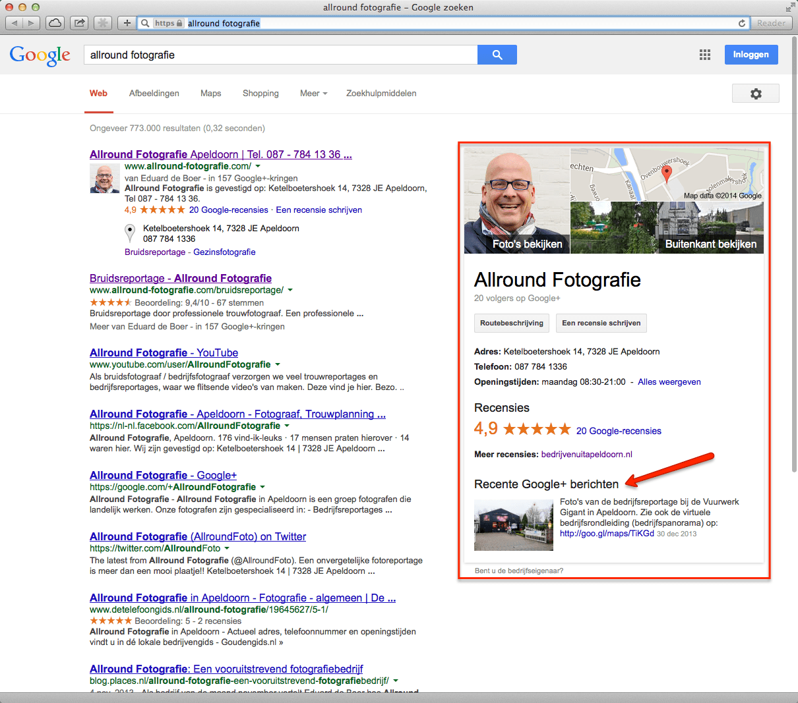
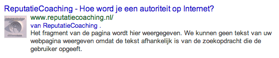
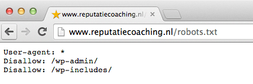
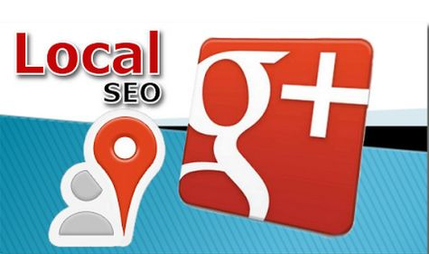

> **Historisch archief.** Deze aflevering verscheen op 6-01-2014 als onderdeel van ReputatieCoaching (2012–2016). De oorspronkelijke tekst is hieronder historisch bewaard. Diensten, contactgegevens, links, tools en adviezen kunnen inmiddels verouderd zijn.



**Transcriptiestatus:** Volledige transcriptie uit het oorspronkelijke archief.

***Historische afbeelding niet beschikbaar: ReputatieCoaching Podcast*
Allereerst nog de beste wensen voor 2014! Ik wens je een fantastisch jaar met een immer toenemende positieve reputatie!**

\*\* Waar ik benieuwd naar ben is of je de jaarwisseling goed bent doorgekomen en ook ben ik nieuwsgierig of jij nog goede voornemens hebt. Zelf heb ik niets met het bepalen van goede voornemens op 1 januari. Ik vind namelijk dat je continu bezig moet zijn met jezelf te verbeteren; volgens mij zou dat een ongoing proces moeten zijn.\*\*

**Ik heb de afgelopen dagen niet bijster veel gedaan qua werk, want ik heb die tijd lekker en vooral ontspannen doorgebracht met familie en vrienden. OK, ik heb nog best een aantal kleine dingetjes gedaan, zoals wat bedrijven helpen met adviezen en het oppoetsen van hun citations of bedrijfsvermeldingen, het maken van een bedrijfspanorama van een vuurwerkwinkel hier in Apeldoorn en natuurlijk probeerde ik op de zijlijn ook nog op de hoogte te blijven van het nieuws dat in mijn vakgebied werd gepubliceerd.**

Laat ik dan maar overgaan op de onderwerpen voor vandaag. Ik begin vandaag met te vertellen hoe Google Publishership je kan helpen met extra exposure. Dan heb ik informatie over de “robots.txt” file, over hoe het kan gebeuren dat Google je site helemaal niet indexeert en vertel ik je hoe je interviews kunt gebruiken om relatief gemakkelijk goede, interessante en unieke blog posts te maken.

Tenslotte leg ik je uit waarom het verstandig is om alvast te beginnen met een citations voorjaarsschoonmaak, zodat je met je website hoger kunt scoren in de lokale zoekresultaten en ook in de organische zoekresultaten.

Hartelijk welkom bij deze eerste aflevering van de ReputatieCoaching Podcast van 2014. Mijn naam is Eduard de Boer, ook bekend als de ReputatieCoach. Dit is dé podcast die je moet beluisteren als je meer wilt leren over online reputatie en reputatiemanagement en ook als je wilt werken aan je online reputatie en je online vindbaarheid wilt verbeteren. Dit alles kan je helpen om jezelf beter op de online kaart te plaatsen, waardoor je als bedrijf meer business kunt doen.

Als persoon kun je met de diverse tips aan de slag om bijvoorbeeld je online reputatie als waarzegger, toneelschrijver, ornitoloog, geodeet, horlogemaker of wat dan ook te verbeteren.

Ik heb ook jouw hulp en feedback nodig, zodat ik precies díe inhoud kan brengen, waar jij behoefte aan hebt en wat jou kan helpen om jouw bedrijf in 2014 naar “the next level” te brengen. Als je vragen hebt naar aanleiding van deze podcast kun je achterlaten onderaan de show notes, die je kunt vinden op [www.reputatiecoaching.nl/58](https://www.reputatiecoaching.nl/58/).

Wat ik ook enorm zou waarderen, is als je een beoordeling of review achterlaat, op iTunes door te surfen naar [www.reputatiecoaching.nl/review](https://www.reputatiecoaching.nl/review/) of een recensie te schrijven op LinkedIn.

## Google Publishership

Ik zei het al: het eerste onderwerp voor vandaag is Google Publishership. Google Publishership is beslist **NIET** hetzelfde als Google Authorship en het dient daarom ook op een andere manier behandeld en ingesteld te worden.

Laat ik eerst het verschil uitleggen tussen deze twee termen. Google Authorship is een mechanisme dat is bedoeld voor individuele auteurs c.q. bloggers of schrijvers, om aan Google kenbaar te maken dat je de auteur van een bepaalde blogpost bent. Het is dan ook echt bedoeld voor blog posts en artikelen, beslist niet voor de homepagina van je site, de contactpagina of productpagina’s.

Nee, het mag volgens de richtlijnen van Google alleen worden gebruikt voor artikel-achtige content. In het verleden heb ik het al vaker gehad over Google Authorship. Het enige wat ik nog wel even extra wil benadrukken, is dat je Google Authorship per artikel of blogpost moet aangeven. Mocht je meer willen weten over Google Authorship, dan is de instructievideo “[Google Authorship instellen](https://www.reputatiecoaching.nl/wiki/google-authorship/)” een goed startpunt. Verder wil ik er in deze podcast niet induiken.

Google Publishership daarentegen is bedoeld voor bedrijven, om aan te geven dat zij de uitgever zijn van een bepaalde *website*. Daarom hoef je Google Publishership ook maar alleen op de voorpagina of hoofdpagina van je website aan te geven. Sterker nog: je mag van Google niet eens Publishership claimen op onderliggende pagina’s! Ik weet niet of je ervoor gestraft wordt, maar het is in elk geval niet de bedoeling.

Een ander groot verschil is: waar je bij Google Authorship linkt naar een profielpagina op Google+, link je voor Google Publishership naar een zakelijke bedrijfspagina op Google+. En vanaf de zakelijke bedrijfspagina link je dan ook naar je website.

Op die manier leg je voor Google dus de onbetwistbare verbinding tussen je website enerzijds en je zakelijke Google+ pagina anderzijds.

De reden dat ik je dit allemaal vertel is, dat ik je hierbij adviseer om ook Google+ Publishership voor je website te activeren. Als je WordPress gebruikt, is dit (evenals Authorship) gemakkelijk te realiseren met behulp de SEO plugin van Joost de Valk. Deze plugin kun je gratis downloaden, als je bent ingelogd op WordPress en je gaat naar het gedeelte over plugins.

Binnenkort maak ik op verzoek van een aantal bloggers op [42bis.nl](http://www.42bis.nl/) een instructievideo waarin ik dit precies zal uitleggen aan de hand van een screencast. Tot die tijd zul je het eventjes zelf moeten proberen voor elkaar te krijgen.

Want waar ik naartoe wil, is wat dit Publishership je kan brengen. Want als je het namelijk hebt ingesteld voor je website, dan krijgt iemand die op Google naar je bedrijfsnaam zoekt een flink stuk extra informatie over jouw bedrijf te zien. In de show notes heb ik een voorbeeld opgenomen, hoe dit er uitziet, als je zoekt op “Allround Fotografie”:

[](https://lh5.googleusercontent.com/-9ZUWivt5NpU/UspT6KUvBeI/AAAAAAAAASA/Ow6c0HEMSp0/w1061-h936-no/20140106-AllroundFotografie.png)

Over de show notes… Je kunt de volledige transcriptie van deze podcast vinden op [www.reputatiecoaching.nl/58](https://www.reputatiecoaching.nl/58/). Daar vind je bovendien ook afbeeldingen, video’s en links naar achterliggende artikelen waar ik het in deze podcast over heb.

Terugkomend op Publishership: als je dit werkend hebt, dan krijg je aan de rechterkant van de zoekresultaten dus een blok dat lijkt op wat ik in de show notes heb opgenomen. Hierin staat de profielfoto met een link naar andere foto’s die je op je Google+ pagina hebt gepost, evenals een kleine versie van de kaart die je bedrijfslocatie aangeeft en mogelijk ook de “Streetview”-link, of een link om dankzij een bedrijfspanorama bij een bedrijf binnen te kijken.

Tevens staan de contactgegevens vermeld, de eventuele recensies en bronnen naar andere recensiesites. Maar wat helemaal leuk is, is dat ook het meest recente bericht van Google+ erin wordt vertoond. Zo zie je een foto en een korte introductie van een bedrijfspanorama die ik 30 december had gemaakt, in de screenshot die ik in deze transcriptie heb opgenomen.

[](https://lh4.googleusercontent.com/-T8mZ5KomGik/UspT6AsWT-I/AAAAAAAAAR0/Nhp8nkDj6eg/w474-h665-no/20140106-AllroundFotografie-exposure.png)

Nu gaat het even niet over hoe Allround Fotografie wordt vertoond of het aantal recensies. Maar wat ik maar wil aangeven is dat je bedrijfsvermelding in Google, dankzij Google+ Publishership erg prominent naar voren kan komen.

En wat je dan erg helpt, zijn de volgende zaken:

```
  * Goede foto
  * Eventuele link voor “Binnenkijken” door middel van een bedrijfspanorama
  * Goede en veel recensies (bij voorkeur meer dan 5, zodat de reviewsterretjes worden vertoond)
  * Een recent en interessant bericht dat je op Google+ hebt gepost
```

Wat interessant is, is wat je te zien krijgt als je je pagina daarna verifieert in de “Structured Data Testing Tool” van Google (die overigens in het Nederlands “Tool voor gestructureerde gegevenstests” heet). Dan zie je namelijk een vermelding die heel erg lijkt op een vermelding waaraan Google Authorship is gekoppeld, maar dan zie je dus de afbeelding van de Google+ bedrijfspagina. In de show notes zie je ook een screenshot van hoe de Structured Data Testing Tool dat weergeeft:

[](https://lh5.googleusercontent.com/-MiXEtguXzSA/UspT6T1kCSI/AAAAAAAAAR8/mxrbvzwKTUk/w559-h117-no/20140106-Publishership.png)

Grappig genoeg zie je de pagina’s zo nog niet in de zoekresultaten. Maar ik denk dat het slechts een kwestie van tijd is, tot die ook worden vertoond voor pagina’s die het volgens de maatstaven van Google verdienen.

Dus als je verstandig bent, en dat ben je volgens mij, dan moet je als goed voornemen nu maar eens besluiten dat voor jou het jaar 2014 het jaar wordt, waarin je ook actief wordt op Google+.

## Robots.txt

Het komt nog wel eens voor dat ik iemand uit de brand moet helpen, omdat hun site niet in de zoekresultaten naar voren komt. Het eerste wat ik dan doe, is de site op Google opzoeken, door als zoekterm op te geven:

Als Google de website van het bedrijf heeft bezocht, dan worden er resultaten vertoond van die site. Wat dan nog wel eens gebeurt, is dat mensen per ongeluk Google en andere zoekmachines buitensluiten, doordat ze nadat ze een nieuw gemaakte site af hebben, vergeten de zoekmachines toegang te geven.

Die toegang regel je via het bestand ‘robots.txt’. Dit bestand moet in de hoofddirectory van je website staan. In dat bestand geef je aan welke pagina’s *wel* en welke pagina’s of directories *niet* mogen worden bekeken door de zoekmachines:

[](https://lh4.googleusercontent.com/-o8FpcqXe_D4/UspV1D2rELI/AAAAAAAAASo/gMaiLOwepCw/w428-h142-no/20140106-robots-txt.png)

Voor het geval je nog nooit van dit mechanisme hebt gehoord, wil ik je meteen duidelijk maken dat hiermee de inhoud van je site beslist **niet** is afgeschermd tegen het bekijken door ongewenste personen. De inhoud is gewoon benaderbaar via Internet, maar de zoekmachines gaan geen poging doen de content te lezen en te indexeren.

Wel nu, soms gaat er ook wel eens iets fout met een webserver. Stel nu dat Googlebot (je weet wel: de tool van Google die het Internet afschuimt op zoek naar content) de file ‘robots.txt’ niet kan benaderen, dan is er dus sprake van een potentieel risico.

Het zou dan namelijk kunnen gebeuren dat Google pagina’s die jij juist **niet** in de zoekmachines wilt hebben, wel indexeert om ze te vertonen in de zoekresultaten. En dat is totaal ongewenst!

Om dat te voorkomen heeft Eric Kuan van Google een paar dagen geleden in de productfora van Google verteld dat Google helemaal stopt met crawlen van de site, totdat het [probleem met robots.txt](https://support.google.com/webmasters/answer/2409682) is verholpen.

## Grote foto’s niet te benaderen door Javascript

Oh, nu ik het toch over Google heb: ik las ook in de “Webmaster Central groep” op Google dat een webmaster klaagde dat zijn grote foto’s niet werden geïndexeerd door Google en dus ook niet werden vertoond op Google Images. Soms wordt namelijk Javascript gebruikt voor het vertonen van een grote foto, als iemand op een kleine foto klikt.

Op zich wordt Google steeds beter in het verwerken van Javascript, maar het is nog lang niet foutloos. Dus daardoor kan het gebeuren dat Google dus niet de URL kan openen, die naar de grote foto verwijst.

John Mueller van Google adviseert daarom rechtstreeks te linken naar de grote foto’s of afbeeldingen, al of niet in een apart venster door middel van het specificeren van “target=\_blank”.

En vanzelfsprekend moeten de images niet zijn afgeschermd door de ‘robots.txt’-file, waar ik het net over had.

## Interviews voor goede, interessante en unieke blog posts

Voor de ReputatieCoaching Podcast heb ik het eigenlijk nooit moeilijk om nieuws te vinden, dat ik met je kan delen, of zelf onderwerpen te bedenken waar ik dieper op in kan gaan. Zoals je merkt probeer ik altijd een beetje een mix te maken: deels nieuws, deels praktijkervaringen of praktische tips uit eigen hand.

Op dit moment ben ik nogal druk met wat zaken uitwerken die je vanaf ongeveer de helft van deze maand duidelijk gaan worden, dus met alle andere werkzaamheden die ik doe, heb ik even niet zoveel tijd om door de week ook nog eens artikelen te schrijven. Nogmaals: dat wordt je de tweede helft van de maand duidelijk… Nog een ogenblikje geduld a.u.b.

[](https://lh6.googleusercontent.com/-EE5XZfXkXRs/UspWnR0uieI/AAAAAAAAAS8/csFP1lfDiH0/w599-h369-no/20140106-interview.png)

Stel dat jij een blog hebt en je hebt af en toe wel eens moeite om onderwerpen te bedenken, waarover je kunt bloggen, overweeg dan toch eens serieus om mensen te gaan interviewen. Want met een interview bereik je direct een aantal belangrijke doelen:

```
  * De content is uniek.
  * Als je de juiste persoon interviewt zijn er hoogstwaarschijnlijk meer dan voldoende mensen geïnteresseerd in je blog post.
  * Als die persoon een groot sociaal netwerk heeft, is de kans groot dat hij of zij het interview ook nog eens deelt via zijn of haar sociale kanalen. Zo komt jouw weblog extra onder de aandacht van een groter en breder publiek, waaruit je mogelijkerwijs weer een nieuwe doelgroep aanboort.
  * Als de geïnterviewde naar het interview op jouw site linkt, heb je er een mooie en bovenal relevante backlink bij, zonder dat je er om hoeft te vragen.
  * Het interview afnemen kost meestal niet zoveel tijd: als je goede vragen stelt, is de ander het meest aan het woord.
  * Als je het een beetje goed uitkient, kun je ofwel het interview gebruiken voor meerdere blogposts of meerdere soorten content.
```

Zelf heb ik vorig jaar ook een paar keer mensen geïnterviewd en zoals ik me in de laatste podcast van 2013 heb voorgenomen, ga ik dit jaar meer mensen interviewen. Voor mij is dat dus niet omdat ik te weinig stof heb voor het weblog of de podcast, maar omdat het mij interessant lijkt om nóg meer gezichtspunten, inzichten, meningen en kennis met je te kunnen delen. Bovendien vind ik het zelf ook interessant.

De interviews die ik tot nu toe heb afgenomen, heb ik via Skype gedaan. Aan mijn kant loopt de audio dan via een mengpaneel naar de digitale audiorecorder zodat ik meteen een goede audio-opname heb van het interview. Maar dat hoeft natuurlijk niet per se.

Je zou ook een programmaatje kunnen installeren, zodat je het Skype gesprek direct op de computer kunt opnemen. Daarvoor is er voor Skype op de Mac het programma [“Call Recorder” van ecamm](http://www.ecamm.com/mac/callrecorder/) en voor Windows is er het programma [Pamela](http://www.pamela.biz/en/products/). Beide programma’s doen in essentie hetzelfde: ze nemen de audio van beide partijen op, zodat je het audiobestand later kunt bewerken door het te knippen en te plakken. Die programma’s kosten ergens tussen de € 20 en € 30.

Maar het kan ook zelfs gratis, door gebruik te maken van Google+ Hangout on Air. Als je een private Google+ Hangout on Air opstart met de persoon die je wilt interviewen, wordt de hele conference automatisch opgenomen en op YouTube opgeslagen. Dat is dan natuurlijk een video, maar je kunt naderhand eventueel de video downloaden, de video en audio splitsen om dan het afgesplitste audiobestand verder te bewerken.

Deze oplossing kost je dus helemaal niets. Daarvoor moet de andere partij echter wel over een Google+ account beschikken en de audio/video-software van Google eenmalig hebben geïnstalleerd. Dat hoeft allemaal geen probleem te zijn, maar ik zou tijdig de wijze van interviewen kiezen en die ook communiceren naar de persoon die je gaat interviewen.

Wat ik altijd doe, omdat ik het netjes vind en de persoon niet wil verrassen, stuur ik van te voren een lijstje met de vragen op, die ik wil stellen. Hoewel veel mensen dit op prijs stellen, zijn er ook mensen die helemaal niet voorafgaand aan het interview een voorgekookt lijstje met de vragen willen. Zij willen er blank in gaan om zo originele antwoorden te kunnen geven, zonder dat ze het gevoel hebben dat hen beperkingen zijn opgelegd.

Wat helpt als je op zoek gaat naar mensen om te interviewen, is bijvoorbeeld te zeggen dat het in je podcast wordt uitgezonden, dat je het ook aan de persoon aanlevert in MP3 om rechtenvrij te gebruiken en dat je het interview flink zult promoten in je social media.

Natuurlijk hoef je het niet per se via audio te doen: als je niets met audio hebt, kun je natuurlijk iemand ook de vragen laten beantwoorden per mail. Ik kan je echter vertellen dat audio een interview toch wel heel veel extra sjeu geeft, omdat je de ander daadwerkelijk *hoort* spreken. Vaak zijn de mensen die je interviewt enthousiast en gedreven en nemen ze jou en de luisteraars gemakkelijk mee in hun enthousiasme.

Zoals ik al zei kun je na afloop het interview als audiofragment posten, of als blogpost, waarin je de vragen en antwoorden tekstueel beschrijft, of als presentatie die je op Slideshare post enzovoorts. Ook zou je er een “Top–5 tips om….” of andersoortig lijstje uit kunnen distilleren. Laat je creativiteit de vrije loop en voordat je het weet heb je een paar leuke en unieke brokken content, om onder de aandacht van je publiek te brengen.

## Begin het jaar goed: grote citation schoonmaak

Goed scoren in de organische zoekresultaten begint met het goed scoren in de lokale zoekresultaten. Natuurlijk kun je soms geluk hebben en kan een blogpost van jou tijdelijk de voorpagina van Google halen op bepaalde zoektermen. Maar meestal is dit niet blijvend. En het liefst heb je als ondernemer een steeds groter wordende stroom bezoekers naar je site.

[](https://lh3.googleusercontent.com/-kAXP9Xn9Vvw/UspXd38BmgI/AAAAAAAAATQ/lhpk22Ef06c/w475-h281-no/20140106-Local-SEO-Gplus.jpg)

Want als je site dan goed is opgezet om bezoekers via een goed uitgedacht proces om te zetten in ambassadeurs van je bedrijf of jouw product of dienst, dan ga je op die manier meer business doen.

Veel teveel mensen richten zich alleen maar op de organische resultaten en verlagen zich dan tot bepaalde acties, waar ze later mogelijk spijt van krijgen.

Ik ben de afgelopen weken bezig geweest met het omhoog helpen van een bedrijf in de lokale zoekresultaten en tot nu toe zijn de resultaten extreem goed. Dit hele proces heb ik vanaf het begin volledig gedocumenteerd: elke stap is beschreven. Zonder teveel te verklappen wil ik je alvast het volgende vertellen…

3 december 2013 ben ik ermee begonnen, dat is nu dus een maand en drie dagen geleden. Toen was er alleen de bewuste bedrijfswebsite die nog helemaal nergens te vinden was.

*Historische afbeelding niet beschikbaar: Lokale SEO: Lokaal zoeken en vinden*

Op dit moment scoort die site in de lokale resultaten respectievelijk de “B” en “C” positie voor twee belangrijke lokale zoektermen en scoort het met diezelfde zoektermen ergens de tweede en derde positie in de organische zoekresultaten.

Binnenkort zal ik het hele proces en alle stappen tot in detail uit de doeken doen. Ik denk dat dat omstreeks half februari zal worden. Tot die tijd ga ik gewoon nog even door met alles te doen wat ik al meer dan een jaar op de site en in de podcast verkondig, onder het motto “Walk your talk”, om zo de site nog beter te positioneren.

In dit geval betrof het een hagelnieuwe website van een nieuwe onderneming. Ik begon dus in een greenfield situatie. Op zich is dat ideaal, omdat je dan nog geen inconsistente bedrijfsgegevens op Internet hebt zwerven. Alhoewel, zelfs bij deze nieuwe site kwam ik al wat automatisch gegenereerde en inconsistente data tegen.

Moet je nagaan wat je kunt vinden, als je website al een aantal jaren bestaat en je al een aantal jaren online je bedrijf runt! Ik weet zeker dat je, als je goed gaat zoeken, zeker inconsistente gegevens over je bedrijf tegenkomt.

En het zijn nu juist díe vermeldingen, die je de das omdoen bij ranking van je website in de lokale zoekresultaten. Google wil nu eenmaal consistente gegevens, dus overal:

```
  * dezelfde bedrijfsnaam
  * dezelfde straatnaam en huisnummer
  * dezelfde postcode
  * dezelfde plaats
  * hetzelfde telefoonnummer
  * dezelfde openingstijden
  * zelfde overige gegevens zoals de omschrijving van je bedrijfsactiviteiten
```

Ten aanzien van dat laatste punt kun je je twijfels hebben en je terecht afvragen of Google de vermelding van bedrijfsactiviteiten die je simpelweg kopieert en plakt bij alle bedrijfsvermeldingen, mogelijk als duplicate content ziet.

Nou, daarvoor kan ik je gerust stellen, omdat een aantal experts op het gebied van lokale SEO dit ontkrachten. Je geeft tenslotte met dezelfde bedrijfsomschrijving ook een consistent signaal af. Aan de andere kant kan het schrijven van verschillende stukken tekst als bedrijfsomschrijving je mogelijk meer brengen vanuit SEO perspectief.

In alle gevallen is het natuurlijk wel van belang dat je geen spammy content produceert, dus dat je de beschrijvingen niet doorspekt met dezelfde zoektermen. Het moet goed leesbare tekst blijven! Je schrijft tenslotte voor mensen, niet voor zoekmachines!

Het lijkt erop, alsof we geen winter meer zullen krijgen en we meteen van de herfst doorgaan naar het voorjaar. Begin daarom eens met een vroege soort van voorjaarsschoonmaak van je citations! Stel jezelf ten doel om de komende 30 dagen zoveel mogelijk bedrijfsvermeldingen van je bedrijf op te sporen, ze te controleren en waar nodig op te schonen en aan te passen. Maak alle informatie consistent!

Wees wel zo handig om vooraf je rankings in de lokale zoekresultaten op de voor jou relevante lokale zoektermen te controleren, zodat je naderhand kunt zien of je inspanningen resultaat hebben gehad. Maar ik hoor je al denken: “Die Eduard heeft gemakkelijk praten: alles opschonen… Hoe doe ik dat in vredesnaam?”. Wees gerust, ik laat je niet aan je lot over, hoor!

Maar denk jij alvast eens na over hoe jij dit zou aanpakken. Ga maar eens op zoek naar zoveel mogelijk bedrijfsvermeldingen en zie wat je zoal tegenkomt. Mocht je geen idee hebben hoe je dit goed aanpakt, heb dan nog even een paar dagen geduld.

[](https://lh5.googleusercontent.com/-zAdygXwCkIs/UspYYsiIMPI/AAAAAAAAATk/E_0JDC6t0vw/w570-h270-no/20140106-local-search-seo-vergrootglas.jpg)

Later deze week kom ik met een artikel dat expliciet hierover gaat. Ook heb ik dan een stappenplan dat je kunt volgen en een spreadsheet die je kunt gebruiken om dit proces te vereenvoudigen.

Met dit onderwerp kom ik dan weer aan het einde van deze podcast. Ik hoop dat jij er ook weer iets uit hebt kunnen halen, waarmee jij je voordeel hebt kunnen doen. Wanneer jij nu dit doet ter voorbereiding op de onthullingen die ik voor half februari op stapel heb staan over hoe ik die nieuwe site zo snel in de zoekresultaten heb gekregen, dan kun je op dat moment vanaf daar meteen doorpakken.

Want het is niet verstandig om flink veel citations te genereren, als je nog zit met een grote partij inconsistente data. Die moet eerst echt zijn opgeschoond, anders doe je straks al het werk vrijwel voor niets.

Als je de podcast leuk vindt en je hebt inderdaad wat aan alle informatie die ik met je deel, help mij dan met het verder verbeteren en promoten van deze podcast. Deel ‘m op Twitter, like ‘m op Facebook of geef een “+1” op Google+. Het zou helemaal super zijn, als je een bericht achterlaat op iTunes of LinkedIn.

Als je een vraag of een probleem hebt met betrekking tot je online reputatie of de vindbaarheid van je website, kun je een mailtje sturen naar [podcast@reputatiecoaching.nl](mailto:podcast@reputatiecoaching.nl). Als je dat te lastig vindt, of als je de podcast beluistert terwijl je in de auto zit en je hebt acuut een vraag, spreek dan een boodschap in op de ReputatieCoaching Hotline, op nummer: 084 - 883 15 56. Mogelijk behandel ik je vraag of probleem dan in een artikel of in de podcast.

Als laatste kun je je ook inschrijven voor de nieuwsbrief. Dan ontvang je altijd als eerste het laatste nieuws wat ik publiceer en automatisch elk kwartaal het ReputatieCoaching Podcast Boek van het afgelopen kwartaal. Surf daartoe naar [www.reputatiecoaching.nl/nieuwsbrief/](https://www.reputatiecoaching.nl/nieuwsbrief/) en schrijf je meteen in.

En je kunt ook rechtstreeks op de website een voicemail achterlaten, door op de tab aan de rechterkant van elke pagina te klikken, en je bericht in te spreken. Dit was [ReputatieCoaching Podcast aflevering 58](https://www.reputatiecoaching.nl/58/) en mijn naam is [Eduard de Boer](http://nl.linkedin.com/in/eduarddeboer/nl).

Ik wens je de komende week weer succes met het werken aan je reputatie, zodat je meteen je reputatie voor jou kunt laten werken!

Tot volgende week!

Doei!

Links naar onderwerpen die in deze podcast aan bod komen:

```
  * "[Skype Call Recorder for Mac](http://www.ecamm.com/mac/callrecorder/)" (programma)
  * "[Pamela for Windows](http://www.pamela.biz/en/products/)" (programma)
  * “[Problemen met robots](https://support.google.com/webmasters/answer/2409682)” (Google Webmasterhulpprogramma’s)
  * “[Pagina’s blokkeren of verwijderen met een robots.txt-bestand](https://support.google.com/webmasters/answer/156449?hl=nl)” (Google Webmasterhulpprogramma’s)
```
