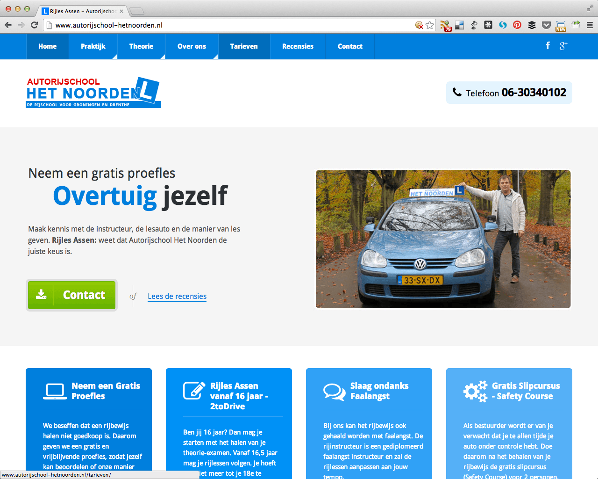
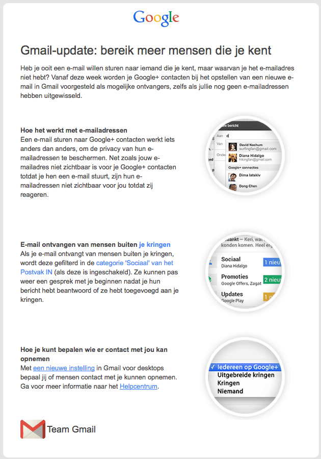
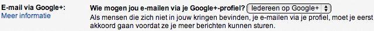
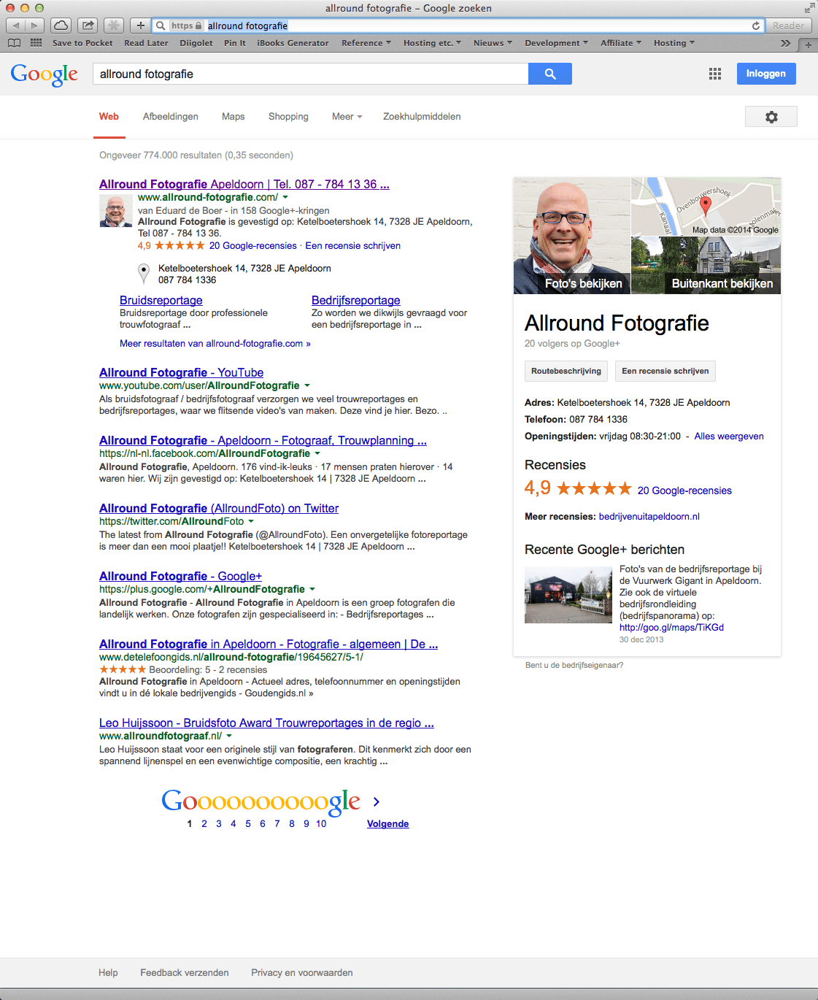
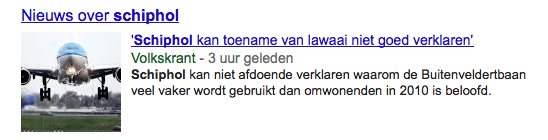
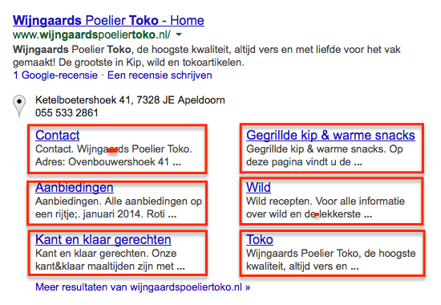
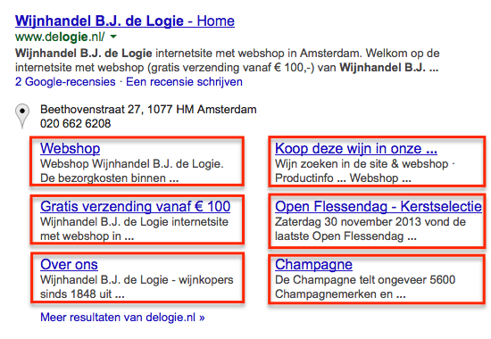
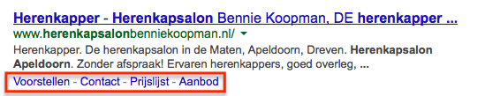

> **Historisch archief.** Deze aflevering verscheen op 13-01-2014 als onderdeel van ReputatieCoaching (2012–2016). De oorspronkelijke tekst is hieronder historisch bewaard. Diensten, contactgegevens, links, tools en adviezen kunnen inmiddels verouderd zijn.



**Transcriptiestatus:** Volledige transcriptie uit het oorspronkelijke archief.

*Historische afbeelding niet beschikbaar: ReputatieCoaching Podcast*
**De kop is er vanaf. Vorige week maandag presenteerde ik de eerste ReputatieCoaching Podcast van 2014 en nu zijn we alweer bij de tweede uitzending van dit nieuwe jaar. Vandaag heb ik de volgende onderwerpen voor je… Als eerste een leuke ervaring van Robert-Jan, een trouwe luisteraar van de podcast uit Zwolle. Hij vertelde hoe zijn autistische trekjes hem hielpen om op het juiste pad te blijven voor het optimaliseren van de site van een rijschoolhouder. Als tweede is er een probleem met het gebruik van de naam “Pinterest” in Europa.**

**Heb je ooit een e-mail willen sturen naar iemand die je kent, maar waarvan je het e-mailadres niet hebt? Vanaf deze week worden je Google+ contacten bij het opstellen van een nieuwe e-mail in Gmail voorgesteld als mogelijke ontvangers, zelfs als jullie nog geen e-mailadressen hebben uitgewisseld. Daarover zometeen meer.**

**Ook heb ik een video van Matt Cutts die ons vertelt over een andere website van Google, waarin wordt uitgelegd hoe zoekmachines werken, en dan met name hoe Google werkt. Dat is ooit in [podcast 33](https://www.reputatiecoaching.nl/33/) ook al eens aan bod gekomen, maar nu geeft Matt Cutts een grote hoeveelheid extra achtergrondinformatie over de organisatie, haar processen, statistieken et cetera. Ook lijkt het erop, alsof Google weer experimenteert met de weergave van bedrijven in de zoekresultaten.**

**De zoekmachine met het leuke eendje, ook wel bekend als DuckDuckgo is in 2013 ontzettend gegroeid en heeft dit jaar al weer een record verbroken.**

Hallo en hartelijk welkom bij deze aflevering van de ReputatieCoaching Podcast. Mijn naam is Eduard de Boer, ook bekend als de ReputatieCoach. Dit is dé podcast die je moet beluisteren als je meer wilt leren over online reputatie en reputatiemanagement en ook als je wilt werken aan je online reputatie en je online vindbaarheid wilt verbeteren. Dit alles kan je helpen om jezelf beter op de online kaart te plaatsen, waardoor je als bedrijf meer business kunt doen.

Als persoon kun je met de diverse tips aan de slag om bijvoorbeeld je online reputatie als waterbouwer, mediatechnoloog, video-editor, leidinggevende of wat dan ook te verbeteren.

## Autisme helpt bij SEO

Afgelopen week sprak ik met Robert-Jan uit Zwolle. Hij is een trouwe luisteraar van de podcast. Hij vertelde me vol trots, dat hij een nieuwe website had gemaakt voor een [rijschool in Assen](http://www.autorijschool-hetnoorden.nl) en daarbij al mijn adviezen en tips had opgevolgd. Dat begon ermee dat hij de site heeft ontwikkeld in WordPress. Dit was nota bene zijn eerste WordPress site. Daarvoor werkte hij eigenlijk altijd met Joomla.

Ik heb de site bekeken en ik vond ’m er echt heel mooi uitzien! Het is een responsive ontwerp, dus de site is niet alleen goed leesbaar op grote schermen, maar ook op smartphones en tablets. Alle content was goed leesbaar, ik vond de kleurcombinaties goed gekozen en de layout maakte het tot een compleet geheel.

[caption id="" align=“aligncenter” width=“550”][](https://lh4.googleusercontent.com/-DZ5Bx8enc88/UtLti69720I/AAAAAAAAAVE/kH_2_gOCkzc/w1197/20140113-rijsles-in-Assen.png) Website: Rijles in Assen[/caption]

Verder had hij de rijschoolhouder de [Google+ pagina van de rijschool](https://plus.google.com/114921344410111335161/about) laten claimen, Google publishership geactiveerd op de homepagina van site en Google Authorship op diverse artikelen. Ook had hij met behulp van schema.org de adresgegevens in de site opgenomen en heeft hij de website-eigenaar op het hart gedrukt om recensies te gaan verzamelen.

Bovendien had Robert-Jan de SEO plugin van Joost de Valk geïnstalleerd. Die hielp hem met het schrijven van de teksten. Pas als de plugin groen licht gaf, nam hij genoegen de content. Het kostte wel moeite, maar volgens hemzelf waren het zijn “autistische trekjes” die hem hier doorheen hebben geholpen.

De pagina was kort na het live gaan amper te vinden in de zoekresultaten. Natuurlijk hield Robert-Jan de site goed in de gaten en dan vooral de statistieken. Op het moment dat de autorijschool haar eerste review op Google+ kreeg, schoot de site omhoog in de organische resultaten. Inmiddels scoort de site op enkele relevante zoektermen al de eerste en tweede plaats in de organische listings op Google!

De rijschoolhouder is helemaal blij, want dankzij het feit dat zijn website zo goed scoort krijgt hij nu direct veel meer bezoekers op zijn nieuwe site dan voorheen op zijn oude site. Daar houdt het nog niet mee op, want de website converteert nu ook opeens heel goed: de eerste nieuwe leerlingen hebben zich al via de site aangemeld! En dat zijn er beduidend meer dan voorheen.

Voorafgaand aan en tijdens het herontwerp van de site heeft Robert-Jan mij een paar keer enkele uren geconsulteerd voor een crashcourse reputatieverbetering en de nodige dosis aan kennis over lokale zoekmachineoptimalisatie.

Verder hadden we het in het begin over de keuze van een framework voor de WordPress site. Zoals je weet gebruik ik zelf “Genesis” voor de [www.reputatiecoaching.nl](http://www.reputatiecoaching.nl), maar er zijn ook andere frameworks, waaronder bijvoorbeeld het gratis “[Thematic](http://themeshaper.com/thematic/)”, “[Thesis](http://diythemes.com/thesis/)” die circa US$ 80 kost en “PageLines” die je pas in je bezit krijgt als je tenminste US$ 197 schokt.

Robert-Jan maakte mij attent op een ander framework, waar hij tegenaan was gelopen , waarvan hij vond dat het er goed uitzag. Dit is het [“Cherry” framework](http://www.cherryframework.com/). Ik ben natuurlijk geen webdesigner, maar ik dacht dat ik toch wel aardig wat wist van WordPress frameworks; van het “Cherry” framework, had ik echter nog nooit gehoord.

Dus hebben we er ook samen nog eens naar gekeken en we kwamen tot de conclusie dat de keuze voor dit gratis framework, een goede leek. Ook later ben ik nog eens verder in het Cherry framework gedoken en ik ben tot de conclusie gekomen, dat ik binnenkort ook eens een WordPress site ga inrichten met het “Cherry” framework. Mocht jij de prijs van Genesis of Thesis te hoog vinden, dan is dit wellicht een mooi en bovenal gratis alternatief voor je. Het aardige is ook, dat er al veel responsive child templates zijn voor dit framework, waardoor je zelf niet veel ontwerp- of programmeerwerk hoeft te doen. Een snelle zoekopdracht op [templatemonster.com](http://www.templatemonster.com/properties/features/cherry-framework/) toonde op het moment toen ik deze podcast maakte, al 507 templates.

Ik zeg heus niet dat ik alle wijsheid in pacht heb, maar het is een feit dat ik mijn uiterste best doe om vooraan te blijven lopen in alle ontwikkelingen op dit gebied. En deze kennis deel ik dan vervolgens met jullie: de luisteraars van de podcast en de lezers van de ReputatieCoaching website. Daarbij vermijd ik taktieken of trucjes die ook maar enigszins rieken naar black hat en meld ik je ook meestal alleen zaken die ik eerst zelf heb uitgeprobeerd of nog aan het uitproberen ben.

Het leuke is echter wel, dat dit een praktijkvoorbeeld is van wat je kunt bereiken als je een dergelijk project vanaf de tekentafel tot en met de livegang gedegen en volgens de regels uitvoert. Chapeau, Robert-Jan en bedankt dat je dit hebt teruggekoppeld!

## Pinterest in de clinch over gebruik van de naam in Europa

Pinterest heeft een probleem… Volgens mij een aardig groot probleem. Deze rijzende ster aan het firnament van de social media mag zich namelijk in Europa niet de eigenaar noemen van de merknaam “Pinterest”. Afgelopen heeft de rechtbank in Spanje hierover beslist.

Volgens advocatenkantoor Mishcon de Reya bestond het Londense bedrijf “Premium Interest” al, toen Pinterest de naam deponeerde. Aan de andere kant zegt Pinterest dat het al actief was, toen Premium Interest in januari 2012 de naam vastlegde. Volgens Pinterest is er een administratieve fout gemaakt, waardoor zij de naam niet eerder hebben kunnen registreren.

Dit komt niet goed uit voor Pinterest, want het bedrijf heeft recentelijk US$ 225 miljoen opgehaald om internationaal uit te breiden. Pinterest gaat in hoger beroep en moet nu aantonen dat het al actief was in Europa, voordat Premium Interest de naam vastlegde.

Je kunt de juridische documentatie ook nalezen op Scribd. Ik heb het document in de show notes opgenomen:

[Pinterest Judgment](http://www.scribd.com/doc/195380033)

Ik ben benieuwd hoe dit verhaal zich verder ontwikkelt. Als Pinterest via het hoger beroep niet de rechten op de naam kan verkrijgen, dan zal het er wel op neerkomen dat deze voor heel veel geld van Premium Interest wordt gekocht.

Zodra ik er meer over lees, deel ik het natuurlijk meteen met je.

Zojuist had ik het over de show notes. Hierin vind je een letterlijke transcriptie van deze podcast, alsmede afbeeldingen, video’s en links naar andere relevante sites op Internet. Je kunt de transcriptie van deze podcast vinden op: [www.reputatiecoaching.nl/59](https://www.reputatiecoaching.nl/59/).

## Stuur e-mail naar iemand van wie je het e-mailadres niet hebt

Het klinkt als een paradox: e-mail sturen naar iemand van wie je het e-mailadres niet hebt. Dat lijkt hetzelfde als iemand bellen, van wie je het telefoonnummer niet hebt.

Toch kan het sinds deze week en je hebt er geen telepathie of andere esotherische kwaliteiten voor nodig. Wat echter wel nodig is, is dat jij een Google+ account hebt, evenals de persoon aan wie je de mail wilt sturen.

Afgelopen vrijdag ontving ik een mail van Google die ik in de show notes heb opgenomen, met daarin de volgende tekst:

[](https://lh5.googleusercontent.com/-zmugwTPOYhE/UtLtiDEDrtI/AAAAAAAAAU8/RRMogf1Q3YI/w630-h900-no/20140113-Gmail-Gplus-mail.png)

Het is logisch dat je op één of andere manier verbonden moet zijn met degene aan wie je de mail wilt versturen. Je kunt dus één mail aan iemand sturen, als je deze methode volgt. En pas als die persoon heeft gereageerd, krijg je zijn of haar e-mail adres te zien.

Voorheen kon je met behulp van hangouts al privéberichten op Google+ uitwisselen met mensen in je kringen, maar met e-mail krijg het toch een wat professionelere uitstraling. De vraag is alleen of er niet te snel misbruik van wordt gemaakt.

In de show notes heb ik een link opgenomen naar een artikel op het Google Helpcentrum, waarin je meer kunt lezen over het [mailen van je vrienden via Google+](https://support.google.com/mail/answer/3294854?p=profiles&hl=nl&rd=1). Daar is ook te lezen hoe je kunt bepalen wie jou mag e-mailen. In de instellingen in Gmail kun je kiezen uit de volgende mogelijkheden:

```
  1. Iedereen in Google+
  2. Uitgebreide kringen
  3. Kringen
  4. Niemand
```



Kies deze laatste optie, als je werkelijk van niemand op Google+ op deze wijze e-mails wenst te ontvangen.

## Hoe werken zoekmachines?

Het lijkt erop, alsof Matt Cutts van het Google webspam team ook een eindejaarsreces heeft gehouden, want er verschenen eventjes geen nieuwe video’s van hem. Maar inmiddels zijn er alweer een paar video’s uitgekomen met Matt in de hoofdrol. In één van de video’s legt hij uit hoe zoekmachines werken in het algemeen en hoe Google werkt in het bijzonder.

In 2012 heeft Matt ook al eens uitgelegd hoe Google werkte op dat moment. Die video heb ik ook in de show notes opgenomen:

```
  1. Crawlen, ofwel doorspitten van alle content
  2. Indexeren
  3. De juiste, meest relevante zoekresultaten opleveren
```

Hij legt uit hoe het crawlen vroeger werkte en hoe het in 2012 werkt. Eerst werden de meeste sites slechts eenmaal in de 30 dagen door Googlebot bezocht, of “ge-crawled”. Google begon dan bij de sites met de hoogste PageRank en ging dan steeds verder richting sites met de laagste PageRank en nieuwe sites.

Later, omstreeks 2003, bezocht Google elke site met autoriteit gemiddeld eenmaal per dag. Naast de index met de “normale” resultaten, had Google toen ook een index van de zogenaamde “supplemental results”. De sites die daarin waren opgenomen, werden veel minder vaak bezocht, dan de sites die in de reguliere index stonden.

Het indexeren en ranken van de zoekresultaten is een apart verhaal. Eerst werd daar alleen PageRank voor gebruikt. Toen Google deze video in 2012 produceerde, waren er al meer dan 200 additionele factoren die meetelden bij het bepalen van de ranking van pagina’s in de zoekresultaten en tegenwoordig schijnen het er al meer dan 500 te zijn heb ik in de wandelgangen vernomen.

In deze nieuwe video verwijst hij ook naar een website die ik al eens in [podcast 33](https://www.reputatiecoaching.nl/33/) heb aangehaald. Die website heet “[How Search Works](http://www.google.com/insidesearch/howsearchworks/thestory/)”. In de show notes heb ik toch weer een keer een link er naartoe opgenomen, voor het geval je de site nog nooit hebt gezien, omdat je bijvoorbeeld podcast 33 niet hebt beluisterd of de transcriptie niet hebt gelezen.

Over de nieuwe video… Dit is de langste video die Matt Cutts ooit heeft gemaakt voor het WebmasterHelp YouTube-kanaal: bijna tieneneenhalve minuut!

Op basis daarvan *kan* Google haar algoritmes aanpassen, maar dat is nooit direct op basis van de feedback van deze beoordelaars. Als het erop lijkt of een bepaalde verandering echt tot betere resultaten kan leiden, dan wordt het experiment beperkt live uitgevoerd en wordt gemeten hoevaak mensen op bepaalde zoekresultaten klikken, om zo te zien of de resultaten ècht beter worden.

Netto heeft Google in 2012 in totaal 665 wijzigingen in het algoritme doorgevoerd. Dat is dus gemiddeld bijna twee per dag.

Dit soort tests zie je volgens mij niet vaak als eindgebruiker. Want met de miljarden zoekpogingen die worden uitgevoerd, is de kans erg klein dat net jouw zoekpoging in zo’n experiment valt.

Matt gaat door en vertelt dat hij het SPAM-gedeelde op de site “[How Search Works](http://www.google.com/insidesearch/howsearchworks/thestory/)” het leukste vindt. Op de site kun je echt veel leuke content over het fenomeen “spam” vinden. Zo kun je er bijvoorbeeld een actuele “spam carrousel” bekijken, die regelmatig wordt ververst. Je ziet dus echt sites die heel recent (soms een paar uur geleden) als spam zijn gemarkeerd en dus uit de index zijn verwijderd.

Verder vertelt Matt het één en ander over de verschillende soorten spam, waar zij zoal mee te maken krijgen. Deze heb ik ook al eens beschreven in [podcast 33](https://www.reputatiecoaching.nl/33/). De meeste sites die als spam worden gemarkeerd en uit de index worden verwijderd, zijn sites die echt onzin zijn; sites waarvan iedereen die ze bekijkt, meteen zegt: “Ahhh.. dat is klinklare onzin, oftewel: SPAM!”.

Maar waar Google de laatste jaren steeds meer mee te maken krijgt en wat langzaamaan op de tweede plaats staat, zijn gehackte sites. Sommige specialisten hadden in 2010 het idee dat Google niet echt hard bezig was om de zoekresultaten te verbeteren, maar Matt vertelt dat Google juist in die tijd achter de schermen ontzettend druk bezig was met het detecteren en verwijderen van spam uit de zoekresultaten. En het was voornamelijk het type spam, dat de meeste mensen nog niet hadden gezien.

Wat ook interessant is, is dat Google in een doorsnee maand in 2013 zo’n 430.000 berichten naar webmasters heeft gestuurd, dat hun site aandacht nodig heeft, omdat Google spam vermoedt of dat de Google richtlijnen voor websites met de voeten zijn getreden. Maar slechts zo’n 20.000 webmasters sturen per maand het verzoek aan Google om de site nogmaals te beoordelen, nadat ze naar beste kunnnen hun rotzooi hebben opgeruimd, de site hebben opgeschoond en foute links hebben verwijderd of laten verwijderen. De overige circa 410.000 webmasters halen hun schouders op, berusten in hun lot van de manual penalty en gaan proberen op de volgende site de illegale activiteiten uit te voeren in de illusie dat Google die site niet te pakken zal krijgen.

## Googe experimenteert met 7 zoekresultaten voor lokale bedrijven

Ik zei het zojuist al: Google experimenteert doorlopend om zo continu te werken aan een betere gebruikerservaring. We hebben jarenlang tegen een lijstje van tien zoekresultaten aangekeken, als we op Google een bepaalde zoekterm intypten. Maar afgelopen vrijdag liep ik ook weer tegen een experiment van Google aan.

Althans, ik denk dat het een experiment is. Want op het moment dat ik de tekst voor deze [59e podcast](https://www.reputatiecoaching.nl/59/) schrijf, zie ik het resultaat dat je in de show notes zelf kunt bekijken:

[](https://lh4.googleusercontent.com/-HqLbCTuogDg/UtLtgleKC1I/AAAAAAAAAUY/zb2Oc3o8xjA/w888/20140110-allround-fotografie-7-resultaten.png)

In deze screenshot zoek ik op de naam van een lokaal bedrijf, in dit geval “Allround Fotografie”. In plaats van dat de eerste pagina de bekende tien resultaten toont, worden er nu maar zeven weergegeven. Als je dan doorklikt naar de tweede pagina met zoekresultaten, dan zie je dat er wel weer tien worden vertoond.

Daarmee bedoel ik niet het lijstje van de 7 lokale resultaten, ook wel bekend als het “local 7-pack”, dat je ziet als je een generieke zoekopdracht lokaal uitvoert, zoals bijvoorbeeld “herenkapper apeldoorn”. Nee, het gaat dus echt over de organische resultaten.

Ik heb dit ook op een paar andere exacte bedrijfsnamen uitgeprobeerd en die vertonen allemaal zeven resultaten. Maar toch niet alle exacte bedrijfsnamen volgen dit principe. Als je zoekt op “schiphol”, dan worden er acht resultaten vertoond: direct onder de website schiphol.nl (die op de eerste plaats staat), staat een extra stukje met “Nieuws over schiphol”. Deze extra vermelding kun je ook zien in de show notes:



Toen ik hier verder in dook, vond ik een artikel van Danny Goodwin, dat dateert van 21 augustus 2012. Dat is dus een goede 16 maanden oud. In het artikel “[Why 7 Search Results in Google Should be Your Brand New Lucky Number](http://searchenginewatch.com/article/2200196/Why-7-Search-Results-in-Google-Should-be-Your-Brand-New-Lucky-Number)” schrijft Danny dat het erop lijkt, alsof deze pagina met zeven resultaten alleen wordt vertoond, als de site door Google wordt vertoond met sitelinks.

Wat zijn nu weer sitelinks? Dat zijn extra stukjes tekst die onder een vermelding staan, met een link dieper in de website. Die worden inderdaad normaliter voornamelijk getoond, bij zogenaamde “branded searches”, dus bij het zoeken op een bedrijfsnaam.

Maar ook bij andere sites, zoals IMDB of Wikipedia komen sitelinks vaak voor. In de show notes heb ik een paar screenshots opgenomen van een tweetal lokale bedrijven, waarvan slechts de zeven resultaten worden getoond en waarvan de site inderdaad wordt vertoond met sitelinks:





In die afbeeldingen heb ik de sitelinks rood omrand. Dat is dus hoe op dit moment de resultaten worden vertoond als je zoekt op de bedrijfsnaam. Sitelinks kunnen ook anders worden weergegeven, als een vermelding nog steeds in een pagina met tien resultaten wordt getoond. Dan staan in de sitelinks slechts enkele woorden (dus zonder de toelichtende tekst) erbij vermeld. Ook daarvan heb ik een screenshot opgenomen in de show notes, die je kunt vinden op [www.reputatiecoaching.nl/59](https://www.reputatiecoaching.nl/59/):



OK, het lijkt er nu op dat we weten wanneer er zeven resultaten worden vertoond. In 2012 meldde Google hier al het volgende over:

Voor bedrijven is dit volgens mij een zegening. Want doordat de bedrijfswebsite als eerste wordt vertoond met daarnaast ook nog eens een aantal extra gegevens aan de rechterkant, krijgt jouw vermelding wel heel veel aandacht. Ook worden de reviewsterren weergegeven, hetgeen je kan helpen met meer clicks naar jouw site.

En doordat er nu zo’n 18% minder vermeldingen staan, is het ook gemakkelijker de voorpagina van Google op jouw bedrijfsnaam te domineren. Want kijk nog maar eens naar de vermelding van Allround Fotografie. Pas op de 7e plaats zie je nog de fotograaf “Leo Huijssoon” staan die de domeinnaam “allroundfotograaf.nl” heeft. Dat valt al amper meer op door alle relevante vermeldingen die daarboven staan.

Wat ook opvalt is dat de getoonde resultaten allemaal sites met een grote mate van autoriteit zijn. In het geval van Allround Fotografie zijn dat:

```
  1. YouTube
  2. Facebook
  3. Twitter
  4. Google+
  5. De Telefoongids
```

Als ik zoek op “bennie koopman kapper”, dan zie ik de volgende zeven vermeldingen

```
  1. De bedrijfswebsite: www.herenkapsalonbenniekoopman.nl
  2. Facebook
  3. www.kappers.nl
  4. De Telefoongids
  5. www.kapper-gids.org
  6. www.kapper.nu
  7. tupalo.com
```

Op al die sites zie je dus de bedrijfsvermelding van Herenkapsalon Bennie Koopman staan. Ook als je doorklikt naar de tweede pagina, zie je allemaal sites met (blijkbaar) een grote mate van autoriteit, waardoor die allemaal zo hoog in de zoekresultaten worden vertoond.

Zoek eens je eigen bedrijfsnaam op en bekijk hoe jouw bedrijf verschijnt. Mocht je niet meteen op een pagina met zeven resultaten worden vertoond, dan kan het wellicht helpen om de plaatsnaam waar je bedrijf is gevestigd, erbij te typen. Probeer het maar eens!

En door op deze manier je concurrenten op te zoeken, vind je tientallen (zo niet honderden) kansen en sites waar jij ook jouw bedrijfsvermelding kunt plaatsen. Beperk je bij je zoektocht niet tot één concurrent, maar zoek gewoon de eerste tien, die je bijvoorbeeld op Google Maps tegenkomt. Let op: hier liggen echt kansen!

## DuckDuckGo

*Historische afbeelding niet beschikbaar: DuckDuckGo*
Ik heb al enige tijd geen nieuws meer gebracht over DuckDuckGo, ook wel bekend als de anti-NSA of anonieme zoekmachine met het leuke eendekopje. Want DuckDuckGo houdt volgens hun eigen zeggen geen statistieken bij, die kunnen worden herleid op een individu.

Als je dus zaken opzoekt op DuckDuckGo, dan loop je niet het risico dat dit bekend raakt in China, bij de NSA of waar dan ook. Alhoewel, als de NSA inderdaad Google en Yahoo Internetverkeer op grote knooppunten op Internet afluistert, dan kan zij dat ook doen met alle zoekpogingen op DuckDuckGo. Maar goed, laten we het beste ervan denken en er gewoon van uitgaan dat de NSA dit niet doet.

Bovendien: als je niets te verbergen hebt, wat maakt het dan uit dat grote partijen je zoekverkeer in de gaten houden? Als ze zo in staat zijn een berg terrorisme te bestrijden mogen ze wat mij betreft best inzage hebben in waar ik zoal naar op zoek ben op Internet.

Maar goed, nadat Edward Snowden uit de doeken heeft gedaan in welke mate de Amerikaanse overheid het hele Internetverkeer in de gaten houdt, is de populariteit en het gebruik van DuckDuckGo enorm gegroeid. Want waar DuckDuckGo in juli 2013 drie miljoen zoekpogingen per dag uitvoerde, krijgt zij nu al rond de vier miljoen zoekpogingen per dag voor de kiezen. En ook dat gaat allemaal prima.

Het gaat zo goed, dat DuckDuckGo vorig jaar in totaal al meer dan 1 miljard zoekopdrachten heeft uitgevoerd. Toegegeven, Google doet dat zo’n beetje in één dag, maar toch… Het geeft wel aan dat DuckDuckGo flink aan het groeien is.

Zelf betrap ik me erop dat ik steeds vaker ook snel even iets zoek op DuckDuckGo, of dat ik DuckDuckGo gebruik voor een soort van second opinion of om snel meer informatie te vinden. Want in sommige gevallen heb ik gezien dat DuckDuckGo vrijwel dezelfde resultaten aanbiedt als Google, maar soms komt dit eendje ook met totaal andere sites op de proppen.

Zeker als je lokale SEO bedrijft en je bent op zoek naar meer sites om citations of bedrijfsvermeldingen achter te laten, dan kan ik je zeker adviseren om op DuckDuckGo eens te zoeken op:

```
  * de bedrijfsnamen en telefoonnummers van je concurrenten
  * je eigen bedrijfsnaam en telefoonnummer
  * alleen je telefoonnummer
```

enzovoorts.

Ik acht de kans groot dat je beslist andere resultaten zult zien, dan dat je op Google te zien krijgt… Zeker als je wat dieper de lijst met zoekresultaten induikt.

Dit kan je dus helpen om nog meer waardevolle sites te vinden, waar je bedrijfsvermeldingen bestaande uit de bedrijfsnaam, het adres, de postcode en plaats en het telefoonnummer, kunt achterlaten.

## Grote Citations Voorjaarsschoonmaak

*Historische afbeelding niet beschikbaar: Winterschoonmaak bij Google*
Dit brengt me op de Grote Citations Voorjaarsschoonmaak, die ik vorige week aangekondigde. Ben jij al begonnen met het onderzoeken van al je citations? Heb je jezelf (of je praktijk of bedrijf) daar wel eens opgezocht? En heb je wel eens gezocht op je bedrijfsnaam in combinatie met het woord “reviews” of “beoordelingen”, “recensies” of “trevredenheid”?

Wees eens eerlijk: hoe werd je beoordeeld? Wellicht kun je daar iets uit leren. Vraag altijd zoveel mogelijk om een beoordeling, zodat je je online reputatie kunt verstevigen.

Terugkomend op de werkinstructie over het opschonen van je citations. Helaas is het me nog niet gelukt afgelopen week het artikel over de Grote Citations Voorjaarsschoonmaak af te krijgen, want ik had de omvang van het beschrijven ervan iets onderschat. Dus ik heb het nu gepland voor deze week. Geloof me, het artikel is voor zo’n 75% gereed, dus je kunt bijna aan de slag!

Wil je meteen geïnformeerd worden als het artikel online komt, volg dan @reputatiecoach1 op Twitter, klik op “Vind ik leuk” op de Facebook pagina of voeg ReputatieCoaching toe aan je kringen op Google+. Als alternatief kun je natuurlijk je abonneren op de RSS-feed van de site. Zo weet je zeker dat je meteen een signaaltje krijgt, zodra ik het heb gepubliceerd.

Als je de podcast leuk vindt en je hebt inderdaad wat aan alle informatie die ik met je deel, help mij dan met het verder verbeteren en promoten van deze podcast. Deel ‘m op Twitter, like ‘m op Facebook of geef een “+1” op Google+. Het zou helemaal super zijn, als je een bericht achterlaat op iTunes of LinkedIn.

Als je een vraag of een probleem hebt met betrekking tot je online reputatie of de vindbaarheid van je website, kun je een mailtje sturen naar [podcast@reputatiecoaching.nl](mailto:podcast@reputatiecoaching.nl). Als je dat te lastig vindt, of als je de podcast beluistert terwijl je in de auto zit en je hebt acuut een vraag, spreek dan een boodschap in op de ReputatieCoaching Hotline, op nummer: 084 - 883 15 56. Mogelijk behandel ik je vraag of probleem dan in een artikel of in de podcast.

Als laatste kun je je ook inschrijven voor de nieuwsbrief. Dan ontvang je altijd als eerste het laatste nieuws wat ik publiceer en automatisch elk kwartaal het ReputatieCoaching Podcast Boek van het afgelopen kwartaal. Surf daartoe naar [www.reputatiecoaching.nl/nieuwsbrief/](https://www.reputatiecoaching.nl/nieuwsbrief/) en schrijf je meteen in.

En je kunt ook rechtstreeks op de website een voicemail achterlaten, door op de tab aan de rechterkant van elke pagina te klikken, en je bericht in te spreken. Dit was [ReputatieCoaching Podcast aflevering 59](https://www.reputatiecoaching.nl/59/) en mijn naam is [Eduard de Boer](http://nl.linkedin.com/in/eduarddeboer/nl).

Ik wens je de komende week weer succes met het werken aan je reputatie, zodat je meteen je reputatie voor jou kunt laten werken!

Tot volgende week!

Doei!

Links naar informatie die in deze podcast aan bod komt:

```
  * [Cherry: The most _delicious_ WordPress framework](http://www.cherryframework.com/)
  * [Google+ vrienden e-mailen](https://support.google.com/mail/answer/3294854?p=profiles&hl=nl&rd=1) (Google Helpcentrum)
  * “[Why 7 Search Results in Google Should be Your Brand New Lucky Number](http://searchenginewatch.com/article/2200196/Why-7-Search-Results-in-Google-Should-be-Your-Brand-New-Lucky-Number)” (Search Engine Watch, 21 augustus 2012)
  * “[Pinterest mag handelsnaam niet in Europa gebruiken](http://www.emerce.nl/nieuws/pinterest-mag-handelsnaam-europa-gebruiken)” (Emerce, 3 januari 2014)
  * “[Anonymous search tool DuckDuckGo answered 1bn queries in 2013](http://www.theguardian.com/technology/2014/jan/09/anonymous-search-tool-duckduckgo-1bn-queries-2013-google)” (The guardian, 9 januari 2014)
```
