> **Historisch archief.** Deze aflevering verscheen op 7-04-2014 als onderdeel van ReputatieCoaching (2012–2016). De oorspronkelijke tekst is hieronder historisch bewaard. Diensten, contactgegevens, links, tools en adviezen kunnen inmiddels verouderd zijn.



**Transcriptiestatus:** Volledige transcriptie uit het oorspronkelijke archief.

***Historische afbeelding niet beschikbaar: ReputatieCoaching Podcast*
We zitten alweer iets meer dan een week op de zomertijd en meteen merk je dat de avonden langer worden… Gecombineerd met het mooie weer geeft dat direct zo’n zomergevoel. Maar bij mij ging er iets fout in WordPress met de ingang van de zomertijd. Wat er fout ging, vertel ik je zometeen. Een tijdje geleden had ik een probleem met de performance van een WordPress blog. Om dat te tacklen heb ik een hele nuttige plugin gevonden, die ik graag met je wil delen.**

**Op Google+ kun je nu het aantal views zien en op Google Maps kun je nu weer in de buurt zoeken. Bovendien kun je nu Tweeps taggen in foto’s op Twitter. Verder komen vandaag ook nog allerlei tips voor je zakelijke Google+ pagina aan bod, vertel ik je wat je zoal op lokale landingpagina’s moet zetten en ik heb twee video’s van Matt Cutts (waarvan eentje van 1 april).**

Hallo en hartelijk welkom bij deze aflevering van de ReputatieCoaching Podcast. Mijn naam is Eduard de Boer, ook bekend als de ReputatieCoach. Dit is dé podcast die je moet beluisteren als je meer wilt leren over online reputatie en reputatiemanagement en ook als je wilt werken aan je online reputatie en je online vindbaarheid wilt verbeteren. Dit alles kan je helpen om jezelf beter op de online kaart te plaatsen, waardoor je als bedrijf meer business kunt doen.

Als persoon kun je met de diverse tips aan de slag om bijvoorbeeld je online reputatie als cameraman, filiaalmanager, audicien, glasblazer, bloembinder, orthopedisch chirurg of wat dan ook te verbeteren.

De podcast kun je vinden op [www.reputatiecoaching.nl/71](https://web.archive.org/web/20141104094502/http://www.reputatiecoaching.nl:80/71/). Daar vind je niet alleen de tekst, maar ook video’s waar ik het in deze uitzending over heb, alsmede afbeeldingen, links enzovoorts. Bovendien is de podcast te beluisteren in iTunes en op Stitcher. Daar kun je je dus ook abonneren op de wekelijkse podcast. Veel mensen vinden het ideaal om de wekelijkse afleveringen van de podcast op hun gemak te beluisteren, terwijl ze autorijden.

Oh, voordat ik begin met de topics van vandaag. Ik las van de week een aardig artikel over [hoe Internetters voornamelijk naar muziek luisteren](https://www.reelseo.com/youtube-music/). Ik dacht altijd dat dat vanaf diensten als Spotify, Pandora, iHeartRadio, iTunes of andere streaming services was. Maar ik had dat fout. Het artikel dat ik las ging echter wel over de Amerikaanse markt. Het blijkt dat in de Verenigde Staten veruit de meeste mensen voornamelijk muziek beluisteren… via… jawel: YouTube!

Ook op het gebied van muziek luisteren steekt YouTube met kop en schouders boven de rest uit. In de show notes heb ik een staafgrafiek opgenomen, waarin je kunt zien hoe het Amerikaanse publiek naar muziek luistert:

[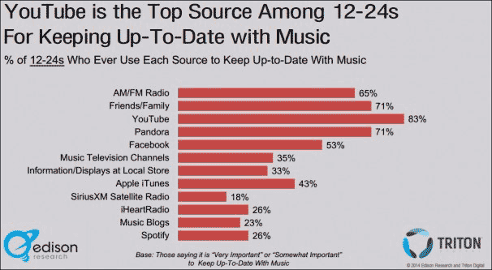](https://lh4.googleusercontent.com/-CSQz9lbCJjo/U0HJHLIMo_I/AAAAAAAAAoM/A1wiD2ZxHss/w606-h333-no/youtube-top-source-for-music-606x333.png)

Uit de grafiek kun je ook afleiden dat 83% van het Amerikaanse publiek tussen de 12 en 24 jaar muziek luistert via YouTube, gevold door Pandora en de radio. Facebook komt grappig genoeg op de 5e plaats: dat had ik niet verwacht. Ik heb zelf in elk geval nog nooit muziek zitten luisteren op Facebook, maar dat zegt wellicht meer over mij, dan over muziek op Facebook…

Dan ga ik nu wel door met de onderwerpen van vandaag…

## Geen zomertijd als gevolg van foute instelling in WordPress

Alle jaren dat ik WordPress gebruik heb ik me er eigenlijk nooit zo in verdiept: de tijdinstelling. Ik dacht altijd: “We zitten 1 tijdzone rechts van Greenwich, dus moet ik UTC+1 instellen…”. Maar elk jaar ging dit bij de overgang van winter- naar zomertijd en andersom dus fout en dus zat ik elke keer te goochelen met de tijdzone UTC+1 en UTC+2.

Tja, ik weet dat dat niet de bedoeling is, maar zoals ik al zei: ik had het gewoon niet in de gaten dat het ook anders kon… en eigenlijk anders moest.

Afgelopen week ging het dus ook weer fout. Ik constateerde dat de [podcast van vorige week](https://web.archive.org/web/20150312094041/http://www.reputatiecoaching.nl/70/) inderdaad een uur later dan anders online kwam, namelijk om halftien in plaats van om halfnegen. Op zich was dat geen halszaak, maar ik vind halfnegen nu eenmaal een mooiere tijd, dan halftien. Bovendien heb ik me gecommit om de podcast altijd om halfnegen te publiceren en dus wil ik me daar aan houden.

Bij nadere controle zag ik wel dat de tijd van de server juist was, want ik dacht eerst dat het daar fout was gegaan. Dus dook ik weer in de tijdinstellingen van WordPress en bladerde iets verder dan de UTC–12 tot en met de UTC+14 mogelijkheden.

[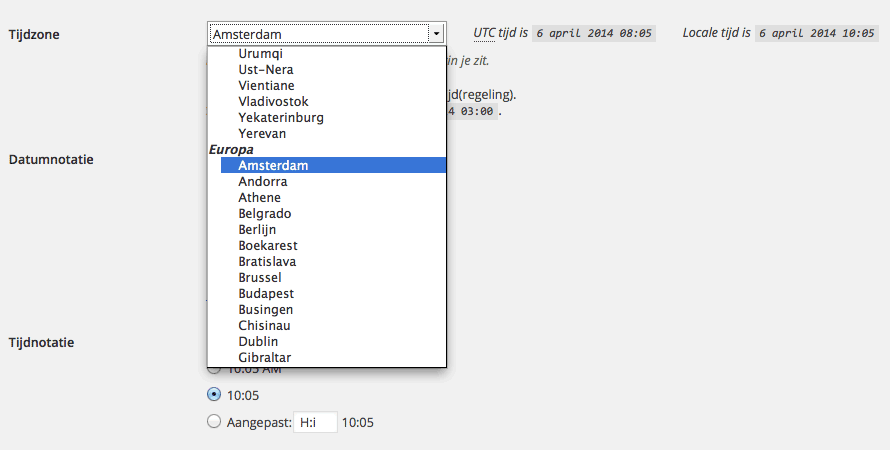](https://lh5.googleusercontent.com/-DyTvAw0YY1s/U0HJFovM0SI/AAAAAAAAAn0/dicUGKqc50I/w890-h450-no/20140407-wordpress-tijdzone.png)

En opeens zag ik Europa » Amsterdam staan. Na die keuze te hebben aangeklikt, de wijzigingen te hebben opgeslagen, stond de tijd voor WordPress meteen goed! In de show notes, die je overigens kunt vinden op [www.reputatiecoaching.nl/71](https://web.archive.org/web/20141104094502/http://www.reputatiecoaching.nl:80/71/), zie je een screenshot hoe dit eruit ziet. Je komt daar door in WordPress te surfen naar *Instellingen* » *Algemeen*.

Grappig genoeg heb ik in het verleden een aantal WordPress sites ooit wel op Amsterdam gezet, maar bij nadere controle vond ik een zestal sites die altijd verkeerd hebben gestaan. Die heb ik dan ook maar meteen goed gezet.

Ach, een mens is nooit te oud om te leren… En nu hoef ik me tenminste in het laatste weekend van oktober ook geen zorgen te maken over de instelling van de tijd: dat gaat dan ook automatisch weer goed. Nou, dat scheelt me weer wat werk!

## P3 Profiler voor WordPress

Een aantal weken geleden had ik de idee dat één van mijn WordPress sites om welke reden dan ook langzamer leek te werken. De site voelde niet zo “snappy”, als dat die voorheen werkte. Dus ging ik op zoek naar de oorzaak.

De andere WordPress sites leken niet langzamer, dus het kon op zich niet aan de server liggen. Bovendien was de server gemiddeld slechts voor zo’n 5–10% belast.

De WordPress-installatie was up-to-date en gebruikte ook het Genesis framework, dus had ik het vermoeden dat ik de oorzaak in een plugin moest zoeken. Na wat rondzoeken op Internet kwam ik terecht bij de WordPress plugin: “[P3 Profiler](https://wordpress.org/extend/plugins/p3-profiler/)”. De link hier naartoe vind je in de show notes van deze podcast, op: [www.reputatiecoaching.nl/71](https://web.archive.org/web/20141104094502/http://www.reputatiecoaching.nl:80/71/).

Ik had op die site ooit de plugin “JetPack” geïnstalleerd, omdat ik graag een paar functies wilde hebben die je standaard op WordPress.com krijgt. Het bleek dat JetPack verantwoordelijk was voor meer dan 60% van de totale laadtijd van alle plugins. Na het uitschakelen van JetPack laadden de pagina’s opeens weer supersnel. Na enig zoeken bleek dat de website ook prima zonder de functies van JetPack kon.

Maar terugkomend op de plugin “[P3 Profiler](https://wordpress.org/extend/plugins/p3-profiler/)”… Als jij een WordPress blog hebt, adviseer ik je eens het volgende te doen:

```
  1. Meet hoe snel je website laadt, op [Pingdom Tools](http://pingdom.com/tools/) (_Tip: klik op “Settings” en selecteer “Amsterdam, Netherlands”_)
  2. Installeer de plugin “[P3 Profiler](https://wordpress.org/extend/plugins/p3-profiler/)” in je WordPress blog en voer een scan uit. Bekijk welke plugins bij jou de meeste tijd kosten.
  3. Schakel (als het kan) die tijdrovende plugins eens uit en meet dan weer de laadtijd van je site op [Pingdom](http://pingdom.com/tools/) om te zien of dit een significante tijdwinst oplevert.
```

Als dat het geval is en je ziet dat je site een stuk sneller laadt als je bepaalde plugins uitschakelt, ga dan eens op zoek naar een alternatief, die wellicht wel sneller werkt. Maar blijf elke keer testen om te proberen de laadtijd van de voorpagina van je site onder de één seconde te houden en de laadtijd van andere pagina’s toch ergens tussen de twee à drie seconden. Vergeet niet, dat Internetters tegenwoordig steeds minder lang willen wachten op de content. Dus als jouw pagina’s langzaam laden, dan is de kans groot dat mensen al op de “Back”-knop klikken, voordat je pagina is geladen.

In de show notes heb ik een paar grafieken opgenomen van de analyse van de plugins die ik op [www.reputatiecoaching.nl](https://web.archive.org/web/20140706162453/http://www.reputatiecoaching.nl/) gebruik. Daaruit blijkt dat de meest tijdrovende plugin voor mijn site de “WordPress SEO”-plugin van Joost de Valk is.

[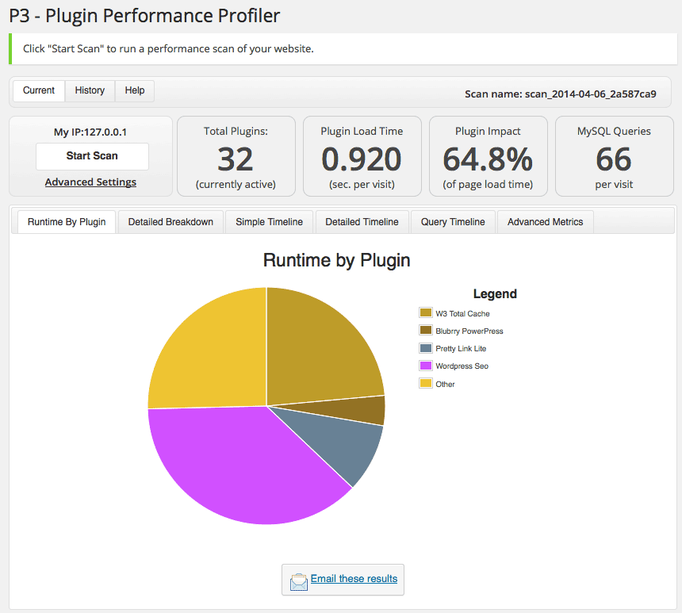](https://lh3.googleusercontent.com/-3bOYF4dBQaw/U0HJErcNuXI/AAAAAAAAAnc/nLBYnTsNO0A/w860-h773-no/20140407-p3-runtime-globaal.png)

[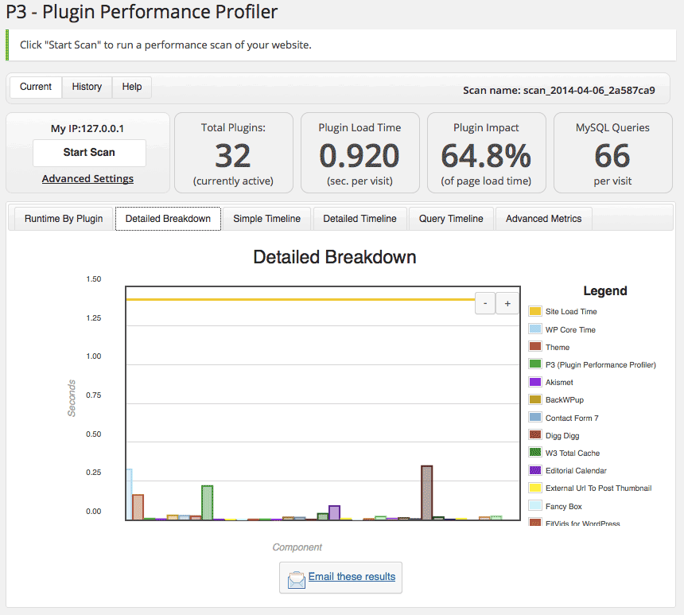](https://lh5.googleusercontent.com/-jXtT7Rox_x4/U0HJDwOEPvI/AAAAAAAAAnM/IepJC1Rw6I4/w860-h773-no/20140407-p3-detailed-breakdown.png)

[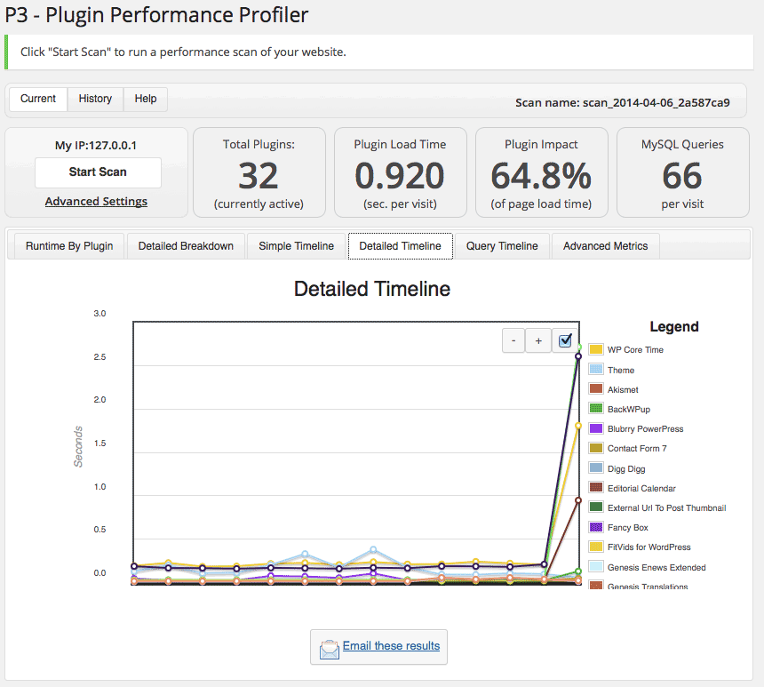](https://lh5.googleusercontent.com/-6elkBuzFTSs/U0HJEU2GU4I/AAAAAAAAAn4/VJ9-4L9Q0pI/w860-h773-no/20140407-p3-detailed-timeline.png)

Heb jij het idee hebben dat jouw site niet snel genoeg is, of dat het laden sneller kan? Probeer dan eens wat ik je hiervoor heb verteld. En als je er niet uitkomt, neem dan gerust contact met me op, of laat een bericht achter onderaan de show notes, op: [www.reputatiecoaching.nl/71](https://web.archive.org/web/20141104094502/http://www.reputatiecoaching.nl:80/71/)

Tot zover over WordPress…

## Aantal views op Google+: teken van ijdelheid?

Google+ heeft omstreeks 1 april (en dat was geen grap!) een nieuwtje geïntroduceerd. Op de Google+ pagina’s voor individuen, bedrijven, brands en communities zie je nu het aantal keren dat de pagina is bekeken. Het vertoonde getal is niet geheel real-time: ik heb namelijk even geprobeerd een pagina vanaf diverse plaatsen in Nederland te laden en het aantal bleef gelijk.

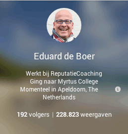
Nu is de vraag of je hier blij mee bent… Als jouw pagina niet zo populair is, dan is het aantal laag en voor je gevoel geeft dit een negatief beeld aan de bezoekers. Ik denk dat je je daar geen zorgen om hoeft te maken… Blijf gewoon goede content produceren en blijf je content promoten via alle kanalen die tot je beschikking staan. Het aantal weergaven zal heus toenemen!

Ik kan je vertellen dat de profielpagina van ReputatieCoaching op dit moment pas iets meer dan 15.000 keer is bekeken. Mijn persoonlijke pagina zit op iets meer dan 228.000 weergaven, en de Google+ pagina van Allround Fotografie op een goede 138.000 weergaven.

## “In de buurt” is terug op Google Maps

En niet alleen Google+ heeft een nieuwtje… Ook de nieuwe (of beter gezegd: de huidige) versie van Google Maps heeft een feature, die bij de overgang van de klassieke Google Maps naar de huidige versie was verdwenen:

[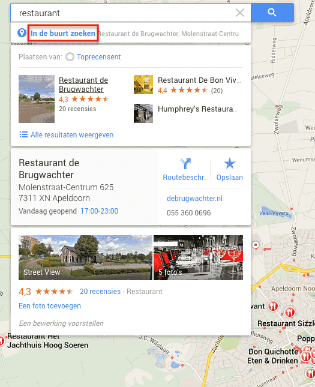](https://lh4.googleusercontent.com/-o86Fd6H0274/U0HJC6KRMbI/AAAAAAAAAm8/OILWnToEYQ0/w525-h645-no/20140407-googlemaps-in-de-buurt-zoeken.png)

En dan heb ik het over de “In de buurt” zoekfunctie. Hiermee kun je in een aantal gevallen soortgelijke bedrijven als je al zocht, in de buurt zoeken.

## Content voor op je lokale landing page

Stel je hebt voor je bedrijf meerdere vestigingen of locaties. Dan heb je als het goed is voor elke locatie een zakelijke Google+ pagina, waar je content op hebt staan. Op z’n minst hoor je je bedrijfsprofiel netjes voor 100% gevuld te hebben. Daar horen dus bijvoorbeeld ook foto’s, de openingstijden en de bedrijfsomschrijving bij.

Wat essentieel is voor de verschillende zakelijke Google+ pagina’s, is dat ze elk naar een eigen lokale landing page op je site verwijzen. Dus, stel je hebt drie locaties: eentje in Amsterdam, eentje in Rotterdam en één in Maastricht. Voor elke locatie maak je dan dus een zakelijke Google+ pagina aan, als die niet al bestaan. Je claimt en verifieert de pagina’s en laat elke Google+ pagina naar een eigen lokale landing pagina wijzen, dus bijvoorbeeld:

```
  * www.mijnbedrijf.nl/locaties/Amsterdam
  * www.mijnbedrijf.nl/locaties/Rotterdam
  * www.mijnbedrijf.nl/locaties/Maastricht
```

Het spreek voor zich dat de gegevens op de lokale landing pagina’s op je website [www.mijnbedrijf.nl](https://web.archive.org/web/20050403200005/http://www.mijnbedrijf.nl:80/) exact overeen moeten komen, met die op de zakelijke Google+ pagina. Maar wat kun je of beter gezegd: “moet je” er dan nog meer op zetten om de pagina’s uniek te maken, en ze voor Google duidelijk te markeren als lokale landing pagina’s??

In de show notes heb ik een afbeelding opgenomen, waarin je kunt zien wat bedrijven zoal op hun lokale landingpagina’s zetten en welk percentage van de bedrijven dat er op zet:

[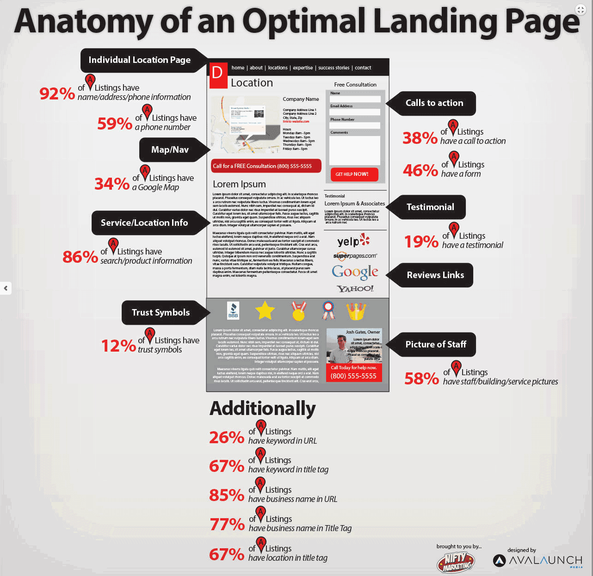](https://lh4.googleusercontent.com/-dwHBMXI44DY/U0HJDmQzraI/AAAAAAAAAng/jU0Qf7y7DrE/w1162-h1128-no/20140407-lokale-landingpagina.png)

Maar laat ik ze nog een langslopen. Wat er sowieso op **moet** staan, is:

```
  * **Volledige NAPT** (Naam, Adres, Postcode / Plaats en Telefoonnummer) – In [schema.org](http://schema.org) microformat.
  * **Een kaart van je locatie en de omgeving om je bedrijf** – Dit moet een embedded Google map zijn, waarop gebruikers kunnen in- en uitzoomen om te zien waar je bedrijf is, wat er in de buurt is en hoe ze bij je kunnen komen.
  * **De dagen en tijden waarop je locatie is geopend** – Dit bespaart je prospects en klanten een belletje.
  * **Diverse Calls To Action** – Zo stimuleer je mensen om iets te doen, bijvoorbeeld contact met je op te nemen voor een afspraak, een formulier in te vullen of reviews van het bedrijf ergens te lezen.
```

Verder kun je ook nog denken aan:

```
  * **Bepaalde keurmerken of certificeringen** – Zodat bezoekers kunnen zien dat je bedrijf te vertrouwen is.
  * **Reviews / testimonials** – Dit geeft een stuk “social proof” en laat zien dat klanten die eerder business met je hebben gedaan, er tevreden over zijn. Dit geeft dus ook vertrouwen.
  * **Routebeschrijving** – Voor de mensen die (nog) geen navigatie in de auto hebben. En meld het ook, als bijvoorbeeld parkeerruimte niet direct voor je bedrijf is, maar elders. Ook hiermee maak je het toekomstige bezoekers gemakkelijker.
  * **Contactformulier (indien van toepassing)** – Maar bijvoorbeeld een sleutelsmid of de dierenambulance hebben iets minder aan een contactformulier, want meestal moeten zij per direct opdraven bij incidenten. Je kunt natuurlijk ook een generiek contactformulier op je site maken, waarop mensen eventueel kunnen kiezen voor welke vestiging het bericht is.
  * **Foto’s** – Toon mooie, heldere en professionele foto’s, ook van de voorkant van je bedrijfspand. Zo kunnen potentiële bezoekers je pand snel herkennen. Laat zien hoe je bedrijfsvloot er uitziet, toon foto’s van de medewerkers met hun functieomschrijvingen erbij. Zo krijgt je bedrijf een gezicht! En als je een bedrijfspanorama hebt laten maken, dan is de lokale landingpage dé pagina bij uitstek, om de virtuele tour op te vertonen!
  * **Video’s** – Als je één of meer video’s hebt die specifiek over de desbetreffende bedrijfslocatie gaan, vertoon die dan ook op de bijbehorende lokale landingpage.
```

## Tag Tweeps op Twitter

Waarschijnlijk ben jij allang op de hoogte van het taggen van mensen op foto’s. Vorige week had ik het nog over het taggen van mensen in foto’s op Facebook: ik vertelde je toen dat ik dat op Facebook uit heb staan.

Zo’n anderhalve week geleden verscheen er in het weblog van Twitter het bericht met de titel “[Photos just got more social](https://blog.twitter.com/2014/photos-just-got-more-social)”.

[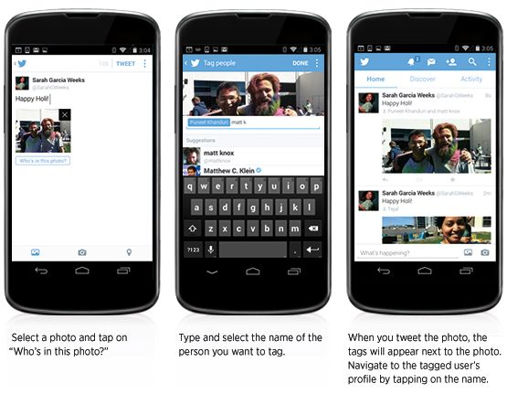](https://lh6.googleusercontent.com/-Z-P7IYDZX3k/U0HJG2C9ivI/AAAAAAAAAoU/5DuOo9Tdil0/w555-h431-no/Phototagging_FINAL.jpg)

Hierin is te lezen dat je nu tot 10 mensen kunt taggen in een foto en dat je nu ook tot 4 foto’s in één enkele tweet kunt versturen. Dit zou nu al beschikbaar moeten zijn in de officiële Twitter-app voor de iPhone, terwijl de Android-app binnenkort deze feature krijgt.

Maar deze nieuwe feature brengt dan dus ook gelijk weer een privacy-aspect met zich mee, waar ik je voor wil waarschuwen. Als je namelijk inlogt op Twitter en dan via “Instellingen” » “Beveiliging en privacy” gaat kijken wat de standaardinstelling is, dan zie je tot je verbazing dat deze automatisch staat ingesteld op “Iedereen mag mij taggen in foto’s”:

[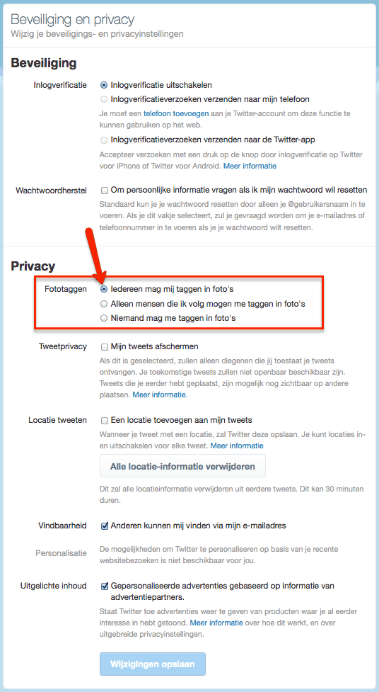](https://lh3.googleusercontent.com/-T9I2elCPnY8/U0HJGRiU55I/AAAAAAAAAoQ/a6xm3Q-uclY/w536-h977-no/20140407-twitter-fototaggen.png)

In de show notes heb ik hier een screenshot van opgenomen. En ik adviseer je om dit in zo snel mogelijk in te stellen op de keuze “Alleen mensen die ik volg mogen me taggen in foto’s”, of zelfs op “Niemand mag me taggen in foto’s”. Welke je van die twee kiest laat ik aan jezelf over.

Ik wilde je hier zo snel mogelijk van bewust maken, zodat je kunt voorkomen dat je ten onrechte in foto’s getagd kunt worden, waardoor jij in verlegenheid of diskrediet gebracht kunt worden.

## 9% van de top 100 commerciële websites gebruiken Responsive Design

Even tussendoor… Je weet natuurlijk dat je voor je mobiele bezoekers het beste een responsive website kunt hebben. Dat is een website die zichzelf aanpast aan het device, waarop je hem bekijkt. En dit is vaak ook gemakkelijker te onderhouden dan een aparte mobiele website.

Ik las op [MarketingLand](http://marketingland.com/among-top-100-e-tail-sites-9-percent-using-responsive-design-77974) een artikel waarin wordt vermeld dat slechts 9% van de top 100 commerciële sites gebruik maken van responsive webdesign. 59% van de bedrijven gebruikt en onderhoudt nog steeds een dedicated mobiele site en 32% van de sites heeft *nog steeds alleen maar een desktop versie van de website*!

[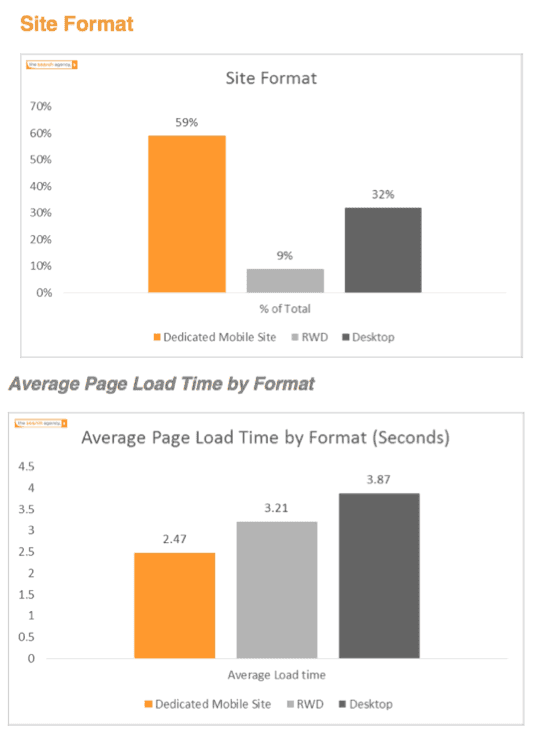](https://lh6.googleusercontent.com/-Z_TsXpYE3Fs/U0HJG67cXFI/AAAAAAAAAoE/BxlaoLcQOOk/w539-h739-no/Screen-Shot-2014-03-27-at-6.34.31-AM.png)

## Matt Cutts: Google blijft veranderen

Afgelopen week was het 1 april en mogelijk ben jij ook in het ootje genomen. Matt Cutts van Google had ook een leuke actie. Bekijk de video die ik in de show notes heb opgenomen en let in eerste instantie op het shirt van Matt:

Ook als mensen meer gesproken zoekopdrachten gaan geven, moet Google zich daarop aanpassen en uitvogelen hoe ze daar het beste mee om kunnen gaan.

Ondanks dat het een grap over verandering is, is het wel een aardig verhaaltje.

## Matt Cutts: Hoe onderscheidt Google populariteit van autoriteit?

Een dag later publiceerde Matt een interessantere video. In deze video beantwoordt hij de vraag hoe Google onderscheid maakt tussen eenvoudige populariteit en ware autoriteit:

Populariteit geeft dus aan waar mensen graag naartoe gaan, terwijl PageRank meer een indicator van “reputatie” is, waar mensen naartoe linken.

Google kijkt ook steeds meer naar het onderwerp en de inhoud van webpagina’s om te zien of ze een mate van autoriteit hebben in een bepaalde context, bijvoorbeeld de reisbranche. En dit is een gebied waarop Google haar best doet het algoritme steeds verder te verbeteren.

## Mooiere zakelijke Google+ cover foto’s

Het laatste topic voor vandaag dat ik met je wil delen gaat over mooie cover foto’s voor je zakelijke Google+ pagina. Je weet wel, die grote foto bovenaan je profiel. Ik las hierover een artikel op Local Visibility System, met de titel “[10 Classy Google+ Local Cover Photos – and How to Make Yours Better](http://www.localvisibilitysystem.com/2014/04/01/10-classy-google-plus-local-cover-photos-and-how-to-make-yours-better/)”. Ik kan je echt aanraden de link in de show notes te klikken en de 10 foto’s eens goed te bekijken. Wellicht geeft dit jou ook weer inspiratie om je eigen coverfoto aan te passen.

Het artikel sluit af met een vijftal leerpunten:

```
  1. Het hoeft niet per se _één_ foto te zijn, het mag ook gerust een mooie collage zijn. Zo kun je meer vertellen, dan met één foto.
  2. Het hoeft heus niet een foto te zijn van je product of dienst. Misschien is het zelfs beter om een andere foto te nemen!
  3. Probeer branding aan te brengen, zonder je logo pontificaal in beeld te laten komen.
  4. Teksten in de header kunnen soms ook nuttig zijn
  5. Overweeg eens zwart/wit
```

Ik ga de komende tijd eens nadenken hoe ik de coverfoto van diverse Google+ pagina’s beter en mooier kan maken. Jij ook? Met deze tips over het verbeteren van de coverfoto van je Google+ pagina kom ik dan vandaag weer aan het einde van de podcast.

Als je de podcast leuk vindt en je hebt inderdaad wat aan alle informatie die ik met je deel, help mij dan met het verder verbeteren en promoten van deze podcast. Surf dan naar iTunes of Stitcher, geef de podcast een sterrenbeoordeling en geef ook je reactie. Door de podcast te beoordelen op iTunes en/of Stitcher breng je de podcast onder de aandacht van een breder publiek. Je vindt de links naar iTunes en Stitcher onderaan de show notes.

Je kunt me verder helpen, door de podcast aan te bevelen bij vrienden of collega’s, waarvan je denkt dat ze er hun voordeel mee kunnen doen, of door ’m te delen op Twitter, like’n en delen op Facebook of een “+1” te geven op Google+.

En vergeet niet: ik ben hier om je te helpen! Als je een vraag of een probleem hebt met betrekking tot je online reputatie of de vindbaarheid van je website, kun je een mailtje sturen naar [podcast@reputatiecoaching.nl](mailto:podcast@reputatiecoaching.nl).

Als je dat te lastig vindt, of als je de podcast beluistert terwijl je in de auto zit en je hebt acuut een vraag, spreek dan een boodschap in op de ReputatieCoaching Hotline, op nummer: 084 - 883 15 56. Mogelijk behandel ik je vraag of probleem dan in een artikel of in de podcast.

En je kunt ook rechtstreeks op de website een voicemail achterlaten, door op de tab aan de rechterkant van elke pagina te klikken, en je bericht in te spreken. Dit was [ReputatieCoaching Podcast aflevering 71](https://web.archive.org/web/20141104094502/http://www.reputatiecoaching.nl:80/71/) en mijn naam is [Eduard de Boer](http://nl.linkedin.com/in/eduarddeboer/nl).

Ik wens je de komende week weer succes met het werken aan je reputatie, zodat je meteen je reputatie voor jou kunt laten werken!

Tot volgende week!

Doei!

Links naar content die in deze podcast aan bod komt:

```
  * ReputatieCoaching Podcast in iTunes
  * ReputatieCoaching Podcast op Stitcher
  * [ReputatieCoaching Podcast RSS-feed](https://web.archive.org/web/20140803035048/http://feeds.reputatiecoaching.nl:80/ReputatieCoachingPodcast)
  * [P3 Profiler](https://wordpress.org/plugins/p3-profiler/) - zoek uit welke plugin in WordPress je site vertraagt
  * “[Photos just got more social](https://blog.twitter.com/2014/photos-just-got-more-social)” (Twitter blog, 26 maart 2014)
  * “[Among Top 100 Etail Sites Only 9 Pct Using Responsive Design](http://marketingland.com/among-top-100-e-tail-sites-9-percent-using-responsive-design-77974)” (MarketingLand, 27 maart 2014)
  * “[10 Classy Google+ Local Cover Photos – and How to Make Yours Better](http://www.localvisibilitysystem.com/2014/04/01/10-classy-google-plus-local-cover-photos-and-how-to-make-yours-better/)” (LocalVisibilitySystem, 1 april 2014)
```
