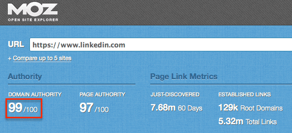
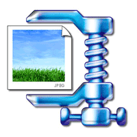

> **Historisch archief.** Deze aflevering verscheen op 14-04-2014 als onderdeel van ReputatieCoaching (2012–2016). De oorspronkelijke tekst is hieronder historisch bewaard. Diensten, contactgegevens, links, tools en adviezen kunnen inmiddels verouderd zijn.



**Transcriptiestatus:** Volledige transcriptie uit het oorspronkelijke archief.

***Historische afbeelding niet beschikbaar: ReputatieCoaching Podcast*
WordPress 3.9 komt als het goed is overmorgen uit en vanaf vandaag heb je als bedrijf niet meer de mogelijkheid om op LinkedIn je eigen Producten- en Dienstenpagina’s te maken. Facebook schrapt de messaging mogelijkheid uit de Facebook app en volgens Forrester moeten marketeers nu toch echt op Google+. Over Google gesproken: zij heeft schema.org afgelopen week uitgebreid voor diverse telefoonnummers. Oh, wil je overigens nog 10 TB aan GRATIS opslagcapaciteit in de cloud? Blijf luisteren, dan vertel ik je straks hoe je dat kunt krijgen! Vandaag krijg je ook nog eens een on-page SEO checklist en een WordPress Plugin tip!**

Hallo en hartelijk welkom bij deze aflevering van de ReputatieCoaching Podcast. Mijn naam is Eduard de Boer, ook bekend als de ReputatieCoach. Dit is dé podcast die je moet beluisteren als je meer wilt leren over online reputatie en reputatiemanagement en ook als je wilt werken aan je online reputatie en je online vindbaarheid wilt verbeteren. Dit alles kan je helpen om jezelf beter op de online kaart te plaatsen, waardoor je als bedrijf meer business kunt doen.

Als persoon kun je met de diverse tips aan de slag om bijvoorbeeld je online reputatie als balletdanser, autospuiter, magazijnbediende, reisleider, verwarmingsmonteur of wat dan ook te verbeteren.

De podcast kun je vinden op [www.reputatiecoaching.nl/72](https://web.archive.org/web/20141029205112/http://www.reputatiecoaching.nl:80/72/). Daar vind je niet alleen de tekst, maar ook video’s waar ik het in deze uitzending over heb, alsmede afbeeldingen, links enzovoorts. Bovendien is de podcast te beluisteren in iTunes en op Stitcher. Daar kun je je dus ook abonneren op de wekelijkse podcast. Veel mensen vinden het ideaal om de wekelijkse afleveringen van de podcast op hun gemak te beluisteren, terwijl ze autorijden.

Voordat ik terugblik naar de podcast van vorige week, eerst een update… Zoals je waarschijnlijk hebt gezien is er gisteren geen blogpost verschenen van Arend Landman met spreuken, oneliners, quotes en aforismen. Dat komt, doordat die serie tijdelijk is gestopt. Arend heeft vier weken achtereen op zondag mooie puntige uitspraken gepubliceerd. Bedankt Arend, zowel namens de luisteraars als namens mijzelf!

## Terugblik naar podcast 71

Eens even nadenken… Als ik moet kiezen welk topic van vorige week ik nog even extra wil benadrukken of bestempelen als leermoment, dan is het wel het gebruik van de plugin [“P3 Profiler” voor WordPress](https://web.archive.org/web/20141104094502/http://www.reputatiecoaching.nl:80/71/). Deze plugin geeft je inzicht in de performance van alle plugins die je in je WordPress website gebruikt.

Aan de hand van grafieken wordt snel inzichtelijk gemaakt welke plugin of plugins de meeste tijd kosten. Als je dit weet, kun je gaan werken aan de laadsnelheid van de pagina’s, om zo de tijd die nodig is totdat de pagina is geladen, verder omlaag te brengen.

Laat ik dan nu overgaan op de onderwerpen voor vandaag…

## WordPress 3.9 in aantocht!

*Historische afbeelding niet beschikbaar: Waarom WordPress?*
Overmorgen, op 16 april komt WordPress 3.9 uit. En die nieuwe versie belooft weer een groot aantal veranderingen en verbeteringen! Als wat ik erover heb gelezen klopt, kun je het volgende verwachten:

```
  * **Live thema previews** – Je kunt in 3.9 een live preview te zien krijgen, als je veranderingen doorvoert in je thema. Je hoeft dus niet meer de wijzigingen op te slaan en de pagina te verversen, om zo je veranderingen te zien.
  * **Drag ’n Drop afbeeldingen** – Dit gaat je veel tijd besparen! Je kunt straks namelijk afbeeldingen rechtstreeks in je artikelen slepen, waarbij ze automatisch worden geüpload naar je server.
  * **Betere image editing** – Je kunt afbeeldingen in de editor bewerken, terwijl je in je blogpost zit. Je hoeft dus geen apart venster meer te openen.
  * **Live fotogalerij preview** – Voorheen zag je alleen een gele box, waar je fotogalerij werd vertoond, maar nu zie je in de editor ook een preview van de fotogalerij.
  * **Audio / video playlists** – Net als een fotogalerij, kun je in WordPress 3.9 ook audio en video afspeellijsten maken.
  * **Verbeterde “paste” vanuit Word** – Voorheen gaf een copy/paste vanuit een Word document vaak gekke karakters of ongewenste teksten in je blogpost. Dat behoort nu tot het verleden, want je kunt in versie 3.9 probleemloos copy/paste’n vanuit Word.
```

## LinkedIn schrapt producten en diensten

*Historische afbeelding niet beschikbaar: Linkedin*
Per vandaag schrapt LinkedIn de “Producten en Service”-pagina’s van alle bedrijfsvermeldingen op de site. Dit heeft het bedrijf [een maand geleden al aangekondigd](https://web.archive.org/web/20140323074407/http://business.linkedin.com:80/marketing-solutions/c/14/3/products-and-services-tab-retirement.html?). LinkedIn meldt dat je twee alternatieven hebt, om informatie over je producten en diensten te delen:

```
  1. **Bedrijfsupdates** – Deze verschijnen in de nieuwsfeeds van al je volgers en ze worden ook gedeeld met de connecties van connecties, als deze ze delen of markeren als “Interessant”. Je kunt je producten of diensten ook nog eens in een video promoten en door het realtime karakter van de updates zijn speciale acties ook beter onder de aandacht te brengen.
  2. **Showcase pagina’s** – Dit is precies waarvoor showcase pagina’s ooit in het leven zijn geroepen: om je product of dienst speciaal onder de aandacht te brengen. Met showcase pagina’s kun je ook nog eens een specifieke community opstarten om zo een continue conversatie in het leven te houden over het product, de dienst of het merk. En volgers van een showcase pagina verwachten nieuws over het product of de dienst. Updates voor showcase pagina’s werken net als bedrijfsupdates, alleen dan voor de pagina.
```

Heb je eigenlijk al wel een bedrijfspagina voor je bedrijf op LinkedIn? Ongeveer een half jaar geleden vertelde ik in podcast 47 al over hoe je [LinkedIn kunt gebruiken op conferenties en congressen](https://web.archive.org/web/20140308061823/http://www.reputatiecoaching.nl:80/47/) en toen vroeg ik je ook al of je met je bedrijf al vermeld stond op LinkedIn. Ik zou je bedrijf toch maar eens gaan aanmelden, als je dat nog steeds niet hebt gedaan.

Zelfs al heb je een groentezaak of ben je banketbakker, dan nog heeft het maken van een bedrijfspagina op LinkedIn ook voor jou zin! Reden is, dat je ook op je bedrijfspagina weer… raad eens… Een citation ofwel bedrijfsvermelding kunt plaatsen, die je helpt om hogerop te komen in de lokale zoekresultaten!

Dus al zou je de pagina verder nergens voor gebruiken, dan nog raad ik je ten zeerste aan om je bedrijf ook op LinkedIn te vermelden. Want volgens de [Moz Open Site Explorer](http://www.opensiteexplorer.org) heeft LinkedIn een zogenaamde “Domain Authority” van 99 op een schaal van 100!

[](https://lh4.googleusercontent.com/-qCKKA46t7_k/U0rnOy8VSuI/AAAAAAAAAoo/cwa5YnyzT_s/w595-h272-no/20140414-Moz-LinkedIn.gif)

Let wel dat je niet zomaar een bedrijfspagina voor elk bedrijf kunt aanmaken. Je moet een geldig profiel hebben, met enkele connecties. Bovendien moet je in je profiel een mailadres hebben staan van hetzelfde domein, als het bedrijf waarvoor je de bedrijfspagina wilt maken. Een pagina aanmaken met alleen een @gmail.com, @hotmail.com of @outlook.com adres gaat dus niet werken. Daarnaast moet je in je profiel hebben staan dat je op dit moment voor het bedrijf werkt.

## Facebook schrapt messaging uit app

*Historische afbeelding niet beschikbaar: Bedrijfspagina maken op Facebook*
En er wordt meer geschrapt… TechCrunch maakte afgelopen week melding van een nogal grote [verandering van Facebook](http://techcrunch.com/2014/04/09/facebook-messenger-or-the-highway/): het bedrijf haalt binnenkort de mogelijkheid om berichten te sturen uit alle Facebook apps. Messaging is dan dus niet meer mogelijk in de apps voor iOS en Android.

In plaats daarvan kun je binnenkort alleen nog maar berichten sturen en lezen vanuit de Facebook Messenger app. Het sturen en lezen van berichten in de browser blijft natuurlijk wel mogelijk! Zou dit dan toch een voorbode zijn voor een toekomst waarin Messenger geïntegreerd gaat worden met WhatsApp? We zullen het zien…

## Forrester: “Marketeers moeten op Google+”

“[Tegenwoordig kunnen bedrijven amper meer om Google+ heen](https://web.archive.org/web/20140403191202/http://blogs.forrester.com:80/nate_elliott/14-03-31-why_every_marketer_should_use_google_plus?)”, zegt Nate Elliot van Forrester Research, “Sterker nog: bedrijven *moeten* wel iets gaan doen met Google+!”.

Want hoewel vaak wordt geroepen dat Google+ een “lege spookstad” is, wordt het maandelijks meer gebruikt dan Twitter, Instagram en Pinterest bij elkaar! En uit een enquête onder 60.000 Internettende Amerikanen zei 22% maandelijks Google+ te bezoeken. Evenveel zeggen Twitter te gebruiken.

Google+ is echter niet de “Facebook killer” gebleken, wat velen ooit dachten. Toch zie je dat merken op Google+ vrijwel net zoveel interactie krijgen op hun berichten, als op Facebook. De onderzochte topbedrijven hadden op Google+ zo’n 90% van het aantal volgers, dat ze op Twitter hadden. Grappig genoeg was dat meer dan de volgers op YouTube, Pinterest en Instagram bij elkaar geteld.

Ik begin het nu ook in mijn omgeving meer te zien, dat mensen ook Google+ gaan omarmen. Zo had ik afgelopen vrijdag nog een gesprek met een recruiter die actief is geworden op Google+, nadat hij door een link naar mijn Google+ profiel onderaan een e-mail, weer eens op Google+ werd geattendeerd. Hij vertelde mij, dat hij voor zijn werk nu ook op Google+ de sociale interactie aan zal gaan.

## GRATIS 10TB opslagruimte in de cloud!

*Historische afbeelding niet beschikbaar: CameraSync*
Tjonge, waar Google je op dit moment standaard 25 Gigabyte aan opslagruimte in de cloud geeft, kun je elders maar liefst 10 Terabyte krijgen! 10 Terabyte! Dat is een enorme hoeveelheid ruimte, zelfs groter dan de grootste harde schrijf die je op dit moment kunt kopen!

Er is echter één maar… Je moet het niet erg vinden, dat je data in China komt te staan…

Grappig: volgens mij is dit een openlijke uitnodiging van de Chinezen om hen te laten grasduinen door jouw data! Waar de NSA in de VS het allemaal nog stiekem doet, zeggen de Chinezen gewoon: “Zet al je data maar bij ons neer en wij zullen er goed op passen!”.

Ik zou er dus bijvoorbeeld geen persoonlijke of gevoelige data plaatsen. Maar het is wel een ideale plek om bijvoorbeeld al je video’s, foto’s of muziekbestanden te plaatsen.

Helaas heb ik er nog niet mee kunnen experimenteren. Ik probeerde de instructies op te volgen en me aan te melden op de site. Hoewel ik toch elke keer zeker was dat ik de juiste captcha intypte, meldde de site mij keer op keer dat ik een verkeerde captcha had ingevuld. Dus heb ik het even opgegeven.

Mocht jij het willen proberen en je Chinese 10 Terabyte cloudspace te claimen, dan kun je de link naar het [artikel op CloudDock](https://clouddock.co/how-to-get-10tb-of-cloud-storage-for-free/) volgen, die ik in de show notes op [www.reputatiecoaching.nl/72](https://web.archive.org/web/20141029205112/http://www.reputatiecoaching.nl:80/72/) heb vermeld.

## Google breidt schema.org uit

Ik heb je al vaker verteld over schema.org. Hiermee is het mogelijk om aan de zoekmachines aan te geven wat voor soort data je op een webpagina vertoont: zo is er bijvoorbeeld aparte schema.org markup voor evenementen, recepten, producten, boeken, menu’s, enzovoorts.

Daarnaast is er ook een markup voor bedrijven. Om je een idee te geven, hoe dit er dan uitziet, heb ik in de transcriptie van de podcast de markup beschreven, zoals ik die op de website van Allround Fotografie heb staan:

`

Allround Fotografie`

Ketelboetershoek 14
7328 JE Apeldoorn (Gelderland)

Zoals je daar ziet moet je er nogal wat extra markup omheen plaatsen. Nu heb ik nog wel een tweetal additionele dingen gedaan. Ten eerste heb ik de bedrijfsnaam gelinkt naar de Google+ pagina en ten tweede heb ik het telefoonnummer clickable gemaakt. Wellicht kende je deze truc nog niet… Specificeer het telefoonnummer op je site als “tel:+31” en je nummer (zonder de 0), dan is het opeens clickable op smartphones, tablets enzovoorts. En als het goed is, wordt dan automatisch gevraagd of het telefoonnummer moet worden gebeld.

Maar goed, Google heeft inmiddels een kleine uitbreiding aangebracht, om bedrijven in staat te stellen onderscheid te maken tussen telefoonnummers van verschillende bedrijfsonderelen, te weten:

```
  * Customer service
  * Technische support
  * Billing support
  * Bill payment
```

Voor elk soort telefoonnummer kun je ook nog eens aangeven, of het gratis is, geschikt voor doven en of het nummer wereldwijd aankiesbaar is, of slechts in bepaalde landen.

Als je zelf aan de slag wilt met schema.org, dan kun je op de gelijknamige website alle details lezen, of in de Webmaster Support hoek van Google een aantal [schema.org voorbeelden](https://developers.google.com/webmasters/business-location-pages/schema.org-examples) bekijken. De links vind je in de show notes van deze podcast.

Vorige week had ik het ook al over lokale landingpagina’s, maar nu heeft Google recent ook een stuk nuttige content gepubliceerd over het maken van [locatiepagina’s voor lokale bedrijven en organisaties](https://developers.google.com/webmasters/business-location-pages/).

## Checklist voor je on-page SEO

*Historische afbeelding niet beschikbaar: Google Maps logo*
Als ik het over SEO (ofwel: “Search Engine Optimisation”) heb, heb ik het vrijwel altijd over lokale SEO. Dat is wat je moet doen, om hoger te scoren in de lokale zoekresultaten op Google, je weet wel: die posities “A” tot en met “G” als je naar een product, dienst of specialist in de buurt zoekt.

Dan ga ik er al stilzwijgend van uit dat je je site al goed op orde hebt en dat je er alles aan hebt gedaan om jouw site goed naar voren te laten komen. Maar wat nu, als je geen idee hebt, wat bijdraagt om je site goed te laten scoren? Waar moet je dan beginnen en wat moet je wèl doen en wat juist níet?

Ik zal je aan de hand meenemen langs de belangrijkste zaken en je krijgt van mij een checklist die je op je gemak ook nog eens kunt nalezen op [www.reputatiecoaching.nl/72](https://web.archive.org/web/20141029205112/http://www.reputatiecoaching.nl:80/72/):

```
  1. **Title tags** – Je pagina als titel “Home” geven, of “Welkom” of “Welkom bij bedrijf ABC” is een gemiste kans. Evenals je bedrijfsnaam altijd vooraan in de titel plaatsen. Tot voor kort had je slechts zo’n 70 tot 72 karakters om je pagina een titel te geven, maar sinds de update waar ik in [podcast 68](https://web.archive.org/web/20141201231612/http://www.reputatiecoaching.nl:80/68/) over vertelde, waarbij Google de onderstrepingen bij links op de resultaatpagina’s heeft weggehaald, heb je nog maar zo’n 54 posities. Dat is weer een goede 18 karakters minder om je boodschap aan de wereld te tonen. De exacte hoeveelheid wordt bepaald door de letters, want de breedte die een titel tegenwoordig kan innemen is beperkt in het aantal pixels. Zo nemen bijvoorbeeld de hoofdletters “W” en “M” veel meer ruimte in dan een hoofdletter “I”. Gebruik in je titels dus relevante zoektermen, waarop je daadwerkelijk gevonden wilt kunnen worden.
  2. **Meta omschrijvingen** – Hoewel meta descriptions niet meer van invloed zijn op de ranking van je pagina’s in de zoekresultaten, bepalen ze wel voor een belangrijk deel of Internetters doorklikken of niet. Voor de omschrijving heb je zo’n 156 karakters de ruimte. Beschrijf daarin de inhoud van de pagina kort, maar krachtig. Want die omschrijving is tenslotte (na de titel) het eerste wat mensen over de pagina lezen. Maak het dus een kort verkoopverhaal, zonder te gaan spammen met zoektermen.
  3. **Heading tags** – Dit zijn de kopjes en tussenkopjes op je pagina, waarmee je lezers helpt om snel de gewenste inhoud te vinden. Je ziet het ook in de transcriptie van elke podcast: daarin gebruik ik ook kopjes om aan te geven welk onderwerp daaronder wordt besproken. Logischerwijs noem ik de kopjes niet, in de podcast zelf, want dat zou wel heel raar klinken. Als jij nog geen H1, H2 en andere heading tags gebruikt, moet je dit toch maar snel eens gaan doen. Zoals voor al het andere geldt ook hier: maak het niet te bont! Blijf je focussen op gebruikers en niet op zoekmachines! In een relatief kort blogbericht dien je slechts één H1 tag te gebruiken, en wellicht meerdere H2 of zelfs H3 tags.
  4. **Content** – Content is King! Daarmee trap ik een open deur in, ik weet het. Maar pagina’s die geen relevante of unieke content hebben, scoren zo goed als niet meer in de zoekresultaten. Schrijf goede content, waar de lezers iets aan hebben, die ze graag lezen en wees uniek. De tijd van klakkeloos kopiëren van goede content en die op je eigen site plaatsen om daarmee te ranken, is voorbij.
  5. **Vermijd dubbele content** – Content Management Systemen als WordPress of Joomla, evenals veel shopping cart pakketten kunnen dezelfde content soms op meerdere manieren aanbieden. Dit kan door Google worden gezien als dubbele content en dat is iets wat je wilt voorkomen. Op zich geeft het niet, als bijvoorbeeld hetzelfde product via twee of meer verschillende URLs wordt aangeboden, maar dan moet je wel zogenaamde canonieke URLs gebruiken. Vaak doen de CMS’en dat zelf al, maar het kan geen kwaad om dit eens te controleren. Voor informatie over het [gebruiken van canonieke URL’s](https://web.archive.org/web/20140418022050/https://support.google.com/webmasters/answer/139066?hl=nl) verwijs ik je graag door naar een artikel van Google. De link hier naartoe heb ik in de show notes opgenomen, want het voert wat ver om te proberen dit in audio uit te leggen.
  6. **URL structuur** – Standaard staat WordPress ingesteld om blogberichten via een URL in de trant van www.mijnbedrijf.nl/index.php?id= … en dan een nummer. Dat is lang niet zo krachtig als dat blogbericht een echte titel als URL heeft, waarin bij voorkeur ook weer relevante zoektermen in voorkomen. Dit kun je instellen. Dit heb ik lang geleden in [podcast 18](https://web.archive.org/web/20150312092549/http://www.reputatiecoaching.nl/18/) en een goed jaar geleden in het artikel “[WordPress SEO in 20 stappen](https://web.archive.org/web/20130718160649/http://www.reputatiecoaching.nl:80/wordpress-seo-in-20-stappen-infographic/)” ook al eens uit de doeken gedaan. Daar kun je er ook meer over lezen, dus hoe je dat doet laat ik nu even achterwege.
  7. **Crawl fouten** – Ik neem aan dat je je site inmiddels toch echt wel hebt aangemeld bij Google Webmaster Tools. Zo niet, dan moet je dat echt doen. Reden hiervoor is, dat dit de enige manier is, waarmee Google eventueel met jou in contact kan treden voor issues met betrekking tot je website of websites. Naast dat Google je daar bijvoorbeeld meldt als je een penalty hebt gekregen voor je site, kun je daar ook zien als de Googlebot bepaalde pagina’s niet kan vinden: de zogenaamde “Crawl fouten”. Dit heeft een negatief effect op je rankings, omdat ontbrekende pagina’s vaak in een negatieve gebruikerservaring resulteren. Je moet dus af en toe eens controleren of Google fouten tegenkomt en die dan fixen. Hoe je bepaalde fouten moet fixen, kan ik je een andere keer vertellen, als je daar behoefte aan hebt.
  8. **Controleer je “robots.txt” file** – Als je begint met een nieuwe site te maken, is het vaak raadzaam om tijdens je ontwikkeling zoekmachines geen toegang te geven tot je site. Zo voorkom je dat bijvoorbeeld pagina’s andere URL’s krijgen, waardoor ze niet meer vindbaar zijn etc. Maar je moet natuurlijk _niet_ vergeten om de zoekmachines wèl toegang te geven, als je eenmaal klaar bent met je site en je wilt dat deze zoveel mogelijk bezoekers trekt. Wel kun je bijvoorbeeld pagina’s die niet relevant zijn of die je om andere redenen niet in de zoekresultaten wilt, in de robots.txt file uitsluiten. Let op: het is een wens die je aangeeft, je blokkeert hiermee niet daadwerkelijk de toegang tot dat deel van je site!
  9. **Smartphone/tablet/desktop vriendelijk** – Met andere woorden: zorg ervoor dat je site op alle apparaten goed leesbaar is. Je kunt in deze tijd als bedrijf niet meer wegkomen met een site die alleen op desktops goed te lezen is… Echt niet! Want vergeet niet dat Google verwacht dat eind dit jaar meer zoekpogingen vanaf mobiele apparaten komen, dan vanaf vaste desktops! Je hebt grofweg twee mogelijkheden: een dedicated mobiele site, of een zogenaamde responsive design website. Over het algemeen verdient de tweede optie “een responsive website” de voorkeur. Daarbij past de weergave automatisch aan, afhankelijk van het apparaat waar je de site op bekijkt.
  10. **Laadsnelheid** – Het is essentieel dat pagina’s niet alleen snel laden op desktops, maar ook op mobiele apparaten. Vaak laden pagina’s langzaam door een overbelaste server, door onnodig grote afbeeldingen of als gevolg van de slechte performance van bepaalde plugins, in het geval van WordPress. Houd daarom de bestandsgrootte van afbeeldingen in de gaten: zorg ervoor dat ze niet onnodig groot zijn en controleer de performance van je WordPress plugins. Om de performance van je WordPress plugins te bekijken gaf ik je in de podcast van vorige week de tip om de plugin [P3 Profiler](https://web.archive.org/web/20141104094502/http://www.reputatiecoaching.nl:80/71/) te installeren. Die geeft potentiële bottlenecks goed aan.
  11. **Interne linking** – Link ook veel intern in je site naar andere artikelen. Zo breng je bepaalde (wellicht oude) pagina’s ook weer eens onder de aandacht van de lezers van je content. Het is inmiddels wel duidelijk: ik link me behoorlijk suf tussen alle podcasts en artikelen. Bovendien gebruik ik de plugin “YARPP” (dat staat voor: “Yet Another Related Posts Plugin”), waarmee ik aan het einde van elk blogbericht ook nog eens automatisch laat verwijzen naar gerelateerde content.
```

## WordPress Plugin-tip: “WP Smush.it”


Zojuist had ik het over het optimaliseren van afbeeldingen. Daar wil ik nog even verder op in gaan, en dan voornamelijk op een heel nuttige plugin, genaamd “[WP Smush.it](https://wordpress.org/plugins/wp-smushit/)”. In [podcast 24](https://web.archive.org/web/20150312092717/http://www.reputatiecoaching.nl/24/) heb ik ooit in één zin deze plugin een keertje genoemd. Maar evenals [P3 Profiler](https://wordpress.org/extend/plugins/p3-profiler/) is dit ook zo’n plugin die ik je echt kan aanraden!

Waarom? Nou, natuurlijk kun je zelf in je favoriete foto-editor proberen de bestandsgroote van al je afbeeldingen zo ver mogelijk te verkleinen. Maar dat is erg tijdrovend. Een alternatief is om elke afbeelding te uploaden naar [www.smushit.com](https://web.archive.org/web/20140415015839/http://www.smushit.com/ysmush.it/). Dat is een website van Yahoo! die je afbeeldingen zonder kwaliteitsverlies zo ver mogelijk in grootte reduceert. Ook dat kost je veel tijd!

Als je de plugin “[WP Smush.it](https://wordpress.org/plugins/wp-smushit/)” installeert en activeert in je WordPress blog, dan hoef je je nergens om te bekommeren, want dan wordt dit automatisch voor je gedaan! De plugin stuurt elke afbeelding die je uploadt naar [www.smushit.com](https://web.archive.org/web/20140415015839/http://www.smushit.com/ysmush.it/) en bewaart de geoptimaliseerde versie voor je, zonder dat dit een negatief effect heeft op de kwaliteit van je image. Ook reeds geüploade afbeeldingen kun je alsnog door smush.it laten verkleinen.

***Let op!** [www.smushit.com](http://www.smushit.com) verwijdert ook eventuele metadata van je foto’s!! Dus als het jouw doel is om in de toekomst je foto’s wellicht beter vindbaar te maken door elke foto vóór het uploaden te voorzien van metadata, dan moet je deze plugin niet gebruiken! In elk geval niet automatisch in de achtergrond!*

Een korte bonustip die voor elke website en voor elk CMS geldt. Ik zie maar al te vaak dat mensen veel te grote afbeeldingen uploaden en die dan verkleind laten weergeven in de browser. De browser moet dan dus eerst de onnodig grote afbeelding downloaden, waarna de afbeelding dan ook nog eens kleiner moet worden weergegeven. Zowel het downloaden van al die overtollige bytes, als het verkleind weergeven van de foto kost onnodig tijd… Tijd die een gebruiker dus niet zou hoeven te wachten, als je het goed zou hebben gedaan.

Upload foto’s in precies de juiste afmetingen voor je artikel of pagina, nadat je ze ook nog eens zo ver mogelijk verkleind hebt, qua bestandsgrootte. Ook dit resulteert in een betere gebruikerservaring en wellicht in betere rankings. In elk geval zal de laadsnelheid van je pagina toenemen, of beter gezegd: de laadtijd van de pagina zal afnemen.

Met deze on-page SEO checklist en de twee tips voor het optimaliseren van je afbeeldingen kom ik dan weer aan het einde van deze podcast.

Als je de podcast leuk vindt en je hebt inderdaad wat aan alle informatie die ik met je deel, help mij dan met het verder verbeteren en promoten van deze podcast. Surf dan naar iTunes of Stitcher, geef de podcast een sterrenbeoordeling en geef ook je reactie. Door de podcast te beoordelen op iTunes en/of Stitcher breng je de podcast onder de aandacht van een breder publiek.

Je kunt me verder helpen, door de podcast aan te bevelen bij vrienden of collega’s, waarvan je denkt dat ze er hun voordeel mee kunnen doen, of door ’m te delen op Twitter, like’n en delen op Facebook of een “+1” te geven op Google+.

En vergeet niet: ik ben hier om je te helpen! Als je een vraag of een probleem hebt met betrekking tot je online reputatie of de vindbaarheid van je website, kun je een mailtje sturen naar [podcast@reputatiecoaching.nl](mailto:podcast@reputatiecoaching.nl).

Als je dat te lastig vindt, of als je de podcast beluistert terwijl je in de auto zit en je hebt acuut een vraag, spreek dan een boodschap in op de ReputatieCoaching Hotline, op nummer: 084 - 883 15 56. Mogelijk behandel ik je vraag of probleem dan in een artikel of in de podcast.

En je kunt ook rechtstreeks op de website een voicemail achterlaten, door op de tab aan de rechterkant van elke pagina te klikken, en je bericht in te spreken. Dit was [ReputatieCoaching Podcast aflevering 72](https://web.archive.org/web/20141029205112/http://www.reputatiecoaching.nl:80/72/) en mijn naam is [Eduard de Boer](http://nl.linkedin.com/in/eduarddeboer/nl).

Ik wens je de komende week weer succes met het werken aan je reputatie, zodat je meteen je reputatie voor jou kunt laten werken!

Tot volgende week!

Doei!

Links naar content die in deze podcast aan bod komt:

```
  * ReputatieCoaching Podcast in iTunes
  * ReputatieCoaching Podcast op Stitcher
  * [ReputatieCoaching Podcast RSS-feed](https://web.archive.org/web/20140803035048/http://feeds.reputatiecoaching.nl:80/ReputatieCoachingPodcast)
  * [Canonieke URL’s gebruiken](https://web.archive.org/web/20140418022050/https://support.google.com/webmasters/answer/139066?hl=nl) (Google Webmaster Support)
  * [Locatiepagina’s maken](https://developers.google.com/webmasters/business-location-pages/) (Google Webmaster Support)
  * [Schema.org voorbeelden](https://developers.google.com/webmasters/business-location-pages/schema.org-examples) (Google Webmaster Support)
  * “[Retiring the Products & Services tab from Company Pages](https://web.archive.org/web/20140323074407/http://business.linkedin.com:80/marketing-solutions/c/14/3/products-and-services-tab-retirement.html?)” (LinkedIn blog, 13 maart 2014)
  * “[How To Get 10TB of Cloud Storage For Free](https://clouddock.co/how-to-get-10tb-of-cloud-storage-for-free/)” (CloudDock, 21 maart 2014)
  * “[Why Every Marketer Should Use Google Plus](https://web.archive.org/web/20140403191202/http://blogs.forrester.com:80/nate_elliott/14-03-31-why_every_marketer_should_use_google_plus?)” (Forrester, 31 maart 2014)
  * “[Facebook Is Forcing All Users To Download Messenger By Ripping Chat Out Of Its Main Apps](http://techcrunch.com/2014/04/09/facebook-messenger-or-the-highway/)” (TechCrunch, 9 april 2014)
```
