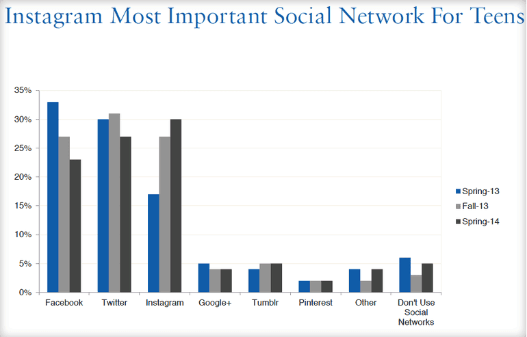
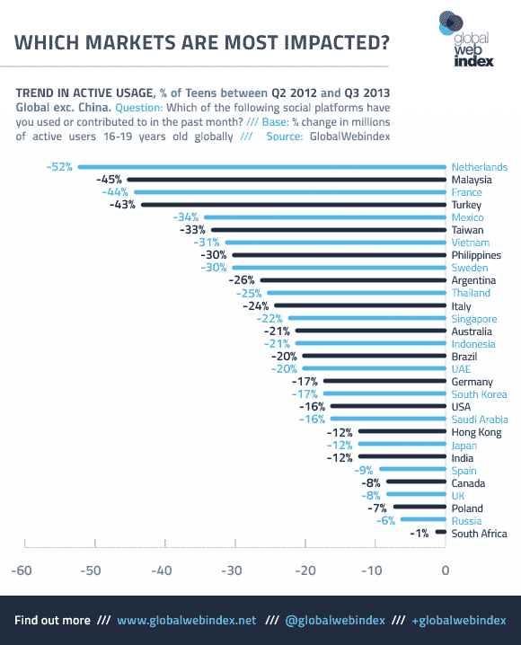
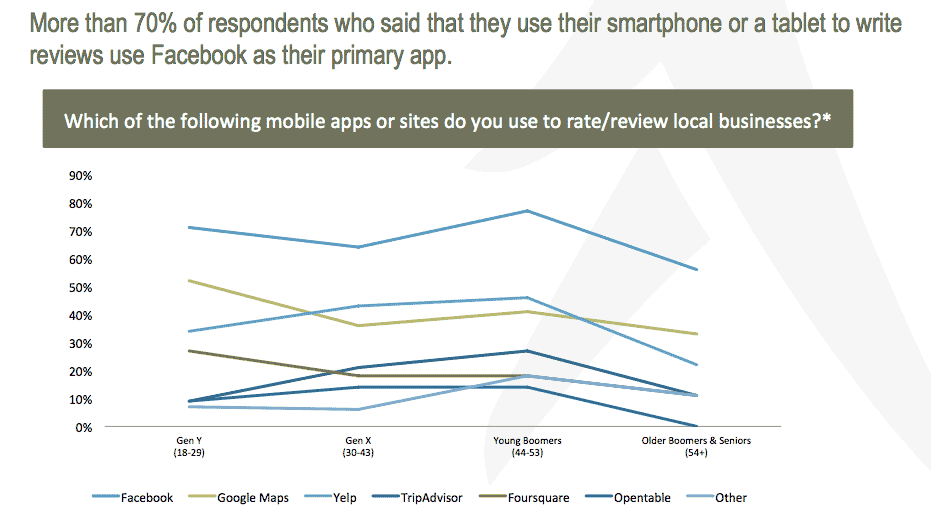
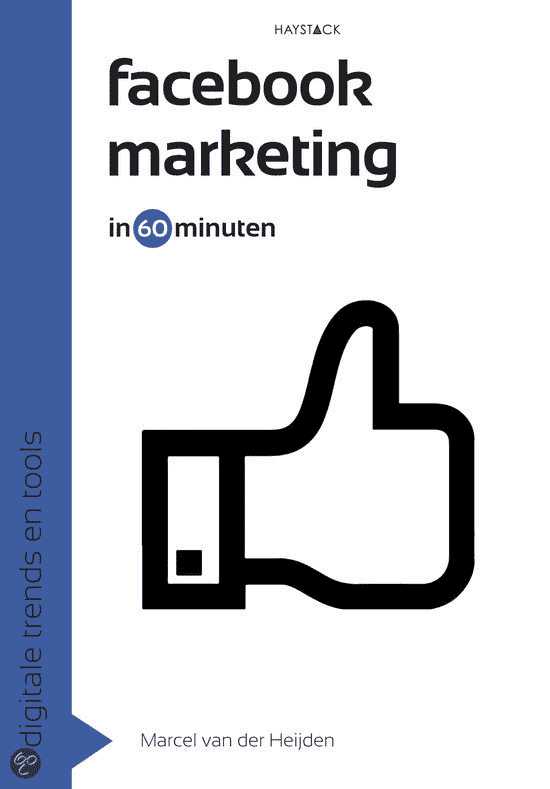
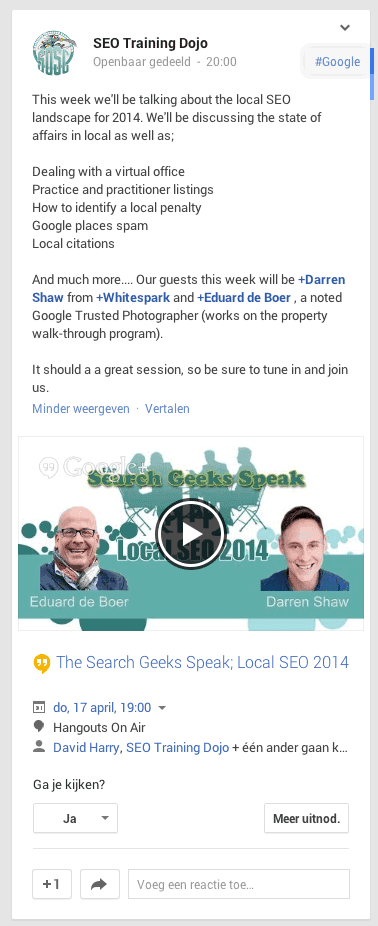

> **Historisch archief.** Deze aflevering verscheen op 21-04-2014 als onderdeel van ReputatieCoaching (2012–2016). De oorspronkelijke tekst is hieronder historisch bewaard. Diensten, contactgegevens, links, tools en adviezen kunnen inmiddels verouderd zijn.



**Transcriptiestatus:** Volledige transcriptie uit het oorspronkelijke archief.

***Historische afbeelding niet beschikbaar: ReputatieCoaching Podcast*
Vandaag is het tweede Paasdag en de podcast is vandaag bij wijze van uitzondering iets later online gekomen, dan anders. Hoe dat komt, vertel ik je zo. Afgelopen week is WordPress 3.9 uitgekomen en recentelijk is er heel wat gebeurd op het Facebook front, dus ik heb veel Facebook updates voor je. En zoals ik al heb geschreven was ik vorige week maandagavond op een leuke informatieavond over Facebook Marketing, die werd georganiseerd door de Social Media Club Apeldoorn (#SMC055).**

Hallo en hartelijk welkom bij deze aflevering van de ReputatieCoaching Podcast. Mijn naam is Eduard de Boer, ook bekend als de ReputatieCoach. Dit is dé podcast die je moet beluisteren als je meer wilt leren over online reputatie en reputatiemanagement en ook als je wilt werken aan je online reputatie en je online vindbaarheid wilt verbeteren. Dit alles kan je helpen om jezelf beter op de online kaart te plaatsen, waardoor je als bedrijf meer business kunt doen.

De podcast kun je vinden op [www.reputatiecoaching.nl/73](https://web.archive.org/web/20150312094134/http://www.reputatiecoaching.nl/73/). Daar vind je niet alleen de tekst, maar ook video’s waar ik het in deze uitzending over heb, alsmede afbeeldingen, links enzovoorts. Bovendien is de podcast te beluisteren in iTunes en op Stitcher. Daar kun je je dus ook abonneren op de wekelijkse podcast. Veel mensen vinden het ideaal om de wekelijkse afleveringen van de podcast op hun gemak te beluisteren, terwijl ze autorijden.

Voordat ik de onderwerpen van vandaag aansnijdt eerst even een korte toelichting, hoe het komt dat de podcast vandaag niet –zoals altijd– stipt om 08:30 ’s ochtends online is gekomen. De reden hiervoor is dat we gisteren een feestje hadden, maar niet zomaar een feestje. We vierden namelijk drie verjaardagen op één en dezelfde dag. Mijn vrouw Suzanne was eerder dit jaar namelijk jarig op 31 januari, ikzelf op 23 februari en gisteren op 20 april werd onze zoon Fonz 14.

Vanwege onze vakantie en de weersgesteldheid in de winter hadden we besloten de verjaardagen van Suzanne en mij dus later te vieren. We hebben onze vrienden- en familiekring tijdig een uitnodiging gestuurd, want vaak hebben mensen natuurlijk al wel afspraken op eerste Paasdag… En maar liefst 60 mensen zegden toe graag van de partij te zijn.

Dat vereist natuurlijk aardig wat voorbereiding, qua inkopen en voor de catering. Dus op vrijdag hebben we eerst boodschappen gedaan en we waren bijna de hele zaterdag bezig met bijvoorbeeld salades maken, 7 kilogram kipfilet snijden, marineren en aan stokjes rijgen, 8 liter satésaus maken, een grote hoeveelheid kroepoek frituren enzovoorts. En gisteren (op zondag) hadden we dus inderdaad zo’n 60 mensen in de tuin.

Het was een geslaagd feestje! Van de 170 satéstokjes, waren er nog maar een goede 20 over, dus dat betekent dat er zo’n 150 zijn opgegeten! Ook het bier en de wijn was redelijk opgegaan. Met andere woorden: we hadden dus goed ingekocht!

Anyway, door al deze drukte is de podcast vandaag dus iets later uitgekomen, dan anders. En ik denk dat de meeste luisteraars toch niet per se om 08:30 uur op tweede Paasdag direct de podcast willen beluisteren… Maar ik beloof je dat de podcast van volgende week weer gewoon op maandagmorgen 08:30 live komt.

En dan het laatste berichtje, voor ik doorga met de topics voor vandaag. Voor alle volledigheid en transparantie: in de show notes neem ik soms affiliate links op. Dit zijn links naar bijvoorbeeld boeken, trainingen of andersoortige content die je elders kunt kopen. Als je die links volgt, krijg ik een kleine commissie. Zo komt vandaag bijvoorbeeld een boek aan de orde, waarbij ik een affiliate link naar de pagina van het boek op bol.com heb opgenomen.

En laat ik dan nu overgaan op de onderwerpen voor vandaag…

## #SMC055: Social Media Club Apeldoorn over Facebook Marketing

*Historische afbeelding niet beschikbaar: #SMC055: Social Media Club Apeldoorn*
De avond over Facebook Marketing van de Social Media Club Apeldoorn trok afgelopen maandagavond een groot aantal bezoekers. Er werden twee presentaties gegeven: eentje door Bjorn van Ekeren (eigenaar van het Dorpshart in Twello) en eentje door Peter Minkjan, een zelfstandig Facebook adviseur.

Bjorn van Ekeren vertelde hoe hij zijn marketing doet via Facebook, door middel van een aantal leuke acties. Hij zei ook dat hij een lijst bijhoudt voor ideeën om content te verspreiden. Een op basis van deze ideeënlijst stelt hij maandelijks een soort van publicatiekalender op, waarin hij plant wanneer hij wat post.

Zo houdt hij er natuurlijk rekening mee, dat hij een leuke foto van een glas wijn niet op dinsdagochtend om 10:00 uur post enzovoorts. Als je het [Storify-board van deze #SMC055 informatieavond](https://web.archive.org/web/20170313044544/http://www.reputatiecoaching.nl/smc055-facebook-marketing-apeldoorn-op-14-april-2014/) nog eens naleest, krijg je een aardig beeld van wat Bjorn van Ekeren allemaal voor leuke dingen doet om zijn restaurant telkens weer op de kaart te zetten, te houden en om gasten naar zijn etablissement te trekken. Ik vond het geniaal om te horen wat hij allemaal doet.

De presentatie van Peter Minkjan over Facebook Marketing bestond uit 186 slides waar hij in een moordend tempo doorheen ging. Desalniettemin was zijn verhaal goed te volgen. Vooral statistieken over aantallen gebruikers, potentieel bereik en de advertentie- en targetingmogelijkheden binnen Facebook vielen volgens mij goed in de smaak bij het publiek. Het bleek ook dat nog niet zoveel mensen de Search Graph leken te kennen en dus ook nog nooit kennis hebben gemaakt met de mogelijkheden die dit biedt.

De presentatie die Peter Minkjan 14 april gaf in Apeldoorn heb ik in de show notes op [www.reputatiecoaching.nl/73](https://web.archive.org/web/20150312094134/http://www.reputatiecoaching.nl/73/) opgenomen. Hij heeft ’m namelijk gepost op Slideshare:

## WordPress 3.9 is live

Vorige week kondigde ik het al aan: afgelopen week en om precies te zijn op 16 april zou WordPress 3.9 worden uitgebracht. Zoals bij elke update heb ik ook nu weer een paar dagen gewacht voor ik het installeerde op de diverse websites. Mijn reden hiervoor is, dat er altijd iets fout kan gaan bij het uitbrengen van een nieuwe versie van een programma of een softwarepakket. En als je dan als één van de eerste meteen de nieuwste versie installeert, kan het dus gebeuren dat je je website om zeep helpt met alle ellende van dien.

Dus dat wil ik voorkomen en voordat ik dan upgrade, kijk ik altijd eerst even op Internet of de afgelopen dagen mensen problemen met de update hebben gemeld. Zo ja, dan duik ik in de problemen en probeer in te schatten of ik die ook ga krijgen. Maar als niemand problemen meldt, dan maak ik eerst een extra backup, om vervolgens de update door te voeren.

Zo ook deze keer en inmiddels draait [www.reputatiecoaching.nl](https://web.archive.org/web/20140706162453/http://www.reputatiecoaching.nl/) dus zonder problemen op WordPress 3.9. Ik moet zeggen dat ik de nieuwe editor een stuk prettiger vind werken en dat inderdaad het opnemen van afbeeldingen in een blogbericht en het resizen van foto’s wel gemakkelijker en sneller werkt.

Dan heb ik nogal wat updates over Facebook…

## Tiener verliest interesse in Facebook

Om te beginnen lijkt het erop, alsof tieners de interesse in Facebook verliezen. Dat was laatst te lezen in een artikel in de Telegraaf, met als titel “[Tiener verliest interesse in Facebook](https://www.telegraaf.nl/digitaal/22488361/__Tiener_verliest_interesse_in_Facebook__.html)”. In het artikel wordt een onderzoek van Internetanalysebureau “Piper Jaffray” aangehaald. In dit onderzoek kwam naar boven dat in de lente van 2013 Facebook nog het belangrijkste sociale netwerk was voor 33% van de ondervraagde tieners. In de herfst was dat percentage al gedaald naar 27%.

Grappig genoeg is Instagram in dezelfde periode enorm toegenomen in populariteit onder de jongeren, want het steeg van 17% naar 30%.

Verder is er eigenlijk geen concurrentie op social media gebied, want bijvoorbeeld Google+, Pinterest en Tumblr zijn niet boven de 5% uitgekomen.

[](https://lh6.googleusercontent.com/-MyNpRIPZD9o/U1VeU358R-I/AAAAAAAAApI/MAL-jnq2w0g/w770-h493-no/20140421-FB-decline-teens.png)

Dit was een onderzoek dat is uitgevoerd onder Amerikaanse jongeren en dat zegt lang niet altijd iets over welke social media netwerken de Nederlandse jongeren het liefst gebruiken. Ik ben na het lezen van dit artikeltje nog eens een stukje verder gaan spitten en ik stuitte op een artikel op “[GlobalWebIndex](http://blog.globalwebindex.net/facebook-teens-decline)” van november 2013. Daarin kwam nog meer aan het licht…

Tijdens de Q3 earnings call van Facebook vorig jaar, werd nog gezegd dat de afname van het gebruik van Facebook onder jongeren “niet echt significant” was… Maar uit onderzoek van GlobalWebIndex is gebleken dat in Nederland de afname van het Facebook gebruik door jongeren maar liefst 52% bedroeg tussen het tweede kwartaal van 2012 en het derde kwartaal van 2013. 52%! Daarmee scoorde Nederland toen de eerste plaats, gevolgd door Maleisië (met 45%) en Frankrijk met een daling van 44%.

Het lijkt erop alsof de jongeren dus echt aan het ouderlijk toezicht willen ontsnappen, want vrijwel elke ouder die op Facebook zit, is natuurlijk bevriend met zijn of haar kind of kinderen en niet elke jongere is ervan gediend dat alle statusupdates en foto’s dus ook door de ouders gezien kunnen worden.

[](https://lh3.googleusercontent.com/-HRR0MRLlsS4/U1VeU2tM_qI/AAAAAAAAApQ/zlhSgh-g9WE/w580-h718-no/20140421-FB-market-impact.png)

Waar ze dan heengaan? Het lijkt erop, dat ze voornamelijk met elkaar in contact blijven met diverse chatapplicaties, zoals “WhatsApp” en met “Instagram” en/of “Snapchat”.

Voor het geval je nog nooit van Snapchat hebt gehoord… Op Wikipedia lees je het volgende over “[Snapchat](http://nl.wikipedia.org/wiki/Snapchat)”:

Het bijzondere van de toepassing is dat de doorgezonden media slechts tijdelijk zichtbaar zijn bij de bestemmelingen, dit gaat van één tot tien seconden. Daarna verdwijnen de bestanden van de servers van Snapchat. Gebruikers kunnen echter gemakkelijk het beeld zelf opslaan.

Snapchat wordt veel gebruikt voor het maken van selfies.

## Facebook doet nieuwe spamalgoritmes uit de doeken

Ik blijf nog even bij Facebook. Eerder deze maand verscheen een artikel op het weblog van Facebook, waarin werd uitgelegd dat [Facebook nieuwe spamalgoritmes heeft geïmplementeerd](http://newsroom.fb.com/news/2014/04/news-feed-fyi-cleaning-up-news-feed-spam/) om de kwaliteit van de content op de tijdlijn van iedereen te verbeteren.

Het doel van de vernieuwingen is om te beginnen een eind te maken aan al die “Like-baiting”: van die fotootjes of berichten die je maar moet Like’n enzovoorts. Als het goed is, verschijnen die nu niet meer op de tijdlijn en dus heeft voor bedrijven ook geen zin meer allemaal van dit soort “Like nu” en “Share nu” acties te posten.

Ik ergerde me hier ook eigenlijk altijd enorm aan en ik ben dus heel blij dat als het goed is, ik nu dus niet meer van dit soort zinloze posts te zien krijg. Bij mij ging de irritatie al zover, dat ik langzamerhand amper nog Facebook gebruikte: al die nutteloze Like-updates interesseerden me namelijk geen zier!

Verder moet de vernieuwing er ook voor zorgen dat spammy links niet meer verspreid kunnen worden.

Goed nieuws dus, voor de mensen die net als ik zich enorm ergerden aan de Like ’n share acties!

## Facebook vertoont reviews nu net als Google!

En Facebook gaat ook Google+ achterna… Althans, op het gebied van de reviews. Misschien wist je het nog niet, maar je kon al sinds november vorig jaar bedrijfspagina’s een beoordeling of review geven. Toen werd het gezien als een potentiële concurrent voor Yelp, Foursquare en Google+.

Tot vorige week werden alleen de sterretjes en het aantal beoordelingen bij een bedrijfspagina vertoond, maar nu staan er ook numerieke scores bij:

[[Historische afbeelding: Numerieke review scores in Facebook](https://lh4.googleusercontent.com/XwnwLQbNF9EkWyPs_aoZ93uFOiDfJPCVkThcWG9y9RI=w826)](https://lh4.googleusercontent.com/XwnwLQbNF9EkWyPs_aoZ93uFOiDfJPCVkThcWG9y9RI=w826)

De beoordelingen verschijnen overigens alleen bij bedrijfspagina’s die een echt fysiek adres vermelden op hun pagina-instellingen.

## Facebook app meest gebruikt voor posten lokale reviews!

Over Facebook beoordelingen gesproken: uit een Amerikaans onderzoek van de “Local Search Association” is naar voren gekomen dat de Facebook app verreweg de meest gebruikte app is voor het schrijven van lokale reviews op een smartphone of op een tablet.

Het onderzoek is gehouden onder 1000 smartphonegebruikers. Er is onderzocht hoeveel van hen reviews hebben geschreven en wat daarbij hun favoriete apparaat was. Van de mensen onder de 53 jaar zei 70% een online review te hebben geschreven.

[](https://lh4.googleusercontent.com/-PHB6hXwpsoY/U1VeXWHWPDI/AAAAAAAAApo/Zb3wFcft23A/w931-h528-no/20140421-FB-review-app.png)

Zo’n 15% gebruikte hiervoor de smartphone of tablet, terwijl 85% liever een PC gebruikte. Het meerdendeel van de mobiele reviewschrijvers zei het liefst Facebook te gebruiken voor lokale reviews, en dus geen gebruik te maken van Google+, Yelp, TripAdvisor, Foursquare, OpenTable en andere diensten.

Dit bewijst eens temeer dat Facebook toch een belangrijke speler begint te worden in het lokale speelveld.

## “Facebookmarketing in 60 minuten” (door Marcel van der Heijden)

[](http://partnerprogramma.bol.com/click/click?p=1&t=url&s=20124&url=http%3A//www.bol.com/nl/p/facebookmarketing-in-60-minuten/9200000011525426/&f=TXL&name=facebookmarketing60min)Tjongejonge, nog meer Facebook content! Afgelopen week, op 15 april om precies te zijn, kwam het boek “[Facebookmarketing in 60 minuten](http://partnerprogramma.bol.com/click/click?p=1&t=url&s=20124&url=http%3A//www.bol.com/nl/p/facebookmarketing-in-60-minuten/9200000011525426/&f=TXL&name=facebookmarketing60min)” (aff.) door Marcel van der Heijden uit. Op Frankwatching schreef Arend Landman een review van het boek, in het artikel “[Facebookmarketing: zo krijg je het onder de knie](https://www.frankwatching.com/archive/2014/04/15/facebookmarketing-zo-krijg-je-het-onder-de-knie/)”.

Arend Landman heeft, net als ikzelf, zich nooit erg verdiept in marketing met Facebook. Hij schrijft dat hij het een goed boek vindt en dat hij vooral het stuk over Edgerank bijzonder informatief vond. Ik kan me goed voorstellen dat je nog nooit van Edgerank hebt gehoord. Dit is het algoritme van Facebook dat bepaalt wie welke content te zien krijgt. Want de kans is groot dat een bedrijf of iemand uit je vriendenkring dikwijls iets post, maar dat jij het niet te zien krijgt. Vooral als je bijvoorbeeld updates of images van sommige vrienden nooit een like geeft of er nooit op reageert, dan is de kans groot dat de content van die persoon in de toekomst steeds minder vaak aan jou zal worden vertoond. Facebook krijgt dan namelijk de indruk dat jij die content toch niet interessant vindt.

Dit heeft ook tot gevolg dat statusupdates van bedrijven vaak maar door een klein deel van de fans worden gezien. Maar goed, terug naar de recensie van het boek.

Arend Landman vindt het boek een aanrader, maar zegt het jammer te vinden dat er niet wordt ingegaan op het genereren van leads voor e-mailmarketing met behulp van Facebook en over de mogelijke invloed van Facebook posts op je positie in de organische zoekresultaten op Google.

Dat laatste begrijp ik niet helemaal, want Facebook posts vind je eigenlijk nooit terug in de organische zoekresultaten op Google. Vroeger zag je nog wel eens video’s van Facebook vermeld, maar die zie je ook nooit meer terug. Reden hiervoor is, dat Google nagenoeg geen toegang heeft tot alle dieperliggende Facebook content. Wat je natuurlijk wel terugziet in de organische zoekresultaten, zijn de persoonlijke profielpagina’s en de bedrijfspagina’s.

Hoewel Facebook posts dus geen directe invloed hebben op de posities in de organische zoekresultaten kunnen ze wel indirect effect hebben. Als je namelijk via Facebook mensen naar je content weet te trekken en als deze mensen dan vervolgens de content ook via andere sociale netwerken extra onder de aandacht brengen, krijg je nog meer verkeer en zo zal jouw content dus nog meer worden bekeken en zal er ook naar worden gelinkt. En dat soort acties kunnen wèl bijdragen tot hogere rankings in de organische zoekresultaten.

Dat wilde ik bij die opmerking even als toelichting geven, zodat je niet gaat denken dat het enthousiast posten van content en links in Facebook per definitie leidt hogere scores in Google.

In elk geval zal ik het boek binnenkort ook eens lezen, want het lijkt mij (helemaal na de informatieavond over Facebook marketing van SMC055 van vorige week) erg interessant om hier ook eens iets verder in te duiken.

## Spreid je reviews en maar er backups van!

Wed nooit op één paard, zeker niet als je reviews verzamelt. Dat is een advies dat ik aan elke ondernemer geef. Je weet tenslotte nooit wat er in de toekomst kan gebeuren met het platform waar jij toevallig net je reviews aan het verzamelen bent. Als dat wordt opgeheven kan het zomaar zijn dat je dan je reviews kwijt bent.

Voor Nederlandse bedrijven en ondernemers is het niet relevant, maar herinner je je nog dat ik in [podcast 64](https://web.archive.org/web/20150312093837/http://www.reputatiecoaching.nl/64/) vertelde dat Yahoo de reviews van Yelp zou gaan vertonen? Welnu, dat is al sinds enige tijd zo. Alleen heeft dit nu tot gevolg dat zodra iemand nu een nieuwe review post op Yelp, hierdoor ineens alle Yahoo reviews zijn verdwenen! Foetsie! Weg!

Weg is al je harde werk van een aantal jaren, waarin je met moeite een aantal reviews hebt verzameld… Stel je voor, als je als bedrijf al die jaren alleen op Yahoo reviews zou hebben verzameld. Dat is dan erg zuur!

Maak daarom ook altijd screenshots van de verschillende reviews die overal worden gepost en bewaar die. Bovendien kun je een afbeelding van een review moeiteloos en zonder risico delen op andere sociale media, zonder dat Google dit aanziet voor dubbele content: het is immers een plaatje van de tekst. Ik ga er natuurlijk vanuit, dat je niet de tekst letterlijk kopieert en plakt tussen de sociale kanalen en je websites etc, want dat wordt sterk afgeraden!

Mocht een site dan ooit verdwijnen, dan heb je de reviews tenminste nog en kun je ze hergebruiken.

## Matt Cutts parodie: “Spam Around The World”

Hoge bomen vangen veel wind en dus heb je ook kans dat er allerhande parodieën over of van je worden gemaakt. Hoewel hij tientallen, honderden of misschien zelfs duizenden mensen achter de schermen aan het werk heeft, staat Matt Cutts natuurlijk zelf altijd voor de camera te vertellen wat er volgens Google allemaal wel en niet mag en dat Google het zoveelste spamnetwerk heeft uitgeschakeld etc.

Dus dat er dan vaak ook grappen over Matt worden gemaakt, ligt dan voor de hand. Zo kwam ik afgelopen week een muziekvideo tegen, waarin Matt Cutts lijkt te rappen over “Spam Around The World”. Deze video heb ik opgenomen in de show notes:

## Matt Cutts: SEO mythen

Matt Cutts zet deze week in de rol van mytholoog. In een Google Webmasters video die een paar dagen geleden verscheen, ontkrachtte hij namelijk een aantal SEO mythen, naar aanleiding van een vraag van iemand uit Michigan.

Verder heerst er de mythe dat alle veranderingen van Google er op zijn gericht om bedrijven bijna te verplichten om advertenties te kopen. Matt zegt hierover dat het doel van Google is om elke bezoeker de beste resultaten te geven op basis van de ingevoerde zoektermen, zodat die gebruiker weer terugkomt voor een volgende zoekterm. Het kopen van AdWords advertenties heeft geen positief effect op je rankings, noch een negatief effect.

Verder waarschuwt hij voor “groupthink”. Dat is een fenomeen waarbij een paar mensen iets roepen over een bepaalde tactiek of werkwijze, waardoor een veel grotere populatie dit als waarheid gaat beschouwen. Een voorbeeld hiervan is de idee dat het posten in artikeldirectories leidt tot betere resultaten, waardoor vervolgens hele volksstammen niets anders meer gaan doen, dan posten in artikeldirectories.

Matt raadt aan om eens wat vaker je gezonde verstand te gebruiken. Want stel nu dat iemand wèl een fantastische tactiek zou hebben om keer op keer nummer één te scoren in de zoekresultaten, dan zou je toch redelijkerwijs kunnen verwachten dat die persoon dat voor zichzelf zou houden en maximaal commercieel zou uitbuiten? Daarentegen lees je dan weer van één of ander fantastisch programma dat je gegarandeerd binnen een paar dagen of weken etc. naar de top helpt. Als al die tools, programma’s en e-books echt zouden werken, dan zouden de producenten ze heus niet openbaar maken.

Houd dus het doel van Google voor ogen als je dit soort once-in-a-lifetime kansen voorbij ziet komen. Als dit kan betekenen dat je dingen doet die tegen het doel van Google indruisen, dan is de kans zelfs groot dat deze “Haarlemmer SEO-olie” een negatief effect op je site zal hebben.

## Search Geeks Speak: presentatie over Google Maps Business View

Afgelopen week was ik te gast in de Hangout on Air, getiteld “Search Geeks Speak”. Hierin heb ik verteld over Google Maps Business View in relatie tot lokale SEO. Ik had je hierover in deze podcast ook nog uitvoerig willen vertellen, maar door al het andere nieuws kwam ik daar niet aan toe. Dat moet dus even wachten tot de volgende podcast, tenzij ik deze week tijd kan maken voor een leuk artikel. Hoedanook ga ik je hier echt nog meer over vertellen!

[](https://lh6.googleusercontent.com/-UtUeYqMOKIg/U1VeUwpNqFI/AAAAAAAAApM/SDsGqrqch9o/w378-h926-no/20140417-SearchSpeak.png)

Zoals ik al zei: ik wil de podcast zo rond de 20 minuten houden en als ik nu op de klok kijk, dan zit ik er volgens mij al overheen. Dus kom ik aan het einde van deze aflevering.

Als je de podcast leuk vindt en je wilt nog meer op de hooge blijven, volg me dan ook op Twitter en ga me volgen via: [@reputatiecoach1](https://twitter.com/reputatiecoach1).

Als je de podcast leuk vindt en je hebt inderdaad wat aan alle informatie die ik met je deel, help mij dan met het verder verbeteren en promoten van deze podcast. Surf dan naar iTunes of Stitcher, geef de podcast een sterrenbeoordeling en geef ook je reactie. Door de podcast te beoordelen op iTunes en/of Stitcher breng je de podcast onder de aandacht van een breder publiek.

Je kunt me verder helpen, door de podcast aan te bevelen bij vrienden of collega’s, waarvan je denkt dat ze er hun voordeel mee kunnen doen, of door ’m te delen op Twitter, like’n en delen op Facebook of een “+1” te geven op Google+.

En vergeet niet: ik ben hier om je te helpen! Als je een vraag of een probleem hebt met betrekking tot je online reputatie of de vindbaarheid van je website, kun je een mailtje sturen naar [podcast@reputatiecoaching.nl](mailto:podcast@reputatiecoaching.nl).

Als je dat te lastig vindt, of als je de podcast beluistert terwijl je in de auto zit en je hebt acuut een vraag, spreek dan een boodschap in op de ReputatieCoaching Hotline, op nummer: 084 - 883 15 56. Mogelijk behandel ik je vraag of probleem dan in een artikel of in de podcast.

En je kunt ook rechtstreeks op de website een voicemail achterlaten, door op de tab aan de rechterkant van elke pagina te klikken, en je bericht in te spreken. Dit was [ReputatieCoaching Podcast aflevering 73](https://web.archive.org/web/20150312094134/http://www.reputatiecoaching.nl/73/) en mijn naam is [Eduard de Boer](http://nl.linkedin.com/in/eduarddeboer/nl).

Ik wens je de komende week weer succes met het werken aan je reputatie, zodat je meteen je reputatie voor jou kunt laten werken!

Tot volgende week!

Doei!

Links naar content die in deze podcast aan bod komt:

```
  * ReputatieCoaching Podcast in iTunes
  * ReputatieCoaching Podcast op Stitcher
  * [ReputatieCoaching Podcast RSS-feed](https://web.archive.org/web/20140803035048/http://feeds.reputatiecoaching.nl:80/ReputatieCoachingPodcast)
  * “[Snapchat](http://nl.wikipedia.org/wiki/Snapchat)” (Wikipedia)
  * “[Is Facebook Losing Teens?](http://blog.globalwebindex.net/facebook-teens-decline)” (globalwebindex.net, 8 november 2013)
  * “[Tiener verliest interesse in Facebook](https://www.telegraaf.nl/digitaal/22488361/__Tiener_verliest_interesse_in_Facebook__.html)” (Telegraaf, 9 april 2014)
  * “[News Feed FYI: Cleaning Up News Feed Spam](http://newsroom.fb.com/news/2014/04/news-feed-fyi-cleaning-up-news-feed-spam/)” (FB newsroom, 10 april 2014)
```
