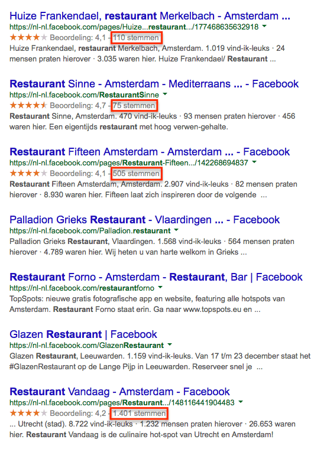
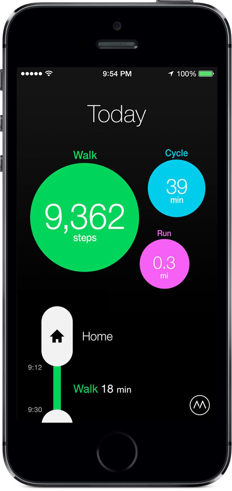
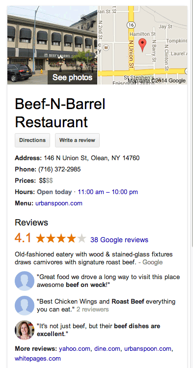
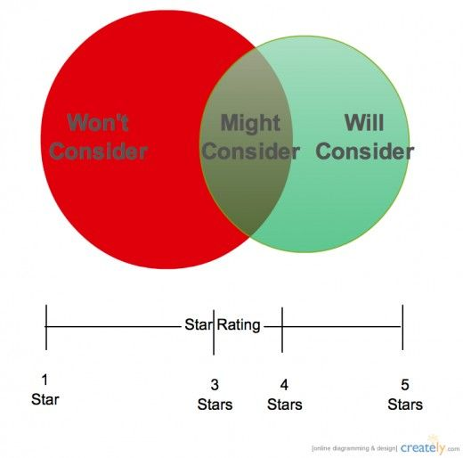

> **Historisch archief.** Deze aflevering verscheen op 28-04-2014 als onderdeel van ReputatieCoaching (2012–2016). De oorspronkelijke tekst is hieronder historisch bewaard. Diensten, contactgegevens, links, tools en adviezen kunnen inmiddels verouderd zijn.



**Transcriptiestatus:** Volledige transcriptie uit het oorspronkelijke archief.

***Historische afbeelding niet beschikbaar: ReputatieCoaching Podcast*
Vorige week beweerde ik dat Facebook posts niet door Google werden geïndexeerd. Dat moet ik vandaag rechtzetten. Ook heb ik deze week een vernieuwingsslag doorgevoerd in mijn “opnamestudio”. Google+ lijkt op een lager pitje gezet en bovendien heeft Google reviews van alle Zagat gebruikers verwijderd. Facebook neemt de app “Moves” over, terwijl Pinterest afgelopen week “begeleid zoeken” introduceerde. Wat dat is, vertel ik je zometeen. En Matt Cutts benadrukt nogmaals letterlijk dat goede content je helpt om hogerop te komen in de zoekresultaten… Zelfs als kleine site!**

Hallo en hartelijk welkom bij deze aflevering van de ReputatieCoaching Podcast. Mijn naam is Eduard de Boer, ook bekend als de ReputatieCoach. Dit is dé podcast die je moet beluisteren als je meer wilt leren over online reputatie en reputatiemanagement en ook als je wilt werken aan je online reputatie en je online vindbaarheid wilt verbeteren. Dit alles kan je helpen om jezelf beter op de online kaart te plaatsen, waardoor je als bedrijf meer business kunt doen.

Als persoon kun je met de diverse tips aan de slag om bijvoorbeeld je online reputatie als instrumentmaker, jongleur, acrobaat, klompenmaker, hotelportier, literatuurcriticus of wat dan ook te verbeteren.

De podcast kun je vinden op [www.reputatiecoaching.nl/74](https://www.reputatiecoaching.nl/74/). Daar vind je niet alleen de volledige tekst, maar ook video’s waar ik het in deze uitzending over heb, alsmede afbeeldingen, links enzovoorts.

Bovendien is de podcast te beluisteren in [iTunes](https://www.reputatiecoaching.nl/itunes) en op [Stitcher](https://www.reputatiecoaching.nl/stitcher). Daar kun je je dus ook abonneren op de wekelijkse podcast. Veel mensen maken daar dankbaar gebruik van en vinden het ideaal om de wekelijkse afleveringen van de podcast op hun gemak te beluisteren, terwijl ze autorijden of in de sportschool aan het trainen zijn.

Ik zei het al in de intro: ik moet iets rechtzetten. Vorige week vertelde ik in [podcast 73](https://www.reputatiecoaching.nl/73/) dat Google geen berichten van Facebook indexeerde. Dat was onjuist. Deze uitlating had ik gebaseerd op het feit dat ik al meer dan een jaar eigenlijk nooit Facebook posts tegenkwam in de zoekresulaten. Verder had ik daar nooit onderzoek naar gedaan.

Maar eerder deze week zocht ik op Google op het trefwoord “bedrijfspanorama” en viel bijna figuurlijk van mijn stoel, door wat ik zag:

[[Historische afbeelding: Facebook posts ranken voorpagina op Google](https://lh4.googleusercontent.com/0_GNiP3Q5vEl9ixtkIGXaks9L-jpzRL6KRecLsSUL24=w550-h400-no)](https://lh4.googleusercontent.com/0_GNiP3Q5vEl9ixtkIGXaks9L-jpzRL6KRecLsSUL24=w550-h400-no)

Ik zag namelijk dat op de eerste pagina met zoekresultaten maar liefst 4 Facebook posts werden vertoond! Op basis waarvan de berichten door Google worden vertoond is niet duidelijk, want ik zag dat lang niet alle berichten waren geïndexeerd. Maar in elk geval blijkt dat Google statusupdates van Facebookpagina’s dus wel indexeert en dat die ook in de zoekresultaten kunnen scoren!

Tot zover de rectificatie ten aanzien van het ranken van Facebook posts in Google.

## Terugblik podcast 73

En over Facebook gesproken: ik hoop dat je het niet vervelend vond, dat ik je [vorige week](https://www.reputatiecoaching.nl/73/) met zoveel nieuws over Facebook heb overladen. Deze week heb ik slechts één Facebook nieuwtje voor je, die ik zo met je deel. Het belangrijkste topic van vorige week is denk ik wel dat Facebook zich verder gaat richten op reviews van lokale bedrijven.

Hoewel ik zelf nog geen reviewsterretjes in de Facebook zoekresultaten op Google heb gezien van bedrijven uit mijn directe omgeving, heb ik ze al wel gezien bij andere bedrijven. Dus neem ik aan dat bij een bepaald minimum aantal reviews of een bepaalde hoeveelheid sociale interactie, Facebook de sterretjes wel met schema.org zal weergeven, waardoor ze in de zoekresultaten op Google zullen opduiken.

Ik ben eens gaan kijken en typte op Google in:

En meteen zag ik een aantal vermeldingen van pagina’s van restaurants, waarbij ook de reviewsterretjes in de zoekresultaten werden vertoond. Het viel me op dat alle Facebookpagina’s die met sterretjes werden vertoond op de eerste pagina op Google, flink wat beoordelingen hadden: 110, 75, 505 en zelfs 1.401. Dus dacht ik dat het aantal beoordelingen mogelijk de trigger was om reviewsterretjes te laten tonen in Google.

[](https://lh3.googleusercontent.com/-lFWtg_xeuZM/U12IwM2UW-I/AAAAAAAAAqI/spCdffZiSmk/w531-h760-no/20140428-review-sterren-fb.png)

Vervolgens ging ik doorbladeren. Ik zag pagina’s met: 55 beoordelingen, 47 beoordelingen, 44, 32, 24, 16 en zelfs slechts 14 beoordelingen, die allemaal met sterretjes in de zoekresultaten stonden.

Maar ik zag ook de pagina van bijvoorbeeld “Restaurant De Brugwachter” hier in Apeldoorn, die 143 beoordelingen had en een gemiddelde score van 4,4 op een schaal van 5, terwijl bij die vermelding geen reviewsterretjes in Google stonden.

Aan de andere kant hadden pagina’s met sterretjes in Google soms een lagere score dan 4,4 dus het kon ook niet aan de score liggen. Ook enig zoekwerk op Google leverde niet echt zinnige informatie op. Dus het is mij in elk geval nog niet duidelijk waardoor je de reviewsterretjes van Facebook in de zoekresultaten op Google vertoond kunt krijgen.

Heb jij een idee? Laat het me weten onderaan de show notes op [www.reputatiecoaching.nl/74](https://www.reputatiecoaching.nl/74/).

Oh, voordat ik overga op de onderwerpen voor vandaag, eerst even een aardige update. Althans, ik vind het leuk. Deze week heb ik een nieuwe mixer binnengekregen om zo nog meer mogelijkheden te hebben voor audio-opnames enzovoorts.

[](https://lh3.googleusercontent.com/-JvMb2IMPdYg/U12KPikp9aI/AAAAAAAAAqs/hN0qpVk4Lbk/s800-no/20140429-XENYX-802.jpg)De vorige setup voor mijn audio had ik alweer meer dan twee jaar geleden gekocht. Dat was toen een complete set van Behringer: een mixer/mengpaneel samen met een microfoon, specifiek gericht op het maken van eenvoudige podcasts. Ik zeg weliswaar “eenvoudig”, maar het was een prima 8-kanaals mixer, waarmee ik toch de audio voor 73 podcasts en tientallen instructievideo’s heb gemaakt.

Maar naast dat mengpaneel had ik ook een aparte microfoonvoorversterker in gebruik, tezamen met een limiter/gate/compressor. Wat dit laatste is, wil ik je nu even niet mee vermoeien, maar het dient ook ervoor om de kwaliteit van de audio te verbeteren bij de opname, om zo minder tijd nodig te hebben bij de nabewerking van de audio.

Inmiddels was de microfoonvoorversterker al een tijdje kapot… Hij deed het nog wel, maar hij had twee standen: niets of volledige voorversterking. Dus moest ik nogal erg met de andere instellingen rommelen om er toch nog audio van enige kwaliteit uit te krijgen. Dat ging goed, maar ik had er een beetje genoeg van.

[](https://lh5.googleusercontent.com/-ZZkSb6sKlls/U12KPlvtpOI/AAAAAAAAAqo/ev9scoCODKI/s800-no/20140429-XENYX-1622USB.jpg)Toen zag ik afgelopen week bij BAX-shop.nl een mooie mixer in de aanbieding en ik kon het niet laten om ’m te kopen. Het was zelfs mogelijk om hem dezelfde avond te laten bezorgen, waar ik natuurlijk gebruikt van maakte. ’s Avonds arriveerde het pakket omstreeks 20:00 uur en kon ik aan de slag. Op YouTube had ik ter voorbereiding al wat HOW-TO video’s bekeken, zodat ik tenminste een beetje thuis was met al die knoppen, want deze is namelijk wel iets groter dan mijn vorige mixer. In de show notes, die je kunt vinden op [www.reputatiecoaching.nl/74](https://www.reputatiecoaching.nl/74/) heb ik zowel een plaatje opgenomen van de vorige mixer, als van de nieuwe mixer. Ik hoef je niet te vragen de verschillen te zoeken…

Dus ik hoop dat je ook als luisteraar nu merkt dat de kwaliteit van de audio is verbeterd. Laat het me weten en post een reactie onderaan de show notes van deze podcast.

Laat ik dan nu overgaan op de onderwerpen voor vandaag…

## Facebook neemt “Moves” over

[](https://lh5.googleusercontent.com/-aHXUaqemfhc/U12MCYThHHI/AAAAAAAAArI/ChGvMKUkeaA/w558-h1180-no/moves-on-iphone5s.jpg)Facebook is druk bezig met overnames. Laatst vertelde ik je in podcast 65 dat [Facebook WhatsApp](https://www.reputatiecoaching.nl/65/) had gekocht en een paar weken geleden kocht Facebook het bedrijf “Oculus VR”. Afgelopen week kwam in het nieuws dat Facebook weer een mobiele app heeft gekocht en dit keer betreft het “Moves”.

“Moves” is een bewegingsapp, waarmee iPhone- en Androidgebruikers hun gangen kunnen bijhouden. Zo kan de app bijhouden hoeveel stappen je per dag doet, hoeveel je hardloopt, hoeveel kilometer je fietst of autorijdt, hoeveel calorieën je verbrandt enzovoorts.

Deze app valt in de categorie van Quantified Self apps. Quantified Self is een stroming die sinds een paar jaar bestaat, waarbij mensen bepaalde karakteristieken uit hun leven gaan meten. Sommigen gaan daar heel ver in. In deze podcast wil ik hier niet teveel op ingaan, maar als je er meer over wilt weten, dan moet je het trefwoord “quantified self” maar eens intypen op Google en zelf op ontdekkingsreis gaan in deze relatief nieuwe wereld.

Terugkomend op de app: die houdt dus niet alleen je lichaamsbeweging bij, maar ook de locaties waar je gedurende de dag bent geweest. Dit kan een partij als Facebook –die overduidelijk een belangrijke speler wil worden in het lokale landschap– een enorme hoeveelheid extra, relevante en bovenal commerciële informatie opleveren.

Als Facebook bijvoorbeeld precies weet waar jij zoal bent geweest, dan weet het bedrijf nóg beter wat jou allemaal aanspreekt, wat je hobby’s zijn enzovoorts. Op basis van die gegevens kan Facebook je dan extreem gepersonaliseerde advertenties voorschotelen, waarvan de kans dat jij er op klikt nog hoger is en Facebook dus weer betaald krijgt voor de klik.

## Google+ op een lager pitje?

[Historische afbeelding: Google+](https://lh3.googleusercontent.com/-4gVxvParT8A/UsCoovPMxyI/AAAAAAAAAQs/K7f8-Ghljyk/s200-no/googleplus-logo-200x200.jpg)
Afgelopen donderdag publiceerde TechCrunch het bericht: “[Google is walking dead](http://techcrunch.com/2014/04/24/google-is-walking-dead/)”. In dit artikel wordt beschreven dat de topman van Google+, Vic Gundotra, het bedrijf na acht jaar verlaat. Volgens diverse bronnen zou het bedrijf het product Google+ minder zien als een product, maar meer als een platform en zouden investeringen en ontwikkelingen worden teruggeschroefd. Ook zou het bedrijf de 1.000 tot 1.200 mensen die aan Google+ werken, herindelen in de organisatie.

Maar het bedrijf zelf ontkent deze berichten. “Het nieuws van vandaag heeft geen invloed op onze Google+ strategie – we hebben een ontzettend getalenteerd team, dat door zal gaan met het maken van fantastische gebruikerservaringen op Google+, Hangouts en Photos”.

NU.nl nam dit verhaal snel over in het artikel “[Google zet sociaal netwerk Google+ op laag pitje](http://www.nu.nl/tech/3760141/google-zet-sociaal-netwerk-google-laag-pitje-.html)”.

Hoewel sommige uitlatingen van kopstukken van Google tijdens diverse shows en presentaties in de afgelopen maanden nu iets meer context en achtergrond krijgen, verwacht ik zelf niet dat Google het sociale netwerk helemaal de das om zal doen.

Tenzij het bedrijf inmiddels met behulp van telepathie in je hoofd kan kijken om te weten te komen wat je beweegt bij je zoekpogingen, heeft het een indruk nodig wat de mensen op Internet bezighoudt. En dat is meer dan alleen datgene waar men naar op zoek is in de zoekmachines. Dat is dus ook wat mensen delen op Google+ en waar ze over schrijven.

Gecombineerd met nieuwe diensten die Google recentelijk heeft geïntroduceerd op het lokale vlak, zoals bijvoorbeeld “Indoor Maps” en “Google Maps Views”, lijkt het voor de hand te liggen dat het bedrijf alleen maar nóg zwaarder wil inzetten op… Raad eens… Het lokale landschap!

Volgens mij is het reden temeer om je acties voor het verzamelen van reviews verder op te schalen: dus nóg actiever reviews gaan verzamelen. Wees creatief en proactief! Druk kaartjes die je mensen in je winkel of praktijk meegeeft, waarop een link staat naar een pagina op je site, waar je mensen de mogelijkheid biedt om rechtstreeks naar diverse reviewsites te gaan, waar ze dan een review kunnen posten voor jouw bedrijf!

Zoals altijd is mijn advies om niet op één paard te wedden, maar je reviews te spreiden over meerdere sites. Zo moet je dus niet alleen reviews verzamelen op Google+, maar ook op sites als:

```
  * Facebook
  * Yelp
  * Allebedrijvenin.nl
  * Diverse hyperlokale reviewsites
  * Diverse branchespeficieke reviewsites
  * Je eigen site
```

Voor een opdrachtgever ben ik op dit moment bezig een verfrissende en vernieuwende reviewstrategie op te zetten, maar daar kan ik nu nog even niet verder over uitweiden. Zodra één en ander staat, zal ik de strategie met je delen.

## Google dropt reviews van “Een Zagat gebruiker”

Over reviews gesproken… [In september 2011 kocht Google met veel tamtam het bedrijf Zagat](http://googleblog.blogspot.nl/2011/09/google-just-got-zagat-rated.html), dat bekend stond om haar bijzondere reviewsysteem voor restaurants. De acquisitie van dat bedrijf kostte toentertijd US$125 miljoen.

Google heeft twee jaar lang geprobeerd dit complexe 30-punten systeem om te buigen en te implementeren voor alle lokale bedrijven, tot en met kappers, autohandelaren, advocaten en bloemisten aan toe. Als mensen vóór die tijd een review hadden achtergelaten op Zagat, verscheen op de zakelijke Google+ pagina van het desbetreffende bedrijf als schrijver van de review, de omschrijving “Een Zagat gebruiker”.

Dat werd geen succes en op 31 juli 2013 verdween de Zagat score van Google+ en kwam de oude, vertrouwde 5-sterren beoordeling weer terug. Bij alle bedrijven die toen vijf of meer reviews hadden, werden toen opeens weer de sterretjes vertoond, zowel in de lokale resultaten, als op de zakelijke Google+ pagina.

Afgelopen week postte Jade Wang van Google het volgende bericht in de Google Product Forums:

Remember, verified business owners can respond to reviews or report inappropriate reviews.

Dat is nu dus vijf dagen geleden… Ik heb nog gezocht, maar hoewel ik in de zoekresultaten nog wel pagina’s tegenkwam, waar in het verleden ooit “Een Zagat gebruiker” stond, was op geen enkele van die pagina’s meer een review van een vroegere Zagat gebruiker te vinden…

Met andere woorden: stel je had als restaurant voorheen zes reviews, waarvan twee op Zagat, dan werd jouw bedrijf in de lokale resultaten en op Google+ vertoond **met** sterretjes. En nu ben je dan opeens je sterrenvermelding kwijt! Dat is stevig balen! Want een verandering in reviews hoeft niet per se alleen maar het niet meer vertonen van de sterretjes tot gevolg te hebben, maar het kan –zoals Jade Wang al schrijft– ook gevolgen hebben voor je positie in de zoekresultaten!

Jade zegt ook dat andere reviews gewoon blijven staan. Maar let op: in het verleden was het ook mogelijk anoniem reviews te posten. Daar is toen ook veel misbruik van gemaakt: bedrijven kochten reviews op obscure sites en opeens leken ze het heel goed te doen. Soms zie je nog wel eens van die pagina’s: een typisch Nederlands bedrijfje of winkeltje ergens in een achteraf plaatsje, dat drie reviews heeft… Maar alledrie in het Engels en alledrie van simpelweg: “Een Google gebruiker”.

Nu zeg ik niet dat alle reviews van “Een Google gebruiker” gekocht of anderszins illegaal verkregen zijn. Dat absoluut niet! Sterker nog, ik denk dat het meerendeel wel legitiem is. Maar omdat er voorheen zoveel misbruik van is gemaakt en Google continu bezig is de gebruikerservaring te verbeteren, kan het zomaar zijn dat in de toekomst ook de anonieme reviews van “Een Google gebruiker” plotsklaps verdwijnen! En als jij voor jouw bedrijf nu vijf of zes reviews hebt, waarvan minstens twee van “Een Google gebruiker”, dan ben je op dat moment de pisang!

Dus zeker als dit het geval is en je dus één of meer van dit soort reviews bij je zakelijke Google+ vermelding hebt, dan adviseer ik je om zo snel mogelijk een aantal hedendaagse reviews te krijgen, van Google+ gebruikers met een naam en bij voorkeur ook een foto.

En dit soort berichten moet voor jou toch echt een signaal zijn om het verzamelen van je reviews te verspreiden over diverse sites, zoals ik al eerder zei.

## Google vertoont volledige reviews in knowledge graph panel

En ik ga nog even door over reviews in relatie tot Google… In de USA is Google op dit moment aan het experimenteren met de [vermelding van volledige reviews in het knowledge graph panel](http://www.searchenginejournal.com/google-reportedly-displaying-customer-reviews-knowledge-graph-local-searches/103471/), die je vaak aan de zijkant van de zoekresultaten ziet.

In de show notes op [www.reputatiecoaching.nl/74](https://www.reputatiecoaching.nl/74/), zie je hier een voorbeeld van. Zoals ik al zei: het lijkt erop, alsof dit op dit moment alleen in de USA actief is, want in Nederland heb ik nog geen bedrijf kunnen vinden, waarbij ik een dergelijke vermelding met reviews heb kunnen vinden.

[](https://lh6.googleusercontent.com/-d8XiEdgyok8/U12IwkmUQYI/AAAAAAAAAqM/iBmxKw5tZFs/w393-h749-no/Reviews-in-knowledge-graph-panel.png)

Heb jij er wel eentje gespot? Laat het me weten en post de URL onderaan de show notes!

## Zijn jongere consumenten toleranter t.a.v. negatieve reviews?

En dan nu het laatste topic over reviews. Op het weblog van Mike Blumenthal is een artikel te lezen met als titel “[Are Younger Consumers More Tolerant Of Bad Reviews? Or Do They Just Understand Them Better?](http://blumenthals.com/blog/2014/04/24/are-younger-consumers-more-tolerant-of-bad-reviews-or-do-they-just-understand-them-better/)”.

Dit is een interessant artikel, want het gaat over een onderzoek dat is gedaan naar de perceptie van negatieve reviews in verschillende leeftijdsgroepen:

[](https://lh6.googleusercontent.com/-L8kKFxtFIvs/U12IwGN0pzI/AAAAAAAAAqA/rNqbIg_fWfU/w520-h514-no/How-Many-Stars-to-Consider-a-Business-520x514.jpg)

Uit het onderzoek kwam duidelijk naar voren dat bedrijven met drie sterren niet meteen werden verworpen en dat bedrijven met een 4-sterren beoordeling echt snel als positief werden gezien. Dat lijkt ook wel logisch.

Maar grappig genoeg legden mensen in de leeftijdsgroep van 18 tot 24 jaar de lat minder hoog, om een bedrijf te verwerpen op basis van slechte reviews. Deze groep was toleranter jegens bedrijven met een beoordeling van 2,5 tot 3 sterren dan de andere geïnterviewden. Verder bleek dat mensen boven de 55 jaar eerder een 4-sterren beoordeling eiste om überhaupt maar te overwegen zaken met het bedrijf te doen. Mensen lijken dus kritischer te worden, naarmate ze ouder worden.

## Pinterest introduceert “Begeleid zoeken”

Dan over op Pinterest, want dat bedrijf kwam ook afgelopen week in het nieuws met een nieuwtje, genaamd: “[Begeleid zoeken](http://about.pinterest.com/nl#guidedsearch)”. Op dit moment is die nieuwe feature alleen in het Engels beschikbaar, maar Pinterest zegt dit te willen uitrollen voor alle talen die het op de site ondersteunt. In de show notes heb ik twee video’s van Pinterest over “Begeleid zoeken” opgenomen:

Aan het begin van een begeleide zoektocht kun je kiezen uit “pins”, “borden” en “pinners”. Na de initiële keuze wordt een scrollbalk getoond met additionele zoektermen, waar je dan op kunt klikken. Zo kan de zoekterm “planten” leiden tot de suggesties “in de schaduw”, “in potten” en “om muggen weg te houden”.

Een dergelijke feature is natuurlijk niet wereldschokkend, maar het kan Pinterest zo wel toegankelijker maken voor nieuwe gebruikers die op zoek zijn naar bepaalde foto’s.

## Matt Cutts: “Hoe kunnen kleine sites populair worden?”

Soms lijkt het er voor middelgrote bedrijven en helemaal voor kleine zelfstandigen op dat het onmogelijk is om op te boksen tegen de “grote jongens” en hoger te scoren met de content. Want grote bedrijven hebben vaak veel meer resources om online content te publiceren, waarmee de achterstand voor de kleintjes alleen maar groter dreigt te worden.

Dit is ook het onderwerp dat Matt Cutts in de video van deze week behandelt. De vraag die aan hem wordt gesteld, is:

En het is echt niet zo dat kleine bedrijven met superieure content niet boven de grote jongens kunnen scoren. Want dit is juist de wijze waarop veel kleine sites dikwijls grote sites werden. Ooit was Facebook klein, was AltaVista klein en was ook Google klein. Maar doordat deze bedrijven zich concentreerden op gebruikerservaring en meer waarde leverden dan de concurrenten, kregen ze meer aandacht en groeiden ze.

Ongeacht de branche waarin je operationeel bent, geldt dat als jij het met je bedrijf constant beter doet dan je concurrenten, je in de loop van de tijd kunt verwachten dat jouw site beter gaat presteren. Natuurlijk is het als eenpitter een stuk moeilijker om te concurreren tegen een bedrijf dat 200 mensen dienst heeft voor haar contentmarketing.

Dus concentreer je op een hele smalle niche en belicht deze extreem goed, vanuit alle perspectieven en invalshoeken. Dan kun je van die smalle niche verder uitbouwen en verbreden, waardoor je coverage groter wordt.

Op die manier kan het gebeuren dat je als kleine club hier druk mee aan het werk bent, en je dan opeens tot de conclusie komt dat jóuw site één van de grote jongens is geworden, waar iedereen naartoe komt. En dan zijn er ook weer kleine websites die gefrustreerd zijn, omdat zij moeten opboksen tegen de grote jongens, waaronder jouw bedrijf!

Matt sluit af met de conclusie dat het verleden keer op keer heeft laten zien dat kleine bedrijven groot kunnen worden, door zich te blijven concentreren op datgene waar ze voor staan. Dus: blijf doorgaan met het produceren van goede content.

Zijn laatste woorden in deze video zijn:

Met deze wijze woorden sluit ik ook deze podcast dan weer af.

Als je de podcast leuk vindt en je wilt nog meer op de hooge blijven, volg me dan ook op Twitter, via [@reputatiecoach1](https://twitter.com/reputatiecoach1).

Als je wat hebt aan alle informatie die ik met je deel, dan hoor of lees ik dat graag. Help mij met het verder verbeteren en promoten van deze podcast. Surf dan naar [iTunes](https://www.reputatiecoaching.nl/itunes) of [Stitcher](https://www.reputatiecoaching.nl/stitcher), geef de podcast een sterrenbeoordeling en geef ook je reactie. Door de podcast te beoordelen op iTunes en/of Stitcher breng je de podcast namelijk onder de aandacht van een breder publiek.

Je kunt me ook verder helpen, door de podcast aan te bevelen bij vrienden of collega’s, waarvan je denkt dat ze er hun voordeel mee kunnen doen, of door ’m te delen op Twitter, like’n en delen op Facebook of een “+1” te geven op Google+.

En vergeet niet: ik ben hier om je te helpen! Als je een vraag of een probleem hebt met betrekking tot je online reputatie of de vindbaarheid van je website, kun je een mailtje sturen naar [podcast@reputatiecoaching.nl](mailto:podcast@reputatiecoaching.nl).

Als je dat te lastig vindt, of als je de podcast beluistert terwijl je in de auto zit en je hebt acuut een vraag, spreek dan een boodschap in op de ReputatieCoaching Hotline, op nummer: 084 - 883 15 56. Mogelijk behandel ik je vraag of probleem dan in een artikel of in de podcast.

En je kunt ook rechtstreeks op de website een voicemail achterlaten, door op de tab aan de rechterkant van elke pagina te klikken, en je bericht in te spreken. Dit was [ReputatieCoaching Podcast aflevering 74](https://www.reputatiecoaching.nl/74/) en mijn naam is [Eduard de Boer](http://nl.linkedin.com/in/eduarddeboer/nl).

Volg het advies van Matt Cutts waar ik het zojuist over had: blijf goede content produceren, want uiteindelijk is dat de beste manier om hogerop te komen in de zoekresultaten.

Ik wens je daarom de komende week weer succes met het produceren van content en het werken aan je reputatie, zodat je nu meteen en in de toekomst je reputatie voor jou kunt laten werken!

Tot volgende week!

Doei!

Links naar content die in deze podcast aan bod komt:

```
  * [ReputatieCoaching Podcast in iTunes](https://www.reputatiecoaching.nl/itunes)
  * [ReputatieCoaching Podcast op Stitcher](https://www.reputatiecoaching.nl/stitcher)
  * [ReputatieCoaching Podcast RSS-feed](https://feeds.reputatiecoaching.nl/ReputatieCoachingPodcast)
  * [Moves App](http://www.moves-app.com) voor iOS en Android
  * “[Google just got ZAGAT Rated!](http://googleblog.blogspot.nl/2011/09/google-just-got-zagat-rated.html)” (Official Google Blog, 8 september 2011)
  * “[How Google Has Completely Botched Zagat](http://www.businessweek.com/articles/2013-07-31/how-google-has-completely-botched-zagat)” (BusinessWeek, 31 juli 2013)
  * “[Facebook koopt bewegingsapp Moves](https://www.telegraaf.nl/digitaal/22547248/__Facebook_koopt_bewegingsapp_Moves__.html)” (Telegraaf, 24 april 2014)
  * “[Are Younger Consumers More Tolerant Of Bad Reviews? Or Do They Just Understand Them Better?](http://blumenthals.com/blog/2014/04/24/are-younger-consumers-more-tolerant-of-bad-reviews-or-do-they-just-understand-them-better/)” (Blumenthals.com, 24 april 2014)
  * “[Google zet sociaal netwerk Google+ op laag pitje](http://www.nu.nl/tech/3760141/google-zet-sociaal-netwerk-google-laag-pitje-.html)” (NU.nl, 25 april 2014)
  * “[Google Is Reportedly Displaying Customer Reviews In Knowledge Graph For Local Searches](http://www.searchenginejournal.com/google-reportedly-displaying-customer-reviews-knowledge-graph-local-searches/103471/)” (25 april 2014)
```
