> **Historisch archief.** Deze aflevering verscheen op 5-05-2014 als onderdeel van ReputatieCoaching (2012–2016). De oorspronkelijke tekst is hieronder historisch bewaard. Diensten, contactgegevens, links, tools en adviezen kunnen inmiddels verouderd zijn.



**Transcriptiestatus:** Volledige transcriptie uit het oorspronkelijke archief.

***Historische afbeelding niet beschikbaar: ReputatieCoaching Podcast*
Laatst werd mijn advies gevraagd bij een slechte review. Waarom? Dat hoor je zo! Weet je overigens wat de populairste winkelketen is op Facebook? Blijf luisteren, als je het nog niet weet. Verder heb ik nieuws over het voortbestaan van Google+ en nog meer nieuws van Google. Zo heb ik een paar screenshots van hoe de carousel er in Nederland uit kan komen te zien en hoe Google in de lokale resultaten op mobiele apparaten prijzen vertoont. En ik laat je ook zien dat het belabberd is gesteld met hoe Nederlandse supermarktketens zich presenteren op Google+. Als dit je aanspreekt, blijf dan luisteren!**

Hallo en hartelijk welkom bij deze aflevering van de ReputatieCoaching Podcast. Mijn naam is Eduard de Boer, ook bekend als de ReputatieCoach. Dit is dé podcast die je moet beluisteren als je meer wilt leren over online reputatie en reputatiemanagement en ook als je wilt werken aan je online reputatie en je online vindbaarheid wilt verbeteren. Dit alles kan je helpen om jezelf beter op de online kaart te plaatsen, waardoor je als bedrijf meer business kunt doen. Als persoon kun je met de diverse tips ook aan de slag om online reputatie te verbeteren.

De podcast kun je vinden op [www.reputatiecoaching.nl/75](https://www.reputatiecoaching.nl/75/). Daar vind je niet alleen de tekst, maar ook video’s waar ik het in deze uitzending over heb, alsmede afbeeldingen, links enzovoorts. Bovendien is de podcast te beluisteren in [iTunes](https://www.reputatiecoaching.nl/itunes) en op [Stitcher](https://www.reputatiecoaching.nl/stitcher). Daar kun je je dus ook abonneren op de wekelijkse podcast. Veel mensen vinden het ideaal om de wekelijkse afleveringen van de podcast op hun gemak te beluisteren, terwijl ze autorijden.

## Terugblik podcast 74

Even een korte terugblik naar de [podcast van vorige week](https://www.reputatiecoaching.nl/74/). Wat vind ik het belangrijkste dat je daaruit kunt leren? Niet dat Facebook posts op fanpagina’s in de zoekresultaten kunnen worden gevonden en ook niet dat Google+ mogelijk op een lager pitje wordt gezet. Als ik zo de transcriptie nog eens nalees, dan vind ik het risico dat een aantal anonieme reviews (in dit geval die van Zagat gebruikers) zo maar van je zakelijke profiel kunnen verdwijnen, door een simpele actie van Google.

Vergeet niet, dat de week ervoor, ik vertelde dat de reviews op Yahoo! Local verdwijnen, zodra iemand een review heeft gepost op Yelp, omdat die twee partijen samenwerken.

Dus richt je erop om op zoveel mogelijk review sites beoordelingen te krijgen. Richt je eerst op de grote review sites die op de eerste twee resultaatpagina’s worden vertoond als je je type bedrijf zoekt in je woonplaats, dus bijvoorbeeld als je zoekt op “herenkapper arnhem”.

En binnen de review sites die daar worden vertoond, raad ik je aan het eerst reviews te krijgen op de sites die met sterretjes worden vertoond in de zoekresultaten op Google. Waarom? Nou, doordat die sterretjes in de resultaten worden vertoond, zijn mensen sneller geneigd erop te klikken. Dus als jouw pagina bovenaan staat in een reviewsite, die sterretjes vertoont in de zoekresultaten, dan kan je dit een leuke hoeveelheid extra verkeer opleveren.

Laat ik dan nu overgaan op de onderwerpen voor vandaag…

## Extreem slechte review? Wat dan?

Ook al doe je als bedrijf nog zo je best, je kunt heus wel eens een slechte review krijgen van een klant of een patiënt. In podcast 67 vertelde ik je dat [negatieve reviews](https://www.reputatiecoaching.nl/67/) ook best positief kunnen zijn of kunnen uitpakken:

[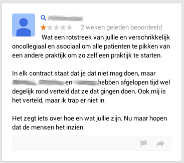](https://lh6.googleusercontent.com/-Owewntkok6g/U2JFI_VoF2I/AAAAAAAAAtw/y044ahi8ilU/w367-h326-no/20140505-slechte-review-1.png)

Echter, een tijdje geleden werd mijn hulp gevraagd bij een recensie op Google+, die ik hier met je wil delen.

Deze review werd met één ster gepost op de Google+ pagina van een tandarts en omwille van de privacy heb ik de namen die in de review werden genoemd, verwijderd. Het lijkt erop alsof het hier een soort van vete betreft. En dit kan jou ook overkomen! Wat moet je dan doen?

Je moet weten dat Google in principe niets doet aan de reviews: het is de mening van een klant of patiënt en die zegt (als het goed is) iets over jouw bedrijf, je dienstverlening of je producten…

En de enige die een review kan verwijderen, is degene die ’m ook heeft gepost. Dat kun je simpelweg doen, door in te loggen op Google+ en dan in het menu klikken op “Reviews”, de meest rechtse keuze.

Daar aangekomen zie je een overzicht van alle reviews die je aan bedrijven hebt gegeven op Google+. Je hebt daar de volgende vier mogelijkheden:

```
  * Review delen
  * Review aanpassen
  * Een foto toevoegen
  * Review verwijderen
```

Ik moet je overigens eerlijk zeggen dat ik niet eens meer wist dat je een foto kon toevoegen bij een review, maar het bleek dat ik dat al een paar keer onbewust had gedaan en zelfs één keer ook een video bij een review van de Hertog-Jan Brouwerij in Arcen.

Maar terug naar deze extreem negatieve review. In een geval als deze ligt het er wel heel dik bovenop, dat dit niet een gewone review is, maar dat dit “bericht” meer uit haat lijkt te zijn gepost.

Dus wat je dan kunt doen, is op het vlaggetje onderaan de recensie klikken om de review te rapporteren. Dan verschijnt het scherm, dat je in de show notes op [www.reputatiecoaching.nl/75](https://www.reputatiecoaching.nl/75/) kunt zien. Hierin is onder andere te lezen dat Google misbruik van haar services heel serieus neemt:

[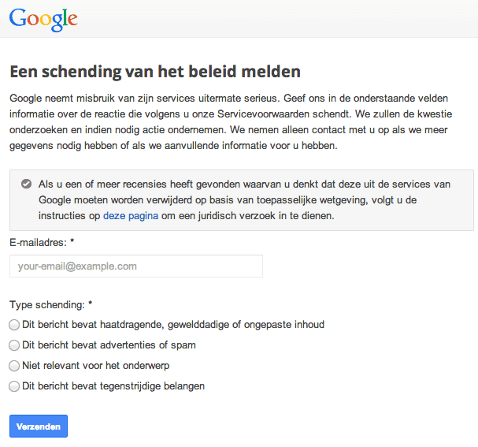](https://lh5.googleusercontent.com/-xEa9t8APgZs/U2JFHi284oI/AAAAAAAAAtc/lyd_clVzpis/w607-h567-no/20140505-review-melden.png)Je moet dan je e-mailadres geven en kiezen uit één van de volgende vier mogelijkheden om de schending van de Servicevoorwaarden te typeren:

```
  * Dit bericht bevat haatdragende, gewelddadige of ongepaste inhoud
  * Dit bericht bevat advertenties of spam
  * Niet relevant voor het onderwerp
  * Dit bericht bevat tegenstrijdige belangen
```

Ik adviseer je in zo’n geval dus te kiezen voor het eerste: “Dit bericht bevat haatdragende, gewelddadige of ongepaste inhoud”. Dan moet je gewoon afwachten en zien waartoe deze actie leidt en of Google nog met een terugkoppeling komt.

Ik moet trouwens wel zeggen dat ik steeds vaker terugkoppelingen krijg van Google. Zo kreeg ik vorige week ook feedback op een wijziging die ik heb aangemeld in Google Map Maker. In de mail stond dat Google het verder ging onderzoeken en er nog op terugkomt.

Onthoud deze tip, voor het geval dit jou een keertje overkomt: zo’n haatreview. Bedenk wel, dat je een “normale” negatieve review op deze manier *niet* kunt aanvechten. Het omgaan met negatieve reviews is weer een heel ander verhaal.

Tot zover over het melden van haatreviews.

## Wat is de populairste winkelketen op Facebook? Lidl!

Uit een onderzoek van het social mediabureau Socialbakers is naar voren gekomen dat Lidl in Europa de populairste retailer is op Facebook. Het bedrijf heeft namelijk meer dan 10 miljoen volgers, waarvan maar liefst 360.000 uit Nederland!

Dit las ik in een [artikel op Emerce.nl](http://www.emerce.nl/nieuws/lidl-populairste-winkelketen-facebook). In het artikel stond ook een leuke infographic met aantallen volgers of fans van andere grote Europese supermarktketens, evenals het aantal interacties en de activiteit in customer care. Deze infographic heb ik in de show notes opgenomen:

[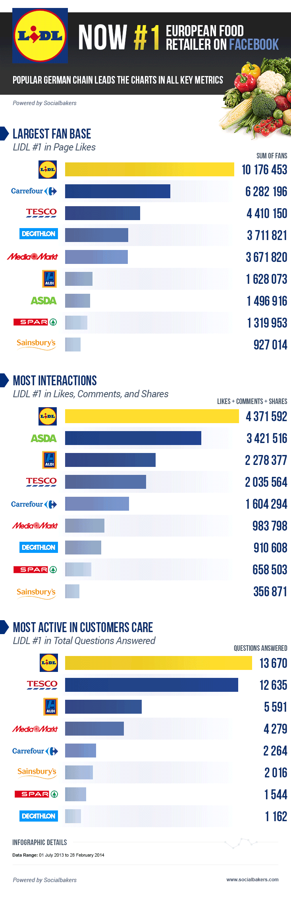](https://lh3.googleusercontent.com/-dIJ6828Z1P4/U2JFH1I_9GI/AAAAAAAAAtU/OlbPvd1NOAc/w733/20140505-infographic-Lidl.png)

## Waar is Lidl op Google+?

Wat ik dan weer grappig vind, is hoe een bedrijf als Lidl, dat prominent op de eerste plaats staat op Facebook, Google+ helemaal links laat liggen… Een korte zoektocht op Google+ naar Lidl als brand, oftewel “merk” leverde niets op. Ik typte de voor de hand liggende URL in, te weten:

En ik kreeg een 404-error pagina:

[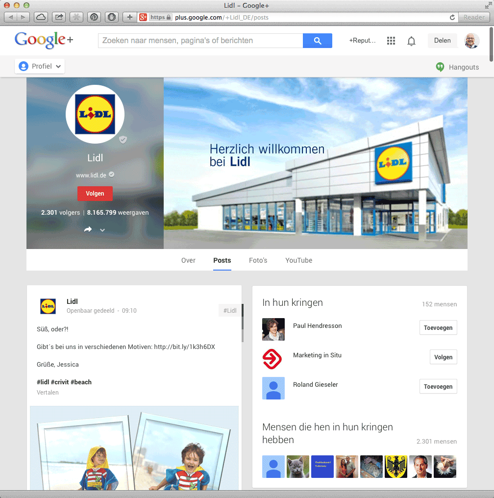](https://lh4.googleusercontent.com/-Bh3DY9VUeUg/U2JFBqX6FBI/AAAAAAAAAsU/AbNHoZk3eBY/w653-h422-no/20140505-gplus-lidl.png)

Dat wil dus zeggen dat Lidl haar merk helemaal niet op Google heeft geclaimd. Dus ging ik verder en ging uitzoeken hoe Lidl wellicht actief was met lokale pagina’s. Een eerste voor de hand liggende zoekopdracht was:

Dat toonde een Lidl in Apeldoorn op de “D”-positie, de vierde plaats dus:

[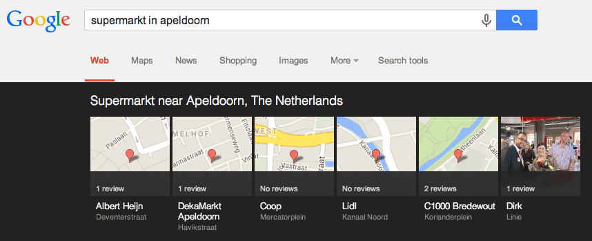](https://lh6.googleusercontent.com/-eA5av9tlGGk/U2JFJQ0hfnI/AAAAAAAAAts/HMP7n2YfHRA/w526-h470-no/20140505-supermarkt-Apeldoorn.png)

En de desbetreffende Google+ pagina bevatte totaal geen data, waaruit ik kon opmaken dat Lidl ook maar enigszins actief zou kunnen zijn op Google+:

[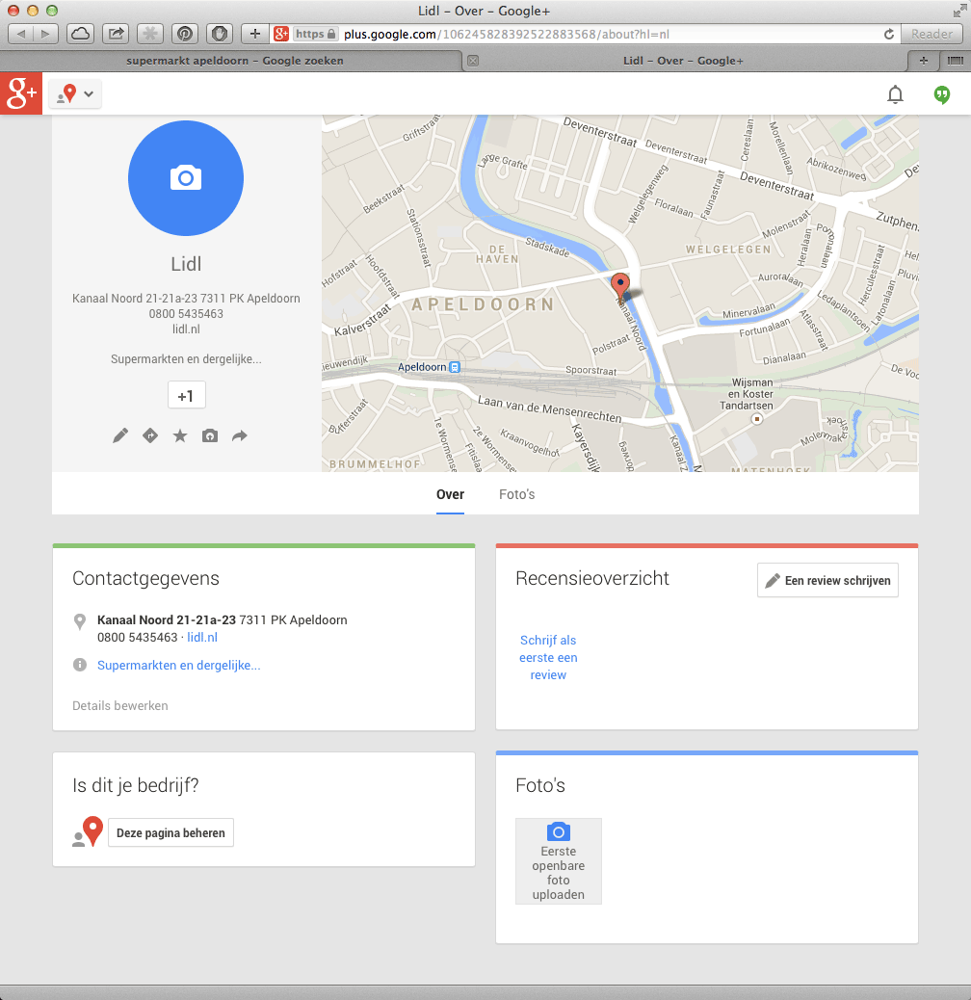](https://lh5.googleusercontent.com/-f2LW0mMEhfs/U2JFAYU4zFI/AAAAAAAAAsY/TzJLADKTpR0/w975-h1004-no/20140505-gplus-lidl-Apeldoorn.png)

De pagina was niet geclaimd, niet geverifieerd en ook niet aan een website gekoppeld. Bovendien doet Lidl ook niet aan reviewmanagement, want er waren nog 0 reviews. Hetzelfde gold voor de andere twee Lidl-vestigingen in Apeldoorn.

Maar gelukkig gold dit niet alleen voor Apeldoorn. Het blijkt dat Lidl Google+ totaal links laat liggen. Want ik heb even snel tientallen zakelijke Google+ pagina’s van de Lidl gescand op enige activiteit en wat denk je: NERGENS! Lidl doet echt helemaal niets met Google+! Ongelofelijk!

En als een bedrijf zo’n platform totaal negeert, dan kan datgene ontstaan, wat je kunt zien in de screenshot op [www.reputatiecoaching.nl/75](https://www.reputatiecoaching.nl/75/):

[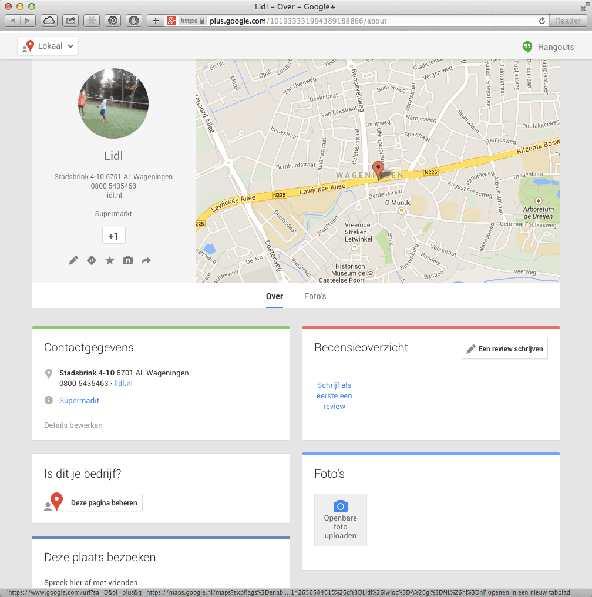](https://lh6.googleusercontent.com/-Skhmhc4qLTc/U2JFAj5b8UI/AAAAAAAAAsQ/OYtSdbnAjqQ/w996-h1004-no/20140505-gplus-lidl-Wageningen.png)

Daarop zie je een de zakelijke Google+ pagina van de Lidl in Wageningen. Op die pagina is het zelfs zo erg, dat de ronde “profielfoto”, waar je normaal bij een bedrijf het logo verwacht, een foto bevat van een paar voetballende kinderen.

Als je dit soort verwaarlozing aantreft, dan raakt iemand als ik toch wel erg gefascineerd en zoek ik verder. Lidl is van origine Duits, dus ging ik eens kijken hoe onze Oosterburen de Lidl presenteren op Google+. En daar werd ik aangenaam verrast, want die Google+ pagina is ontzettend actief! In de show notes heb ik ook een screenshot opgenomen van plus.google.com/+Lidl\_DE:

[](https://lh6.googleusercontent.com/-R6jz6IJZdXg/U2JFEvmnNII/AAAAAAAAAs4/e7hIyrJWdek/w996-h1004-no/20140505-gplus-lidl_DE.png)

Op de pagina zag ik ook dat daar de afgelopen week nog berichten waren gepost. Ik wil niet op alle slakken zout leggen, maar die pagina zou het nog beter kunnen doen, als men er foto’s en video’s zou posten. Maar goed, het feit dat de pagina een vanity URL heeft, en ook nog eens geclaimd en geverifieerd èn recente berichten bevat, wil wel wat zeggen!

Terug naar de Nederlandse Lidl… Op de website [www.lidl.nl](http://www.lidl.nl) heeft Lidl –zoals vrijwel alle grote bedrijven– een “filiaalzoeker”. Daarmee kun je snel een filiaal bij jou in de buurt vinden, op basis van postcode, plaatsnaam enzovoorts. En de filiaalzoeker toont alle gegevens van het desbetreffende filiaal. Zo heb ik eventjes de dichtstbijzijnde Lidl vestiging bij mij in de buurt opgezocht. De details die erop worden vertoond, zijn heel volledig:

[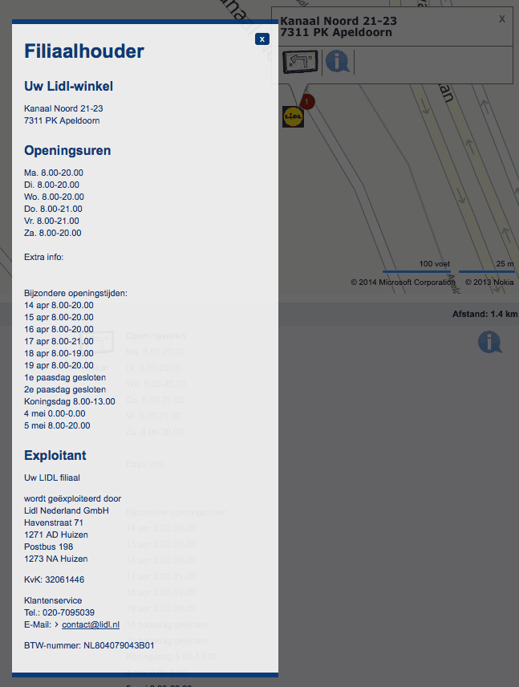](https://lh5.googleusercontent.com/-g1wtJVxooYU/U2JFF9XQBBI/AAAAAAAAAtE/_rggw59UKJ0/w647-h856-no/20140505-lidl-filiaalzoeker.png)

Zo staan er de adresgegevens en de openingstijden op, evenals de openingstijden op feestdagen en andere gegevens.

Zal ik je verklappen hoe Lidl opeens met alle vestigingen veel hoger in de lokale zoekresultaten zou kunnen scoren in heel Nederland (en de rest van Europa)? Wil je dat weten? Het is zo simpel, helemaal voor zo’n groot bedrijf als Lidl met zoveel vestigingen. Ik zal het voor je samenvatten voor de Nederlandse Lidl organisatie:

```
  * Elke vestiging moet een eigen vestigingspagina krijgen op de website www.lidl.nl met alle adresgegevens
  * Op die pagina moet een link naar de corresponderende zakelijke Google+ pagina staan
  * De zakelijke Google+ pagina linkt terug naar de besbetreffende vestigingspagina op www.lidl.nl
  * Alle gegevens, zoals adres, telefoon, openingstijden enz. moeten consistent zijn op deze beide pagina’s
  * De gegevens moeten consistent zijn met alle andere bedrijfsvermeldingen op Internet
```

Laat ik eerlijk zijn: dit is toch niet complex? En dit klinkt toch ook niet als “onmogelijk om te doen”? Maar waarom doen bedrijven dit dan niet? Dat vraag ik me dan af. Want hoewel ik er nog niet ben ingedoken, zal ik je vertellen dat ik mijn schoenen opeet, als Albert Heijn, Dirk of C1000 het wèl goed voor elkaar zou hebben op Google+.

Dit alles overwegende is het hele lokale overzicht voor “supermarkt Apeldoorn” een bij elkaar geraapt zooitje, waarbij de posities niet echt worden bepaald door gedegen inzicht en gerichte actie voor het creëren van presence in de lokale zoekresultaten.

Als Albert Heijn, Dekamarkt, Coop, Lidl, C1000 of Dirk hulp willen voor het beter ranken in de lokale zoekresultaten, dan mogen ze me natuurlijk altijd vragen. Maar dan loop ik tegen een probleempje aan: er is slechts plaats voor één bedrijf aan de top. Dus wie wil?

## Google verandert zoekmogelijkheden en weergave lokale resultaten op mobiel

In de USA is Google ook weer aan het experimenteren met het vertonen van de lokale zoekresultaten op mobiele apparaten. Bij zoekpogingen naar hotels, restaurants en andere entertainment locaties worden nu prijzen vertoond en kun je ook zoeken op basis van prijs, beoordeling, openingstijden enzovoorts.

In de show notes heb ik een voorbeeld opgenomen, hoe de mobiele pagina met de lokale resultaten er nu uitziet in Noord-Amerika:

[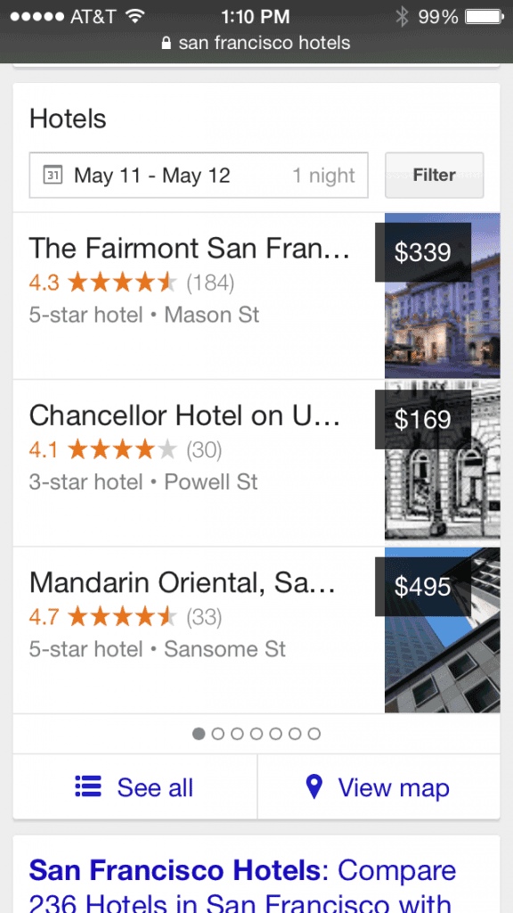](https://lh3.googleusercontent.com/-RhjFrWNDSYE/U2JFJtmqUMI/AAAAAAAAAt0/WBDptVKr_4o/w565-h1004-no/20140505-new-local-USA.png)

De vertoning in de lokale resultaten lijkt nu iets meer op de carousel, zoals die in Noord-Amerika al geruime tijd wordt vertoond op desktops. Helaas is die carousel bij ons nog niet zichtbaar en ik ben benieuwd hoelang het nog zal duren, tot die hier in Nederland ook zichtbaar wordt.

Je kunt het verschijnen van de carousel echter wel “activeren”, door een paar extra argumenten aan je zoekpoging mee te geven in de URL. Door het toevoegen van de parameters:

Wordt de carousel wel vertoond. In de show notes heb ik een voorbeeld opgenomen hoe het er dan uit komt te zien, als je zoekt op “hotel in apeldoorn”:

[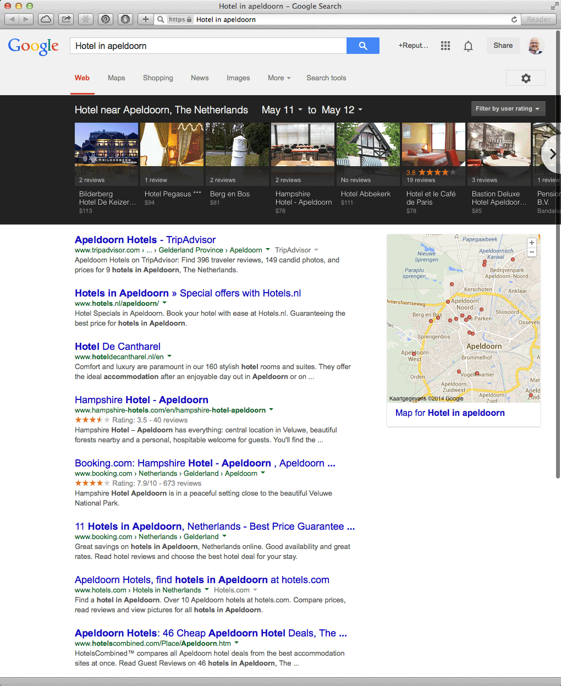](https://lh5.googleusercontent.com/-yZxCTKselKA/U2JFCe_m6gI/AAAAAAAAAsk/yVIm35pQUwE/w821-h1004-no/20140505-hotel-in-apeldoorn.png)

In het voorbeeld dat ik heb opgenomen, kun je zien dat het visuele aspect een grotere rol gaat spelen, zodra de carousel ook naar Nederland komt. Alle hotels in Apeldoorn die in de lokale resultaten worden vertoond hebben dit aardig op orde: er worden tenminste foto’s vertoond. Dit is anders als je zoekt op “ijssalon in apeldoorn”:

[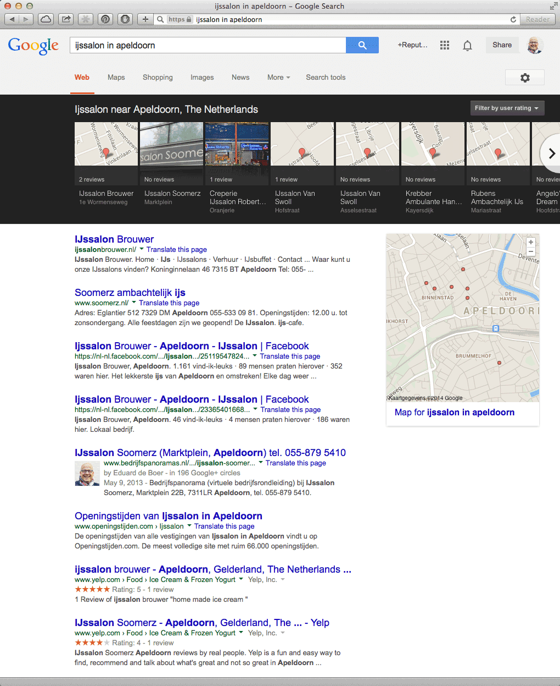](https://lh5.googleusercontent.com/-UOjx1ckaJZg/U2JFEtBH3CI/AAAAAAAAAsw/lprQP7PKkVI/w821-h1004-no/20140505-ijssalon-in-apeldoorn.png)

Daar zie je dat in veel gevallen een armetierig stukje landkaart van Google Maps wordt vertoond. Dat nodigt volgens mij niet echt uit tot doorklikken. En ik durf te wedden dat veel meer bedrijfstakken zichzelf opeens zouden schamen, als de carousel live gaat in Nederland.

Ik had het zojuist over supermarkten… In de show notes heb ik ook een screenshot van de carousel opgenomen, als je zoek naar “supermarkt in apeldoorn”:

[](https://lh5.googleusercontent.com/-ye36ffsHwAo/U2JE_kn6PTI/AAAAAAAAAsA/EW24vKVwXmQ/w858-h349-no/20140505-carousel-supermarkt-in-apeldoorn.png)

Dan zie je helemaal wat ik bedoel. In de bijbehorende carousel hebben de volgende supermarkten geen foto:

```
  * Albert Heijn
  * DekaMarkt
  * Coop
  * Lidl
  * C1000
```

Alleen bij de Dirk staat wel een foto, maar dat is geen representatieve foto voor een supermarkt, vind ik. Er staat iemand op, die een boeket bloemen overhandigd heeft gekregen. En die foto blijkt uit Vlaardingen te komen, terwijl Google die geautomatiseerd heeft geassocieerd met de Dirk in Apeldoorn, terwijl de pagina waar die foto ooit heeft gestaan, niet eens meer online is, maar een error 404 geeft!

Oh-oh-oh-ohhh… Wat ligt daar toch nog een werk te doen voor al die bedrijven!

Nog even voor alle volledigheid: ook in de VS wordt de carousel niet bij alle zoekopdrachten of trefwoorden vertoond. Dus kijk niet raar op, als je de carousel niet elke keer ziet verschijnen als je zoekt met de extra parameters die ik je zojuist heb gegeven.

## “Geen limiet aan aantal links op een pagina”, volgens Google

En we blijven nog even bij Google… Lang geleden, in 2008, schreef Google in haar Webmaster Guidelines, dat je niet meer dan 100 links per pagina moest of kon opnemen. De reden hiervoor was, dat Google in die tijd niet meer dan 100 links per pagina kon crawlen of processen.

Maar inmiddels zijn de tijden veranderd. In november vorig jaar beantwoordde Matt Cutts deze vraag in het Webmasters videokanaal op YouTube. De desbetreffende video heb ik opgenomen in de show notes:

Mocht je dus een soort van directory site hebben, dan hoef je je geen zorgen te maken en kun je gerust meer dan 100 links op een pagina opnemen en ervan uitgaan dat al die pagina’s kunnen worden gevonden en dat de dus links worden gevolgd.

## “Google+ gaat gewoon door!”, volgens zegsman

Vorige week leek het er een beetje op, dat Google+ op een lager pitje zou komen, als gevolg van het vertrek van Vic Gundotra, het voormalig hoofd van Google+. Ik heb daar toen ook een Nieuwsflits video van gemaakt:

[+Amanda Blain](https://plus.google.com/+AmandaBlain/posts) staat rond de 20e plaats op de lijst van meest gevolgde personen op Google+. Dus zij is zeker een persoon met enige mate van invloed op de media. Het feit dat zij een dergelijke blogpost schrijft, zet toch wel aan tot nadenken.

Amanda beschrijft het zo goed in haar artikel en ik wil dat niet verpesten door je een samenvatting te geven. Daarom raad ik je aan het artikel te lezen op haar eigen site. De link naar het artikel vind je natuurlijk terug in de transcriptie en show notes van deze podcast.

Wat ik mooi vond, was het slot van haar artikel. Dat wil ik hier wel even met je delen:

Tenslotte nog over dit topic: [+Moritz Tolxdorff](https://plus.google.com/u/0/+MoritzTolxdorff/posts), een hoge pief van Google Ierland, antwoordde het volgende in de discussie die hierover ontstond op Google+:

Nou, laten we het daar dan maar op houden!

## Matt Cutts over het belang van content in de body van je pagina’s

Matt Cutts heeft een komische video gepost, waarin hij het belang van goede content in de body van een webpagina onderstreept.

Hij zegt dat het natuurlijk ook essentieel is, om unieke en relevante content in het head-gedeelte van een pagina te plaatsen. Echter, veel te vaak focussen mensen zich voornamelijk op de title tag en de metadata, zonder zich echt te bekommeren om de content in het body-deel.

“Wat is het komische aan de video?”, hoor ik vragen. Welnu, ik heb de video in de show notes op [www.reputatiecoaching.nl/75](https://www.reputatiecoaching.nl/75/) opgenomen. Kijk zelf maar:

## Hoe bepaalt Google de weergegeven titel van je webpagina’s?

Met deze komische video van Matt Cutts wilde ik eigenlijk de podcast van deze week besluiten. Maar ik kan het toch niet laten nog een video van Matt Cutts met je te delen. Reden is dat het wel een heel interessante vraag is, die Matt beantwoordt. De vraag is namelijk:

En de tweede vraag die wordt behandeld luidt:

```
  1. Het moet relatief kort zijn
  2. Het moet een goede beschrijving van de pagina zijn (en idealiter van de site, waar de pagina op te vinden is)
  3. Het moet relevant zijn voor de zoekopdracht
```

Als de voorhanden HTML titel aan deze criteria voldoet, dan wordt vaak standaard gewoon de HTML titel gebruikt. Maar indien het er voor Google op lijkt, alsof de titel níet aan de criteria voldoet, dan zou een gebruiker wellicht iets te zien krijgen, wat niet gerelateerd lijkt aan zijn of haar zoekopdracht. Het is ook mogelijk dat op die manier er geen goede indruk wordt gegeven van wat er aan content op die pagina te vinden is. Dus is de kans minder groot dat de gebruiker er dan op klikt.

In die gevallen kan de programmatuur iets dieper gaan graven en kan mogelijk andere content van de pagina gebruiken om een titel samen te stellen of kijken naar de links die naar die pagina wijzen om daar tekst uit te halen voor de titel. Het kan zelfs voorkomen dat Google de Open Directory raadpleegt om een titel te genereren.

In alle gevallen moet je beseffen dat Google haar uiterste best doet om een dusdanige titel te tonen, die de gebruiker in staat stelt te besluiten om erop te klikken of niet omdat het getoonde resultaat precies díe informatie geeft, die hij of zij zoekt.

Het is niet mogelijk om exact te bepalen hoe de titel van jouw pagina wordt vertoond. Wel kun je natuurlijk anticiperen op wat de gebruiker zal gaan typen en daar je titel op af te stemmen in relatie tot de rest van je content en de context van de site.

Hiermee kom ik dan wel bijna aan het einde van deze 75e podcast. Voordat ik overga op de afkondiging heb ik nog een praktische tip voor je, om je te helpen bij het samenstellen van titels voor je artikelen.

## Titel voor je content samenstellen met behulp van Google

De tip bestaat uit twee delen. Als eerste kun je in het zoekveld van Google het eerste woord of de eerste paar woorden die je in de titel wilt gebruiken, intypen. Let dan op wat Google als potentieel gerelateerde zoekopdrachten toont. Zo kwam ik ooit op de titel voor de meest populaire blogpost van mijn site, die maandelijks meer dan 1000 keer wordt bekeken. Dat is het artikel “[Foto uitsnijden en achtergrond verwijderen](https://www.reputatiecoaching.nl/foto-uitsnijden-achtergrond-verwijderen-instructievideo/)”:

[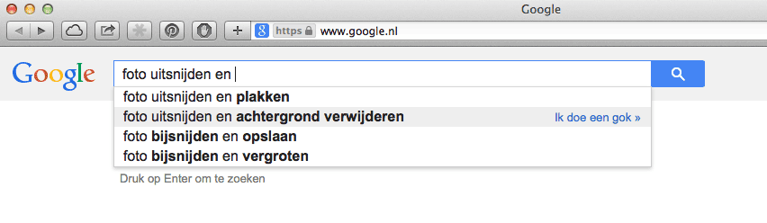](https://lh3.googleusercontent.com/-Vvcvz-pPv2g/U2JE_kGWYGI/AAAAAAAAAr8/mKb5_iFiQ5c/w852-h248-no/20140505-foto-uitsnijden-autosuggest.png)Overigens is de dienst die ik daarin aanprijs inmiddels niet meer gratis. Dat is jammer.

[](https://lh4.googleusercontent.com/-5ELgerowqpI/U2JFFtqFU_I/AAAAAAAAAtY/tISG_aFh5Qs/w281-h446-no/20140505-foto-uitsnijden-ubersuggest.png)Een andere manier om snel een inzicht te krijgen in **alle** suggesties van Google, is door gebruik te maken van de tool [ubersuggest.org](https://www.reputatiecoaching.nl/foto-uitsnijden-achtergrond-verwijderen-instructievideo/). Daar typ je de gewenste zoekterm in en kies je Nederlands. Daarna geeft Übersuggest je alle mogelijke autocomplete suggesties van Google. In de show notes heb ik een klein stukje daarvan opgenomen, omdat de complete pagina veel te lang is.

En met deze praktische tip voor het samenstellen van een titel voor je content kom ik dan nu toch echt aan het einde van deze podcast.

Ik hoop dat je de podcast leuk vindt en dat je wilt nog meer op de hooge blijven. Volg me daartoe op Twitter, op [@reputatiecoach1](https://twitter.com/reputatiecoach1). En als je inderdaad wat hebt aan alle informatie die ik met je deel, help mij dan met het verder verbeteren en promoten van deze podcast. Surf dan naar [iTunes](https://www.reputatiecoaching.nl/itunes) of [Stitcher](https://www.reputatiecoaching.nl/stitcher), geef de podcast een sterrenbeoordeling en geef ook je reactie. Door de podcast te beoordelen op iTunes en/of Stitcher breng je de podcast onder de aandacht van een breder publiek.

Je kunt me verder helpen, door de podcast aan te bevelen bij vrienden of collega’s, waarvan je denkt dat ze er hun voordeel mee kunnen doen, of door ’m te delen op Twitter, like’n en delen op Facebook of een “+1” te geven op Google+.

En vergeet niet: ik ben hier om je te helpen! Als je een vraag of een probleem hebt met betrekking tot je online reputatie of de vindbaarheid van je website, kun je een mailtje sturen naar [podcast@reputatiecoaching.nl](mailto:podcast@reputatiecoaching.nl).

Als je dat te lastig vindt, of als je de podcast beluistert terwijl je in de auto zit en je hebt acuut een vraag, spreek dan een boodschap in op de ReputatieCoaching Hotline, op nummer: 084 - 883 15 56. Mogelijk behandel ik je vraag of probleem dan in een artikel of in de podcast.

En je kunt ook rechtstreeks op de website een voicemail achterlaten, door op de tab aan de rechterkant van elke pagina te klikken, en je bericht in te spreken. Dit was [ReputatieCoaching Podcast aflevering 75](https://www.reputatiecoaching.nl/75/) en mijn naam is [Eduard de Boer](http://nl.linkedin.com/in/eduarddeboer/nl).

Ik wens je de komende week weer succes met het werken aan je reputatie, zodat je meteen je reputatie voor jou kunt laten werken!

Tot volgende week!

Doei!

Links naar content die in deze podcast aan bod komt:

```
  * [ReputatieCoaching Podcast in iTunes](https://www.reputatiecoaching.nl/itunes)
  * [ReputatieCoaching Podcast op Stitcher](https://www.reputatiecoaching.nl/stitcher)
  * [ReputatieCoaching Podcast RSS-feed](https://feeds.reputatiecoaching.nl/ReputatieCoachingPodcast)
  * [ubersuggest.org](http://ubersuggest.org)
  * “[Google Plus Ghost Town: My open letter to the misguided reporters](http://www.amandablain.com/google-plus-ghost-town/)” (Amanda Blain, 24 april 2014)
```
