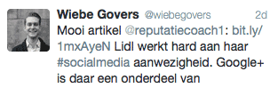
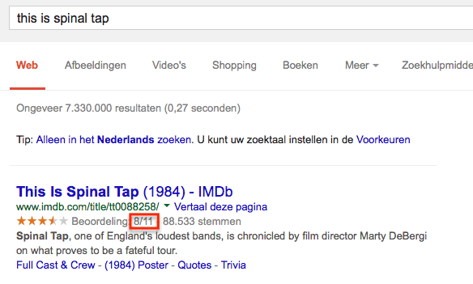
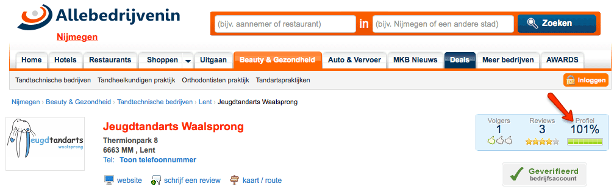
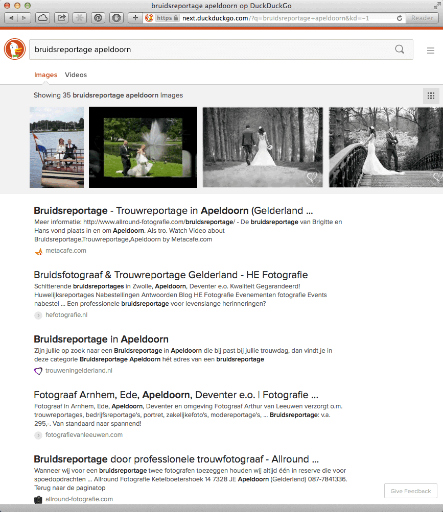
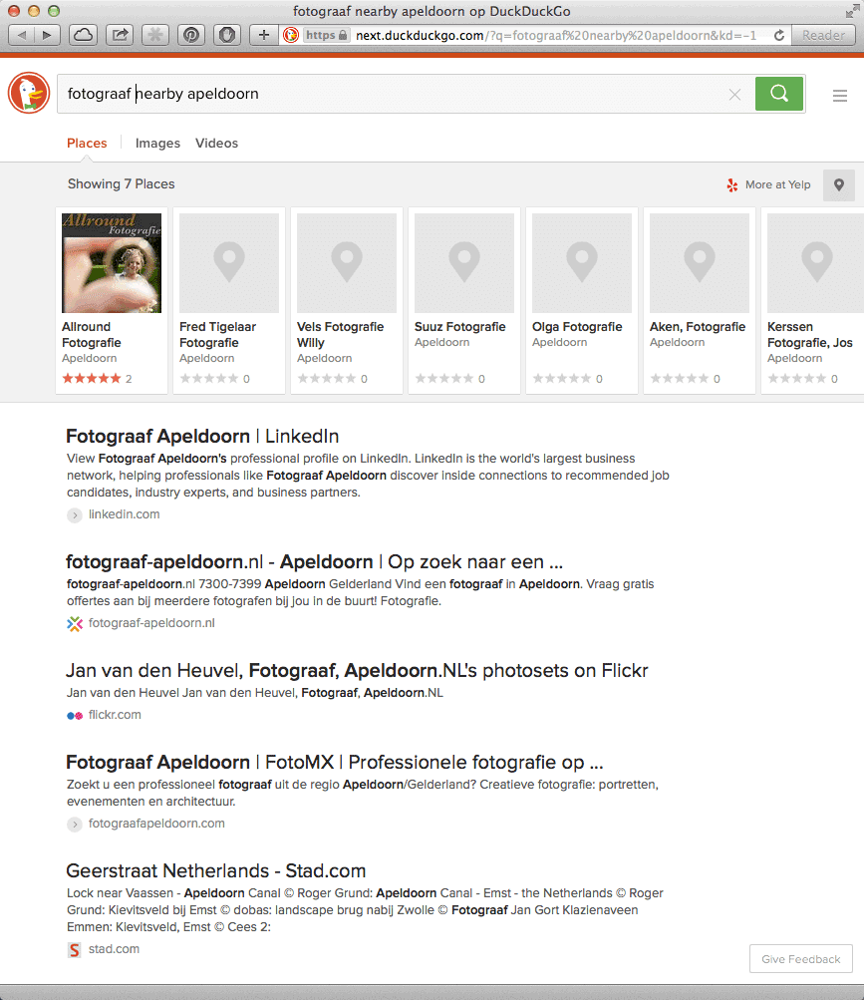
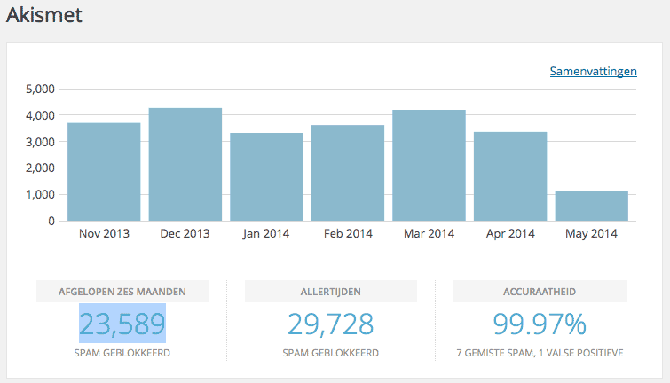
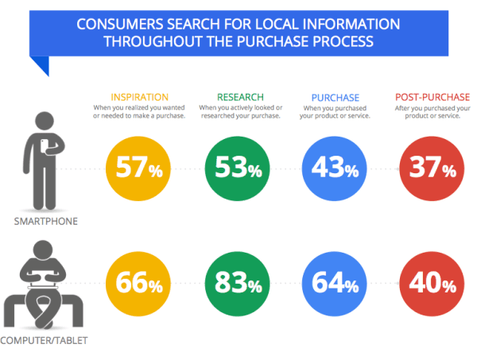

> **Historisch archief.** Deze aflevering verscheen op 12-05-2014 als onderdeel van ReputatieCoaching (2012–2016). De oorspronkelijke tekst is hieronder historisch bewaard. Diensten, contactgegevens, links, tools en adviezen kunnen inmiddels verouderd zijn.

**Transcriptiestatus:** Volledige transcriptie uit het oorspronkelijke archief.

*Historische afbeelding niet beschikbaar: ReputatieCoaching Podcast*
**Vandaag kom ik nog even terug op [podcast 75](/nl/archief/reputatiecoaching/075/) van vorige week en dan met name op de Lidl. Verder heb ik twee vragen ontvangen van Frank uit Nijmegen, waarvan ik er eentje in deze podcast behandel. Ook laat ik je zien dat het mogelijk is om ergens je zakelijke profiel voor 101% te vullen.**

**DuckDuckGo werkt op dit moment aan vernieuwing en uitbreiding van de mogelijkheden met foto- en videosearch en lokale resultaten in een carrousel. Zometeen vertel ik je waar je de beta al kunt testen. Chrome is overigens inmiddels populairder dan Firefox en Akismet heeft mij al voor tienduizenden spamreacties behoed.**

**Matt Cutts zegt dat Google nog wel een tijdje zal blijven kijken naar backlinks en Google Now wordt nu wel ècht behoorlijk eng. En wil je weten waar mensen zoal lokaal naar op zoek zijn als ze iets op Internet opzoeken? Blijf dan luisteren!**

Hallo en hartelijk welkom bij deze aflevering van de ReputatieCoaching Podcast. Mijn naam is Eduard de Boer, ook bekend als de ReputatieCoach. Dit is dé podcast die je moet beluisteren als je meer wilt leren over online reputatie en reputatiemanagement en ook als je wilt werken aan je online reputatie en je online vindbaarheid wilt verbeteren. Dit alles kan je helpen om jezelf beter op de online kaart te plaatsen, waardoor je als bedrijf meer business kunt doen.

Als persoon kun je met de diverse tips aan de slag om bijvoorbeeld je online reputatie als garnalenpeller, wachtcommandant, sigarenmaker, snackbarhouder, leeuwentemmer of wat dan ook te verbeteren.

Alles over deze podcast kun je vinden op [www.reputatiecoaching.nl/76](/nl/archief/reputatiecoaching/076/). Daar vind je niet alleen de tekst, maar ook video’s waar ik het in deze uitzending over heb, alsmede afbeeldingen, links enzovoorts. Bovendien is de podcast te beluisteren via [iTunes](https://web.archive.org/web/*/https://www.reputatiecoaching.nl/itunes) en [Stitcher](https://web.archive.org/web/*/https://www.reputatiecoaching.nl/stitcher). Daar kun je je dus ook abonneren op de wekelijkse podcast. Veel mensen vinden het ideaal om de wekelijkse afleveringen van de podcast op hun gemak te beluisteren, terwijl ze autorijden, fietsen of joggen…

Eerst even een leuk nieuwtje: ik heb een nieuw record gevestigd voor wat betreft het aantal downloads op één dag. Afgelopen dinsdag, 6 mei is het record van 27 november vorig jaar verbroken. Toen had ik op één dag 61 downloads. Maar vorige week dinsdag had ik er 83! Dat is dus op één dag een additionele stijging van maar liefst 22, ofwel 36%.

Normaal ben ik niet zo van de statistieken. Door de jaren heen heb ik losgelaten om er dagelijks naar te kijken. Het gaat mij erom dat er nog steeds mensen luisteren en dat er een groei in zit. Maar omdat ik best erg benieuwd was, waardoor deze piek in het aantal downloads was veroorzaakt, ben ik iets verder in de statistieken gedoken.

Het blijkt dat die dag vrijwel alle podcasts die ik ooit heb gemaakt, zijn beluisterd of gedownload. Ik zie namelijk geen verschil tussen mensen die podcasts online beluisteren of die een podcast eerst downloaden in een podcatcher en daarna pas beluisteren. Dit zou kunnen betekenen dat één nieuwe luisteraar zich gewoon heeft geabonneerd en zijn of haar computer de opdracht heeft gegeven ook alle eerdere podcasts te downloaden.

## Terugblik podcast 75

Vorige week vertelde ik in [podcast 75](/nl/archief/reputatiecoaching/075/) dat Lidl de populairste winkelketen op Facebook is. Het leuke was, dat ik meteen de volgende dag een tweet van Wiebe Govers kreeg; hij is een social media specialist bij Lidl Nederland. Ik weet niet of hij dé social media specialist is, maar dat maakt ook niet uit. Hij stuurde mij in elk geval de volgende tweet:

[](https://lh5.googleusercontent.com/-WJRH_MZmRtc/U2_sCWs-DvI/AAAAAAAAAxM/s0xAUVgYbk0/w304-h99-no/20140506-Tweet-Wiebe-Govers.png)

Goed om te zien dat Lidl dus op Internet monitort wat er wordt geschreven over het bedrijf en leuk dat men dan de moeite neemt even te reageren.

Echter, hoewel in de tweet wordt gezegd dat Google+ een onderdeel is van de social media presence van Lidl, liet ik je in de vorige podcast zien dat hier nog erg veel werkt te doen is, om dit goed op te poetsen, zodat het rendement maximaal is.

Laat ik dan nu overgaan op de onderwerpen voor vandaag… Oh nee, nog even kort een blunder die afgelopen week in diverse discussiefora en Google+ communities circuleerde… Het was een fout in IMDb, de Internet Movie Database. De pagina op IMDb over de film “This is the Spinal Tap” werd namelijk in de zoekresultaten vertoond met een score van 8 uit 11… Dat zie je niet vaak:

[](https://lh6.googleusercontent.com/-__AS_uZ9NWo/U2_Z_fCMrkI/AAAAAAAAAwU/6zPcl6zOYb8/w584-h351-no/20140512-Spinal-Tap-IMDb.png)

In de show notes heb ik een screenshot daarvan opgenomen. Als je in de onderliggende HTML-code gaat kijken, dan zie je dat bij de markup “bestRating” inderdaad 11 staat:

[](https://lh5.googleusercontent.com/-3gymtQ-_q4k/U2_Z_EmGq_I/AAAAAAAAAwM/sxyZug3zuVA/w990-h42-no/20140512-Spinal-Tap-IMDb-HTML.png)

Natuurlijk staat het je vrij om in schema.org daar elke waarde in te vullen, maar over het algemeen zijn 5 of 10 wel het meest gangbaar. Hoelang zal het nog duren tot mensen dit gaan misbruiken en bijvoorbeeld 99999 uit een schaal van 100.000 gaan vertonen? Ik hoop dat Google daar vóór die tijd een stokje voor steekt.

En dan nu echt over op de onderwerpen voor vandaag.

## Allebedrijvenin.nl laat je je profiel voor meer dan 100% vullen

IMDb is niet de enige site waar dit soort dingen gebeuren…

Afgelopen weken heb ik de [Jeugdtandarts Waalsprong in Lent](http://www.jeugdtandarts.nl/waalsprong) geholpen om zichzelf beter en vooral prominenter online te presenteren. Een actie daarbij was het vullen van het bedrijfsprofiel op de website [allebedrijveninnijmegen.nl](http://www.allebedrijveninnijmegen.nl/beauty-en-gezondheid/tandtechnische-bedrijven/lent/jeugdtandarts-waalsprong).

Dat heb ik blijkbaar boven de verwachting van Allebedrijvenin gedaan, want als je op dit moment gaat kijken, dan kun je zien dat het profiel voor 101% gevuld is. Ik vraag me af hoe een profiel verder gevuld kan zijn, dan dat het is. “Vol is vol”, zou je toch zeggen… Inmiddels heb ik allebedrijvenin er ook op attent gemaakt en ik denk dat dit binnenkort is verholpen:

[](https://lh4.googleusercontent.com/-N8dJwD4G85E/U2_Z-_K948I/AAAAAAAAAwQ/hqNxXQAz3cw/w1007-h317-no/20140512-JTW-allebedrijvenin.png)

## Webpagina om reviews van meerdere sites te verzamelen

Afgelopen week ontving ik twee vragen van Frank Grootaarts uit Nijmegen. De eerste vraag ging over hoe ik een webpagina had gemaakt, waarop ik bezoekers steeds op een andere website om reviews vraag, om zo de reviews te spreiden. Dit is nogal technisch, dus dat behandel ik liever niet in de podcast. Maar ik heb al in de planning staan, om hier binnenkort een aparte blogpost aan te wijden.

## Hoe bepaalt Google voorgestelde vanity URLs?

De tweede vraag van Frank was:

Ik vroeg mij af of de door google voorgestelde “mooiere” URL is aan te passen.
Ikzelf heb deze URL nog steeds niet geclaimed omdat ik bang ben dat ik er dan aan vast zit en hem nooit meer kan wijzigen.
Of is deze nog te wijzigen op het moment dat je deze claimt?
Ik zie dezelfde vraag vaker op internet voorbijkomen maar schijnbaar weten weinigen hoe dat nu precies zit. Misschien een onderwerp voor in de blog?

Groetjes,

Frank Grootaarts

Ja Frank, dankje voor je inzending en ik vind het inderdaad een goede topic voor de podcast. En natuurlijk komt de transcriptie hiervan weer op de site in de vorm van een blogartikel. De volledige tekst van deze podcast kun je vinden op: [www.reputatiecoaching.nl/76](/nl/archief/reputatiecoaching/076/).

Hoe zit dat nu met vanity URLs op Google+? Allereerst vind ik het heel goed van Frank, dat hij niet koste wat het kost de vanity URL heeft geclaimd, op het moment dat Google die voorstelde. Want inderdaad, die kun je naderhand echt niet meer wijzigen!

Het lijkt niet allemaal duidelijk. Frank, als ik de Google+ pagina van je bedrijf opzoek, dan zie ik dat je URL [www.grootaarts-nijmegen.nl](http://www.grootaarts-nijmegen.nl) is. Mijn verwachting is dat Google jou één van de volgende vanity URLs voorstelt:

Ik kan me goed voorstellen dat je met geen van deze suggesties blij mee bent, want hoewel dit formeel “vanity” URLs zijn, zijn die niet echt gemakkelijk te communiceren over bijvoorbeeld de telefoon. En ik denk ook, dat Google je niet toestaat om ’m te wijzigen in bijvoorbeeld: +GrootaartsNijmegen of +Grootaarts. Wat zeker niet mag, is iets met Euronics erbij in de vanity URL.

Het enige wat je meestal kunt, als Google jou een voorstel doet voor een vanity URL, is de interpunctie aanpassen: dus dan mag je ergens een punt of een minteken tussen zetten. Ook mag je variëren met hoofd- en kleine letters voor het visuele aspect. Maar daar houdt het dan wel mee op.

Hoe komt dit allemaal en hoe bepaalt Google de vanity URL voor Nederlandse domeinnamen? Tja, ik weet het ook niet voor 100%, want ik liep laatst ook weer tegen een voorgestelde vanity URL aan, voor een Nederlandse website, die wèl heel mooi was en ik dus meteen heb geclaimd uit naam van de eigenaar.

In elk geval weet ik wel, dat Google voor Nederlandse domeinnamen (die dus eindigen op “.nl”) standaard in vrijwel alle gevallen eist dat de vanity URL eindigt op “NL”. Hoewel ik laatst dus een uitzondering had, waarbij dit niet vereist was, heb ik het voorheen altijd voor alle “.nl” domeinnamen als eis gezien. Meestal wordt de bedrijfsnaam als voorvoegsel gebruikt en soms komt de plaatsnaam er nog tussen.

In Frank zijn geval is de bedrijfsnaam “Grootaarts Euronics”. Op basis van wat ik nu net vertelde, snap je dan ook hoe ik tot de voorgestelde vanity URLs kwam. Hoe zou je dit alles nu mogelijk kunnen omzeilen en bijvoorbeeld +Grootaarts als vanity URL kunnen claimen? Ik denk dat ik daar een mogelijke oplossing voor heb. Ik moet je wel eerlijk vertellen, dat ik die nog nooit heb geprobeerd. Maar mijn vermoeden is gebaseerd op de wetenschap dat voor domeinnamen die eindigen op “.com” geen landtoevoeging door Google wordt vereist.

Stel dus dat Frank ooit in het verleden ook de domeinnaam grootaarts.com heeft geclaimd… Begint er dan een lampje te branden? Krijg je een idee over hoe je het dan wellicht kunt oplossen? Nee? Laat ik het uitleggen hoe ik het zou proberen…

Als Google je nog geen vanity URL heeft voorgesteld, komt je zakelijke Google+ pagina namelijk blijkbaar nog niet ervoor in aanmerking, omdat je niet aan alle voorwaarden voldoet. Die voorwaarden zijn:

```
  1. Je zakelijke Google+ pagina moet ouder zijn dan 30 dagen
  2. Tenminste 10 mensen moeten je pagina in hun kringen hebben
  3. Er moet een profielfoto of logo zijn geüpload voor de Google+ pagina (die wordt vertoond in het rondje linksboven in de header)
```

Gemakshalve ga ik er nu vanuit dat Google je al een vanity URL heeft voorgesteld, maar dat je die niet wilt, omdat je de voorgestelde vanity URL niet mooi genoeg, te lang of te complex vindt. En natuurlijk moet je eigenaar zijn van de .com domeinnaam voor je bedrijf.

Dan zou ik om te beginnen op de .com site een soort van minisite zetten, eventueel slechts één statische HTML pagina, waar je ook de adres– en contactgegevens van je bedrijf op zet en wat relevante content. Want vergeet niet, dat mensen via de lokale resultaten op die site terecht kunnen komen. Ook kun je op de mini site een link plaatsen naar je andere site om bezoekers door te sturen. Pas echter geen 301 of 302 redirect toe om alle bezoekers automatisch door te sturen, want dan werkt het sowieso niet.

Ook moet je er zeker van zijn dat de pagina kan worden bezocht door Google en dus niet is geblokkeerd door middel van “robots.txt” of een NOINDEX in de header. Bovendien moet je .com site zijn geverifieerd in Google Webmaster Tools.

Wanneer je dat allemaal voor elkaar hebt, zou ik de website in je zakelijke Google+ pagina laten verwijzen naar de .com minisite. Stel dat Frank Grootaarts dus niet “+GrootaartsEuronics” maar “+Grootaarts” zou willen hebben, dan zou ik ook tijdelijk de bedrijfsnaam in Google+ wijzigen in “Grootaarts”. Die moet dan dus als primaire bedrijfsnaam worden aangemerkt.

Op dat moment kun je gaan kijken wat Google voorstelt als vanity URL. Nogmaals, ik heb het niet getest, en het voorgaande is dus puur gebaseerd op mijn ervaring en een aantal veronderstellingen. Maar ik denk dat Frank in zijn geval dan één van de volgende twee mogelijkheden krijgt:

```
  * plus.google.com/+grootaarts
  * plus.google.com/+grootaartsnijmegen
```

Mocht jij deze exercitie in willen gaan, neem dan gerust contact op, als je er graag hulp bij hebt. Want ik ben hier om je te helpen en het zou tenslotte erg jammer zijn als je ergens in het proces een foutje maakt.

Zo, dat was een heel stuk over de vanity URLs in Google+. Als jij een vraag, tip of suggestie hebt ten aanzien van Google+, dan kun je die gerust stellen onderaan de show notes op [www.reputatiecoaching.nl/76](/nl/archief/reputatiecoaching/076/).

## DuckDuckGo vernieuwt met foto- en videosearch en lokale resultaten in carrousel

DuckDuckGo zal haar zoekmachine binnen nu en ongeveer een maand vernieuwen. Maar het nieuwe eendje is nu al voor iedereen toegankelijk om te testen. Als je surft naar [next.duckduckgo.com](https://next.duckduckgo.com) kun je alvast een kijkje nemen om te zien hoe het gaat worden.

Zo kun je nu niet alleen zoeken op gewone trefwoorden op pagina’s van websites, maar je kunt ook zoeken naar afbeeldingen, video’s en plaatsen. In de show notes heb ik een tweetal screenshots opgenomen, om je te laten zien hoe dat er nu uitziet voor afbeeldingen:

[](https://lh6.googleusercontent.com/-mZ_Gxw6mkj0/U2_Z98C9_eI/AAAAAAAAAwA/IvIxthrMR68/w789-h913-no/20140512-DDG-bruidsreportage-apeldoorn-images.png)

en video’s:

[](https://lh3.googleusercontent.com/-QTwjk_Z2NpU/U2_Z-IlnZ2I/AAAAAAAAAw4/f8Z_Gcgkl7o/w789-h913-no/20140512-DDG-bruidsreportage-apeldoorn-videos.png)

En nu blijkt maar eens temeer hoe belangrijk het is, dat jij met je bedrijf ook in Yelp vermeld staat. Niet alleen omdat je dan daar ook reviews kunt verzamelen, maar helemaal omdat DuckDuckGo, evenals Apple Kaarten, de lokale plaatsen zoekt op Yelp…

En als je wel op Yelp vermeld staat, maar je pagina niet hebt geclaimd en er geen foto’s bij je bedrijfsvermelding op Yelp staan, dan zie je wat je zelf in de show notes kunt aanschouwen… Er worden zeven plaatsen vertoond voor de zoekterm “fotograaf nearby Apeldoorn”, waarvan slechts eentje wordt vertoond met een foto èn reviews! De rest zijn grijze vlakjes en 0 reviews:

[](https://lh3.googleusercontent.com/-Nw3gRt8S6uA/U2_Z-e1sfMI/AAAAAAAAAws/U9sDwMBX4nA/w789-h913-no/20140512-DDG-fotograaf-nearby-apeldoorn-places.png)

Nu is DuckDuckGo natuurlijk maar een miniem kleine speler in het veld van de zoekmachines en al helemaal in de lokale zoekresultaten, maar je weet nooit hoe het in de toekomst zal gaan. Google kwam eigenlijk ook vrijwel opeens uit het niets opzetten en heeft zich weten te ontwikkelen tot een online supermacht.

Een andere uitbreiding van de nieuwe DuckDuckGo is overigens dat het nu ook suggesties geeft voor je zoektermen, net als Google doet, sinds de “Caffeine”-update.

Ik zal het je melden, zodra de nieuwe versie van DuckDuckGo live te zien is op de hoofdsite.

## Chrome populairder dan Firefox

Waar Chrome toeneemt in populariteit, gaat dit ten koste van Firefox. Dat blijkt uit [onderzoek van het Amerikaanse bedrijf “Net Applications”](http://www.cnet.com/news/google-chrome-continues-to-outpace-firefox/) waarover ik las op CNET:

[[Historische afbeelding: Populariteit van browsers per maart/april 2014](https://lh3.googleusercontent.com/8hx7BhmwYMqaGPfe0fMXzvgT1rltKlCfiljT9pO6V3s=w688-h205-p-no)](https://lh3.googleusercontent.com/8hx7BhmwYMqaGPfe0fMXzvgT1rltKlCfiljT9pO6V3s=w688-h205-p-no)

Het gebruik van Chrome groeide in van 17,5% in maart naar 17,9% in april. En in dezelfde periode daalde het gebruik van Firefox van 17,2% naar 17%. Microsoft Internet Explorer staat nog steeds bovenaan met maar liefst 57,88%. Safari wordt gebruikt door een schamele 5,66% van de surfende Amerikaanse populatie.

## Kwaliteit van de audio van de podcast

En dan eens wat anders… Ik vertelde je in [podcast 74](/nl/archief/reputatiecoaching/074/) dat ik een nieuw mengpaneel heb aangeschaft. Dus de afgelopen twee podcasts zijn uitgebracht met de nieuwe apparatuur. Waar ik nu benieuwd naar ben, is of jij vindt dat het geluid beter is geworden, of slechter.

Want ik kan natuurlijk wel iets vinden, maar het gaat om de luisteraars… Dus ook om jou! Dus om wat jij ervan vindt!

Laat het me weten en post een reactie onderaan de show notes, op [www.reputatiecoaching.nl/76](/nl/archief/reputatiecoaching/076/). Heb je verder nog tips, vragen of ideëen, dan mag je die daar ook gerust posten. Jouw bericht zal ongetwijfeld door het spamfilter komen.

## Akismet werkt nog steeds goed als spamfilter

Want, om je een idee te geven: het Akismet spam filter heeft inmiddels sinds dat ik in december 2012 met de site ben begonnen, al 29.728 spamberichten geblokkeerd, waarvan 23.589 in de laatste zes maanden met een accuraatheid van 99,97%.

Dat houdt in dat in die bijna 30.000 berichten het filter per ongeluk één bericht ten onrechte als spam heeft gemarkeerd en slechts 7 spamberichten heeft doorgelaten:

[](https://lh5.googleusercontent.com/-uLn8Tan-OQA/U2_aA8xHSxI/AAAAAAAAAw0/621EI19811Y/w755-h432-no/20140512-spamstats.png)

Dus als jij WordPress gebruikt, maar Akismet nog niet hebt geactiveerd, dan ben ik benieuwd hoeveel spamreacties jij wekelijks krijgt en hoeveel tijd je ermee kwijt bent, om ze te screenen en dan handmatig te verwijderen.

Ik keek nog even terloops op de [website van Akismet](http://akismet.com) en schrok me een hoedje toen ik zag hoeveel spamberichten Akismet wereldwijd door de jaren heen al heeft gedetecteerd en verwijderd. Heb je een idee? In de show notes heb ik een screenshot opgenomen. Daarop kun je zien dat toen ik gisteravond keek, Akismet inmiddels al 139 miljard, 286 mijloen, 839 duizend 242 spamberichten heeft afgevangen. Ongelofelijk!

Maar wat doe jij eigenlijk op jouw site? Accepteer je gewoon geen reacties? Of gebruik je een captcha, of heb je ook één of ander spamfilter draaien, om te voorkomen dat jouw weblog vervuild wordt door spam? Deel het met de andere luisteraars van de podcast en post je reactie onderaan de show notes.

## Matt Cutts: We gebruiken nog wel links voor het ranken, maar…

Zo rollen we van spamberichten op je weblog naar zoekmachine spam. Matt Cutts heeft ook deze week weer een video gepost. De vraag waar hij op ingaat in deze video, luidt:

Matt antwoordt hierop dat hij verwacht dat backlinks de komende jaren echt nog relevant blijven. Maar wat Google probeert te realiseren is het uitvogelen hoe een expertgebruiker zou kunnen zeggen dat een bepaalde webpagina de vraag van de Internetter echt beantwoordt.

In de toekomst zullen backlinks minder belangrijk worden, wanneer Google onomstotelijk kan vaststellen dat bepaalde artikelen van specifieke auteurs afkomstig zijn. Dit zou Google helpen om te zeggen: “Deze persoon is een expert in dit vakgebied en dus is dit goede content.”.

Maar nu Google nog steeds niet echt weet wie iets geschreven heeft, wordt Google beter en beter in het begrijpen van taal. De gebieden waar Google de komende paar maanden tijd en moeite in investeert, is te onderzoeken hoe zij meer kan functioneren als een soort van “Star Trek”-computer, dus: conversationeel zoeken. Dus het soort zoeken, waarbij je kunt praten tegen een machine, waarbij de machine jou begrijpt, zonder dat je echt trefwoorden hoeft te gebruiken.

En om te begrijpen wat iemand zegt, zoals bijvoorbeeld in de vraag: “Hoe groot is Justin Bieber en wanneer is hij geboren?”. Google wil in staat zijn om dan dus te interpreteren dat “hij” in het tweede deel van de vraag ook slaat op Justin Bieber. Maar daarvoor moeten de algoritmes beter in staat zijn om natuurlijke taal goed te begrijpen.

Dus wanneer Google beter in staat is te bepalen wie ècht een bepaald artikel heeft geschreven en wat de èchte betekenis van die content is, evenals de exacte vraag van de gebruiker, dan zal het belang van links afnemen.

Hij spreekt aan het einde van de video de verwachting uit dat Google de komende jaren nog steeds backlinks zal gebruiken om in de basis de reputatie en de relevantie van sites en pagina’s te bepalen.

## Google Now laat je weten als je in een winkel bent die een product verkoopt, waar jij eerder naar hebt gezocht

Google haar hoogste doel is om je de voor jou relevante content aan te bieden, nog vóórdat je de vraag hebt uitgesproken. Dat roept het bedrijf al jaren. Sceptici onder ons dachten eerst dat dit moment nooit zou komen, omdat je geen telepatisch algoritme kunt ontwikkelen, dat in de hoofden van de mensen kruipt en zo de gedachten leest, voordat ze concreet worden gecommuniceerd.

Maar daar lijkt nu verandering in te komen. Ik heb het in het verleden ook al eens gehad over Google Now. Zo vertelde ik in [podcast 23](/nl/archief/reputatiecoaching/023/) op 5 mei 2013 dat Google Now al enigszins voorspellingen ging doen. Toen waren het nog relatief simpele adviezen, zoals bijvoorbeeld reistijd naar locaties waar je vaker bent geweest, het weer op de locatie waar je bent, de koersen van aandelen die ooit in je mail hebben gestaan enzovoorts.

Maar Google tilt het voorspellende karakter van de Google app op Android nu naar het volgende niveau. Als je ooit in het verleden naar een bepaald product hebt gezocht en je stapt een winkel binnen, waarvan Google weet dat het dat product verkoopt, dan krijg je automatisch een bericht in de vorm van een reminder, dat je daar ooit naar op zoek was.

Brrr… dat wordt nu echt aardig scary. Zeker als je in het verleden bepaalde expliciete zoektermen hebt ingetypt, bijvoorbeeld als je ooit in al je onschuld onderzoek hebt gedaan naar heroïne of andere zaken die niet legaal zijn. Stel je loopt langs een plek, waarvan Google weet dat het daar wordt verkocht en je krijgt een reminder, terwijl je partner nietsvermoedend even onschuldig meekijkt, wie je nu weer een WhatsAppje stuurt… Ik denk dat je dan iets hebt uit te leggen… En zo kan ik nog veel potentieel ergere situaties bedenken…

## Wat zoeken mensen aan lokale informatie?

Het is belangrijk dat je goede en bovenal actuele informatie op je website toont, zoals je openingstijden, je adres enzovoorts. Want dat is toch echt het soort informatie, dat mensen online zoeken… Nog meer op hun smartphone, dan op een desktop of tablet.

Uit een onderzoek onder 4.500 mensen bleek dat mensen die op hun smartphone online op zoek waren naar informatie over lokale bedrijven, het volgende zochten:

[](https://lh5.googleusercontent.com/-Dg6xo3c2f7A/U2_Z9OdLN_I/AAAAAAAAAvk/6AnyhlbTc2c/w600-h434-no/20120512-Local-Mobile-1.png)

```
  * 54% wilde de openingstijden weten
  * 53% wilde een routebeschrijving naar het lokale bedrijf
  * 50% wilde het adres van het lokale bedrijf weten
```

Dit geldt voor mobiel. De getallen voor desktops en tablets liggen lager:

[](https://lh4.googleusercontent.com/-WjcwCLZCmRs/U2_Z9GweNcI/AAAAAAAAAv0/ZIBVks1cUow/w600-h443-no/20120512-Local-Mobile-2.png)

```
  * 45% was op zoek naar de beschikbaarheid van een product in een lokale winkel
  * 42% zocht de openingstijden
  * 38% was op zoek naar het adres
```

Uit het onderzoek bleek ook dat 88% van de smartphone gebruikers en 84% van de tabletgebruikers lokale bedrijven zochten.

Ook uit deze getallen blijkt eens temeer dat je altijd actuele informatie op je site moet tonen en dat je site ook voor mobiele gebruikers goed toegankelijk moet zijn.

Met deze conclusie kom ik dan weer aan het einde van deze podcast. Ik zou nog wel een uur door kunnen gaan met het delen van informatie en nieuws, maar hey, ik moet ook weer wat voor volgende week overhouden. Anders heb ik dan misschien niets te vertellen. Dus stop ik er nu mee voor vandaag.

Voordat ik overga op de afkondiging, wil ik nog even kwijt dat ik vanavond weer te vinden ben in het ACEC gebouw in Apeldoorn, op de avond van de Social Media Club Apeldoorn, ook bekend onder de hashtag SMC055 (#SMC055). Het onderwerp vanavond is “Media en Social Media”. Brechtje de Leij, hoofd productontwikkeling bij Sanoma (NU.nl) komt hier meer over vertellen, dus het belooft weer een interessante en leerzame avond te worden…

Als je de podcast leuk vindt en je wilt nog meer op de hooge blijven, volg me dan op Twitter, via [@reputatiecoach1](https://twitter.com/reputatiecoach1). Ik reageer over het algemeen dezelfde dag op een tweet, dus schroom niet om ook zo contact met me op te nemen.

En help mij alsjeblieft met het verder verbeteren en promoten van deze podcast. Laten we zien of we het aantal downloads per dag naar de drie cijfers kunnen tillen.

Surf naar [iTunes](https://web.archive.org/web/*/https://www.reputatiecoaching.nl/itunes) of [Stitcher](https://web.archive.org/web/*/https://www.reputatiecoaching.nl/stitcher), geef de podcast een sterrenbeoordeling en geef ook je reactie. Door de podcast te beoordelen op iTunes en/of Stitcher breng je de podcast namelijk onder de aandacht van een breder publiek.

Beveel de podcast aan bij vrienden of collega’s, waarvan je denkt dat ze er hun voordeel mee kunnen doen, of door ’m te delen op Twitter, like’n en delen op Facebook of een “+1” te geven op Google+.

En vergeet niet: ik ben hier om je te helpen! Als je een vraag of een probleem hebt met betrekking tot je online reputatie of de vindbaarheid van je website, kun je een mailtje sturen naar [podcast@reputatiecoaching.nl](mailto:podcast@reputatiecoaching.nl).

Als je dat te lastig vindt, of als je de podcast beluistert terwijl je in de auto zit en je hebt acuut een vraag, spreek dan een boodschap in op de ReputatieCoaching Hotline, op nummer: 084 - 883 15 56. Mogelijk behandel ik je vraag of probleem dan in een artikel of in de podcast.

En je kunt ook rechtstreeks op de website een voicemail achterlaten, door op de tab aan de rechterkant van elke pagina te klikken, en je bericht in te spreken. Dit was [ReputatieCoaching Podcast aflevering 76](/nl/archief/reputatiecoaching/076/) en mijn naam is [Eduard de Boer](http://nl.linkedin.com/in/eduarddeboer/nl).

Ik wens je de komende week weer succes met het werken aan je reputatie, zodat je meteen je reputatie voor jou kunt laten werken!

Tot volgende week!

Doei!

Links naar content die in deze podcast aan bod komt:

```
  * [ReputatieCoaching Podcast in iTunes](https://web.archive.org/web/*/https://www.reputatiecoaching.nl/itunes)
  * [ReputatieCoaching Podcast op Stitcher](https://web.archive.org/web/*/https://www.reputatiecoaching.nl/stitcher)
  * [ReputatieCoaching Podcast RSS-feed](https://feeds.reputatiecoaching.nl/ReputatieCoachingPodcast)
  * [Akismet](http://akismet.com)
  * “[Google Chrome continues to outpace Firefox](http://www.cnet.com/news/google-chrome-continues-to-outpace-firefox/)” (CNET, 1 mei 2014)
  * “[#SMC055 12 mei, Media en Social Media](http://smcapeldoorn.nl/index.php/69-smc055-12-mei-media-en-social-media)” (SMC Apeldoorn, 5 mei 2014)
```
