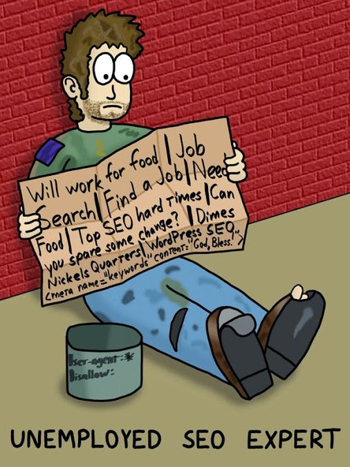
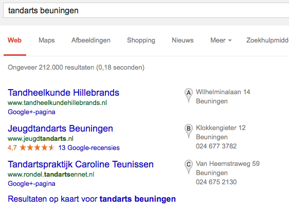
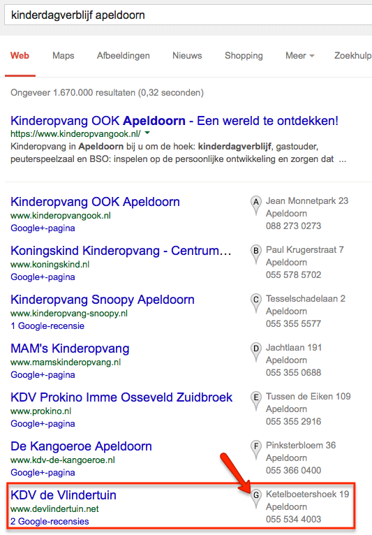
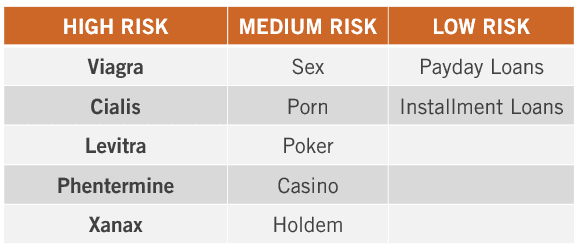
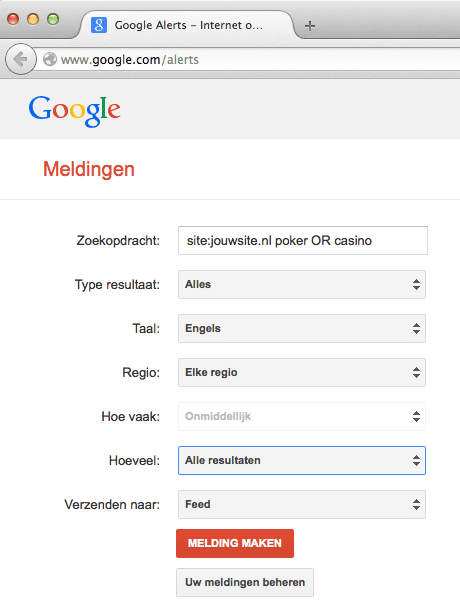

> **Historisch archief.** Deze aflevering verscheen op 19-05-2014 als onderdeel van ReputatieCoaching (2012–2016). De oorspronkelijke tekst is hieronder historisch bewaard. Diensten, contactgegevens, links, tools en adviezen kunnen inmiddels verouderd zijn.



**Transcriptiestatus:** Volledige transcriptie uit het oorspronkelijke archief.

***Historische afbeelding niet beschikbaar: ReputatieCoaching Podcast*
Vorige week maandagavond was ik in Apeldoorn bij de Social Media Club, ofwel #SMC055. Hoewel ik meteen maandagavond ook een Storify-bord ervan heb gepubliceerd, kom ik daar nog even kort op terug. Verder heb ik veel over lokale SEO. Zo heb ik vijf lokale SEO fabels voor je en een zevental psychische belemmeringen of excuses, waarom ondernemers niets met lokale SEO willen of doen. Verder heb ik nieuws van Foursquare, over Buenoo en over het hacken van WordPress sites.**

Hallo en hartelijk welkom bij deze aflevering van de ReputatieCoaching Podcast. Mijn naam is Eduard de Boer, ook bekend als de ReputatieCoach. Dit is dé podcast die je moet beluisteren als je meer wilt leren over online reputatie en reputatiemanagement en ook als je wilt werken aan je online reputatie en je online vindbaarheid wilt verbeteren. Dit alles kan je helpen om jezelf beter op de online kaart te plaatsen, waardoor je als bedrijf meer business kunt doen.

Als persoon kun je met de diverse tips aan de slag om bijvoorbeeld je online reputatie als songwriter, seizoenarbeider, nasynchronisatie-regisseur, paleontoloog, meubelstoffeerder of wat dan ook te verbeteren.

De podcast kun je vinden op [www.reputatiecoaching.nl/77](https://www.reputatiecoaching.nl/77/). Daar vind je niet alleen de tekst, maar ook links waar ik het in deze uitzending over heb, alsmede afbeeldingen enzovoorts. Bovendien is de podcast te beluisteren in [iTunes](https://www.reputatiecoaching.nl/itunes) en op [Stitcher](https://www.reputatiecoaching.nl/stitcher). Daar kun je je dus ook abonneren op de wekelijkse podcast. En mocht je een ander programma gebruiken om naar podcasts te luisteren, dan vind je in de show notes ook de URL van de RSS-feed van de podcast. Veel mensen vinden het ideaal om de wekelijkse afleveringen van de podcast op hun gemak te beluisteren, terwijl ze autorijden, hardlopen, fietsen of actief zijn in de sportschool.

## Korte terugblik podcast 76

[Vorige week](https://www.reputatiecoaching.nl/76/) vertelde ik je aan de hand van een paar knipsels uit een infographic over wat mensen lokaal zoeken vanaf een smartphone, dat 54% op zoek is naar de openingstijden, 53% naar de routebeschrijving en 50% naar het adres.

Heb je zelf al eens je bedrijfsnaam ingetypt? Dat doe je vast heel vaak, om te zien hoe je scoort en wat er over jouw bedrijf wordt geschreven… Maar controleer je wel eens je openingstijden op een aantal websites, zoals allebedrijvenin.nl, openingstijden.nl, openingstijden.com, Yelp enzovoorts?

Kloppen de openingstijden van jouw bedrijf op Google+ en Facebook? Zijn ze allemaal overal hetzelfde? Weet je het zeker? Reden dat ik het toch maar weer eens vraag, is dat Google van consistente gegevens houdt. Dat wil dus zeggen dat je bedrijfsgegevens overal hetzelfde moeten zijn. En dat geldt dan dus ook voor de openingstijden…

Begin dit jaar heb ik de [werkinstructie “opschonen citations”](https://www.reputatiecoaching.nl/werkinstructie-opschonen-citations/) gepubliceerd. Daarin beschrijf ik wat je moet doen om te controleren of je gegevens overal hetzelfde zijn. Ook bied ik je daar een spreadsheet, waarop je zelf je voortgang kunt bijhouden.

De les van vorige week: zorg dat niet alleen je bedrijfsnaam, adres, postcode, plaats en telefoonnummer overal hetzelfde zijn in elke bedrijfsvermelding, maar ook je openingstijden!

Laat ik dan nu overgaan op de onderwerpen voor vandaag…

## #SMC055: Brechtje de Leij en Jeroen Olthof over Media en Social Media

Vorige week maandagavond was het weer tijd voor de maandelijkse avond van de Social Media Club Apeldoorn, ook bekend onder #SMC055. Gastsprekers waren Brechtje de Leij van Samona, de club achter NU.nl en Jeroen Olthof van The WebMen. Zij presenteerden over het thema “[Media en Social Media](https://www.reputatiecoaching.nl/smc055-media-en-social-media-20140512/)”.

Na afloop heb ik meteen een Storify-bord gepubliceerd met daarin de tweets tijdens het evenement.

## Top 5 met lokale SEO fabels

Er zijn nog steeds bedrijven die hun geld verdienen met de traditionele SEO, zoals we die kennen van het verleden. Daarmee doel ik op linkbuilding, schrijven met optimale keyworddichtheid, reacties posten in blogberichten van anderen, reciprocal link aanvragen enzovoorts. Dit alles is tegenwoordig eigenlijk overbodig. De zoekmachines worden steeds slimmer en beter in het beoordelen van content op websites en het bepalen van de kwaliteit ervan.

Trucjes helpen je niet meer, of anders in elk geval niet lang meer, om aan de top te komen, laat staan om daar te blijven. Vele duizenden websites zijn verloren gegaan, omdat ze zich bezighielden met dit soort praktijken.

En omdat veel vermeende “SEO-experts” van “vroeger” niets anders deden dan trucjes uithalen en dupliceren, zonder al teveel kennis van zaken, zijn veel van hen hun werk kwijtgeraakt:

[](https://lh4.googleusercontent.com/-Y-8Y0i-1tAQ/U3kgb7a1mrI/AAAAAAAAAyA/r_LWwX4ai6g/w506-h675-no/20140519-unemployed-seo.jpg)

Zoals ik in de terugblik op vorige week al zei, is consistente informatie over je bedrijf cruciaal. En daarmee komen we op het gebied van lokale SEO. Maar lokale zoekmachineoptimalisatie is iets aparts… Bij lokale SEO zorg je er natuurlijk voor dat je bedrijf op zoveel mogelijk directory sites correct en bovenal consistent staat vermeld.

Maar je gaat verder. Je zorgt ervoor dat je site voorzien is van de juiste schema.org markup voor lokale bedrijven, je zet een Google Maps op je contactpagina, evenals je openingstijden (die je ook weer met schema.org markeert).

Verder stel je Google Publishership in, voorzie je je blogberichten van Google Authorship en verder richt je je erop om goede, interessante en lokaalgetinte content te publiceren. Dan heb ik het niet over content produceren om maar content te produceren. De content die je publiceert moet natuurlijk wel een doel hebben.

Vanaf dat ik ben begonnen met de site [www.reputatiecoaching.nl](/), heb ik me naast het opbouwen en onderhouden van een goede reputatie online, gericht op lokale SEO. En natuurlijk lees ik nog steeds alle informatie en ontwikkelingen die ik maar kan vinden over lokale SEO. Zo kan ik zelf bijblijven en zie ik wat er in de wereld om ons heen hierover wordt gepubliceerd.

Maar wat is nu het doel van lokale SEO?

Het doel van lokale SEO is ervoor te zorgen dat jouw bedrijf goed wordt gevonden in de omgeving. Dat kan dus zijn dat mensen op een smartphone voorzien van een GPS-ontvanger een bedrijf in de buurt vinden, of dat mensen bijvoorbeeld intypen: “elektricien in Alpen aan den Rijn”. Dit laatste geeft dus aan, dat men zoekt naar een specifieke expertise in een bepaalde plaats.

Bij dit soort zoekpogingen kun je je namelijk op veel meer manieren dan alleen met je eigen website profileren en onderscheiden van je collega’s. Hoe? Door meer op te vallen. Het begint ermee, dat je bij voorkeur moet worden vertoond in de lokale zoekresultaten, dus de resultaten die Google toont in het rijtje van “A” t/m “G”. In de show notes heb ik een voorbeeld opgenomen voor de zoekterm “[tandarts Beuningen](http://www.jeugdtandarts.nl/beuningen/)”:

[](https://lh5.googleusercontent.com/-m4RpCBKGd0E/U3kgblpWImI/AAAAAAAAAxs/fVUcVu9Jo6I/w562-h416-no/20140519-tandarts-beuningen.png)Wat valt je op in dit plaatje? Ik weet vrijwel zeker dat je aandacht niet werd getrokken door de nummer 1 in dat overzicht, maar de nummer 2. In de screenshot op de site kun je namelijk zien dat het bedrijf op de “B”-positie maar liefst 13 reviews of recensies heeft en een gemiddelde beoordeling van zo’n viereneenhalve ster uit vijf. Dat valt op! En dus klikken mensen daarop…

Al surfend op Internet en pratend met andere mensen hoor ik dikwijls bakerpraatjes, sprookjes of andere fabels over lokale SEO. Daarvan wil ik er een vijftal met je delen…

**Fabel 1: Door je Google+ vermelding te claimen, kom je aan de top!**

Helaas, er is niet “één weg naar de top” en je kunt de weg naar de top ook niet afsnijden. Dus door alleen je Google+ vermelding te claimen, vliegt je vermelding echt niet door het dak van de zoekresultaten. Goede SEO en ook lokale SEO is een heel spectrum aan acties die je doet en moet blijven doen. Maar het claimen van je vermelding kan wel het verschil bepalen tussen net wèl of net níet in de lokale resultaten worden vermeld.

Zo hebben we hier in Apeldoorn bij ons in de straat een kinderdagverblijf. Dit bedrijf werd niet gevonden, als je zocht op “kinderdagverblijf Apeldoorn”. Een paar weken geleden heb ik de eigenaresse een mailtje gestuurd, dat ze eens haar Google+ pagina moest claimen en verifiëren. En wat schetstst mijn verbazing? Toen dat was gebeurd, belandde haar bedrijf “Kinderdagverblijf de Vlindertuin” in elk geval op de “G”-positie op de zoekterm “kinderdagverblijf Apeldoorn”:

[](https://lh6.googleusercontent.com/-jxwpIlTt1zE/U3kgbQKueBI/AAAAAAAAAx0/0lu4XJnvVeI/w533-h766-no/20140519-kinderdagverblijf-apeldoorn.png)Daaruit lijkt te blijken dat het dus wel kán helpen, evenals honderden andere acties, overigens. Zo verwacht ik, dat als de eigenaresse nu doorgaat met het verzamelen van reviews en ze teminste vijf reviews heeft, waardoor de sterretjes worden vertoond, het bedrijf wel eens een plaatsje hoger zou kunnen stijgen in de lokale resultaten. Ze is ermee bezig, dus we zullen het zien.

Maar wat op je Google+ pagina minstens zo belangrijk is, is het instellen van de juiste categorie. Zo helpt het voor een tandarts om de vermelding aan te passen in “tandarts” en niet te laten staan op “lokale vestiging/interessante plaats”. Want deze laatste is wat Google vaak standaard aan bedrijven toekent. Heb jij al gecontroleerd, hoe jij te boek staat bij Google+? Staat voor jouw bedrijf de categorie wel goed? Hoelang geleden heb je het gecontroleerd? Want soms wil dit ook nog wel eens veranderen, doordat Google zelf tot ander inzicht komt op basis van informatie die het op Internet vindt. Controleer dus de categorie van je bedrijfspagina op Google+ eens per paar maanden.

**Fabel 2: Links tellen niet meer mee, maar citations zijn de nieuwe links**

Ik zeg wel eens gekscherend dat links niet meer relevant zijn en zeker niet voor lokale SEO. Dat bedoel ik niet letterlijk. Wat ik daar maar mee wil aangeven, is dat je als lokale ondernemer en eigenaar van een website zelf drukker moet maken om goede en consistente citations, dan om links naar je site. Want als jij je site op een aantal lokale directories en andere sites aanmeldt, krijg je al wat links naar je site.

En als je dan ook nog eens goede, interessante en educatieve content biedt, dan gaan andere websites ook automatisch naar jouw site of jouw blogberichten linken.

Nu ik het over blogberichten heb: het instellen van Google Authorship voor je blogberichten bezorgt je overigens ook geen betere positie in de zoekresultaten. Maar doordat je foto mogelijk vertoond wordt door Google, kan dit het aantal kliks naar je site verhogen, waardoor je dan uiteindelijk wellicht iets stijgt in de zoekresultaten.

Terug naar links en citations. Hiervoor geldt wel dat kwaliteit belangrijker is dan kwantiteit. Dus zorg ervoor dat je ook citations krijgt op kwalitatief goede sites. Welke dat zijn? Er zijn tientallen sites, waar jouw bedrijfsvermelding eigenlijk niet mag ontbreken. Dit zijn over het algemeen de sites, die je in de zoekresultaten ziet, als je op bepaalde lokale bedrijven zoekt. Zo zul je zien dat bijvoorbeeld de volgende sites vaak de voorpagina of de tweede pagina in Google scoren, als je lokale bedrijven zoekt:

```
  * zorgkaartnederland.nl (voor medici)
  * zorgkiezer.nl (voor zorgverleners)
  * independer.nl (voor zorgverleners)
  * detelefoongids.nl
  * telefoonboek.nl
  * allebedrijvenin.nl
  * yelp.nl
  * facebook.com
  * openingstijden.com
  * openingstijden.nl
  * yalwa.nl
  * enzovoorts…
```

Zoek eens al je concurrenten op en zie op welke verzamelsites zij worden vermeld. Zo vind je snel en eenvoudig een overzicht van alle verzamelsites, waar jij ook jouw bedrijf moet aanmelden.

**Fabel 3: Actie op sociale media heeft geen zin**

Het posten van links op de sociale media heeft in elk geval geen zin, dan klopt. Dit komt doordat Google en andere zoekmachines links in de sociale media niet meetellen om de positie van jouw website in de zoekresultaten te bepalen. Dus vanuit dat oogpunt klopt deze fabel.

Echter, het delen en promoten van jouw content via de sociale media, draagt bij tot het onder de aandacht brengen bij een groter publiek. En naarmate je publiek groter is, neemt ook de kans toe, dat mensen op hun website(s) naar jouw content gaan linken. En dat soort links tellen vaak wel mee voor je rankings. Door goede content te produceren, trek je links aan… Dus dan doe je niet aan “linkbuilding”, maar is het resultaat van jouw inspanningen “linkearning”: je verdient ze!

**Fabel 4: Hoe meer Google+ posts en volgers, hoe beter!**

Toegegeven: actief zijn op Google+ kan helpen met je SEO-acties en kan een positief effect hebben. Al was het alleen maar, omdat Google+ natuurlijk ook een Google product is. Echter, Google ziet tegenwoordig echt wel het verschil tussen goede content en belabberde content.

Dus enkel maar content produceren, om content te produceren op Google+ heeft geen zijn, evenals het kopen van volgers op Google+ (of Twitter, Facebook enz.). Tuurlijk helpt het, als mensen op Google+ met duizenden volgers jou noemen of linken naar een post van jou. Is het niet nu, dan is het wel in de toekomst, als Google nog meer waarde gaat hechten aan autoriteit op Internet.

**Fabel 5: Gebruikerservaring is niet relevant**

Doordat tegenwoordig iedereen smartphones heeft en al meer zoekpogingen worden gedaan vanaf mobiele apparaten, dan vanaf desktops, telt de gebruikerservaring *juist* erg mee. Je website moet standaard op smartphones goed worden vertoond, dankzij responsive webdesign, als op desktops. Je moet goede kleuren gebruiken en de juiste CTA’s (ofwel: “Call To Actions”) plaatsen.

De klant moet centraal staan. Dus ook je content: die moet niet zijn geschreven voor zoekmachines, maar voor je klanten of prospects. Video is tegenwoordig erg hot, dus als jij video gaat inzetten kan dat ook ertoe bijdragen dat de gebruikerservaring van bezoekers van je website verder stijgt en de kans dat ze jou kiezen om business mee te doen, toeneemt.

## Psychische belemmeringen voor lokale SEO

Naast de fabels hoor ik ook allerlei excuses van ondernemers, waarom zij niets aan lokale SEO doen. Globaal gezien vallen ze eigenlijk altijd onder te verdelen in 7 categorieën:

```
  1. _“Ik kan niet meer business aan”_ – Volgens mij is dat een luxeprobleem, waar je altijd wel wat aan kunt doen. Al is het maar het verhogen van je prijzen, als de vraag toeneemt of iemand in te huren om de overflow aan werk op te vangen.
  2. _“Ik heb geen tijd om Google+ te leren”_ – Huur dan gewoon iemand in, die er verstand van heeft.
  3. _“Ik heb er geen budget voor”_ – Als je er geen geld voor (of voor over) hebt, dan zul je het dus zelf moeten leren. En als financiën het probleem zijn, zoek dan een familielid om je kosteloos te helpen. Want voor de rest krijg je in het zakenleven niets voor niets.
  4. _“Ik geef al een vermogen uit aan advertenties”_ – Maar wil je hier eigenlijk wel mee doorgaan? Tijdelijk investeren in lokale SEO kan je site voor lange tijd blijvend aan de top brengen. Zo heb ik ooit een tandarts geholpen om naar de top in de lokale resultaten te komen en die staat nog steeds bovenaan. Toen heeft die er geld voor betaald, maar inmiddels plukt hij nog dagelijks de vruchten van de investeringen van toen, doordat nieuwe patiënten zich inschrijven. En oh ja, hij adverteert verder helemaal _niet_!
  5. _“Hoe weet ik zeker of ik echt zichtbaar zal worden?”_ – Dat hangt ervan af, hoe realistisch je verwachtingen zijn. Voor de ene categorie ondernemers is het gemakkelijker om goed te scoren in de lokale resultaten, dan voor de andere groep. Het voordeel is echter wel, dat je dankzij je aanmelding op veel directory sites etc. je de kans vergroot dat je meerdere vermeldingen op de voorpagina van Google kunt krijgen.
  6. _“Ik ben niet handig met computers”_ – Zie punt 2: Huur iemand in die het wel kan.
  7. _“Nu is niet het goede moment”_ – Maar wanneer is dan wel het goede moment? Ik kan me voorstellen dat het vandaag laten maken van een bedrijfspanorama, terwijl je volgende week gaat verbouwen, niet het beste moment is. Als je nu weinig of onvoldoende klandizie hebt, en je blijft doorgaan met doen, wat je aan altijd al hebt gedaan, is de kans groot dat je krijgt, wat je altijd al hebt gekregen, namelijk: weinig of onvoldoende klandizie. Dus durf te veranderen, te vernieuwen en actie te ondernemen. Juist in slechte tijden kan investeren in lokale SEO je meer opleveren dan betaalde advertenties, omdat je met lokale SEO langere tijd nieuwe proscects naar je site blijft trekken, zonder dat je voor elke klik betaalt.
```

## Foursquare verhuist check-ins naar “Swarm” app

En we blijven nog even bij lokale SEO. Je kent ongetwijfeld Foursquare en ik ga ervan uit dat je je bedrijf daar ook hebt aangemeld en je bedrijfsvermelding hebt geclaimd. Zo niet, doe dat dan snel. Want de waarde van Foursquare als provider van gegevens over lokale bedrijven, neemt hand over hand toe. Dus moet je met je bedrijf toch echt op Foursquare staan.

In elk geval kon je tot op heden altijd inchecken in de standaard Foursquare app. Dat was überhaupt één van de eerste activiteiten, die je in de app kon doen. Maar Foursquare heeft aangekondigd dit binnenkort uit de app te halen en onder te brengen in een aparte app, met de naam “Foursquare Swarm”.

Volgens Foursquare zijn er eigenlijk twee typen gebruikers van de app:

- de groep die het gebruikt voor lokaal zoeken en ontdekken
- de groep die het gebruikt om overal in te checken, vrienden te vinden als sociaal platform

Dus ligt het voor de hand de app ook op te splitsen voor deze twee doelgroepen, volgens Foursquare. En dat is nu precies wat ze gaan doen. Het bedrijf schrijft hierover:

We’re right now putting the final touches on this new, discovery-focused version of Foursquare. It’ll be polished and ready for you later this summer.

We zullen zien wat dit in de toekomst voor het bedrijf zal betekenen.

## Buenoo

Vrijwel iedereen kent Zoover, veel mensen kennen iens.nl, sommigen hebben wel eens een recensie achtergelaten op TrustPilot en een tijdje geleden heb ik aandacht besteed aan MeetingRoomReview, een reviewsite speciaal bestemd voor vergaderlocaties.

[](http://www.buenoo.nl)Een tijdje geleden is er een nieuwe reviewsite bijgekomen, te weten: [Buenoo](http://www.buenoo.nl), met dubbel ‘o’, om enige associatie met de bekende kinderchocolade te vermijden. En natuurlijk staat het ook voor “goed”, hetgeen een aardige binnenkomer is voor een reviewsite.

Op de site kun je het volgende erover lezen:

Het is een interessant concept, dat ook al wel door anderen wordt toegepast. Maar hoe werkt het precies?De site beschrijft dit als volgt:

Via de 24\*7 beschikbare klanttevredenheidsmonitor kunnen ondernemingen hun beoordelingen inzien. Wanneer er een negatieve beoordeling wordt gegeven krijgt de onderneming hier automatisch een melding van. De onderneming heeft vervolgens 10 dagen de tijd hier op te reageren en de negatieve ervaring positief af te sluiten.

Op Buenoo.nl kan de consument de beste ondernemingen per rubriek en regio ontdekken. Komt een bedrijf gemiddeld onder de 6 dan valt deze van de website af en wordt dit bedrijf gestimuleerd om tevreden klanten te genereren.

Zo te zien is de service nog niet zo lang actief. Toch is er al een aantal bedrijven dat er gebruik van maakt. Op dit moment zijn de volgende branches vertegenwoordigd:

```
  * Avondje uit / Dagje weg
  * Beauty & Health
  * Fashion & Lifestyle
  * Financiën
  * Huis en inrichting
  * Online
  * Speciaalzaken
  * Vervoer
```

Ik vind het een mooie en rustig ogende site om te zien. Er is veel witruimte, hetgeen het lezen vergemakkelijkt. Wat me wel opvalt, is dat er bij elk bedrijf slechts één foto wordt vertoond. Als je met een dergelijke site aandacht wilt trekken, moet je dat volgens mij met meer visuals doen, zoals meer foto’s, video’s en waar mogelijk ook Google Bedrijfspanorama’s.

De komende week zal ik mijn best doen om in contact te komen met de personen achter Buenoo, om te zien of ik die volgende week in de show kan hebben voor een interview. Wordt vervolgd!

## Is je WordPress site gehackt?

Omwille van de privacy van de ondernemer zal ik de naam niet bekend maken, maar ik kreeg laatst een mailtje met het verzoek of ik even in de WordPress installatie wilde kijken, omdat die was gehackt. Dat is altijd ellendig!

Uiteindelijk is alles opgeschoond en heeft deze ondernemer ook [WordFence](http://www.wordfence.com) geïnstalleerd. “WordFence” is een beveiligingsplugin voor WordPress. Er is een gratis versie en een premium versie, die US$39 per jaar kost. In de show notes, die je overigens kunt vinden op [www.reputatiecoaching.nl/77](https://www.reputatiecoaching.nl/77/) heb ik ook een link naar deze plugin opgenomen, voor het geval je er meer over wilt weten. Binnenkort zal ik deze plugin eens onder de loep nemen en er een artikel over schrijven. ’k Heb het meteen even als een actie genoteerd, om te voorkomen dat ik het vergeet. Wat ik al wel heb gedaan, is de plugin geïnstalleerd op een tweetal sites, om te zien wat die zoal in de gaten heeft, om je dan binnenkort echte ervaringen uit de praktijk te kunnen geven.

Maar wat is nu hacking? Hoewel het vroeger een positieve betekenis had, is dat tegenwoordig wel anders. Hacking wordt geassocieerd met illegale, technische praktijken om ongeoorloofd toegang te krijgen tot computers, bestanden en informatiesystemen. In het geval van WordPress is het de hackers er vaak om te doen om onzichtbare of soms zichtbare content op je site te plaatsen, bijvoorbeeld om extra backlinks te creëren. Je ziet deze praktijken vaak voor websites die worden geassocieerd met gokken, Viagra-achtige pillen of porno.

Soms kan het ook voorkomen dat er pagina’s op je site worden geplaatst, waarmee hackers proberen te phishen naar loginnamen en wachtwoorden. En ook kan het voorkomen dat je site wordt omgeleid naar een heel andere, spammy site.

Wat je ook vaak ziet is dat zogenaamde malware wordt geïnstalleerd. Dit is kwaadwillige software die is bedoeld om een systeem te ontwrichten of om privé-informatie te achterhalen. Ook kan op die manier virussen, spyware, Trojaanse paarden en andere foute software worden verspreid.

Hoe kun je nu voorkomen dat je WordPress wordt gehackt? Natuurlijk doe je al je best om de meest recente versie van WordPress steeds te installeren, vlak nadat die is uitgekomen. Maar dan nog loop je risico. Zo kan het zijn dat je nog steeds als admin-user, de gebruiker met de naam “admin” hebt. Dat is je eerste verdedigingsmaatregel: het veranderen van de gebruikersnaam van de admin-user. Want vrijwel alle geautomatiseerde tools die met brute kracht proberen wachtwoorden te achterhalen, loggen in met de gebruiker “admin”.

Voor de rest loop je altijd een risico met plugins: die kunnen mogelijk foute code bevatten. Maar het kan ook buiten je eigen omgeving liggen, namelijk in de software die op de webserver draait, zoals Apache, nginx, PHP of MySQL. Ook deze pakketten bevatten fouten die soms kunnen worden misbruikt om illegaal toegang te krijgen.

Ik geef je vandaag een simpele en ook nog eens gratis tip, waarmee je een beetje in de gaten kunt houden of er foute content op je site staat, die je zelf niet erop hebt gezet. Surf naar [Google Alerts](http://www.google.com/alerts) en kies de volgende instellingen:

```
  * Type resultaat: alles
  * Taal: Engels
  * Hoeveel: alle resultaten
```

Reden dat je Engels instelt, is dat de meeste spam Engelstalig is. Vervolgens maak je op die manier verschillende zoekopdrachten aan met de foute trefwoorden, zoals ik die in de tabel op de site heb gezet:

[](https://lh4.googleusercontent.com/-b4adtwHWP2k/U3kgcL96frI/AAAAAAAAAxw/iCxKwqSyg08/w578-h249-no/20140519-words-table.png)

In Google Alerts kun je kiezen of je de resultaten wilt zien als een RSS-feed, of dat je ze per e-mail wilt ontvangen. Kies wat jou het beste uitkomt. Ik zou e-mail kiezen, want dan wordt je wel het snelst geïnformeerd, verwacht ik.

[](https://lh5.googleusercontent.com/-aeYgO_pqOP0/U3kgbaYo0FI/AAAAAAAAAx8/DMiBEbJ218E/w460-h603-no/20140519-google-alerts-hacks.png)

In het plaatje dat ik in de show notes heb opgenomen heb ik gekozen voor “feed”, omdat ik zelf dagelijks RSS-feeds volg en ik zo mijn mailbox beperkt houd. Maar iedereen moet gewoon kiezen wat hem of haar het beste past. Mocht je er niet uitkomen, aarzel dan niet contact op te nemen, zodat ik je verder kan helpen.

En hiermee kom ik dan weer aan het einde van deze podcast.

Als je de podcast leuk vindt en je wilt nog meer op de hooge blijven, volg me dan ook op Twitter, via [@reputatiecoach1](https://twitter.com/reputatiecoach1).

En als je inderdaad wat aan alle informatie die ik met je deel hebt, help mij dan met het verder verbeteren en promoten van deze podcast. Surf naar [iTunes](https://www.reputatiecoaching.nl/itunes) of [Stitcher](https://www.reputatiecoaching.nl/stitcher), geef de podcast een sterrenbeoordeling en geef ook je reactie. Door de podcast te beoordelen op iTunes en/of Stitcher breng je de podcast onder de aandacht van een breder publiek.

Je kunt me verder helpen, door de podcast aan te bevelen bij vrienden of collega’s, waarvan je denkt dat ze er hun voordeel mee kunnen doen, of door ’m te delen op Twitter, like’n en delen op Facebook of een “+1” te geven op Google+.

En vergeet niet: ik ben hier om je te helpen! Als je een vraag of een probleem hebt met betrekking tot je online reputatie of de vindbaarheid van je website, kun je een mailtje sturen naar [podcast@reputatiecoaching.nl](mailto:podcast@reputatiecoaching.nl).

Als je dat te lastig vindt, of als je de podcast beluistert terwijl je in de auto zit en je hebt acuut een vraag, spreek dan een boodschap in op de ReputatieCoaching Hotline, op nummer: 084 - 883 15 56. Mogelijk behandel ik je vraag of probleem dan in een artikel of in de podcast.

En je kunt ook rechtstreeks op de website een voicemail achterlaten, door op de tab aan de rechterkant van elke pagina te klikken, en je bericht in te spreken. Dit was [ReputatieCoaching Podcast aflevering 77](https://www.reputatiecoaching.nl/77/) en mijn naam is [Eduard de Boer](http://nl.linkedin.com/in/eduarddeboer/nl).

Ik wens je de komende week weer succes met het werken aan je reputatie, zodat je meteen je reputatie voor jou kunt laten werken!

Tot volgende week!

Doei!

Links naar content die in deze podcast aan bod komt:

```
  * [ReputatieCoaching Podcast in iTunes](https://www.reputatiecoaching.nl/itunes)
  * [ReputatieCoaching Podcast op Stitcher](https://www.reputatiecoaching.nl/stitcher)
  * [ReputatieCoaching Podcast RSS-feed](https://feeds.reputatiecoaching.nl/ReputatieCoachingPodcast)
  * [Wordfence](http://www.wordfence.com) WordPress security plugin
  * [Buenoo](http://www.buenoo.nl) voor de beste reviews van je bedrijf
```
