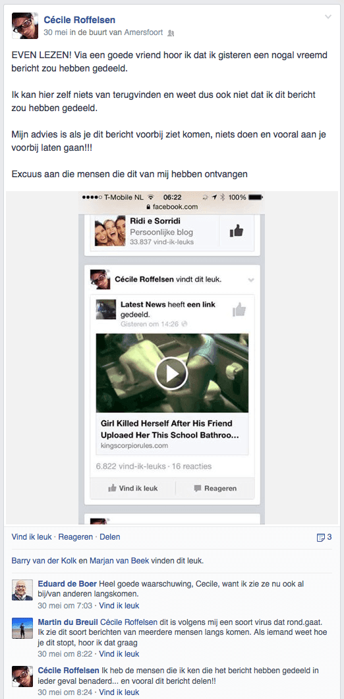
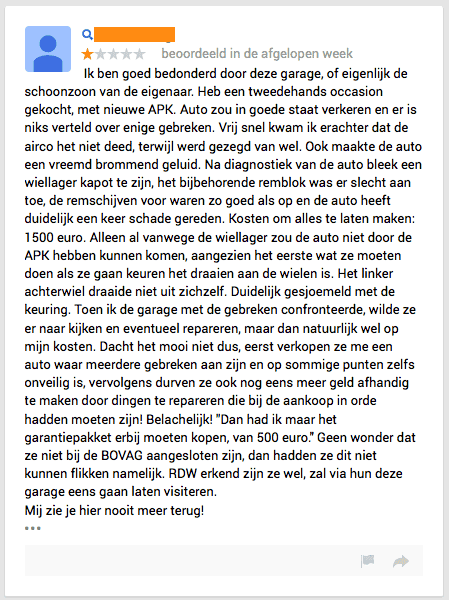
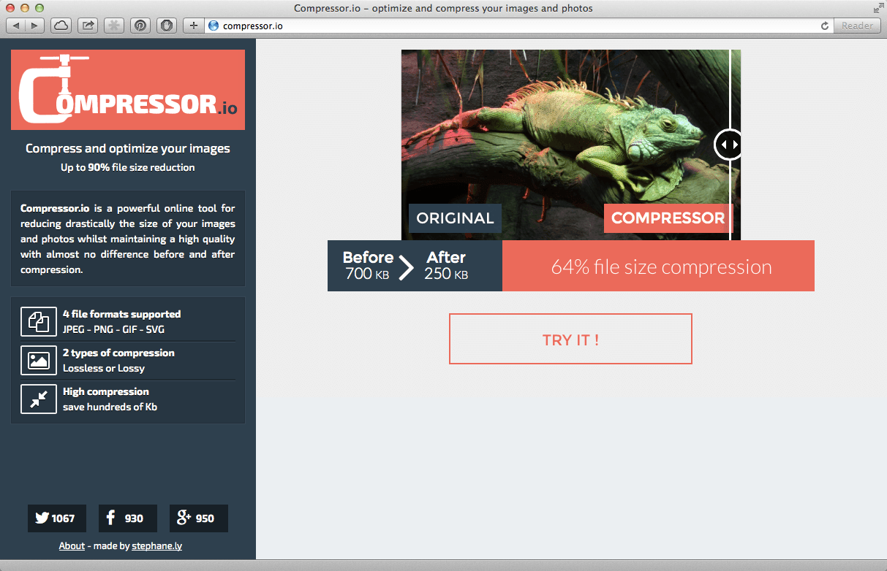

> **Historisch archief.** Deze aflevering verscheen op 2-06-2014 als onderdeel van ReputatieCoaching (2012–2016). De oorspronkelijke tekst is hieronder historisch bewaard. Diensten, contactgegevens, links, tools en adviezen kunnen inmiddels verouderd zijn.

**Transcriptiestatus:** Volledige transcriptie uit het oorspronkelijke archief.

***Historische afbeelding niet beschikbaar: ReputatieCoaching Podcast*
We zijn bijna halverwege het jaar, dus over zo’n 3 weken begint alweer de zomer. Na een periode van veel regen, is het nu gelukkig beter weer. En dat nodigt uit tot meer wandelen met de honden, dus de afgelopen dagen heb ik weer de nodige kilometers te voet afgelegd over de Veluwe.**

**Oh sorry! Je hebt je niet op de podcast geabonneerd om te horen over mijn wandelingen met de honden. Dus, over op de onderwerpen voor vandaag. Allereerst spotte ik afgelopen week Facebook walware in actie op de tijdlijn van twee goede vriendinnen en kreeg een garage in mijn omgeving een erg negatieve review op Google+. Daarop stelde men mij de vraag, wat hieraan kon worden gedaan. Met die onderwerpen begin ik zo.**

**Verder heb ik nieuws over van Google, dat inmiddels een webformulier heeft gepubliceerd, waar je URLs kunt aanmelden, die je verwijderd wilt zien uit de zoekresultaten. Vorige week had ik het hier al over, over [de uitspraak van het Europese Hof, waarbij inwoners van de EU het recht kregen om data uit de zoekmachines te laten verwijderen](/nl/archief/reputatiecoaching/078/).**

**YouTube krijgt er een concurrent bij… Althans, als het aan Yahoo ligt. Want deze laatste wil komende zomer een concurrent van YouTube lanceren. Binnenkort heb je overigens geen tolk meer nodig als je met iemand wilt communiceren, terwijl je de taal van je gesprekspartner niet machtig bent, als het aan Microsoft ligt, althans.**

**Vandaag heb ik ook weer eens een tooltip voor je voor het verkleinen van de bestandsgrootte van afbeeldingen. Twee weken geleden heb ik een Chromebook gekocht en vandaag deel ik de eerste ervaringen met je. John Mueller van Google benadrukt nogmaals dat forum links je ellende kunnen bezorgen en ik sluit de podcast van vandaag af met een samenvatting over Panda 4.0.**

Hallo en hartelijk welkom bij deze aflevering van de ReputatieCoaching Podcast. Mijn naam is Eduard de Boer, ook bekend als de ReputatieCoach. Dit is dé podcast die je moet beluisteren als je meer wilt leren over online reputatie en reputatiemanagement en ook als je wilt werken aan je online reputatie en je online vindbaarheid wilt verbeteren. Dit alles kan je helpen om jezelf beter op de online kaart te plaatsen, waardoor je als bedrijf meer business kunt doen.

Als persoon kun je met de diverse tips aan de slag om bijvoorbeeld je online reputatie als gerechtsdeurwaarder, stedenbouwkundige, huidtherapeut, bartender, etalage ontwerper of wat dan ook te verbeteren.

De podcast en alle gerelateerde content kun je vinden op [www.reputatiecoaching.nl/79](/nl/archief/reputatiecoaching/079/). Daar vind je niet alleen de tekst, maar ook video’s waar ik het in deze uitzending over heb, alsmede afbeeldingen, links enzovoorts. Bovendien is de podcast te beluisteren in [iTunes](https://web.archive.org/web/*/https://www.reputatiecoaching.nl/itunes) en op [Stitcher](https://web.archive.org/web/*/https://www.reputatiecoaching.nl/stitcher). Daar kun je je dus ook abonneren op de wekelijkse podcast. Veel mensen vinden het ideaal om de wekelijkse afleveringen van de podcast op hun gemak te beluisteren, terwijl ze autorijden.

## Terugblik podcast 78

Eerst even een korte terugblik naar de podcast van vorige week, [podcast 78](/nl/archief/reputatiecoaching/078/). Een belangrijke ontwikkeling die ik daarin noemde, was volgens mij wel dat Yelp gaat beginnen met video reviews: allereerst voor de Elite Yelpies, maar later ook voor de overige Yelp-gebruikers.

Video heeft natuurlijk de toekomst, als je de toekomstvoorspellers mag geloven. Zelf ben ik ook die mening toegedaan. Want mensen willen steeds meer content consumeren, in zo kort mogelijke tijd. Dus als men met behulp van beeld en geluid (ofwel: video) meer content in kortere tijd tot zich kan nemen, zal men dat kiezen.

Binnenkort ga ik ook een beetje experimenteren met video reviews, om te zien of dat meer bijdraagt dan tekstuele reviews. Helaas kan ik niet alles tegelijk, dus je zult er nog even op moeten wachten, maar zodra ik ermee begin, zal ik het je laten weten.

Oh, het record van 6 mei, waarop ik 83 downloads klokte, is binnen twee weken daarna verpletterd. Toen waren er op 19 mei namelijk maar liefst 105 downloads! Het aantal luisteraars groeit dus, evenals het aantal bezoekers van de website. Op dit moment groeit het aantal unieke bezoekers per maand gemiddeld met zo’n 10%. Ik ben benieuwd hoelang die trend zich voortzet.

Laat ik dan nu overgaan op de onderwerpen voor vandaag…

## Facebook malware

[](https://lh3.googleusercontent.com/-5VL0LaBwMQ4/U4to98xKmPI/AAAAAAAAA0o/1qFnLJje104/w473-h957-no/20140602-FB-Cecile.png)Cécile en Karin, beide goede vriendinnen, hadden eerder deze week een potentieel reputatie-issue te pakken. Er verschenen namelijk expliciete berichten op hun tijdlijn, met een hoog roze-gehalte. Zij zouden de daarin vertoonde video’s hebben geliked, evenals duizenden andere Facebookgebruikers.

Ik spotte deze ongewenste berichten ’s ochtends vroeg en stuurde dus een tekstberichtje naar beide dames. Cécile kon zich niet voorstellen dat ze op de video had geklikt, ondanks dat die dus op haar tijdlijn stond, terwijl Karin zich herinnerde dat ze er op had geklikt, omdat het “zo bizar” leek.

Dat maakte op zich niet uit, maar beide dames hadden dus gelikete video’s op hun tijdlijn staan, die ze er niet wilden hebben staan, maar ook niet verwijderd kregen, omdat ze ze zelf niet konden zien.

Een uitermate ellendige situatie, als je dit overkomt, want je wordt op die manier natuurlijk potentieel behoorlijk in diskrediet gebracht.

Cécile loste het heel handig op: ze postte de screenshot die ik haar had toegestuurd op Facebook met daarbij de melding dat zij zelf dit niet had gepost en dan anderen ook moesten uitkijken, waar ze op klikten op Facebook.

Laat dit ook voor jou een les zijn en niet klakkeloos overal op te klikken wat je ziet. Want soms kan met malware ervoor worden gezorgd dat er ongevraagd en ongezien zaken met jou worden geassocieerd, die je liever niet met jouw persoontje geassocieerd ziet.

## Slechte review op Google+? Wat doe je dan?

Een ander reputatieincident, een paar dagen geleden. Onze overbuurman heeft een garage, waar hij auto’s repareert en onderhoudt. Ook verkoopt hij auto’s. Ik heb vorige week een Google Maps Business View bedrijfspanorama bij hem gemaakt en toen ik die had gepubliceerd, keek ik terloops ook even op zijn zakelijke Google+ pagina, waar ik de volgende review aantrof:

[](https://lh4.googleusercontent.com/-u4KPrUrkjx0/U4tp5pSau5I/AAAAAAAAA1A/tgjIuI3-Xis/w449-h600-no/20140602-Review-garage.png)

De review was, zoals je zult begrijpen, slechts één ster, en het was ook nog eens de eerste. Tja, dat is ellendig, want alle volgende (potentiële) klanten van de garage die op Google reviews gaan lezen, komen deze dus als eerste tegen. Wat kun je hier nu aan doen?

Ik heb natuurlijk meteen de buurman erop attent gemaakt en hij mailde mij:

Wat hij schrijft klopt niet. Zijn enkele weken al paar mensen bezig om ons zwart te maken ivm concurrentie.

Kunnen we de reviews niet weglaten?

Laat ik beginnen met de laatste vraag als eerste te beantwoorden… Nee, helaas (maar ook wel terecht) kun je reviews niet verwijderen. De enige die een review kan aanpassen of verwijderen, is de originele schrijver of schrijfster van de review.

Je zult deze ook niet onder het mom van haat-reviews of iets dergelijks kunnen laten verwijderen door Google.

Het is mogelijk om te reageren op reviews, maar daarvoor moet je de Google+ pagina wel hebben geclaimd en geverifieerd, iets wat ik al vaker heb verkondigd, dat je als ondernemer zo snel mogelijk moet doen. En hier zie je weer eens waarom…

Wat ik aanraad om te doen in een dergelijke situatie, is zo snel mogelijk de discussie offline nemen, dus via de telefoon in contact zien te komen met de klant. In dit geval is het iemand die recentelijk een auto bij de garage heeft gekocht, dus ik acht de kans groot dat de garagehouder nog wel de contactgegevens van de klant heeft.

Mocht hij geen telefoonnummer (meer) hebben, dan zou ik gewoon naar het huis van de schrijver gaan en de dialoog aan gaan om te zien of je de klant op één of andere manier tevreden kunt maken, met daaraan de conditie, dat de recensie wordt verwijderd, als het conform afspraak is opgelost.

De garagehouder zegt in de e-mail echter dat het al is opgelost en er een soort van “zwart maak”-campage tegen hem loopt. Als dat zo is, en er is ergens een vorm van bewijs te vinden, dan kan hij er misschien mee naar Google gaan in de hoop dat deze laatste er iets mee doet, maar ik verwacht het niet.

Wat dan volgens mij de enige mogelijkheid is die nog overblijft, het overstemmen van de negatieve review, met een groot aantal positieve reviews. Zo breng je het gemiddelde omhoog en drukken de positieve reviews de negatieve naar beneden.

## “Het Europese recht om vergeten te worden”

Als individu heb je het sinds een week of twee een stuk gemakkelijker met je online reputatiemanagement. Vorige week vertelde ik je in [podcast 78](https://web.archive.org/web/*/https://www.reputatiecoaching.nl/nieuwsbrief/), dat alle inwoners van de EU sinds die tijd een nieuw recht hebben, namelijk het recht om “vergeten te worden door de zoekmachines”.

Dit houdt in dat je bij de zoekmachines een verzoek kunt indienen om bepaalde pagina’s uit de zoekresultaten te verwijderen.

Let op: dit houdt niet in dat de content van Internet verdwijnt! Het verdwijnt pas als het van alle websites is verwijderd. Deze bepaling in de EU zorgt er alleen voor, dat de data niet meer zo gemakkelijk kan worden gevonden, als voorheen. Het beperkt dus alleen de vindbaarheid en wist je sporen dus niet uit. Laat dat duidelijk zijn!

Google heeft inmiddels een formulier live staan, waar je [pagina’s kunt aanmelden, die je graag verwijderd ziet](https://support.google.com/legal/contact/lr_eudpa?product=websearch&hl=nl). In de show notes heb ik een link opgenomen naar dit formulier.

Op het formulier moet je natuurlijk de URLs invullen, die je uit de zoekresultaten verwijderd wilt zien. Natuurlijk moet je een verklaring geveven *waarom* je wilt dat ze worden verwijderd. Verder moet je natuurlijk je naam en e-mailadres geven en een geldig en leesbaar legitimatiebewijs meesturen.

Google zegt het volgende over het soort URLs dat kan worden verwijderd:

Verder zegt de zoekgigant erover:

Als je de URLs hebt ingediend, gaat Google elk verzoek apart bekijken en beoordelen, zelfs met een comité van experts. Dit is om te voorkomen dat er misbruik van wordt gemaakt.

Hoewel Google het niet letterlijk schrijft in de begeleidende tekst bij het webformulier, las ik op [Search Engine Journal](http://www.searchenginejournal.com/googles-right-forgotten-form-now-available-users-europe/108127/) de tekst:

Vooral dat laatste benadrukt nog eens waar ik het laatst al over had: als dit waar is, is het kinderlijk eenvoudig om het systeem te omzeilen door gebruik te maken van zogenaamde proxies, waarmee je de illusie wekt dat je zoekpoging afkomstig is van buiten de EU.

Maar goed, Google volgt de bepalingen en ik vind dat ze dit best snel hebben geregeld, na de uitspraak van het Europese Hof.

Het zal nog wel wat worden en ik vrees dat er vertragingen zullen optreden. Want ik las dat Google de eerste dag dat het formulier online stond, al meer dan 12.000 verzoeken heeft ontvangen. Dit schreef Reuters in het artikel “[Google in quandary over how to uphold EU privacy ruling](http://www.reuters.com/article/2014/05/30/us-google-eu-quandary-idUSKBN0EA1ZT20140530)”.

Hoewel op dit moment nog geen statistieken bekend zijn gemaakt door Google, vond ik al wel wat statistieken van de maand, voordat het webformulier online kwam.

De meeste verzoeken kwamen toen uit Duitsland (40%), gevolgd door Spanje (14%), het Verenigd Koninkrijk (13%), Italië (3%) en Frankrijk (2%). Veel van deze verzoeken moeten echter opnieuw worden ingediend, omdat ze niet werden vergezeld van een legitimatiebewijs en de andere informatie die Google vereist.

## Tooltip: compressor.io

Tussen de nieuwsberichten door wil ik je weer eens een tooltip geven. Zoals je je mogelijk nog kunt herinneren heb ik een aantal podcasts geleden verteld dat ik je zou vertellen over leuke, handige tools die ik af en toe tegenkom.

Nou, ik heb er weer eentje voor je, te weten: [compressor.io](http://compressor.io). Deze tool werkt weer wat anders dan [smush.it](/nl/archief/reputatiecoaching/074/), waar ik je in podcast 74 over vertelde.

In principe doet compressor.io hetzelfde als smush.it, namelijk het verkleinen van de bestandsgrootte van afbeeldingen. De dienst is gratis, evenals smush.it. Het leuke is echter, dat compressor.io niet alleen .JPG, .PNG en .GIF bestanden verder kan comprimeren, maar ook SVG, het Scalable Vector Graphics formaat. Nu gebruiken niet bijster veel mensen SVG, maar het is handig om te weten.

In de show notes, die je overigens kunt vinden op [www.reputatiecoaching.nl/79](/nl/archief/reputatiecoaching/079/) heb ik een screenshot opgenomen van de website van compressor.io. Toen ik de initiële versie van deze screenshot maakte, was het bestand afgerond 419 KiloByte:

[](https://lh5.googleusercontent.com/-ykRIMWEm2gI/U4tp56JxyWI/AAAAAAAAA1E/swtNO5U1z-I/w1081-h697-no/20140602-compressor.png)

Vervolgens uploadde ik de screenshot naar compressor.io en opeens werd het bestand gereduceerd tot zo’n 117 KiloByte, een besparing van 72%:

[](https://lh3.googleusercontent.com/-7yUKaFkMXPM/U4tp58n7sII/AAAAAAAAA1I/7RAzpVAnnzA/w1081-h697-no/20140602-compressor-2.png)

En de screenshot die ik van dit venster heb gemaakt, kon ik reduceren van 164 KiloByte naar 39 KiloByte, 76% kleiner!

Wanneer je een JPG-afbeelding uploadt, dan krijg je een schuifbalk te zien, waarmee je de kwaliteit van de definitieve afbeelding kunt instellen en bekijken.

En zodra je tevreden bent, kun je de afbeelding downloaden naar je computer, of naar je Google Drive of Dropbox. Het is handig om te weten dat compressor.io werkt met afbeeldingen tot een maximum bestandsgrootte van 10 MB.

Je kunt natuurlijk maling hebben aan bestandsgroottes en maar denken dat bandbreedte ongelimiteerd is. Echter, grotere bestanden kosten nu eenmaal simpelweg meer tijd om te downloaden, dus hoe je het ook wendt of keert: de totale hoeveelheid bytes die moet worden gedownload is meer en kost dus ook meer tijd, als je je afbeeldingen niet optimaliseert.

Vergeet ook niet, dat pagina’s die sneller laden ook de kans hebben om hoger te scoren dan pagina’s die als gevolg van veel overtollige ballast in de vorm van niet-geoptimaliseerde afbeeldingen en ongebruikte CSS-code, Javascript et cetera minder snel laden.

Met andere woorden: optimaliseer je afbeeldingen altijd. Veel gebruikers verwachten zelfs dat pagina’s snel laden, anders klikken ze gewoon de “terug”-knop. Dus ook hier geldt: “Voor als iedere seconde telt!”…

Experimenteer dus gewoon eens met de afbeeldingen, voordat je ze uploadt, om te zien of je ze kunt verkleinen.

Als laatste tip over grootte van afbeeldingen: upload ook geen afbeeldingen die een hogere resolutie hebben, dan je daadwerkelijk gebruikt op je webpagina’s. Want al die overtollige bytes moeten eerst allemaal worden opgehaald, voordat de afbeelding kan worden vertoond.

## YouTube krijgt concurrentie van Yahoo

Je zou toch denken dat het onmogelijk is om de concurrentie aan te gaan met YouTube. Dat lijkt een regelrechte “Mission Impossible”. Toch heeft Yahoo aangekondigd de concurrentie met YouTube aan te willen gaan en komt het bedrijf deze zomer met de potentiële concurrent.

Ik ben heel benieuwd hoe dit zal lopen. Want is er wel ruimte in de markt voor een nieuwe YouTube? Vergeet niet dat honderden, zo niet duizenden apps die iets met video doen, vaak de mogelijkheid hebben om standaard te uploaden naar YouTube. Hoeveel kans heeft dan een nieuw platform, om daar nog tussen te komen?

Voor content creators die ontevreden zijn over de potentiële inkomsten van YouTube is er goed nieuws: de videoservice van Yahoo belooft betere inkomsten dan YouTube.

En net als met YouTube kunnen gebruikers hun eigen kanalen maken om video’s in te uploaden en te delen. Ook zal de Yahoo videoplayer net zo gemakkelijk te embedden zijn in webpagina’s, als die van YouTube.

Degenen die een contract met Yahoo aan gaan krijgen een soort van publicatiedashboard en hebben de mogelijkheid de content te distribueren naar alle platformen van Yahoo, zelfs de homepage en de bloggingservice Tumblr en een netwerk van andere, niet-Yahoo sites.

Yahoo zal geen exclusiviteit eisen, dus je mag je video ook nog gewoon uploaden naar YouTube, Dailymotion en andere video sites, als je je video initieel op Yahoo hebt geplaatst.

Over Dailymotion gesproken: vorig haar heeft Yahoo nog geprobeerd om Dailymotion te kopen, maar dit is toen tegengehouden door de Franse autoriteiten. Ook de acquisitie van Hulu is niet gelukt.

Hoewel Yahoo zelf niets loslaat, lijkt het erop, dat Marissa Mayer, de CEO van Yahoo en voormalig topvrouw in Google, een significant deel van de Amerikaanse TV-markt wil afsnoepen; die is namelijk goed voor een slordige US$70 miljard.

## Realtime vertaling in Skype

Sinds de opkomst van computers leek het slechts een utopie, een hersenspinsel, dat je alleen terugzag in science fiction series als StarTrek, StarGate, Battlestar Galactica enzovoorts. Waar ik dan op doel is realtime vertaling van een gesprek tussen twee gesprekspartners, die beiden elkaars taal niet machtig zijn.

Toch heeft Microsoft dit eerder deze week gedemonstreerd. De demonstratievideo hiervan heb ik opgenomen in de transcriptie van deze podcast:

Volgens de video spreekt Gurdeep Pall geen Duits, maar ik moet zeggen dat de over en weer vertaling toch al wel erg goed is. Waar Diana Heinrichs, de Duitse collega heel erg goed articuleert en rustig spreekt, spreekt Gurdeep snel Engels. Toch gaat het aardig goed, qua vertaling. Als ik het zo beluister dan lijkt het voor mij dat de essentie van de verhalen wel duidelijk wordt in de andere taal.

Misschien vraag je je af, waarom ik dat hier in deze podcast vertel. Nou, volgens mij hebben ook dit soort ontwikkelingen enorme gevolgen voor marketing, zodra ze nog verder zijn verbeterd. Welke gevolgen kan ik niet zo 1–2–3 overzien, anders dan dat je simpelweg een reclame niet meer door mensen hoeft te laten nasynchroniseren, omdat dat nu geautomatiseerd kan. Heb jij ideeën? Laat me ze weten onderaan de show notes, op [www.reputatiecoaching.nl/79](/nl/archief/reputatiecoaching/079/).

## ACER C720P Chromebook

Ik ben gek op technogadgets… Altijd al geweest. Daarom volg ik veel nieuwe ontwikkelingen op de voet en probeer ik ook graag nieuwe technologieën uit. Naast dat ik een weegschaal op de slaapkamer heb die mijn gewicht bepaalt en in de cloud opslaat, meet die ook mijn BMI, de temperatuur in de slaapkamer en het CO2>-gehalte in de lucht in de slaapkamer. Dit kan ik dan weer op mijn iPhone terugzien.

OK, via die intelligente weegschaal kom ik op de ACER C720P Chromebook, die ik twee weken geleden heb gekocht. Toegegeven, Chromebooks zijn niet bleeding edge technologie en dus niet extreem nieuw of grensverleggend.

Toch zie je nog niet veel mensen om je heen met een Chromebook. Juist omdat het nog geen gemeengoed is, wilde ik eens uitproberen, hoe het is om alleen maar in een browseromgeving te werken.

Wat mij wel meteen opviel was de extreem lange levensduur van de accu: ik kan gewoon een hele dag mijn werk doen, zonder de Chromebook op te hoeven laden. Dat is een bijzondere gewaarwording. Want zelfs als ik mijn iPad door de dag heen gebruik, zoals ik ’m gebruik, dan haal ik meestal niet het einde van de werkdag, zonder de lader aan te sluiten.

Natuurlijk vreesde ik ook, dat ik een groot aantal beperkingen zou hebben, vergeleken met een iPad, of helemaal met een laptop. Tot op heden heb ik het echter nog niet als zodanig ervaren.

Ik ben mijn weg er nog op aan het vinden en de eerlijkheid gebiedt mij te zeggen dat ik de transcriptie van deze podcast toch nog wel in Markdown op mijn desktop heb geschreven. Maar dan moet ik wel zeggen dat ik al wel dezelfde webapp gebruik, die ik eventueel ook in de toekomst op de Chromebook zou gaan gebruiken. Dus in plaats van Byword, gebruik ik op dit moment een andere Markdown editor, te weten “[stackedit.io](http://stackedit.io)”, een online editor.

Mocht je niet weten wat een Chromebook is: het is een lichtgewicht laptop, met een door Google ontwikkeld besturingssysteem, gebaseerd op Linux. Maar het enige programma dat erop draait, is Google Chrome, de webbrowser van Google. Verder niet.

Dus alle mogelijke apps die je kunt installeren, zijn extensies voor Chrome, die meestal op enige wijze gebruik maken van een web-gebaseerde dienst. Als gevolg hiervan moet je wel voor veel apps online zijn, om ze te kunnen gebruiken.

De standaard Google apps, zoals Drive, Docs, Spreadsheets, Presentaties en Gmail kun je ook offline gebruiken. Die worden meteen gesynchroniseerd, als je later wel weer online bent.

Ik moet er nog een Google Hangout mee uitproberen, om een gevoel te krijgen bij de kwaliteit van de webcam, die is ingebouwd en ik heb ook nog niet voldoende tijd gehad om alles uit te proberen, wat ik eventueel nodig zou kunnen hebben voor het uitvoeren van al mijn werkzaamheden.

Ik doe wel mijn uiterste best om te zien of het mogelijk is om 95% of meer van al mijn werk te verplaatsen naar de Chromebook, dus als ik meer ervaringen heb, zal ik die zeker met je delen. To be continued…

## Forum links kunnen je ellende bezorgen

In de vroege dagen van SEO, de afkorting voor “Search Engine Optimisation” of in goed Nederlands “Zoekmachine Optimalisatie”, kon je websites hoger in de zoekresultaten op onder andere Google laten scoren, door er veel links naartoe te laten verwijzen. Er was toen ook software om op diverse pakketten voor het opzetten van discussiefora, geautomatiseerd accounts aan te maken, waarbij dan een link naar de gewenste webpagina of website werd geplaatst in het profiel van de aangemaakte gebruiker.

Dit soort backlinks was gemakkelijk in grote hoeveelheden te maken, waardoor blackhat SEO-specialisten (dat zijn de jongens en meisjes die illegale trucs gebruiken om hoger te scoren) vrij baan hadden om zo sites hogerop te pushen.

Maar sinds een paar jaar werkt dit niet meer en is het dus tijdverspilling om nog met dit soort trucjes bezig te zijn.

Toch kreeg John Mueller van Google laatst de vraag of backlinks van forumprofielen een negatief effect kunnen hebben op je rankings. En raad eens wat het antwoord was… De korte versie… Een volmondig: “JA!”.

Vrij vertaald luidde het antwoord van John Mueller als volgt:

Het maakt niet uit hoeveel PageRank de site heeft, of dat het een .gov forum is. Wat je doet wordt door Google gezien als web-spam.

Als je serieus geeft om hoe zoekmachines als Google jouw website zien, dan raad ik je aan al deze links zo snel mogelijk te verwijderen en dit in de toekomst niet meer te doen.

Tot zover het antwoord. Je hoeft je natuurlijk heus geen zorgen te maken, als jij accounts hebt op een aantal forumsites, waar je dus ook je eigen website in je profiel hebt opgenomen. De boodschap van Google is eigenlijk altijd, dat er alarmbellen afgaan, als je ver over bepaalde grenzen gaat.

Ook hier geldt dus: “*Overdaad schaadt!*”.

## Panda 4.0

Nou, als ik zo naar de tijd kijk dat ik al aan het kletsen ben, heb ik nog tijd en ruimte voor één onderwerp. Dan zit ik over de twintig minuten en daarmee zo rond de 4.000 woorden. Want ik weet dat ik gemiddeld in 20 minuten zo’n 4.000 woorden uitspreek.

Zojuist had ik het over de algoritmes van Google. Deze zijn voornamelijk te verdelen in twee dieren: Penguin en Panda. Doel van Panda is het reduceren van de waarde van dunne of slechte content.

Inmiddels is het duidelijk dat sinds een paar weken een nieuwe versie Panda live is. Google noemt dit zelf “Panda 4.0” en deze update lijkt erop gericht te zijn om (vooralsnog Engelstalige) sites met zogenaamde “syndicated content” anders te beoordelen, waardoor ze mogelijk lager scoren in de zoekresultaten.

Maar sinds ongeveer dezelfde periode scoort eBay.com opeens ook ontzettend slecht. Als je kijkt naar de verliezers in de VS, zijn onder andere gedaald:

```
  * ask.com (met zo’n 50%)
  * ebay.com (33%)
  * biography.com (33%)
  * history.com (33%)
  * yellowpages.com (20%)
```

Er gaan echter ook geruchten dat eBay zelfs een handmatige penalty heeft gekregen van Google. Daarover verschillen de meningen op dit moment nog. Andere verliezers die ook veel content herpubliceren, waren PRWeb.com, PR Newswire, BusinessWire en PRLog, allemaal persbericht sites of aggregator sites.

En waar er verliezers zijn, zijn er ook winnaars. De winnaars zijn volgens “[Search Engine Journal](http://www.searchenginejournal.com/hit-hardest-panda-4-0-answer-may-surprise/106461/)” een aantal sites, die wij hier in Nederland nagenoeg niet kennen. Dus heeft het ook geen zin om die hier met je te delen.

Maar wat wel opviel, was dat de winst van de winnaars veel groter was, dan het verlies van de verliezers.

Matt Cutts van Google tweette het volgende over Panda 4.0:

En op 20 mei kondigde hij Panda 4.0 al aan, door te tweeten:

Volgens wat ik heb gelezen is de Panda 4.0 update van vorige maand voor Engelstalige sites. Heb jij een Engelstalige site, of een deel dat Engels is? Heb jij op die site originele content staan, of ook content van andere sites? Als dat laatste het geval is, merk jij ook dat je lager lijkt te scoren in de zoekresultaten of minder verkeer naar je Engelse content krijgt?

Met deze update over Panda 4.0 kom ik aan het einde van deze podcast. Het waren wel aardig wat onderwerpen, dat geef ik toe. Ik hoop wel, dat je het tot hier hebt volgehouden met luisteren. Want we zijn er dus weer doorheen voor vandaag!

Als je de podcast leuk vindt en je wilt nog meer op de hooge blijven, volg me dan ook op Twitter, via [@reputatiecoach1](https://twitter.com/reputatiecoach1).

Heb je inderdaad wat aan alle informatie die ik met je deel, help mij dan met het verder verbeteren en promoten van deze podcast. Surf daarvoor naar [iTunes](https://web.archive.org/web/*/https://www.reputatiecoaching.nl/itunes) of [Stitcher](https://web.archive.org/web/*/https://www.reputatiecoaching.nl/stitcher), geef de podcast een sterrenbeoordeling en laat ook je reactie achter. Door de podcast te beoordelen op iTunes en/of Stitcher breng je de podcast onder de aandacht van een breder publiek.

Je kunt me verder helpen, door de podcast aan te bevelen bij vrienden of collega’s, waarvan je denkt dat ze er hun voordeel mee kunnen doen, of door ’m te delen op Twitter, like’n en delen op Facebook of een “+1” te geven op Google+.

En vergeet niet: ik ben hier om je te helpen! Als je een vraag of een probleem hebt met betrekking tot je online reputatie of de vindbaarheid van je website, kun je een mailtje sturen naar [podcast@reputatiecoaching.nl](mailto:podcast@reputatiecoaching.nl).

Als je dat te lastig vindt, of als je de podcast beluistert terwijl je in de auto zit en je hebt acuut een vraag, spreek dan een boodschap in op de ReputatieCoaching Hotline, op nummer: 084 - 883 15 56. Mogelijk behandel ik je vraag of probleem dan in een artikel of in de podcast.

En je kunt ook rechtstreeks op de website een voicemail achterlaten, door op de tab aan de rechterkant van elke pagina te klikken, en je bericht in te spreken. Dit was [ReputatieCoaching Podcast aflevering 79](/nl/archief/reputatiecoaching/079/) en mijn naam is [Eduard de Boer](http://nl.linkedin.com/in/eduarddeboer/nl).

Ik wens je de komende week weer succes met het werken aan je reputatie, zodat je meteen je reputatie voor jou kunt laten werken!

Tot volgende week!

Doei!

Links naar content die in deze podcast aan bod komt:

```
  * [ReputatieCoaching Podcast in iTunes](https://web.archive.org/web/*/https://www.reputatiecoaching.nl/itunes)
  * [ReputatieCoaching Podcast op Stitcher](https://web.archive.org/web/*/https://www.reputatiecoaching.nl/stitcher)
  * [ReputatieCoaching Podcast RSS-feed](https://feeds.reputatiecoaching.nl/ReputatieCoachingPodcast)
```
