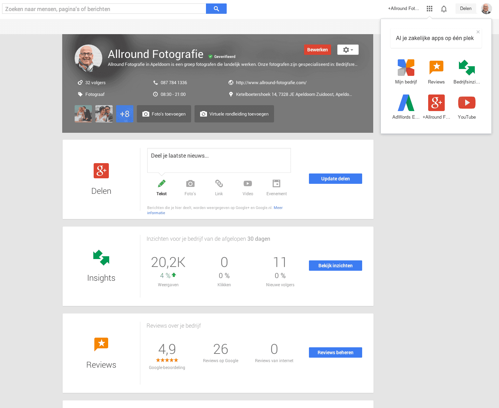
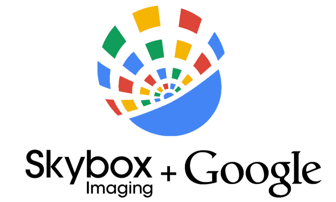
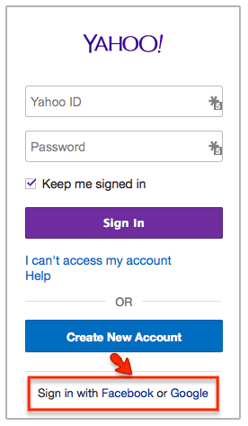
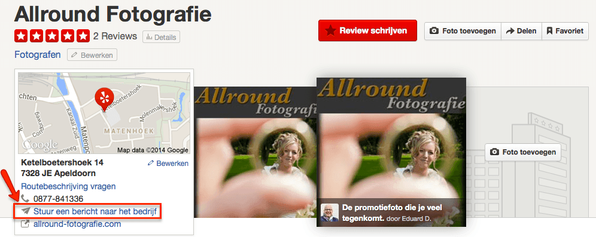
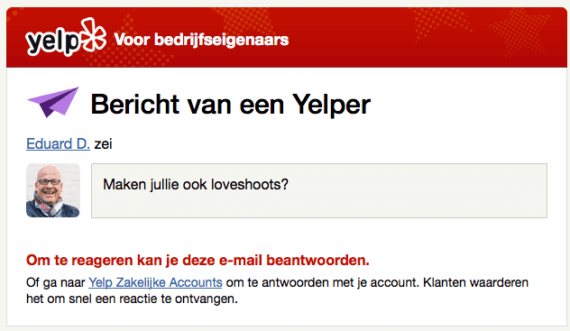
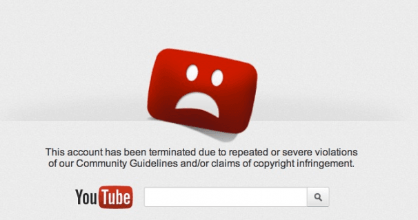

> **Historisch archief.** Deze aflevering verscheen op 19-06-2014 als onderdeel van ReputatieCoaching (2012–2016). De oorspronkelijke tekst is hieronder historisch bewaard. Diensten, contactgegevens, links, tools en adviezen kunnen inmiddels verouderd zijn.

**Transcriptiestatus:** Volledige transcriptie uit het oorspronkelijke archief.

***Historische afbeelding niet beschikbaar: ReputatieCoaching Podcast*
Het was een bijzondere week… Vandaag breng ik je ook een andersoortige podcast. In plaats van enkele lange nieuwsberichten, breng ik je vandaag een groter aantal wat kortere berichten.**

**En ik waarschuw je alvast: er komt vandaag aardig wat Google nieuws voorbij. Om te beginnen: waar mensen eerst nog twijfelden aan het voortbestaan van Google+, pakt Google nu opeens groots uit met het nieuwe Google My Business, of in het Nederlands: Google Mijn Bedrijf.**

**Verder heb ik nieuws over Google Streetview, het standpunt van het bedrijf ten aanzien van het Europese recht om vergeten te worden en Bing over datzelfde punt. Verder kondigt de RUG, ofwel de RijksUniversiteit van Groningen aan miljoenen te verliezen als gevolg van de overstap naar Gmail en koopt Google het satellietbedrijf Skybox voor US$500 miljoen.**

**Pinterest heeft inmiddels al meer dan 1 miljard place pins voor reizen vergaard, Flickr schrapt eind deze maand de login met Gmail en Facebook, YouTube verwijdert alle geblokkeerde accounts en Yelp biedt de mogelijkheid om tekstberichten te sturen naar geclaimde bedrijven.**

**Wow, veel topics voor vandaag, dus ik zal maar snel beginnen.**

Hallo en hartelijk welkom bij deze aflevering van de ReputatieCoaching Podcast. Mijn naam is Eduard de Boer, ook bekend als de ReputatieCoach. Dit is dé podcast die je moet beluisteren als je meer wilt leren over online reputatie en reputatiemanagement en ook als je wilt werken aan je online reputatie en je online vindbaarheid wilt verbeteren. Dit alles kan je helpen om jezelf beter op de online kaart te plaatsen, waardoor je als bedrijf meer business kunt doen.

Als persoon kun je met de diverse tips aan de slag om bijvoorbeeld je online reputatie als tatoeëerder, varkensfokker, hotelconciërge, manicure, opleidingscoördinator of wat dan ook te verbeteren.

De podcast kun je vinden op [www.reputatiecoaching.nl/81](/nl/archief/reputatiecoaching/081/). Daar vind je niet alleen de tekst, maar ook video’s waar ik het in deze uitzending over heb, alsmede afbeeldingen, links enzovoorts. Bovendien is de podcast te beluisteren in [iTunes](https://web.archive.org/web/*/https://www.reputatiecoaching.nl/itunes) en op [Stitcher](https://web.archive.org/web/*/https://www.reputatiecoaching.nl/stitcher). Daar kun je je dus ook abonneren op de wekelijkse podcast. Veel mensen vinden het ideaal om de wekelijkse afleveringen van de podcast op hun gemak te beluisteren, terwijl ze autorijden.

Eerst nog even over de publicatie van de podcast. Afgelopen maandag postte ik een bericht waarin ik vertelde dat de podcast naar donderdagmorgen 08:30 uur verschuift. De reden hiervoor is dat al die uren in het weekend (meestal op zondag) een te grote aanslag plegen op mijn quality time met het gezin. En dan moet je keuzes maken, dus heb ik de podcast na deze bijna een jaar op de maandagmorgen uit te hebben gebracht, verhuisd naar de donderdagmorgen.

Dat alles is geen belemmering, maar ik zie het gewoon als een kans! Ergo: we gaan er vandaag weer lekker tegenaan, met een boel onderwerpen!

En ik heb lange tijd een fout in de website gehad, die ik geheel over het hoofd heb gezien. Daar moet ik even mijn excuses voor aanbieden. Het blijkt namelijk dat sinds ik onderaan de show notes van elke podcast naar Stitcher verwijs, deze link helemaal niet werkte! Ik verkeerde in de veronderstelling dat dat gewoon goed stond. Vandaag vernam ik dit van een luisteraar, die mij er dus op attent maakte. Inmiddels heb ik het probleem gefixed en kun je gewoon op de link naar Stitcher klikken, want die werkt nu, zoals het hoort!

Het laatste nieuwtje voor minder de scherpe waarnemers: sinds vandaag staat de mogelijkheid om de podcast af te spelen bovenaan het blogbericht, dat bij elke podcast hoort. Laat me weten hoe je dat ervaart en of je nu sneller geneigd bent erop te klikken om ernaar te luisteren. Je kunt je reactie achterlaten op [www.reputatiecoaching.nl/81](/nl/archief/reputatiecoaching/081/).

Laat ik dan nu overgaan op de onderwerpen voor vandaag…

## Google Mijn Bedrijf

Een paar weken geleden vertrok Vic Gundotra, het hoofd van Google+. Op dat moment dachten velen dat Google+ ten dode was opgeschreven en Google het zou schrappen uit haar portfolio, ondanks dat diverse kopstukken uit Google toen al zeiden dat dit absoluut niet het geval was.

[](http://www.google.com/business)

En dat bleek eerder deze week, toen Google de wereld verraste met een totaal vernieuwde versie van Google+ voor bedrijven, met de naam “Google Mijn Bedrijf”. Laten we hopen dat deze naam voorlopig blijft staan, want in de bijna twee jaar dat ik deze podcast uitbreng is de naam al een paar keer aangepast. Daarmee worden de oude afleveringen zo snel erg oud, omdat ze totaal achterhaalde informatie bieden met namen van diensten die al niet eens meer bestaan!

Je vindt de nieuwe, of beter gezegd “vernieuwde”, dienst op [www.google.com/business](http://www.google.nl/business/). Wat daar meteen opvalt is dat Google de dienst gratis aanbiedt en daarmee dus de concurrentie aangaat met een aantal directories, waar je moet betalen om daar te worden vertoond.

[](https://lh6.googleusercontent.com/-GI_gdUB93ss/U6Jkce4hsTI/AAAAAAAAA7I/Nr21g_-a2-o/w1015-h694-no/20140619-google-mijnbedrijf-1.png)

Naast de algemene introductie richt Google zich op “Gevonden worden” op:

```
  * Internet
  * Google Maps
  * Google+
```

waarbij je de juiste informatie deelt en dus niet alleen vindbaar bent op desktops, maar op verschillende apparaten.

[](https://lh3.googleusercontent.com/-WeB53ndDuY4/U6JkcVWoM3I/AAAAAAAAA7M/Xq340cjysCs/w1015-h490-no/20140619-google-mijnbedrijf-2.png)

Op [www.google.com/business](http://www.google.nl/business/) wordt ook aandacht besteed aan het delen van posts en foto’s, het sociale karakter door middel van het volgen van anderen, het geven van en reageren op feedback (lees: reviews) en het onderhouden van contacten door middel van Google Hangouts.

[](https://lh6.googleusercontent.com/-QOq3GXr0_R8/U6JkcxmWB0I/AAAAAAAAA7U/H58rzdvRoGk/w1014-h511-no/20140619-google-mijnbedrijf-3.png)

Verder wordt het gemak van het beheer van alles op één plaats benadrukt:

[](https://lh5.googleusercontent.com/-_Rdz40nNKE0/U6JkdBjZzrI/AAAAAAAAA6M/sKxJO4dg9hY/w1015-h496-no/20140619-google-mijnbedrijf-4.png)

Het is duidelijk dat Google nu heel zwaar inzet op de lokale markt, met lokale bedrijven. De combinatie van producten en diensten is natuurlijk best heel sterk. Deze nadruk zet concurrenten als Facebook, Foursquare en Yelp op een achterstand.

Even terug naar het beheer. Als je nu inlogt op [www.google.com/business](http://www.google.nl/business/), dan krijg je een schitterende interface te zien, waarvan ik ook een screenshot heb opgenomen in de show notes:

[](https://lh6.googleusercontent.com/-gN6C42U3cSI/U6JkdVtrBfI/AAAAAAAAA6U/HYBZSsyDKAY/w1015-h832-no/20140619-google-mijnbedrijf-5.png)

Hier kun je inderdaad meteen nieuws posten op de Google+ pagina van je bedrijf, zie je hoevaak je bent vertoond in de lokale resultaten in de afgelopen 30 dagen, heb je inzicht in de reviews, de Analytics en YouTube. Verder kun je ook direct doorklikken naar AdWords Express en kun je een Hangout starten.

En wat ik als fotograaf voor Google Maps Business View leuk vind, is dat Google nu bovenin het scherm van de managementinterface ook pontificaal bedrijven aanmoedigt om een virtuele rondleiding of bedrijfspanorama toe te voegen.

Alle diensten zijn nu samengebracht tot één echt congruent geheel, dat is duidelijk. Terwijl de hele wereld zich de afgelopen twee jaar afvroeg waarom het zo’n rommeltje was en waarom er maar niets leek te gebeuren, heeft Google al die tijd gewoon hard zitten werken aan een nieuw en revolutionair business platform.

Heb jij de interface al bekeken? Ben jij er al eens ingedoken? Of was je dit nog niet opgevallen? Geef je reactie onderaan de show notes van dit artikel, op [www.reputatiecoaching.nl/81](/nl/archief/reputatiecoaching/081/).

## Streetview na 5 jaar eindelijk in Griekenland

En Google behaalde ook een overwinning in Griekenland. Na een strijd van vijf jaar mag eindelijk al het materiaal van Streetview online. Zeker voor een land als Griekenland, dat zo’n gigantisch rijke historie heeft, is dit een fantastische manier om de wereld online van deze schatten mee te kunnen laten genieten.

De redenen die de Griekse overheid vijf jaar geleden gaf, waren in de trant van: “We willen zeker weten dat de technologie voor het vervagen van gezichten en nummerborden goed werkt” etc., terwijl Google dat al in meer dan 55 andere landen heeft gedemonstreerd. Maar goed, het maakt niet uit: Griekenland staat nu in elk geval op de Streetview kaart!

Ga zelf maar eens lekker virtueel door Athene of een andere Griekse stad boemelen en kijk je ogen uit!

## Google koopt Skybox voor US$500 miljoen

Over Streetview gesproken: afgelopen week werd ook bekendgemaakt dat Google het bedrijf “Skybox” koopt, voor US$ 500 miljoen. Skybox gaat Google ook verder helpen met betere en actuelere satellietbeelden. Als je wel eens je eigen huis op Google Earth hebt opgezocht, dan heb je waarschijnlijk wel gezien dat die beelden ontzettend oud zijn. De beelden van ons huis zijn al meer dan 8 jaar oud.

[](https://lh5.googleusercontent.com/-N_glvM9M_Ac/U6Jkd0Md18I/AAAAAAAAA6c/um8YWDz2oKg/w692-h417-no/20140619-google-skybox-imaging.png)

Maar vanaf nu heeft Google haar eigen satellieten die rond de wereld draaien en het bedrijf in staat stellen overal eigen fotomateriaal te knippen. In de show notes heb ik een video opgenomen van Skybox, waarin wordt gedemonstreerd wat het bedrijf op dit moment kan:

En het mooie is dat de satellieten van Skybox (of nu dan van Google) niet foto’s maken, maar zelfs live Full HD video opnames van de aarde kunnen streamen. Denk je eens in wat voor mogelijkheden dat dan weer kan gaan bieden…

Google wil op termijn de satellieten ook gebruiken voor het verbeteren van de navigatie van de zelfrijdende auto’s en het aanbieden van Internettoegang in afgelegen gebieden.

## Google en het “Recht om vergeten te worden”

Een paar weken geleden had ik het over Google in relatie tot de relatief nieuwe EU wetgeving, waarbij EU-burgers het recht hebben om “te worden vergeten” door de zoekmachines. Toen was nog niet alles duidelijk, maar nu begint er meer helderheid in de zaak te komen.

Zo lijkt alles erop te wijzen dat Google de resultaten dus niet zal verwijderen, maar gewoon niet in de EU zal vertonen. Het ligt ook in de lijn van de verwachting, dat de resultaten wel gewoon op google.com vindbaar zullen zijn. En het lijkt erop te wijzen dat Google voor het verbergen van de resultaten de locatie van jouw IP-adres gaat gebruiken. Hoewel het nog niet 100% is aangetoond, is de verwachting dat als je vanuit bijvoorbeeld Brazilië op google.nl zoekt, je de in de EU verborgen resultaten wel gewoon kunt bekijken.

Dus mijn advies is: blijf je te allen tijd bewust van wat je publiceert, want vergeten wordt het niet. Het wordt hooguit virtueel een beetje onder het tapijt geveegd, waarmee het slechts aan het oog wordt onttrokken…

## Bing kan bijna vergeten

Google was inderdaad de eerste zoekgigant die het “recht om vergeten te worden” had geïmplementeerd. Op dat moment was er nog niets bekend van Bing en andere zoekmachines. Want die Europese wetgeving geldt namelijk niet alleen voor Google, maar voor alle zoekmachines die data van Europeanen indexeren en vindbaar maken.

Van Bing was toen nog niets bekend. Inmiddels heeft Microsoft aangekondigd binnenkort dit te zullen realiseren. Bing schrijft hierover het volgende op haar [website](http://onlinehelp.microsoft.com/en-gb/bing/dn768284.aspx):

Overigens zegt ook Yahoo iets soortgelijks dat ze binnenkort met een oplossing zullen komen:

## RUG verliest miljoenen door overstap op Gmail

“*De Faculteit Wiskunde en Natuurwetenschappen (FWN) van de Universiteit Groningen dreigt contracten ter waarde van vele miljoenen te verliezen door het gedwongen gebruik van Googles Gmail. Bedrijven die de faculteit financieren zoals IBM en chemiebedrijf DSM willen niet dat de universiteit het in hun ogen kwetsbare Gmail gebruikt.*”.

Dit was afgelopen week te lezen op [emerce.nl](http://www.emerce.nl/nieuws/faculteit-universiteit-groningen-vreest-miljoenstrop-door-overstap-gmail). In het artikel wordt verteld dat de RijksUniversiteit van Groningen vorig jaar is overgestapt op Google Apps for Education. De redenen hierachter waren zowel financieel, als technisch. Waar het te complex en te duur zou worden voor de universiteit om studenten in staat te stellen met alle devices hun content te benaderen, biedt Google Apps dit standaard voor een schappelijke prijs.

Het probleem is alleen dat contractpartners van de universiteit hier helemaal niet blij mee zijn en de contracten en projecten met de universiteit willen opzeggen. Reden is dat zij niet willen dat bedrijfsgeheimen worden uitgewisseld via Gmail, de mailservice van één van de bedrijven ter wereld die jaarlijks de meeste patentaanvragen indient.

De RUG is overigens niet de enige onderwijsinstelling die problemen heeft met de overstap naar Gmail. Enkele jaren geleden weigerden Amerikaanse universiteiten, zoals de University of California at Davis (UCD) en Yale University ook over te gaan.

## Pinterest heeft meer dan 1 miljard reis pins

*Historische afbeelding niet beschikbaar: Pinterest*
Dat Pinterest niet alleen voor mode, dieren, infographics en inspirerende teksten is, blijkt wel uit het feit dat sinds de lancering van Pinterest Place Pins eind 2013, er meer dan 1 miljard afbeeldingen zijn gepind in het kader van reizen. Hiermee zijn afbeeldingen van meer dan 300 unieke landen en gebiedsdelen op de kaart gezet.

Om nu snel foto’s te kunnen vinden, heeft Pinterest een aparte, snellere place search geïntroduceerd. Hoe dit allemaal werkt wil ik hier niet uit de doeken doen, maar je kunt er meer over lezen in het artikel: “[Introducing a faster place search](http://engineering.pinterest.com/post/88679054329/introducing-a-faster-place-search)” op het engineering weblog van Pinterest.

## Flickr stopt met Google en Facebook logins


In de beginjaren van Flickr moest je een Yahoo account hebben om in te kunnen loggen. Later werd het ook mogelijk om in te loggen met een Google en Facebook account. Maar per 30 juni stopt Yahoo met die mogelijkheid en moet iedereen een Flickr account hebben, om nog in te kunnen loggen op Flickr.

De reactie van Yahoo was:

Wat die gepersonaliseerde ervaringen dan mogen zijn, dat zien we in de toekomst. Ik logde in met mijn Gmail-account en toen liet Flickr mij weten dat ik ook een Flickr account had en dat ik binnen afzienbare tijd moest overschakelen.

Dus let op: als je inlogt op Flickr met je Google of Facebook account, dan moet je dat voor het einde van de maand veranderen. Anders loop je dus het risico dat je niet meer bij je foto’s kunt. En neem dan meteen ook alle apps op je smartphones en tablets mee: verander die ook meteen, als je toch bezig bent. Dan loop je straks in de vakantietijd niet tegen verrassingen, als je bijvoorbeeld je foto’s naar Flickr wilt backuppen of zo.

## Yelp biedt klanten de mogelijkheid een tekstbericht naar bedrijven te sturen

*Historische afbeelding niet beschikbaar: Logo Yelp*
Google heeft afgelopen week natuurlijk wel heel groots uitgepakt. Maar ook Yelp is vernieuwend bezig geweest. Zo kun je sinds een paar dagen als Yelper een [tekstbericht sturen naar een bedrijf op Yelp](http://officialblog.yelp.com/2014/06/hold-the-phone-now-you-can-message-business-owners-directly-through-yelp.html). Dit kun je nalezen in het weblog van Yelp. De link naar dit artikel heb ik opgenomen in de show notes van deze uitzending, die je kunt vinden op [www.reputatiecoaching.nl/81](/nl/archief/reputatiecoaching/081/).

Deze functionaliteit is nog niet in de mobiele app gerealiseerd, maar werkt dus alleen als je bent ingelogd op de Yelp website.

Als je dan een bedrijf opzoekt, dan zie je links de tekst “Stuur een bericht naar het bedrijf” staan. Dan zie je de screenshot, die ik ook in de show notes heb opgenomen:

[](https://lh4.googleusercontent.com/-Gmo652JE_Jo/U6Jkf4soErI/AAAAAAAAA68/uoTY6XLbnYQ/w996-h397-no/20140619-yelp-bericht-sturen.png)

Klik op die tekst en je kunt je bericht intypen. De ondernemer die de business op Yelp heeft geclaimd, ontvangt dan een e-mail met het bericht. Daarvan heb ik ook een voorbeeld in de show notes opgenomen:

[](https://lh4.googleusercontent.com/-8ZxFYdyVxLc/U6Jke44YEjI/AAAAAAAAA6w/NdzlIng0mO0/w632-h367-no/20140619-yelp-bericht-in-inbox.png)

Van de ondernemer wordt natuurlijk wel verwacht, dat deze reageert. Daarom is deze feature alleen beschikbaar voor geclaimde bedrijfsvermeldingen in Yelp, omdat tijdens het claimproces, de ondernemer een e-mailadres heeft moeten opgeven.

Als jij je kansen voor interactie met je prospects of klanten wilt vergroten, dan is nu het moment om je business op Yelp te claimen!

## YouTube schrapt geblokkeerde accounts

Met ingang van afgelopen maandag is YouTube begonnen met het [verwijderen van alle accounts die in het verleden zijn geblokkeerd](http://youtubecreator.blogspot.nl/2014/06/making-sure-your-subscribers-count.html). Dit kan dus een negatief effect hebben op het aantal abonnees van je YouTube kanaal of kanalen.

[](https://lh5.googleusercontent.com/-fwJissrM6ig/U6JkgEaKA-I/AAAAAAAAA7E/2ea1cqpHSjs/w606-h320-no/20140619-youtube-suspended-accounts.png)

YouTube heeft echter wel gegarandeerd dat de viewcounts van je video’s, ofwel de tellers die aangeven hoevaak je video’s zijn bekeken, niet worden gewijzigd, als gevolg van deze actie.

Ik zei het al aan het begin: ik had vandaag een groot aantal wat kortere berichten voor je. En ik hoop dat je hier iets aan hebt gehad.

Oh, ik denk er trouwens over om eens per week een lijstje te publiceren van links naar artikelen die ik interessant vind en waarvan ik denk dat jij ze ook mogelijk interessant vindt, maar die ik niet in de podcast heb behandeld. Ik lees namelijk zoveel en ik zou het jammer vinden, als die dus langs je heen zouden gaan.

Dus heb geen angst: ik ga je niet spammen per mail of zo… Het wordt gewoon eenmaal per week een lijstje met links naar zo’n 10–15 mogelijk interessante artikelen. Het precieze aantal wil ik af zijn, maar ik ben benieuwd of je dit leuk en nuttig lijkt.

Wil je dit? Lijkt je dit leuk? Geef je reactie onderaan de show notes, op [www.reputatiecoaching.nl/81](/nl/archief/reputatiecoaching/081/).

Als je de podcast leuk vindt en je wilt nog meer op de hooge blijven, volg me dan ook op Twitter, via [@reputatiecoach1](https://twitter.com/reputatiecoach1).

Heb je inderdaad wat aan alle informatie die ik met je deel, help mij dan met het verder verbeteren en promoten van deze podcast. Surf daarvoor naar [iTunes](https://web.archive.org/web/*/https://www.reputatiecoaching.nl/itunes) of [Stitcher](https://web.archive.org/web/*/https://www.reputatiecoaching.nl/stitcher), geef de podcast een sterrenbeoordeling en laat ook je reactie achter. Door de podcast te beoordelen op iTunes en/of Stitcher breng je de podcast onder de aandacht van een breder publiek.

Je kunt me verder helpen, door de podcast aan te bevelen bij vrienden of collega’s, waarvan je denkt dat ze er hun voordeel mee kunnen doen, of door ’m te delen op Twitter, like’n en delen op Facebook of een “+1” te geven op Google+.

En vergeet niet: ik ben hier om je te helpen! Als je een vraag of een probleem hebt met betrekking tot je online reputatie of de vindbaarheid van je website, kun je een mailtje sturen naar [podcast@reputatiecoaching.nl](mailto:podcast@reputatiecoaching.nl).

Als je dat te lastig vindt, of als je de podcast beluistert terwijl je in de auto zit en je hebt acuut een vraag, spreek dan een boodschap in op de ReputatieCoaching Hotline, op nummer: 084 - 883 15 56. Mogelijk behandel ik je vraag of probleem dan in een artikel of in de podcast.

En je kunt ook rechtstreeks op de website een voicemail achterlaten, door op de tab aan de rechterkant van elke pagina te klikken, en je bericht in te spreken. Dit was [ReputatieCoaching Podcast aflevering 81](/nl/archief/reputatiecoaching/081/) en mijn naam is [Eduard de Boer](http://nl.linkedin.com/in/eduarddeboer/nl).

Ik wens je de komende week weer succes met het werken aan je reputatie, zodat je meteen je reputatie voor jou kunt laten werken!

Tot volgende week!

Doei!

Links naar content die in deze podcast aan bod komt:

```
  * [ReputatieCoaching Podcast in iTunes](https://web.archive.org/web/*/https://www.reputatiecoaching.nl/itunes)
  * [ReputatieCoaching Podcast op Stitcher](https://web.archive.org/web/*/https://www.reputatiecoaching.nl/stitcher)
  * [ReputatieCoaching Podcast RSS-feed](https://web.archive.org/web/*/https://www.reputatiecoaching.nl/ReputatieCoachingPodcast)
  * [Google Mijn Bedrijf](http://www.google.nl/business/)
  * [Skybox Imaging](http://www.skyboximaging.com/technology#imaging-chain)
  * “[Submitting privacy-related requests to block results in the EU](http://onlinehelp.microsoft.com/en-gb/bing/dn768284.aspx)” (Bing Help)
  * “[Making sure your subscribers count](http://youtubecreator.blogspot.nl/2014/06/making-sure-your-subscribers-count.html)” (YouTube Creator Blog, 9 juni 2014)
  * “[Faculteit RUG vreest miljoenstrop door overstap Gmail](http://www.emerce.nl/nieuws/faculteit-universiteit-groningen-vreest-miljoenstrop-door-overstap-gmail)” (Emerce, 12 juni 2014)
  * “[Introducing a faster place search](http://engineering.pinterest.com/post/88679054329/introducing-a-faster-place-search)” (Pinterest engineering blog, 13 juni 2014)
  * “[Hold the Phone! Now You Can Message Business Owners Directly Through Yelp](http://officialblog.yelp.com/2014/06/hold-the-phone-now-you-can-message-business-owners-directly-through-yelp.html)” (Yelp Official Blog, 17 juni 2014)
```
