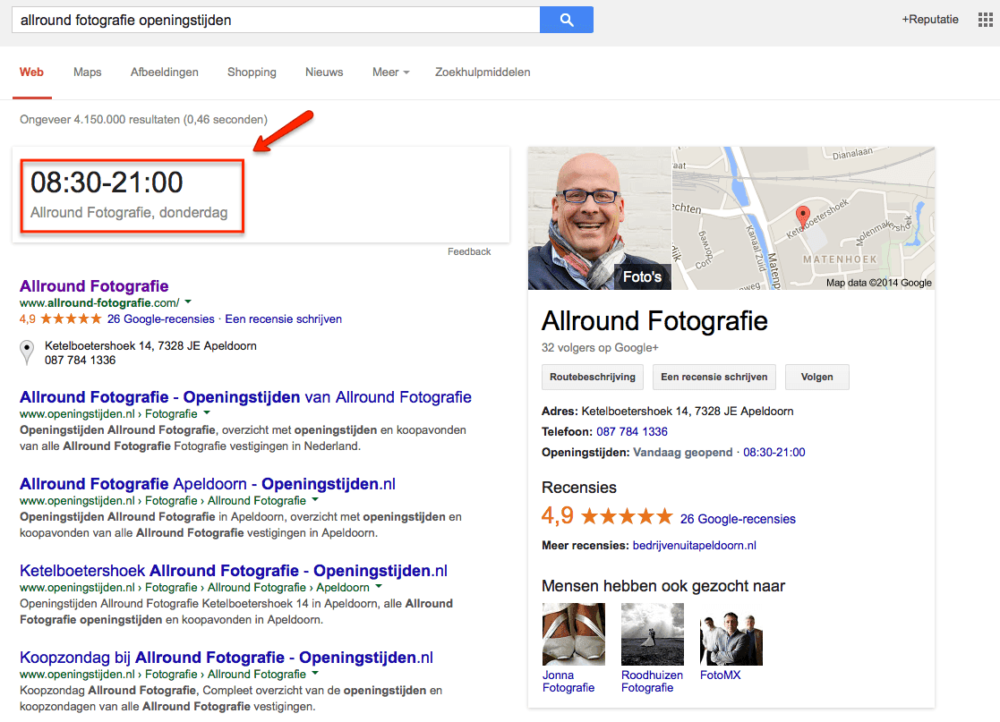
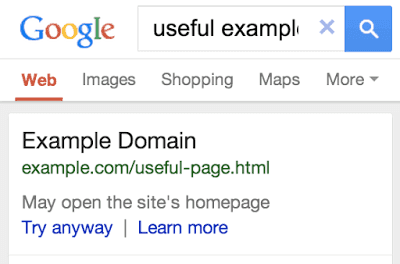
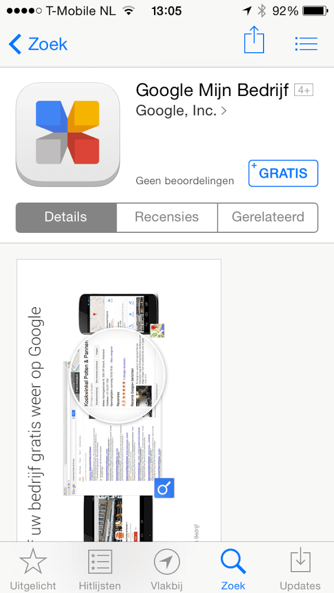
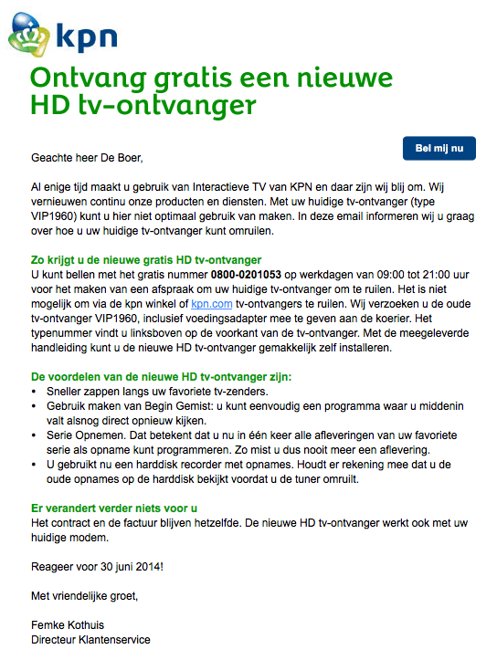

> **Historisch archief.** Deze aflevering verscheen op 26-06-2014 als onderdeel van ReputatieCoaching (2012–2016). De oorspronkelijke tekst is hieronder historisch bewaard. Diensten, contactgegevens, links, tools en adviezen kunnen inmiddels verouderd zijn.



**Transcriptiestatus:** Volledige transcriptie uit het oorspronkelijke archief.

***Historische afbeelding niet beschikbaar: ReputatieCoaching Podcast*
De zomer is officieel begonnen en binnenkort gaan veel mensen weer op vakantie. Zelf gaan we er in de tweede helft van juli ook een tweetal weken tussenuit. Maar geen zorg, ik zal je niet zonder content laten zitten. De publicatie van content gaat gewoon door!**

**Dan over deze 82e podcast. Er was weer veel nieuws deze week, dus ik heb weer een selectie moeten maken. Als eerste: geldt het recht om wereldwijd vergeten te worden nu ook in Canada? Ik vertel je daar zo meer over! Google begint nu overigens sites met een slechte mobiele ervaring af te straffen. Verder bracht Google eerder deze week de Google Mijn Bedrijf app voor iOS uit en nu kun je in de Pages app van Facebook ook berichten bewerken. Bovendien is Facebook haar algoritme aan het aanpassen… Zo wordt sindskort ook de kijkduur van video’s meegenomen in de ranking van video’s.**

**Oh, ik krijg trouwens af en toe de vraag welke podcasts ik zoal naar luister, dus dat zal ik zometeen “onthullen”… En als uitsmijter voor vandaag heb ik een grappige zeperd van KPN, die mij afgelopen week overkwam.**

Hallo en hartelijk welkom bij deze aflevering van de ReputatieCoaching Podcast. Mijn naam is Eduard de Boer, ook bekend als de ReputatieCoach. Dit is dé podcast die je moet beluisteren als je meer wilt leren over online reputatie en reputatiemanagement en ook als je wilt werken aan je online reputatie en je online vindbaarheid wilt verbeteren. Dit alles kan je helpen om jezelf beter op de online kaart te plaatsen, waardoor je als bedrijf meer business kunt doen.

Als persoon kun je met de diverse tips aan de slag om je online reputatie te verbeteren.

De podcast kun je vinden op [www.reputatiecoaching.nl/82](https://www.reputatiecoaching.nl/82/). Daar vind je niet alleen de tekst, maar ook video’s waar ik het in deze uitzending over heb, alsmede afbeeldingen, links enzovoorts. Bovendien is de podcast te beluisteren in [iTunes](https://www.reputatiecoaching.nl/itunes) en op [Stitcher](https://www.reputatiecoaching.nl/stitcher). Daar kun je je dus ook abonneren op de wekelijkse podcast. Veel mensen vinden het ideaal om de wekelijkse afleveringen van de podcast op hun gemak te beluisteren, terwijl ze autorijden.

Voordat ik overga op de onderwerpen voor vandaag, eerst nog even kort over het nieuwtje dat ik vorige week donderdagmiddag postte, over [Google, die de concurrentie aanging met online telefoongidsen en zelfs met telecom operators](https://www.reputatiecoaching.nl/google-concurrent-telefoongids-en-gouden-gids/). Welnu, het resultaat dat ik toen zag, is nog steeds te reproduceren:

[[Historische afbeelding: CLickable telefoonnummer in de zoekresultaten op Google](https://lh3.googleusercontent.com/-68v2vfsU7v4/U6LFXq0n71I/AAAAAAAAA8M/zlTf8hLYiSU/w1015-h874-no/20140619-telefoonnummer-ingelogd.png)](https://lh3.googleusercontent.com/-68v2vfsU7v4/U6LFXq0n71I/AAAAAAAAA8M/zlTf8hLYiSU/w1015-h874-no/20140619-telefoonnummer-ingelogd.png)

En ik kwam er toevallig achter dat als je niet zoekt op “telefoonnummer” en de bedrijfsnaam, maar op de bedrijfsnaam en het woord “openingstijden”, dan verschijnen ook de openingstijden voor vandaag in het groot:

[](https://lh5.googleusercontent.com/-sK35NhMcGk0/U6ug7P22zgI/AAAAAAAAA8w/235MjMPhs6Q/w1015-h733-no/20140626-openingstijden.png)

Alleen hier is natuurlijk geen click to call geactiveerd, want openingstijden is iets anders dan een telefoonnummer.

Dat alles nog niet vlekkeloos loopt is duidelijk te zien. Want zo verschijnt het telefoonnummer alleen in het groot, als je letterlijk zoekt op:

En de openingstijden verschijnen alleen als je letterlijk zoekt op:

Als je de volgorde van de woorden in die twee zoektermen omkeert, dan functioneert het niet.

## Praktische tip: save je documenten in de cloud!

*Historische afbeelding niet beschikbaar: CameraSync*
Van de week overkwam mij iets, wat je niet graag meemaakt: namelijk een crash van de harddisk in de computer. Gelukkig had ik nog een Time Machine backup van maximaal een uur oud en kon ik alles terughalen. Maar toen ging ik nadenken: wat zou iemand die geen Apple heeft, of wel een Apple computer heeft, maar Time Machine niet heeft ingesteld kunnen doen om zoiets te voorkomen?

Ik kwam op een simpele oplossing… Stel je gebruikt Dropbox, Google Drive, OneDrive of Box als je virtuele schijf in de cloud. Al die diensten slaan je documenten ook op je eigen harddisk op.

Save je document dan in de directory of folder die wordt gesynchroniseerd met je clouddrive en werk vanaf daar. Programma’s als Microsoft Word slaan met regelmaat je document op. En al die cloud drives synchroniseren ook heel vaak je bestanden weer met de cloud. Zo heb je niet alleen een versie op je harddisk, maar ook nog in de cloud. Dus als er dan iets gebeurt met je eigen harddisk, dan kun je altijd nog snel verder op bijvoorbeeld een andere computer, met de actuele versie die je dan uit de cloud kunt downloaden. Op die manier beperk je de ellende.

Laat ik dan nu overgaan op de onderwerpen voor vandaag…

## “Het recht om wereldwijd vergeten te worden” in Canada?

Een paar keer is het relatief nieuwe Europese “recht om online vergeten te worden” aan bod geweest in recente podcasts. Het Europese Hof heeft in dit kader bepaald dat Google en andere zoekmachines in de EU bepaalde persoonlijke content niet mag vertonen, als de betrokken individuen hiervoor een officieel verzoek indienen.

Zoals het er nu naar uitziet, zal Google die content die zij niet meer in de EU mag vertonen, wel gewoon in de rest van de wereld vertonen.

Een rechtbank in British Columbia, in Canada, gaat nog een stuk verder: die eist van Google dat wereldwijd een bepaalde groep van websites uit de zoekresultaten wordt verwijderd.

Hiermee komen natuurlijk vragen naar boven over hoever de macht van een rechtbank in een bepaald land over de landsgrenzen reikt om het grenzeloze Internet in te perken…

Als deze trend zich voortzet, lijkt het erop, dat de vrijheid van meningsuiting mogelijk in het gedrang komt. Wat gebeurt er als een Russische rechtbank eist dat Google verwijzingen naar bepaalde gay of lesbische websites verwijdert, of als Iran eist dat Israëlische websites uit de zoekresultaten moeten?

Hoever vind jij dat de overheid kan en mag gaan met dergelijke eisen? Ben jij bang dat de vrijheid van meningsuiting een eindige zaak is? Of vind je mogelijk dat Google teveel macht heeft en teveel gegevens verzamelt en daarom wel aan dit soort verzoeken gehoor moet geven? Laat het weten onderaan de show notes, op [www.reputatiecoaching.nl/82](https://www.reputatiecoaching.nl/82/).

## Google straft bedrijven met slechte mobiele gebruikerservaring

Al jaren roept Google dat je als webmaster continu moet werken aan het bieden van de beste gebruikerservaring, die maar denkbaar is. Dus je site moet optimaal presenteren en bovenal presteren op alle mogelijke apparaten, variërend van desktops en tablets, tot smartphones.

Daarvoor brengt Google webmaster richtlijnen uit en heeft het zelfs een dienst “[Pagespeed](https://developers.google.com/speed/pagespeed/)” ontwikkeld, waarmee je kunt testen hoe snel je site is en waar je je site mogelijk kunt verbeteren. Want snelheid is ook een belangrijke factor voor de algehele gebruikerservaring. Denk er maar eens over na: hoelang blijf jij wachten op een artikel of pagina, terwijl je naar een leeg wit scherm zit te staren? Meestal niet lang…

Dat is ook precies de reden dat Google waarde hecht aan snelle sites. Maar volgens Matt Cutts was de absolute laadsnelheid in seconden een tijdje terug nog geen echte ranking factor, maar keek Google voor ranking wel naar de laadsnelheid van sites in relatie tot die van soortgelijke sites. De video waar hij dit in vertelt heb ik nogmaals opgenomen in de show notes van deze podcast:

En wat nu in Noord-Amerika is waargenomen, is dat Google op mobiele apparaten waarschuwt als een specifieke pagina doorverwijst naar de homepage van een site. Dit is dus voor gebruikers een extra blokkade om door te kunnen, omdat ze een extra klik moeten uitvoeren.



Het lijkt erop alsof dit de eerste stap is van Google, om webmasters te laten zien dat het menens is voor wat betreft het mobiel geschikt maken van websites, volgens de webmaster richtlijnen van Google. En als je die niet volgt, kan dat dus ten koste gaan van je business.

Het mobiel maken van je site kan globaal op twee manieren. De eerste is een zogenaamde m-dot site te maken, een site die specifiek voor mobiele apparaten is. Google vindt dit niet prettig, omdat het twee sites moet crawlen en indexeren, in plaats van één en omdat slechts zo weinig bedrijven het correct hebben geïmplementeerd, kan het tot frustratie leiden bij gebruikers.

De andere manier is door gebruik te maken van responsive web design. Hierbij past de website zich automatisch aan, aan de mogelijkheden van het apparaat, waar de site op wordt bekeken. Dit is de voorkeursmethode, alhoewel Google dat niet letterlijk zegt. Feit is echter wel, dat één responsive website gemakkelijker te onderhouden is, dan een “normale” website in combinatie met een m-dot site.

Een bijkomend voordeel is dat responsive websites vaak een lagere bounce rate hebben, vanwege de betere gebruikerservaring.

De vraag is nu alleen wat de volgende factor wordt, waar Google rekening mee gaat houden in de rankings en de wijze waarop de sites worden vertoond. Zou het de laadsnelheid zijn? Zou Google dan laadtijden van webpagina’s niet alleen maar relatief ten opzichte van elkaar beoordelen, maar ook absoluut? Dat zou wel leiden tot een betere gebruikerservaring, want maar al te vaak moet ik voor mijn gevoel een aantal seconden wachten, tot een pagina is geladen. En als iedere webmaster nu impliciet wordt gedwongen om de snelheid te optimaliseren, dan hoef ik in elk geval minder lang te wachten!

## Google Mijn Bedrijf app voor iOS

[](https://lh5.googleusercontent.com/-iVhJGs82jy0/U6uigmBVG2I/AAAAAAAAA88/WGzIl3NVYus/w564-h1001-no/20140626-Google-Mijn-Bedrijf-app.png)Vorige week vertelde ik je over het vernieuwde bedrijfsportaal van Google, genaamd “Google Mijn Bedrijf”. Op dat moment had Google al wel de Mijn Bedrijf app voor Android gereed, maar stonden iOS-gebruikers nog in de kou. Inmiddels is de app voor iOS ook live gegaan in de iTunes AppStore.

Ik heb de app gedownload op mijn iPhone en het viel me op, dat ik helemaal niet hoefde in te loggen. Meteen werd mijn Gmail-account met bijbehorende foto getoond, waar ik op kon klikken, waarna ik de verschillende Google+ bedrijfspagina’s zag, waarvan ik beheerder ben.

De app ziet er verder goed uit en stelt je inderdaad in staat om alles van de Google Mijn Bedrijfspagina in te zien en te beheren. Als jij beheerder bent van één of meer Google Bedrijfspagina’s, dan kan ik je de app van harte aanraden.

## Facebook Pages Manager app vernieuwd

*Historische afbeelding niet beschikbaar: Bedrijfspagina maken op Facebook*
Grappig: Google komt met een app voor het beheren van bedrijfspagina’s, terwijl Facebook de app voor het beheren van pagina’s vernieuwt. Voorheen kon je in de app voor pagina’s geen berichten bewerken, maar die functionaliteit is nu eindelijk toegevoegd.

## Facebook neemt nu ook kijkduur mee in video’s

Verder over Facebook… Inmiddels kijken al tweemaal zoveel Facebookgebruikers video’s dan een half jaar geleden. Dat meldt Facebook zelf op haar site.

Voor het ranken van video’s is de kijkduur een belangrijke, zo niet de belangrijkste factor. Dat is in elk geval al geruime tijd zo op YouTube. Een paar dagen geleden [meldde Facebook op haar weblog dat zij nu ook de kijkduur van video’s meenemen in de ranking van video’s op de tijdlijn](https://newsroom.fb.com/news/2014/06/news-feed-fyi-showing-better-videos/).

Zo wil Facebook relevantere video’s in je tijdlijn kunnen bieden. Deze factor komt bovenop de factoren die voorheen al in beschouwing werden genomen, zoals likes, reacties en het aantal keren dat de video is gedeeld.

Deze verandering heeft betrekking op alle video’s die direct naar Facebook zijn geüpload en zijn dus niet van toepassing op video’s die je bijvoorbeeld vanaf YouTube deelt op Facebook.

Zo kan Facebook de tijdlijn nog beter personaliseren, waardoor bijvoorbeeld mensen die veel video kijken, ook meer video’s in hun tijdlijn aangeboden krijgen. En aan de andere kant krijgen mensen die nagenoeg geen video’s kijken, ook steeds minder video’s op hun tijdlijn te zien.

In het verleden heb ik al wel tientallen video’s naar Facebook geüpload, maar ben daar om welke reden dan ook mee gestopt. Voor mij is dit een signaal om video’s die ik in het verleden heb geüpload naar YouTube, toch ook maar eens te uploaden op Facebook, om te zien wat daar het effect van is. Het is gewoon een experimentje, zoals ik er zovele doe. Heb jij recente ervaringen met het posten van video’s op Facebook? Laat het me weten!

## Straft Panda 4.0 sites die CSS en Javascript blokkeren?

Vorige week publiceerde Joost de Valk, een bekende in WordPress-land (onder de naam “Yoast”), een artikel waarin hij stelt dat het blokkeren van Javascript en CSS een negatief effect heeft op de ranking van een site, na de invoering van Panda 4.0 door Google.

Zijn argumentatie is als volgt… Een relatie kwam bij hem, omdat de site een enorme daling in verkeer had doorgemaakt. In enkele dagen was het dagelijkse verkeer nog maar 1/3 van wat het was. Toen men de CSS en Javscript niet meer blokkeerde voor Google, was de site in afzienbare tijd terug in de zoekresultaten met bijna dezelfde verkeersvolumes. Samenvattend: het blokkeren van CSS en Javascript voor de zoekmachines resulteert in een negatief effect op je rankings.

Voorheen was het mogelijk om allerlei zaken te verbergen voor de zoekmachines, door trucs uit te halen met CSS en Javascript. Als de zoekmachinebots dan niet bij de CSS en Javascript code konden komen, dan zat je veilig. In het verleden was het mij ook al opgevallen dat Googlebot en andere bots daadwerkelijk CSS bestanden en Javascript files ophalen. Maar toen was het vermoeden nog, dat ze er niets mee deden.

Maar volgens diverse bronnen worden die bestanden tegenwoordig dus wel geautomatiseerd geïnspecteerd. En kan het dus gebeuren dat je gestraft wordt, doordat je foute dingen doet in je CSS of Javascript.

Zie dit niet meteen als een absoluut feit, want het wordt aan de andere kant door diverse specialisten tegengesproken. Maar het lijkt ook weer niet helemaal onwaar. In typisch vage Google stijl, vertelde de bekende John Mueller het volgende:

Wil hij nu zeggen dat als je de content blokkeert, dit een effect heeft binnen het nieuwe Panda algoritme? Of zegt hij dat als content geblokkeerd is, Google het niet kan zien en het dus geen effect heeft binnen Panda? Of kan het wel, of kan het geen impact hebben op Panda, omdat Panda gaat over content en mogelijk ook over layout?

Het wordt er niet duidelijker op. Wat gewoon wel als een paal boven water staat, is dat je, zoals ik altijd roep, waardevolle en unieke content moet blijven produceren, die door veel mensen graag wordt gelezen. En verder: joh, als je niets te verbergen hebt… Laat Google dan lekker de Javascript en CSS bestanden downloaden, als hen dat happy maakt… Zo simpel zie ik het!

## De podcasts waar ik naar luister

Een paar keer per maand krijg ik wel van iemand uit mijn omgeving de vraag welke podcasts ik beluister. Dus dat zal ik dan maar eens uit de doeken doen. Op zich is het niet spannend en sommige podcasts melden eigenlijk vaak alleen maar nieuws, dat ik al elders heb gelezen. De reden dat ik dan toch naar die podcasts luister, is om de persoonlijke touch, mening of visie van de presentator of presentatrice te horen. Dat maakt het dan dijwijls opeens wel interessanter!

OK, hier volgen de 16 podcasts waar ik naar luister in alfabetische volgorde:

```
  * [Content Marketing Podcast](https://itunes.apple.com/us/podcast/content-marketing-podcast/id592028918?mt=2)
  * [Content Warfare Podcast](https://itunes.apple.com/us/podcast/content-warfare-podcast-content/id542078865?mt=2)
  * [Edge of the Web Radio](https://itunes.apple.com/nl/app/edge-of-the-web-radio/id634471633?mt=8)
  * [SEO Podcast Unknown Secrets of Internet Marketing](https://itunes.apple.com/us/podcast/seo-podcast-unknown-secrets/id303672420?mt=2)
  * [High-Income Business Writing](https://itunes.apple.com/us/podcast/high-income-business-writing/id640055894?mt=2)
  * [Internet Marketing Podcast](https://itunes.apple.com/us/podcast/internet-marketing-insider/id168492891?mt=2)
  * [Local Marketing Source](https://itunes.apple.com/nl/podcast/local-marketing-industry-updates/id527098954?mt=2)
  * [Michelle MacPherson Show](http://www.michellemacphearson.com)
  * [Podcasting 101](https://itunes.apple.com/us/podcast/podcasting-101-social-media/id658693689?mt=2)
  * [Podcast Answer Man](https://itunes.apple.com/us/podcast/podcast-answer-man-podcasting/id208529334?mt=2)
  * [SEO 101 podcast](https://itunes.apple.com/us/podcast/seo-101/id280183060?mt=2)
  * [SEO DoJo Radio (aka “The Regulators”)](https://itunes.apple.com/us/podcast/seo-dojo-radio/id398892573?mt=2)
  * [Social Media Examiner](https://itunes.apple.com/us/podcast/social-media-marketing-podcast/id549899114?mt=2)
  * [Social Media Pubcast](https://itunes.apple.com/us/podcast/social-media-pubcast-by-jon/id529624849?mt=2)
  * [The Tropical MBA Podcast](https://itunes.apple.com/us/podcast/tropical-mba-entrepreneurship/id477451424?mt=2)
  * [This Old Marketing](https://itunes.apple.com/nl/podcast/pnr-this-old-marketing-content/id760760485?mt=2)
```

Ik heb ze in de show notes ook waar mogelijk gelinkt naar de desbetreffende pagina’s op iTunes, waar je er meer informatie over kunt vinden en je je meteen kunt abonneren.

## CRM KPN niet op orde: HD ontvanger voor 9 dagen!

Tja, Youp van ’t Hek heeft ooit T-Mobile natuurlijk flink in de picture gebracht, toen er een probleem was met het abonnement van zijn zoon. Zover wil ik het niet laten komen voor KPN, maar laat ik zeggen dat er bij KPN ruimte is voor het verbeteren van hun CRM, ofwel: Customer Relationship Management.

Ik ben sindskort voor mijn Internet, televisie en telefonie over van KPN op UPC. Dat scheelt me ruim € 15,- per maand, terwijl de snelheid die UPC me kan bieden, viermaal de snelheid is, die KPN me maximaal kon bieden. En speed rulez!!

Eerst liep mijn contract nog tot en met november 2014, maar omdat KPN de tarieven verhoogde gedurende mijn contractperiode, had ik het recht eerder bij KPN weg te gaan. Daar maakte ik natuurlijk meteen dankbaar gebruik van.

De aanmelding bij UPC verliep heel voorspoedig: ik werd adequaat geholpen aan de telefoon en in minder dan tien dagen nadat ik UPC had gebeld, was mijn Internet probleemloos over. De telefonie volgde een paar dagen later, overigens ook probleemloos.

Een dikke pluim voor UPC!

Het is niet alleen vanwege de soepele migratie, dat ze de pluim krijgen, maar ook voor hun goede communicatie. Ik ontving een serie van opeenvolgende mails met voorwaarden, bevestiging, inloggegevens enzovoorts. Alles werkte meteen “out-of-the-box”.

Mijn abonnement bij KPN loopt overmorgen af, op 28 juni. Ik had bewust wat speling genomen, voor het geval de Internetmigratie naar UPC problemen zou opleveren, want ik wilde immers niet zonder Internet zitten!

Op 19 juni jongstleden ontving ik een vriendelijke mail van KPN, die ik heb opgenomen in de show notes:

[](https://lh4.googleusercontent.com/--ye6aUa-KmI/U6ug7KACeeI/AAAAAAAAA8s/6m5JJhXo8U0/w544-h723-no/20140619-KPN-mailing.png)

Samengevat stond daarin dat KPN graag mijn gewone digitale TV-ontvanger wilde omruilen voor een nieuwe HD TV-ontvanger. Verder stond er nog de tekst:

Reageer voor 30 juni 2014!

En dat voor slechts 9 dagen? En hadden ze nu niet net het contract veranderd?

De mail was ondertekend door “Femke Kothuis”, Directeur Klantenservice van KPN. Ik denk dat zij er maar eens voor moet zorgen dat KPN verschillende systemen beter koppelt of de algemene CRM verbetert, om dit soort komische voorstellen (die hen ook nog eens geld kosten, om te versturen, op te laten halen enzovoorts!) in de toekomst niet meer uit te sturen.

## Twitter brengt tweets tot leven met animated GIFs

Nog even één nieuwtje, dat ik in de opening was vergeten aan te kondigen… Sinds goed en wel een week ondersteunt Twitter nu ook zogenaamde animated GIF-afbeeldingen. Dit kun je zien als een soort van filmpje, maar dan in het bestandsformaat van een afbeelding.

Dat is op zich bijzonder, want Twitter is natuurlijk ook de eigenaar van Vine, de service die je in staat stelt om video’s van maximaal 6 seconden te maken. En Vines hebben weer een ander bestandsformaat, dan animated GIF-afbeeldingen…

Het klinkt nogal technisch, maar het houdt in, dat je op Twitter nu bewegende afbeeldingen kunt posten.

Dit kon ook al een hele tijd op Google+ en Tumblr en natuurlijk gewoon op je eigen website. Ook Pinterest is overigens aan het experimenteren met ondersteuning voor animated GIFs.

Lees meer in de tweet die ik heb opgenomen in de show notes:

— Twitter Support (@Support) [18 juni 2014](https://twitter.com/Support/statuses/479307198901026816)

Met dit laatste nieuwtje over Twitter kom ik dan ook weer aan het einde van de podcast van vandaag. Ik hoop dat ik je weer nuttige en bruikbare informatie heb kunnen brengen. Laat me weten wat je van de podcast van vandaag vond en geef je reactie onderaan de show notes, op [www.reputatiecoaching.nl/82](https://www.reputatiecoaching.nl/82/).

Als je de podcast leuk vindt en je wilt nog meer op de hooge blijven, volg me dan ook op Twitter, via [@reputatiecoach1](https://twitter.com/reputatiecoach1).

Heb je inderdaad wat aan alle informatie die ik met je deel, help mij dan met het verder verbeteren en promoten van deze podcast. Surf daarvoor naar [iTunes](https://www.reputatiecoaching.nl/itunes) of [Stitcher](https://www.reputatiecoaching.nl/stitcher), geef de podcast een sterrenbeoordeling en laat ook je reactie achter. Door de podcast te beoordelen op iTunes en/of Stitcher breng je de podcast onder de aandacht van een breder publiek.

Je kunt me verder helpen, door de podcast aan te bevelen bij vrienden of collega’s, waarvan je denkt dat ze er hun voordeel mee kunnen doen, of door ’m te delen op Twitter, like’n en delen op Facebook of een “+1” te geven op Google+.

En vergeet niet: ik ben hier om je te helpen! Als je een vraag of een probleem hebt met betrekking tot je online reputatie of de vindbaarheid van je website, kun je een mailtje sturen naar [podcast@reputatiecoaching.nl](mailto:podcast@reputatiecoaching.nl).

Als je dat te lastig vindt, of als je de podcast beluistert terwijl je in de auto zit en je hebt acuut een vraag, spreek dan een boodschap in op de ReputatieCoaching Hotline, op nummer: 084 - 883 15 56. Mogelijk behandel ik je vraag of probleem dan in een artikel of in de podcast.

En je kunt ook rechtstreeks op de website een voicemail achterlaten, door op de tab aan de rechterkant van elke pagina te klikken, en je bericht in te spreken. Dit was [ReputatieCoaching Podcast aflevering 82](https://www.reputatiecoaching.nl/82/) en mijn naam is [Eduard de Boer](http://nl.linkedin.com/in/eduarddeboer/nl).

Ik wens je de komende week weer succes met het werken aan je reputatie, zodat je meteen je reputatie voor jou kunt laten werken!

Tot volgende week!

Doei!

Links naar content die in deze podcast aan bod komt:

```
  * [ReputatieCoaching Podcast in iTunes](https://www.reputatiecoaching.nl/itunes)
  * [ReputatieCoaching Podcast op Stitcher](https://www.reputatiecoaching.nl/stitcher)
  * [ReputatieCoaching Podcast RSS-feed](https://feeds.reputatiecoaching.nl/ReputatieCoachingPodcast)
  * “[Google Penalizing Sites for Poor Mobile Experience](http://www.location3.com/blog/google-mobile-warning/)” (Location3, 12 juni 2014)
  * “[B.C. court ruling orders Google to block sites worldwide](http://www.theglobeandmail.com/report-on-business/industry-news/the-law-page/bc-court-seeking-global-reach-orders-google-to-block-sites/article19212708/)” (The Globe and Mail, 17 juni 2014)
  * “[Google Panda 4, and blocking your CSS & JS]”[53](https://yoast.com/google-panda-robots-css-js/) (Yoast blog, 19 juni 2014)
  * “[News Feed FYI: Showing Better Videos](https://newsroom.fb.com/news/2014/06/news-feed-fyi-showing-better-videos/)” (Facebook newsroom, 23 juni 2014)
```
