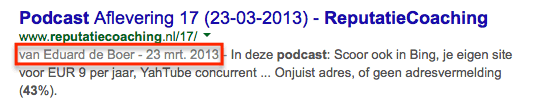
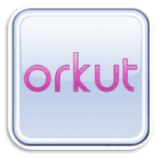
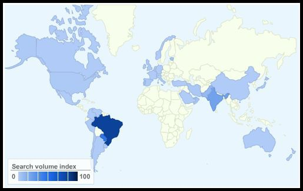
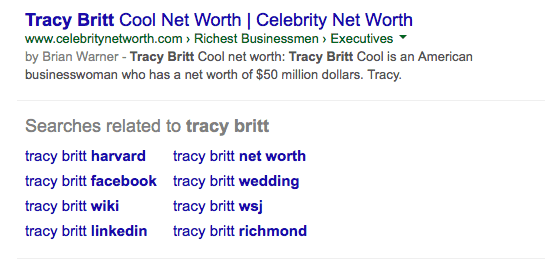
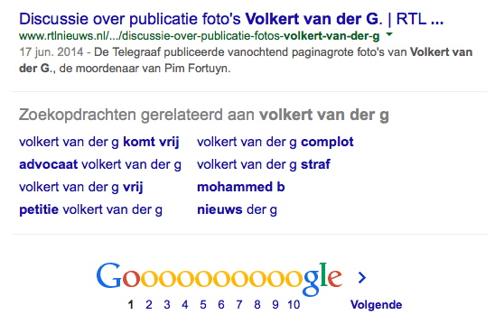
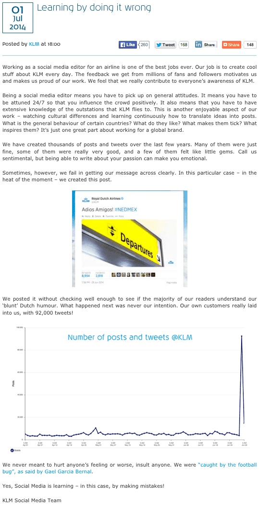

> **Historisch archief.** Deze aflevering verscheen op 3-07-2014 als onderdeel van ReputatieCoaching (2012–2016). De oorspronkelijke tekst is hieronder historisch bewaard. Diensten, contactgegevens, links, tools en adviezen kunnen inmiddels verouderd zijn.



**Transcriptiestatus:** Volledige transcriptie uit het oorspronkelijke archief.

***Historische afbeelding niet beschikbaar: ReputatieCoaching Podcast*
Ik begin deze podcast met een bericht van luisteraar Edwin. Daarna heb ik een update over Google Authorship, want sinds afgelopen week worden er geen auteurfoto’s meer vertoond bij de zoekresultaten. Ook stopt Google met Orkut en wordt het effect van het “Recht om te worden vergeten” zichtbaar in de zoekresultaten op Google. Verder maakte KLM ex-amigos na afloop van de wedstrijd Nederland-Mexico en als laatste heb ik vandaag weer een interview met Robert Spakman, één van de initiatiefnemers van MeetingRoomReview.com, over de vernieuwingen die het bedrijf recentelijk heeft doorgevoerd.**

Hallo en hartelijk welkom bij deze aflevering van de ReputatieCoaching Podcast. Mijn naam is Eduard de Boer, ook bekend als de ReputatieCoach. Dit is dé podcast die je moet beluisteren als je meer wilt leren over online reputatie en reputatiemanagement en ook als je wilt werken aan je online reputatie en je online vindbaarheid wilt verbeteren. Dit alles kan je helpen om jezelf beter op de online kaart te plaatsen, waardoor je als bedrijf meer business kunt doen.

Als persoon kun je met de diverse tips aan de slag om bijvoorbeeld je online reputatie als gezagvoerder, stewardess, purser, piloot, social media medewerker of wat dan ook bij de KLM te verbeteren.

De podcast kun je vinden op [www.reputatiecoaching.nl/83](https://www.reputatiecoaching.nl/83/). Daar vind je niet alleen de tekst, maar ook video’s waar ik het in deze uitzending over heb, alsmede afbeeldingen, links enzovoorts. Bovendien is de podcast te beluisteren in [iTunes](https://www.reputatiecoaching.nl/itunes) en op [Stitcher](https://www.reputatiecoaching.nl/stitcher). Daar kun je je dus ook abonneren op de wekelijkse podcast. Veel mensen vinden het ideaal om de wekelijkse afleveringen van de podcast op hun gemak te beluisteren, terwijl ze autorijden.

Vandaag begin ik dus met de vragen van een luisteraar. Edwin liet op het weblog een bericht achter bij [podcast 81](https://www.reputatiecoaching.nl/81/). Hij schreef het volgende:

Wellicht is het handig om tussen de verschillende items “iets” te doen waardoor je weet dat het over een nieuw onderwerp gaat. Je was in deze podcast bezig met een onderwerp en ging direct over naar een ander onderwerp. Nogal verwarrend als je niet in de gaten hebt dat het over een ander onderwerp gaat.

Daarnaast (kan ook aan mij liggen) lijkt het er op dat er steeds meer tijd in de standaardteksten gaat zitten. Bijvoorbeeld de aankondiging, inleiding, stuk aan het einde, waar je de podacst kan beluisteren etc. Ik heb hem niet getimed, maar voor het gevoel is daar wel een minuut of 5 mee gevuld over de hele 20 minuten podcast.

Cheers,

Edwin

Edwin, allereerst bedankt voor deze waardevolle feedback! Ik ben het helemaal eens met een soort van afscheiding tussen de verschillende onderwerpen. Want in de transcriptie van elke ReputatieCoaching Podcast heb ik wel telkens kopjes boven de verschillende onderwerpen om zo de leesbaarheid te vergroten, maar ik heb inderdaad geen audio-scheiding tussen de verschillende onderwerpen in de podcast!

De reden dat ik je reactie overigens vorige week nog niet heb behandeld, komt doordat ik een (volgens mij) goede sound wilde vinden om de verschillende onderwerpen in de podcast van elkaar te scheiden.

Zoals je hebt kunnen horen, heb ik eentje gevonden. Maar ik kan je wel vertellen dat ik er nog niet 100% tevreden over ben. Toegegeven, het is beter dan niets! Graag hoor of lees ik wat jij ervan vindt, Edwin, en ook wat de andere luisteraars ervan vinden.

Verhoogt dit de kwaliteit? Is het zo duidelijker dat ik overga op een ander onderwerp? Heb je eventueel suggesties voor een andere transitie tune? Laat het me weten en reageer onderaan de show notes van deze podcast, die je kunt vinden op [www.reputatiecoaching.nl/83](https://www.reputatiecoaching.nl/83/).

Dan als reactie op het tweede deel van je bericht, Edwin. Je zegt dat er steeds meer tijd gaat zitten in de standaardteksten. Als je hiermee doelt op het verschil in standaardteksten van de eerste paar podcasts en de huidige, dan geef ik je meteen gelijk!

Echter, volgens mij verschillen de standaardteksten van de laatste tientallen podcasts niet zoveel. Nu kun je me verwijten dat ik niet origineel ben, omdat ik steeds vrijwel dezelfde afsluiting heb. Ben ik het ook meteen mee eens. Mijn creativiteit schiet daarin tekort, dat geef ik toe. Mogelijk komt dit ook, doordat ik toch telkens zo’n beetje hetzelfde wil melden. Natuurlijk stel ik reviews op prijs, reacties, likes, shares, +1’s of als mensen de podcast delen met anderen! En jij als doorgewinterde luisteraar, Edwin, beseft dan ook meteen dat dat eigenlijk het einde is van de podcast en je dus kunt stoppen met luisteren.

Aan het begin vertel ik tegenwoordig eerst wat ik in de podcast allemaal behandel. Dit biedt (volgens mij) elke luisteraar de kans om de hele podcast meteen te stoppen, als er voor hem of haar niets interessants tussen lijkt te zitten. Dat scheelt tijd en wie weet ook zelfs wel ergernis!

OK, ik vertel wel over de podcast, voor wie die bedoeld is en wat je ermee kunt. Dat komt elke podcast terug. Maar dat heeft een reden. Een podcast is namelijk heel anders dan een blogpost. Als je een blogpost leest op een weblog, kun je met één muisklik naar een ander artikel springen, of naar de homepage enzovoorts. Dus je kunt veel interactiever door een site bewegen.

Veel mensen belanden vaak toevallig op een podcast, bijvoorbeeld als ze iets zoeken in iTunes of op Stitcher. Als je dan als podcaster niet duidelijk maakt, wat die persoon ermee kan, of voor wie de podcast bestemd is, dan is de kans groot dat die persoon niet eens verder gaat luisteren, omdat die denkt dat alle afleveringen van de podcast niet voor hem of haar zijn.

Dus om ook nieuwe luisteraars die bijna per toeval op een podcast stuiten hierover te informeren, is een deel van de opening elke keer hetzelfde of vrijwel hetzelfde. Zoals je hebt kunnen horen was de lijst met beroepen voor wie de podcast handig kan zijn deze keer heel specifiek. Dat wordt zometeen duidelijk, als het niet al meteen duidelijk was.

Praktische tip, Edwin: Veel podcatching apps hebben de mogelijkheid om met één druk op de knop bijvoorbeeld 10, 20 of 30 seconden vooruit te springen. Die is vaak speciaal voor dit soort punten in een podcast, of voor reclames, die ik er echter niet in heb en die ik er ook zeker niet in WIL hebben!

Ik snap ook wel, dat dat weer lastig kan zijn, terwijl je autorijdt. Dan moet je dat stukje toch maar gewoon accepteren. Sorry daarvoor! Ik hoop, dat ik je in elk geval duidelijk heb kunnen maken, dat ik het met een achterliggende reden doe.

Soms experimenteer ik met een soort van terugblik naar de vorige podcast. Dit doe ik bewust om nieuwe luisteraars die het volhouden om de eerste paar minuten te luisteren, te laten weten wat ik verder nog zoal behandel. Vaak pak ik dan iets uit een vorige uitzending, waar ik dan ook weer wat extra content of context aan toevoeg. Als je dit volslagen onzinnig vindt, hoor ik het ook graag!

Mijn doel is een podcast te maken die het grootste deel van de luisteraars waardeert, alhoewel ik me ervan bewust ben dat ik het nooit voor 100% van de luisteraars helemaal goed kan doen.

Ik maak de podcast voor jou, als luisteraar! Dus laat gerust je stem horen, net als Edwin, als je vindt dat ik sommige dingen volgens jou beter of anders kan doen. Daar sta ik echt voor open! Post je reacties, op: [www.reputatiecoaching.nl/83](https://www.reputatiecoaching.nl/83/).

## Google verwijdert foto’s bij Google Authorship

*Historische afbeelding niet beschikbaar: Google*
Dit was wel zo’n beetje het grootste nieuws van afgelopen week: de aankondiging van John Mueller van Google, dat Google om de “leesbaarheid van de zoekresultaten te vergroten”, de foto’s die ooit werden vertoond in het kader van Google Authorship, nu niet meer vertoont. Ook het aantal kringen waar een gebruiker in is opgenomen, wordt niet meer weergegeven:

Volgens Google heeft dit geen negatief effect op de zogenaamde CTR (dat staat voor “Click Through Rate”). Zelf denk ik hier wat genuanceerder over en was van mening dat het wel degelijk invloed had op het aantal click-throughs. Maar goed, we kunnen er lang en breed over uitweiden, maar dat leidt tot niets. De foto’s zijn verdwenen, punt uit!

Natuurlijk kan ik mij online gaan verenigen met mensen die hier vreselijk boos over zijn, als ik dat zou willen. Maar dat vind ik verspilde energie. Het staat Google vrij om de site en de interactie geheel conform haar eigen goeddunken in te richten.

Veel mensen die ik online zie klagen, zijn bang dat de negatieve gevolgen nog veel verder gaan en dat Google helemaal niets (meer) met Authorship wil of gaat doen. Ik denk echter dat dit niet het geval zal zijn. Autoriteit is iets, dat moeilijk te fake’n is. Dus, hoewel Google zegt hier in de zoekresultaten op dit moment nog geen gebruik van te maken, is de verwachting dat dit in de toekomst zeker zal worden gebruikt.

Als gevolg van deze actie moet ik mijn adviezen en ook de instructievideo en de argumentatie daarbij, nu gaan aanpassen… Want de foto’s gaan weg en niets lijkt erop te wijzen, dat ze ooit nog terugkomen. Maar dat zal de toekomst uitwijzen.

Google liet er in elk geval geen gras over groeien en binnen een paar dagen waren de foto’s inderdaad niet meer te zien… Voor niemand!

Als een artikel is geschreven door iemand die Google Authorship heeft geclaimd, wordt nog wel de tekst “van”, gevolgd door de naam van de auteur, vertoond.

[](https://lh4.googleusercontent.com/-_IcrCIxJUxk/U7RIThDI8-I/AAAAAAAAA9w/ztPvGmNWVfo/w557-h104-no/20140703-google-authorship.png)

Dit geeft maar eens temeer aan dat je nooit je business moet bouwen op basis van bepaalde features die bedrijven bieden. Als het aantal bezoeken van je site namelijk grotendeels afhankelijk was van de aanwezigheid van je profielfoto in de zoekresultaten, dan had je nu een groot probleem gehad.

Dat is dan ook precies de reden dat ik altijd benadruk dat je een soort van thuishaven moet hebben voor je eigen content, in de vorm van een website of weblog, die je zelf host, al of niet bij een hosting provider. Natuurlijk kan ook de hosting provider failliet gaan, maar ik ga ervan uit dat je toch echt wel regelmatig backups maakt van je website of weblog en die ergens anders bewaart, dan alleen maar op dezelfde webserver, als waar je website draait!

Laat dit incident ook weer een les zijn. Door alleen maar te bloggen op Facebook of Google+ of content te produceren op andere platformen, bouw je het fundament van je business op drijfzand.

## Google stop met Orkut


Dat het alleen maar focussen op sociale media desastreus kan uitpakken, realiseerden zich opeens afgelopen week ook de mensen en bedrijven die ooit hun aandacht en energie richtten op Orkut, een ander sociaal netwerk van Google, dat in het verleden voornamelijk populair was in Brazilië en India, totdat ook in die landen Facebook het netwerk in populariteit oversteeg.

In de show notes heb ik een afbeelding opgenomen, waarin je het gebruik van Orkut in de hoogtijdagen van omstreeks 2008 kunt zien:

[](https://lh4.googleusercontent.com/-YoHCgcOx3lc/U7RI4Nyv6sI/AAAAAAAAA-I/j_zOFurvraI/w515-h325-no/20140703-Orkut-world.jpg)

De top–5 landen waren toen:

```
  * Brazilië
  * Paraguay
  * India
  * Pakistan
  * Portugal
```

Ik ben van mening dat Google nu alle aandacht gaat richten op het verder promoten van Google+ in de hele wereld. Want per 30 september stopt Google met Orkut. Tot die tijd kunnen Orkut-gebruikers het systeem nog ten volle blijven gebruiken. Tot 26 september kunnen gebruikers via Google Takeout hun Orkut-data exporteren.

## ”Recht om vergeten te worden” zichtbaar in Google

Dat Google als eerste zoekmachine de mogelijkheid bood om pagina’s uit de zoekresultaten te verwijderen (of beter gezegd: niet meer in de EU te vertonen) was al bekend. Maar inmiddels is de implementatie ervan een feit.

Als je op Google zoekt op “Tracy Britt” (met dubbel ‘t’), dan wordt op de Nederlandse Google onderaan de pagina de tekst vertoond:

In de show notes heb ik hier ook een screenshot van opgenomen:

[](https://lh5.googleusercontent.com/-MKrrhqqehMM/U7RIUP52W9I/AAAAAAAAA9o/uKWRijKQ3p4/w558-h171-no/20140703-google-forgotten-nl.png)

Zoals ook al werd verwacht, voert Google deze beperking niet wereldwijd in. Want als je op de Amerikaanse site van Google zoekt, dan zie je helemaal niet een soortgelijke tekst. Dat kun je verifiëren in de tweede screenshot, die ik in de show notes op [www.reputatiecoaching.nl/83](https://www.reputatiecoaching.nl/83/) heb opgenomen:

[](https://lh4.googleusercontent.com/-BVywrny2QEI/U7RIUvciifI/AAAAAAAAA9g/xQWwSooKiAE/w558-h275-no/20140703-google-forgotten-us.png)

Het blijkt in elk geval dat Volkert van der G. ofwel nog geen gebruik heeft gemaakt van deze mogelijkheid in Google, of dat Google er nog niet aan is toegekomen om zijn verzoek te verwerken, zoals je kunt zien in de show notes:

[](https://lh5.googleusercontent.com/-3-Gmc8BEO2A/U7RIVLqPWLI/AAAAAAAAA9k/B_x748SEvEM/w558-h349-no/20140703-google-volkert-van-der-g.png)

## KLM maakt ex-amigos met omstreden tweet

KLM heeft in Zuid-Amerika met slechts één tweet maar liefst tienduizenden of honderdduizenden ex-vrienden gemaakt. Hiermee is de reputatie van KLM in Zuid-Amerika natuurlijk flink gedaald. Dit nieuws haalde wereldwijd de voorpagina’s van nieuwssites en traditionele gedrukte media.
Voor het geval je het hebt gemist: wat was er gebeurd? Meteen na de Nederlandse zege in de voetbalwedstrijd tussen Nederland en Mexico, postte KLM de volgende tweet:

Er werd een afbeelding bij gepost van een “Departures”-bord, zoals die overal op vliegvelden hangen, waarop ook nog eens een besnord figuurtje met een sombrero stond afgebeeld, in plaats van een opstijgend vliegtuig:

[](https://lh5.googleusercontent.com/-NV2Xnj59L10/U7RITsG0aAI/AAAAAAAAA94/AvborI0DNTk/w640-h360-no/20140703-adios-amigos-%2523nedmex-klm.jpg)

Het effect dat deze enkele tweet, bestaande uit een plaatje, twee woorden en een hastag had, werd treffend verwoord in een artikel in Trouw. Dit artikel had de titel: “Eén twittermisser en het is gedaan met je reputatie”

<http://www.trouw.nl/tr/nl/4492/Nederland/article/detail/3681538/2014/06/30/Een-twittermisser-en-het-is-gedaan-met-je-reputatie.dhtml>

Wereldwijd werd erover geschreven met titels, als:

```
  * “Mexicanen beledigd door tweet KLM”
  * “Adios Amigos #NEDMEX: KLM schießt ein Eigentor”
  * “Adios Amigos: Flugline KLM verärgert Mexikaner”
  * “KLM Airlines posts racist tweet after Mexico’s World Cup loss”
  * etc.
```

Binnen afzienbare tijd werd de tweet weer offline genomen, maar toen was het leed al geleden. Als gevolg van deze actie moest KLM tijdelijk extra personeel inzetten om alle online vragen te beantwoorden en excuses aanbieden aan mensen die zich gekwetst voelden door die ene tweet.

Onder de gekwetse personen was ook acteur Garcia Bernal. Hij tweette na het lezen van de omstreden tweet het volgende naar zijn bijna 2 miljoen volgers:

Later bood hij online excuses aan. KLM liet echter nogal op zich wachten met een openbaar excuus. Dat kwam pas op dinsdag 1 juli om 18:00 uur. In het bericht “Learning by doing it wrong” zegt KLM geblunderd te hebben:

[](https://lh6.googleusercontent.com/-oCSNVuTLRAY/U7RITn-ZyhI/AAAAAAAAA9s/ax_Tg1frpZo/w489-h956-no/20140703-adios-amigos-%2523nedmex-klm-apologies.png)

Het artikel sluit af met de tekst:

Tot zover over de commotie rond die ene tweet van KLM.

## Interview met Robert Spakman over de vernieuwde MeetingRoomReview

In oktober vorig jaar had ik Robert Spakman van het bedrijf Rooomer (met drie o’s) in de show, omdat Rooomer toen net was begonnen met de dienst [MeetingRoomReview.com,](http://www.meetingroomreview.com) een site voor het verzamelen van reviews voor vergaderlocaties. Dat was in [podcast 46](https://www.reputatiecoaching.nl/46/).

[*Historische afbeelding niet beschikbaar: MeetingroomReview.com*](http://www.meetingroomreview.com)

Inmiddels zijn we zo’n acht maanden verder en ik ben benieuwd te vernemen hoe het nu met het bedrijf en de dienstverlening gaat. Volgens mij gaat het goed, want ik las recentelijk dat de dienstverlening en de doelgroep enorm is uitgebreid. Waar eerst alleen vergaderlocaties zichzelf op MeetingRoomReview konden presenteren, kunnen nu ook bedrijven zoals cateraars, bedrijfsfotografen en andere gerelateerde dienstverleners reviews verzamelen op MeetingRoomReview.com.

Om hier meer over te horen heb ik vandaag Robert Spakman weer in de show, die ons als het goed is meer kan vertellen over de vernieuwde MeetingRoomReview.

*Historische afbeelding niet beschikbaar: MeetingRoomReview-square*
In de show notes vind je de vragen die ik Robert dit keer heb gesteld, maar als je zijn antwoorden wilt horen, dan moet je toch echt de podcast beluisteren…

```
  1. Robert, leuk om je na zo’n acht maanden weer eens in de show te hebben. De vorige keer dat we elkaar spraken, waren jullie koud begonnen en hadden jullie enkele honderden bedrijven die actief reviews verzamelden via MeetingRoomReview.com. Hoe gaat het nu met het bedrijf? Kun je iets vertellen over wat er zoal is gebeurd in de afgelopen acht maanden?
  2. Sinds vorige week stellen jullie andere bedrijven dan vergaderlocaties, maar die wel zijn gerelateerd aan de vergaderbranche, ook in de gelegenheid om zich aan te melden op jullie site voor het verzamelen van reviews. Hoe is dat zo gekomen?
  3. Ik vind het een meesterlijk idee om zo je scope en doelgroep te verbreden en toch binnen de vergaderbranche te blijven. Wat voor andere bedrijven hebben zich inmiddels zoal aangemeld?
  4. Zijn er voor deze gerelateerde bedrijven ook kosten aan verbonden om zich aan te melden? En zo ja, wat krijgen bedrijven daarvoor terug?
  5. Jullie dienstverlening gaat nu natuurlijk een stuk verder dan alleen maar vergaderlocaties, ofwel “MeetingRooms”. Het lijkt me dat de bedrijfsnaam “MeetingRoomReviews” daarmee mogelijk wat op losse schroeven komt te staan, omdat de vlag de lading niet meer helemaal dekt. Wordt het tijd voor een stukje rebranding? Zo ja, wanneer staat dit op de planning?
  6. Op zich natuurlijk leuk zo’n uitbreiding, maar die hele rebranding zal wel een hele impact hebben, vooral voor bestaande klanten. Want als jullie overgaan op een andere domeinnaam, heeft dit niet alleen zoekmachinetechnisch fikse implicaties. Dat lijkt mij overigens nog het minst complex. Maar bovenal moeten de bestaande klanten natuurlijk worden geïnformeerd, die moeten andere HTML-code gaan gebruiken op hun site, andere kaartjes en posters laten drukken, enzovoorts. Hebben jullie al een soort van draaiboek hiervoor, voor de huidige klanten?
  7. De laatste vraag: wat kunnen we de komende tijd nog meer aan vernieuwingen of uitbreidingen verwachten? Of wil je daar niet teveel over uitweiden, om zo de concurrentie voor te blijven?
```

Nou Robert, wederom bedankt voor je toelichting en antwoorden. Ik wens jullie de komende tijd veel succes met alles wat er op jullie afkomt! En natuurlijk blijf ik jullie op de voet volgen!

Tot zover het interview met Robert Spakman van [MeetingRoomReview.com](http://www.meetingroomreview.com).

## Komende tijd meer interviews!

Dit was dan weer eens een interview en zoals ik een tijdje geleden al heb toegezegd, ga ik nu meer mensen interviewen. Op dit moment heb ik negen verzoeken uitgestuurd, waarvan er al zeven hebben toegezegd. De andere twee hebben nog niet gereageerd.

De eerste vier personen die instemden met een interview, heb ik ter voorbereiding al een lijst met vragen gestuurd. En het eerste interview staat al gepland voor morgenochtend 10:00 uur. Wie dat is, verklap ik nog even niet… Maar ik kan je verzekeren dat het een autoriteit is op het gebied van online marketing.

Nou, als alles zo voorspoedig verloopt en iedereen meewerkt, kun je gedurende de zomermaanden dus daadwerkelijk diverse interviews verwachten.

Waar ik wel benieuwd naar ben, is wat jou het meeste aanspreekt: alleen maar nieuws, alleen interviews, of een combinatie van beide? Of vind je dat ik interviews apart moet publiceren, los van het nieuws en de tips die ik in de podcast presenteer? Geef je mening onderaan de show notes, op [www.reputatiecoaching.nl/83/](https://www.reputatiecoaching.nl/83/).

Dan kom ik hiermee aan het einde van deze 83e podcast en begin ik met de standaard afkondiging, waar ik elke podcast mee afsluit. Als je die al kent, kun je nu dus rustig stoppen met luisteren…

Als je de podcast leuk vindt en je wilt nog meer op de hooge blijven, volg me dan ook op Twitter, via [@reputatiecoach1](https://twitter.com/reputatiecoach1).

Heb je inderdaad wat aan alle informatie die ik met je deel, help mij dan met het verder verbeteren en promoten van deze podcast. Surf daarvoor naar [iTunes](https://www.reputatiecoaching.nl/itunes) of [Stitcher](https://www.reputatiecoaching.nl/stitcher), geef de podcast een sterrenbeoordeling en laat ook je reactie achter. Door de podcast te beoordelen op iTunes en/of Stitcher breng je de podcast onder de aandacht van een breder publiek.

Je kunt me verder helpen, door de podcast aan te bevelen bij vrienden of collega’s, waarvan je denkt dat ze er hun voordeel mee kunnen doen, of door ’m te delen op Twitter, like’n en delen op Facebook of een “+1” te geven op Google+.

En vergeet niet: ik ben hier om je te helpen! Als je een vraag of een probleem hebt met betrekking tot je online reputatie of de vindbaarheid van je website, kun je een mailtje sturen naar [podcast@reputatiecoaching.nl](mailto:podcast@reputatiecoaching.nl).

Als je dat te lastig vindt, of als je de podcast beluistert terwijl je in de auto zit en je hebt acuut een vraag, spreek dan een boodschap in op de ReputatieCoaching Hotline, op nummer: 084 - 883 15 56. Mogelijk behandel ik je vraag of probleem dan in een artikel of in de podcast.

En je kunt ook rechtstreeks op de website een voicemail achterlaten, door op de tab aan de rechterkant van elke pagina te klikken, en je bericht in te spreken. Dit was [ReputatieCoaching Podcast aflevering 83](https://www.reputatiecoaching.nl/83/) en mijn naam is [Eduard de Boer](http://nl.linkedin.com/in/eduarddeboer/nl).

Ik wens je de komende week weer succes met het werken aan je reputatie, zodat je meteen je reputatie voor jou kunt laten werken!

Tot volgende week!

Doei!

Links naar content die in deze podcast aan bod komt:

```
  * [ReputatieCoaching Podcast in iTunes](https://www.reputatiecoaching.nl/itunes)
  * [ReputatieCoaching Podcast op Stitcher](https://www.reputatiecoaching.nl/stitcher)
  * [ReputatieCoaching Podcast RSS-feed](https://feeds.reputatiecoaching.nl/ReputatieCoachingPodcast)
```
