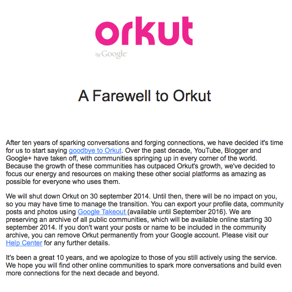
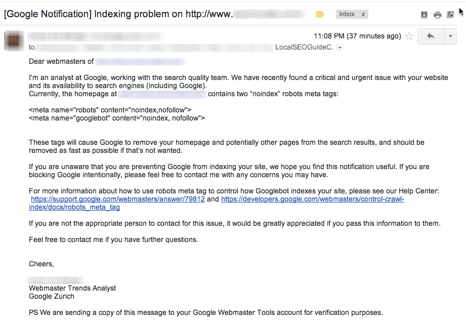
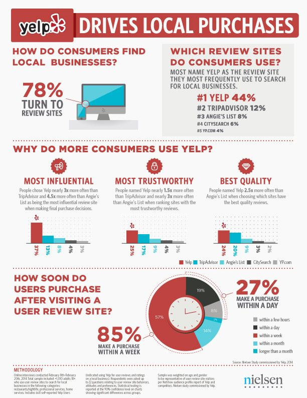
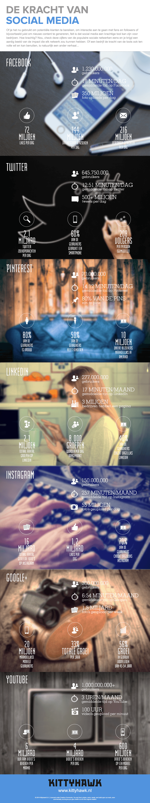

> **Historisch archief.** Deze aflevering verscheen op 10-07-2014 als onderdeel van ReputatieCoaching (2012–2016). De oorspronkelijke tekst is hieronder historisch bewaard. Diensten, contactgegevens, links, tools en adviezen kunnen inmiddels verouderd zijn.



**Transcriptiestatus:** Volledige transcriptie uit het oorspronkelijke archief.

***Historische afbeelding niet beschikbaar: ReputatieCoaching Podcast*
De onderwerpen voor vandaag… Ik begin met een tip, naar aanleiding van een website scan die ik twee weken geleden heb uitgevoerd, gevolgd door een korte terugblik op en de reden van het verdwijnen van de Authorship foto’s uit de zoekresultaten. Dan heb ik een update over Orkut: afgelopen week kreeg ik een mailtje van dit terminale sociale netwerk. Google is niet alleen maar slecht en ze proberen echt niet het leven van webmasters alleen maar zuur te maken, dat bewijst wel een mailtje later in de show.**

**Volgens onderzoeksbureau Nielsen is Yelp de meest betrouwbare review site, zegt Yelp. Verder heb ik een leuke tip over videomarketing en video SEO op YouTube en de resultaten van een onderzoek naar het gebruik en de invloed van reviews uit Noord-Amerika. Ter informatie heb ik een kort topic over Instagram en ik sluit de podcast van vandaag af met actuele getallen van het gebruik van de grote social media sites.**

Hallo en hartelijk welkom bij deze aflevering van de ReputatieCoaching Podcast. Mijn naam is Eduard de Boer, ook bekend als de ReputatieCoach. Dit is dé podcast die je moet beluisteren als je meer wilt leren over online reputatie en reputatiemanagement en ook als je wilt werken aan je online reputatie en je online vindbaarheid wilt verbeteren. Dit alles kan je helpen om jezelf beter op de online kaart te plaatsen, waardoor je als bedrijf meer business kunt doen.

Als persoon kun je met de diverse tips aan de slag om bijvoorbeeld je online reputatie als garderobejuffrouw, fluitenbouwer, acrobaat, grafoloog, klokkenmaker of wat dan ook te verbeteren.

De podcast kun je vinden op [www.reputatiecoaching.nl/84](https://www.reputatiecoaching.nl/84/). Daar vind je niet alleen de tekst, maar ook video’s waar ik het in deze uitzending over heb, alsmede afbeeldingen, links enzovoorts. Bovendien is de podcast te beluisteren in [iTunes](https://www.reputatiecoaching.nl/itunes) en op [Stitcher](https://www.reputatiecoaching.nl/stitcher). Daar kun je je dus ook abonneren op de wekelijkse podcast. Veel mensen vinden het ideaal om de wekelijkse afleveringen van de podcast op hun gemak te beluisteren, terwijl ze autorijden, schaatsen op de kunstijsbaan, hardlopen in het bos of al hijgend, zwetend en puffend zichzelf afmatten in de sportschool.

Oh, voordat ik begin met de onderwerpen van vandaag eerst even een praktische tip, naar aanleiding van een scan van een website, die ik twee weken geleden heb uitgevoerd.

Ik was dus gevraagd door een bedrijf om een scan te doen van hun website, om zo met verbeteradviezen te komen, over hoe zij hun online presence verder kunnen verstevigen en nog meer rendement uit hun website kunnen halen.

Naast een aantal andere waarnemingen vond ik er eentje, die echt heel erg was… Te erg voor woorden eigenlijk… En ik weet zeker dat bij de mensen van het bureau dat de website heeft gemaakt, het schaamrood op de kaken staat, als ze dit te horen krijgen van de directeur/eigenaar van het bedrijf van wie de site is…

Aan het begin van de analyse ging ik eens kijken hoeveel pagina’s er nu daadwerkelijk in de index van Google waren opgenomen. Daartoe typte ik in Google:

`site ‘dubbele punt’ gevolgd door de domeinnaam`

Al bladerend door de resultaatpagina’s van Google, zag ik dat er alleen Nederlandstalige pagina’s waren geïndexeerd. En dus waren ook alleen de Nederlandse pagina’s vindbaar, terwijl de site wel een grote hoeveelheid Engelstalige content had, omdat het bedrijf internationaal zaken doet! Dat verbaasde me hogelijk!

Eerst ging ik kijken of er iets was met de file ‘robots.txt’, waarin normaal wordt aangegeven dat zoekmachines, ook wel “robots” genaamd, bepaalde delen van een website niet mogen bezoeken. Echter, de ‘robots.txt’ file bevatte slechts het volgende:

`User-agent: *`
`Disallow: /Admin`

Dat wilde dus zeggen dat alle zoekmachines werden geacht alleen de directory “/Admin” niet te bezoeken, dus daar kon het ook niet aan liggen.

Bij nader zoeken bleek dat in het header-gedeelte van het Engelstalige deel van de site de volgende regels waren opgenomen:

`<meta name="robots" content="NOINDEX,NOARCHIVE,NOFOLLOW" />```

De eerste regel wil zeggen dat zoekmachines de content niet mogen indexeren, niet cachen en ook links op de pagina niet mogen volgen. De tweede regel is een oude tag, waarbij voor Google wordt aangegeven dat de pagina niet gecached mag worden. Met andere woorden: alleen al door de eerste regel doen zoekmachines helemaal niets met deze pagina: ze volgen verder geen links en ze indexeren dus ook de inhoud niet, waardoor die dus helemaal niet vindbaar is bij zoekopdrachten die normaal wel deze pagina zouden moeten opleveren!

## Terugblik op het einde van de Authorship foto’s

*Historische afbeelding niet beschikbaar: Google*
Nog even een korte terugblik naar Google+ Authorship en het verdwijnen van de foto’s van de auteurs in de zoekresultaten. Ik las een artikel op het weblog van “WordStream, met de titel ”[Google Calls Takebacks on Authorship Photos: An Alternate Theory](http://www.wordstream.com/blog/ws/2014/07/07/google-authorship)". Ik wil niet het hele artikel behandelen, maar slechts één aspect ervan. Dat gaat over de reden, waarom Google hoogstwaarschijnlijk de foto’s uit de zoekresultaten heeft verwijderd.

Volgens Rand Fishkin, een bekende in de wereld van zoekmachineoptimalisatie, heeft Google de foto’s verwijderd, omdat het de aandacht van de advertenties afleidde en Google dus minder omzet draaide uit de advertenties. Het aantal kliks op een pagina is namelijk aardig constant en als je de kliks naar de foto’s wegneemt, neemt het aantal kliks naar advertenties weer toe. Zo maakt Google dus weer meer omzet en zijn de aandeelhouders weer tevreden, omdat ze een stijging zien in de waarde van de aandelen en natuurlijk het later uitgekeerde dividend.

Dit lijkt een beetje op de simpele oplossing die een tandpastafabrikant jaren geleden heeft toegepast om meer tandpasta te verkopen. Doel van het bedrijf was om de omzet met 30% te laten stijgen… De beste financiële consultants werd gevraagd naar plannen, ideeën, suggesties, tips enzovoorts. Er werd een vermogen uitgegeven aan allemaal brainstormsessies en dergelijke.

Tot iemand van de werkvloer met het idee kwam om de opening van de tube, waar de tandpasta uitkomt, met 30% te vergroten… Mensen knijpen immers altijd een evenlange streep tandpasta op hun tandenborstel, ongeacht de dikte…

## Terugblik op Orkut

En vorige week vertelde ik ook dat Orkut opgeheven zou worden. Dat klopt. Eerder deze week ontving ik een mailtje hierover, die ik in de show notes heb opgenomen:

[](https://lh5.googleusercontent.com/-cnOJjfgxYqM/U74UiOSQZcI/AAAAAAAAA_A/9G0tWHhZi8E/s600-no/20140710-Exit-Orkut.png)

Laat ik dan nu overgaan op de onderwerpen voor vandaag…

## Google wordt persoonlijk en wil echt het beste voor webmasters

Veel mensen die werkzaam zijn in de wereld van de zoekmachineoptimalisatie denken dat Google alleen maar het slechte voor heeft met webmasters… Vaak hoor of lees je teksten in de trant van “Google is evil”.

Ik ga er maar van uit dat Google echt datgene als hoogste doel heeft, wat alle kopstukken ook altijd verkondigen: het vertonen van de beste, meest relevante zoekresultaten op basis van de vraag van de gebruiker.

Maar Google deelt niet altijd alleen maar penalties uit en probeert ook niet elke webmaster continu het leven zuur te maken. Dat bleek uit een leuk artikeltje met als titel “[The Night Google Took Pity On A Client…](http://www.localseoguide.com/the-night-google-took-pity-on-a-client/)”, dat ik las op Loc@l Seo Guide, de website van Andrew Shotland. Daarin werd geschreven dat een bevriende webmaster een nieuwe versie van een website online had gezet, waarna hij een mail kreeg van Google met daarin de volgende tekst:

[](https://lh6.googleusercontent.com/-zlm0xVIDK18/U74UiCgJDCI/AAAAAAAAA_M/bxoI52425w0/w921-h634-no/20140710-Google-Notification.png)

Dat is toch wel heel bijzonder, dat een medewerker van Google dat persoonlijk laat weten aan de webmaster in kwestie. Jammer genoeg deed Google dat niet voor het Engelstalige gedeelte van de site van de opdrachtgever, waar ik het zojuist over had.

## “Yelp meest betrouwbaar”, volgens Nielsen

*Historische afbeelding niet beschikbaar: Logo Yelp*
In het weblog van Yelp werd eerder deze week een artikel gepubliceerd met als titel “[Nielsen Survey Says…Consumers Rank Yelp Most Influential, Most Trustworthy, and with Highest Quality Reviews](http://officialblog.yelp.com/2014/07/nielsen-survey-saysconsumers-rank-yelp-most-influential-most-trustworthy-and-with-highest-quality-re.html)”. Dat is best een stoer statement, vind ik.

Het bekende onderzoeksbureau Nielsen heeft vorig jaar ook al naar Yelp en het gedrag van haar gebruikers gekeken. Toen werd het volgende geconstateerd:

```
  * Vrijwel alle Yelp-gebruikers (98%) heeft aan aankoop gedaan bij een business die ze hebben gevonden op Yelp, waarvan bijna 90% ervan binnen een week.
  * 4 van de 5 Yelp gebruikers zoeken in Yelp, omdat ze een product of dienst willen kopen
  * Yelp gebruikers zoeken op Yelp naar alles van restaurants tot sauna’s, van hotels tot slotenmakers en alles daar tussenin.
```

Dit jaar heeft Nielsen Yelp met een aantal van origine Amerikaanse sites met elkaar vergeleken, te weten:

```
  * TripAdvisor
  * Angie’s List
  * CitySearch
  * YellowPages (YP)
```

De centrale vraag in het onderzoek was: “Hoe verhoudt Yelp zich tot andere online review sites?”.

Het antwoord was: Vergeleken met TripAdvisor, Angie’s List en andere lokale directories, geven gebruikers aan dat ze Yelp het meest bezoeken, wanneer ze lokale bedrijven zoeken. De reden hiervoor is, dat ze Yelp zien als de meest invloedrijke, meest betrouwbare site met reviews van hoge kwaliteit.

Bijvoorbeeld als mensen op zoek zijn naar een restaurant, dan zoeken ze 3x vaker op Yelp, dan op OpenTable, een grote restaurant-site en 4x vaker dan op Zagat.

In de show notes heb ik een infographic opgenomen, waarin de resultaten worden weegegeven:

[](https://lh3.googleusercontent.com/-aCoc8Z7_6z8/U74UiN90BCI/AAAAAAAAA_I/-bqaeFJy_7c/w612-h792-no/20140710-Yelp-statistieken.jpg)

Ook bleek uit het onderzoek dat 84% van de consumenten reviews van gebruikers het belangrijkste vinden van review sites, gevolgd door 77% die sterren het belangrijkste vinden, evenals natuurlijk de adresgegevens, openingstijden en locatie op de kaart. Yelp blinkt hierin uit, vooral als je kijkt naar de kwaliteit van de data.

Later in de show heb ik overigens nog meer statistieken over reviews voor je. Dus als dat je interesseert, blijf dan gerust luisteren!

## Videomarketing en video SEO op YouTube

*Historische afbeelding niet beschikbaar: YouTube*
YouTube is ontegenzeggelijk de op één na grootste zoekmachine en bovendien ook nog eens eigendom van Google, waardoor de video’s van YouTube ook een belangrijke rol spelen in de pagina’s met de zoekresultaten. Natuurlijk toont Google ook video’s van andere platformen, maar de verwachting is, dat het haar eigen ecosysteem (in dit geval: YouTube) voorrang geeft, ook al is dit niet als zodanig toegegeven.

Een tijdje geleden heb ik de mensen die zich hebben geabonneerd op de mailinglist informatie in de vorm van een document en een video beloofd, met daarin al mijn kennis over hoe ik ervoor zorg dat video’s hoog in de zoekresultaten komen. Ik zou deze samenstellen op basis van een training over video SEO, die initieel gepland stond in begin juli. Maar deze training is verschoven naar 3 september, dus mocht jij je nog niet hebben ingeschreven, dan kun je dat nog steeds doen. En mocht je je al wel hebben ingeschreven en wachten op deze kennis, dan moet ik helaas zeggen: “Sorry… Nog even geduld a.u.b.”.

Mijn planning is om dit document samen te stellen na afloop van de training, zodat ik alle actuele informatie er dan in kan verwerken, evenals mogelijke vragen van de cursisten. Hij komt er dus echt aan, alleen dan wat later.

Maar wist je trouwens dat YouTube een gigantisch omvangijke omgeving heeft, waar je van alles kunt leren over het publiceren en ranken van video’s op YouTube? Surf maar eens naar:

Je kunt er alles lezen over de programma’s en tools van YouTube, evenals over analytics. Maar wat helemaal interessant en leerzaam is, is de [YouTube Creator Academy](https://www.youtube.com/yt/creators/education.html). De link hier naartoe vind je in de show notes, op [www.reputatiecoaching.nl/84](https://www.reputatiecoaching.nl/84/). Daar vind je bijvoorbeeld de volgende cursussen:

```
  * Core building blocks (5 lessen)
  * Grow your audience (10 lessen)
  * The art of getting viewers (5 lessen)
  * Earn money (3 lessen)
  * Measure your succes (5 lessen)
  * Engage your fans (8 lessen)
```

Het mooie is dat al deze cursussen online zijn en ook nog eens dat ze helemaal GRATIS zijn. Je kunt ze dus volgen in je eigen tempo en in je eigen tijd, zonder ook maar een cent te hoeven betalen. Ook vind je daar een enorme hoek, waar honderden supportvragen worden beantwoord. Dus de kans is groot, dat als jij een vraag hebt, deze daar al beantwoord is.

Daarnaast heb je ook nog het [YouTube Help Forum](https://productforums.google.com/forum/#!forum/youtube), dat je in de Google productforums kunt vinden. Ook deze link heb ik in de show notes opgenomen.

Als je goed oplet en alle waardevolle kennis die je daar opdoet toepast in de praktijk, dan heb je al een voorsprong op de meerderheid van de online marketeers die maar plompverloren video’s uploaden naar YouTube. Zelf heb ik me voorgenomen al deze cursussen binnenkort ook te bekijken. Alle leuke en nuttige nieuwe dingen die ik daar leer, zal ik natuurlijk ook weer met jou delen, zodat jij er ook je voordeel mee kunt doen.

Tot zover over de [YouTube Creator Hub](https://www.youtube.com/yt/creators/).

## 88% van de consumenten vertrouwt online reviews evenveel als persoonlijke aanbevelingen

*Historische afbeelding niet beschikbaar: Reviews*
Op de site van BrightLocal las ik een artikel over een onderzoek dat zij heeft uitgevoerd over hoe consumenten denken over reviews. Dit is al het vierde jaar dat ze dit onderzoek doen. Voor het onderzoek zijn 5.000 mensen benaderd en daarvan hebben 2.104 mensen gereageerd. 90% daarvan kwam uit de USA en 10% kwam van Canada. Het is dus niet helemaal toegespitst op Europa, of laat staan op Nederland, maar we kunnen er wel belangrijke punten uit leren. Dat is de reden dat ik het hier met je deel.

Vier jaar geleden werden slechts twee vragen gesteld, terwijl dit jaar een vragenlijst met 13 vragen was samengesteld. Ik wil deze vragen eerst met je delen, voordat ik de belangrijkste bevindingen van het onderzoek behandel.

**Gebruik van reviews**

```
  1. Hoevaak heb je in de laatste 12 maanden het internet gebruikt om een lokaal bedrijf te vinden?
  2. Kies het type bedrijf dat je hebt gezocht in de afgelopen 12 maanden (markeer zoveel als je wilt)
  3. Lees je online reviews van klanten, om te bepalen of een bedrijf een goed bedrijf is of niet?
  4. Welke van deze type bedrijven heb je online reviews over gelezen? (markeer zoveel als je wilt)
```

**Vertrouwen en invloed**

```
  1. Hoeveel online reviews moet jij lezen, voordat je het gevoel hebt dat je een bedrijf kunt vertrouwen?
  2. Hoeveel sterren is te WEINIG voor jou, om nog zaken te willen doen met een bedrijf?
  3. Welke invloed hebben online reviews van klanten op je mening over een lokaal bedrijf?
  4. Vertrouw je online reviews evenveel als persoonlijke aanbevelingen?
  5. Als je positieve reviews leest, wat is dan over het algemeen de volgende stap die je doet?
```

**Reputatiekenmerken**

```
  1. Voor welke van deze typen lokale bedrijven is voor jou “reputatie” het belangrijkst, als je een bedrijf kiest? (kies maximaal 3)
  2. Welke van de volgende “reputatiekenmerken” is voor jou het BELANGRIJKST wanneer je een lokaal bedrijf kiest om zaken mee te doen?
```

**Aanbevelen**

```
  1. Heb je in de afgelopen 12 maanden een lokaal bedrijf aanbevolen aan mensen die je kent op één van de onderstaande wijzen? (kies zoveel als je wilt)
  2. Welke van deze factoren zouden jou stimuleren om een lokaal bedrijf aan te bevelen bij mensen die je kent?
```

Je moet het artikel, waarvan ik de link in de show notes heb opgenomen, maar eens nalezen voor alle details. In deze podcast behandel ik een paar interessante resultaten van dit onderzoek.

```
  * 57% van de consumenten heeft in het afgelopen jaar 6x of meer. online gezocht naar een lokaal bedrijf
  * 15% zoekt bijna dagelijks online naar een lokaal bedrijf
  * 38% van de mensen zoekt online naar een tandarts, tegenover 58% die een restaurant of café zoekt en 34% die een kledingwinkel zoekt.
  * Maar liefst 88% van de consumenten lezen reviews om de kwaliteit van een lokaal bedrijf te beoordelen.
  * En 85% van de geïnterviewden leest maar liefst tot 10 reviews, voor ze de indruk hebben dat ze een bedrijf kunnen vertrouwen.
  * 92% gebruikt een lokaal bedrijf als het vier sterren heeft en toch nog 72% wil zaken doen met een bedrijf dat drie sterren heeft. Maar dan zakt het snel: slechts 27% wil zakendoen met een bedrijf dat twee sterren heeft en 13% met een bedrijf dat slechts één ster heeft.
  * Slechts 10% negeert reviews volledig, terwijl 72% van de consumenten zei dat positieve reviews bijdragen aan meer vertrouwen in een lokaal bedrijf.
  * 88% van de consumenten vertrouwen online reviews evenveel als persoonlijke aanbevelingen.
  * Voor 47% van de mensen is de reputatie van een tandarts het belangrijkst. Restaurants voor 46%, hotels voor 30%, evenals garages en autodealers.
  * 61% heeft via mond-tot-mond reclame een lokaal bedrijf aanbevolen bij anderen, 37% op Facebook, 13% op Yelp, 12% op Twitter en 10% op Google+.
```

Dit waren in korte tijd een heleboel getallen en percentages. Ik raad je echt aan om het artikel op de site van Brightlocal erop na te lezen, als je meer details wilt. Daar staan ook heel goede analyses van de resultaten.

Als jij slechts de volgende twee resultaten onthoudt die volgens mij het belangrijkste zijn, dan vind ik het al goed:

```
  1. 85% van de mensen leest tot maar liefst 10 reviews
  2. 92% gebruikt een lokaal bedrijf dat vier sterren heeft
```

Reden dat deze twee percentages zo belangrijk zijn, zit in twee andere cruciale resultaten van het onderzoek, namelijk:

```
  1. 88% van de mensen lezen online reviews om de kwaliteit van een lokaal bedrijf te beoordelen
  2. 88% van de mensen vertrouwen online reviews evenveel als persoonlijke aanbevelingen
```

Wow! Dat zijn nog eens getallen! En wat kun je nu daadwerkelijk hieruit leren en hiermee doen? Volgens mij moet je het volgende doen: zorg dat je op zoveel mogelijk review sites tenminste 10 reviews scoort en een gemiddelde van vier sterren.

## Instagram verplaatst 20 miljard foto’s

Op Wired las ik een leuk artikel over Instagram. Zoals je weet is Instagram sinds 2012 eigendom van Facebook. Maar sinds de oprichting van Instagram in 2010 maakt het al gebruik van het Amazon S3 cloudopslag platform, voor de opslag van alle foto’s.

Amazon S3 is een kostbare aangelegenheid, zeker als je veel data hebt op te slaan en ook nog eens als je als bedrijf zelf over goedkopere opslagmogelijkheden beschikt in je eigen datacenters in de wereld. Dus vond Facebook het tijd om de foto’s te verhuizen van Amazon S3 naar de datacenters van Facebook zelf.

Het hele proces heeft ongeveer een jaar geduurd en door allerlei technische trucs is het Facebook gelukt alle 20 miljard foto’s over te halen, zonder dat de 200 miljoen Instagram gebruikers er iets van hebben gemerkt.

Wow! Over een migratie gesproken…

## Social media van vandaag de dag in getallen

Zojuist had ik het over het aantal foto’s in Instagram. Maar wist je dat daar elke dag 55 miljoen foto’s bijkomen?! Dat is toch haast amper voor te stellen! In de show notes heb ik een infographic opgenomen met daarin een aantal getallen van de grote social media sites, te weten:

```
  * Facebook
  * Twitter
  * Pinterest
  * LinkedIn
  * Instagram
  * Google+
  * YouTube
```

Deze infographic is samengesteld door [Kittyhawk](http://www.kittyhawk.nl), een bekend Nederlands Internetadviesbureau.

[](https://lh4.googleusercontent.com/-CMaU4CRc17k/U74UjBPlKmI/AAAAAAAAA_U/9uSkGK0zIsY/w850/20140710-social-media-statistieken-door-kittyhawk.png)

Bekijk de infographic eens op je gemak op de site, op [www.reputatiecoaching.nl/84](https://www.reputatiecoaching.nl/84/). Voor jou als luisteraar van de podcast zal ik een paar statistieken opnoemen:

```
  * Qua omvang: Facebook heeft 1,2 miljard gebruikers, YouTube ook meer dan 1 miljard, Twitter 645 miljoen, Google+ 300 miljoen, LinkedIn 277 miljoen, Instagram 150 miljoen en Pinterest 70 miljoen
  * Gebruikers zitten per dag gemiddeld 18 minuten op Facebook, 12:51 op Twitter en 14:12 op Pinterest. Daarentegen zijn ze gemiddeld 17 minuten per _maand_ op LinkedIn, 257 minuten per maand op Instagram, 6:54 op Google+ en 3 uur per maand op YouTube.
  * Eerder deze podcast noemde ik ook al YouTube. Daar wordt op dit moment gemiddeld 100 uur aan videomateriaal per minuut geupload en wordt 6 miljard uur aan video’s per maand gekeken. Dagelijks worden in totaal 4 miljard video’s bekeken, waarvan 600 miljoen op een mobiel.
```

Dat zijn nog eens getallen! Moet je eens nagaan wat die bedrijven aan achterliggende infrastructuur nodig hebben, om dit allemaal te kunnen faciliteren!

Als je de podcast leuk vindt en je wilt nog meer op de hoogte blijven, volg me dan ook op Twitter, via [@reputatiecoach1](https://twitter.com/reputatiecoach1).

Heb je inderdaad wat aan alle informatie die ik met je deel, help mij dan met het verder verbeteren en promoten van deze podcast. Surf daarvoor naar [iTunes](https://www.reputatiecoaching.nl/itunes) of [Stitcher](https://www.reputatiecoaching.nl/stitcher), geef de podcast een sterrenbeoordeling en laat ook je reactie achter. Door de podcast te beoordelen op iTunes en/of Stitcher breng je de podcast onder de aandacht van een breder publiek.

Je kunt me verder helpen, door de podcast aan te bevelen bij vrienden of collega’s, waarvan je denkt dat ze er hun voordeel mee kunnen doen, of door ’m te delen op Twitter, like’n en delen op Facebook of een “+1” te geven op Google+.

En vergeet niet: ik ben hier om je te helpen! Als je een vraag of een probleem hebt met betrekking tot je online reputatie of de vindbaarheid van je website, kun je een mailtje sturen naar [podcast@reputatiecoaching.nl](mailto:podcast@reputatiecoaching.nl).

Als je dat te lastig vindt, of als je de podcast beluistert terwijl je in de auto zit en je hebt acuut een vraag, spreek dan een boodschap in op de ReputatieCoaching Hotline, op nummer: 084 - 883 15 56. Mogelijk behandel ik je vraag of probleem dan in een artikel of in de podcast.

En je kunt ook rechtstreeks op de website een voicemail achterlaten, door op de tab aan de rechterkant van elke pagina te klikken, en je bericht in te spreken. Dit was [ReputatieCoaching Podcast aflevering 84](https://www.reputatiecoaching.nl/84/) en mijn naam is [Eduard de Boer](http://nl.linkedin.com/in/eduarddeboer/nl).

Ik wens je de komende week weer succes met het werken aan je reputatie, zodat je meteen je reputatie voor jou kunt laten werken!

Tot volgende week!

Doei!

Links naar content die in deze podcast aan bod komt:

```
  * [ReputatieCoaching Podcast in iTunes](https://www.reputatiecoaching.nl/itunes)
  * [ReputatieCoaching Podcast op Stitcher](https://www.reputatiecoaching.nl/stitcher)
  * [ReputatieCoaching Podcast RSS-feed](https://feeds.reputatiecoaching.nl/ReputatieCoachingPodcast)
  * [YouTube Creator Academy](https://www.youtube.com/yt/creators/education.html)
  * [YouTube Help Forum](https://productforums.google.com/forum/#!forum/youtube)
  * “[How Facebook Moved 20 Billion Instagram Photos Without You Noticing](http://www.wired.com/2014/06/facebook-instagram/)” (Wired, 26 juni 2014)
  * “[Local Consumer Review Survey 2014](http://www.brightlocal.com/2014/07/01/local-consumer-review-survey-2014/)” (BrightLocal, 1 juli 2014)
  * “[Nielsen Survey Says…Consumers Rank Yelp Most Influential, Most Trustworthy, and with Highest Quality Reviews](http://officialblog.yelp.com/2014/07/nielsen-survey-saysconsumers-rank-yelp-most-influential-most-trustworthy-and-with-highest-quality-re.html)” (Yelp official blog, 7 juli 2014)
  * “[Google Calls Takebacks on Authorship Photos: An Alternate Theory](http://www.wordstream.com/blog/ws/2014/07/07/google-authorship)” (The WordStream Blog, 7 juli 2014)
  * “[The Night Google Took Pity On A Client…](http://www.localseoguide.com/the-night-google-took-pity-on-a-client/)” (Loc@l SEO Guide, 8 juli 2014)
```
