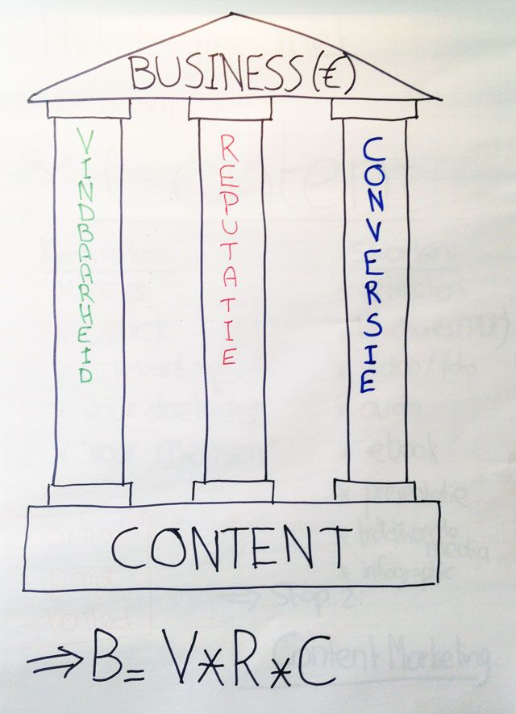
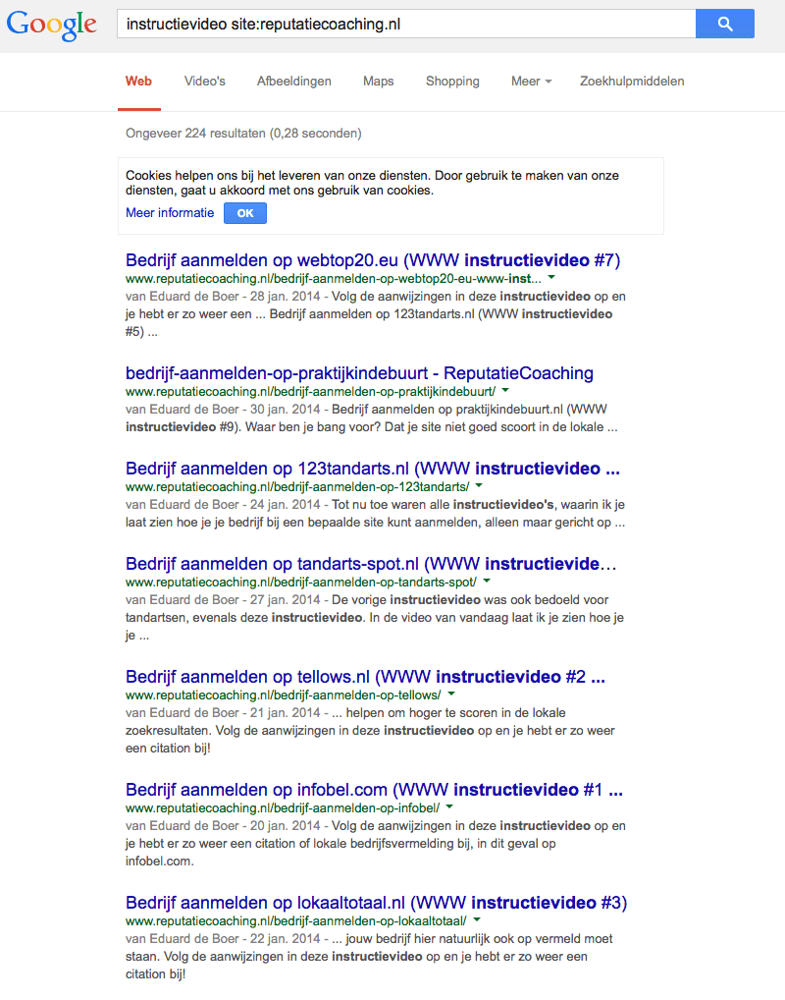
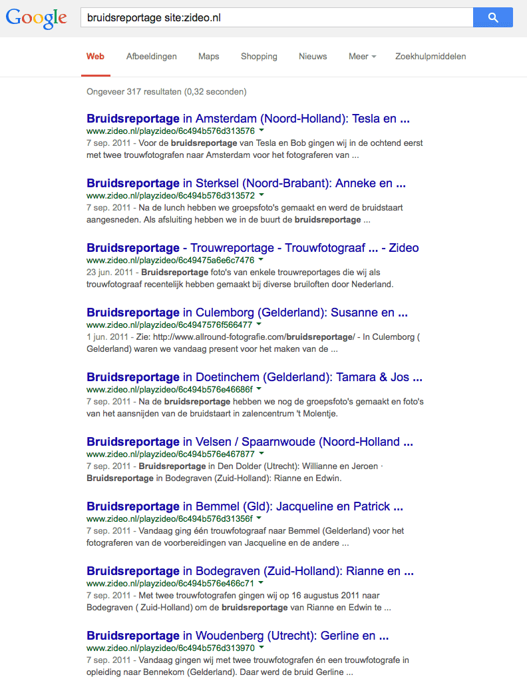
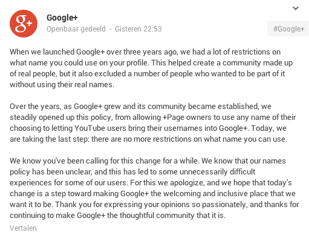
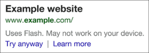
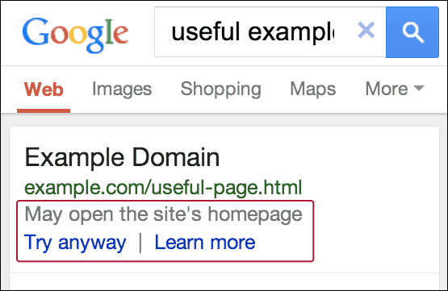
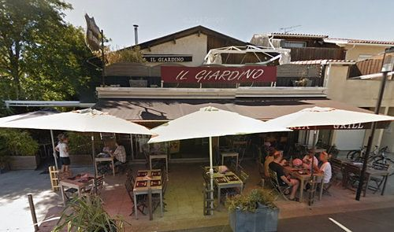
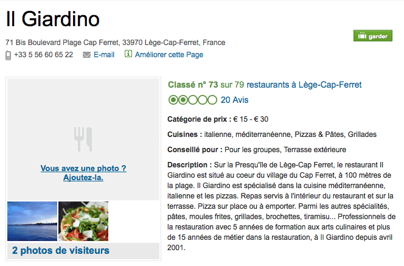
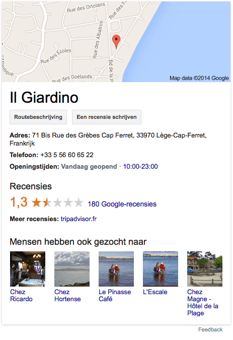
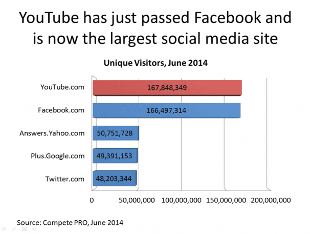

> **Historisch archief.** Deze aflevering verscheen op 17-07-2014 als onderdeel van ReputatieCoaching (2012–2016). De oorspronkelijke tekst is hieronder historisch bewaard. Diensten, contactgegevens, links, tools en adviezen kunnen inmiddels verouderd zijn.

**Transcriptiestatus:** Volledige transcriptie uit het oorspronkelijke archief.

***Historische afbeelding niet beschikbaar: ReputatieCoaching Podcast*
In de show vandaag begin ik met een korte terugblik op de podcast van vorige week en dan in het bijzonder op het verdwijnen van de Authorship profielfoto’s uit de zoekresultaten en problemen met de ‘robots.txt’-file. Als tweede heb ik, net als vorige week, weer een praktijktip, gebaseerd op een concreet probleem dat ik afgelopen week heb opgelost. Aan het begin van deze week heb ik een presentatie gegeven aan de leden van de JCI, de Juniorkamer in Apeldoorn; daarover zo meer. Ik heb vandaag drie nieuwtjes over Google: er worden veel minder video thumbnails in de organische resultaten vertoond, op Google+ mag je nu elke gewenste gebruikersnaam kiezen en Google gaat op mobiele apparaten sites met Flash ontraden. Verder moest een Franse blogger € 2.500 betalen na het posten van een negatieve review. Tenslotte is Facebook niet meer de meest populaire social media site in de VS.**

Hallo en hartelijk welkom bij deze aflevering van de ReputatieCoaching Podcast. Mijn naam is Eduard de Boer, ook bekend als de ReputatieCoach. Dit is dé podcast die je moet beluisteren als je meer wilt leren over online reputatie en reputatiemanagement en ook als je wilt werken aan je online reputatie en je online vindbaarheid wilt verbeteren. Dit alles kan je helpen om jezelf beter op de online kaart te plaatsen, waardoor je als bedrijf meer business kunt doen.

Als persoon kun je met de diverse tips aan de slag om bijvoorbeeld je online reputatie als columnist, ergotherapeut, heilsoldaat, acrobaat, bankdirecteur of wat dan ook te verbeteren.

De podcast kun je vinden op [www.reputatiecoaching.nl/85](/nl/archief/reputatiecoaching/085/). Daar vind je niet alleen de tekst, maar ook video’s waar ik het in deze uitzending over heb, alsmede afbeeldingen, links enzovoorts. Bovendien is de podcast te beluisteren in [iTunes](https://web.archive.org/web/*/https://www.reputatiecoaching.nl/itunes) en op [Stitcher](https://web.archive.org/web/*/https://www.reputatiecoaching.nl/stitcher). Daar kun je je dus ook abonneren op de wekelijkse podcast. Veel mensen vinden het ideaal om de wekelijkse afleveringen van de podcast op hun gemak te beluisteren, terwijl ze autorijden.

## Terugblik op podcast 84

Vorige week in [podcast 84](/nl/archief/reputatiecoaching/084/) vertelde ik je over een artikel van WordStream, waarin werd verondersteld dat Google de Authorship profielfoto’s heeft verwijderd om zo meer kliks te genereren op de advertenties. Dat was toen een vermoeden.

Inmiddels heeft WordStream aangetoond dat het verwijderen van de profielfoto’s een verhoging in CTR op de advertenties realiseert van 44,8%! Moet je voorstellen wat dit voor effect heeft op de advertentieinkomsten van Google! Die worden opeens bijna anderhalf keer zo groot! (Dat is tenminste, als je ervan uitgaat dat andere factoren ongewijzigd blijven).

Nou, wat zullen de aandeelhouders aan het einde van het derde kwartaal blij zijn met de sterk “toegenomen” advertentieinkomsten!

In de podcast van vorige week had ik het ook over het probleem met de file ‘robots.txt’. Ik was je helemaal vergeten te vertellen dat je in Google Webmaster Tools een tool hebt om je [robots.txt file te testen](https://www.google.com/webmasters/tools/robots-testing-tool):

[[Historische afbeelding: robots.txt voor http://www.allround-fotografie.com/](https://lh5.googleusercontent.com/vTl58_u-U33HZRtVTuUHa2U3bJYew3kNUnF1eF_Izeg=w827-h700-no)](https://lh5.googleusercontent.com/vTl58_u-U33HZRtVTuUHa2U3bJYew3kNUnF1eF_Izeg=w827-h700-no)

Mijn advies is om die eens te testen op je site. Kleine toevoeging ten aanzien van het probleem van vorige week: dat zou met deze tool alsnog niet aan het licht zijn gekomen, omdat de NOINDEX, NOFOLLOW, NOARCHIVE in de HTML-code van alle Engelstalige pagina’s stond.

## Geen reviewsterretjes met meer dan 9.900 reviews?

Een paar dagen geleden had ik weer een leuke uitdaging, die mij echter eerst de nodige hoofdbrekens heeft gekost om te ontdekken. Sterker nog, de uitdaging stond al een paar weken. Een bedrijf had mij gevraagd, waarom van één bepaalde website geen reviewsterretjes in de zoekresultaten werden vertoond, terwijl ze via een legitieme reviewsite meer dan 9.900 reviews hadden! De ironie van het verhaal was, dat alle andere sites, waar ze ook duizenden reviews hebben, wel werden vertoond met de reviewsterretjes.

Ik heb de pagina’s bekeken… De onderliggende HTML bekeken… En ook heb ik een paar keer de pagina’s geïnspecteerd met behulp van de Rich Snippets Testing Tool van Google, een online tool, waarmee je kunt controleren of je rich snippets, zoals bijvoorbeeld de reviewsterren, of individuele reviews, recepten, kalenderevenementen en dergelijke, goed op je site hebt geïmplementeerd.

Eerst dacht ik, dat het kwam, doordat het wel erg veel reviews waren en dat Google mogelijk fraude vermoedde en daarom de sterretjes niet vertoonde. Maar na enig speurwerk vond ik heel veel andere sites met zulke aantallen reviews, of zelfs met meer reviews. Dus de kans dat het daar aan lag, was nihil.

Vorige week donderdagmiddag keek ik er weer eens naar en opeens vielen de spreekwoordelijke “schellen” van mijn ogen en dacht ik de oorzaak te hebben gevonden! Het viel mij op, dat op de voorpagina van de site de reviewstatistieken tweemaal in de onderliggende HTML-code waren opgenomen en op alle achterliggende pagina’s slechts eenmaal.

Toen bleek dat voor alle achterliggende pagina’s de sterretjes wel werden vertoond in de zoekresultaten. Dus spitte ik verder…

Ik had natuurlijk al gezien dat de Rich Snippets Testing Tool voor de voorpagina geen sterretjes vertoonde. Dus kopieerde ik de HTML-code van de voorpagina en verwijderde één stuk code voor de reviews, om daarna de HTML-code weer te testen.

En opeens werd de pagina volgens de Testing Tool wél weer met sterren vertoond! Dus was volgens mij het probleem opgelost. Ik heb teruggecommuniceerd waar de oorzaak van het probleem zat en de opdrachtgever kan nu zelf de code laten aanpassen, zodat de sterren wel weer in de zoekresultaten naar voren komen! En weer was een opdrachtgever dolblij!

Wat leren we hieruit? Nou ja, op zich niet veel. Google houdt niet van dubbele content, dat hoor je zo langzamerhand wel te weten. Als je dat combineert met de uitspraak van Google van een paar maanden geleden, waar het bedrijf aangaf rich snippets extra aandacht te geven en mogelijk zo’n 15% minder laten vertonen… Dan snap je dat dit toch wel werd gezien als een vorm van spamming van de zoekresultaten!

Zojuist heb ik de site nog even gecontroleerd, maar het probleem zit er nog steeds.

Laat ik dan nu overgaan op de onderwerpen voor vandaag…

## Presentatie aan JCI

Afgelopen maandagavond heb ik een presentatie gegeven aan de leden van de JCI, de Juniorkamer van Apeldoorn over content en contentmarketing in relatie tot vindbaarheid, reputatie en conversie.

De presentatie was buiten in de tuin van één van de leden, dus ik kon geen projector gebruiken, omdat die nog te weinig intensiteit hebben om buiten goed te functioneren. Dus heb ik de presentatie uitgewerkt en op een retro-achtige manier gegeven, namelijk met behulp van een aantal pagina’s op een flip-over.

[](https://lh3.googleusercontent.com/-gs_OoSMdJQw/U8kET-Yee5I/AAAAAAAABCE/oB9y_ctNHNY/w640-h885-no/20140714-flipover.jpg)

Gisteravond heb ik de audio-opnames ontvangen, dus ik zal deze binnenkort verwerken tot een presentatie.

## Google verwijdert nu ook video thumbnails

Google gaat weer een stap verder met het opschonen van de zoekresultaten! Want nadat een paar weken geleden de Authorship foto’s zijn verdwenen, verdwijnen nu de video thumbnails in de zoekresultaten. Het bijzondere is dat bij YouTube video’s, evenals bij die van Vimeo en Dailymotion nog wel previews worden vertoond.

Maar voorheen werden ook previews vertoond van video’s op Wistia (een Engelstalige site), op zideo.nl (een Nederlandse site) en andere. Maar in elk geval zijn de previews op Wistia en Zideo nu verdwenen in de gewone zoekresultaten. Als je specifiek op “Video’s” zoekt, dan worden ze nog wel vertoond.

In de show notes heb ik twee screenshots opgenomen om dit te illustreren:

[](https://lh6.googleusercontent.com/-cnm8fmJWLVM/U8kE7FFoigI/AAAAAAAABCg/v9n07E_-1Uc/w792-h1028-no/20140717-zideo-1.png)

[](https://lh6.googleusercontent.com/-1CgM8XMTqrQ/U8kE6paSZHI/AAAAAAAABCY/miu1Y0bRjDc/w787-h979-no/20140717-zideo-2.png)

Het kan natuurlijk zijn dat Google gewoon een update aan het doorvoeren is, maar ik denk dat ze haar eigen video’s van YouTube meer voorrang gaat geven.

Als je dit combineert met wat ik eerder vertelde over het verbluffende effect dat het verwijderen van de Authorship foto’s uit de zoekresultaten had op de Click Through Rate van de advertenties, dan wordt het helemaal duidelijk.

Want de meeste YouTube video’s zijn ook voorzien van advertenties. Dus als Google door het weglaten van de video thumbnails van andere videoplatformen meer bezoekers naar YouTube trekt in plaats van naar die “andere” videosites, dan komt dit de omzet van Google ook meer ten goede.

## Google versoepelt eisen voor namen op Google+ en YouTube

Eerder deze week maakte Google bekend dat zij gebruikers de volledige vrijheid geeft voor het kiezen van een eigen gebruikersnaam op Google+ en alle gerelateerde diensten. Op het eerste gerzicht lijkt dit een vreemde move, temeer daar Google juist drie jaar geleden de harde eis neerlegde, dat iedereen zijn of haar eigen naam moest gebruiken en dat allerhande fancy namen niet meer waren toegestaan.

Twee dagen geleden was een bericht van Google te lezen dat ik in de show notes heb opgenomen, maar hier niet helemaal zal voorlezen:

[](https://lh3.googleusercontent.com/-qylxNXXygTE/U8kFPPuEBgI/AAAAAAAABCw/wLfz2tfcAjU/w511-h393-no/20140517-Google-RealNames.png)

Dit opent volgens mij de sluizen van ellende. Want reviewers van Google sites hebben nu geen echte naam meer en zijn wat dat betreft dus ook niet meer te traceren. Je kunt nu dus gewoon namen als “Piepende Muis”, “Motorlover” of “Vleeshater” kiezen…

Ik denk echt dat dit voor meer spam in de reviews gaat zorgen, ondanks dat Google ons ervan verzekert dat het meer dan voldoende menskracht heeft om de zogenaamde “trollen” die overal slechte reviews achterlaten, eruit te filteren.

Als gevolg van alle namen die je straks voorbij ziet komen, zullen mensen de reviews van Google mogelijk minder vertrouwen en ook wordt het moeilijker om fake reviews te spotten. Daarnaast wordt het gebruikers nu wel heel gemakkelijk gemaakt om snel een nieuwe Google+ gebruiker aan te maken om ergens één slechte review te posten en vervolgens dat account nooit meer aan te raken.

Doordat de reviews mogelijk niet meer zijn te herleiden naar mensen, wordt het voor bedrijfseigenaren ook moeilijker gericht te reageren op reviews. En doordat er wellicht meer fake reviews komen, kan dit voor bedrijfseigenaren ook leiden tot meer werk, dat achteraf zinloos bleek.

Aan de andere kant kun je het ook zo bekijken, dat reviews die wèl onder een echte naam zijn gepost, met daarachter een profiel met een foto, mogelijk meer waarde krijgen dan recensies die onder een fancy naam zijn gepost en waarvan de profielen geen geldige foto hebben.

Zou Google hiermee langzaamaan toch Authorrank gaan invoeren, waarbij er onderscheid kan worden gemaakt tussen de gevestigde orde van legitieme Google+ gebruikers en de fake accounts?

De toekomst zal het uitwijzen…

## Google gaat waarschuwen voor Flash sites

Google gaat stug verder met het verhogen van de lat voor webmasters en webdesigners voor het verbeteren van de algehele gebruikerservaring.

De kans is groot dat je ooit hebt gehoord van Macromedia Flash. Dat is een technology die al zo’n 15 jaar oud is. Toen het in die tijd werd gelanceerd was het een revolutionaire oplossing om animatie in je site te krijgen en om hele mooie interacties te maken.

Echter, Apple heeft altijd geweigerd Flash te implementeren in iOS, omdat het niet veilig genoeg was. Google bevestigt dit nu ook, en wil hiermee ook een extra stimulans geven om over te stappen op HTML5, dat wel op alle apparaten wordt ondersteund.

Google gaat hiermee nu zó ver, dat zij zelfs in de zoekresultaten op mobiele apparaten die geen Flash ondersteunen, meldt dat de site het mogelijk niet doet. Hiervan heb ik een sceenshot opgenomen in de show notes.



Let op: als jouw site dus nog Flash bevat, dan heb je een behoorlijk probleem of een aardige uitdaging. Doordat Google deze melding toont, zijn gebruikers veel minder snel geneigd om door te klikken. Dit resulteert dus in een verminderd aantal bezoekers voor je site, hetgeen mogelijk een negatief effect heeft op je business.

Bevat je site nog Macromedia Flash, overweeg dan eens je site een make-over te geven, waarbij je de Flash elimineert en indien nodig tegelijk ook overstapt op een hedendaags CMS.

Een goede maand geleden heeft Google ook een soortgelijke waarschuwing in het leven geroepen voor sites die op een mobiel apparaat worden doorgeleid naar een andere pagina, dan bedoeld is. Hiervoor is een jaar geleden al gewaarschuwd, maar ook deze verbetering van de user experience is inmiddels dus doorgevoerd. In de show notes kun je ook hiervan een afbeelding zien:



Volgens mij is Google druk bezig om duidelijk te maken dat je de gebruikerservaring van vooral mobiele gebruikers zo goed mogelijk moet maken.

## Franse blogger beboet voor negatieve review

Op de site van de BBC las ik dat de Franse blogger Caroline Doudet een boete van € 1.500 heeft gekregen, nadat ze een negatieve review had gepost. Met de kosten van de gedupeerde erbij kwam het totaalbedrag op € 2.500.

Waar blijft de vrijheid van meningsuiting? Of krijgen reviewers teveel macht en misbruiken power reviewers hun macht? Laten we eens in dit geval duiken.



Volgens Caroline Doudet heeft de restauranteigenaar niet eens getracht met haar in contact te komen, maar is hij meteen naar de rechter gestapt. De blogger in kwestie had zo’n 3.000 lezers op haar weblog en dat was voor de rechter één van de redenen dat ze beboet werd. Ook het feit dat de review zo hoog scoorde in de zoekresultaten, als je zocht op de naam van het restaurant was van doorslaggevend belang. Als je dus niet oppast, dan wordt hoog scoren in de zoekresultaten strafbaar…

De eigenaar van restaurant Il Giardino in Cap-Ferret was verder niet beschikbaar voor commentaar. Maar als je terug gaat kijken in de reviews op Google+ en dan vooral langer dan een paar weken geleden, dan zie je dat er wel vaker slechts recensies zijn gepost. En dat is overigens niet alleen het geval op Google, maar ook op TripAdvisor heeft het restaurant een aantal slechte reviews:

[](https://lh4.googleusercontent.com/-FRiWQJwXZrA/U8kG3aLmVLI/AAAAAAAABEA/Ina1gSL8-9c/w665-h434-no/20140717-il-giardino-tripadvisor.png)

Als reputatiecoach was ik natuurlijk benieuwd naar die recensies en ging ook eens kijken. Doordat het hele geval zo is opgeblazen, is de complete community erop gedoken, lijkt het wel. Want toen ik ging kijken had het restaurant al meer dan 170 reviews in de afgelopen week ontvangen. Daarvan waren er 168 met één ster en 5 met twee sterren. De community vond het zo onrechtvaardig dat een blogger is beboet voor het geven van een negatieve review, dat ze dus massaal de reputatie van het restaurant de grond in heeft geboord.

[](https://lh6.googleusercontent.com/-015K7cFXm1U/U8kHLtogsEI/AAAAAAAABEQ/iFoNzvs-N9w/w463-h675-no/20140717-il-giardino-knowledge-graph.png)

Op Tripadvisor waren eerder deze week ook maar liefst 128 reviews te zien. De vindbaarheid van het restaurant is wel sterk verbeterd door al deze aandacht, maar alleen werkt dat nu dus in het nadeel…

Dit soort acties worden vaak door reviewsites met de hand opgeschoond. Op dit moment heeft Google nog niets gedaan, maar heeft TripAdvisor wel actie ondernomen. Toen ik eerder deze week keek, stonden er dus 128 reviews en nu net nog maar 20. De meest recente is van 16 juni (4 bolletjes), de volgende van 10 juni (4 bolletjes) en die daarna dateert van 31 mei 2014 met ook 4 bolletjes uit vijf. Alle 108 slechte reviews die waren gepost als reactie op dit verhaal zijn dus verdwenen. Desalniettemin scoort het restaurant toch nog maar 2 punten op een schaal van 5.

Maar misbruiken reviewers nu hun macht? Af en toe lees je wel eens van een soort van chantage door reviewers, maar het komt (voor zover ik het kan zien) weinig voor.

Mijn mening over dit verhaal kun je wel raden. De eigenaar van Il Giardino in Cap Ferret heeft niet juist gehandeld. Het begint er al mee, dat hij blijkbaar nooit reviews volgt, terwijl dit natuurlijk van levensbelang is voor een bedrijf of ondernemer. Het gerucht gaat, dat vaste gasten de restauranthouder erop attent hebben gemaakt, dat er zoveel negatieve publiciteit was in de vorm van online reviews.

Je moet je niet verstoppen voor reviews en dus ook niet bang zijn om reviews te gaan verzamelen. De mening van je klanten of patiënten is een soort van spiegel, die je kunt gebruiken om je dienstverlening of producten steeds verder te verbeteren.

En een andere grote fout is dat hij niet eerst contact heeft gezocht met Caroline Doudet om te proberen het in den minne te schikken. Helaas, dan krijg je dus dit soort negatieve publiciteit, die werkelijk is doorgedrongen tot in Noord-Amerika en de rest van de wereld.

## YouTube in de VS groter dan Facebook

Facebook is wereldwijd nog steeds immens populair, dat staat als een paal boven water. En in allemaal onderzoeken lees je dat Facebook de grootste social media site is. Maar in de maand juni is Facebook in de Verenigde Staten van deze eerste positie gevallen ten faveure van… Raad eens… YouTube!

[](https://lh4.googleusercontent.com/-iWE8OXYPOAk/U8kHj37dO2I/AAAAAAAABEg/C99HtybeLUM/w606-h458-no/20140717-FB-YouTube-stats.png)

Volgens onderzoeksbureau Compete PRO had YouTube in de maand juni afgerond zo’n 168 miljoen unieke Amerikaanse bezoekers, terwijl Facebook er zo’n anderhalve miljoen minder had, namelijk ongeveer 166,5 miljoen.

Ik zal je nog even wat meer statistieken geven tot en met de 10e plaats:

```
  1. Answers.Yahoo.com had 50,751,728 unieke bezoekers
  2. Plus.Google.com 49,391,153
  3. Twitter.com 48,203,344
  4. MySpace.com 46,812,498
  5. LinkedIn.com 42,774,157
  6. Pinterest.com 40,189,235
  7. Instagram.com 31,546,911
  8. Tumblr.com 25,598,422
```

De exacte getallen vind je terug in de show notes, op [www.reputatiecoaching.nl/85](/nl/archief/reputatiecoaching/085/).

Hoewel Google+ nog onder éénderde van het volume van Facebook zit, staat het toch al wel op de vierde plaats. Je kunt zien dat je de gegevens van een dergelijk onderzoek niet zomaar 1:1 mag doortrekken naar Nederland, want ik verwacht dat weinig Nederlanders vorige maand op de site “answers.yahoo.com” hebben zitten grasduinen… Een andere waarvan ik niet had verwacht, dat die er tussen zou staan, is MySpace.com. MySpace is lange tijd uit de lucht geweest en is volgens mij een goed jaar geleden weer actief geworden. Die doen het dus niet zo slecht, ondanks dat ze ooit op sterven na dood waren.

Toch is het bedrijf Compete PRO een grote partij in de VS, want maandelijks combineert het de statistieken van zo’n 2 miljoen Amerikaanse consumenten, verdeeld over de gehele populatie. Hun totale panel van consumenten is echt groter dan dat van de meeste andere, meer traditionele partijen. Dus de statistieken die zij publiceren, kun je niet zomaar van tafel schuiven.

Maar nogmaals: het zijn Amerikaanse statistieken. Wellicht een idee om binnenkort eens iemand te interviewen die goed kan vertellen hoe het op de Nederlandse markt zit.

## Volgende week: interview met Karel Geenen

Nu ik het over interviews heb… Volgende week heb ik weer een gast in de show… En niet zomaar een gast, maar een bijzondere gast. En dan bedoel ik een ander type “gast”, dan de aanduiding die onze tienerzoon vaak aan mensen geeft.

Alle gekheid op een stokje: volgende week heb ik [Karel Geenen](http://www.karelgeenen.nl) in de show. Karel Geenen is een bekende in Nederland en een autoriteit op het gebied van Internet Marketing, zoekmachineoptimalisatie en alles wat daarbij komt kijken.

Dus: wees er volgende week ook weer bij, want het belooft een interessant interview te worden!

Als je de podcast leuk vindt en je wilt nog meer op de hoogte blijven, volg me dan ook op Twitter, via [@reputatiecoach1](https://twitter.com/reputatiecoach1).

Heb je inderdaad wat aan alle informatie die ik met je deel, help mij dan met het verder verbeteren en promoten van deze podcast. Surf daarvoor naar [iTunes](https://web.archive.org/web/*/https://www.reputatiecoaching.nl/itunes) of [Stitcher](https://web.archive.org/web/*/https://www.reputatiecoaching.nl/stitcher), geef de podcast een sterrenbeoordeling en laat ook je reactie achter. Door de podcast te beoordelen op iTunes en/of Stitcher breng je de podcast onder de aandacht van een breder publiek.

Je kunt me verder helpen, door de podcast aan te bevelen bij vrienden of collega’s, waarvan je denkt dat ze er hun voordeel mee kunnen doen, of door ’m te delen op Twitter, like’n en delen op Facebook of een “+1” te geven op Google+.

En vergeet niet: ik ben hier om je te helpen! Als je een vraag of een probleem hebt met betrekking tot je online reputatie of de vindbaarheid van je website, kun je een mailtje sturen naar [podcast@reputatiecoaching.nl](mailto:podcast@reputatiecoaching.nl).

Als je dat te lastig vindt, of als je de podcast beluistert terwijl je in de auto zit en je hebt acuut een vraag, spreek dan een boodschap in op de ReputatieCoaching Hotline, op nummer: 084 - 883 15 56. Mogelijk behandel ik je vraag of probleem dan in een artikel of in de podcast.

En je kunt ook rechtstreeks op de website een voicemail achterlaten, door op de tab aan de rechterkant van elke pagina te klikken, en je bericht in te spreken. Dit was [ReputatieCoaching Podcast aflevering 85](/nl/archief/reputatiecoaching/085/) en mijn naam is [Eduard de Boer](http://nl.linkedin.com/in/eduarddeboer/nl).

Ik wens je de komende week weer succes met het werken aan je reputatie, zodat je meteen je reputatie voor jou kunt laten werken!

Tot volgende week!

Doei!

Links naar content die in deze podcast aan bod komt:

```
  * [ReputatieCoaching Podcast in iTunes](https://web.archive.org/web/*/https://www.reputatiecoaching.nl/itunes)
  * [ReputatieCoaching Podcast op Stitcher](https://web.archive.org/web/*/https://www.reputatiecoaching.nl/stitcher)
  * [ReputatieCoaching Podcast RSS-feed](https://web.archive.org/web/*/https://www.reputatiecoaching.nl/ReputatieCoachingPodcast)
```
