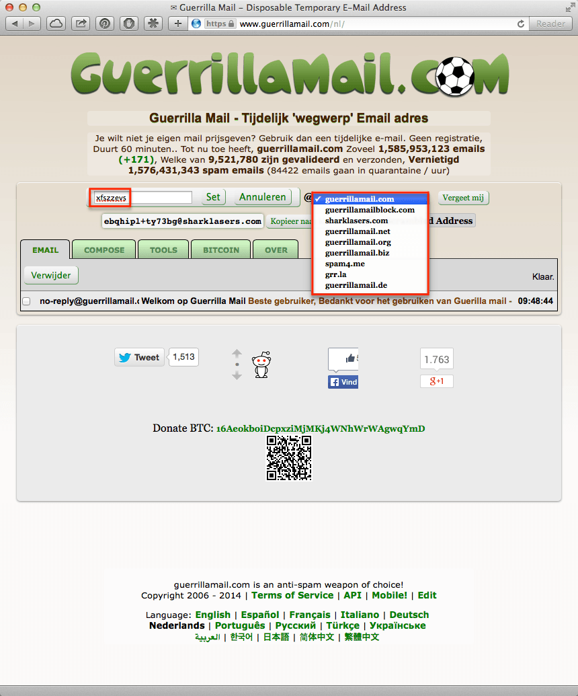

> **Historisch archief.** Deze aflevering verscheen op 24-07-2014 als onderdeel van ReputatieCoaching (2012–2016). De oorspronkelijke tekst is hieronder historisch bewaard. Diensten, contactgegevens, links, tools en adviezen kunnen inmiddels verouderd zijn.



**Transcriptiestatus:** Volledige transcriptie uit het oorspronkelijke archief.

***Historische afbeelding niet beschikbaar: ReputatieCoaching Podcast*
De podcast van vandaag heeft een keer een ietwat andere opzet en ik ben benieuwd wat je ervan vindt. Ik heb zometeen eerst een tip voor je, waar je wellicht iets mee kunt. Daarna heb ik het eerste deel van een interview met Karel Geenen, een autoriteit in SEO-land. Omdat het interview in totaal maar liefst zo’n 41 minuten duurt, heb ik het in tweeën geknipt. Deel twee komt in de podcast van volgende week.**

Hallo en hartelijk welkom bij deze aflevering van de ReputatieCoaching Podcast. Mijn naam is Eduard de Boer, ook bekend als de ReputatieCoach. Dit is dé podcast die je moet beluisteren als je meer wilt leren over online reputatie en reputatiemanagement en ook als je wilt werken aan je online reputatie en je online vindbaarheid wilt verbeteren. Dit alles kan je helpen om jezelf beter op de online kaart te plaatsen, waardoor je als bedrijf meer business kunt doen.

Als persoon kun je met de diverse tips ook aan de slag om je online reputatie te verbeteren.

De podcast kun je vinden op [www.reputatiecoaching.nl/86](https://www.reputatiecoaching.nl/86/). Bovendien is de podcast te beluisteren in [iTunes](https://www.reputatiecoaching.nl/itunes) en op [Stitcher](https://www.reputatiecoaching.nl/stitcher). Daar kun je je dus ook abonneren op de wekelijkse podcast, zodat je ’m kunt beluisteren wanneer en waar je maar wilt.

Voordat ik overga op het eerste deel van het interview met Karel Geenen, heb ik een praktische tip voor je, waar je wellicht iets mee kunt.

## Tip: Guerillamail.com voor anonieme mail

Dikwijls moet je te pas en vaak vooral te onpas je mailadres achterlaten om bijvoorbeeld een document te kunnen downloaden, of om iets tijdelijks aan te vragen et cetera. Of je bent met iets obscuurs bezig en je wilt niet jouw eigen mailadres onthullen.

Op dat soort momenten heb je geen zin om voor die ene actie bijvoorbeeld een outlook.com of gmail.com maildres te maken en heb je eigenlijk de behoefte aan een tijdelijk wegwerp-mailadres. Je wil eentje die jouw eigen vertrouwde mailbox niet vervuilt of een mailadres dat in sommige gevallen helemaal niet tot jou kan worden herleid.

Kijk dan eens op [www.guerrillamail.com](https://www.guerrillamail.com/) (met dubbel ‘r’ en dubbel ‘l’). Als je daar naartoe surft, dan zie je het venster dat ik in de show notes heb opgenomen:

[](https://lh5.googleusercontent.com/-2XAyA35kANo/U75yZHwYhHI/AAAAAAAAA_w/o2Si6VnMOW4/w860-h1035-no/20140724-guerrillamail.png)

Je kunt onderaan het venster ook kiezen voor een Nederlandse gebruikersinterface. Het tijdelijke mailadres heb ik rood omkaderd. Eventueel kun je zowel het deel voor het “@”-teken aanpassen of een andere domeinnaam kiezen. Dat zie je in het tweede screenshot die ik in de show notes heb opgenomen:

[](https://lh4.googleusercontent.com/-XLLdBpWgIjQ/U75yZHGLz7I/AAAAAAAAA_4/YHaqMjoNDuU/w860-h1035-no/20140724-guerrillamail-2.png)

Ik zou er alleen niet van uitgaan, dat deze mail per definitie veilig is en niet wordt afgeluisterd. Maar als je een tijdelijk wegwerpmailadres nodig hebt, is dit een uitkomst. Let op, dat het mailadres slechts 60 minuten werkt; daarna komt het weer te vervallen.

## Interview met Karel Geenen (deel 1)

[[Historische afbeelding: Karel Geenen](https://lh5.googleusercontent.com/-yhY8bmhQJTQ/U76gUbIqqLI/AAAAAAAABAk/j1eaH4vM2Ks/w200/201407-logo-Karel-Geenen.png)](http://www.karelgeenen.nl)Dan ga ik nu over op het interview met Karel Geenen… Ik benadruk nogmaals dat dit interview het enige grote topic is van deze podcast. Als je niet geïnteresseerd bent in het interview, dan kun je dus nu beter stoppen met luisteren…

OK, je bent er dus nog! Leuk!

In de show notes heb ik de vragen opgenomen die ik stel, maar niet de antwoorden van Karel Geenen. Daarvoor zul je toch echt de podcast zelf moeten beluisteren… Maar goed, over op het interview!

Iemand die ook al jaren in het vak van online marketing, zoekmachine optimalisatie en AdWords campagnes zit, is Karel Geenen. Ik volg Karel en zijn medewerkers op de verschillende sociale media en er gaat eigenlijk geen artikel of blogpost aan mij voorbij, zonder dat ik het lees.

Karel is als ik me het goed herinner ongeveer een jaar geleden ook begonnen met Google+ Hangouts on Air, waarin hij interessante onderwerpen behandelt en vragen van lezers van het weblog, bezoekers van de site en andere geïnteresseerden beantwoordt.

Karel is volgens mij, net als ik, een groot voorstander van de uitspraak “Delen is het nieuwe vermenigvuldigen”, want hij deelt zijn kennis op zijn site, zonder er direct voordeel uit te halen.
Maar zo onderscheidt hij zich wel van de figuren die alles maar voor zichzelf houden en profileert hij zich als een autoriteit.

Om iemand als Karel te “strikken” voor een interview vond ik dat ik wel met iets origineels moest komen. Dus ik heb een korte video opgenomen, waarin ik eerst mezelf kort voorstelde en Karel daarna de vraag stelde of hij in de show wilde komen. De mail die ik vervolgens op het invulformulier op zijn website intypte luidde als volgt:

De volgende ochtend ontving ik een reactie van Karel, waarin hij direct toestemde. Nu is het dan zover en heb ik [Karel Geenen](http://www.karelgeenen.nl/) in de show.

```
  1. __Karel, leuk dat je meteen zo enthousiast reageerde en bedankt dat je de luisteraars van de ReputatieCoaching Podcast wat meer wilt vertellen over jezelf en je bedrijf. Maar voordat ik overga op je zakelijke activiteiten, lijkt het me leuk als je je eerst even zelf verder introduceert bij de luisteraars. Dus wie is Karel Geenen? Wat is je achtergrond? Wat doe je zoal in je vrije tijd? Enzovoorts.__
  2. __Ik las op je website een artikel, waarin je de takeaways van een video van Gary Vaynerchuk opsomt. De takeaway die mij daarin opviel, was eentje die ook mijn motto is, en waarover ik recentelijk nog een presentatie heb gegeven voor een aantal jonge ICT’ers, namelijk het geven of delen van kennis. Mijn motto is: “Delen is het nieuwe vermenigvuldigen” en volgens mij ben jij daar ook een groot voorstander van, zoals je al schrijft. Kun je de luisteraars eens vertellen hoe dit principe, of deze overtuiging, jou succes heeft gebracht?__
  3. _Eens iets anders… Ik ga ervan uit dat jij ook wel eens geconfronteerd bent geweest met van die fantastische aanbiedingen die je gegarandeerd online succes brengen en binnen no-time naar de top in de zoekresultaten zullen doorstoten. Hiermee doel ik dan op de zogenaamde “black-hat” technieken. Ik neem aan dat jij ze ook wel zult kennen. Als professionals met een witte hoed op, de “white-hat” specialisten, weten we ook dat die vrijwel allemaal niet meer werken, slechts kortstondig werken, of je alleen maar van de regen in de drup helpen. Wat is volgens jou SEO, ofwel Search Engine Optimisation, anno 2014? Bestaat SEO überhaupt nog wel? Is het tegenwoordig social media, linkbuilding, linkearning of Like’s en +1’s verzamelen?_
```

Tot zover het eerste deel van het interview met Karel Geenen. Zoals je hebt kunnen horen vertelt Karel honderduit en geeft hij heel veel praktische tips en handvatten en ook een goede doorkijk van SEO anno 2014. Dit smaakt naar meer. En dat komt er ook, want zoals ik al zei, krijg je volgende week het tweede deel van het interview.

Dan kom ik hiermee weer aan het einde van deze podcast. Ik ben benieuwd wat je van deze format vindt: dus eerst een paar tips of iets dergelijks en dan een interview of zoals in dit geval een deel van een interview. Laat me weten wat je ervan vindt en post je reactie onderaan de show notes van deze podcast.

Als je de podcast leuk vindt en je wilt nog meer op de hoogte blijven, volg me dan ook op Twitter, via [@reputatiecoach1](https://twitter.com/reputatiecoach1).

Heb je inderdaad wat aan alle informatie die ik met je deel, help mij dan met het verder verbeteren en promoten van deze podcast. Surf daarvoor naar [iTunes](https://www.reputatiecoaching.nl/itunes) of [Stitcher](https://www.reputatiecoaching.nl/stitcher), geef de podcast een sterrenbeoordeling en laat ook je reactie achter. Door de podcast te beoordelen op iTunes en/of Stitcher breng je de podcast onder de aandacht van een breder publiek.

Je kunt me verder helpen, door de podcast aan te bevelen bij vrienden of collega’s, waarvan je denkt dat ze er hun voordeel mee kunnen doen, of door ’m te delen op Twitter, like’n en delen op Facebook of een “+1” te geven op Google+.

En vergeet niet: ik ben hier om je te helpen! Als je een vraag of een probleem hebt met betrekking tot je online reputatie of de vindbaarheid van je website, kun je een mailtje sturen naar [podcast@reputatiecoaching.nl](mailto:podcast@reputatiecoaching.nl).

Als je dat te lastig vindt, of als je de podcast beluistert terwijl je in de auto zit en je hebt acuut een vraag, spreek dan een boodschap in op de ReputatieCoaching Hotline, op nummer: 084 - 883 15 56. Mogelijk behandel ik je vraag of probleem dan in een artikel of in de podcast.

En je kunt ook rechtstreeks op de website een voicemail achterlaten, door op de tab aan de rechterkant van elke pagina te klikken, en je bericht in te spreken. Dit was [ReputatieCoaching Podcast aflevering 86](https://www.reputatiecoaching.nl/86/) en mijn naam is [Eduard de Boer](http://nl.linkedin.com/in/eduarddeboer/nl).

Ik wens je de komende week weer succes met het werken aan je reputatie, zodat je meteen je reputatie voor jou kunt laten werken!

Tot volgende week!

Doei!

Links naar content die in deze podcast aan bod komt:

```
  * [ReputatieCoaching Podcast in iTunes](https://www.reputatiecoaching.nl/itunes)
  * [ReputatieCoaching Podcast op Stitcher](https://www.reputatiecoaching.nl/stitcher)
  * [ReputatieCoaching Podcast RSS-feed](https://feeds.reputatiecoaching.nl/ReputatieCoachingPodcast)
  * [KarelGeenen.nl](http://www.karelgeenen.nl/)
```
