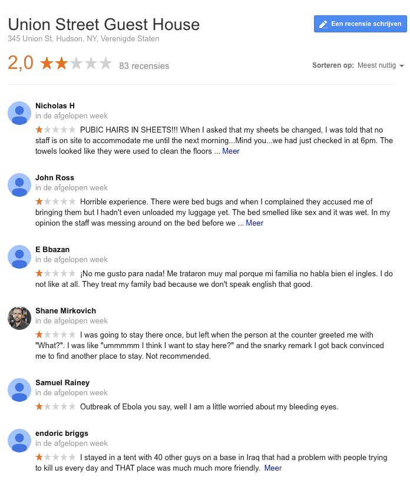

> **Historisch archief.** Deze aflevering verscheen op 7-08-2014 als onderdeel van ReputatieCoaching (2012–2016). De oorspronkelijke tekst is hieronder historisch bewaard. Diensten, contactgegevens, links, tools en adviezen kunnen inmiddels verouderd zijn.



**Transcriptiestatus:** Volledige transcriptie uit het oorspronkelijke archief.

***Historische afbeelding niet beschikbaar: ReputatieCoaching Podcast*
Ik ben een paar dagen terug van vakantie. In de tussentijd heb je gewoon content online zien komen, dus als het goed is, heb je er niets van gemerkt… Verder is er in de tussentijd weer veel gebeurd. Van al het nieuws heb ik ook vandaag weer een selectie gemaakt.**

**Vandaag begin ik met nieuws over de Google Pigeon update, en heb ik een update over Google Streetview. Ik heb inmiddels mijn eerste Yelp video reviews gepost, maar wist je dat je in Amerika US$500 moet betalen per negatieve review? Reviews verzamelen is lastig, dat komt doordat zo’n 78% van de internetgebruikers eigenlijk nooit reviews post; zometeen meer gegevens hierover. Ik ben blij met Google 2-factor authenticatie en ik heb ook een video review gemaakt van een zonnebrandcrème…**

Hallo en hartelijk welkom bij deze aflevering van de ReputatieCoaching Podcast. Mijn naam is Eduard de Boer, ook bekend als de ReputatieCoach. Dit is dé podcast die je moet beluisteren als je meer wilt leren over online reputatie en reputatiemanagement en ook als je wilt werken aan je online reputatie en je online vindbaarheid wilt verbeteren. Dit alles kan je helpen om jezelf beter op de online kaart te plaatsen, waardoor je als bedrijf meer business kunt doen.

Als persoon kun je met de diverse tips aan de slag om bijvoorbeeld je online reputatie als tandtechnicus, plaatwerker, HBO docent, coupeuse, tropenarts of wat dan ook te verbeteren.

De podcast kun je vinden op [www.reputatiecoaching.nl/88](https://www.reputatiecoaching.nl/88/). Daar vind je niet alleen de tekst, maar ook video’s waar ik het in deze uitzending over heb, alsmede afbeeldingen, links enzovoorts. Bovendien is de podcast te beluisteren in [iTunes](https://www.reputatiecoaching.nl/itunes) en op [Stitcher](https://www.reputatiecoaching.nl/stitcher). Daar kun je je dus ook abonneren op de wekelijkse podcast. Veel mensen vinden het ideaal om de wekelijkse afleveringen van de podcast op hun gemak te beluisteren, terwijl ze autorijden.

Laat ik dan nu overgaan op de onderwerpen voor vandaag…

## Dertien dagen vakantie gehad

Afgelopen zaterdag ben ik teruggekomen van een heerlijke vakantie: we hebben dertien dagen doorgebracht in Spanje, waar we van een particulier een huis hadden gehuurd in Polop, een stadje onder de rook van Benidorm en op zo’n 60 kilometer van Alicante.

Ik heb het in [podcast 82](https://www.reputatiecoaching.nl/82/) al aangekondigd, maar volgens mij heb je -als het goed is- niet eens gemerkt dat ik op vakantie was! Want ik heb mij een paar weken vóór de vakantie flink ingespannen om ervoor te zorgen dat er gewoon content live kwam, terwijl ik met het gezin genoot van de vakantie.

Achteraf begrijp je dan ook de extra reden die ik had om het interview met Karel Geenen op te splitsen in twee delen. Het kwam mij dus tijdens het interview goed uit, dat het zo lang werd.

## Tevreden over de “whoesh” tussen de topics?

Sinds het bericht van Edwin in [podcast 83](https://www.reputatiecoaching.nl/83/) heb ik een soort van “whoesh” geluid tussen de verschillende onderwerpen, om daarmee duidelijk te maken, dat een nieuw onderwerp volgt. Waar ik benieuwd naar ben, is of je dit prettig vindt, of juist storend.

Dus wil ik graag weten wat je ervan vindt. Geef je mening onderaan de show notes van deze podcast, op [www.reputatiecoaching.nl/88](https://www.reputatiecoaching.nl/88/).

## Google local update “Pigeon”


Allereerst een topic waar je mogelijk al over hebt gelezen of gehoord. Google heeft in de Verenigde Staten een update doorgevoerd in de lokale resultaten. Deze update is dus nog niet operationeel in de rest van de wereld, maar ik acht de kans groot, dat die te zijner tijd wereldwijd uitgerold zal worden.

Google heeft zelf geen officiële naam gegeven aan de update, maar vanuit de markt kwam al snel de codenaam “Pigeon” (dat is “duif” in het Engels). Na Penguin en Panda lag het natuurlijk voor de hand om weer een dier te kiezen, dat begint met een “P”. Reden dat is gekozen voor een duif, komt doordat duiven de gewoonte hebben altijd terug naar huis te vliegen en deze update ook lokaal-georiënteerd is.

Maar wat houdt deze update nu in en waarom hecht ik er zoveel waarde aan om je erover te vertellen, terwijl die nog niet eens in Nederland actief is. Daarvoor moet ik eerst een korte impressie geven wat deze update tot op heden teweeg heeft gebracht in de VS. Voordat ik er in duik, nogmaals: de update is nog niet operationeel in Nederland!

In essentie is het lokale algoritme verder gelijk getrokken aan de traditionele algoritmes, namelijk dat het gebruik maakt van zoekfuncties in de knowledge graph, verbeteringen in typefouten en andere standaard signalen. Verder is de relevantie ten aanzien van afstand en locatie verbeterd. Dat is het volgens Google.

Zij wilden niet vertellen hoeveel impact deze aanpassing heeft op lokale bedrijven, maar het leek er in eerste instantie op, alsof de impact gigantisch was. Gedurende de afgelopen weken lijkt het er wel op, alsof Google de scherpe kantjes van de update heeft afgeschaafd… Of het kan zijn dat het algoritme leert van zijn eigen functioneren. Dat weet natuurlijk alleen Google.

Een grote verandering ten gevolge van Pigeon is het verdwijnen van een groot aantal zogenaamde “7-packs”, die lijstjes met lokale bedrijven van “A” tot en met “G” in de zoekresultaten. Een belangrijke categorie die geheel verdween, was die van “realtors”, ofwel onroerend goed makelaars, evenals andere onroerend goed categorieën.

Volgens Darren Shaw het bedrijf “Whitespark” in Canada, dat ik al wel eens eerder heb genoemd, wordt in zo’n [23% van de gevallen nu geen lokale resultaten meer vertoond](http://www.whitespark.ca/blog/post/37-23-percent-drop-in-local-packs). Whitespark heeft inmiddels al gevonden dat zoeken op de volgende Engelse woorden geen lokale resultaten meer vertoont:

```
  * mold removal
  * dui lawyer
  * dui lawyers
  * dui attorney
  * dui attorneys
  * real estate
  * realtors
  * emergency plumber
  * commercial * (painting, construction, remodeling, etc) - anything with commercial preceding it seems to have stopped returning a local pack.
```

*(bron: “[We’re Seeing a 23.4% Drop in Local Packs](http://www.whitespark.ca/blog/post/37-23-percent-drop-in-local-packs)”, Whitespark Blog)*

Later bleek echter dat deze categorieën wel weer zichtbaar werden, als je in plaats van bijvoorbeeld “in new york”, intypte “near new york”, dus “in de buurt van”, in plaats van “in”. Het was de afgelopen weken erg turbulent op dit vlak en als je gaat zoeken, kun je meer dan voldoende erover vinden.

Een andere grote verandering was de prominentie van directory sites, zoals Yelp. Waar Yelp een paar weken geleden nog klaagde dat het door Google werd gediscrimineerd, worden sinds Pigeon Yelp resultaten vaak nog zelfs boven de lokale resultaten vertoond. Daar kun jij dus nu alvast op voorsorteren: als je bedrijf nog niet op Yelp staat, meld je dan alvast aan. Staat je bedrijf wel op Yelp, controleer dan eens goed alle gegevens, pas ze aan waar nodig, upload foto’s en video’s (daar kom ik zometeen nog op terug) en ga ook op Yelp reviews verzamelen.

Tot zover op dit moment over de “Pigeon” update.

## Claim je bedrijf in “Google Mijn Bedrijf” met Google Webmaster Tools

*Historische afbeelding niet beschikbaar: Google Maps logo*
Nog een nieuwtje over Google… In het verleden heb ik het al een aantal keren gehad over het claimen en verifiëren van je bedrijf op “Google Mijn Bedrijf”, zoals het tegenwoordig heet. Toen stond het claimen los van het verifiëren, want het claimen deed je bij Google, waarna je een kaart met een PIN-code kreeg toegestuurd, maar sinds vorige week kun je het zelfs doen via Google Webmaster Tools.

Jade Wang van Google schreef in de Google Business Help groep het volgende:

If you’d like to try instant verification, please make sure you’re signed in to Google My Business with the same account you used to verify your site with Webmaster Tools.

Not all businesses with websites verified using Google Webmaster Tools will have instant verification, since not all business categories are eligible. If that’s the case, please use one of our other methods of verification.

Dus niet alle categorieën worden automatisch geverifieerd, maar de kans is groot dat als jij al Google Webmaster Tools hebt geactiveerd, of nu zo snel mogelijk voor je site activeert, dat je op Google Mijn Bedrijf dan ook automatisch een vinkje krijgt naast je bedrijfsnaam! Dit is volgens welingelichte bronnen ook één van de vele signalen die bijdragen tot een betere vermelding in de lokale zoekresultaten.

## Google Streetview wordt vernieuwd in Nederland!

Als fotografen voor Google Maps Business View horen/lezen wij soms als eerste in Nederland over bepaalde updates. Die mogen we lang niet altijd delen, maar nu heb ik een nieuwtje voor je, die ik wel met je mag delen en die ik ook graag met je deel.

Je hebt je als ondernemer mogelijk al vaak geërgerd aan de oude afbeeldingen op Google Streetview. Het materiaal voor Nederland is inmiddels een goede vijf of zes jaar oud. En in vijf tot zes jaar gebeurt er veel… Dus is de kans groot dat jouw bedrijf nog niet eens op Google Streetview staat, of dat je niet tevreden bent met de manier waarop jouw bedrijf op Streetview wordt vertoond.

Dan heb ik dus goed nieuws! Want Google gaat de komende paar maanden Nederland opnieuw fotograferen voor Streetview. Dus is de kans groot dat ze ook bij jouw bedrijf of weer bij jouw bedrijf langskomen!

Doe daar je voordeel mee en zorg ervoor dat je uithangbord mooi schoon is, je etalage gevuld en je ramen gewassen zijn! Want met de afbeelding zoals die deze zomer van je bedrijf wordt geknipt, moet je het de komende vijf jaar weer doen.

## Yelp video reviews

*Historische afbeelding niet beschikbaar: Logo Yelp*
In [podcast 78](https://www.reputatiecoaching.nl/78/) vertelde ik je dat Yelp ging experimenteren met video’s. Echter was toen die service alleen voorbehouden aan de Elite Yelpies. Dat zijn Yelp-gebruikers die een bijzondere status hebben, bijvoorbeeld omdat ze conscientieus en bovenal constant veel reviews schrijven, nieuwe bedrijven toevoegen, foto’s uploaden en dergelijke.

Maar 28 juli kwam er een nieuwe versie van de Yelp app uit voor iOS en Android, waarin deze mogelijkheid werd geboden aan alle Yelp-gebruikers.

Het leuke vond ik dat je overal op de internet marketing sites las, dat Yelp nu video reviews toestaat aan alle gebruikers, terwijl Yelp in [het artikel op haar weblog](http://officialblog.yelp.com/2014/07/yelp-camera-action-now-add-videos-with-your-yelp-mobile-app.html) schrijft dat ze de videomogelijkheid niet zien als video reviews, maar juist als een extra dimensie om de sfeer in een bedrijf, zoals bijvoorbeeld een restaurant, vast te leggen.

Aan het begin van de podcast zei ik het al: ik was lekker met het gezin 13 dagen in Spanje op vakantie. Daar las ik dus ook het voornoemde artikel op het Yelp blog. We hebben daar een fantastisch restaurant ontdekt en dus vond ik dat een goede gelegenheid om hier eens mee te experimenteren, want de app op mijn iPhone was inmiddels al bijgewerkt naar de nieuwste versie.


Ik heb drie video’s opgenomen. Een video voor Yelp is minimaal 3 seconden en maximaal 12 seconden. En net als je wellicht gewend bent van Instagram, zijn de video’s op Yelp ook vierkant. Terug naar de video’s die ik heb gemaakt. Twee zijn een videoreview: eentje in het Nederlands en eentje in het Engels, terwijl de derde een sfeervideo is, waarbij ik een stukje rond film in het restaurant; ik denk een goede 270 graden, dus net geen 360 graden. Een 360 graden video gaat volgens mij niet goed passen in 12 seconden, omdat je dan met een noodgang rond moet draaien en de kijker dus niet echt de kans krijgt de beelden goed te bekijken.

Om te zien hoe deze video’s worden vertoond op Yelp, moet je de app downloaden, want op de website worden ze nog niet weergegeven. Zoek restaurant “[La Galera” in Altea (Spanje)](https://www.yelp.nl/biz/la-galera-altea) op in de Yelp app. Daar zie je zes foto’s die ik daar heb gemaakt, tesamen dus met de drie video’s.

Wel heb ik alledrie de video’s geüpload naar YouTube en in de transcriptie van deze podcast opgenomen. Je kunt de video’s dus bekijken op: [www.reputatiecoaching.nl/88](https://www.reputatiecoaching.nl/88/):

## Facebook is nu review site #2!

*Historische afbeelding niet beschikbaar: Bedrijfspagina maken op Facebook*
Yelp is natuurlijk een populaire site voor het verzamelen en ook achterlaten van reviews, in het buitenland nog meer dan in Nederland. Een site die lang achterbleef met de mogelijkheid om reviews te verzamelen en te posten, maar een grote inhaalslag heeft gemaakt, is Facebook.

Tot voor kort was Yelp de nummer twee site in Noord-Amerika, maar inmiddels is Yelp door Facebook verdrongen naar de derde plaats. Facebook is in Amerika dus de nummer 2 site, waar consumenten, klanten, gebruikers en patiënten reviews posten… En lezen!

Was jij al actief met het verzamelen van reviews op Facebook? Dan zou ik daar maar eens mee gaan beginnen! Het ligt ook wel voor de hand, dat mensen eerst op Facebook kijken. Want dat is de enige app of website die meer dan een miljard mensen bijna dagelijks gebruikt of heeft geopend. Dus wat is dan gemakkelijker dan snel even bijvoorbeeld de naam van een restaurant intypen in Facebook?

Als je dan ook nog eens ziet dat je vrienden (die je vertrouwt) een restaurant, opticien of bloemenwinkel goed beoordelen, dan is dat een extra stimulans om daar naartoe te gaan. Vergeet niet: 88% van de consumenten die online reviews lezen, vertrouwen die bijna evenveel als mondelinge aanbevelingen; en helemaal als die ook nog eens van vrienden afkomstig zijn!

## 78% van de consumenten post *geen* reviews

De bekende Mike Blumenthal heeft een onderzoek gedaan onder 2.671 internetgebruikers, waarbij hij [inzicht wilde krijgen in het reviewgedrag van mensen](http://blumenthals.com/blog/2014/07/30/where-do-consumers-leave-local-reviews-facebook-now-2/).

Hij stelde onder andere de volgende vraag: “Hoevaak laat je een review achter bij een lokaal bedrijf, als je daar een product of dienst hebt afgenomen?”.

De resultaten waren als volgt:

```
  * Nooit - 58,2%
  * Bijna nooit (minder dan 1x per jaar) - 19,6%
  * Af en toe (1–5 reviews per jaar) - 15,7%
  * Vrij geregeld (6–11 reviews per jaar) - 4,2%
  * Vaak (12 of meer reviews per jaar) - 2,4%
```

Hieruit blijkt dus dat 77,8% geen of nagenoeg geen reviews online post. Dat kan dan ook de reden zijn dat het zo verhipte moeilijk is om reviews te verzamelen… Vrijwel niemand doet het uit zichzelf! En vaak is het ook nog eens zo dat mensen eerder geneigd zijn een negatieve ervaring te delen, dan een positieve ervaring. Dus als je pech hebt, krijg je ook nog eens een meerderheid aan negatieve reviews.

Dat valt in de praktijk wel mee. Ik zeg altijd tegen opdrachtgevers dat ze hun uiterste best moeten doen goede producten en service te verlenen. Dan krijg je eigenlijk altijd positieve beoordelingen.

Maar goed, mensen posten ze dus niet uit zichzelf. Dat houdt in dat je ze erom zult moeten vragen. Maar, zoals je weet, mag je ze niet belonen voor het posten van een review.

## US$500 boete voor een negatieve review?!

Je mag als ondernemer niet betalen voor reviews. En laatst werd een [Franse blogger beboet voor het plaatsen van een negatieve review](https://www.reputatiecoaching.nl/82/)…

Maar het kan nog gekker! Ik las eergisteren een bericht dat het Union Street Guest House in de stad Hudson in de staat New York de wereld helemaal op zijn kop zet…

Stel je gaat trouwen en je organiseert je bruiloft in dat hotel. Als iemand van je gasten ergens een negatieve review over het hotel achterlaat, dan krijgen jullie als bruidspaar een boete van US$500 per negatieve review. En daarmee houdt het nog niet eens op. Het hotel brengt ook US$500 in rekening als je daar slaapt, terwijl je je trouwfeest elders hebt, maar alsnog een negatieve review achterlaat over je overnachting.

Na alle negatieve reacties uit de markt is de tekst verdwenen, maar op de website van het hotel stond eerst nog de volgende tekst:

If you have booked the Inn for a wedding or other type of event anywhere in the region and given us a deposit of any kind for guests to stay at USGH there will be a $500 fine that will be deducted from your deposit for every negative review of USGH placed on any internet site by anyone in your party and/or attending your wedding or event. If you stay here to attend a wedding anywhere in the area and leave us a negative review on any internet site you agree to a $500 fine for each negative review.

Het hotel gaf wel aan de US$500 terug te betalen, als de negatieve review of reviews waren verwijderd.

Net zoals in het geval van die Franse blogger van een paar weken geleden resulteerde dit ook weer in een lawine van negatieve reviews.

[](https://lh4.googleusercontent.com/-rCQaQ9NS1z0/U-M7ra3R1aI/AAAAAAAABFI/9oguY_Cdmmo/w696-h820-no/20140806-Usion-Street-Guest-House-google.png)

Het hotel komt hiermee wel in de spotlights, maar ik denk dat een dergelijk incident de mensen lang blijft heugen en het gezegde “het maakt niet uit hoe ze over je praten, als ze maar over je praten” in dit geval toch echt een negatief effect heeft.

## Google verwijdert sterretjes bij Facebookpagina’s en Yelppagina’s in zoekresultaten

In [podcast 74](https://www.reputatiecoaching.nl/74/) vertelde ik je over het feit dat in de zoekresultaten van Google dikwijls reviewsterretjes bij Facebookpagina’s werden vertoond. Het viel me zojuist pas op, dat de meeste daarvan zijn verdwenen, net als een tijdje geleden de thumbnails bij videoresultaten. Nu is het niet helemaal duidelijk of dit komt door een verandering bij Facebook, of bij Google. Want voor sommige Facebookpagina’s zie ik nog wel reviewsterretjes.

Hetzelfde geldt trouwens voor de Nederlandstalige mobiele Yelp site. Ook daarvan worden er al enige tijd geen reviewsterren meer vertoond in de zoekresultaten. Dat is jammer. Gelukkig worden ze nog wel vertoond op de mobiele “yelp.com” site. Mogelijk is dit een fout bij Yelp die weer wordt hersteld, want ik meen me te herinneren dat ik ze ook een tijdje niet heb gezien in de desktopversie van de Nederlandse Yelp-site, maar dat weet ik niet helemaal zeker meer. Mea culpa, ik had dat beter moeten documenteren, toen ik het zag of meende te zien…

## Blij met 2-factor authenticatie in Google

Nog steeds hoor je dikwijls dat er weer duizenden of miljoenen wachtwoorden zijn gehackt of ergens op een server “gevonden”. Zo ook weer gisteren. Het blijkt dat [Russische hackers nu maar liefst 1,2 miljard gebruikersnaam/wachtwoord-combinaties van zo’n 420.000 websites hebben gestolen](http://www.cbc.ca/news/world/password-hack-affects-1-2-billion-accounts-more-at-risk-1.2728865).

Dan ben ik blij dat ik voor zo goed als alle online diensten allemaal verschillende wachtwoorden van tenminste 16 willekeurige karakters heb ingesteld. Dus als hackers dan één gebruikersnaam met wachtwoord van een site weten te halen, dan nóg kunnen ze niet daarmee inloggen op andere online diensten.

Om al die wachtwoorden te registreren, maak ik gebruik van LastPass. En voor LastPass heb ik natuurlijk ook een wachtwoord ingesteld… Een complex wachtwoord. Maar zoals de naam al suggereert, is dat dan het laatste wachtwoord, dat ik moet onthouden. Want LastPass onthoudt alle overige wachtwoorden.

En om te voorkomen dat iemand zomaar kan inloggen op mijn LastPass account, als ze dat complexe wachtwoord zouden achterhalen, heb ik nog een tweede verdedigingslinie, in de vorm van een Yubikey. Dat is een klein apparaatje, dat ik in een USB-poort kan stoppen, als LastPass daarom vraagt. Dus met alleen het wachtwoord, maar zonder die Yubikey-sleutel kom je nog niet bij mijn wachtwoorden.

Dat heet “2-factor authenticatie”. Ook diensten als Google, Flickr en LinkedIn bieden de mogelijkheid om een extra beveiligingslaag te activeren. Omdat ik heel veel doe met Google, heb ik dit bij Google geactiveerd.

Om die beveiliging in 2 stappen te gebruiken, kun je een app voor iOS of Android downloaden met de naam “Google Authenticator”. Als je dan in Google deze beveiliging hebt geactiveerd, heb je de app nodig om na het intypen van je wachtwoord, door te kunnen gaan. Want de app geeft je een 6-cijferige code die elke minuut verandert. En nadat die code eenmaal is gebruikt, kun je ’m niet nogmaals gebruiken. Dat maakt alle Google diensten dus enorm veilig.

Dit hielp mij tijdens de vakantie ook, want ik kon pas vanaf 7 dagen voor de terugreis online inchecken. Dus dat moest op ons vakantieadres in Spanje. Ryanair eist dat je met geprinte boarding passes op het vliegveld incheckt, anders rekenen ze EUR 70 per persoon extra. Dat wilde ik voorkomen en ging dus in Benidorm op zoek naar een internetcafé. Ik vond er weldra eentje, maar die zag er wel wat obscuur uit.

Dankzij de 2-factor authenticatie durfde ik gewoon in te loggen, printte de boarding passes en logde ik weer uit. Het geheel duurde nog geen drie minuten en ik was voor EUR 0,90 klaar, in plaats van 4 keer EUR 70! Dus ook al zou er op die PC’s in dat internetcafé malafide software hebben gedraaid die mijn wachtwoord voor Gmail afluisterde, dan nog kan niemand er iets mee, zonder de app die op mijn iPhone draait.

## Vision zonnebrand ervaring

Consumenten worden steeds mondiger en zeker als ReputatieCoach maak ik ook dikwijls mijn mening bekend. Ik post reviews van bedrijven, zoals bijvoorbeeld van dat restaurant in Spanje waar ik het net over had, of ik stuur een tweet of bericht naar een fabrikant of leverancier, als ik wel of niet tevreden ben. Vaak deel ik deze niet met je, maar nu heb ik een issue die ik wel met je wil delen, omdat je er een paar dingen van kunt leren.

Tijdens onze vakantie hadden we weer zo’n gevalletje, waarbij ik niet tevreden was. Tijdens vorige vakanties in Egypte en Tunesië, zwoeren wij bij Vision zonnebrandcrème. Het grote voordeel daarvan was dat wij de kinderen en onszelf maar één keer per dag hoefden in te smeren, in plaats van elke één tot twee uur. Toegegeven: het middel was wel duurder dan andere merken, maar dat maakte het eenmaal insmeren per dag meer dan goed!

Dus ook afgelopen vakantie hadden we de nodige voorraad Vision zonnebrand ingeslagen. Meteen de eerste dag toen we arriveerden hebben we ons ingesmeerd, waarna in de namiddag we nog even een paar uur gepoedeld en gezwommen hebben in het zwembad. We hadden allevier last van prikkende ogen en een smerige smaak in onze mond. En tot onze grote verbazing waren we ook allevier verbrand… In slechts een paar uur!

Op Internet zocht ik de importeur van Vision en die stuurde ik een mail. Ik wist niet wat ik las, toen ik per omgaande een autoreply kreeg, met daarin de volgende tekst:

Vanwege de zomervakantie-periode, vrijdag 18 juli t/m vrijdag 8 augustus 2014, werkt onze Consumentenservice met een beperkte bezetting. Om deze reden zal u mail niet direct worden beantwoord en ontvangt u een reactie in de week van 11 augustus a.s.

De importeur van Vision -een product dat voornamelijk in de zomer wordt gebruikt- meldt dat het pas op 11 augustus terug is van vakantie, waarna je een antwoord kunt verwachten. In deze tijd kan dat gewoon niet, volgens mij! Kijk, ik vind het anders dat je als groenteboer, schoenmaker of herenkapper je winkel gewoon een paar weken per jaar dicht doet, omdat je op vakantie gaat. Maar voor een dergelijk product, waarbij het potentieel om gezondheidsrisico’s gaat, vind ik dit ongehoord! Dat kan gewoon niet!

Vlak voor ons vertrek pakte ik nogmaals de tube ter hand en zag dat er ook een e-mailadres op stond, evenals op de doos. Dat bleek het adres te zijn van het farmaceutisch bedrijf, dat Vision zonnebrandcrème maakt. Dus ging ik een stapje verder en maakte een videoreview, die ik uploadde naar YouTube. De video heb ik gedeeld op Facebook, Twitter, Tumblr en andere social media. Ook heb ik de link naar de farmaceutische fabrikant Takeda gestuurd. Dat is inmiddels ook alweer vijf dagen geleden!

Dus ik ben benieuwd hoelang het duurt, tot één van de bedrijven reageert. Ik hou je op de hoogte. Natuurlijk wilde ik je de videoreview niet onthouden, dus die heb ik ook in de show notes opgenomen:

Heb je inderdaad wat aan alle informatie die ik met je deel, help mij dan met het verder verbeteren en promoten van deze podcast. Surf daarvoor naar [iTunes](https://www.reputatiecoaching.nl/itunes) of [Stitcher](https://www.reputatiecoaching.nl/stitcher), geef de podcast een sterrenbeoordeling en laat ook je reactie achter. Door de podcast te beoordelen op iTunes en/of Stitcher breng je de podcast onder de aandacht van een breder publiek.

Je kunt me verder helpen, door de podcast aan te bevelen bij vrienden of collega’s, waarvan je denkt dat ze er hun voordeel mee kunnen doen, of door ’m te delen op Twitter, like’n en delen op Facebook of een “+1” te geven op Google+.

En vergeet niet: ik ben hier om je te helpen! Als je een vraag of een probleem hebt met betrekking tot je online reputatie of de vindbaarheid van je website, kun je een mailtje sturen naar [podcast@reputatiecoaching.nl](mailto:podcast@reputatiecoaching.nl).

Als je dat te lastig vindt, of als je de podcast beluistert terwijl je in de auto zit en je hebt acuut een vraag, spreek dan een boodschap in op de ReputatieCoaching Hotline, op nummer: 084 - 883 15 56. Mogelijk behandel ik je vraag of probleem dan in een artikel of in de podcast.

En je kunt ook rechtstreeks op de website een voicemail achterlaten, door op de tab aan de rechterkant van elke pagina te klikken, en je bericht in te spreken. Dit was [ReputatieCoaching Podcast aflevering 88](https://www.reputatiecoaching.nl/88/) en mijn naam is [Eduard de Boer](http://nl.linkedin.com/in/eduarddeboer/nl).

Ik wens je de komende week weer succes met het werken aan je reputatie, zodat je meteen je reputatie voor jou kunt laten werken!

Tot volgende week!

Doei!

Links naar content die in deze podcast aan bod komt:

```
  * [ReputatieCoaching Podcast in iTunes](https://www.reputatiecoaching.nl/itunes)
  * [ReputatieCoaching Podcast op Stitcher](https://www.reputatiecoaching.nl/stitcher)
  * [ReputatieCoaching Podcast RSS-feed](https://feeds.reputatiecoaching.nl/ReputatieCoachingPodcast)
  * “[Yelp, Camera, Action: Now Add Videos with Your Yelp Mobile App!](http://officialblog.yelp.com/2014/07/yelp-camera-action-now-add-videos-with-your-yelp-mobile-app.html)” (Yelp blog, 28 juli 2014)
  * “[We’re Seeing a 23.4% Drop in Local Packs](http://www.whitespark.ca/blog/post/37-23-percent-drop-in-local-packs)” (Whitespark Blog, 29 juli 2014)
  * “[Where do consumers leave local reviews? Facebook now #2](http://blumenthals.com/blog/2014/07/30/where-do-consumers-leave-local-reviews-facebook-now-2/)” (Mike Blumenthal, 30 juli 2014)
  * “[Hotel Fines Brides $500 For Every Negative Yelp Review Their Wedding Guests Leave](http://www.businessinsider.com/hotel-fines-brides-for-negative-yelp-reviews-2014-8)” (Business Insider, 4 augustus 2014)
  * “[Password hack affects 1.2 billion accounts, more at risk](http://www.cbc.ca/news/world/password-hack-affects-1-2-billion-accounts-more-at-risk-1.2728865)” (CBC.ca, 6 augustus 2014)
```
