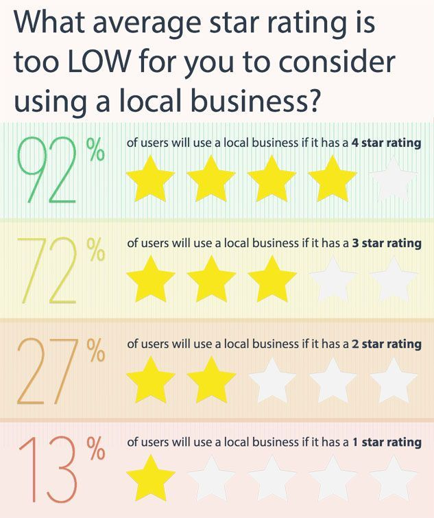
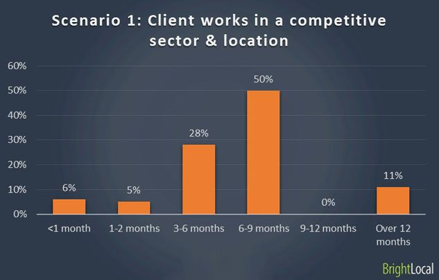
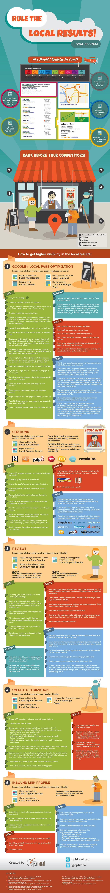

> **Historisch archief.** Deze aflevering verscheen op 14-08-2014 als onderdeel van ReputatieCoaching (2012–2016). De oorspronkelijke tekst is hieronder historisch bewaard. Diensten, contactgegevens, links, tools en adviezen kunnen inmiddels verouderd zijn.



**Transcriptiestatus:** Volledige transcriptie uit het oorspronkelijke archief.

***Historische afbeelding niet beschikbaar: ReputatieCoaching Podcast*
Om te beginnen heeft Google onlangs expliciet aangegeven dat zij een nieuw ranking signaal in gebruik heeft genomen en verder lijkt de Google Penguin al ruim 10 maanden op vakantie te zijn. En hoeveel reviewsterretjes is echt te weinig voor een lokaal bedrijf? Ik vertel het je zometeen! Hoelang duurt het om te scoren in de lokale resultaten? Ook die vraag komt zometeen aan bod, evenals de vraag of externe harddisks goedkoper zijn dan cloudopslag, of niet.**

**Een ander topic voor vandaag is een infographic die je uitlegt hoe je de lokale resultaten kunt domineren, daarna vertel ik je over de video marketing van Volvo en BMW en ik sluit de podcast van vandaag af met vijf tips voor hoe je betere video kunt schieten met je smartphone.**

Hallo en hartelijk welkom bij deze aflevering van de ReputatieCoaching Podcast. Ik ben Eduard de Boer, ook bekend als de ReputatieCoach. Dit is dé podcast die je moet beluisteren als je meer wilt leren over online reputatie en reputatiemanagement en ook als je wilt werken aan je online reputatie en je online vindbaarheid wilt verbeteren. Dit alles kan je helpen om jezelf beter op de online kaart te plaatsen, waardoor je als bedrijf meer business kunt doen.

Als persoon kun je met de diverse tips aan de slag om bijvoorbeeld je online reputatie als fruitteler, magazijnbeheerder, meubelstoffeerder, schapenscheerder, schoorsteenveger, wijnboer of wat dan ook te verbeteren.

De podcast kun je vinden op [www.reputatiecoaching.nl/89](https://www.reputatiecoaching.nl/89/). Daar vind je niet alleen de tekst, maar ook video’s waar ik het in deze uitzending over heb, alsmede afbeeldingen, links enzovoorts. Bovendien is de podcast te beluisteren in [iTunes](https://www.reputatiecoaching.nl/itunes) en op [Stitcher](https://www.reputatiecoaching.nl/stitcher). Daar kun je je dus ook abonneren op de wekelijkse podcast.

Laat ik dan nu overgaan op de onderwerpen voor vandaag…

## SSL nu ranking signaal in Google

Google vertelt niet vaak over de signalen die meespelen in het bepalen van de positie van webpagina’s in de zoekresultaten. Maar recentelijk heeft Google expliciet gezegd dat webcontent die via zogenaamde versleutelde SSL-verbindingen wordt aangeboden, hoger kan scoren, dan dezelfde content die niet via versleutelde verbindingen wordt geserveerd.

Doel van Google is het verbeteren van de privacy van de Internetgebruikers. Daarom gaat het websites die veilige verbindingen bieden, hoger beoordelen.

Ten aanzien van beveiligde SSL-verbindingen heeft John Mueller van Google een paar dingen gezegd:

```
  * Het verhogen van de ranking is heel beperkt; de impact van het invoeren van SSL is minder dan 1%. Dus je moet niet verwachten dat je hiermee direct naar de top komt!
  * Het signaal maakt geen deel uit van Panda of Penguin en staat er dus los van.
  * De impact is in realtime, dus zodra Googlebot heeft gezien dat een pagina wordt aangeboden via SSL, wordt de verhoogde score, als je daar al van kunt spreken vanwege de geringe impact, toegepast.
```

## Google Penguin op vakantie?

Net noemde ik al Google Penguin en Google Panda. Dit zijn twee algoritmes die grote invloed hebben op de positie van content in de zoekresultaten op Google. Voorheen was er elke paar maanden een update van Penguin, maar de laaste Penguin update is inmiddels al tien maanden geleden! Veel webmasters klagen hierover… Maar waarom eigenlijk? Waarom missen webmasters de Penguin update?

Het probleem is dat sinds de laatste Penguin update, veel websites een algoritmische penalty hebben gekregen, waardoor ze sinds die tijd heel laag in de zoekresultaten staan. Een groot aantal webmasters heeft in de tussentijd de website onderhanden genomen en alle oorzaken die ook maar enigszins een negatief effect kunnen hebben op de ranking, weggenomen. Maar doordat er geen update van Penguin heeft plaatsgevonden, scoren die sites dus nog steeds laag, lager dan dat ze eigenlijk zouden moeten doen.

Hoewel Google dagelijks kleine veranderingen doorvoert en tests doet om te zien wat resulteert in een nóg betere gebruikerservaring, is het “zomaar even opstarten” van een Penguin update niet 1–2–3 mogelijk.

In een Google Webmaster Hangout zegt John Muller van Google hier het volgende over.

Penguin is niet zomaar een refresh… Het vereist een complete update van alle data en dat is geen sinecure. Het hele algoritme moet opnieuw worden gedraaid voor alle webpagina’s, die Google geïndexeerd heeft en dat doe je niet op een regenachtige zaterdagmiddag. Verder zegt John hierover dat deze update langer duurt, omdat Google er zeker van wil zijn dat de data juist is en dat het algoritme de juiste dingen doet. En om het goed te doen, moeten ze veel testen en aanpassen, voordat ze de Penguin update opnieuw kunnen draaien.

In de show notes heb ik het stukje video waarin John Mueller dit vertelt, opgenomen:

## Hoeveel sterretjes is te weinig voor een lokaal bedrijf?

In [podcast 84](https://www.reputatiecoaching.nl/84/) vertelde ik over de acceptatie van en het vertrouwen in online reviews door Internetgebruikers. Dat was op basis van een onderzoek dat was uitgevoerd door BrightLocal.

Op basis van die gegevens heeft BrightLocal nu weer een paar interessante statistieken gepubliceerd, die ik graag met je deel. Dit keer gaat het erom hoeveel sterretjes eigenlijk te weinig is voor consumenten, om zaken te willen doen met een lokaal bedrijf.

[[Historische afbeelding: bekijk bron](https://lh3.googleusercontent.com/EhdsoSDbBxqaEgPC1n8K_8madENvTgZx_sXId5lUc4I=w633-h755-no)](https://lh3.googleusercontent.com/EhdsoSDbBxqaEgPC1n8K_8madENvTgZx_sXId5lUc4I=w633-h755-no)

*(Bron: [www.brightlocal.com](http://www.brightlocal.com))*

Het grootste verschil zit van twee naar drie sterren: dat is maar liefst 45%. Het verschil tussen drie en vier sterren liegt er ook niet om, want dat is ook nog eens 20%. Dat houdt dus in dat een extra 20% van de consumenten liever een bedrijf met vier sterren nader onderzoekt, dan eentje met drie sterren.

Dit bewijst maar eens temeer, dat positieve reviews echt een grote impact kunnen hebben, als het gaat om het werven van nieuwe klanten. Het wordt nog leuker, als je gaat kijken naar het geslacht van de geïnterviewde mensen:

[](https://lh6.googleusercontent.com/-ItcXtIRSJgg/U-zLUP65qVI/AAAAAAAABGE/mvB0MfMnukU/w633-h380-no/20140814-Sterrenbeoordeling-geslacht.jpg)

```
  * 89% van de mannen willen zaken doen met een lokaal bedrijf, als het 4 sterren heeft, tegenover 95% van de vrouwen
  * 67% van de mannen kiest voor bedrijven met 3 sterren, tegenover 75% van de vrouwen
```

Daarna wordt het reeds geringe onderscheid nog minder. Hieruit blijkt dat er dus weinig verschil is tussen mannen en vrouwen voor wat betreft de acceptatie van sterren bij reviews.

Als je gaat kijken naar leeftijd, dan valt het op dat de meest kritische leeftijdscategorie die van 55-plussers is. Want bij 2 sterren wil slechts 21% van de ondervraagden zaken doen met het bedrijf, tegenover maar liefst 77% als een bedrijf 3 sterren heeft.

[](https://lh6.googleusercontent.com/-97-1xrgUlqc/U-zLUhX3x3I/AAAAAAAABF8/et5vgaD3jZU/w633-h380-no/20140814-Sterrenbeoordeling-leeftijd.jpg)

## Hoelang duurt het om lokaal te scoren?

De mens is van nature ongeduldig. Als ik aan de slag ga om een bedrijf te helpen met het verbeteren van de score in de lokale zoekresultaten, dan krijg ik vaak de vraag hoelang het duurt, tot er een significante verbetering optreedt.

Dit is natuurlijk nooit met 100% zekerheid te zeggen, maar inmiddels heb ik al flink wat ervaring opgedaan en kan ik schattingen doen, die meestal aardig in de buurt komen. Voor de eerste paar opdrachtgevers had ik meer dan een jaar noeste arbeid nodig, om ze duurzaam op de felbegeerde “A”-positie te krijgen. Daar staan die bedrijven inmiddels ook alweer meer dan een jaar.

Een andere keer kostte het me een paar minuten werk en één dag doorlooptijd, omdat het bedrijf direct op de eerste plaats kwam in de lokale resultaten op de gewenste zoektermen, toen ik alleen maar de categorie had veranderd: die stond initieel namelijk nog op de algemene “interessante plaats”.

**Praktische tip:** Als jouw bedrijf bij Google ook nog staat gemarkeerd als een “interessante plaats”, dan zou ik dat als eerste aanpassen en vervolgens je overige gegevens controleren. Want de categorie is echt essentieel om goed te worden gevonden in de lokale resultaten!

Meestal antwoord ik dat opdrachtgevers in 3–6 maanden wel verbeteringen beginnen te zien: niet alleen in positie in de lokale zoekresultaten, maar ook in verkeer naar de website en dus uiteindelijk ook onder de streep in de boekhouding.

BrightLocal heeft recentelijk ook een ander onderzoek gepubliceerd, waarin zij de resultaten heeft verwerkt van een aantal vragen die ze aan 18 experts in de wereld heeft voorgelegd.

In het onderzoek wordt onderscheid gemaakt tussen bedrijven in een sterk concurrerende markt en locatie en bedrijven in een markt en omgeving waarin minder concurrentie is.

[[Historische afbeelding: Hoelang duurt lokale SEO?](https://lh4.googleusercontent.com/2ofQMbxX8J33eGCnuTEiChkdW6T56w9obk0xyxqZA-c=w633-h404-no)](https://lh4.googleusercontent.com/2ofQMbxX8J33eGCnuTEiChkdW6T56w9obk0xyxqZA-c=w633-h404-no)

Allereerst ten aanzien van de markt en locaties, waarin veel concurrentie is… Van de geïnterviewde experts bevestigt 78% dat je significante verbeteringen in je positie kunt realiseren in 3–9 maanden en 50% zegt dat 3–6 maanden voldoende is. Slechts 11% gelooft dat je binnen drie maanden veel beter kunt scoren en ook zegt 11% dat het meer dan een jaar kost.

In de sector en locatie waarin minder concurrentie is, zegt 95% dat het mogelijk is om binnen 6 maanden significante verbeteringen in positie te realiseren, en 100% zegt dat het binnen 9 maanden mogelijk is.

[](https://lh5.googleusercontent.com/-zVKILomNc4U/U-zLTcdnmAI/AAAAAAAABGU/H9qITYM0WN0/w633-h403-no/20140814-Scenario-1b.jpg)

Het onderzoek is aardig omvangrijk en leuk om eens op je gemak te lezen. Ik heb de link naar het artikel “[How long does it take to rank in local search?](http://www.brightlocal.com/2014/07/29/long-take-rank-local-search/)” opgenomen in de show notes, op [www.reputatiecoaching.nl/89](https://www.reputatiecoaching.nl/89/).

Ik noem je nog een paar interessante resultaten:

```
  * **Phil Rozek** zegt: “_Het verbeteren van je positie in de lokale resultaten duurt maanden, zelfs als alles voorspoedig gaat. Maar als klanten bijvoorbeeld langzaam zijn met het verzamelen van reviews… Wie weet hoelang het dan kan duren?_”
  * **Phil Britton** zegt: “_Vaak is het gemakkelijker om in een zogenaamde greenfield situatie te beginnen met een nieuw bedrijf en een nieuwe site. Dan is er namelijk vaak geen inconsistentie, die je moet oplossen_”
```

En verder:

```
  * Het duurt tenminste 3 maanden tot je opnieuw in de zoekresultaten verschijnt na een manual penalty, zegt 76% van de experts
  * 20% zegt dat je positie in de lokale resultaten binnen 3 tot 6 maanden verslechtert, als je niet blijft doorgaan met lokale optimalisatie en het verzamelen van reviews
  * 61% van de experts zegt dat het gemakkelijker is een bedrijf te laten stijgen in de lokale resultaten, tegenover 20% die beweert dat het gemakkelijker is in de organische zoekresultaten.
```

## Wat is goedkoper: externe harddisk of cloud storage?

Dan eens iets anders… De kans is groot dat je al gebruik maakt van Dropbox, Box, OneDrive of Google Drive. Bij al deze leveranciers krijg je gratis verschillende hoeveelheden opslagcapaciteit. En tegen betaling kun je natuurlijk meer opslagcapaciteit kopen.

*Historische afbeelding niet beschikbaar: CameraSync*

Gebruik jij ook nog steeds externe harddisks om je gegevens op te slaan? Dan kan het zijn, dat je meer betaalt dan strict noodzakelijk is voor jouw behoeftes. Ik las op PC World een artikel, waarin verschillende opslagscenario’s met elkaar worden vergeleken. Daaruit bleek dat in een aantal gevallen cloud storage inmiddels al goedkoper is, zoals bijvoorbeeld bij:

```
  * De mini backup: 0 tot 20 GB
  * De basis backup: 20 tot 100GB
```

Als je tussen de 100 en 500 GB aan opslagcapaciteit nodig hebt, dan zijn externe harddisks goedkoper. Als je eisen liggen tussen de 500GB en de 1 TB, dan maakt het niet uit, wat je gebruikt.

Maar als je meer wilt opslaan dan 1 TB, dan zijn cloudoplossingen grappig genoeg goedkoper! En als je je dan realiseert dat cloudoplossingen continu verder in prijs worden verlaagd, dan is nu langzaamaan het punt aangebroken, waarbij je jouw data en backups beter in de cloud kunt zetten, dan op een externe harddisk!

## Domineer de lokale resultaten

Zojuist had ik het over ranken in de lokale zoekresultaten. Al surfend op Internet kwam ik afgelopen week een leuke infographic tegen, met als titel “Rule the local results!”. Deze infographic heb ik in de show notes, op [www.reputatiecoaching.nl/89](https://www.reputatiecoaching.nl/89/) opgenomen:

[](/wp-content/uploads/2014/08/20140814-Infographic-Rule-Local-Results.jpg)

Niet alles hierop is van toepassing op de Nederlandse markt. Zo hebben wij (nog) geen carrousel in de lokale resultaten en is een aantal sites waar je je bedrijf moet aanmelden ook niet relevant voor Nederland. Toch geeft de infographic een aantal goede richtlijnen, waar je je voordeel mee kunt doen. De meeste zijn -verdeeld over vele podcasts en een aantal blogartikelen- al wel eens aan bod geweest, maar het is leuk om alles zo bij elkaar te zien.

Allereerst een paar goede adviezen voor je Google+ pagina:

```
  * Verifieer je Google+ pagina
  * Vul je bedrijfsprofiel tot 100% (neem met minder geen genoegen)
  * Gebruik je officiële bedrijfsnaam
  * Maak een gedetailleerde bedrijfsomschrijving
  * Heb een fysiek adres in de plaats waar je wilt scoren
  * Verberg je fysieke adres, als je alleen diensten levert op de locaties van je klanten en dus niet vanaf het adres
  * Heb je een enkele locatie, link dan naar de homepagina van je website
  * Heb je meerdere locaties, link dan naar de locatie-specifieke pagina op je site
  * Claim en verwijder alle duplicaatpagina’s van je bedrijf
  * Moedig klanten aan om reviews te posten op je Google+ pagina
  * Actualiseer je lokale pagina regelmatig en geregeld met berichten, foto’s en video’s
  * Gebruik een lokaal telefoonnummer, in plaats van het telefoonnummer van een call center
```

De meeste wist je waarschijnlijk al wel, maar het kan tenslotte nooit kwaad om ze eens in een andere context te herhalen. Zo noem ik ook nog een paar nuttige adviezen ten aanzien van citations, ofwel je bedrijfsvermeldingen:

```
  * Zorg voor consistente NAPT (Naam, Adres, Postcode + Plaats, Telefoonnummer) en openingstijden op alle sites, inclusief je Google+ en Facebookpagina’s
  * Claim en verbeter alle citations van je bedrijf die fout zijn
  * Verwijder duplicaten van je citations
  * Kies de beste categorie voor je bedrijf en probeer die ook consistent te houden over alle sites
  * Voordat je ergens een nieuwe bedrijfsvermelding aanmaakt, controleer of je bedrijf er wellicht al vermeld staat
  * Zoek waar je concurrenten allemaal vermeld staan en meld je daar ook aan
  * Voeg overal zoveel mogelijk gegevens toe (kun je foto’s uploaden? Doe dat! Kun je YouTube video’s embedden? Doe dat!)
```

Voor de rest wil ik het hierbij laten ten aanzien van alles wat in de infographic staat en kan ik je alleen maar aanmoedigen om hem eens aandachtig te lezen.

## Content marketing door Volvo en BMW

Content marketing heeft veel verschillende verschijningsvormen. Zo publiceert Red Bull video’s van fantastische spectaculaire evenementen en maakt Lego video’s die miljoenen kinderen ertoe bewegen hun ouders de oren van het hoofd te zeuren om nieuwe Lego.

Volvo heeft een tijdje geleden een video gemaakt met in de hoofdrol Jean-Claude van Damme. Doel was om de precisie en stabiliteit van de nieuwe Volvo Dynamic Steering in vrachtwagentrucks te illustreren. Mogelijk heb je de video al wel gezien, maar voor de zekerheid heb ik ’m ook opgenomen in de show notes van deze podcast:

Ik weet niet of dit aanleiding was voor BMW om ook een bijzondere video te maken, maar BMW heeft de vijf beste Hollywood stuntrijders uitgenodigd op een rotonde in Zuid-Afrika, alwaar zij de video heeft opgenomen, die ik ook in de show notes heb opgenomen:

Wat deze beide video’s laten zien is dat grote bedrijven veel kansen zien in het produceren van video en dit gebruiken om het bedrijf en haar producten beter op de kaart te zetten. Dat kun jij ook doen en het hoeft helemaal niet bijzonder kostbaar te zijn! Begin met het opnemen van je eerste video, ook al doe je er niets mee. En maak er nog een paar, die je ook niet eens per se online hoeft te zetten. Want op die manier word je er wel steeds beter in. Ik vond het eerst ook niet prettig om vóór de camera te staan, maar ik kan je uit ervaring melden, dat het went en dat het steeds gemakkelijker wordt!

Dus ga alvast eens nadenken over video’s die je zou kunnen gaan opnemen van bijvoorbeeld: je bedrijf, je medewerkers, het productieproces, je producten of videotestimonials van je klanten en/of opdrachtgevers. Dit gaat je helpen om je bedrijf beter op de kaart te zetten.

Half september heb ik een interview gepland staan met iemand die veel weet van videomarketing en hoe je het goed kunt inzetten. Als je nu alvast gaat nadenken over alle video’s die je zou kunnen gaan maken, dan kun je daarna zelf lekker aan de slag!

## Vijf tips voor betere video’s met je smartphone

Voor het geval je aan de slag gaat met het opnemen van video’s met een smartphone, heb ik een vijftal simpele tips voor je, waarmee je direct betere video’s maakt met je smartphone:

```
  * **Houd de camera stil** – Koop voor een paar euro een simpel smartphone statief bij de Mediamarkt of een soortgelijke winkel. Hiermee ziet je videomateriaal er meteen een stuk beter uit!
  * **Zorg voor voldoende licht** – Videocamera’s (en ook fotocamera’s) hebben moeite met scherpstellen en goed opnemen van beelden in een donkere omgeving. Zorg daarom voor voldoende licht!
  * **Zorg voor goede audio** – Goed geluid is minstens zo belangrijk voor een video, als een rustig en scherp beeld! Dus investeer een paar tientjes in een goede microfoon, die je op je smartphone kunt aansluiten.
  * **Film in landscape mode** – Maar al te vaak zie ik dat mensen de smartphone in telefoonstand houden, terwijl ze filmen… Verticaal dus. Dat kan echt niet, want dat ziet er zo raar uit, als je dat vertoont. Je gaat een televisie toch ook niet op z’n zijkant zetten, als je film kijkt? Dus kantel je telefoon 90 graden en film in de zogenaamde “landscape mode”.
  * **Stel scherp op het juiste punt** – Tik op het gewenste punt op je beeldscherm, waar je het beeld scherpgesteld wilt hebben. Dat zorgt ook voor een betere videokwaliteit.
```

Oh en mocht je denken dat je veel meer of duurdere apparatuur nodig hebt om goede video’s te kunnen schieten, dan wil ik dat argument direct van tafel vegen. Kijk daarvoor maar eens naar de video van Bentley, die ik ook in de show notes heb opgenomen:

Met deze bijzondere video’s en de vijf videotips kom ik dan weer aan het einde van deze podcast.

Als je de podcast leuk vindt en je wilt nog meer op de hoogte blijven, volg me dan ook op Twitter, via [@reputatiecoach1](https://twitter.com/reputatiecoach1).

Heb je inderdaad wat aan alle informatie die ik met je deel, help mij dan met het verder verbeteren en promoten van deze podcast. Surf daarvoor naar [iTunes](https://www.reputatiecoaching.nl/itunes) of [Stitcher](https://www.reputatiecoaching.nl/stitcher), geef de podcast een sterrenbeoordeling en laat ook je reactie achter. Door de podcast te beoordelen op iTunes en/of Stitcher breng je de podcast onder de aandacht van een breder publiek.

Je kunt me verder helpen, door de podcast aan te bevelen bij vrienden of collega’s, waarvan je denkt dat ze er hun voordeel mee kunnen doen, of door ’m te delen op Twitter, like’n en delen op Facebook of een “+1” te geven op Google+.

En vergeet niet: ik ben hier om je te helpen! Als je een vraag of een probleem hebt met betrekking tot je online reputatie of de vindbaarheid van je website, kun je een mailtje sturen naar [podcast@reputatiecoaching.nl](mailto:podcast@reputatiecoaching.nl).

Als je dat te lastig vindt, of als je de podcast beluistert terwijl je in de auto zit en je hebt acuut een vraag, spreek dan een boodschap in op de ReputatieCoaching Hotline, op nummer: 084 - 883 15 56. Mogelijk behandel ik je vraag of probleem dan in een artikel of in de podcast.

En je kunt ook rechtstreeks op de website een voicemail achterlaten, door op de tab aan de rechterkant van elke pagina te klikken, en je bericht in te spreken. Dit was [ReputatieCoaching Podcast aflevering 89](https://www.reputatiecoaching.nl/89/) en ik ben [Eduard de Boer](http://nl.linkedin.com/in/eduarddeboer/nl).

Ik wens je de komende week weer succes met het werken aan je reputatie, zodat je meteen je reputatie voor jou kunt laten werken!

Tot volgende week!

Doei!

Links naar content die in deze podcast aan bod komt:

```
  * [ReputatieCoaching Podcast in iTunes](https://www.reputatiecoaching.nl/itunes)
  * [ReputatieCoaching Podcast op Stitcher](https://www.reputatiecoaching.nl/stitcher)
  * [ReputatieCoaching Podcast RSS-feed](https://feeds.reputatiecoaching.nl/ReputatieCoachingPodcast)
  * “[Cloud storage vs. external hard drives: Which really offers the best bang for your buck?](http://www.pcworld.com/article/2451774/cloud-storage-vs-external-hard-drives-which-really-offers-the-best-bang-for-your-buck.html)” (PC World, 10 juli 2014)
  * “[How long does it take to rank in local search?](http://www.brightlocal.com/2014/07/29/long-take-rank-local-search/)” (BrightLocal, 29 juli 2014)
```
