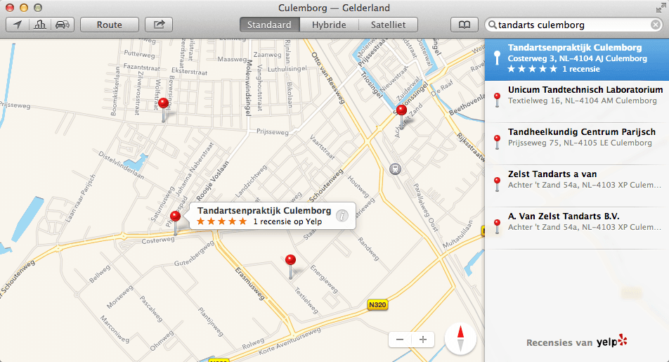
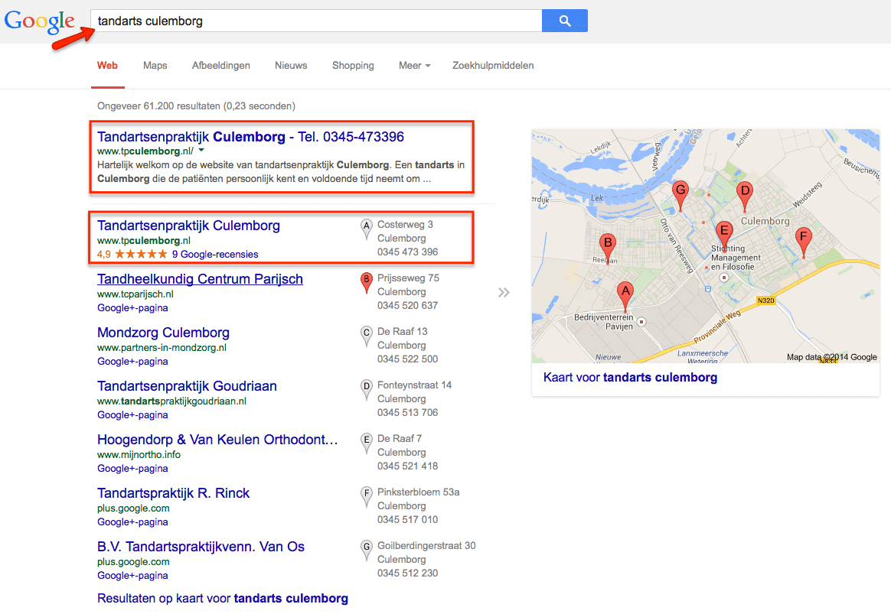
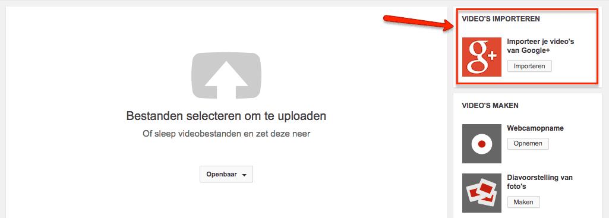

> **Historisch archief.** Deze aflevering verscheen op 29-08-2014 als onderdeel van ReputatieCoaching (2012–2016). De oorspronkelijke tekst is hieronder historisch bewaard. Diensten, contactgegevens, links, tools en adviezen kunnen inmiddels verouderd zijn.



**Transcriptiestatus:** Volledige transcriptie uit het oorspronkelijke archief.

***Historische afbeelding niet beschikbaar: ReputatieCoaching Podcast*
Door extreme drukte komt deze podcast uit op een vrijdag, in plaats van de vaste donderdag; ik vertel je zo hoe dat komt. Vandaag begin ik enkele reacties en vragen van luisteraars. Eentje gaat over een wel heel ingewikkeld lokaal SEO probleem. Dan heb ik nieuws over Apple Kaarten, waarna ik je vertel over een bedrijf dat ik sinds december 2013 heb geholpen om beter gevonden te worden. Naast wat overige kleine nieuwtjes heb ik een leuke tip over hoe je zelf een animated GIF van een video kunt maken en ik sluit de podcast van vandaag af met een verdere integratie van Google+ en YouTube.**

Hallo en hartelijk welkom bij deze aflevering van de ReputatieCoaching Podcast. Mijn naam is Eduard de Boer, ook bekend als de ReputatieCoach. Dit is dé podcast die je moet beluisteren als je meer wilt leren over online reputatie en reputatiemanagement en ook als je wilt werken aan je online reputatie en je online vindbaarheid wilt verbeteren. Dit alles kan je helpen om jezelf beter op de online kaart te plaatsen, waardoor je als bedrijf meer business kunt doen.

Als persoon kun je met de diverse tips aan de slag om bijvoorbeeld je online reputatie als parkeerwachter, raadslid, souschef, minister, notaris of wat dan ook te verbeteren.

De podcast kun je vinden op [www.reputatiecoaching.nl/91](https://www.reputatiecoaching.nl/91/). Daar vind je niet alleen de tekst, maar ook video’s waar ik het in deze uitzending over heb, alsmede afbeeldingen, links enzovoorts. Bovendien is de podcast te beluisteren in [iTunes](https://www.reputatiecoaching.nl/itunes) en op [Stitcher](https://www.reputatiecoaching.nl/stitcher). Daar kun je je dus ook abonneren op de wekelijkse podcast. Veel mensen vinden het ideaal om de wekelijkse afleveringen van de podcast op hun gemak te beluisteren, terwijl ze autorijden, fietsen, joggen of trainen in de sportschool. Weer anderen luisteren naar de podcast om in slaap te vallen, maar daarover zometeen meer…

Normaliter zit ik in het ritme om op woensdag de podcast voor te bereiden en in te spreken, zodat die dan donderdagmorgen om 08:30 uur online kan komen. Echter, deze podcast is bij wijze van uitzondering één dag later uitgekomen, op vrijdag. Let wel: het is dus inderdaad een uitzondering en volgende week komt de podcast dan ook weer op donderdagmorgen uit.

De reden dat deze podcast een dag vertraagd is, komt doordat we deze week de slaapkamer van onze zoon aan het verbouwen zijn. In verband met het beginnen van de scholen volgende week, zitten we met een harde deadline. We werken dus met man en macht om de pre-tienerkamer om te bouwen tot een kamer van een adolescent. Dat is een mooi woord voor puber, alhoewel onze zoon dat zelf anders ziet. Als je zoekt op de betekenis van het woord, dan lees je ook ‘jeugdig persoon’, ‘jongeling’ en ‘jongeman’. Mogelijk vindt hij dat een betere definitie.

In elk geval: er zit een beperkt aantal uren in een dag en als gevolg van deze beperking moet het maken van podcast 91 dus even wijken. Onze zoon is deze week op vakantie en komt vanmiddag terug… Dan ziet ’ie dus z’n kamer. Tot nu heeft ’ie alleen foto’s van de sloopwerkzaamheden gezien, dus ik ben benieuwd wat hij ervan vindt!

Maar goed, genoeg over die verbouwing… Over op de onderwerpen voor vandaag. Laat ik maar eens beginnen met een vraag van een luisteraar…

## Vraag van een luisteraar

[Historische afbeelding: bekijk bron](https://lh5.googleusercontent.com/-rGm9INqJxoI/VAAm9-rwTtI/AAAAAAAABIA/jj3x9rONgnc/s200-no/question-mark.jpg)
Ruud vroeg mij hoe een bedrijf van een bevriende relatie zo slecht vindbaar was in de lokale resultaten, alsmede op Google Maps. Het ging hierbij om een financieel administratiekantoor, dat ook schuldsanering biedt en diensten verleent bij faillissementen. Het leek erop, alsof dit laatste de hoofdmoot was van de activiteiten van het bedrijf.

Een eerste korte blik op de website leverde een paar bevindingen op, die op zich niet bijster spectaculair waren:

```
  * Geen responsive design en wat overige designissues, waardoor de site niet helemaal zichtbaar was op een smartphone
  * Geen klikbaar telefoonnummer
  * “Traditionele” site, in de vorm van een folder, zonder veel actueel nieuws etc.
```

Zoals ik al zei: dit was slechts wat mij als eerste opviel. Vanaf de contactpagina ging ik eens kijken naar het adres en het telefoonnummer.

Ik begon met het telefoonnummer en dat zocht ik op in Google, waarbij ik het nummer zowel mét aanhalingstekens zocht, als zonder. Op die manier vond ik al snel verwijzingen naar zo’n acht of negen verschillende bedrijven; allemaal met hetzelfde telefoonnummer! En toen ik het adres intypte in Google Maps, vond ik nota bene een heel ander bedrijf op dat adres!

En het bleek nog erger… Zoekend op alleen de bedrijfsnaam, leek het erop, alsof Google 148 resultaten had met pagina’s waarop die bedrijfsnaam voorkomt. Eenmaal doorklikkend naar pagina 3 van de zoekresultaten, bleek dat er slechts zo’n 28 tot 30 vermeldingen van de bedrijfsnaam in Google voorkwamen. 148 vermeldingen is geen probleem, maar minder dan drie dozijn baart me toch wel zorgen.

Maar goed, dat hoeft op zich geen probleem te zijn, maar ik vond 18 verwijzingen naar het bedrijf, op een ander adres! Ik noem enkele van die sites, waarop het bedrijf met het verkeerde adres vermeld stond:

```
  * Cylex Bedrijvengids
  * Drimble
  * Telefoondetective
  * Bedrijvenstek
  * Nationale Bedrijvengids
  * 2miljoen.nl
  * Holland Bedrijven
  * Postcode Atlas
  * Hotfrog
  * Regio Link
  * Bedrijven A-Z
```

En tot overmaat van ramp, stond het oude adres ook nog op de Google+ pagina en had het bedrijf daar als categorie “Organisatie-adviesbureaus”!

Laat ik bij de basis beginnen: als de gegevens op de Google+ pagina niet kloppen, dan is de kans klein dat de Google+ pagina nog geassocieerd kan worden met het bedrijf… En als Google een verband ziet, dan is het geen sterk verband. De verkeerde categorie zal ook wel een negatief effect hebben, maar ik denk dat dat vrij gering is. Als de hoofdacitiviteit van het bedrijf daadwerkelijk hulp bij faillissementen is, dan zou ik in Google+ kiezen voor de categorie “Faillissementsservice”.

Maar het probleem wordt voornamelijk veroorzaakt, doordat het bedrijf met een verkeerd adres in een aantal relevante sites staat, die ook nog eens een grote mate van autoriteit hebben in de ogen van Google. Als ik help bedrijven naar de toppositie te brengen in de lokale zoekresultaten, dan zijn dit ook sites, waar ik het desbetreffende bedrijf ook aanmeld, naast tientallen andere.

Daar zit overigens ook een issue: want het bedrijf komt op een groot aantal andere sites, die bijkant nog belangrijker zijn, niet voor. Zo is het bedrijf niet eens vindbaar in de TelefoonGids!

En zal ik je dan nog eens iets vertellen?? Als je zoekt op de bedrijfsnaam in combinatie met het goede adres, dan vind je welgeteld 5 resultaten, waarvan eentje de site zelf is.

Het bedrijf is gevestigd in een plaats met iets meer dan 11.000 inwoners. Als het dan niet eens naar voren komt op de zoekterm “administratiekantoor” in combinatie met de plaatsnaam, dan moet je je als bedrijf toch echt achter de oren krabben over je online presentatie, die dus een negatief effect heeft op je online vindbaarheid.

Wat we hier zien is een schoolvoorbeeld hoe het fout kan gaan met je lokale presence en hoe lastig het is om e.e.a. op te sporen. Laat staan als je dit moet opschonen…

Zal ik je zeggen wat in dit geval mijn advies zou zijn? OK, hier komt ’ie en ik waarschuw je, dat dat vrij rigoureus is.

Ik zou dit advies niet snel geven, maar het is ingegeven door de ellende die volgens mij is ontstaan als gevolg van allemaal failliete bedrijven, die als postadres het adres van de curator hebben gekregen. En waarschijnlijk is dit ook doorgegeven aan organisaties als de Kamer van Koophandel.

Deze vermeldingen zijn overgenomen door allemaal sites die gaan over bedrijven in het algemeen en faillissementen in het bijzonder.

Gezien het geringe aantal goede vermeldingen en het grote aantal problemen is mijn advies om een nieuw telefoonnummer voor het bedrijf in kwestie aan te vragen. Je hebt dan eigenlijk twee mogelijkheden:

```
  * Een lokaal nummer
  * Een 088 bedrijfsnummer
```

Natuurlijk zijn lokale nummers sterk voor ranking in de lokale resultaten, maar ook met een 088-nummer kun je prima in de lokale resultaten scoren. Een bijkomend voordeel is, dat het administratiekantoor meteen een reeks van bijvoorbeeld 100 nummers kan afnemen, waarbij het in de toekomst dit soort problemen kan voorkomen door elk bedrijf een volgend nummer te geven. Dat levert dan weer als nadeel op, dat het moet blijven betalen voor nummers die na verloop van tijd niet meer relevant zijn, omdat de bedrijven zijn opgedoekt. En nadat je minder dan 100 bedrijven hebt geholpen, zit je ook alweer aan het einde van je nummerreeks. Dit is dus suboptimaal.

Dan zou ik kiezen voor een nieuw lokaal nummer voor het administratiekantoor, wellicht een reeks van 10 nummers of zo. Op die manier kun je eventueel scheiding maken in de bedrijfsactiviteiten, afdelingen binnen het bedrijf of iets dergelijks.

En vervolgens zou ik voor elk bedrijf dat wordt bijgestaan bij een faillissement, een 087-nummer bij XoIP claimen. Dat is gratis en als je het nummer niet meer wilt gebruiken, kun je het weer verwijderen. De kosten om zo’n nummer te bellen liggen wat hoger dan die voor lokale nummers, maar dat is het probleem van de schuldeisers.

## Reactie van een luisteraar

*Historische afbeelding niet beschikbaar: Wat is podcasting?*
Dan wat anders… Jan Iedema, een trouwe luisteraar van de podcast, belde mij gisteren persoonlijk op. Hij vertelde dat hij net terug was van ruim drie weken vakantie. Ter voorbereiding op zijn vakantie had hij een aantal recente podcasts gedownload, omdat hij wist dat hij op zijn diverse vakantiebestemmingen dikwijls van Internet verstoken zou zijn, dus wilde hij voldoende materiaal hebben om zijn vrije tijd door te komen.

Hij vertelde dat hij met veel plezier naar de podcasts had geluisterd, waaronder ook het interview met Karel Geenen, zowel deel 1 als deel 2, alsmede diverse andere uitzendingen.

Vol enthousiasme vertelde hij dat hij ze ’s avonds beluisterde, voordat hij ging slapen. Terloops grapte hij ook dat hij dikwijls met mijn “zoetgevooisde stem” in slaap viel en dat hij daardoor sommige podcasts wel drie of vier keer moest beluisteren om het hele verhaal te horen.

Dat baarde mij zorgen, want het is niet mijn bedoeling slaapverwekkend te zijn met de podcast. Ik wil juist interessante en relevante content bieden aan iedereen die maar geïnteresseerd is in zijn of haar online reputatie, reputatiemanagement, contentmarketing en lokale SEO voor het verbeteren van de online vindbaarheid. Gelukkig verzekerde Jan me, dat ik het positief moest zien!

Maar je weet het, heh? Als je bepaalde onderwerpen nader uitgewerkt wilt zien, of als je specifieke vragen hebt, neem dan gerust contact op. Dat kan onderaan de show notes van deze podcast, op [www.reputatiecoaching.nl/91](https://www.reputatiecoaching.nl/91/), via mail, voicemail enzovoorts. De overige contactgegevens vind je op de website, of aan het einde van elke podcast.

## Meer mobiel verkeer dan vast verkeer

Een paar podcasts geleden, vertelde ik dat Google op basis van haar statistieken voorspelde dat ergens dit jaar het omslagpunt zou worden bereikt, waarbij meer verkeer vanaf mobiele apparaten komt, dan van dekstops. Verder heb ik daar in de tussentijd vanuit de perskamer van Google niets meer van gelezen, maar gisteren las ik op Emerce een artikeltje met de titel “[Mobiel bereik Nederland ‘groter’ dan op vast internet](http://www.emerce.nl/nieuws/mobiel-bereik-nederland-groter-vast-internet)”.

Zoals de titel reeds suggereert, bekijken inmiddels meer Nederlanders de grootste websites met behulp van smartphones en tablets, dan met een desktop of laptop computer. Het cumulatieve bereik van de grote sites via mobiele apparaten is 93%, en dat van vaste apparatuur is bijna 85%.

Met andere woorden: het lijkt er inderdaad op, dat Google gelijk heeft gekregen, althans al wel in Nederland. Heb jij een website? Hoe is jouw ervaring? Krijg jij al meer verkeer van mobiele apparaten, dan van desktops en laptops?

Dan heb ik meteen een rottige vraag voor je: hoe preseteert jouw site op mobiel? Is je website al reponsive? Ofwel: past jouw website zich al wel aan, aan kleinere schermen? Zo niet, dan is de kans dus groot dat je mogelijk nu al kansen laat liggen, of anders in de toekomst het effect zult merken, dat je minder business doet, omdat Internetters inmiddels verwachten of zelfs eisen, dat een site op mobiel ook goed leesbaar is. Dus: wacht niet te lang met je website mobielvriendelijk te maken!

## Geen zorg voor duplicate content op mobiel!

Als je website responsive is, dan hoef je je in principe al helemaal geen zorgen te maken over het feit dat je dezelfde content aanbiedt aan bezoekers vanaf desktops, als aan bezoekers die je site bekijken op een smartphone of tablet. Want dan is er namelijk geen sprake van duplicate content, omdat je elk artikel op alle apparaten aanbiedt via één en dezelfde URL.

Maar sommige ondernemers of bedrijven kiezen ervoor (of hebben in het verleden ervoor gekozen) om een aparte mobiele site te maken, de zogenaamde “m-dot” site, die dan vaak beschikbaar is met de URL: m.jouwbedrijf.nl.

Je biedt dan dus feitelijk tweemaal dezelfde content: de eerste vanaf ‘www.’ en de tweede vanaf ‘m.’. Terecht kun je je dan afvragen of Google dat ziet als duplicate content, waardoor je potentieel in de penarie kunt komen met je website. Deze vraag is dan ook gesteld in het [Google Webmaster Help forum](https://productforums.google.com/forum/#!topic/webmasters/7h6jMw6DCek/discussion).

John Mueller reageert hierop en zegt dat Google inmiddels slim genoeg is om te zien dat het geen poging is om hoger te scoren, door je content tweemaal aan te bieden, maar dat het in een dergelijk geval dus gaat over dezelfde content, die apart wordt aangeboden via twee URL’s: eentje voor mobiel en eentje voor vast.

Wat je dus zeker niet moet doen, is bijvoorbeeld het mobiele deel van je site, of eventuele Javascript om de mobiele content te lezen, te blokkeren voor de zoekmachines. Want dan bestaat de kans dat er bij Google alarmbellen afgaan en de waarde van je content door de automatische algoritmes van Google alsnog wordt gedevalueerd.

De laatste aanbeveling die John doet, is om ervoor te zorgen dat je content niet allemaal wordt gecached, zodat mobiele gebruikers alsnog de desktop-versie krijgen of omgekeerd.

## Apple Kaarten wint aan populariteit

*Historische afbeelding niet beschikbaar: Zet je bedrijf op de kaart van TomTom*
Heb jij een iPhone? En als jij een bedrijf zoekt, gebruik je dan Google, Google Maps of Apple Kaarten op je iPhone? Daar ben ik heel benieuwd naar. Laat het me weten onderaan de show notes, op [www.reputatiecoaching.nl/91](https://www.reputatiecoaching.nl/91/).

Reden dat ik je het vraag is omdat ik eerder deze maand een leuk artikel las van Barry Schwartz, op Search Engine Land. In [dit artikel](http://searchengineland.com/apple-maps-represents-70-uk-mapping-traffic-according-uk-cell-data-provider-200681) wordt melding gemaakt van een rapport van Everything Everywhere, de grootste mobiele operator van het Verenigd Koninkrijk. Daarin wordt beschreven dat Apple Maps veruit de populairste navigatie app is op het mobiele netwerk. Apple Maps is nu voor 70% van de Internetgebruikers de standaard navigatie-app!

## Apple kaarten heeft een update gedraaid!

Apple gebruikt voor haar app “Kaarten” een aantal bronnen, om de kaarten verder te verrijken met data. Eén van die bronnen is Yelp. In [podcast 70](https://www.reputatiecoaching.nl/70/) van 31 maart dit jaar vertelde ik je over hoe lang het duurt, tot de data van Yelp door Apple wordt bijgewerkt. Maar nu is het dan zover.

Ik had een paar weken lang niet gecontroleerd of een recensie van Yelp voor een tandarts in Culemborg eindelijk was doorgekomen, maar toen ik eerder vandaag dit weer eens controleerde, zag ik dat de tandartsenpraktijk in Culemborg eindelijk in Apple Kaarten werd vermeld mét 1 Yelp recensie!

Hoewel het bedrijf al de eerste plaats scoorde in Apple Kaarten, als je zocht op “Tandarts Culemborg”, wordt de eerste plaats van deze vermelding helemaal versterkt dankzij deze recensie:

[](https://lh6.googleusercontent.com/-wFrW6Y9ORFc/VAAlhb-6BiI/AAAAAAAABHA/NI_Wlo1XkZo/w952-h515-no/20140827-Tandarts-Culemborg-Apple-Maps.png)

Die recensie dateert van 30 december 2013. Inmiddels zijn we acht maanden verder en nu is die recensie eindelijk door Apple opgepikt en wordt die vertoond en gebruikt voor de ranking.

Dit voorbeeld geeft maar weer eens goed aan, waarom lokale SEO zoveel tijd kost. Het is niet voor niets, dat alle experts zeggen dat het [3 tot 9 maanden duurt, om echt door te dringen naar de topposities in de lokale resultaten](https://www.reputatiecoaching.nl/89/) op alle fronten…

Na de release van iOS 8 verandert dit waarschijnlijk. Want wat ik heb begrepen, gaat Apple gebruik maken van crowdsourcing, om de data voor haar Kaarten-app verder te verrijken. Ook las ik op Search Engine Land in een [artikel van 2 juli](http://searchengineland.com/report-apple-accelerating-crowdsourced-maps-improvements-195641), dat het erop lijkt alsof Apple inmiddels wekelijks updates doorvoert.

En op [Apple Insider](http://appleinsider.com/articles/14/07/29/apple-patents-smart-navigation-routing-with-crowd-sourced-stop-light-pattern-recognition) verscheen een paar weken geleden een artikel over een patent van Apple, waarin voor smart navigatie gebruik wordt gemaakt van alle stopmomenten van bestuurders in het verkeer. Op basis van de gegevens die Apple vergaart kan zij de meest optimale route voorschotelen, waarbij bestuurders echt het snelst, op basis van actuele wachttijden voor verplichte stopborden en rode verkeerslichten, van “A” naar “B” kunnen reizen.

Je kunt meer over dit patent lezen bij de [U.S. Patent Office, onder nummer 8,793,062](http://patft.uspto.gov/netacgi/nph-Parser?Sect1=PTO2&Sect2=HITOFF&u=%2Fnetahtml%2FPTO%2Fsearch-adv.htm&r=1&p=1&f=G&l=50&d=PTXT&S1=(701%2F117.CCLS.+AND+20140729.PD.)&OS=ccl/701/117+and+isd/7/29/2014&RS=(CCL/701/117+AND+ISD/20140729)).

## Reviews verzamelen werkt echt voor je rankings!

Nog even terugkomend op die tandarts uit Culemborg. Die heeft mij dus ingehuurd voor het verbeteren van de lokale vindbaarheid en dat is goed gelukt. Want niet alleen scoort hij de eerste plaats in Apple Kaarten, maar inmiddels staat hij ook op de eerste plaats in zowel de organische, als in de lokale zoekresultaten!

Een tijdje geleden fluctueerde dit nog een beetje: toen schommelde zijn vermelding tussen plaats 1 en plaats 2. Maar sinds zo’n twee weken staat de tandartsenpraktijk daadwerkelijk standvastig op de eerste plaats:

[](https://lh6.googleusercontent.com/-nnQD5ZvQzuk/VAAlhYBEDhI/AAAAAAAABHM/RTTEC2n70gQ/w1164-h803-no/20140828-Tandarts-Culemborg-SERP.png)

Om je een idee te geven: ik ben begonnen met de lokale optimalisatie op 3 december 2013. Dus ook hier zie je weer die termijn van maximaal zo’n 8–9 maanden voor het creëren van een toppositie in de lokale resultaten. En wat ik altijd verkondig: begin met het optimaliseren van je lokale vindbaarheid, dan volgt in veel gevallen je organische vindbaarheid wat later ook.

Natuurlijk komt het heus niet alleen, doordat ik deze tandarts heb geholpen met het verbeteren van de lokale vindbaarheid door op veel relevante sites bedrijfsvermeldingen aan te maken. We hebben ook een paar kleine wijzigingen op de site doorgevoerd.

Maar wat minstens evenveel gewicht in de schaal heeft gelegd, is de geïmplementeerde reviewstrategie. Die draagt hieraan heel veel bij. Want de enige twee manieren waarop zoekmachines kunnen zien dat jij als ondernemer of dat je bedrijf daadwerkelijk actief is, is doordat je verse, relevante en interessante content publiceert, **en** doordat je klanten, gasten of patiënten reviews over je bedrijf posten.

Het spijt me alleen wel voor alle andere tandartsen in Culemborg, want die kan ik nu niet meer helpen. Want doordat er aan de top slechts ruimte is voor één bedrijfsvermelding, kan ik slechts één type ondernemer of bedrijf per plaats helpen om de top te bereiken…

Als jij ook geïnteresseerd bent in een lokale toppositie voor je bedrijf, neem dan gerust vrijblijvend contact op. Dan kan ik eens kijken of iets voor je kan betekenen.

## Maak een animated GIF van elke YouTube video

*Historische afbeelding niet beschikbaar: YouTube*
De kans is groot dat je ze al wel eens bent tegengekomen op Google+, Tumblr of andere websites: de zogenaamde animated GIF’s. Dit zijn van die afbeeldingen die automatisch een soort van minifilmpje starten, als ze worden weergegeven.

Nu zijn animated GIF’s helemaal niet nieuw. Het originele GIF bestandsformaat bestaat al sinds 1987. Toen is het opgesteld door CompuServe. Later in 1987 kwam GIF versie 87a. Hierin was het mogelijk om animaties te tonen.

GIF werd meer gebruikt voor tekeningen, grafieken en cartoon-achtige plaatjes, terwijl JPG en PNG meer werden gebruikt voor foto’s. Inmiddels is PNG bezig om op een aantal fronten GIF te verdringen, want ook voor tekeningen, grafieken en cartoonplaatjes levert PNG tegenwoordig vaak kleinere bestanden, dan een vergelijkbare GIF-versie.

Tot zover eventjes een stukje geschiedenis en feiten over diverse grafische bestandsformaten. Ik begon te zeggen dat je tegenwoordig weer meer animated GIF-plaatjes ziet. Ik las ergens op Internet een hele handige tip over hoe je deze zelf kunt maken, uit een YouTube video.

Om je eigen animated GIF te maken van een video kopieer je eerst de URL van je YouTube video en die plak je in de invoerregel, op <http://www.gifyoutube.com>. Dan kun je kiezen waar je de animated GIF wilt laten beginnen in de video en hoelang je wilt dat de animatie duurt. De maximale duur die je kunt kiezen, is 10 seconden.

Houd er wel rekening mee, dat de animated GIF’s erg groot kunnen worden en dit dus mogelijk iets minder vriendelijk is voor mobiele gebruikers!

## Importeer je Google+ video’s in YouTube

Het laatste topic voor deze podcast is een nieuwtje over Google+, video’s en YouTube. Er circuleren wederom geruchten dat de dagen van Google+ geteld zijn. Het is deze keer ingegeven doordat Google nu eindelijk Google+ en YouTube nog verder heeft geïntegreerd, waardoor je video’s vanaf Google+ kunt importeren in YouTube:

[](https://lh6.googleusercontent.com/-4UkayLiX8Es/VAAlhh8M3mI/AAAAAAAABHE/UUszF2X0qV4/w1025-h367-no/20140827-YouTube-import-Google-videos.png)

Sinds enige dagen zie je in YouTube, als je klikt op de knop “Uploaden”, rechtsboven de mogelijkheid om video’s te importeren vanuit Google+. Als je daarop klikt, kun je een individuele video kiezen, meerdere video’s, of alle video’s. Daarna heb je de video’s beschikbaar in je YouTube account. Je kunt desgewenst voor het importeren aangeven of je de video’s als privé wilt markeren.

In de show notes heb ik een video van het YouTube Help channel opgenomen, waarin dit wordt geïllustreerd:

Bovendien, heb je wel eens geprobeerd video’s te uploaden naar YouTube, vanaf je smartphone? Daarvoor heb je dan weer een aparte app nodig. Maar veel mensen die met Google+ werken hebben echter wel de Google+ app geïnstalleerd. Die kun je zó instellen dat je foto’s en video’s automatisch naar Google+ worden gestuurd. Dan is dit een snelle manier om je video’s naar YouTube te sturen en ze daar al of niet te delen.

Ik heb natuurlijk geen idee, hoe Google dit allemaal technisch heeft gerealiseerd, maar de kans bestaat dat Google nu twee infrastructuren moet onderhouden voor videohosting: de “oude” videoinfrastructuur van Google+ en die van YouTube. Als je je oude Google bedrijfspagina upgrade naar een Google+ pagina , dan zie je ook dat Google opeens probeert je YouTube kanaal te koppelen, als je die hebt.

Stel dat alle video’s die bedrijven uploaden naar hun Google+ pagina, ook nog eens fysiek gedupliceerd worden op YouTube, dan valt hier een besparing te realiseren. Want dan hoeft Google in de nabije toekomst alleen nog maar de YouTube infrastructuur te gebruiken voor opslag van video, en niet de Google+ infrastructuur. Deze laatste kan dan worden opgeheven. En gezien de grootte van videobestanden kan een dergelijke de-duplicatie aanzienlijk ruimte besparen.

Het was weer een flink verhaal vandaag. Maar hiermee kom ik dan echt aan het einde van deze podcast.

Als je de podcast leuk vindt en je wilt nog meer op de hoogte blijven, volg me dan ook op Twitter, via [@reputatiecoach1](https://twitter.com/reputatiecoach1).

Heb je inderdaad wat aan alle informatie die ik met je deel, help mij dan met het verder verbeteren en promoten van deze podcast. Surf daarvoor naar [iTunes](https://www.reputatiecoaching.nl/itunes) of [Stitcher](https://www.reputatiecoaching.nl/stitcher), geef de podcast een sterrenbeoordeling en laat ook je reactie achter. Door de podcast te beoordelen op iTunes en/of Stitcher breng je de podcast onder de aandacht van een breder publiek.

Je kunt me verder helpen, door de podcast aan te bevelen bij vrienden of collega’s, waarvan je denkt dat ze er hun voordeel mee kunnen doen, of door ’m te delen op Twitter, like’n en delen op Facebook of een “+1” te geven op Google+.

En vergeet niet: ik ben hier om je te helpen! Als je een vraag of een probleem hebt met betrekking tot je online reputatie of de vindbaarheid van je website, kun je een mailtje sturen naar [podcast@reputatiecoaching.nl](mailto:podcast@reputatiecoaching.nl).

Als je dat te lastig vindt, of als je de podcast beluistert terwijl je in de auto zit en je hebt acuut een vraag, spreek dan een boodschap in op de ReputatieCoaching Hotline, op nummer: 084 - 883 15 56. Mogelijk behandel ik je vraag of probleem dan in een artikel of in de podcast.

En je kunt ook rechtstreeks op de website een voicemail achterlaten, door op de tab aan de rechterkant van elke pagina te klikken, en je bericht in te spreken. Dit was [ReputatieCoaching Podcast aflevering 91](https://www.reputatiecoaching.nl/91/) en mijn naam is [Eduard de Boer](http://nl.linkedin.com/in/eduarddeboer/nl).

Ik wens je de komende week weer succes met het werken aan je reputatie, zodat je meteen je reputatie voor jou kunt laten werken!

Tot volgende week!

Doei!

Links naar content die in deze podcast aan bod komt:

```
  * [ReputatieCoaching Podcast in iTunes](https://www.reputatiecoaching.nl/itunes)
  * [ReputatieCoaching Podcast op Stitcher](https://www.reputatiecoaching.nl/stitcher)
  * [ReputatieCoaching Podcast RSS-feed](https://feeds.reputatiecoaching.nl/ReputatieCoachingPodcast)
  * [GifYouTube](http://www.gifyoutube.com)
  * “[Report: Apple Accelerating Crowdsourced Maps Improvements](http://searchengineland.com/report-apple-accelerating-crowdsourced-maps-improvements-195641)” (Search Engine Land, 2 juli 2014)
  * “[Apple patents smart navigation routing with crowd-sourced stop light pattern recognition](http://appleinsider.com/articles/14/07/29/apple-patents-smart-navigation-routing-with-crowd-sourced-stop-light-pattern-recognition)” (AppleInsider, 29 juli 2014)
  * “[Apple Maps Represents 70% Of UK Mapping Traffic According To UK Cell Data Provider](http://searchengineland.com/apple-maps-represents-70-uk-mapping-traffic-according-uk-cell-data-provider-200681)” (Search Engine Land, 14 augustus 2014)
  * “[Mobiel bereik Nederland ‘groter’ dan op vast internet](http://www.emerce.nl/nieuws/mobiel-bereik-nederland-groter-vast-internet)” (Emerce, 27 augustus 2014)
```
