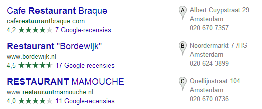
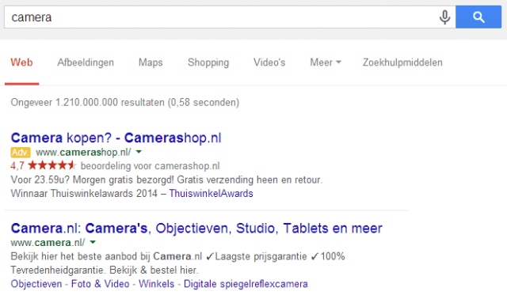
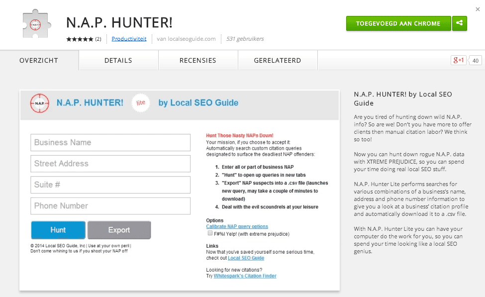
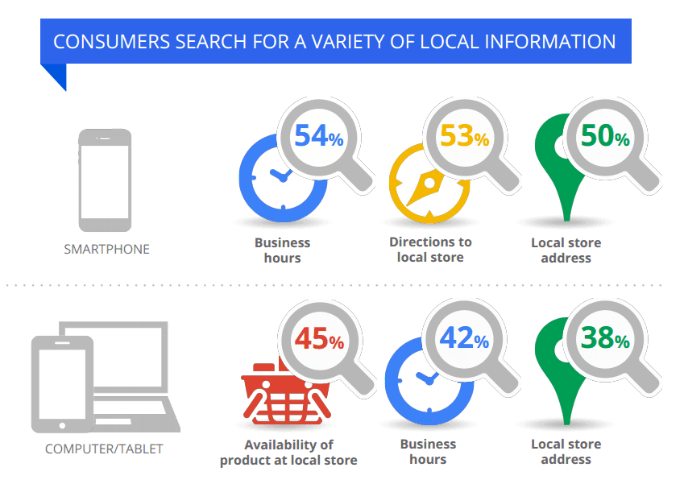

> **Historisch archief.** Deze aflevering verscheen op 4-09-2014 als onderdeel van ReputatieCoaching (2012–2016). De oorspronkelijke tekst is hieronder historisch bewaard. Diensten, contactgegevens, links, tools en adviezen kunnen inmiddels verouderd zijn.



**Transcriptiestatus:** Volledige transcriptie uit het oorspronkelijke archief.

***Historische afbeelding niet beschikbaar: ReputatieCoaching Podcast*
Tja, beloofde ik vorige week dat de podcast deze week op tijd zou komen, is het weer niet gelukt! Ik leg je zo uit hoe dat komt… Dan heb je het mogelijk al wel gehoord of gelezen: Google Authorship is ten einde. Ik vertel je er meer over en leg je uit dat AuthorRank nu alleen nog maar belangrijker wordt. De scholen zijn weer begonnen en daarom wil ik een stukje wijden aan de relatie tussen het naar school gaan en reputatie, zowel online, als offline. Google experimenteert aan de lopende band en op dit moment duiken er in de USA reviewsterretjes op in alle kleuren van de regenboog. En vandaag heb ik een tooltip voor je om gemakkelijk alle plaatsen te vinden, waar je concurrenten citations hebben staan. Google publiceerde een tijdje geleden een rapport over het lokale zoekgedrag van internetters, daar vertel ik je iets over en ik sluit de podcast van vandaag af met de vraag of je je moet richten op lokale SEO, nationale SEO of wereldwijde SEO en waarom.**

Hallo en hartelijk welkom bij deze aflevering van de ReputatieCoaching Podcast. Ik ben Eduard de Boer, ook bekend als de ReputatieCoach. Dit is dé podcast die jou helpt om meer business te genereren, doordat je beter gevonden wordt, zowel lokaal als landelijk en doordat ik je uitleg hoe je je online reputatie kunt verbeteren. Dit alles kan je helpen om jezelf beter op de online kaart te plaatsen.

En de podcast is niet alleen voor bedrijven, ook als je een professional bent, kun je met een aantal tips, suggesties en nieuwsonderwerpen je voordeel doen om bijvoorbeeld je online reputatie als reisbureaumedewerker, verkoopadviseur, medewerker P en O, allergiearts, bewegingsagoog of wat dan ook te verbeteren.

De podcast kun je vinden op [www.reputatiecoaching.nl/92](https://www.reputatiecoaching.nl/92/). Daar vind je niet alleen de tekst, maar ook video’s waar ik het in deze uitzending over heb, alsmede afbeeldingen, links enzovoorts. Bovendien is de podcast te beluisteren in [iTunes](https://www.reputatiecoaching.nl/itunes) en op [Stitcher](https://www.reputatiecoaching.nl/stitcher). Daar kun je je dus ook abonneren op de wekelijkse podcast. Veel mensen vinden het ideaal om de wekelijkse afleveringen van de podcast op hun gemak te beluisteren, terwijl ze autorijden.

Laat ik dan nu overgaan op de onderwerpen voor vandaag…

## Podcast wederom vertraagd… Sorry!

Ik begon er zojuist al over: heb ik vorige week toegezegd dat de podcast deze week wel weer op tijd zou uitkomen, is het me weer niet gelukt! Sorry daarvoor!

De oorzaak ligt in het feit dat ik heel druk was met de achterstand als gevolg van de klusactie van vorige week weg te werken. En toen kwam er opeens ook nog een tweedaagse fotoshoot tussen, die ik niet kon weigeren. Daardoor moest de podcast het wederom ontgelden en kwam die dus een aantal uren later uit dan gepland.

Wat leer ik hiervan? Tja, het is een beetje naïef, want ik weet hoeveel tijd het kost om een podcast te maken, namelijk zo’n 8 tot 9 uur. En als ik dan wacht tot en met de woensdagmiddag of -avond om de hele podcast te maken, dan kan er wel eens iets fout lopen qua planning…

Ik heb ooit ergens de uitspraak gelezen:

Volgens sommige mensen komt deze uitspraak van John Lennon, want hij publiceerde in 1980 de song “Beautiful Boy” op het album “Double Fantasy” en in deze song zingt hij het volgende:

Maar volgens onderzoek stamt deze uitspraak uit 1957 en is die ooit als eerste gepubliceerd in Reader’s Digest van januari in dat jaar. Onder het kopje “Opmerkelijke Opmerkingen” stond daar de uitspraak:

Maar goed, ik zit hier niet om je geschiedenisles te geven over de herkomst van uitspraken. Feit is dat ik wederom te laat was met het uitbrengen van deze podcast en ik het werk dat ervoor nodig is, beter iets kan verspreiden over de week. Dan is de impact op de woensdagmiddag of -avond niet zo groot. Want als ik alle onderdelen al op een rijtje heb en voor een groot deel helder op het netvlies heb wat ik erover wil vertellen, dan scheelt dat meteen zo’n 4–5 uur aan werk.

OK, ik ga mijn leven beteren!

## Einde van Google Authorship

Ohhhh… wat jammer! Heb ik in december 2012 een mooie instructievideo gemaakt die extreem goed scoorde (en nog steeds goed scoort) over het [instellen van Google Authorship](https://www.reputatiecoaching.nl/wiki/google-authorship/). Zoals je weet zorgde dit ervoor dat de profielfoto, die je op je Google+ profiel had staan, in de zoekresultaten werd vertoond.

Let wel, ik gebruik hier de verleden tijd… Want Google Authorship behoort sinds iets meer dan een week ook tot het verleden. Iets langer terug verdwenen al de foto’s uit de zoekresultaten, maar werd er tenminste nog een regel met de naam van de auteur vertoond. Ook dat is nu ten einde en zowel de foto’s als de naam van de auteur van het artikel worden niet meer vertoond.

Het enige waar je nog de profielfoto’s ziet opduiken, is in verwijzigen naar posts op Google+. Maar die zie je ook alleen maar als je bent ingelogd op Google+. Dan zie je in de zoekresultaten de profielfoto’s van personen en logo’s van zakelijke Google+ pagina’s. Dat is het enige…

Google heeft Authorship uitgezet. Als je John Mueller moet geloven is het ook voorgoed. Op de memorabele datum van 28 augustus schreef John Mueller van Google op Google+ hier het volgende over:

De post gaat nog iets verder en als je ’m wilt nalezen, moet je maar even kijken in de show notes, op [www.reputatiecoaching.nl/92](https://www.reputatiecoaching.nl/92/).

Google doet dus niets meer met of aan Authorship. Maar dat zegt niets over AuthorRank. Dat is iets heel anders. Wat ik nu ga vertellen is meerendeels gestoeld op geruchten en ik moet erbij zeggen dat het bijna nooit officieel door Google is onderkend.

Veel SEO-specialisten verwarren vaak Authorship met AuthorRank. Maar AuthorRank is een beoordeling van een auteur, terwijl Authorship slechts de auteur van een artikel benoemde. AuthorRank is dus groter en volgens diverse bronnen is het een mechanisme, waarbij Google de waarde van content bepaalt en daarmee ook een beoordeling geeft aan een auteur.

Het ligt voor de hand dat Google content van auteurs wil kunnen waarderen om zo de werkelijke specialisten, kennispartijen en mensen met een grote mate van autoriteit te leren kennen. Want de kans is groot dat content van die mensen over het algemeen interessanter is voor de zoekende internetter, dan een flutartikeltje van een leerling van de basisschool.

De enige verwijzing naar AuthorRank die we van Google kennen stamt uit maart 2014. Amit Singhal, het hoofd van Google Search, zei toen in een interview dat *AuthorRank nog niet werd gebruikt.*..

We zullen zien wat Google in de toekomst brengt… Tot op heden is alles hierover vergelijkbaar met koffiedikkijkerij. Je kunt ervan balen dat het weg is, of het gewoon accepteren. Feit blijft, dat het weg is en niet meer terugkomt.

Volgens Google lag dus een deel van de oorzaak in de geringe mate waarmee dit mechanisme door auteurs werd opgepakt, anders dan door handige SEO-specialisten. Hieruit blijkt dat Google altijd diensten die het eerder met veel tamtam heeft geïntroduceerd, op elk gewenst moment weer kan uitzetten. Dus laat dit voor jou ook een teken zijn dat je je nooit 100% moet focussen op implementeren van nieuwe features om daarmee je gewin te halen. Ga door met goede content produceren, want door alle jaren heen is toch echt gebleken dat dat je meer brengt dan trucjes toepassen.

## 6 tips voor je reputatie op school

Heb je kinderen die naar school gaan? Of ga je zelf naar school? Ik ga er even vanuit dat je kinderen hebt die naar school gaan. Ik weet natuurlijk niet hoe oud ze zijn, maar heb je het met hen wel eens over de gevaren van Internet? En dan bedoel ik niet de seksueel getinte gevaren, maar de risico’s die op de loer liggen, die later in hun leven een negatief effect kunnen hebben op hun online reputatie?

*Historische afbeelding niet beschikbaar: Stomme dingen online*

Zo heb ik bijvoorbeeld begrepen van onze zoon, die na een paar jaar te zijn gestopt met voetbal, nu weer begint, dat de jeugdige voetballers niet meer naakt mogen douchen, maar in een onderbroek of zwembroek. Dit is gekomen doordat er teveel foto’s uit sportdouches hun weg naar Internet hebben gevonden. Afgezien van het feit dat je dan in je Adams- of Evakostuum aan de wereld wordt vertoond heeft dit relatief weinig negatieve impact op je reputatie.

Maar wat als je stomdronken ergens staat over te geven en die foto komt op Internet? Stel dat die met je naam wordt getagd en een aantal jaren later wordt die foto op basis van jouw naam gevonden door iemand die je die middag wil gaan interviewen voor een baan… Hmmmm… Dat kan aardig in je nadeel werken!

Volg jij je kinderen op de verschillende social media? Lees je wat er over hen wordt geschreven en zie je afbeeldingen die worden gepost? OK, je ziet vast niet alles en volgens mij moet je dat ook niet willen. Je kunt het beter aan de basis oppakken. Dat begint bij het bewust maken van je kinderen, van de risico’s die kunnen kleven aan het online zetten van foto’s, video’s of zelfs belastende teksten.

Ik geef je een aantal tips, waar je mogelijk je voordeel mee kunt doen om ze door te geven aan je kind:

```
  1. **Wees je bewust van wat je deelt** – Deel niet automatisch alles. Denk eerst nog even na, voordat je op “Delen” klikt, om die “grappige” foto van je stomdronken vriendin die staat te paaldansen op een verjaardagsfeestje, op Internet te zetten.
  2. **Wees proactief** – Volg de verschillende sociale media en stel bijvoorbeeld Google Alerts in, om je eigen naam en de namen van je kinderen in de gaten te houden. Dat werkt continu op de achtergrond en als je het eenmaal hebt ingesteld, kun je het gewoon vergeten, totdat je opeens een mailtje met een verwijzing krijgt. Maar op dat moment word jij er tenminste over geïnformeerd!
  3. **Registreer domeinnamen** – Op je eigen naam, de namen van je kinderen etc. Hierdoor kun je voorkomen dat kwaadwillenden jouw naam of die van je kinderen snel en gemakkelijk virtueel kunnen besmeuren.
  4. **Klik niet steeds op verkeerde links, waarvan je denkt dat er iets over jou staat** – Je loopt dan namelijk het risico, dat Google die data dan echt met jou gaat associëren.
  5. **Registreer je op zoveel mogelijk sociale media, ook al doe je er niets mee** – Want als je daar vindbaar bent met de juiste gegevens, dan kun je voorkomen dat iemand zich met jouw naam aanmeldt met compromitterende gegevens.
  6. **Gebruik overal dezelfde profielfoto** – Reden hiervoor is dat je op die manier verwarring voorkomt, evenals potentiële verwisseling met iemand die dezelfde naam heeft. Zo ken ik mensen die een profiel op Facebook hebben gemaakt met daarop hun profielfoto. Verder doen ze niets met Facebook en ze hebben dan ook slechts één publiekelijk leesbare post geplaatst, waarin ze schrijven dat ze niets met Facebook doen.
```

Heb jij nog goede tips om je kids te helpen hun reputatie hoog te houden, evenals die van hun vriendjes en vriendinnetjes? Deel ze en post ze onderaan de show notes van deze podcast, op [www.reputatiecoaching.nl/92](https://www.reputatiecoaching.nl/92/).

## Google test sterren in alle kleuren van de regenboog

Google test aan de lopende band. Zij probeert steeds de gebruikerservaring van de zoekende internetter verder te verbeteren. Door het klikgedrag op verschillend weergegeven resultaten te meten, kan de machine achter Google leren wat betere resultaten oplevert en wat dus leidt tot een betere gebruikerservaring.

In de Nederlandse versie van Google weten we niet beter, dan dat reviewsterren geel zijn, soms een beetje tegen het oranje aan. Recentelijk heeft iemand in Nederland ook rode sterretjes gezien. Maar daarmee houdt het op. In de USA experimenteert Google op dit moment met sterretjes in bijna alle kleuren van de regenboog. Er zijn groene, grijze, blauwe en rode sterren gespot, aan het review-firnament. In de show notes heb ik een paar screenshots geplaatst die ik vond in een [artikel op Search Engine Round Table](https://www.seroundtable.com/green-google-rating-review-stars-19067.html):

[](https://lh5.googleusercontent.com/-0tN0XlYW4AU/VAjQiXlyk0I/AAAAAAAABIc/SghrNyEoHHY/w524-h218-no/20140904-Google-green-stars-ratings-local.png)

[](https://lh4.googleusercontent.com/-tYY16g4ML_M/VAjQi8dhc3I/AAAAAAAABIs/unRx-dJRbZs/w640-h293-no/20140904-grijze-sterren.png)

[](https://lh3.googleusercontent.com/-ELRUmHGNFp0/VAjQjFyip_I/AAAAAAAABIw/YljBKaKsu4s/w640-h373-no/20140904-rode-sterren.png)

Ik heb ze nog niet gezien, maar ik ben wel benieuwd of de sterretjes in de toekomst een andere kleur gaan krijgen, of dat ze gewoon geel blijven. Wat denk jij? Blijven ze geel? Of worden ze rood, of grijs, of groen? Of krijgen ze nog een andere kleur? Geef gerust je mening!

## Tooltip: N.A.P. Hunter!

Ik heb vorig jaar de “[Werkinstructie opschonen citations](https://www.reputatiecoaching.nl/werkinstructie-opschonen-citations/)” gemaakt, waarin ik je uitleg hoe je:

```
  1. Je eigen citations kunt vinden
  2. Zoveel mogelijk citations van je concurrenten kunt vinden, zodat jij je bedrijf daar ook kunt aanmelden
  3. Citations in het algemeen zoekt
```

Dat was toen allemaal handmatig: je moest zelf met allerlei combinaties van je bedrijfsnaam met en zonder telefoonnummer zoeken enzovoorts. Ik ga hier even niet herhalen, wat ik allemaal in die werkinstructie heb geschreven. Lees die maar eens op je gemak na.

Sinds enige tijd is er voor Chrome, de browser van Google, een extensie verkrijgbaar, met de naam “[N.A.P. Hunter!](https://chrome.google.com/webstore/detail/nap-hunter/ligeiippheclogiddffemogcgpjmieao)”. Deze extensie neemt je al het moeizame werk uit handen.

[](https://lh6.googleusercontent.com/-qEDTIpQ0Cxg/VAjQiYhl7vI/AAAAAAAABIo/j_mmRASBaKc/w975-h597-no/20140904-NAP-Hunter.png)

De tool simuleert alsof een gebruiker allemaal verschillende zoekpogingen op Google doet op basis van de ingevoerde bedrijfsnaam, adres, postcode, plaats en telefoonnummer. Het werkt echt fantastisch!

Ik liep alleen tegen een klein probleempje aan: standaard staat de tool zó ingesteld, dat die tussen elke zoekpoging slechts 2 seconden wacht. Dat bleek te kort, want binnen no-time had Google in de gaten dat er vanaf mijn IP-adres mogelijk illegale handelingen werden verricht. Ik moest toen elke keer een captcha invullen, om weer handmatig te kunnen zoeken. Pas toen ik de wachttijd tussen twee pagina’s op het maximum van 10 seconden had ingesteld, liep het vlekkeloos.

Naast dat de tool je de resultaten op het scherm kan geven, kan die ze ook exporteren naar een CSV file, die je dan later weer kunt gebruiken in Excel of Google spreadsheets.

Meestal laat ik de tool gewoon rustig op de achtergrond lopen om zoveel mogelijk citations te vinden. Want ik doorzoek namelijk per zoekterm niet 10, maar maximaal 200 resultaten. Dat kost dan nog iets meer tijd. Maar citations opsporen is niet een actie, die volgens mij met bloedspoed moet worden uitgevoerd, als jij dat nodig vindt: je kunt best even wachten. Want de bulk van het werk begint toch pas daarna.

Ik ben me ervan bewust dat je mogelijk wat vragen hebt over het gebruik van de extensie N.A.P. Hunter!. Daarom zal ik binnenkort een instructievideo maken, waarin ik je uitleg hoe je ermee kunt werken en hoe je deze GRATIS tool kunt gebruiken om boven je concurrenten te komen in de lokale zoekresultaten!

## Understanding Consumers’ Local Search Behavior

In mei van dit jaar heeft Google samen met twee researchinstanties onderzoek gedaan naar het lokale zoekgedrag van internetters op smartphones, computers en tablets. Alle ondervraagden waren 18+ en zochten tenminste enkele keren per week iets op de smartphone. De totale populatie bestond uit 4.500 deelnemers.

Hieruit kwamen de volgende resultaten naar voren, die je waarschijnlijk niet allemaal zullen verbazen:

```
  * 4 van de 5 consumenten gebruiken zoekmachines om lokale informatie te zoeken
  * Ze zoeken naar winkeladres, openingstijden, beschikbare productassortiment en de routebeschrijving
  * 50% van de consumenten die een lokale zoekopdracht op hun smartphone uitvoerden, bezochten binnen 24 uur een fysieke winkel, tegenover 34% van de computer/tablet gebruikers
  * 4 van de 5 consumenten wil gelocaliseerde advertenties, op basis van hun postcode, plaats of directe omgeving
  * 53% van de consumenten zocht wel eens lokale informatie, terwijl ze thuis waren, terwijl maar liefst 51% dat ook onderweg deed, in de auto, bus, trein etc.
```

[](https://lh6.googleusercontent.com/-EFii368BAt0/VAjQiePX9MI/AAAAAAAABI4/WA_1U5F3ypU/w849-h601-no/20140904-Customer-local-behaviour.png)

Je vindt een link naar de PDF-versie van het rapport “Understanding Consumers’ Local Search Behavior” [in de show notes](https://chrome.google.com/webstore/detail/nap-hunter/ligeiippheclogiddffemogcgpjmieao).

## Lokale SEO of nationale SEO? Of wereldwijde SEO?

Ik roep steeds “Begin met lokale SEO!” en dat is een credo dat je veel meer hoort in de markt. Maar wat als je Shell heet, of AkzoNobel, of Apple? Wat moet je dan met lokaal? Moet je dan überhaupt wel iets aan lokale SEO willen doen? Wat voor zin heeft het? Wat valt er te winnen?

Heb jij hier wel eens over nagedacht? Is jouw bedrijf lokaal georiënteerd? Richt je bedrijf zich op een bepaalde regio of op heel Nederland? Of werk je mogelijk bij een multinational?

Laat ik beginnen met een multinational. Organisch wordt die meestal wel goed gevonden op de belangrijkste termen, omdat dat type bedrijven grote websites hebben met een schat aan relevante informatie en dus veel interessant voer voor de zoekmachines.

*Historische afbeelding niet beschikbaar: Lokale SEO: Lokaal zoeken en vinden*

Hetzelfde geldt voor grote nationale bedrijven, die hebben ook vaak meer dan voldoende content, waarop ze organisch gevonden kunnen worden.

*Historische afbeelding niet beschikbaar: Zet je bedrijf op de mobiele kaarten!*
Het knelpunt voor lokaal opererende bedrijven is dat ze vaak níet zoveel content hebben en daardoor organisch minder goed gevonden kunnen worden. En waarschijnlijk is dat ook de reden dat Google ooit is begonnen met de introductie van de lokale zoekresultaten, om zo lokale ondernemers de kans te geven hun bedrijf toch op de voorpagina van Google te krijgen.

Dat was ten aanzien van organisch scoren op basis van content. Laten we eens naar andere facetten kijken, zoals ik die noemde in relatie tot het onderzoek van Google, waarin wordt vermeld wat mensen zoal aan lokale informatie zoeken. Ik herhaal er een paar voor je: winkeladres, openingstijden, beschikbare productassortiment, routebeschrijving et cetera.

Dan heb je het dus opeens vaak niet over verschillende hypotheekvormen, maar over informatie die echt relevant is voor de positie van de zoekende internetter, dus gerelateerd aan zijn of haar context, de omgeving.

Stel dat je dan Rabobank heet en iemand zoekt een PIN-automaat, terwijl de lokale gegevens van jouw PIN-automaten 5 jaar oud zijn, dan kan dit leiden tot een negatieve associatie met de Rabobank bij de zoekende internetter. En als je bedrijf Shell is en iemand zoekt het dichtstbijzijnde tankstation, en jouw pomp wordt niet vertoond… Oeps… dat kost je business… Die persoon gaat dan dus naar een concurrent! Hetzelfde geldt voor alle bedrijven die een fysieke bedrijfslocatie hebben: als je online niet wordt gevonden in de lokale zoekresultaten, dan ben je een dief van je eigen portemonnee!

Wat je van deze voorbeelden kunt leren, is dat je als groot bedrijf niet per se helemaal los moet gaan met lokale SEO, maar dat het wel degelijk van invloed kan zijn op je bedrijfsresultaat! Vergeet niet, dat volgens diverse onderzoeken de eerste lokale vermelding, dat is dus die met de “A”, maar liefst 54% van alle kliks op de pagina krijgt! De rest wordt verdeeld over de andere links die ook op die pagina staan…

Dus ook voor een multinational kan het lonend zijn om één of twee mensen aan het werk te zetten om alle lokale informatie op te sporen, te corrigeren, te verrijken en toe te voegen. Reken maar eens uit, wat je verliest aan omzet, als je niet lokaal gevonden wordt…

Met dit topic over lokale SEO, nationale SEO en wereldwijde SEO kom ik dan weer aan het einde van deze podcast.

Als je de podcast leuk vindt en je wilt nog meer op de hoogte blijven, volg me dan ook op Twitter, via [@reputatiecoach1](https://twitter.com/reputatiecoach1).

Heb je inderdaad wat aan alle informatie die ik met je deel, help mij dan met het verder verbeteren en promoten van deze podcast. Surf daarvoor naar [iTunes](https://www.reputatiecoaching.nl/itunes) of [Stitcher](https://www.reputatiecoaching.nl/stitcher), geef de podcast een sterrenbeoordeling en laat ook je reactie achter. Door de podcast te beoordelen op iTunes en/of Stitcher breng je de podcast onder de aandacht van een breder publiek.

Je kunt me verder helpen, door de podcast aan te bevelen bij vrienden of collega’s, waarvan je denkt dat ze er hun voordeel mee kunnen doen, of door ’m te delen op Twitter, like’n en delen op Facebook of een “+1” te geven op Google+.

En vergeet niet: ik ben hier om je te helpen! Als je een vraag of een probleem hebt met betrekking tot je online reputatie of de vindbaarheid van je website, kun je een mailtje sturen naar [podcast@reputatiecoaching.nl](mailto:podcast@reputatiecoaching.nl).

Als je dat te lastig vindt, of als je de podcast beluistert terwijl je in de auto zit en je hebt acuut een vraag, spreek dan een boodschap in op de ReputatieCoaching Hotline, op nummer: 084 - 883 15 56. Mogelijk behandel ik je vraag of probleem dan in een artikel of in de podcast.

En je kunt ook rechtstreeks op de website een voicemail achterlaten, door op de tab aan de rechterkant van elke pagina te klikken, en je bericht in te spreken. Dit was [ReputatieCoaching Podcast aflevering 92](https://www.reputatiecoaching.nl/92/) en mijn naam is [Eduard de Boer](http://nl.linkedin.com/in/eduarddeboer/nl).

Ik wens je de komende week weer succes met het werken aan je reputatie, zodat je meteen je reputatie voor jou kunt laten werken!

Tot volgende week!

Doei!

Links naar content die in deze podcast aan bod komt:

```
  * [ReputatieCoaching Podcast in iTunes](https://www.reputatiecoaching.nl/itunes)
  * [ReputatieCoaching Podcast op Stitcher](https://www.reputatiecoaching.nl/stitcher)
  * [ReputatieCoaching Podcast RSS-feed](https://feeds.reputatiecoaching.nl/ReputatieCoachingPodcast)
  * [N.A.P. Hunter!](https://chrome.google.com/webstore/detail/nap-hunter/ligeiippheclogiddffemogcgpjmieao) (Google Chrome extensie)
```
