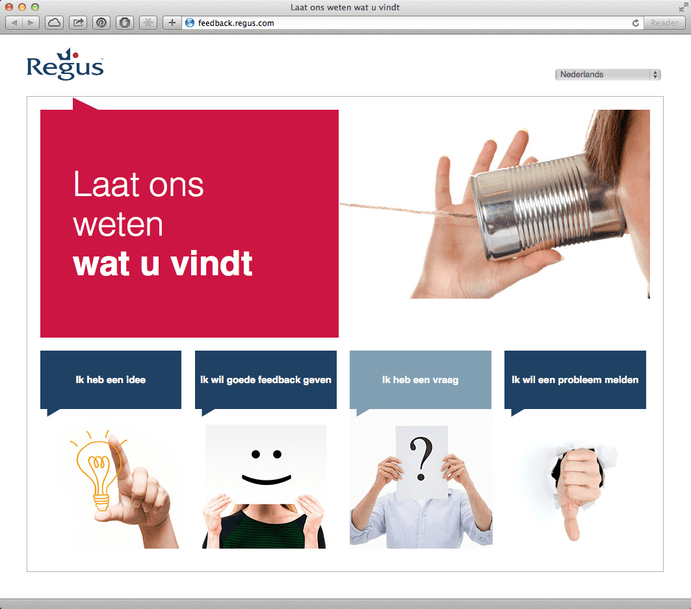

> **Historisch archief.** Deze aflevering verscheen op 11-09-2014 als onderdeel van ReputatieCoaching (2012–2016). De oorspronkelijke tekst is hieronder historisch bewaard. Diensten, contactgegevens, links, tools en adviezen kunnen inmiddels verouderd zijn.

**Transcriptiestatus:** Volledige transcriptie uit het oorspronkelijke archief.

***Historische afbeelding niet beschikbaar: ReputatieCoaching Podcast*
De onderwerpen voor deze podcast zijn voornamelijk uitgewerkt tijdens een flexwerksessie, daarover zo meteen meer. En vorige week na het publiceren van de podcast, zag ik dat WordPress 4.0 was uitgekomen, dus daar wil ik je ook het één en ander over vertellen. Ook heb ik de oplossing, als je tegen problemen aanloopt met het autoriseren van de plugin BackWPup met je Dropbox-account. Verder heb ik antwoord op de vraag of responsive webdesign een ranking signaal is voor Google, een topic over de hersteltijd bij een Penguin algoritmische penalty en sindskort is de Google Webmaster Academy ook in het Nederlands beschikbaar. Dan behandel ik nog de voor- en nadelen van endless scrolling pagina’s en ik sluit de podcast van vandaag af met een topic over contentmarketing met spreuken en een aankondiging voor de uitzending van volgende week.**

Hallo en hartelijk welkom bij deze aflevering van de ReputatieCoaching Podcast. Ik ben Eduard de Boer, ReputatieCoach. Dit is dé podcast die jou helpt om meer business te genereren, doordat jouw website beter gevonden wordt, zowel lokaal als landelijk en doordat ik je uitleg hoe je je online reputatie kunt verbeteren. Dit alles kan je helpen om je bedrijf en jezelf beter op de online kaart te plaatsen.

Als persoon kun je met de diverse tips aan de slag om bijvoorbeeld je online reputatie als chef werkplaats, databaseontwerper, softwaretester, elektromonteur, beleidsaviseur, ijzervlechter of wat dan ook te verbeteren.

De podcast kun je vinden op [www.reputatiecoaching.nl/93](/nl/archief/reputatiecoaching/093/). Daar vind je niet alleen de tekst, maar ook video’s waar ik het in deze uitzending over heb, alsmede afbeeldingen, links enzovoorts. Bovendien is de podcast te beluisteren in [iTunes](https://web.archive.org/web/*/https://www.reputatiecoaching.nl/itunes) en op [Stitcher](https://web.archive.org/web/*/https://www.reputatiecoaching.nl/stitcher). Daar kun je je dus ook abonneren op de wekelijkse podcast. Veel mensen vinden het ideaal om de wekelijkse afleveringen van de podcast op hun gemak te beluisteren, terwijl ze autorijden.

Laat ik dan nu overgaan op de onderwerpen voor vandaag…

## ReputatieCoach goes flex!

Laat ik beginnen te zeggen dat ik een fantastisch mooi kantoor aan huis heb (of beter gezegd: boven de garage), waar ik ook graag werk. Een trend die al een aantal jaren gaande is, is “Het Nieuwe Werken” en het leek mij leuk om daar ook eens ervaring mee op te doen. Dus heb ik de plaatselijke vestiging van Regus in Apeldoorn benaderd, met de vraag of ik het eens uit mocht proberen.

Toegegeven, het is niet bijzonder flexwerken, want de Regus kantoorruimte is hemelsbreed slechts zo’n anderhalve kilometer van mijn huis. Maar als ik officieel klant zou worden van Regus, dan kan ik ofwel in Apeldoorn, in heel Nederland of in de hele wereld onbeperkt werken in de business lounges en gebruik maken van alle faciliteiten op de desbetreffende locatie.

Nadat ik onze dochter naar school had gebracht reed ik door naar mijn tijdelijke “kantoor”. Daar werd ik vriendelijk welkom geheten door de dame aan de receptie die mij op weg hielp met het verbinden met het WiFi van de locatie. Even later kwam ze vragen of alles naar wens was. Inmiddels was ik al online aan het werk op mijn Chromebook, dus het was prima. Ook kwam de general manager nog even vragen of hij nog iets kon betekenen. Het valt me op dat de medewerkers ontzettend dienstgericht zijn en behulpzaam. Ze doen er alles aan om je verblijf zo aangenaam mogelijk te maken.

[[Historische afbeelding: Panoramafoto van de Business Lounge van Regus Apeldoorn](https://lh3.googleusercontent.com/-uEe1QVuSNi0/VA__PnuadiI/AAAAAAAA9EA/g69H2Y7_nbQ/w1110-h434-no/IMG_6280.JPG)](https://lh3.googleusercontent.com/-uEe1QVuSNi0/VA__PnuadiI/AAAAAAAA9EA/g69H2Y7_nbQ/w1110-h434-no/IMG_6280.JPG)

Het enige kleine minpuntje vond ik wel dat je in de Business Lounge, waarvan ik overigens een foto heb opgenomen in de show notes, de mensen aan de receptie de telefoon hoort opnemen en hoort spreken. Maar met de oordopjes van de iPhone in, afgestemd op een Internetradiozender met relaxte muziek, was dat kleine ongemak snel verholpen en vloog de content uit mijn vingers.

Vaak krijg ik buikkrampen van de koffie uit van die Douwe Egberts kantoorkoffieapparaten. En ik hou nu eenmaal van koffie, dus dat is jammer. Vaak beperk ik me dan noodgedwongen tot water of thee. Maar de koffie die uit het apparaat in de pantry bij Regus komt smaakt heerlijk en geeft mij geen buikkrampen.

In de Business Lounge was ik aan het werk in een zogenaamde Thinkpod. Dat is een kleine ovale werkplek van zo’n één vierkante meter, die is voorzien van drie stopcontacten, een lampje en een werkblad, waar je prima je laptop of zoals in mijn geval een Chromebook, een notitieblok, en je mobiele telefoon kwijt kunt. Heb je meer ruimte nodig voor je werk, dan moet je upgraden naar een kantoor.

[Historische afbeelding: Thinkpad in Regus Apeldoorn](https://lh4.googleusercontent.com/-AjsVUxIhFPw/VA__WBVkceI/AAAAAAAA9As/RxD-pbzzThw/s880-no/IMG_6284.JPG)

Ik denk echter dat die Thinkpods voor veel flexwerkers prima volstaan. De bureaustoel zit prima en voor mij is de werkhoogte van het bureau ook prima. De diepte van het bureau stelt me in staat om mijn ellebogen te laten rusten, hetgeen de schouders ontlast.

[[Historische afbeelding: Regus reviewmanagement](https://lh4.googleusercontent.com/-dEJaXcxZ-a0/VBAdgSaMH2I/AAAAAAAA9Bo/ng2ShtAW7qE/w1110-h833-no/IMG_6286.JPG)](https://lh4.googleusercontent.com/-dEJaXcxZ-a0/VBAdgSaMH2I/AAAAAAAA9Bo/ng2ShtAW7qE/w1110-h833-no/IMG_6286.JPG)

Regus is overigens een bedrijf dat hard werkt aan haar reputatie. Overal in het pand zie je kaartjes staan en posters hangen met daarop de tekst:

Uw mening telt
Ga naar regus.com/feedback

In de show notes heb ik een foto opgenomen van zo’n kaartje:

[](https://lh4.googleusercontent.com/-hjDvJH93OZg/VBC-EsIvqrI/AAAAAAAABJk/m0pdaydCSjM/w997-h880-no/20140911-Regus-Feedback.png)

Als je naar die URL gaat, dan krijg je het scherm te zien, dat ik ook in de show notes heb opgenomen. Daar heb je de keuze uit vier mogelijkheden:

```
  1. Ik heb een idee
  2. Ik wil goede feedback geven
  3. Ik heb een vraag
  4. Ik wil een probleem melden
```

Het proces dat je dan in gaat, vind ik nogal omslachtig. Na een aantal muiskliks zat ik nog maar op 16% voor het geven van positieve feedback. Ik snap best dat een bedrijf je graag het hemd van het lijf vraagt, maar volgens mij zal een groot aantal mensen snel afhaken. Immers, de meeste mensen zijn bij reviews gewend om gewoon een stukje tekst te schrijven.

Nadeel daarvan voor de onderneming is dan weer, dat het soms moeilijk kan zijn toe te kennen aan bepaalde elementen in je organisatie. Dus dat verklaart weer het omslachtige reviewproces van Regus.

Anyway, dat is slechts mijn mening en mogelijk heb ik het helemaal fout en ontvangt Regus ontzettend veel feedback via hun feedbackpagina.

Wat hoedanook een nadeel is van dit proces, is dat het bedrijf op die manier niet echt snel reviews zal verzamelen op externe sites, zoals Yelp, Google+ of MeetingRoomReview. Want zowel op Yelp als op Google+ heeft Regus Apeldoorn nog geen reviews en op MeetingRoomReview slechts twee.

## WordPress 4.0 is uit!

Al lange tijd zaten we op WordPress versie 3.9, maar vorige week is WordPress 4.0 uitgekomen met codenaam “Benny”. Een major versie upgrade, dus dat suggereert ook een major upgrade in functionaliteit. Laat ik eens langsgaan wat de belangrijkste vernieuwingen zijn.

Versie 4.0 met de naam “Benny” is vernoemd naar Benny Goodman, de bekende jazz klarinettist en bandleider. Maar is het een major upgrade?

Volgens de programmeurs achter dit enorm populaire CMS is het slechts een nummer volgend op 3.9 en dat komt voor 4.1. Wat springt meteen in het oog, qua aanpassingen en vernieuwingen?

Allereerst: de WYSIWYG editor is verbeterd, dus als je bijvoorbeeld de URL van een video in een blogpost plakt, dan wordt de video ook daadwerkelijk weergegeven, in plaats van dat je alleen een rechthoekig kader ziet. Het zoeken naar en vooral het vinden van plugins is enorm verbeterd. Je kunt nu snel meer lezen over plugins en zo in minder tijd de gewenste plugin vinden en installeren.

De mediabibliotheek is vernieuwd en stelt je in staat om nog gemakkelijker je bestanden te beheren. Ook werkt slepen en kopiëren nog beter. Als je doorklikt naar een mediabestand, krijg je de vernieuwde metadata-editor te zien, waarin je alle gegevens van het bestand snel en eenvoudig kunt aanpassen. Audio- en videobestanden kunnen nu ook in de metadata-editor worden afgespeeld.

Doel van deze versie was het verbeteren van de samenhang tussen het creëren, beheren en publiceren van content.

In de show notes heb ik een video opgenomen van het WordPress-team, waarin dit allemaal nog eens wordt toegelicht:

Zoals altijd heb ik voor het upgraden van mijn WordPress-installatie eerst een volledige backup gemaakt met de plugin BackWPup, want er kan altijd iets fout gaan, dus is het handig om een actuele backup bij de hand te hebben.

De upgrade verliep snel en probleemloos, zoals tot nu toe altijd de laatste paar jaren. Maar ik ben een voorstander van de Engelse uitspraak: “Better safe, than sorry”.

## Probleem met BackWPup in relatie tot W3 Total Cache

*Historische afbeelding niet beschikbaar: CameraSync*
Even doorgaand over de plugin BackWPup. Ik heb die al vaker genoemd in de podcast en afgelopen week was ik bezig met het opzetten van een nieuwe WordPress site, waar ik natuurlijk ook de plugin installeerde. Voor die site had ik ook een apart Dropbox account aangemaakt, om zo daar de backups te kunnen opslaan in de cloud.

Ik liep echter tegen het probleem aan dat ik de plugin niet geautoriseerd kreeg in het desbetreffende Dropbox-account. Daar was ik nog nooit eerder tegenaan gelopen, dus ik richtte mij tot mijn grote steun en toeverlaat in dit soort situaties: Google.

Na enig zoeken vond ik een verwijzing naar een probleem in de samenhang tussen BackWPup en de plugin “W3 Total Cache”. Deze laatste is één van mijn favoriete plugins voor het verder verbeteren van de performance van WordPress sites. De oplossing bleek te liggen in het tijdelijk uitschakelen (deactiveren) van “W3 Total Cache”, terwijl BackWPup autoriseert bij Dropbox. Als dat eenmaal gelukt is, kun je W3 Total Cache weer activeren en werkt alles naar behoren.

## Responsive design een ranking signaal?

Ik krijg nogal eens de vraag hoe belangrijk het is om een website responsive te maken, waardoor die dus zowel werkt op desktops, als op tablets en smartphones. En daaraan gerelateerd is dan ook vaak de vraag of het hebben van een responsive site in je voordeel werkt bij het scoren in de zoekresultaten. Met andere woorden: is een responsive webdesign een ranking signaal voor Google?

Deze vraag werd onlangs ook in een Google Webmaster Hangout sessie aan John Mueller van Google gevraagd. Hij vertelde dat Google responsive design *niet* gebruikt als een ranking signaal.

Dus zowel responsive websites, als dedicated mobiele sites kunnen beide goed scoren in de zoekresultaten.

De reden dat Google responsive webdesign adviseert, is dat er bij die oplossing technisch vaak minder problemen optreden.

Op zich is het ook logisch dat Google zich niet uitspreekt over de implementatiewijze, waarop je content aan mobiele gebruikers wilt bieden. Google wil alleen dat je een maximale gebruikerservaring biedt aan je bezoekers.

## Alleen herstel van een Penguin penalty na een update?

Ik had het zojuist over rankings in de zoekresultaten. In de Google Webmaster Help discussiegroepen las ik de vraag of [Google ooit een officieel statement heeft gedaan of je alleen na een Penguin update terug kunt keren in de zoekresultaten, als je voorheen je rankings bent kwijtgeraakt als gevolg van een Penguin algoritmewijziging](https://productforums.google.com/forum/#!topic/webmasters/uSnoKBTIvdU/discussion).

Ook hier geeft John Mueller weer antwoord. Hij zegt feitelijk vier zaken:

```
  1. Zelfs als Google een algoritme-update draait, dan zijn de wijzigingen niet meteen te zien, dus dat is normaal.
  2. Een site wordt eigenlijk nooit geraakt door slechts één algoritme, het zijn altijd meerdere algoritmes die van invloed zijn op slechte rankings of het niet verschijnen van sites in de zoekresultaten.
  3. In sommige gevallen, als een site sterk wordt geraakt door een specifiek algoritme, betekent dat niet dat je totaal geen veranderingen kunt zien, tot het algoritme is aangepast of de data in de index is ververst.
  4. Puur theoretisch: als je site door slechts één algoritme wordt geraakt en je daardoor slecht scoort in de zoekresultaten, dan moet je wachten tot het algoritme weer eens draait en/of de data wordt ververst, voordat je een verbetering kunt waarnemen.
```

Mocht het je trouwens verbazen dat op dit moment alleen John Mueller vaak aangehaald wordt en niet meer Matt Cutts, dan kan ik je zeggen dat Matt Cutts al enige tijd geniet van een lange vakantie. Hij heeft dit een paar maanden geleden bekendgemaakt. Heel soms zie je een berichtje van Matt op Twitter of in Google+, maar het lijkt erop dat hij zijn woorden nakomt en meer tijd spendeert aan zijn privéleven.

## Google Webmaster Academy

In [podcast 84](/nl/archief/reputatiecoaching/084/) vertelde ik je over de YouTube Academy, maar wist je eigenlijk dat Google ook al ruim twee jaar de [Webmaster Academy](https://support.google.com/webmasters/answer/6001102?hl=nl) heeft? Voorheen was die alleen in het Engels beschikbaar, maar sinds een paar dagen is die in maar liefst 22 talen te raadplegen.

[](https://lh3.googleusercontent.com/-zw6Ge0YODVo/VBC5NCBK9dI/AAAAAAAABJQ/0c258WM0Kjs/s880-no/webmaster_academy_international.png)

De Webmaster Academy is nu dus ook ook in het Nederlands [beschikbaar](https://support.google.com/webmasters/answer/6001102?hl=nl). Mocht je denken dat je alles al weet, probeer dan eens de quiz aan het einde van elke module te maken en zie hoe je scoort. Toch kan het doorlopen van de academy waarschijnlijk geen kwaad, zeker niet als je nog niet zo lang bezig bent met je website en/of contentmarketing.

De cursus bestaat uit de volgende drie modules:

```
  1. Een geweldige site maken
  2. Ontdekken hoe Google je site interpreteert
  3. Het gebruik van de Google hulpbronnen
```

Ik heb de drie quizzen snel even gedaan en gelukkig wist ik de juiste antwoorden. Anders moest ik me toch echt zorgen gaan maken.

## Voor- en nadelen van endless scrolling

Je ziet ze steeds vaker… Je weet wel: pagina’s als Google afbeeldingen, Twitter, Pinterest en andere… Van die pagina’s die je maar kunt blijven doorscrollen.

Vanuit gebruikersperspectief en zeker als je op een mobiele telefoon surft, lijkt dit een goede en voor de hand liggende manier om je content te presenteren. Maar wat zijn nu nog meer voordelen en kleven er ook nadelen aan? En is het iets voor jou om te implementeren op je site? Laat ik hier eens iets dieper in duiken…

**Voordelen**
Allereerst een paar voordelen:

```
  * Ideaal voor mobiele touchscreens - het is gemakkelijker te scrollen, dan om op links te klikken op een mobiele telefoon.
  * Het houdt de aandacht vast - zeker op fotosites, als Flickr en Pinterest. De meeste fotosites hebben sowieso endless scrolling geïmplementeerd. Ook andere content houdt op deze manier beter de aandacht vast.
  * Sites als Twitter en andere sites die realtime informatie weergeven profiteren van endless scrolling, doordat gebruikers snel en gemakkelijk de actuele content kunnen consumeren.
```

**Nadelen**
Laten we dan eens zien welke nadelen er potentieel aan kleven. Want als er alleen voordelen aan endless scrolling zouden zitten, zou elke site dit toch moeten implementeren? Toch? Want wie wil nu niet de aandacht langer vasthouden? Volgens mij is dat het doel van elke webmaster of content marketeer. OK, hier komen dan een paar nadelen:

```
  * Het kan nogal overweldigend overkomen bij gebruikers - doordat ze altijd moeten scrollen om de gewenste informatie te vinden. Bovendien kan het afleidend en vermoeiend zijn als er geen einde komt aan de content. Dat is ook de reden dat Google geen oneindig scrollen op de gewone zoekresultaten heeft geïmplementeerd. En als je op Google Afbeeldingen ver genoeg doorscrollt, dan moet je ook op de knop “Laad meer afbeeldingen” klikken.
  * Je kunt geen footer hebben bij een pagina - Vaak hebben bedrijven belangrijke links in de footer.
  * Het maakt het lastig voor bezoekers om content over te slaan - doordat ze gedwongen worden door alle content te scrollen.
  * De meningen over het effect dat dit kan hebben op SEO als gevolg van de schier oneindige lengte van pagina’s (die dan dus eigenlijk geen pagina’s meer zijn) zijn verdeeld. Want hoe kan bijvoorbeeld Googlebot nu weten wat het einde is en als die eerder afbreekt, loop je dan niet het risico dat belangrijke content _niet_ wordt geïndexeerd?
```

Heb jij al eens overwogen om je site te presenteren als één lange pagina? Of heb je dit mogelijk al geïmplementeerd? Het lijkt mij interessant en leerzaam eens te zien hoe jij dit hebt gerealiseerd. Dus laat het me weten en laat een berichtje achter op [www.reputatiecoaching.nl/93](/nl/archief/reputatiecoaching/093/).

## Content marketing met spreuken

Je ziet vaak dat bedrijven en marketeers in het kader van contentmarketing online spreuken publiceren. Dat komt omdat spreuken, citaten, uitspraken of hoe je ze maar wilt noemen, een veelgezocht onderwerp is. Als je dus veel van dit soort aforismen of gezegden publiceert, vergroot je de kans dat mensen daarop naar je site komen. En als ze eenmaal op je site zijn en het spreekt ze aan wat ze daar aantreffen, dan gaan ze hoogstwaarschijnlijk wel verder kijken op je site.

Zo helpen spreuken niet alleen maar met het trekken van verkeer naar je site vanuit de zoekmachines, maar helpt het ook voor:

```
  * Vergroten van je naamsbekendheid, zeker als je met een bepaalde regelmaat een spreuk of enkele spreuken publiceert. Zo breng je jezelf namelijk steeds onder de aandacht van je potentiële klanten.
  * Exposure in de social media, want vaak worden goede spreuken gedeeld.
  * Exposure op sites als Twitter, Instagram en Pinterest, als je de spreuken publiceert met of op een mooie foto
```

Ik heb samen met Arend Landman al enigszins geëxperimenteerd met spreuken. Hij heeft als gastblogger vier weken lang spreuken gepubliceerd op [www.reputatiecoaching.nl](https://web.archive.org/web/*/http://www.reputatiecoaching.nl), en ik moet zeggen dat die spreuken nog steeds aardig wat verkeer trekken, evenals de spreuken die ik zelf heb gepubliceerd.

En al die spreuken zijn niet verspreid op mooie foto’s die echt tot de verbeelding moeten spreken. Mijn eigen spreuken had ik gewoon op virtuele tegeltjes geplaatst. Dat kan nog een stuk beter!

Binnenkort start ik dan ook met een bedrijf dat ik coach met het verspreiden van spreuken over voor hen relevante onderwerpen, waarbij we op de achtergrond mooie foto’s gaan gebruiken. Hiervoor komen mijn kwaliteiten als fotograaf goed van pas, want ik ben de afgelopen tijd druk met het maken van tientallen foto’s, die we dan kunnen gebruiken. Ook heeft het bedrijf zelf nog veel foto’s. Al dat materiaal is tenslotte rechtenvrij en ook nog eens uniek.

Zo zijn we mogelijk in staat om een jaar lang elke week een mooie spreuk te publiceren. Nu is het alleen nog de kunst om een groot aantal goede en mooie uitspraken, spreuken, gezegden, citaten en aforismen te vinden die relevant zijn. En omdat het bedrijf zaken doet door heel Europa, gaan we ook nog eens de afbeeldingen met spreuken in twee talen verspreiden.

Op dit moment kan ik er niet veel meer over vertellen, maar ik zal je zeker berichten, als we er een tijdje live mee zijn. En als je alvast een idee wilt hebben, wat het onderwerp is… Zoek me dan op op Instagram en ga me volgen. Want op Instagram test ik welke foto’s mensen mooi vinden, om zo de keuze te maken, welke we gaan gebruiken voor deze campagne… Mijn handle op Instagram is: [EduarddeBoer](https://instagram.com/eduarddeboer) (aan elkaar).

## Morgen interview met Brenda Kok

Morgen heb ik een interview met Brenda Kok, een dame die zich heeft gespecialiseerd in het maken van video’s, Google Hangouts on Air en hier geld mee te verdienen. Dat interview komt volgende week in de podcast, dus abonneer je op de podcast in iTunes of Stitcher. Dan krijg je automatisch altijd de meest recente versie gedownload op je computer of smartphone.

En met deze aankondiging kom ik dan weer aan het einde van de podcast van deze week. Nog zeven afleveringen te gaan en dan bereik ik het voor mij ooit onmogelijk geachte aantal van honderd podcasts.

Ik dacht altijd dat dat alleen voor de grote Amerikaanse jongens en meisjes was weggelegd, maar mede dankzij jouw steun en feedback ben ik zover gekomen en kan ik elke week weer voldoende materiaal verzamelen om zo’n twintig minuten over te vertellen.

Als je de podcast leuk vindt en je wilt nog meer op de hoogte blijven, volg me dan ook op Twitter, via [@reputatiecoach1](https://twitter.com/reputatiecoach1).

Heb je inderdaad wat aan alle informatie die ik met je deel, help mij dan met het verder verbeteren en promoten van deze podcast. Surf daarvoor naar [iTunes](https://web.archive.org/web/*/https://www.reputatiecoaching.nl/itunes) of [Stitcher](https://web.archive.org/web/*/https://www.reputatiecoaching.nl/stitcher), geef de podcast een sterrenbeoordeling en laat ook je reactie achter. Door de podcast te beoordelen op iTunes en/of Stitcher breng je de podcast onder de aandacht van een breder publiek.

Je kunt me verder helpen, door de podcast aan te bevelen bij vrienden of collega’s, waarvan je denkt dat ze er hun voordeel mee kunnen doen, of door ’m te delen op Twitter, like’n en delen op Facebook of een “+1” te geven op Google+.

En vergeet niet: ik ben hier om je te helpen! Als je een vraag of een probleem hebt met betrekking tot je online reputatie of de vindbaarheid van je website, kun je een mailtje sturen naar [podcast@reputatiecoaching.nl](mailto:podcast@reputatiecoaching.nl).

Als je dat te lastig vindt, of als je de podcast beluistert terwijl je in de auto zit en je hebt acuut een vraag, spreek dan een boodschap in op de ReputatieCoaching Hotline, op nummer: 084 - 883 15 56. Mogelijk behandel ik je vraag of probleem dan in een artikel of in de podcast.

En je kunt ook rechtstreeks op de website een voicemail achterlaten, door op de tab aan de rechterkant van elke pagina te klikken, en je bericht in te spreken. Dit was [ReputatieCoaching Podcast aflevering 93](/nl/archief/reputatiecoaching/093/) en mijn naam is [Eduard de Boer](http://nl.linkedin.com/in/eduarddeboer/nl).

Ik wens je de komende week weer succes met het werken aan je reputatie, zodat je meteen je reputatie voor jou kunt laten werken!

Tot volgende week!

Doei!

Links naar content die in deze podcast aan bod komt:

```
  * [ReputatieCoaching Podcast in iTunes](https://web.archive.org/web/*/https://www.reputatiecoaching.nl/itunes)
  * [ReputatieCoaching Podcast op Stitcher](https://web.archive.org/web/*/https://www.reputatiecoaching.nl/stitcher)
  * [ReputatieCoaching Podcast RSS-feed](https://feeds.reputatiecoaching.nl/ReputatieCoachingPodcast)
  * [Google Webmaster Academy](https://support.google.com/webmasters/answer/6001102?hl=nl) (Nederlands)
```
