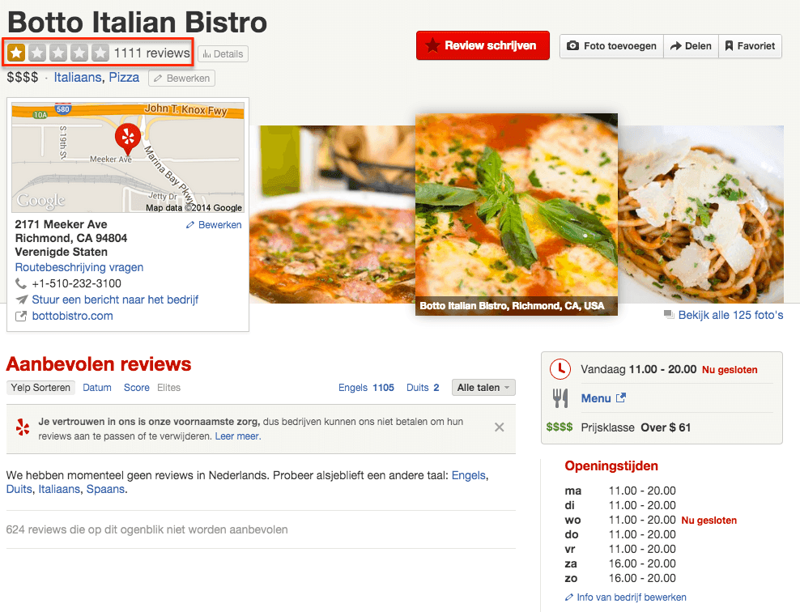
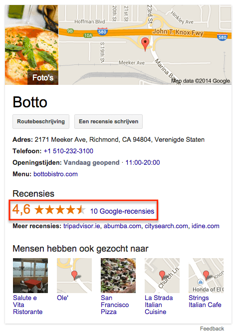

> **Historisch archief.** Deze aflevering verscheen op 25-09-2014 als onderdeel van ReputatieCoaching (2012–2016). De oorspronkelijke tekst is hieronder historisch bewaard. Diensten, contactgegevens, links, tools en adviezen kunnen inmiddels verouderd zijn.

**Transcriptiestatus:** Volledige transcriptie uit het oorspronkelijke archief.

\*\**Historische afbeelding niet beschikbaar: ReputatieCoaching Podcast*
Ik heb veel positieve reacties gekregen op het interview met Brenda Kok, vorige week. Dus daarover zo meer. Vorige week heb ik voor het eerst een zevental Leuke Leerzame Links gestuurd, naar de mensen die zich hebben geabonneerd op de nieuwsbrief. Tot op heden had die mailing een openingspercentage van maar liefst 43,8%. Verder heb ik de afgelopen drie weken vijf keer de vraag gehad, of ik wellicht een cursus podcasting kan samenstellen. Daar hoor of lees ik graag jouw mening over. Een restaurant in Californië vraag alle gasten hen te haten op Yelp en een 1-ster review te geven… Waarom? Dat hoor je straks! Gebruik jij trouwens al WebP voor je websites? Ook daarover meer, later in de show. Verder heb ik nog tips voor het verzamelen van meer reviews, het verkrijgen van meer citations en over het sluiten van de dienst Panoramio. \*\*

Hallo en hartelijk welkom bij deze aflevering van de ReputatieCoaching Podcast. Ik ben Eduard de Boer, ReputatieCoach. Dit is dé podcast die jou helpt om meer business te genereren, doordat jouw website beter gevonden wordt, zowel lokaal als landelijk en doordat ik je uitleg hoe je je online reputatie kunt verbeteren. Dit alles kan je helpen om je bedrijf en jezelf beter op de online kaart te plaatsen.

Als persoon kun je met de diverse tips aan de slag om bijvoorbeeld je online reputatie als salarisadministrateur, leraar basisonderwijs, kleuterjuf, webdesigner, Big Data consultant of wat dan ook te verbeteren.

De podcast kun je vinden op [www.reputatiecoaching.nl/95](/nl/archief/reputatiecoaching/095/). Daar vind je niet alleen de tekst, maar ook video’s waar ik het in deze uitzending over heb, alsmede afbeeldingen, links enzovoorts. Bovendien is de podcast te beluisteren in [iTunes](https://web.archive.org/web/*/https://www.reputatiecoaching.nl/itunes) en op [Stitcher](https://web.archive.org/web/*/https://www.reputatiecoaching.nl/stitcher). Daar kun je je dus ook abonneren op de wekelijkse podcast. Veel mensen vinden het ideaal om de wekelijkse afleveringen van de podcast op hun gemak te beluisteren, terwijl ze autorijden.

## Terugblik naar podcast 94: Interview met Brenda Kok

*Historische afbeelding niet beschikbaar: Brenda-Kok*
Laat ik eerst nog even terugkijken naar de vorige podcast… In [podcast 94](/nl/archief/reputatiecoaching/094/) had ik Brenda Kok van [Sparkling Professionals](http://www.sparklingprofessionals.com) te gast. Zij vertelde honderuit over videomarketing, video SEO, en gaf drie hele praktische en nuttige tips voor ondernemers die willen starten met video. Deze praktische tips waren:

```
  1. Begin vandaag nog met video.
  2. Begin simpel.
  3. Bezint eer ge begint.
```

Als je hier meer over wilt weten en veel meer wilt horen over videomarketing, dan raad ik je aan om echt [podcast 94](/nl/archief/reputatiecoaching/094/) te beluisteren, als je dat nog niet hebt gedaan. En als je het al wel gedaan hebt, dan kan het heus geen kwaad om ’m nogmaals te beluisteren. Zelf heb ik er afgelopen week de tijd voor genomen en ik heb er toch ook weer een paar voor mij waardevolle takeaways uit kunnen halen.

Ondanks dat het interview maar liefst zo’n 48 minuten duurde, heb ik een paar heel positieve reacties ontvangen. Zo schreven Robert en Hans dat ik wel vaker dit soort toppers mag interviewen wat hen betreft en dat zij het niet te lang vonden. Lang is tenslotte relatief: het wordt pas lang of langdradig, als je er niets meer van opsteekt, van wat de persoon die wordt geïnterviewd, vertelt. En dat was volgens mij voor de meeste luisteraars absoluut niet het geval.

Brenda heeft ook aan haar mailinglist een mail gestuurd, waarin ze vertelt over het interview. En dankzij die promotie heb ik ook weer een groot aantal extra bezoekers gehad, hebben weer meer mensen zich ingeschreven voor de ReputatieCoaching nieuwsbrief en heb ik weer een paar volgers op Twitter erbij.

Laat ik dan nu overgaan op de onderwerpen voor vandaag…

## Leuke Leerzame Links worden veel gelezen

Vorige week was het dan eindelijk zo ver: ik heb voor het eerst een paar Leuke Leerzame Links gestuurd naar de mensen die zich hebben geabonneerd op de nieuwsbrief. Afgaand op het vrij grote percentage mensen dat de mail in de eerste paar dagen heeft geopend, denk ik dat het wel in de smaak viel.

Helaas heb ik nog geen reacties terug gehad. Wel heeft één persoon zich meteen uitgeschreven, nadat ik de mail heb verstuurd. Maar ik denk dat dat meer over de interesse van die persoon zegt, dan over de mail. Althans, dat hoop ik. Heb jij de mail ontvangen? Vertel me wat je ervan vond. Je kunt antwoorden op de mail, of je reactie achterlaten op [www.reputatiecoaching.nl/95](/nl/archief/reputatiecoaching/095/).

In die mail heb ik toegezegd dat ik mijn best doe om net vóór het weekend, of anders tijdens het weekend, een mail te sturen met daarin de Leuke Leerzame Links, die helaas de podcast niet hebben gehaald om welke reden dan ook.

## Wat is podcasting?

Meer interesse voor training podcasting?

In de opening vertelde ik je al dat ik de afgelopen paar weken vijf keer de vraag heb gekregen, of ik een training over podcasting in elkaar kan zetten. Nu ben ik erg benieuwd of er onder de luisteraars nog meer mensen zijn die graag de ins en outs willen weten van podcasting en hoe je je eigen podcast kunt maken en in iTunes en in Stitcher kunt krijgen.

Heb jij mogelijk interesse in een (betaalde) online training over het opzetten en lanceren van je eigen podcast? Laat het me weten en stuur een mailtje naar [podcast@reputatiecoaching.nl](mailto:podcast@reputatiecoaching.nl).

## Gebruik jij al WebP?

Iedereen heeft wel over JPG gehoord of gelezen als een bestandsopmaak voor foto’s en weet dat tekeningen en grafieken vaker in GIF online worden gezet. Minder mensen kennen (denk ik) PNG en ik schat dat nog minder mensen SVG als opmaak voor lijntekeningen kennen. Maar heb jij wel eens gehoord of gelezen van [WebP](https://developers.google.com/speed/webp/?csw=1)? Ik hoor je al vragen: “Watte?”. Ik heb het over “Web-P”, dus (“W-e-b P”), dat je uitspreekt als “Weppie”.

“WebP” is een relatief nieuw en vrij bestandsformaat dat in 2010 is gepresenteerd door Google, waarbij het voortborduurde op een technologie die het had gekocht met het bedrijf On2 Technologies. Google wilde daarmee een nieuwe standaard introduceren, die nog verder verkleinde afbeeldingen kon leveren, met een kwaliteit die vergelijkbaar of beter was dan de reeds bestaande bestandsformaten die ik zojuist noemde.

Dat is gelukt, want uit testen waarbij willekeurig PNG images van het web werden geplukt, kon WebP een verdere reductie in bestandsgrootte realiseren van 45%. ZelfsPNG-afbeeldingen die al waren verkleind met speciale tools, konden nog met zo’n 22% worden gereduceerd. Vooral animated GIFs, die je vandaag de dag weer meer ziet opduiken, kunnen aanzienlijk in grootte worden teruggebracht, namelijk met zo’n 64% als de afbeelding wordt omgezet naar lossy WebP (dat is dus met kwaliteitsverlies), en 19% als ze worden omgezet naar lossless WebP (dat is zonder kwaliteitsverlies).

Terugkomend op mijn vraag of jij al WebP gebruikt, mocht je er überhaupt al van hebben gehoord… Ik raad je af om nu meteen alle afbeeldingen op je site om te zetten naar dit relatief nieuwe bestandsformaat en al je weblog artikelen aan te passen. Reden is dat nog niet alle browsers het ondersteunen. Volgens de informatie op Wikipedia ondersteunt Internet Explorer het bijvoorbeeld nog niet en die browser wordt toch ook nog steeds best veel gebruikt…

En mocht je dan toch eens willen experimenteren met het omzetten van je afbeeldingen naar WebP, dan kan dat ook nog niet zomaar 1–2–3. Want het aantal programma’s dat iets voor je kan betekenen, is op dit moment ook nog erg beperkt. Op de Engelstalige pagina over [WebP op Wikipedia](https://developers.google.com/speed/webp/?csw=1) kun je lezen dat slechts een handjevol programma’s er iets mee kan. Zo kunnen Photoshop, GIMP en Paint.NET alleen met behulp van plugins iets doen met WebP afbeeldingen.

Met andere woorden: WebP biedt kansen, maar is nog geen “mainstream”, zoals men dat in het Engels zegt als het iets niet wijdverbreid is. In de show notes op [www.reputatiecoaching.nl/95](/nl/archief/reputatiecoaching/095/) heb ik wat links opgenomen naar meer informatie over WebP.

## Logo Yelp

“Haat ons restaurant! Alsjeblieft!”

Ik ben niet de enige dit continu roept dat het verzamelen van reviews -en dan bij voorkeur positieve reviews met een hoge beoordeling- tegenwoordig essentieel is voor een bedrijf. Reden hiervoor is dat mensen die online iets zoeken, in hun keuze sterk worden beïnvloed door de mening van anderen.

Dit is algemeen bekend, ook in de offline wereld. De meeste mensen zijn nu eenmaal kuddedieren en volgen dus liever de kudde voor hun keuze, dan dat ze hun nek durven uit te steken.

Een branche waar dit helemaal voor geldt, is die van de restaurants. Denk maar eens aan de Michelin-sterren en de vele beoordelingssites voor restaurants.

Maar nu is er in Richmond, Californië een restaurant met de naam “Botto Italian Bistro”, dat gasten 25% korting geeft, zolang ze maar een 1-ster review geven op Yelp. En dat lukt ze goed! Waar ze begin september nog iets van 90 reviews hadden op Yelp, met een gemiddelde van drie sterren, zitten ze nu al op 1.111 reviews met een gemiddelde van één ster.

[](https://lh4.googleusercontent.com/-lXH4kRTBiY0/VCL8U_ISQHI/AAAAAAAABKQ/KxjxeFV6jl0/w988-h756-no/20140925-Botto-Yelp.png)

Op andere sites, zoals Google en TripAdvisor heeft het bedrijf nog steeds goede scores: 4 uit 5 op TripAdvisor en 4,6 uit 5 op Google:

[[Historische afbeelding: Botto Italian Bistro op TripAdvisor](https://lh4.googleusercontent.com/Md43PPHV5VsN2zWM82NqqJbeVypI9nrmlEpXm7qKljY=w678-h481-no)](https://lh4.googleusercontent.com/Md43PPHV5VsN2zWM82NqqJbeVypI9nrmlEpXm7qKljY=w678-h481-no)

[](https://lh6.googleusercontent.com/-9APjQPYL6q8/VCL8UlRQt3I/AAAAAAAABKM/E3UdswZle0o/w471-h671-no/20140925-Botto-Google.png)

Yelp is -helemaal in de Verenigde Staten- heel erg populair en de reviews op Yelp bepalen daar echt of een bedrijf succesvol blijft of wordt, of dat het virtueel aan de schandpaal wordt genageld en het de deuren wel kan sluiten.

Waarom wil “Botto Italian Bistro” dan alleen maar 1-ster reviews en zou het het liefst zelfs 0-sterren reviews verzamelen? Laten we er eens in duiken… In de show notes heb ik een video opgenomen, waarin het één en ander nader wordt toegelicht:

De eigenaar van “Botto Italian Bistro” is de commerciële telefoontjes van Yelp verkopers zat, evenals de vermeende devaluatie van zijn restaurant op Yelp, omdat hij niet bereid is om op Yelp te adverteren. Daarom vestigt hij de aandacht op zijn bedrijf op alle mogelijke manieren, en gaat sindskort dus zover, dat hij op Yelp alleen maar 1-ster reviews wil.

Nou, het restaurant is er inderdaad mee in de media gekomen. Ga maar na, zelfs hier in Nederland, meer dan 8.000 kilomter verderop, vertel ik je erover. De restauranteigenaar zegt dat hij alleen maar meer business doet, nu hij niet adverteert op Yelp. Maar ik denk dat hij op dit moment onderschat wat het effect is van de publiciteit om zijn etablissement. En deze aandacht vanuit de media is niet blijvend, terwijl de reviews op diverse sites dat wel zijn.

Toegegeven, als het restaurant uit Yelp wordt verwijderd, dan is het effect van de 1-ster reviews weg, maar tot die tijd?? Hmmm… Ik denk dat over een paar maanden de meeste mensen die op Yelp het restaurant “Botto Italian Bistro” bekijken, zich nog wel eens serieus achter de oren zullen krabben bij hun overweging om er te gaan eten… Als het überhaupt al in hen zou zijn opgekomen met zo’n extreem negatieve social proof…

Ik ben benieuwd om over een paar maanden dit nog eens op te zoeken, om te zien wat er dan is gebeurd. Ik heb meteen de taak maar op de 2DO-lijst gezet voor half december, dan kom ik erop terug.

## Reviews verzamelen met een kaartje

*Historische afbeelding niet beschikbaar: excellent-reputatie-online*
Ik doe mijn best altijd zo transparant mogelijk te zijn naar je, voor wat betreft het delen van mijn kennis en ervaring. Soms kan ik niet meteen het achterste van mijn tong laten zien, als ik ergens aan werk en in andere gevallen wil ik het bedrijf waarvoor ik aan het werk ben, niet in diskrediet brengen voor wat ik tegenkom.

Een tijdje geleden ben ik voor een tandarts uit de omgeving van Nijmegen begonnen met het opzetten van een echte reviewstrategie, eentje die volgens mij echt tot resultaat moest leiden. De actie was -en is nog steeds- een succes: het gewenste resultaat was inderdaad heel veel reviews, verdeeld over enkele grote en bekende reviewsites. Want ik blijf erbij dat je nooit op slechts één paard moet wedden.

Het mooie is dat een aantal van die reviewsites, die tandartspraktijk nu in de organische zoekresultaten van Google met sterren vertoont. Dat is extra social proof, dat volgens mij nog steeds leidt tot meer kliks naar de site en tot meer klanten, of in dit geval tot meer patiënten.

In navolging van die actie ben ik voor een tweede tandarts begonnen met een review-verzamelactie. Er wordt niets beloofd of gegeven voor de reviews; de patiënten wordt alleen naar hun mening gevraagd. Daarvoor hebben we kaartjes op A6-formaat ontworpen, waarbij we de patiënten om hun mening vragen. De tekst die we erop hebben gezet is kort en krachtig en luidt als volgt:

Wij werken continu aan verbetering van de kwaliteit van onze tandheelkundige zorg en dienstverlening.

Dat kan alleen op basis van uw mening!

Geef uw beoordeling op:

En dan volgt de URL van een pagina op de website van die tandarts. Voor die pagina heb ik een stukje PHP-code gemaakt, dat telkens een lijstje van 5 review sites vertoont, waaruit mensen kunnen kiezen. En het aardige is, dat het lijstje wordt samengesteld uit een totaal van 10 review sites. Dus zo verspreiden we het verzamelen van reviews over verschillende sites, zonder dat de tandarts in kwestie hier zelf moeite voor hoeft te doen. Op die manier voorkom je ook dat bij Google of Yelp alarmbellen gaan rinkelen, omdat het aantal review opeens wel heel snel toeneemt.

Ook hierop zal ik over een tijdje terugkomen, om je te kunnen vertellen over het effect.

Oh ja, Yelp staat er trouwens gewoon tussen…

## Lokaal scoren met een evenement!

Vanzelfsprekend heb je inmiddels je “Google+ Mijn Bedrijf”-pagina op orde, evenals alle andere bedrijfsvermeldingen. En ook heb je professionele foto’s bij al je bedrijfsvermeldingen en heb je ook een virtuele bedrijfsrondleiding op Streetview en op je eigen site, om zo je doelgroep in staat te stellen door je bedrijf te lopen, zelfs als het is gesloten…

Je bent alom tegenwoordig op de sociale media, je website is actueel, ook op mobiel te bereiken en je doet er alles aan om met goede content jezelf te onderscheiden van je collega’s. Je geeft reviewkaartjes mee aan al je klanten, gasten of patiënten en je bouwt aan een waar reviewimperium waar anderen alleen maar van kunnen dromen!

Zal ik je eens wat vertellen? Als zij dat nu (nog) niet doen, dan is de kans groot dat ze dat ook gaan doen… Echt waar! Want je leest en hoort dat overal: Content! … Content! … Content! Waardevolle, unieke, interessante en relevante content! En ook: Reviews! … Reviews! … Reviews! Alhoewel je dat toch iets minder hoort/leest, overigens.

Maar als je echt eens onderscheidend wilt zijn met je bedrijf, organiseer dan eens een lokaal evenement of houd een open dag! De meeste mensen vinden het leuk om naar een evenement te gaan, of om eens (terugkomend op de tandarts) zonder angst voor fluoridebehandelingen, gaatjes boren of wortelkanaalbehandelingen een tandartspraktijk van binnen te bekijken en alles te horen over hoe het er achter de schermen aan toegaat!

Dat is echt een hele goede manier om lokaal jouw bedrijf op de kaart te zetten. Want logischerwijs ga je het evenement natuurlijk online promoten! En daar zit ’m de kneep! Je wilt namelijk met jouw bedrijfsgegevens en branche zoveel mogelijk worden vermeld in relatie tot de plaats waar je gevestigd bent.

Om je citations een boost te geven, kun je eens denken aan alle vermeldingen die je kunt krijgen bij of voor:

```
  * _Sponsors_ – Bijvoorbeeld bedrijven waar je producten of diensten afneemt die je verkoopt of gebruikt.
  * _Goed doel_ - Ga op die dag geld inzamelen voor een goed doel en zorg dat je ook op hun pagina wordt vermeld.
  * _Cateraar_ – Als je gebruik maakt van een cateraar, laat die er dan ook aandacht aan besteden, met je bedrijfsvermelding erbij natuurlijk.
  * _Eigen hastags_ – Laat het mensen delen met lokaal georiënteerde hashtags.
  * _Introductie nieuwe producten_ - Maak er dan ook een media-evenement van!
  * _Traditionele (lokale) media_ - De traditionele media bestaan nog steeds en steeds meer mediabedrijven gaan over op een “Internet first”-strategie, waarbij ze eerst het nieuws op Internet zetten en pas dan eventueel op papier. Vraag ook een lokaal radio- of televisiestation om langs te komen voor een interview of sfeerimpressie.
  * _Kamer van Koophandel_ – Promoot je evenement ook bij de Kamer van Koophandel, want mogelijk wijden die er ook een (online) artikel aan.
```

Nog een paar tips:

```
  * Bedank alle partijen die jou hebben geholpen ook achteraf in een leuk artikel op je weblog en link naar hen om hen ook wat te helpen.
  * Huur een fotograaf en een videograaf in, om zo nog meer content van het evenement te krijgen. Laat alle foto’s geotaggen en lokaal optimaliseren door de fotograaf en publiceer foto’s op je site, Flickr, je zakelijke Google+ pagina, op Foursquare, Yelp en andere sites. Zorg ervoor dat je zelf de gemonteerde video van de videograaf krijgt, die je uploadt naar je eigen YouTube-kanaal, Vimeo en Dailymotion! Plaats natuurlijk ook een goede beschrijving bij de video.
  * Kijk eens naar de “[incrowd app](http://incrowdapp.net)”, op [incrowdapp.net](http://incrowdapp.net). Dit is een leuke dienst die je kunt gebruiken om tijdens je evenement op een groot scherm media zoals foto’s, video’s en tweets te vertonen. Inmiddels heb ik dit een keer op een evenement gebruikt en het bleek een groot succes. De dienst is overigens gratis voor eenvoudig gebruik en indien je naderhand niet alle media wilt kunnen downloaden.
```

## Panoramio is binnenkort exit!

*Historische afbeelding niet beschikbaar: Panoramio (logo)*
Panoramio is een site die is gelanceerd in 2005 door twee Spaanse ondernemers: Joaquín Cuenca Abela en Eduardo Manchón Aguilar. Ik ben de Spaanse taal niet machtig, dus ik hoop dat ik de namen een beetje goed heb uitgesproken…

Deze ondernemers legden een soort laag over Google Earth en Google Maps, waarbij gebruikers foto’s konden uploaden en koppelen aan een locatie op basis van geografische coördinaten. Anderhalf jaar na de oprichting waren er al een miljoen foto’s geüpload en dat was in die tijd heel veel! Drie maanden daarna stonden er al twee miljoen foto’s en weer een paar maanden later waren er al vijf miljoen foto’s gekoppeld aan bepaalde plaatsen op de aarde.

In december 2013 waren er in totaal meer dan 100 miljoen foto’s geüpload, waaronder ook de foto’s die zijn verwijderd. En op 5 juli 2014 stonden er meer dan 66,3 miljoen foto’s online.

In juli 2007 heeft Google het bedrijf Panoramio gekocht en ingelijfd. Tot vorige week heeft Panoramio dienst gedaan en werd het door Google ondersteund. Maar net als zoveel andere diensten van Google, wordt ook Panoramio ontmanteld en offline gehaald. Dit was vorige week te lezen op het Panoramio Help Forum. Daar postte Evan Rapoport van Google op 16 september het volgende:

Over the past year, we’ve developed a similar community in Views, which lets you publish geo-relevant content (photo spheres and traditional photography) on Google Maps. In the future, we plan to migrate Panoramio into Views, creating one destination where you can publish and peruse imagery from around the globe.

Before migrating any imagery, we’ll make sure that Views reaches a level of feature maturity that supports the needs of the community. We’re not there yet, but we’re actively working to address the problems we’ve heard from the community. In the meantime, please continue to use Panoramio as you always have, knowing that once Views is ready we will help you migrate your content there.

Our hope is to provide a platform that gives photographers and photography-lovers a forum to share their work. Simultaneously, we also want to help our global Google Maps users explore the world and make decisions about where to go, whether it’s majestic landscapes they dream of visiting or a restaurant in their neighborhood.

We sincerely thank our loyal Panoramio contributors for sharing the beauty of our world through your lens. We can’t wait to see all the photos you’ll share next!

Thank you,
Evan Rapoport
Product Manager, Views

Het is duidelijk: Google is van plan Panoramio op te heffen, maar zegt nog niet precies wanneer. Want eerst moet Google Views tot een volwassen dienst uitgroeien. Google Views is een relatief nieuwe service, waarbij je niet alleen “platte foto’s” kunt uploaden, maar ook de 360º foto’s bekend onder de naam “Photo Spheres”. Pas dan wil Google al het materiaal van Panoramio overzetten naar Google Views.

Nu vraag je je mogelijk af, waarom ik dit nieuws over een fotosite vertel in de podcast… De reden is, dat ik in het verleden altijd geotagged foto’s van bedrijven die ik hielp met het verbeteren van hun lokale vindbaarheid, uploadde naar Panoramio. En natuurlijk zette ik in de beschrijving van de foto een citation met daarin de bedrijfsnaam, het adres, de postcode en plaats en het telefoonnummer.

Uit de tekst maak ik op dat ik daar voorlopig dus gewoon mee door kan gaan. En waar ik natuurlijk al mee bezig was, was het plaatsen van citations bij foto’s op Google Views… Ook gebruik ik Google Views voor de lol om af en toe eens een 360º foto te plaatsen. Zo was ik vorige week nog foto’s aan het maken bij het evenement “Golf Against Cancer” bij de “Golf- en Businessclub de Scherpenbergh” in Lieren. Ik heb bewust de apparatuur die ik normaal gebruik voor het maken van bedrijfspanorama’s meegenomen, om een paar Photo Speres terplekke te kunnen maken. Eentje daarvan heb ik in de show notes opgenomen:

Ten aanzien van de podcast kan ik je alvast vertellen dat het geen invloed heeft: er komt op donderdag 16 oktober ook gewoon weer een podcast online! Dat is me tot nu toe nog altijd gelukt, zelfs al was ik op vakantie!

Met deze aankondiging kom ik dan weer aan het einde van deze podcast. Ik hoop dat je de podcast leuk vindt en je wilt nog meer op de hoogte blijven. Als dat zo is, volg me dan op Twitter, via [@reputatiecoach1](https://twitter.com/reputatiecoach1).

Heb je inderdaad wat aan alle informatie die ik met je deel, help mij dan met het verder verbeteren en promoten van deze podcast. Surf daarvoor naar [iTunes](https://web.archive.org/web/*/https://www.reputatiecoaching.nl/itunes) of [Stitcher](https://web.archive.org/web/*/https://www.reputatiecoaching.nl/stitcher), geef de podcast een sterrenbeoordeling en laat ook je reactie achter. Door de podcast te beoordelen op iTunes en/of Stitcher breng je de podcast onder de aandacht van een breder publiek.

Je kunt me verder helpen, door de podcast aan te bevelen bij vrienden of collega’s, waarvan je denkt dat ze er hun voordeel mee kunnen doen, of door ’m te delen op Twitter, like’n en delen op Facebook of een “+1” te geven op Google+.

En vergeet niet: ik ben hier om je te helpen! Als je een vraag of een probleem hebt met betrekking tot je online reputatie of de vindbaarheid van je website, kun je een mailtje sturen naar [podcast@reputatiecoaching.nl](mailto:podcast@reputatiecoaching.nl).

Als je dat te lastig vindt, of als je de podcast beluistert terwijl je in de auto zit en je hebt acuut een vraag, spreek dan een boodschap in op de ReputatieCoaching Hotline, op nummer: 084 - 883 15 56. Mogelijk behandel ik je vraag of probleem dan in een artikel of in de podcast.

En je kunt ook rechtstreeks op de website een voicemail achterlaten, door op de tab aan de rechterkant van elke pagina te klikken, en je bericht in te spreken. Dit was [ReputatieCoaching Podcast aflevering 95](/nl/archief/reputatiecoaching/095/) en ik ben [Eduard de Boer](http://nl.linkedin.com/in/eduarddeboer/nl).

Ik wens je de komende week weer succes met het werken aan je reputatie, zodat je meteen je reputatie voor jou kunt laten werken!

Tot volgende week!

Doei!

Links naar content die in deze podcast aan bod komt:

```
  * [ReputatieCoaching Podcast in iTunes](https://web.archive.org/web/*/https://www.reputatiecoaching.nl/itunes)
  * [ReputatieCoaching Podcast op Stitcher](https://web.archive.org/web/*/https://www.reputatiecoaching.nl/stitcher)
  * [ReputatieCoaching Podcast RSS-feed](https://web.archive.org/web/*/https://www.reputatiecoaching.nl/ReputatieCoachingPodcast)
  * [WebP](https://developers.google.com/speed/webp/?csw=1) pagina van Google Developers
  * [Nederlandstalige](http://nl.wikipedia.org/wiki/WebP) en [Engelse](https://en.wikipedia.org/wiki/WebP) WebP pagina’s op Wikipedia
```
