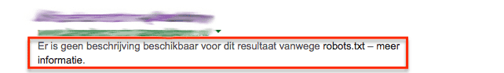
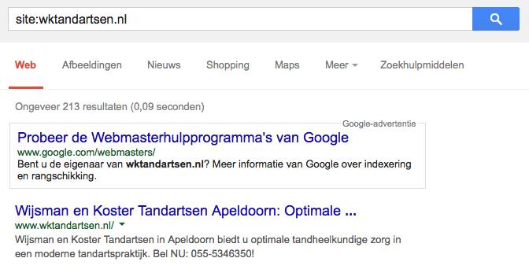
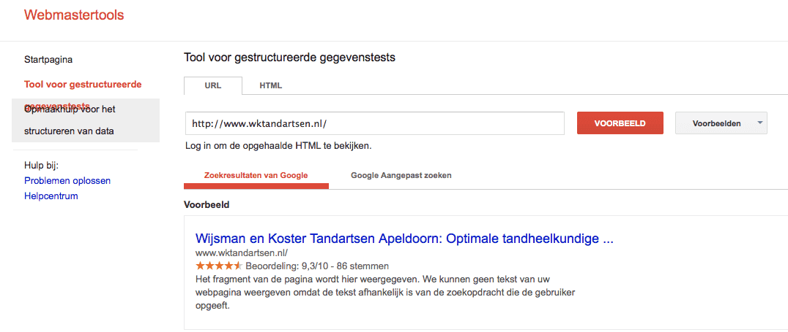

> **Historisch archief.** Deze aflevering verscheen op 2-10-2014 als onderdeel van ReputatieCoaching (2012–2016). De oorspronkelijke tekst is hieronder historisch bewaard. Diensten, contactgegevens, links, tools en adviezen kunnen inmiddels verouderd zijn.

**Transcriptiestatus:** Volledige transcriptie uit het oorspronkelijke archief.

***Historische afbeelding niet beschikbaar: ReputatieCoaching Podcast*
De podcast van vandaag begin ik met de reactie van de distributeur van Vision zonnebrand op mijn videorecensie, gevolgd door nieuws over de Online Reputatie Scan. Eerder deze week heb ik een analyse gemaakt van de online vindbaarheid en reputatie van een bandenbedrijf uit Apeldoorn, daarbij kwam binnen één minuut een groot probleem aan het licht. Orkut is eerder deze week gesloten en de Yahoo! Directory is ook ten einde. Ik heb nog wat tips voor het verbeteren van de kwaliteit van je geluidsopnames en ik sluit af met een uitspraak van John Mueller van Google, dat je review sterretjes niet mag implementeren op de homepagina van je site.**

Hallo en hartelijk welkom bij deze aflevering van de ReputatieCoaching Podcast. Ik ben Eduard de Boer, ReputatieCoach.

De podcast kun je vinden op [www.reputatiecoaching.nl/96](/nl/archief/reputatiecoaching/096/). Daar vind je niet alleen de tekst, maar ook video’s waar ik het in deze uitzending over heb, alsmede afbeeldingen, links enzovoorts. Bovendien is de podcast te beluisteren in [iTunes](https://web.archive.org/web/*/https://www.reputatiecoaching.nl/itunes) en op [Stitcher](https://web.archive.org/web/*/https://www.reputatiecoaching.nl/stitcher). Daar kun je je dus ook abonneren op de wekelijkse podcast. Veel mensen vinden het ideaal om de wekelijkse afleveringen van de podcast op hun gemak te beluisteren, terwijl ze autorijden, hardlopen of mountainbiken.

Voor ik de onderwerpen voor vandaag langsloop eerst even een “sorry” van mij. “Sorry” voor het feit dat ik afgelopen weekend helemaal ben vergeten om de tweede editie van de “Leuke Leerzame Links” op te stellen en te sturen naar alle abonnees van de nieuwsbrief. Ik had het nog niet op mijn agenda gezet en omdat het nog een nieuwe activiteit is, die niet echt in mijn systeem zit, is het er dus helemaal bij ingeschoten. Sorry! Komend weekend kun je dus wel weer een Leuke Leerzame Links editie in je mailbox verwachten.

Ben je nog geen abonnee op de Leuke Leerzame Links, maar wil je ze wel ontvangen? Registreer je dan met je naam en je mailadres op de website [www.reputatiecoaching.nl](https://web.archive.org/web/*/https://www.reputatiecoaching.nl/). Dan ontvang je vanaf dat moment automatisch altijd de Leuke Leerzame Links, die het niet hebben gemaakt in de podcast, of in een artikel op de website.

En nu ik het toch over de website heb… Voor het geval je je afvraagt hoe het komt, dat ik niet zoveel nieuwsartikelen etc. post op het moment: dat wordt binnenkort duidelijk. Ik ben al een tijdje druk met iets uitwerken en opzetten, dat binnenkort het levenslicht gaat zien. En dat slurpt veel van mijn tijd en aandacht op. Dus je hoort daar binnenkort meer over!

Laat ik dan nu overgaan op de onderwerpen voor vandaag…

## Reactie op videorecensie over Vision zonnebrand ervaringen

Tijdens onze vakantie in Spanje had ik een korte videorecensie gemaakt over onze ervaringen met Vision zonnebrandcrème. Die waren dit jaar heel anders dan voorgaande jaren:

Toen heb ik ook de link van de video per e-mail naar de distributeur Vemedia gestuurd. Op dat moment kreeg ik een autoreply, dat men als gevolg van de vakantie niet meteen kon antwoorden.

De eerlijkheid gebiedt mij te melden dat het bedrijf meteen de week dat de medewerkers weer aan het werk gingen, heel adequaat heeft gereageerd met een goede en duidelijke mail. Die ontving ik 15 augustus.

Die mail stond dus al een aardige in mijn mailbox te wachten om een nieuwe video van te maken. Dat heb ik eerder deze week dus gedaan. Deze video heb ik opgenomen in de show notes, op [www.reputatiecoaching.nl/96](/nl/archief/reputatiecoaching/096/):

De mail die Vemedia mij stuurde, bevatte de volgende reactie:

Uiteraard allereerst onze welgemeende excuses voor de late reactie!

Hartelijk dank dat u dan de moeite heeft genomen ons van uw bevindingen omtrent bovengenoemd product op de hoogte te stellen, op een ‘leuke’ manier via youtube. Als bedrijf vinden wij het belangrijk om te weten, hoe uw ervaringen als consument met onze producten zijn, zowel positief als negatief. Dit stelt ons in staat onze producten te blijven verbeteren.

Fijn dat u een trouwe gebruiker bent van onze Vision producten. Wij betreuren het zeer dat u allevier maar liefst!, verbrand bent ondanks het gebruik van Vision. Het prikken in de ogen is uiteraard ook niet prettig te noemen…..Wij hopen dat de pijn en narigheid hiervan inmiddels verdwenen is.
Onze welgemeende excuses voor het ongemak!
Het zou fijn zijn als wij uw product(en) retour kunnen ontvangen voor nader onderzoek. U kunt dit kosteloos doen naar:

Imgroma BV
T.a.v. Anita de Haan
Antwoordnummer 1208
1110 WB DIEMEN

Zodra wij resultaat van het onderzoek ontvangen laten wij u dat natuurlijk weten.

De nieuwe flacons van Vision zonnebrandcrème bevatten een zeer kleine hoeveelheid van de stof denatoniumbenzoaat (om de ethanol (=alcohol) in de formulering te denatureren (=ondrinkbaar te maken).

Dit stofje is bekend om haar bittere smaak, wat een mogelijke verklaring is voor de bittere smaak die u ervaart wanneer u per ongeluk via de mond in contact komt met Vision zonnebrandcrème.

Dit stofje wordt aan heel wat cosmetica toegevoegd om te voorkomen dat kleine kinderen per ongeluk het product gaan inslikken, de bittere smaak van het stofje denatonium benzoaat helpt dit te voorkomen.

De zonnefilters van de Vision zonnebrandcrème kunnen niet opgelost worden in water en daarom is de alcohol toegevoegd om de zonnefilters op te lossen.

Wij danken u echt zeer voor het melden van uw bevindingen. Echter kunnen wij u wel al het goede nieuws melden dat wij vanaf 2015 de samenstelling zullen aanpassen, zodat de bittere smaak verdwenen zal zijn.

Wij verwachten ergens begin 2015 nieuwe voorraad van de Vision met een nieuwe samenstelling zoals ‘vanouds’.

Indien u interesse heeft kunnen wij u enigszins tegemoet komen door uw adresgegevens te noteren en u begin 2015 een tube(s) van Vision met de nieuwe samenstelling toe te sturen. Laat dan even weten welke keuze uw voorkeur heeft?

Wij komen trouwe gebruikers graag tegemoet maar u moet dan nog even geduld hebben!

Hopende u hiermede van dienst te zijn geweest en uw reactie (en product(en)voor nader onderzoek met belangstelling tegemoetziend, verblijven wij,

Met vriendelijke groet, Kind regards, Mit freundlichen Grüssen, Salutations distinguées,

Anita de Haan
Coördinator Consumentenservice

Kijk, dat is nog eens een goede reactie! Het bedrijf biedt haar excuses aan en biedt aan de inhoud te onderzoeken. Helaas gaat dat niet, want we hebben de flacon in Spanje weggegooid, na onze slechte ervaringen. Maar met alle plezier zie ik in 2015 een proeffles met de nieuwe samenstelling van de zonnebrandcrème tegemoet. Die zal ik dan in de praktijk testen en wederom een video maken van mijn c.q. onze bevindingen.

Want wat ik je wil laten zien, is wat een dergelijke videorecensie teweeg kan brengen… Toen ik de video had gemaakt, heb ik voor het uploaden onderzocht wat de meest gebruikte zoekterm was in combinatie met de tekst: “Vision zonnebrand”. Dat bleek de toevoeging “ervaringen” te zijn. Dit kun je gemakkelijk zelf onderzoeken, ook voor andere zoektermen. Daarvoor ga je naar Google en je typt je zoekterm, gevolgd door een spatie. Op dat moment geeft Google je automatisch een paar suggesties, in volgorde van afnemende populariteit.

Als je nu op Google zoekt op de zoekterm: ***vision zonnebrand ervaringen***, dan zie je dat de video de tweede of derde plaats in de zoekresultaten scoort. Ik heb hiervan een screenshot opgenomen in de show notes, op [www.reputatiecoaching.nl/96](/nl/archief/reputatiecoaching/096/):

## Online Reputatie Scan

Steeds vaker komen ondernemers en bedrijven naar mij toe met de vraag, waarom hun website zo slecht vindbaar is in de zoekresultaten en waarom ze zo weinig bezoekers op hun website krijgen of sowieso weinig business doen.

Dan leg ik uit, dat de omvang van de online business wordt bepaald door drie belangrijke factoren:

```
  * _Vindbaarheid_ – Als je goed vindbaar bent, is de kans groter, dat je in elk geval bezoekers naar je site trekt.
  * _Reputatie_ – Als je bedrijf overal wordt vertoond met veel sterren en hoge beoordelingen, dan vergroot je de kans dat mensen zaken met jou of je bedrijf willen doen.
  * _Conversie_ – Hoe meer je op je site mensen stimuleert om iets te doen, zodat je met hen in contact kunt komen, of dat ze naar je winkel of praktijk komen, des te meer omzet creëer je.
```

Voor de meeste ondernemers begint de vindbaarheid lokaal: zij hebben een showroom, winkel, werkplaats of praktijk, waar zij klanten of patiënten uit de buurt ontvangen om producten of diensten aan te verkopen. Een lokale ondernemer hoeft helemaal niet voor heel Nederland te scoren op bijvoorbeeld de zoekterm “winterbanden”, “autoreparatie”, “herenkapper”, “nagelstudio”, “loodgieter” of “tuinman”. Want dat zijn allemaal producten, diensten of dienstverleners die mensen lokaal afnemen.

Dus is het voor die ondernemers essentieel om lokaal goed gevonden te worden én goed te boek te staan als een bedrijf waar ook anderen graag zaken mee doen. Dan heb je al een groot deel van de strijd gewonnen!

Op basis van de vragen en mijn bevindingen bij de analyse voor die ondernemers ben ik bezig met het opstellen van de “Online Reputatie Scan”. Dat is een korte analyse die ik loslaat op een bedrijf, nadat het mij heeft ingeschakeld. Daarin kijk ik naar heel veel cruciale aspecten, die gezamenlijk voor meer dan 80% verantwoordelijk zijn voor de algehele online vindbaarheid, de lokale vindbaarheid en de online reputatie.

Mijn planning is om de “Online Reputatie Scan” half november af te hebben. Omdat het product nog in ontwikkeling is en ik graag ervaring opdoe met meer verschillende bedrijfstakken, bied ik vijf lokale ondernemers of bedrijven een gratis Online Reputatie Scan aan. Meld je daarvoor aan via [podcast@reputatiecoaching.nl](mailto:podcast@reputatiecoaching.nl). Ik kies vijf bedrijven uit de aanmeldingen en die bedrijven krijgen van mij een gratis Online Reputatie Scan, op de voorwaarde dat ze mij feedback geven over het rapport met de bevindingen, dat ze van mij ontvangen.

Dus, stuur zo snel mogelijk een mailtje om kans te maken op een gratis Online Reputatie Scan!

## Slechte vindbaarheid van een autobandenbedrijf

Dat slechte vindbaarheid een negatief effect heeft op de business ondervond ook een autobandenbedrijf uit de regio van Apeldoorn. De eigenaar kwam bij mij, naar aanleiding van een gesprek dat ik meer dan een jaar geleden al eens met hem heb gehad over online vindbaarheid en de andere aspecten, waar ik het zojuist over had.

Hij vertelde dat hij weinig bezoekers op de site kreeg en merkte dat de business achteruit liep. Dat was voor mij natuurlijk voldoende reden om mijn tanden er goed in te zetten om de mogelijke oorzaak of oorzaken te achterhalen.

Binnen één minuut had ik de allerbelangrijkste oorzaak te pakken. En dat is er eentje, die feitelijk iedereen zó kan herkennen. De site stond dicht voor zoekmachines, om te indexeren. Het bestand “robots.txt” op de website bevatte de volgende twee regels:

Nu snap ik dat een doorsnee ondernemer niet eens weet wat de “robots.txt” file is, laat staan waar hij of zij die kan vinden of interpreteren! Maar goed, door eens je website in Google op te zoeken met de zoekterm “site:” gevolgd door je domeinnaam of de URL van je website, kun je dit meteen zien.

Want als het voornoemde het geval is, dus dat je website dicht staat voor zoekmachines, dan meldt Google het volgende onder de titel van je website:

[](https://lh5.googleusercontent.com/-ljG3QyRIWQc/VCzjS0kmpzI/AAAAAAAABL4/bi0orSfyFkQ/w642-h93-no/20140930-robotstxt.png)

Dit houdt dus in, dat in het geval van Google, deze zoekgigant geen enkele pagina van je website kan bekijken, indexeren en dus ook niet vertonen op basis van ingevoerde zoektermen. Het component “Vindbaarheid” van je website valt of staat natuurlijk met het toegankelijk maken van je site voor zoekmachines.

Verder ben ik eens gaan spitten naar sites waarop andere bandenbedrijven of garagebedrijven zoal hun reviews verzamelen, die ook door Google worden herkend als reviewsites. Naast de algemene zoals Google+, Facebook, Yelp, Foursquare, allebedrijvenin.nl, detelefoongids.nl die ik altijd aanbeveel, kende ik natuurlijk wel een aantal medische reviewsites. Deze heb ik leren kennen doordat ik een aantal tandartsen heb geholpen met het verbeteren van hun lokale en online vindbaarheid. Maar ik had nog nooit actief gezocht naar reviewsites voor de automotive branche.

Ik was op zoek naar gratis reviewsites, waardoor sites als Trustpilot en eKomi afvielen. Na enig zoeken vond ik er in elk geval twee. Dat waren twee gratis reviewsites, die ook door Google als zodanig werden herkend. De sites die ik had gevonden, waren:

```
  * [auto-dealer-gids.nl](http://www.auto-dealer-gids.nl)
  * [garage-spot.nl](http://www.garage-spot.nl)
```

Mogelijk kan ik er nog meer vinden, als ik langer en dieper ga graven. Maar twee is in elk geval beter dan niets. Dus deze twee heb ik ook naar de eigenaar van het bandenbedrijf gecommuniceerd.

Verder heb ik een analyse gedaan van alle citations of bedrijfsvermeldingen van dit bedrijf, alsmede van de direkte lokale concurrenten. Ik wilde wel eens zien wat de kansen waren om de lokale zoekresultaten te domineren. Het bedrijf scoorde op de belangrijkste zoekterm de “C”-positie in de lokale zoekresultaten.

Dit bleek te zijn op basis van 80 citations, die ik kon vinden. Het bedrijf op de “A”-positie had er 92 en voor het bandenbedrijf op de “B”-positie vond ik 147 verschillende websites met bedrijfsvermeldingen. Ik ben verder niet in detail in alle sites gedoken, maar het lijkt erop, alsof er ruimte is voor meer citations. Want je weet het: omhoog komen in de lokale zoekresultaten is veelal een kwestie van zoeken waar je concurrenten allemaal vermeld staan en dan jouw bedrijf daar ook aanmelden, indien mogelijk.

Wat bovendien opviel, was dat het bedrijf zijn Google+ Mijn Bedrijf pagina niet had geverifieerd, noch geclaimd. Maar geen enkele lokale concurrent had zijn domeinnaam op de Google+ Mijn Bedrijf pagina geverifieerd. Wel had het grootste deel de Google+ pagina geclaimd. Dus het lijkt erop, alsof niemand zijn of haar bedrijf in de gaten houdt met Google Webmaster Tools. Dus dat is ook een advies voor het onderzochte bandenbedrijf: registreer je site op Google WMT!

Verder had het bedrijf geen openingstijden vermeld, niet op de site, noch op Google+. Het bedrijf verzamelde geen reviews, en werd dus ook niet met de sterretjes vertoond in de lokale zoekresultaten. Op Facebook vond ik het bedrijf wel, maar daar was het aangemaakt als een persoonlijk Facebook profiel en niet als een Facebook bedrijfspagina. Dus moet het profiel worden verwijderd en moet een bedrijfspagina worden aangemaakt.

Dan de website: die was wel aardig, maar liet bezoekers onnodig klikken. Dat werkt ontmoedigend en schrikt potentiële kopers af. Ik vond het bovendien niet intuïtief, waar ik moest klikken. Hoewel de site in WordPress was gemaakt, was die niet responsive, dus uitermate onvriendelijk voor mobiele bezoekers. Tenslotte vond ik het slordig dat er nog zomeraanbiedingen op de site stonden. Dat is naar bezoekers een signaal dat de site niet actief wordt onderhouden: ook een afknapper!

Morgenavond zit ik bij het bedrijf om mijn bevindingen te presenteren. Ik hou je op de hoogte van de voortgang.

## Volgende week presentatie “Reputatiemanagement voor Tandartsen”

In juli dit jaar heb ik een presentatie over reputatie, vindbaarheid en contentmarketing gegeven aan de leden van de [Juniorkamer in Apeldoorn](/nl/archief/reputatiecoaching/083/). Daar zat een tandarts bij en hij heeft mij voor volgende week woensdagavond uitgenodigd om een presentatie over reputatiemanagement voor tandartsen te geven.

Zoals altijd zal ik van die presentatie ook weer de audio opnemen, zodat ik de content mogelijk in de toekomst met je kan delen via audio of video.

## TIP voor beter opnemen van spraak

Oh, nu ik het toch heb over audio opnemen… In het kader van de interesse in podcasts vroeg Frits mij vorige week hoe je gemakkelijk en tegen lage kosten een goede geluidsopname kunt maken.

Toeval bestaat niet en ik had juist een paar weken geleden een bruikbare en nuttige tip gelezen voor goed opnemen van audio zonder echo, reflecties of achtergrondgeluiden. De tip was: kruip met je microfoon, de opnameapparatuur, een LED zaklantaarn en je script onder een dekbed en maak daar je opname.

Zie je dat niet zitten, of is dat praktisch niet haalbaar voor je, dan kun je ook zware gordijnen achter je hangen om reflectie en echos te voorkomen. Om bij mij op kantoor goede opnames te kunnen maken heb ik inderdaad ook een scherm achter me hangen en heb ik bovendien een aantal technische maatregelen getroffen.

Tussen de microfoon en het mengpaneel heb ik een zogenaamde gate-limiter-compressor staan. De “gate” zorgt ervoor dat zachte geluiden niet worden opgepikt door de microfoon en dus alleen geluid wordt opgepikt, als ik daadwerkelijk begin te spreken, of in het algemeen: als het geluid boven een bepaalde ingestelde drempelwaarde komt. En als het geluid te hard dreigt te worden omdat ik bijvoorbeeld moet hoesten, dan zorgt de “limiter” ervoor dat het geluid boven een bepaalde drempel niet wordt doorgelaten. Tenslotte regelt de “compressor” dat de spraak voller klinkt.

De microfoon die ik gebruik, staat zó ingesteld dat die alleen geluid oppikt binnen een straal van circa 15–20 centimeter. Dus als onze honden buiten blaffen, dan komt dat niet in de opname. Maar als de mobiele telefoon op mijn bureau rinkelt tijdens de opname, dan hoor je dat weer wel.

En in antwoord op de vraag of ik de geluidseffecten “live” in de podcast mix, terwijl ik spreek, of achteraf: dat doe ik “live”. Want door de effecten “live” erin te mixen, klinkt het natuurlijker en bovendien kost het me minder tijd in de nabewerking. Het enige wat ik soms tijdens de nabewerking in de opname zet, is een interview.

Nou Frits, ik hoop dat ik je vraag hiermee voldoende heb beantwoord…

## Recht om te worden vergeten: veelal eigen content

In diverse eerdere podcasts is het Europese recht om vergeten te worden al eens aan bod geweest. Je zou verwachten dat vooral mensen wiens reputatie of imago schade lijdt als gevolg van bepaalde content, een verzoek zou indienen om deze content verwijderd te krijgen. Maar ik ga je verrassen!

Uit een onderzoek van het bedrijf Reputation VIP, de oprichters van de “forget.me” service die helpt bij het verwijderen van content uit de zoekresultaten, onder meer dan 15.000 ingediende URL’s blijkt het volgende:

```
  * 59% van de ingediende verzoeken wordt door Google afgewezen en het aantal afwijzingen neemt toe
  * 26% van die afwijzingen heeft als reden: “het is interessant voor potentiële klanten van jouw professionele diensten”
  * 14% heeft als reden: “het is nog steeds relevant en interessant voor het publiek”
  * 13% gaat om social media profielen
```

In de show notes op [www.reputatiecoaching.nl/96](/nl/archief/reputatiecoaching/096/) heb ik een infographic met nog meer statistieken van dit onderzoek weergegeven:

[[Historische afbeelding: bekijk bron](https://lh3.googleusercontent.com/yW3JEe4BFAszZch0Smc7Ne12cFVPXGuttrQosdE63Ds=w800)](https://lh3.googleusercontent.com/yW3JEe4BFAszZch0Smc7Ne12cFVPXGuttrQosdE63Ds=w800)

Dat zijn allemaal legitieme redenen voor afwijzing… Maar weet je wat de meest komische is? Maar liefst 22% van de afwijzingen heeft als reden: “Je bent zelf auteur van die content”! Dat is wel heel bizar: mensen willen hun eigen content, die ze dus zelf hebben gepubliceerd, uit de zoekresultaten verwijderd hebben! Je zou je toch afvragen waarom dat kan zijn…

De idee is dat het hier gaat om content van lage kwaliteit tot van generlei waarde. Als teveel van die content wordt geassocieerd met één en hetzelfde individu, kan dat weer een negatief effect hebben op de online reputatie van de auteur. Dat is de enige reden die ik zo snel kan bedenken.

## Orkut gesloten

In [podcast 83](/nl/archief/reputatiecoaching/083/) vertelde ik je dat Google de dienst Orkut per 30 september zou sluiten. Dat is ook gebeurd. Maar toen ik gisteren tijdens de voorbereiding van deze podcast nog even naar Orkut.com ging, las ik daar het volgende:

[[Historische afbeelding: Orkut is definitief gesloten](https://lh6.googleusercontent.com/RFO_KtSv-AN2BOCbf91UIcPDoO_YaqDPAuF7QqqRQhU=w692-h432-no)](https://lh6.googleusercontent.com/RFO_KtSv-AN2BOCbf91UIcPDoO_YaqDPAuF7QqqRQhU=w692-h432-no)

Dus voor het nageslacht etc. heeft Google besloten de content in de Orkut communities online te laten bestaan.

## Yahoo! Directory ten einde

In het begin van de jaren ’90 van het vorige millennium was het helemaal “hot”: online directories, zoals het bekende “Open Directory Project”, ook wel “DMOZ” genaamd en de Yahoo! Directory.

Toen later in de jaren ’90 Google om de hoek kwam kijken en het duidelijk werd dat het toch mogelijk was om de inhoud van het web te crawlen, indexeren en te ontsluiten op zoektermen, nam het belang van online directories af.

Met een online directory leek het of je in een ouderwetse kaartenbak in een stoffige bibliotheek op zoek ging naar een bepaald boek, op basis van zo’n 25 woorden of trefwoorden, terwijl je in Google elk woord op elke pagina van elk boek kon vinden.

Nu is het dan zover en Yahoo heeft op haar site bekend gemaakt, dat het per 31 december 2014 de Yahoo! Directory offline neemt. Yahoo schrijft hierover:

Zo zie je maar weer: online diensten komen en online diensten gaan. Je moet nooit al je kaarten inzetten op één bepaalde dienst. Wie weet wat er in 2034 gebeurt met Google search, of met Facebook?

## Review rich snippets niet voor je homepage

Veel mensen houden van de sterretjes bij websites en hoe meer sterren, des te beter! Het is en blijft een psychologische motivator voor internetters om sneller door te klikken naar een site, als blijkt dat meer klanten een goede beoordeling geven aan het bedrijf. Hier hebben we het over de zogenaamde “social proof”. En omdat mensen kuddedieren zijn, voelen de meesten zich prettig door de meute te volgen en de voorkeur te geven aan beproefde bedrijven met een goede reputatie, boven eens onbekende bedrijven te onderzoeken.

Maar soms zie je door de sterretjes de content ook niet meer goed. Dat vindt Google ook. Want volgens Google is de review rich snippets markup code eigenlijk bedoeld voor beoordelingen van producten of diensten. En rich snippets in het algemeen zijn om meer details te geven over een product, een gebeurtenis, een persoon, een locatie, een recept, een film enzovoorts.

Dus lijkt het overkill om rich snippets op je homepage te zetten. En dat vindt John Mueller van Google dus ook. Hij schreef op “Hacker News” hierover het volgende:

Ik vind het grappig dat dit naar voren komt, want een paar weken geleden heb ik de review sterretjes geïmplementeerd op de site van Wijsman en Koster Tandartsen. Toen verschenen ze nog wel bij de homepage. Inmiddels zijn ze daar inderdaad verdwenen:

[](https://lh3.googleusercontent.com/-2TOUVXMLId8/VCzi4STCMjI/AAAAAAAABLA/A6vzgkLNW4A/w672-h342-no/20141002-wk-tandartsen-serp.png)

Maar als je site controleert in de “[Tool voor gestructureerde gegevenstests](http://www.google.nl/webmasters/tools/richsnippets)”, dan zie je dat daarin nog wel de sterretjes worden getoond.

[](https://lh5.googleusercontent.com/-x_yUwlfQmwE/VCzi3Dn7ZFI/AAAAAAAABLI/-gIp5yZnoIU/w1076-h455-no/20141002-rich-snippets-wk.png)

Maar goed, als jij dus ooit reviewsterretjes bij je homepage had staan in de zoekresultaten, dan moet je niet raar opkijken, als ze inmiddels of anders binnenkort ook bij jouw vermelding zijn verdwenen. Ze worden natuurlijk nog wel gewoon vertoond bij subpagina’s op je site!

Als je de podcast leuk vindt en je wilt nog meer op de hoogte blijven, volg me dan ook op Twitter, via [@reputatiecoach1](https://twitter.com/reputatiecoach1).

Heb je inderdaad wat aan alle informatie die ik met je deel, help mij dan met het verder verbeteren en promoten van deze podcast. Surf daarvoor naar [iTunes](https://web.archive.org/web/*/https://www.reputatiecoaching.nl/itunes) of [Stitcher](https://web.archive.org/web/*/https://www.reputatiecoaching.nl/stitcher), geef de podcast een sterrenbeoordeling en laat ook je reactie achter. Door de podcast te beoordelen op iTunes en/of Stitcher breng je de podcast onder de aandacht van een breder publiek.

Je kunt me verder helpen, door de podcast aan te bevelen bij vrienden of collega’s, waarvan je denkt dat ze er hun voordeel mee kunnen doen, of door ’m te delen op Twitter, like’n en delen op Facebook of een “+1” te geven op Google+.

En vergeet niet: ik ben hier om je te helpen! Als je een vraag of een probleem hebt met betrekking tot je online reputatie of de vindbaarheid van je website, kun je een mailtje sturen naar [podcast@reputatiecoaching.nl](mailto:podcast@reputatiecoaching.nl).

Als je dat te lastig vindt, of als je de podcast beluistert terwijl je in de auto zit en je hebt acuut een vraag, spreek dan een boodschap in op de ReputatieCoaching Hotline, op nummer: 084 - 883 15 56. Mogelijk behandel ik je vraag of probleem dan in een artikel of in de podcast.

En je kunt ook rechtstreeks op de website een voicemail achterlaten, door op de tab aan de rechterkant van elke pagina te klikken, en je bericht in te spreken. Dit was [ReputatieCoaching Podcast aflevering 96](/nl/archief/reputatiecoaching/096/) en mijn naam is [Eduard de Boer](http://nl.linkedin.com/in/eduarddeboer/nl).

Ik wens je de komende week weer succes met het werken aan je reputatie, zodat je meteen je reputatie voor jou kunt laten werken!

Tot volgende week!

Doei!

Links naar content die in deze podcast aan bod komt:

```
  * [ReputatieCoaching Podcast in iTunes](https://web.archive.org/web/*/https://www.reputatiecoaching.nl/itunes)
  * [ReputatieCoaching Podcast op Stitcher](https://web.archive.org/web/*/https://www.reputatiecoaching.nl/stitcher)
  * [ReputatieCoaching Podcast RSS-feed](https://feeds.reputatiecoaching.nl/ReputatieCoachingPodcast)
  * “[Infographic: How Google treats “Right To Be Forgotten” requests?](http://www.reputationvip.com/blog/infographic-how-google-treat-right-to-be-forgotten-requests)” (Reputation VIP, 23 september 2014)
```
