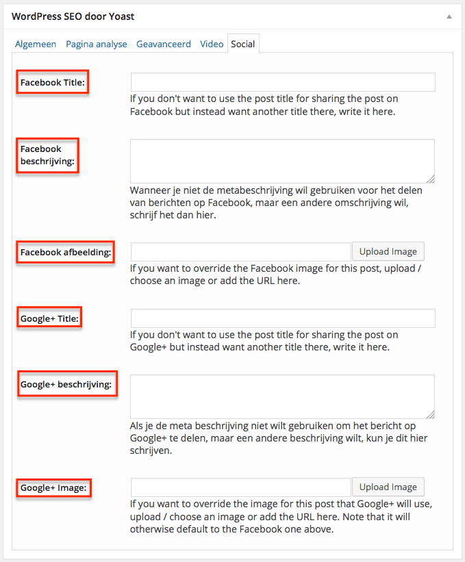

> **Historisch archief.** Deze aflevering verscheen op 16-10-2014 als onderdeel van ReputatieCoaching (2012–2016). De oorspronkelijke tekst is hieronder historisch bewaard. Diensten, contactgegevens, links, tools en adviezen kunnen inmiddels verouderd zijn.



**Transcriptiestatus:** Volledige transcriptie uit het oorspronkelijke archief.

***Historische afbeelding niet beschikbaar: ReputatieCoaching Podcast*
Vandaag heb ik slechts drie topics. Ik begin de podcast met de vraag van Chris, die niet kan doorgronden welke foto Facebook nu vertoont, als hij een link post naar een blogbericht op zijn WordPress site met meerdere afbeeldingen erin. Het tweede onderwerp is een korte aankondiging van een heel speciale gast in podcast aflevering 100. En als laatste heb ik een interview met Nathan Veenstra, iemand die ook hier in Apeldoorn woont en gespecialiseerd is in het schrijven van verleidelijke teksten.**

Hallo en hartelijk welkom bij deze aflevering van de ReputatieCoaching Podcast. Ik ben Eduard de Boer, ReputatieCoach. Dit is dé podcast die jou helpt om meer business te genereren, doordat jouw website beter gevonden wordt, zowel lokaal als landelijk en doordat ik je uitleg hoe je je online reputatie kunt verbeteren. Dit alles helpt je om je bedrijf en jezelf beter op de online kaart te plaatsen.

De podcast kun je vinden op [www.reputatiecoaching.nl/98](https://www.reputatiecoaching.nl/98/). Daar vind je niet alleen de tekst, maar ook video’s waar ik het in deze uitzending over heb, alsmede afbeeldingen, links enzovoorts. Bovendien is de podcast te beluisteren in [iTunes](https://www.reputatiecoaching.nl/itunes) en op [Stitcher](https://www.reputatiecoaching.nl/stitcher). Daar kun je je dus ook abonneren op de wekelijkse podcast. Veel mensen vinden het ideaal om de wekelijkse afleveringen van de podcast op hun gemak te beluisteren, terwijl ze autorijden, fietsen of trainen in de sportschool.

Laat ik dan nu overgaan op de onderwerpen voor vandaag…

## Gewenste foto bij link naar blogbericht in Facebook vertonen

Post jij wel eens een link in Facebook, naar een blogpost op je WordPress site? Snap jij dan hoe Facebook de foto of afbeelding kiest, als je meerdere afbeeldingen in je artikel hebt staan? Chris uit Bergen stuurde mij een mail, waarin hij mij om uitleg vroeg:

Ik heb een vraag: mijn vrouw heeft een nieuwe WP-website en nu gebeurt het volgende:

Als zij een artikel van haar website (Wordpress) plaatst op FB, wordt de verkeerde foto eraan gekoppeld. Dit gebeurt volkomen willekeurig en ook nog eens de ene keer wel en de andere niet. Heb jij een idee wat er verkeerd gaat?

Groet,

Chris

Leuk Chris, weer eens iets van je te horen. Om het maar meteen nóg onduidelijker te maken: het lijkt volledig willekeurig, hoe Facebook een foto kiest… En als jij niets doet, heb je er dus geen invloed op, welke gekozen wordt. En ik kan je vertellen dat het hetzelfde lijkt, als je een link post op Google+.

Nu is alleen even de vraag of jij de link in Facebook automatisch (of beter: “geautomatiseerd”) post, of handmatig. Want als je handmatig een link naar een artikel met meerdere foto’s op een WordPress site post in Facebook, kun je kiezen welke afbeelding wordt vertoond. Namelijk, voordat je definitief de update post, kun je linksboven op de foto met behulp van de driehoekjes de juiste foto kiezen.

Dus ik neem aan, dat je bedoelt hoe je ervoor kunt zorgen dat in een geautomatiseerde flow, de juiste afbeelding bij jouw link wordt vertoond.

*Historische afbeelding niet beschikbaar: Wordpress SEO*
Chris, ik kan het heel simpel voor je maken. Als je het nog niet hebt gedaan: installeer op de website van je vrouw de [WordPress SEO by Yoast](https://wordpress.org/plugins/wordpress-seo/) plugin, van Joost de Valk. Dan krijg je bij het schrijven en publiceren van een blogbericht opeens veel meer mogelijkheden. De meeste wil ik nu laten voor wat ze zijn, maar wat je moet aanpassen, zijn de settings onder het tabblad “Social”, die je vindt onder “WordPress SEO door Yoast”. Daar zie je wat ik ook in de screenshot op [www.reputatiecoaching.nl/98](https://www.reputatiecoaching.nl/98/) laat zien:

[](https://lh3.googleusercontent.com/-HkSlTObaGQc/VD4r5NQgIvI/AAAAAAAABOM/HxTVdF2HdOE/w679-h821-no/20141016-SEO-Social-WordPress.png)

Daar kun je voor zowel Facebook, als voor Google+ de volgende velden aanpassen:

```
  * Titel
  * Beschrijving
  * Afbeelding
```

En dat is volgens mij precies wat jij wilt! Ik zal je eerlijk zeggen dat ik die ook vrij recentelijk ontdekte, omdat ik nooit tot in detail in de WordPress SEO plugin ben gedoken. Ik gebruikte enkel de functionaliteit die ik nodig had op dat moment.

Maar goed, daarmee kun je dus bepalen wat er bij de link naar je blogpost wordt vertoond. Ik hoop dat dit je vraag helemaal beantwoordt. Zo niet Chris, laat het gerust weten en kom erop terug.

## Podcast 100 komt eraan!


Volgende week komt podcast 99 online en logischerwijs daarna dus nummer 100. Dat is voor mij in elk geval een belangrijke mijlpaal, want dan ben ik ook al bijna twee jaar bezig! En opeens worden de nummers van de uitzendingen drie cijfers lang! Maar voordat ik met de afleveringen van mijn podcast in de vier cijfers kom, moet ik zo’n 17 jaar en een paar maanden doorbuffelen, dus dat ligt wel erg ver in de toekomst.

Voor die 100e podcast heb ik een heel speciale gast! Ik verklap niet wie het is, maar ik weet zeker dat jij ook die persoon kent. De gast in podcast 100 heeft wereldwijd meer dan een half miljoen mensen getraind, een goed dozijn boeken gepubliceerd en meer dan 50.000 volgers op Twitter. Dus ik weet zeker dat we daar wel wat leuke en hopelijk verhelderende inzichten uit kunnen peuteren met betrekking tot reputatie.

## Interview met Nathan Veenstra


Vandaag heb ik ook een bijzondere gast, te weten: Nathan Veenstra. Ik heb Nathan Veenstra eerder dit jaar voor het eerst ontmoet tijdens een avond van de Social Media Club Apeldoorn, ook wel bekend onder #SMC055. Nathan schrijft teksten… Sterke teksten! Vanuit zijn bedrijf [Letterzaken](http://www.letterzaken.nl) schrijft hij verleidelijke teksten, die websitebezoekers moeten overhalen om in actie te komen en iets te doen… Bijvoorbeeld iets kopen of zich inschrijven voor een mailinglist et cetera. Vandaag voel ik Nathan aan de tand en hoop zoveel mogelijk waardevolle en verleidelijke informatie uit hem te krijgen…

In de transcriptie vind je alleen de vragen die ik Nathan Veenstra stel. Wil je zijn antwoorden horen, luister dan naar de [podcast 98](https://www.reputatiecoaching.nl/98/):

```
  1. Nathan, dankje voor het feit dat je in de show wilde komen voor een interview. Ik las ergens dat je tot zo’n twee jaar geleden account manager was en sindsdien het roer volledig hebt omgegooid en in de wereld van de contentmarketing, zoekmachine-optimalisatie en conversie-optimalisatie bent gestapt. Kun je -voor de mensen die je niet kennen- om te beginnen iets meer achtergrondinformatie geven over jezelf, je hobbies enzovoorts? Wie is Nathan Veenstra?
  2. Letterzaken… Eigenlijk elk bedrijf gebruikt letters om zichzelf en haar producten of diensten aan te prijzen, dus wat dat betreft moet er veel zaken in te doen zijn. Hoewel je huidige focus meer ligt op contentmarketing en conversie-optimalisatie ben je initieel begonnen met teksten schrijven, teksten die goed scoren in de zoekmachines. Hoe ben je ertoe gekomen om de overstap naar SEO tekstschrijver te maken? Was het het geld? Of was het de kick om jouw teksten boven die van concurrenten te zien verschijnen?
  3. SEO kenmerkte zich natuurlijk jarenlang door het optimaliseren van teksten ten aanzien van woorddichtheid, herhaling van woorden, gebruik van synoniemen en wat dies meer zij. Dat is sinds zo’n twee tot drie jaar niet meer echt relevant, want zoekmachines als Google, Bing en DuckDuckGo zijn een stuk intelligenter geworden in het beoordelen van de kwaliteit van teksten.
  4. Je zegt dat je je ook nog richt op zoekmachine-optimalisatie, terwijl luisteraars overal kunnen lezen dat SEO “dood” is. Wat valt er nu dan nog te optimaliseren?
  5. De aandachtsspanne van de meeste internetters is vergelijkbaar met die van een regenworm. Je moet binnen enkele seconden de aandacht pakken van een “toevallig” passerende surfer, om ervoor te zorgen dat die je content verder gaat bekijken. Wat voor trucjes of tips heb jij voor luisteraars om snel de aandacht te trekken van iemand die op je website terechtkomt?
  6. Laten we dan eens kijken naar conversie-optimalisatie… Kun je uitleggen wat dat precies is?
  7. Wat voor technieken of tactieken pas jij toe om meer conversies te realiseren voor je opdrachtgevers? Heb je trouwens ook wat cijfers aan de hand waarvan je kunt illustreren wat het effect kan zijn van betere teksten op de conversie?
  8. Nou Nathan, leuk om zo eens nader kennis te hebben gemaakt en ik weet zeker dat je de luisteraars van veel waardevolle content hebt voorzien! Dan stel ik je nu graag in de gelegenheid om jezelf, je bedrijf en je diensten te pitchen op het virtuele podium. Dus: barst maar los en converteer alle luisteraars met een duidelijke Call to Action en vertel ze waarom ze jouw diensten moeten inhuren!
```

Nathan, nogmaals bedankt en tot de volgende keer!

En met het interview met Nathan Veenstra van Letterzaken kom ik dan weer aan het einde van de podcast van deze week.

Als je de podcast leuk vindt en je wilt nog meer op de hoogte blijven, volg me dan ook op Twitter, via [@reputatiecoach1](https://twitter.com/reputatiecoach1) en schrijf je op de site in voor de [ReputatieCoaching Nieuwsbrief](https://www.reputatiecoaching.nl/nieuwsbrief/).

Heb je inderdaad wat aan alle informatie die ik met je deel, help mij dan met het verder verbeteren en promoten van deze podcast. Surf daarvoor naar [iTunes](https://www.reputatiecoaching.nl/itunes) of [Stitcher](https://www.reputatiecoaching.nl/stitcher), geef de podcast een sterrenbeoordeling en laat ook je reactie achter. Door de podcast te beoordelen op iTunes en/of Stitcher breng je de podcast onder de aandacht van een breder publiek.

Je kunt me verder helpen, door de podcast aan te bevelen bij vrienden of collega’s, waarvan je denkt dat ze er hun voordeel mee kunnen doen, of door ’m te delen op Twitter, like’n en delen op Facebook of een “+1” te geven op Google+.

En vergeet niet: ik ben hier om je te helpen! Als je een vraag of een probleem hebt met betrekking tot je online reputatie of de vindbaarheid van je website, kun je een mailtje sturen naar [podcast@reputatiecoaching.nl](mailto:podcast@reputatiecoaching.nl).

Als je dat te lastig vindt, of als je de podcast beluistert terwijl je in de auto zit en je hebt acuut een vraag, spreek dan een boodschap in op de ReputatieCoaching Hotline, op nummer: 084 - 883 15 56. Mogelijk behandel ik je vraag of probleem dan in een artikel of in de podcast.

En je kunt ook rechtstreeks op de website een voicemail achterlaten, door op de tab aan de rechterkant van elke pagina te klikken, en je bericht in te spreken. Dit was [ReputatieCoaching Podcast aflevering 98](https://www.reputatiecoaching.nl/98/) en mijn naam is [Eduard de Boer](http://nl.linkedin.com/in/eduarddeboer/nl).

Ik wens je de komende week weer succes met het werken aan je reputatie, zodat je meteen je reputatie voor jou kunt laten werken!

Tot volgende week!

Doei!

Links naar content die in deze podcast aan bod komt:

```
    * [ReputatieCoaching Podcast in iTunes](https://www.reputatiecoaching.nl/itunes)
    * [ReputatieCoaching Podcast op Stitcher](https://www.reputatiecoaching.nl/stitcher)
    * [ReputatieCoaching Podcast RSS-feed](https://feeds.reputatiecoaching.nl/ReputatieCoachingPodcast)
    * [WordPress SEO by Yoast](https://wordpress.org/plugins/wordpress-seo/) : Absoluut noodzakelijke plugin voor elke WordPress installatie
```

[Letterzaken](http://www.letterzaken.nl)
:   Meer omzet met betere webteksten (Nathan Veenstra)
