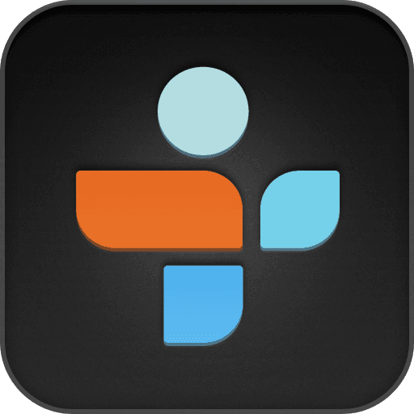
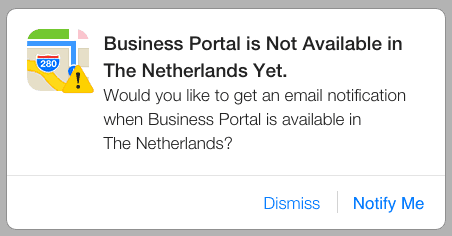
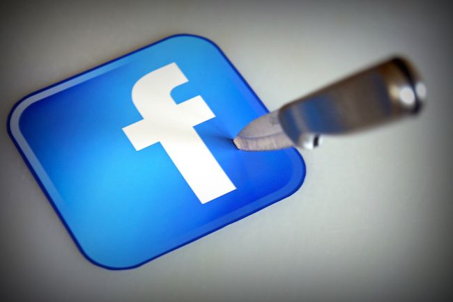
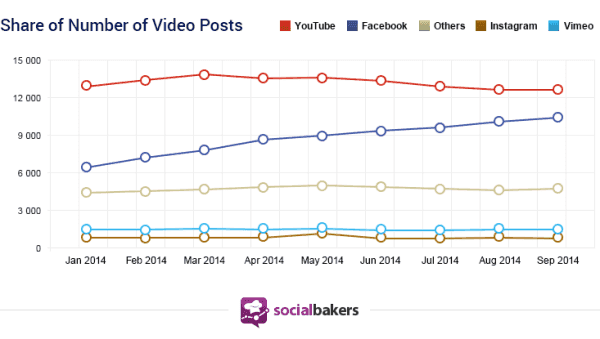

> **Historisch archief.** Deze aflevering verscheen op 23-10-2014 als onderdeel van ReputatieCoaching (2012–2016). De oorspronkelijke tekst is hieronder historisch bewaard. Diensten, contactgegevens, links, tools en adviezen kunnen inmiddels verouderd zijn.



**Transcriptiestatus:** Volledige transcriptie uit het oorspronkelijke archief.

***Historische afbeelding niet beschikbaar: ReputatieCoaching Podcast*
Ja, je hoort het goed: aflevering 99 alweer! Volgende week donderdagmorgen om 08:30 uur komt de 100e podcast uit en dan heb ik een heel bijzondere gast! Iedereen kent die persoon, die ik dan in de show heb! Ik zei het vorige week al: het is iemand die wereldwijd meer dan een half miljoen mensen heeft getraind en gecoached, een dozijn boeken in diverse talen heeft gepubliceerd en meer dan 50.000 volgers heeft op Twitter. Wie het is? Dat hoor je volgende week! Maar het is nog niet zover! Dus laat ik zoals gewoonlijk beginnen met je te vertellen over de topics in deze podcast…**

**De 14-Daagse Video Challenge is ten einde, ik heb helaas maar 10 dagen mee kunnen doen. Wist je dat je potentieel flink wat business laat liggen, doordat je geen 5 minuten tijd wilt doorbrengen op Google+? Verder heb ik een paar video’s voor je over het opnemen van audio en het verwijderen van ruis uit een audio opname. En sinds afgelopen weekend is Penguin 3.0 losgelaten!! Wat dat betekent, vertel ik je later in de show. Apple lanceert Apple Maps Connect en Twitter komt met Audio Cards. Tenslotte adviseert Google om zowel sitemaps te gebruiken, als ook RSS of Atom feeds en niet slechts één van beiden!**

Hallo en hartelijk welkom bij deze aflevering van de ReputatieCoaching Podcast. Ik ben Eduard de Boer, ReputatieCoach. Dit is dé podcast die jou helpt om meer business te genereren, doordat jouw website beter gevonden wordt, zowel lokaal als landelijk en doordat ik je uitleg hoe je je online reputatie kunt verbeteren. Dit alles helpt je om je bedrijf en jezelf beter op de online kaart te plaatsen.

De podcast kun je vinden op [www.reputatiecoaching.nl/99](https://web.archive.org/web/20141122023719/http://www.reputatiecoaching.nl:80/99/). Daar vind je niet alleen de tekst, maar ook video’s waar ik het in deze uitzending over heb, alsmede afbeeldingen, links enzovoorts. Bovendien is de podcast te beluisteren in iTunes, op Stitcher en sinds deze week ook op [TuneIn Radio](http://tunein.com/radio/ReputatieCoaching-Podcast-p655084/). Daar kun je je ook abonneren op de wekelijkse podcast. Veel mensen vinden het ideaal om de wekelijkse afleveringen van de podcast op hun gemak te beluisteren, terwijl ze autorijden, fietsen of trainen in de sportschool.

## 14-Daagse Video Challenge ten einde

Zoals ik je vertelde in de vorige podcast, participeerde ik in de 14-Daagse Video Challenge die werd georganiseerd door [Brenda Kok, die ik in podcast 94 in de show had](https://web.archive.org/web/20150312094833/http://www.reputatiecoaching.nl/94/). Het was natuurlijk geen onderlinge wedstrijd, maar een challenge voor jezelf. Doel was je eigen grenzen verleggen door uit je comfort zone te komen, waardoor je je gemakkelijker voor de camera zou gaan voelen.

Ondanks dat ik slechts 10 dagen kon deelnemen (daar kom ik zo op terug), heb ik er veel aan gehad. Naast alle goede tips over achtergrond, kleding, foute instellingen op mijn mengpaneel etc. ben ik nu ook over de schroom heen, om voor de camera te staan. Ik noem het resultaat van de inspanningen ruim geslaagd!

Reden dat ik niet alle 14 dagen kon deelnemen, kwam doordat ik vorige week donderdagmorgen vroeg vertrok met de stichting “Against Cancer” richting Duitsland om gedurende een 4-daagse trip van gezinnen met kinderen met kanker, geheel belangeloos foto’s te maken. Dat slokte echt al mijn tijd en energie op en kwam ik niet toe aan het produceren van nog meer video’s.

Tussen de 10 gemaakte video’s zitten er een paar die volgens mij best aardig zijn gelukt en waar ook jij iets van kunt opsteken. In de transcriptie van deze podcast heb ik 5 van de 10 video’s opgenomen. Die kom je later vanzelf tegen.

## ReputatieCoaching Podcast nu ook op TuneIn Radio


Sinds deze week is de ReputatieCoaching Podcast ook beschikbaar op TuneIn Radio, als zakelijke podcast. Het kostte me nogal wat moeite om er vermeld te worden. Dat kwam doordat de RSS-feed die ik hen stuurde, en die bij alle diensten werkt, niet valide bleek voor TuneIn Radio. Maar inmiddels is het probleem opgelost en kun je dus ook in de TuneIn Radio App luisteren naar de ReputatieCoaching Podcast.

Laat ik dan nu overgaan op de onderwerpen voor vandaag…

## Het belang van de juiste categorie in Google+ Mijn Bedrijf

*Historische afbeelding niet beschikbaar: Google*
Ik vertel bedrijfseigenaren dikwijls dat ze potentieel business verliezen, doordat ze niet de juiste categorie op hun Google+ Mijn Bedrijf pagina hebben ingesteld. Begin oktober heb ik de categorieën van restaurant “de Wilde Pieters” in Apeldoorn aangepast. Aanleiding hiervoor was dat het restaurant niet werd vertoond in de lokale zoekresultaten, als je zocht op “trouwlocatie Apeldoorn”, noch op de zoekterm “restaurant Apeldoorn”.

Ik ben gaan onderzoeken waardoor dit kwam. Het bleek dat de primaire categorie voor het restaurant stond ingesteld op “vestiging / interessante plaats”. En laat nu net de primaire categorie het belangrijkst zijn voor Google, om een bedrijf wel of niet te vertonen in de lokale resultaten. Daarom heb ik de categorieën als volgt aangepast:

```
  * Primaire categorie: restaurant
  * Eerste aanvullende categorie: trouwlocatie
  * Tweede aanvullende categorie: mediterraan restaurant
```

Deze laatste is een nadere specificatie van het type restaurant, of beter gezegd: de aldaar geserveerde gerechten. Drie dagen later stond het restaurant op de eerste plaats, oftewel de “A”-positie op de zoekterm “trouwlocatie Apeldoorn” en op de “C”-positie op zoekterm “restaurant Apeldoorn”.

Ik heb hiervan een Nieuwsflits video gemaakt, die ik in de show notes heb opgenomen:

Ik hoop dat jij als ondernemer hier lering uit trekt en eens inlogt op je Google+ Mijn Bedrijf pagina om te zien wat er precies bij jouw bedrijfsvermelding als primaire en aanvullende categorieën staat. Loop ze na, pas ze aan en heb verder geduld!

## Geluid opnemen

[Historische afbeelding: Geluid opnemen](https://lh5.googleusercontent.com/5uL-OrNbziRUyo5xF_wD0cF4OTyFUeB_5GPsIKE6ul0=s200-p-no)
Als jij bezig bent met contentmarketing, waarbij je af en toe ook wel eens een video produceert, zul jij er ook wel eens mee te maken krijgen: het goed opnemen van geluid, zoals bijvoorbeeld een voiceover voor een PowerPoint presentatie…

Dat lijkt lastig, maar dat is het niet, hoor! Er is een aantal mogelijkheden om geluid op te nemen. Ik laat gemakshalve video maar even buiten beschouwing. De kwaliteit van de geluidsopname valt of staat met een goede microfoon, die liefst dicht bij je mond is, en afhankelijk van de toepassing niet teveel omgevingsgeluiden oppikt. En idealiter neem je het geluid op in CD-kwaliteit op een apparaat dat je toch al bij je hebt, zoals je smartphone.

Daarvoor zijn er verschillende mogelijkheden. In het kader van de 14-Daagse Video Challenge, waar ik het vorige week al over had, heb ik hier een paar video’s over gemaakt.

In de eerste video laat ik het verschil horen tussen opnames met de ingebouwde microfoon van de iPhone, en een zelfgemaakte reversmicrofoon. Deze video heb ik in de show notes opgenomen:

Soms is het moeilijk om een goede audio-opname te maken, omdat de ruimte waarin je je verhaal wilt opnemen, hol klinkt. Als het je puur gaat om een galmvrije en echoloze geluidsopname zonder achtergrondgeluiden en je weet zo niet 1–2–3 een goede locatie, kijk dan eens naar de video die ik in de show notes heb opgenomen:

## Audio nabewerken: ruis verwijderen

Het is mij opgevallen dat bij sommige microfoons er een zachte ruis is, als er niet wordt gesproken. Om die eruit te halen gebruik ik, evenals voor het nabewerken van de ReputatieCoaching Podcast, het gratis programma “[Audacity](http://audacity.sourceforge.net/?lang=nl)”. Dit programma is er zowel voor de Mac, als voor computers die werken met Windows of Linux. Oh, en had ik al gezegd dat het gratis is? Het is GRATIS! Dat is altijd een goede binnenkomer bij Nederlanders, toch?

Omdat ik elke keer iets nieuws wilde delen met de andere cursisten in de 14-Daagse Video Challenge, heb ik voor dag 8 een korte screencast gemaakt, waarbij ik laat zien hoe je ruis uit een audio-opname kunt halen.

## Penguin 3.0 is uit!

Webmasters van voornamelijk Engelstalige websites zaten er al meer dan een jaar op te wachten: op een update van Penguin. De vorige update zorgde er namelijk voor dat veel websites uit de zoekresultaten verdwenen, als gevolg van teveel foute links naar de site. Om dat op te lossen moesten webmasters handmatig alle links ongedaan of verwijderd zien te krijgen en hierover rapporteren aan Google met behulp van de inmiddels notoire “Disavow links tool”.

Veel van de getroffen webmasters zijn tot het uiterste gegaan om hun linkprofiel op te schonen. En vanaf dat moment hoopten ze dat Google snel de update zou doorvoeren… En ze bleven hopen… en hopen… Maar er gebeurde maar niets…

Dit heeft dus ruim een jaar geduurd, tot afgelopen weekend. Het begon met geruchten en buikgevoelens van webmasters, omdat ze nogal grote schommelingen leken waar te nemen in de organische zoekresultaten. Overal popten blogposts op, of het dan eindelijk zover zou zijn. Het leek een eeuwigheid te duren, tot Google reageerde op alle vragen of de Penguin 3.0 update nu werkelijk werd doorgevoerd.

En het bleek zo te zijn. Volgens Google wordt minder dan 1% van de Engelstalige zoekopdrachten door deze update getroffen, maar dat valt in de praktijk nog te bezien. Het is op dit moment nog niet helemaal duidelijk wat precies de effecten zijn van Penguin 3.0. Wat ik heb begrepen is dat het dus vooralsnog geen effect heeft op Nederlandstalige sites. We wachten geduldig af, tot er meer nieuws over Penguin 3.0 verschijnt.

## Apple lanceert Apple Maps Connect

Apple wil nu vaart gaan maken met Apple Maps. Laatst berichtte ik je nog dat het bijna een jaar kostte om een vermelding op Apple Kaarten te krijgen. En dat kon je dan realiseren, door je bedrijf aan te melden op Yelp, alsmede op TomTom Places.

Daar lijkt nu een einde aan te zijn gekomen. Althans, in de Verenigde Staten. Want eerder deze week heeft Apple de dienst Apple Maps Connect gelanceerd, waarin Apple gebruikers bedrijfsvermeldingen kunnen invoeren en aanpassen.

Ik moest natuurlijk hoedanook even kijken hoe het er uitzag. Het inloggen met mijn Apple ID ging goed. Ook het zoeken van de bedrijfsvermelding van Allround Fotografie ging goed. Maar het was niet mogelijk om de vermelding aan te passen. Toen kreeg ik de melding dat de dienst nog niet in Nederland beschikbaar is. Hiervan heb ik een screenshot opgenomen in de show notes:

[](https://lh6.googleusercontent.com/-IS2yAol0YTc/VEfsZlULouI/AAAAAAAABOw/HBMpvgOC6ow/w452-h236-no/20141023-Apple-Business-Portal-NL.png)

Natuurlijk heb ik Apple verzocht mij te berichten, zodra de dienst wèl in Nederland beschikbaar is. Zodra ik daar een update over heb, hoor je het van me!

## Twitter komt met Audio Cards

Twitter is een samenwerking aangegaan met SoundCloud: een online dienst, waar beginnende muzikanten en ook podcasters geluidsbestanden kunnen uploaden en delen. En naast Summary Cards, Photo Cards, Gallery Cards en App Cards, [introduceert Twitter nu ook de Audio Card](https://blog.twitter.com/2014/introducing-a-new-audio-experience-on-twitter). Eigenlijk is het een aangepaste “Player Card”, waarin je nu dus ook audiobestanden die op SoundClound staan, in Twitter kunt (laten) afspelen.

Naast dat het natuurlijk kansen biedt voor muzikanten, kunnen ook podcasters hier gebruik van maken. Zo zou je een Twitter Card van je meest recente podcast kunnen maken en die als gesponsorde tweet promoten om je podcast onder de aandacht te brengen van een groot publiek.

Alleen doe ik eigenlijk nog niets met SoundCloud. Reden is dat ik met mijn hoeveelheid audio binnen no-time door de grens voor gratis gebruik heen zou zijn. En dan levert het weer een extra kostenpost op van zo’n € 10. Nu is dat op zich niet veel, maar enkele tientallen van dit soort diensten, kost dan opeens wel weer een aardige duit. Bovendien betwijfel ik het, of het publiek voor de ReputatieCoaching Podcast gebruik maakt van SoundCloud en de podcast aldaar gaat zoeken.

Maak jij eigenlijk gebruik van SoundCloud? En wat vind je, moet de ReputatieCoaching Podcast ook op SoundCloud beschikbaar komen? Wat is je reden daarvoor?

## Copyblogger stopt met Facebook pagina

Als je veel met content bezig bent, dan ken je de site Copyblogger vast en zeker. Copyblogger heeft heel veel lezers op haar website en ook maar liefst 38.000 fans op Facebook. Toch heeft Copyblogger besloten om te [stoppen met haar Facebookpagina](http://www.copyblogger.com/bye-facebook/)!

De korte versie van de uitleg is dat de Facebook pagina niet echt veel toevoegt voor het merk, noch voor haar publiek. Kijk, dat vind ik stoer, als je dat durft te beweren over je eigen Facebookpagina en vervolgens ook actie onderneemt!

[](https://lh6.googleusercontent.com/-xpg1Szl2HAM/VEfsZqLhrxI/AAAAAAAABO0/NbdLy_XlC6k/w650-h434-no/20141023-killing-facebook.jpg)

Copyblogger ziet dat haar aanwezigheid op Facebook geen resultaat oplevert en alleen maar tijd kost. Ondanks dat een groot deel van de marketingwereld blijft verkondigen dat je hoedanook op Facebook moet staan met je bedrijf, [verwijdert Copyblogger haar Facebookpagina](http://www.copyblogger.com/bye-facebook/). Simpelweg, omdat het rendement te laag is, terwijl het aan de andere kant de omvang van de interactie op Google+ en Twitter roemt.

Dit heeft mij ook tot nadenken gezet over een aantal Facebookpagina’s die ik zelf in het leven heb geroepen. Als ik kritisch kijk naar een paar pagina’s, dan trekken die echt geen virtuele “volle zalen” of hordes fans. En er gebeurt niets op die pagina’s: geen interactie met de wereld, geen reacties van de wereld op berichten die ik post of wat dan ook. Af en toe komt er hier en daar een verdwaalde fan bij. Toch moet ik echt af en toe de pagina’s even bekijken om te zien of er iets gebeurt, zodat ik dan kan reageren.

Ook merk ik dat ik zelf persoonlijk steeds minder op Facebook te vinden ben. De Facebook app heb ik allang niet meer op mijn iPhone staan. Als ik op mijn iPhone even snel op Facebook wil kijken, dan doe ik dat via Safari. Dat werkt bijkant sneller en kost geen halve Gigabyte aan opslag van de beperkte 16 GB die ik aan ruimte heb. Voor mij is het vernieuwende er vanaf en wetende dat slechts zo’n 10% of minder van mijn fans of volgers de updates ziet die ik post, post ik zelf ook steeds minder.

Sommige posts gaan geautomatiseerd, zoals Instagram foto’s: die deel ik nog wel op Facebook, evenals wat foto’s van afgelopen weekend, tijdens de “Against Cancer” trip in Duitsland. Maar verder ben ik er niet meer bijzonder actief op.

Ik ben wel eens benieuwd of jij nog erg actief bent op Facebook. Wat doe jij zoal op dit grootste sociale netwerk ter wereld, wat jou echt gelukkig maakt? Net als ik, je tijd verdoen? Haal jij veel business uit Facebook, of ben je alleen maar bezig om meer fans en likes te verzamelen, zonder een gedegen visie?

Geef eens je reactie onderaan de show notes van deze podcast, op [www.reputatiecoaching.nl/99](https://web.archive.org/web/20141122023719/http://www.reputatiecoaching.nl:80/99/). Ik kijk ernaar uit!

## Is Facebook het nieuwe YouTube?

Waar de ene partij Facebook verlaat, roemt de andere partij het sociale netwerk om de mogelijkheden voor videomarketing voor bekende merken. Het bedrijf ComScore maakte vorige week bekend dat Facebook in augustus ruim een miljard meer views had op desktopcomputers, dan YouTube. Dat is toch wel een groot verschil!

Dit verschil wordt voornamelijk toegeschreven aan de zogenaamde autoplay-functie van Facebook. Die zorgt ervoor dat video’s automatisch beginnen af te spelen, zij het dan zonder geluid. Maar dat telt wel als een view. De vraag is of dat een eerlijke meting is. Daarover verschillen de meningen.

Facebook claimde in september meer dan een miljard videoviews per dag te hebben. Het lijkt erop, alsof video’s op Facebook ook beduidend sneller worden gedeeld, dan via YouTube. Ter illustratie: een video van Beyoncé bereikte binnen een paar uur 2,4 miljoen views op Facebook, tegenover een paar duizend op YouTube.

In de show notes heb ik een grafiek opgenomen van SocialBakers, dat onderzoek heeft gedaan onder 180.000 Facebook video posts van 20.000 Facebookpagina’s. In deze grafiek is te zien dat de videoviews op Facebook sinds begin 2014 stijgen en richting die van YouTube gaan. Als je de lijnen doortrekt, dan haalt Facebook YouTube eind van het jaar zelfs in!

[](https://lh4.googleusercontent.com/-UayZja2_xik/VEfsZpQO4SI/AAAAAAAABPE/pEvMS4ZQnHA/w600-h339-no/20141023-video-statistieken.png)Wat doe jij met video’s op Facebook? En dan bedoel ik natuurlijk je eigen video’s, niet video’s die anderen hebben gemaakt. Deel jij URL’s van de video’s die je hebt geüpload naar YouTube *op* Facebook? Of upload jij de video’s direct *naar* Facebook?

Zelf behoor ik tot de eerste categorie: tot op heden heb ik alleen ReputatieCoaching video’s geüpload naar YouTube (en nog een paar video sharing sites), waarna ik de video vanaf YouTube deelde op Facebook. Ik ga de komende tijd bij wijze van experiment ook eens wat video’s uploaden naar Facebook om te zien hoeveel views de video’s daar genereren.

## Linkspam in de reacties op je weblog

Gisteren had ik er weer eentje… Een reactie op een artikel, met als enige doel proberen een backlink te krijgen naar je eigen site. Dit keer kwam die van een Nederlandstalige site, waar je snel online ondergoed kunt kopen. En deze reactie was door Akismet gekomen, zonder dat die als spam werd gemarkeerd.

De URL was niet alleen ingevuld in het URL veld, maar ook nog eens in de body van de reactie, tezamen met wat prijzen van ondergoed als “wervende tekst”.

Dat is nu precies de reden dat ik standaard het niet toesta dat reacties meteen live op de site komen. Af en toe komen er namelijk toch nog berichtjes van dit soort door het spamfilter.

Nu maakt me dat niet veel uit, want ik richt me namelijk liever op de positieve kant van het functioneren van Akismet. Sinds dat ik die plugin heb geactiveerd op [www.reputatiecoaching.nl](https://web.archive.org/web/20141109194104/http://www.reputatiecoaching.nl:80/), heeft die namelijk al wel meer dan 65.000 spamberichten geheel geautomatiseerd onderschept! Stel je voor dat ik die allemaal met de hand had moeten controleren en afwijzen! Ik moet er niet aan denken!

Heb jij last van spam in de reacties van je site? Wat doe jij ertegen? Heb je een captcha geïnstalleerd als extra barrière? Of gebruik je een ander mechanisme of een andere service voor reacties, zoals bijvoorbeeld Disqus (met een ‘q’)?

Laat het me weten als reactie, onderaan de show notes op [www.reputatiecoaching.nl/99](https://web.archive.org/web/20141122023719/http://www.reputatiecoaching.nl:80/99/). En als het een valide reactie is, dan komt die heus live, hoor!

## Google: Gebruik zowel RSS/Atom feed(s), als sitemap(s)!

Vorige week publiceerde Google een verzameling “[Best practices for XML sitemaps & RSS/Atom feeds](https://web.archive.org/web/20141023041704/http://googlewebmastercentral.blogspot.ca/2014/10/best-practices-for-xml-sitemaps-rssatom.html)” op haar Webmaster Central Blog. Daarin wordt beschreven dat je als websiteeigenaar c.q. webmaster niet alleen moet vertrouwen op XML sitemaps, of op RSS of Atom feeds. In die post kun je nalezen dat je beide moet gebruiken en onderhouden.

Reden is dat RSS of Atom feeds Google in de gelegenheid stellen de meest actuele posts snel te vinden, zodat die kunnen worden geïndexeerd, terwijl sitemaps juist zijn bedoeld om Google op diepliggende content attent te maken. Daarbij voegt Google toe dat het aanbieden van sitemaps of feeds nog steeds geen garantie geeft dat de content daadwerkelijk door Google wordt geïndexeerd.

Ik geef je de punten uit het artikel, die volgens mij het meest relevant zijn als takeaway:

```
  * De twee belangrijkste brokken informatie voor Google, zijn de URL en de last modification time, ofwel de datum/tijd van de laatste keer dat de content op de URL is gewijzigd.
  * Voeg alleen URL’s toe, die daadwerkelijk door Google kunnen worden opgehaald (dus geen URL’s die worden geblokkeerd door robots.txt).
  * Voeg alleen zogenaamde canonical URL’s toe en geen URL’s van andere pagina’s met dezelfde content.
  * Specificeer de last modification time voor elke URL in een XML sitemap, alsmede in de RSS/Atom feed.
  * Heb je een enkele XML sitemap? Actualiseer die dan tenminste eenmaal per dag en ping Google elke keer dat je ’m aanpast.
  * Heb je een aantal XML sitemaps, maximaliseer dan het aantal URL’s in elke sitemap. De limiet is 50.000 URL’s, of een maximale bestandsgrootte van 10 MB (ongecomprimeerd). Ping Google wanneer elke XML sitemap is aangepast.
  * Wanneer een nieuwe pagina of blogpost wordt toegevoegd, of een bestaande pagina substantieel aangepast, voeg de URL en de last modification time dan toe aan de RSS of Atom feed.
  * Om te voorkomen dat Google updates mist, moet de RSS of Atom feed alle updates bevatten, sinds de laatste keer dat Google die downloadde.
```

Als je WordPress gebruikt, dan is de kans groot dat je de WordPress SEO plugin van Joost de Valk gebruikt. Dat is zo ongeveer de enige plugin dit ik altijd aan iedereen adviseer, tezamen met –ik noemde hem zojuist al– het activeren van Akismet om spam op je site zoveel mogelijk af te vangen.

De WordPress SEO plugin stelt je in staat om sitemaps precies zo aan te bieden, als Google in haar best practices beschrijft. Vergeet dan niet te controleren of je ook daadwerkelijk RSS feeds aan de wereld aanbiedt. Gelukkig doet WordPress dat automatisch helemaal correct, zolang dit is ingeschakeld.

*Historische afbeelding niet beschikbaar: 100e podcast*
Met deze tip kom ik dan weer bijna aan het einde van deze podcast. Ik wil je alleen nog even attent maken op de podcast van volgende week, waarin ik dus die speciale gast heb. Daarvoor heb ik je hulp nodig! Ik vraag je om mijn Tweet, Facebook bericht of Google+ post meteen te delen, +1’en, Like’n etc. Want het lijkt me leuk om met de 100e podcast een absoluut record te vestigen qua aantal views, van de transcriptie en natuurlijk het aantal downloads van het interview met mijn mysterieuze gast. Dus, ik reken op je voor je hulp bij de promotie!

Als je de podcast leuk vindt en je wilt continu op de hoogte blijven van alle ontwikkelingen, volg me dan ook op Twitter, via [@reputatiecoach1](https://twitter.com/reputatiecoach1).

Heb je inderdaad wat aan alle informatie die ik met je deel, help mij dan met het verder verbeteren en promoten van deze podcast. Surf daarvoor naar iTunes of Stitcher, geef de podcast een sterrenbeoordeling en laat ook je reactie achter. Door de podcast te beoordelen op iTunes en/of Stitcher breng je de podcast onder de aandacht van een breder publiek.

Je kunt me verder helpen, door de podcast aan te bevelen bij vrienden of collega’s, waarvan je denkt dat ze er hun voordeel mee kunnen doen, of door ’m te delen op Twitter, like’n en delen op Facebook of een “+1” te geven op Google+.

En vergeet niet: ik ben hier om je te helpen! Als je een vraag of een probleem hebt met betrekking tot je online reputatie of de vindbaarheid van je website, kun je een mailtje sturen naar [podcast@reputatiecoaching.nl](mailto:podcast@reputatiecoaching.nl).

Als je dat te lastig vindt, of als je de podcast beluistert terwijl je in de auto zit en je hebt acuut een vraag, spreek dan een boodschap in op de ReputatieCoaching Hotline, op nummer: 084 - 883 15 56. Mogelijk behandel ik je vraag of probleem dan in een artikel of in de podcast.

En je kunt ook rechtstreeks op de website een voicemail achterlaten, door op de tab aan de rechterkant van elke pagina te klikken, en je bericht in te spreken. Dit was [ReputatieCoaching Podcast aflevering 99](https://web.archive.org/web/20141122023719/http://www.reputatiecoaching.nl:80/99/) en mijn naam is [Eduard de Boer](http://nl.linkedin.com/in/eduarddeboer/nl).

Ik wens je de komende week weer succes met het werken aan je reputatie, zodat je meteen je reputatie voor jou kunt laten werken!

Tot volgende week!

Doei!

Links naar content die in deze podcast aan bod komt:

```
  * ReputatieCoaching Podcast in iTunes
  * ReputatieCoaching Podcast op Stitcher
  * [ReputatieCoaching Podcast op TuneIn Radio](http://tunein.com/radio/ReputatieCoaching-Podcast-p655084/)
  * [ReputatieCoaching Podcast RSS-feed](https://web.archive.org/web/20141223114514/http://feeds.reputatiecoaching.nl:80/ReputatieCoachingPodcast)
  * [Audacity](http://audacity.sourceforge.net/?lang=nl) : Gratis, open source, cross-platform software voor het opnemen en bewerken van geluiden
  * “[Introducing a new audio experience on Twitter](https://blog.twitter.com/2014/introducing-a-new-audio-experience-on-twitter)” (Twitter Blog, 16 oktober 2014)
  * “[Why Copyblogger Is Killing Its Facebook Page](http://www.copyblogger.com/bye-facebook/)” (Copyblogger, 18 oktober 2014)
  * “[Best practices for XML sitemaps & RSS/Atom feeds](https://web.archive.org/web/20141023041704/http://googlewebmastercentral.blogspot.ca/2014/10/best-practices-for-xml-sitemaps-rssatom.html)” (Google Webmaster Central Blog, 16 oktober 2014)
```
