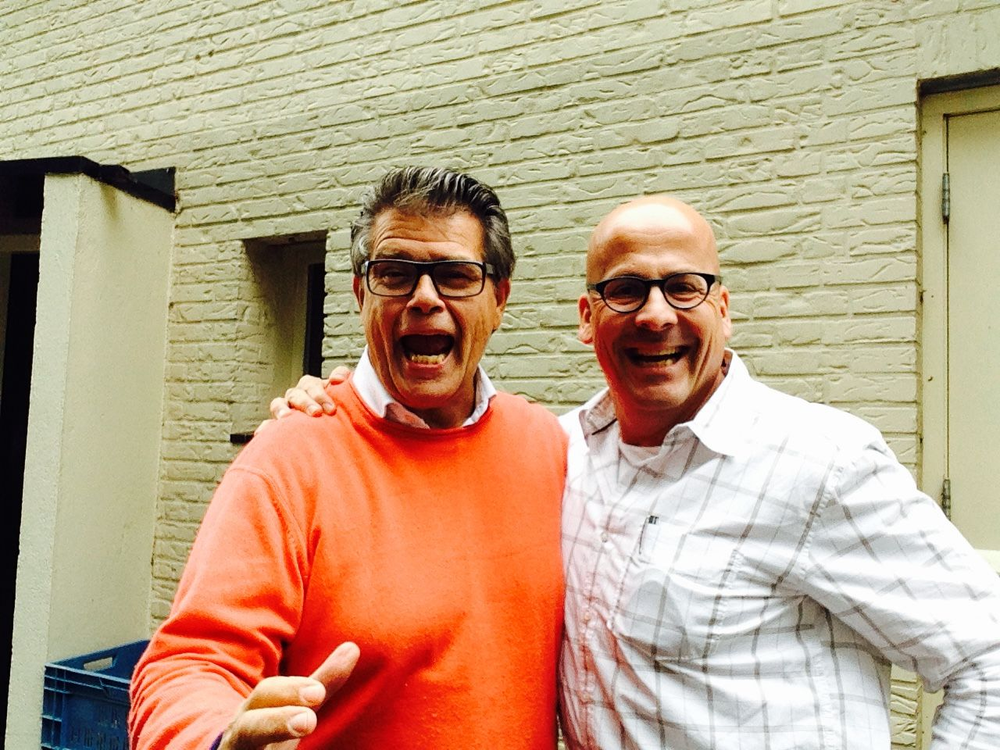
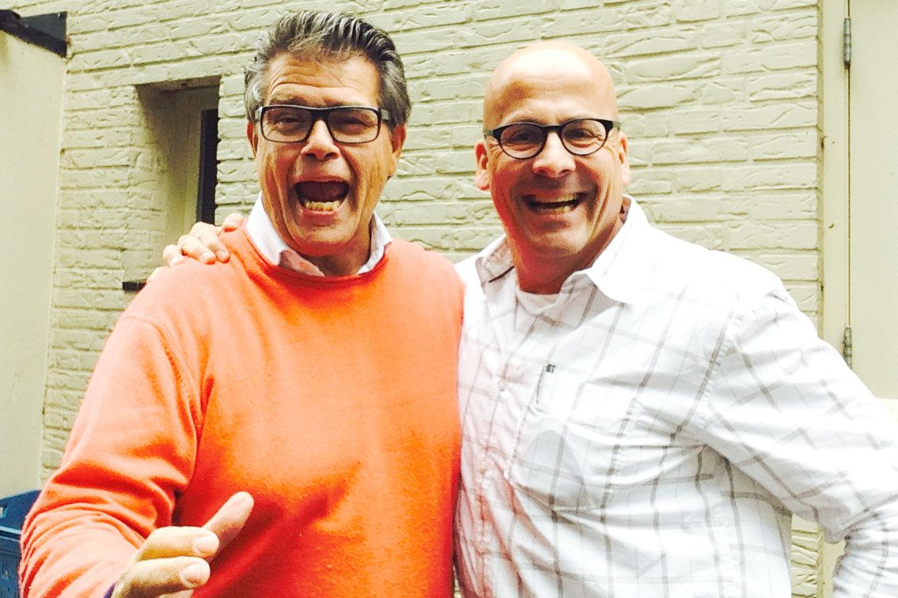

> **Historisch archief.** Deze aflevering verscheen op 30-10-2014 als onderdeel van ReputatieCoaching (2012–2016). De oorspronkelijke tekst is hieronder historisch bewaard. Diensten, contactgegevens, links, tools en adviezen kunnen inmiddels verouderd zijn.



**Transcriptiestatus:** Volledige transcriptie uit het oorspronkelijke archief.

**
Ja, je hoort het goed! Dit is de 100e aflevering van de ReputatieCoaching Podcast en ik ben Eduard de Boer, ReputatieCoach.**

**Podcast nummer 100… Dat betekent dat ik bijna 2 jaar bezig ben. Maar met 52 weken in een jaar, zou uitzending 104 dan een feestelijke aangelegenheid zijn. Ik heb er echter voor gekozen om deze honderdste uitzending als feestmoment aan te wijzen. Ik vind 100 gewoon een mooiere mijlpaal dan 104.**

**Om deze 100e podcast te vieren heb ik een nieuwe intro laten maken. Ik ben benieuwd wat je van dit vernieuwde intro vindt.**

**En wat nog veel leuker is, is de speciale gast in de show… Als je de podcast beluistert, heb je hem al bij de opening van de podcast gehoord. Het is niemand minder dan [Emile Ratelband](http://www.ratelband.com)! Ik heb een aantal vragen voor Emile, maar daar kom ik zo op.**

Eerst heb ik jouw hulp nodig. Help mij met deze mijlpaal en zet de podcast op de online kaart! In plaats van mij te feliciteren via mail, Twitter of Facebook: doe iets anders…

De podcast kun je vinden op [www.reputatiecoaching.nl/100](https://www.reputatiecoaching.nl/100/). Tweet, Like of Share deze link. Deel ’m ook op LinkedIn (of markeer de podcast daar als interessant), deel de podcast ook op Google+ en geef een +1, als je op Google+ zit. Heb je een [iTunes](https://www.reputatiecoaching.nl/itunes) account, laat dan een sterrenbeoordeling en een reactie achter op iTunes. Gebruik je Stitcher, beoordeel de podcast daar! Dat is JOUW manier om mij te feliciteren! Doe het nu eerst, voordat je het vergeet!

Dan over op het interview… Ik skip vandaag de hele riedel over het doel van de podcast etc., want Emile heeft dat veel mooier verwoord, dan ik dat kan.

Voordat we het interview induiken, even voor de luisteraars een korte intro over hoe wij elkaar hebben ontmoet… Emile en ik hebben elkaar eerder dit jaar leren kennen tijdens een workshop op 1.400 meter hoogte, zwevend in een mand onder een heteluchtballon.

Emile leerde de medereizigers de basisbeginselen uit zijn boek “Somatology” en dat was reuze interessant. Na afloop heb ik hem gevraagd of ik hem een keertje mocht interviewen voor de podcast en daar stemde hij meteen mee in. Nu maak ik dankbaar gebruik van dat aanbod, om Emile het hemd van het lijf te vragen voor deze 100e aflevering van de ReputatieCoaching Podcast.

[](https://lh5.googleusercontent.com/-6lfJHvG0REQ/VEjdvYFjEzI/AAAAAAAABQA/2EUhrBCnO98/w640-no/Emile-Ratelband-Eduard-de-Boer.jpg)

Laten we maar van wal steken…

**Opmerking: in de transcriptie zie je alleen de vragen aan Emile Ratelband. Wil je zijn antwoorden horen, luister dan naar de uitzending!**

```
  1. Emile, allereerst bedankt dat je tijd vrij hebt gemaakt voor dit interview in de 100e ReputatieCoaching Podcast. Alle luisteraars hebben ongetwijfeld ooit wel van jou gehoord. Maar kun je toch in een paar zinnen kort iets over jezelf vertellen, voor degenen die niet zoveel over jou weten?
  2. Het kan aan mij liggen en ik kan me vergissen, maar ik heb de idee dat het de afgelopen jaren even iets stiller was rondom jouw persoon, dan de jaren daarvoor. Klopt dit, of heb ik de media gewoon niet goed gevolgd? Wat heb je zoal de afgelopen twee à drie jaar gedaan?
  3. Hoe vind je het om BN’er te zijn?
  4. Wat heb je allemaal gedaan om BN’er te worden? Was het dat waard?
  5. In hoeverre heb je je carrière gepland? Welke voor jou onverwachte, maar belangrijke zaken zijn er op je pad gekomen?
  6. Wat voor soort werk doe je nu? In hoeverre speelt promotie via Internet daarbij een belangrijke rol?
  7. Wat heb je op professioneel gebied gedaan, wat je niet meer zou doen als je nu aan het begin van je carrière stond?
  8. Door welke mensen heb jij je laten inspireren in je leven en waarom?
  9. Wat zou je nog graag in je leven willen doen of bereiken?
  10. Toen je mij belde naar aanleiding van mijn mailtje, opende je het gesprek met: “Een ReputatieCoach… Die had ik eigenlijk jaren geleden al nodig!”. Heb je voorbeelden van reputatieschade die je in je carrière hebt opgelopen? Hoe ben je daarmee omgegaan?
  11. Welke tips heb je voor trainers / sprekers die ook goeroe willen worden?
  12. Wat vind je zelf het leukste of succesvolste project dat je hebt gedaan?
  13. En als laatste: Welke drie tips heb je voor de luisteraars die hun reputatie willen verbeteren?
  14. Emile, ik weet zeker dat de luisteraars veel hiervan hebben opgestoken. Ik in elk geval wel! Als er luisteraars zijn die meer willen weten over jou, of over je trainingen en seminars etc. Waar moeten ze dan kijken en hoe kunnen ze het beste contact met je opnemen?
```

En met deze wijze woorden van Emile kom ik dan weer aan het einde van deze bijzondere aflevering van de ReputatieCoaching Podcast. Ik ben eerlijk gezegd best wel een beetje trots, dat ik het 100 afleveringen heb volgehouden! Help mij met deze mijlpaal te vieren en deel deze podcast overal waar je maar kunt!

Dit was [ReputatieCoaching Podcast aflevering 100](https://www.reputatiecoaching.nl/100/) en ik ben [Eduard de Boer](http://nl.linkedin.com/in/eduarddeboer/nl).

Ik ga mijn best doen om de volgende 100 uitzendingen jou weer en nog steeds van interessante, nuttige en leerzame informatie te voorzien.

Tot volgende week in uitzending 101!

Doei!

Links naar content die in deze podcast aan bod komt:

```
  * [ReputatieCoaching Podcast in iTunes](https://www.reputatiecoaching.nl/itunes)
  * [ReputatieCoaching Podcast op Stitcher](https://www.reputatiecoaching.nl/stitcher)
  * [ReputatieCoaching Podcast op TuneIn Radio](http://tunein.com/radio/ReputatieCoaching-Podcast-p655084/)
  * [ReputatieCoaching Podcast RSS-feed](https://feeds.reputatiecoaching.nl/ReputatieCoachingPodcast)
  * [Ratelband Research Institute](http://www.ratelband.com)
```
