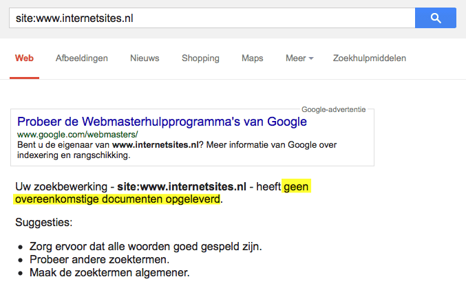
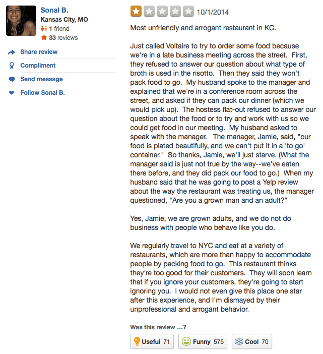
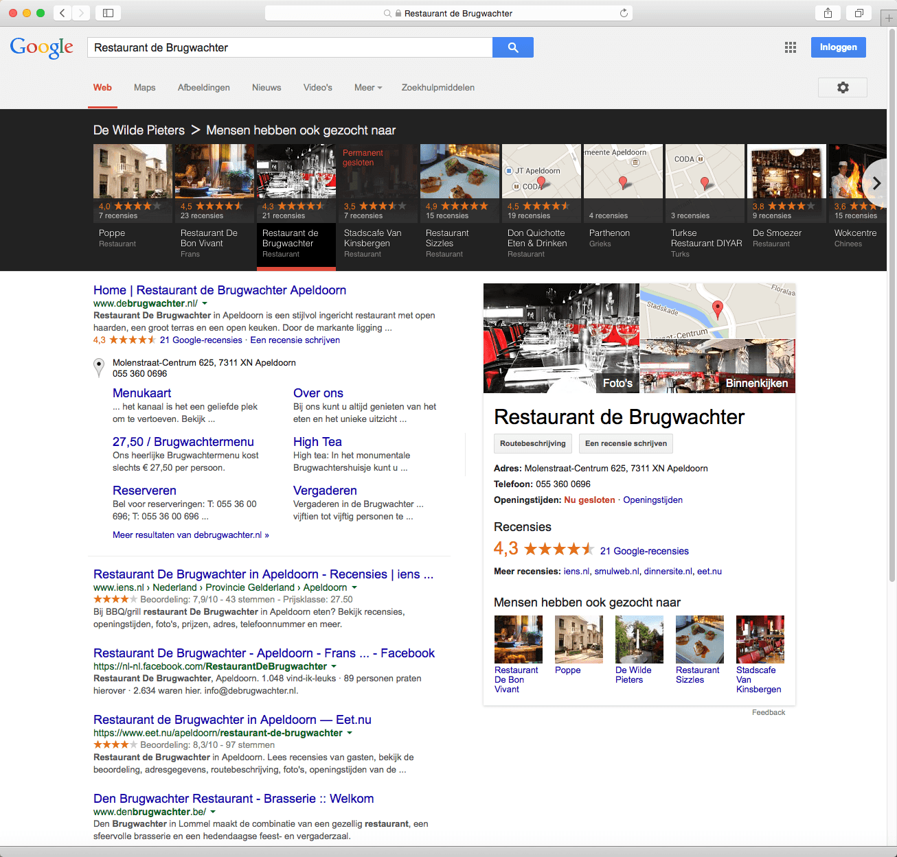

> **Historisch archief.** Deze aflevering verscheen op 6-11-2014 als onderdeel van ReputatieCoaching (2012–2016). De oorspronkelijke tekst is hieronder historisch bewaard. Diensten, contactgegevens, links, tools en adviezen kunnen inmiddels verouderd zijn.



**Transcriptiestatus:** Volledige transcriptie uit het oorspronkelijke archief.

***Historische afbeelding niet beschikbaar: ReputatieCoaching Podcast*
De 100e podcast van vorige week was een groot succes. Dus ik begin vandaag met een korte terugblik op die aflevering. Twee weken geleden ben ik overigens geïnterviewd over reviewmanagement en reputatie en ik vertel je waar je het interview kunt lezen.**

**Sommige ondernemers halen links en citations door elkaar, dus in deze podcast leg ik het verschil uit. Wat doe je met een slechte review voor een service die je niet eens verleent? Blijf luisteren, want dat is een hilarisch verhaal! Zijn grote commerciële reviewsites nuttig voor ondernemers? Ik duik er bovenop en geef je mijn mening en advies. Branchespecifieke reviewsites komen en gaan. Van beide heb ik een voorbeeld.**

**En vandaag heb ik ook een topic voor werknemers… Ik geef je wat tips wat je moet doen, als je een minder positieve of erger nog: een negatieve beoordeling hebt gekregen op je werk. Wat moet je dan beslist niet doen? En wat moet je wel doen om de negatieve beoordeling om te buigen naar een positieve ervaring voor je werkgever?**

Hallo en hartelijk welkom bij deze aflevering van de ReputatieCoaching Podcast. Ik ben Eduard de Boer, ReputatieCoach. Dit is dé podcast die jou helpt om meer business te genereren, doordat jouw website beter gevonden wordt, zowel lokaal als landelijk en doordat ik je uitleg hoe je je online reputatie kunt verbeteren. Dit alles kan je helpen om je bedrijf en jezelf beter op de online kaart te plaatsen.

De podcast kun je vinden op [www.reputatiecoaching.nl/101](https://www.reputatiecoaching.nl/101/). Daar vind je niet alleen de tekst, maar ook video’s waar ik het in deze uitzending over heb, alsmede afbeeldingen, links enzovoorts. Bovendien is de podcast te beluisteren in [iTunes](https://www.reputatiecoaching.nl/itunes), op [Stitcher](https://www.reputatiecoaching.nl/stitcher) en ook op [TuneIn Radio](http://tunein.com/radio/ReputatieCoaching-Podcast-p655084/). Daar kun je je dus ook abonneren op de wekelijkse podcast. Veel mensen vinden het ideaal om de wekelijkse afleveringen van de podcast op hun gemak te beluisteren, terwijl ze autorijden, fietsen of trainen in de sportschool.

## Terugblik podcast 100

*Historische afbeelding niet beschikbaar: Emile-Ratelband*
Vorige week beleefde de podcast haar 100e uitzending. Emile Ratelband was te gast en vertelde over reputatieschade, imago enzovoorts. Zoals sommige luisteraars al opmerkten was tijdens de opname brom te horen van een mobiele telefoon die in de buurt van de recorder lag. Helaas, dat kon ik naderhand er niet meer uithalen.

Maar het gaat natuurlijk om de inhoud, het verhaal dat Emile vertelde. Daar zaten veel pareltjes tussen, waar eenieder wel iets mee kan. De aflevering was dan ook een succes: binnen afzienbare tijd was de aflevering meer dan 100 keer beluisterd! En in één week is het ook al de meest beluisterde aflevering ooit!

Ben je nieuwsgierig en heb je het interview nog niet beluisterd? Surf dan naar [www.reputatiecoaching.nl/100](https://www.reputatiecoaching.nl/100/) om het interview met Emile Ratelband alsnog te beluisteren.

Wat vond je trouwens van dat interview? Moet ik meer van dit type BN’ers in de show uitnodigen om te interviewen? Laat het me weten onderaan de transcriptie van deze podcast, op [www.reputatiecoaching.nl/101](https://www.reputatiecoaching.nl/101/).

Laat ik dan nu overgaan op de onderwerpen voor vandaag…

## ReputatieCoach geïnterviewd over reputatie door Buenoo.nl

*Historische afbeelding niet beschikbaar: 20140519-logo-buenoo*
Twee weken geleden ben ik geïnterviewd door Maurice Natte van [buenoo.nl](http://www.buenoo.nl/). In het interview gaf ik antwoord op de volgende vragen:

```
  1. Wie is Eduard de Boer?
  2. Wat zijn de leuke en minder leuke kanten van jouw baan?
  3. Wat betekent online reputatie voor jouw bedrijf?
  4. Hoe creëren jullie een goede online reputatie?
  5. Wat kan het gebruik van reviews betekenen voor je online reputatie?
  6. Hoe zet je een goede online reputatie om naar extra omzet?
  7. Hoe zie je de toekomst waar een klant makkelijk zijn kritiek kan spuien via allerlei online kanalen?
```

Ben je benieuwd naar mijn antwoorden op die vragen? Lees dan het [“Interview met Eduard de Boer” op buenoo.nl](http://www.buenoo.nl/online-reputatie-belangrijk-voor-meer-omzet-eduard-de-boer/).

## Verschil tussen links en citations

*Historische afbeelding niet beschikbaar: Links per mail?*
James postte een reactie op mijn instructievideo over het aanmelden van je bedrijf op internetsites.nl. Hij schreef:

Het is op grappig, dat James dit schrijft. Waarom? Omdat de site internetsites.nl al meer dan een jaar uit de lucht is! Dus ik ben benieuwd hoe hij een link naar zijn site heeft gevonden, als Google helemaal geen resultaten voor internetsites.nl in haar index heeft:

[](https://lh4.googleusercontent.com/-Tb2ZeQnqaDo/VFsLCNzjcXI/AAAAAAAABQ4/jJp_mS5T-44/w677-h419-no/20141106-internetsites-serp.png)Een een kort stukje achtergrondinformatie. Vorig jaar was ik met het gezin op vakantie naar Frankrijk en ik wilde dat ook tijdens onze vakantie er gewoon content online bleef komen. Dus had ik vooraf een reeks instructievideo’s gemaakt, die gepland online kwamen in zowel YouTube, als met begeleidende artikelen op de website. Dat liep probleemloos…

Echter, ik had geen rekening gehouden met de mogelijkheid dat tussen het moment dat ik de instructievideo maakte en de publicatie ervan, de website zou verdwijnen! En dat is dus precies wat er toen is gebeurd: toen het artikel live kwam, was de site weg!

Waar ik wel op wil ingaan, is dat er blijkbaar onduidelijkheid is over het verschil tussen links (al of niet “NOFOLLOW”) en citations, ofwel: bedrijfsvermeldingen. Daarom wil ik dat toch nog eens verhelderen.

Laat ik beginnen met links, want die kennen de meeste mensen sowieso. Links zijn verwijzingen naar een algemene website, of naar een bepaalde pagina op een site. Deze laatste worden ook wel “deeplinks” genoemd.

Links golden jarenlang als het allerbelangrijkste mechanisme om te scoren in de zoekresultaten. In de beginjaren van Google was het adagium: hoe meer links naar je site en deeplinks naar je achterliggende pagina’s, hoe hoger je scoorde in de zoekmachines.

Maar de algoritmes in de zoekmachines werden beter en intelligenter. Hoewel Google nog steeds links gebruikt voor het bepalen van de positie van een pagina in de zoekresultaten, zijn er inmiddels honderden andere signalen die ook worden gebruikt. Dus het verzamelen van zoveel mogelijk links naar je site, in de illusie dat je daarmee hogerop komt, is zinloos. Ik zeg het telkens weer en ik blijf het zeggen: de essentie is dat je unieke, interessante en relevante content biedt voor de bezoekers van je website.

Sinds een paar jaar kun je links markeren als “NOFOLLOW”. Daarmee geef je aan, dat je verwijst naar de link, maar er feitelijk geen waarde aan hecht. Deze extra tag voor links dien je onder andere te gebruiken als je gastblogs schrijft op veel sites en vooral voor affiliate links of andere betaalde links.

Het onderliggende effect van een “NOFOLLOW” link is dat er geen zogenaamde “PageRank” wordt doorgegeven aan de pagina, waar je naar linkt. Theoretisch draagt jouw link dus niet bij tot het eventueel hoger scoren van de bestemmingspagina.

Er gaan geruchten, die zeggen dat Google op één of andere manier tóch gebruik maakt van NOFOLLOW links. Maar John Mueller van Google zegt hierover:

NOFOLLOW links naar jouw site worden niet meegenomen in het PageRank algoritme en hebben ook geen negatief effect. Dus het verzamelen van NOFOLLOW links is zinloos.

En daarmee kom ik dan meteen op de waarde van citations. Om te scoren in de lokale zoekresultaten, dus als je op zoek bent naar een lokaal bedrijf, zijn citations essentieel. Hoe meer citations (en het liefst op sites met een grote mate van autoriteit), des te hoger kun je scoren in het rijtje van “A” tot en met “G” op Google.

Het is ook geen geheim dat je boven je concurrenten kunt scoren als je ervoor zorgt dat jij met je bedrijfsnaam, adres, postcode, plaats en telefoonnummer op dezelfde sites komt te staan als AL je concurrenten. En dan maakt het hebben van een link nog niet eens zoveel uit! Dus zelfs als de link NOFOLLOW is, kan het plaatsen van de bedrijfsvermelding van je bedrijf op een site tóch lucratief zijn. En zo kan het plaatsen van citations op tientallen directorysites die allemaal met NOFOLLOW naar jouw website linken, je toch naar de felbegeerde “A”-positie in de lokale resultaten helpen.

Dus dit beantwoordt de vraag van James, waarom het zelfs lucratief kan zijn om om je bedrijf aan te melden op een directorysite waar de links NOFOLLOW zijn. Ik ben ervan overtuigd dat de waarde van een dergelijke vermelding veel groter dan nul is. En mocht je je zorgen maken over een potentieel slechte link, vermeld dan gewoon niet de URL van je site! Dan geldt die vermelding voor Google namelijk nog steeds als een citation en die telt dus mee in de ranking van je site in de lokale zoekresultaten.

## Slechte review op Yelp voor service die je niet verleent?

Mensen lezen vaak minder dan de helft van wat er feitelijk aan tekst wordt getoond. Luisteraar Frank uit Nijmegen maakte mij attent op het volgende…

Hij verwees me naar de Yelp-pagina van een restaurant in Kansas City, Missouri in de VS. Het restaurant kreeg een negatieve review op Yelp voor een dienst die ze helemaal niet verleent! En de grap is ook nog eens, dat dit expliciet op de Yelp-pagina van het restaurant staat vermeld!

De review heb ik opgenomen in de show notes van deze podcast, op [www.reputatiecoaching.nl/101](https://www.reputatiecoaching.nl/101/):

[](https://lh5.googleusercontent.com/-XKSZ7kumvrU/VFsMA-xZ_BI/AAAAAAAABRI/d9rkGJfpwMQ/w641-h702-no/20141006-review-voltaire-1.png)De reden dat de schrijfster van de review zo negatief was en dus het minimum van één ster heeft gegeven, is dat het restaurant niet de mogelijkheid biedt om eten mee te nemen; het biedt dus geen “take out food”. Elk restaurant kan besluiten geen “take out” te bieden en dit restaurant is daarmee dan ook zeker niet uniek.

Maar goed, omdat het restaurant dus “niet ”take out food" bood, postte ze een negatieve review op Yelp, ondanks dat dit op de Yelp-pagina van het restaurant staat vermeld.

De eigenaar van het restaurant las dit en kwam in actie. Je moet zijn reactie lezen: die is echt hilarisch! Het is nogal een verhaal, dus dat zal ik je in de podcast besparen. Je moet die maar eens op je gemak lezen in de transcriptie.

[](https://lh4.googleusercontent.com/-cwF-tzQOrVg/VFsNUHMRjII/AAAAAAAABRk/pN739sQzFQY/w392-h745-no/20141006-review-voltaire-2.png)

[](https://lh5.googleusercontent.com/-taOKgE-imRM/VFsN2EekoPI/AAAAAAAABRw/EDXmNNt2zWE/w374-h721-no/20141006-review-voltaire-3.png)

Enfin, er is hier nogal wat ophef over geweest en inmiddels is die review verdwenen van Yelp. Dit laat overigens wel zien, dat Yelp soms ingrijpt als content op haar site teveel aandacht krijgt die met negativiteit is geassocieerd. In dit geval kwam dit de score van het restaurant ten goede, want die ene ster had anders het gemiddelde natuurlijk wel omlaag getrokken.

Frank, bedankt voor je bericht! En laat het ook voor alle andere luisteraars duidelijk zijn, dat ik het ontzettend leuk vind om dit soort berichtjes te ontvangen, waar ik iets mee kan in de podcast, of op de site! Blijf ze gerust sturen, want ik kan ook niet het hele Internet afschuimen op zoek naar dit soort leuke voorvallen!

## Grote commerciële reviewsites voor lokale bedrijven nuttig?

Trustpilot, Ekomi, KiyOh, Feedbackcompany en Telefoonboek: de meeste lokale ondernemers kennen deze algemene commerciële reviewsites wel. Je kunt tegen betaling reviews verzamelen op die sites en deze reviews vervolgens op jouw site laten vertonen, alsmede een soort van “badge”, waarin de gemiddelde beoordeling van jouw bedrijf prijkt. En de meeste van die services zorgen er ook voor, dat jouw bedrijf met de bekende reviewsterretjes wordt vertoond in de zoekresultaten. Maar zijn dit soort review sites ook interessant voor lokale bedrijven?

Ik heb eens even gekeken op de site van Trustpilot, waar (naar het lijkt) real-time de geposte reviews worden vertoond. De reviews die ik in korte tijd voorbij zag komen, waren onder andere voor “Blokker”, “Bax-Shop” en “thuisbezorgd.nl”. Dit zijn stuk voor stuk grote en landelijk opererende bedrijven en websites, in elk geval stukken groter dan de groentenboer op de hoek, of de toko in de straat verderop.

Als je kijkt in de top–3 van de bedrijven in alle categorieën, alsmede verder in de vermelde websites in de diverse categorieën, dan valt het op, dat het gros van de overige klanten van Trustpilot inderdaad webshops zijn. Met andere woorden: ik heb er gedurende de paar minuten dat ik heb zitten grasduinen in de klanten van Trustpilot, geen lokale bedrijven tussen gevonden…

En als je een lokaal bedrijf in Google zoekt, vind je eigenlijk nooit één van de grote, eerder genoemde commerciële reviewsites. Toch scoren die sites vaak erg hoog op de merknamen van de klanten. Ik denk dat dat komt, doordat veel van die sites gewoon te duur zijn voor lokale ondernemers. Zo kost de “Lite” versie van Trustpilot maar liefst EUR 79 per maand! Dat is een forse uitgave.

Ekomi vertoont helemaal geen tarieven op haar site. Dat is niet meer van deze tijd: mensen willen toch een indruk hebben van de kosten?! Zet dan tenminste iets in de trant van bijvoorbeeld: “vanaf 70 Euro”, of hoeveel het dan ook maar mag kosten. Reden is dat mensen ongeduldig zijn en zich niet meer de tijd gunnen om een “Offerte aan te vragen”, ondanks dat die keuze in een mooie groene button wordt vertoond.

Wat je wel vaak ziet terugkomen in de organische resultaten op Google, zijn vermeldingen van telefoonboek.nl, yelp.nl en openingstijden.com. Zoek je een zorgverlener, zoals een fysiotherapeut, tandarts of huisarts, dan worden sites als Zorgkaartnederland, Independer en ZorgKiezer vaak vertoond op de eerste twee pagina’s. En content van iens.nl, eet.nu en couverts.nl komt vaak naar voren, als je zoekt op bepaalde restaurants in een plaats. Ook de GRATIS algemene reviewsite “reviewspot.nl” scoort goed, zag ik tijdens mijn kleine onderzoekje.

Aan de andere kant zie je dus dat kleinere (weliswaar ook commerciële) reviewsites wel weer door lokaal opererende ondernemingen worden omarmd. Een voorbeeld hiervan is [Beunoo](http://www.buenoo.nl/). De maandelijkse kosten hiervan bedragen minder dan bijvoorbeeld het lidmaatschap van een sportschool en het rendement hiervan ligt vooral in de social proof, als Internetters op zoek gaan naar informatie over jouw bedrijf.

Wat is dan het leuke aan Buenoo? Allereerst worden de pagina’s van Buenoo ook met sterretjes in de zoekresultaten vermeld. Dat is positief en draagt bij tot een hogere CTR, ofwel “Click Through Rate”. Maar wat veel mooier is, is dat de pagina’s van Buenoo heel goed scoren, vaak zelfs op de voorpagina, vlak onder de bedrijfsvermelding, als je op Google zoekt op de naam van het bedrijf. Dus op die manier draagt het verzamelen van reviews op Buenoo heel veel bij aan de bedrijfsvermelding, vanuit reputatieperspectief.

Want zeg nu zelf: jij klikt toch ook sneller door, als je een onafhankelijke reviewsite hoog in de zoekresultaten ziet, met daarop de vermelding van het bedrijf dat je zoekt, voorzien van sterretjes?

## Branchespecifieke review sites komen en gaan

Buenoo groeit als kool en steeds weer schieten voornamelijk branchespecifieke sites als paddenstoelen uit de grond. Zo las ik eerder deze week over een reviewsite, specifiek voor golfbanen! Die site kun je vinden op [www.leadingcourses.com](https://www.leadingcourses.com/).

Leadingcourses is een groot succes, want op dit moment is de site al in 8 talen beschikbaar, inclusief Nederlands. De twee talen die heel recent zijn toegevoegd, zijn Noors en Deens. En ondersteuning in het Fins lijkt een volgende logische stap.

Tja, zo heb je sites voor het beoordelen van vergaderlocaties, golfbanen, pedicures, fotografen en ook artsen. Daarmee kom ik op een minder leuk nieuwtje.

Je weet dat ik diverse [tandartsen help met marketing](https://www.reputatiecoaching.nl/marketing-voor-tandartsen/), en met resultaat mag ik wel zeggen! Dat heb je in de opening van deze podcast al wel gehoord van tandarts Dennis uit Culemborg. Een site waar ik in het verleden altijd een bedrijfsvermelding aanmaakte (en waar je ook reviews kon verzamelen), was artsned.nl.

Helaas ontving ik eergisteren een mailtje dat artsned.nl per direct is opgehouden te bestaan en dat de makers ervan, de gebruikers verwijzen naar zorgkaartnederland.nl. Hieruit blijkt dat het wel erg moeilijk is een niet commerciële en branchespecifieke reviewsite in de lucht te houden.

Dit is nu precies ook de reden dat ik je altijd aanraad om je reviews te spreiden: wed niet op één paard en verzamel vooral reviews op meerdere reviewsites, inclusief Google+ Mijn Bedrijf, Facebook, Yelp, telefoonboek.nl en andere. Als er dan ooit weer eens eentje omvalt, dan is de schade voor jou in elk geval beperkt!

## Benedenmaatse beoordeling op je werk? Wat doe je dan?

[Historische afbeelding: Slechte beoordeling op je werk in een functioneringsgesprek?](https://lh3.googleusercontent.com/-epkqHrycfX0/UxyNOwuGDTI/AAAAAAAAAgg/eeKbf1uV3ec/s200-no/Negatief-thumbs-down.png)
Ik zeg het vaak wel in de introductie van de podcast, maar dit keer vat ik de koe bij de horens. Ik vertel je over hoe mensen die in loondienst zijn, met hun reputatie en reviews of beoordelingen om moeten gaan. De drie tips wat je wel moet doen en de drie tips wat je vooral niet moet doen na een functioneringsgesprek komen van de [Harvard Business Review](http://blogs.hbr.org/2014/10/what-to-do-after-a-bad-performance-review/).

Een functioneringsgesprek op je werk is altijd spannend. Maar besef dat een wat mindere beoordeling niet het einde van de wereld betekent, noch het einde van je carière. Vaak biedt het, net als een negatieve review voor een bedrijf, een extra kans om uit te blinken met je reputatie! Maar laat ik beginnen met de drie dingen die je vooral *niet* moet doen.

**Niet doen:**

```
  1. Boos worden over de beoordeling of in discussie gaan. Op dat moment loop je het risico dat je de verkeerde dingen zegt of nog erger: zaken waar je later spijt van krijgt!
  2. Alleen sympatieke collega’s opzoeken voor feedback. Je hebt een eerlijke spiegel nodig, ook van de minder positief gestemde of sympatieke collega’s om een goede basis te vinden voor de beoordeling.
  3. Er van uitgaan dat de beoordeling het laatste woord is, dat erover wordt gesproken. Hoe jij erop reageert is vele malen belangrijker!
```

**Wel doen:**

```
  1. Stel vragen en vraag opheldering. Het is essentieel dat je precies weet waarin je moet verbeteren.
  2. Neem het initiatief voor een verbeterplan.
  3. Onthoud dat je de waarde van de terugkoppeling moet blijven inzien. Het kan een springplank zijn naar een positieve verandering.
```

Blijf je concentreren op het grote plaatje. Na enige zelfbespiegeling kom je er soms achter dat je achterblijvende prestaties op een bepaald punt geen onderontwikkeld punt aangeeft, maar wil zeggen dat je mogelijk niet op de goede plaats zit binnen de organisatie. Soms is een slechte beoordeling nodig voor jou, om je te laten inzien dat je geen goede “match” bent voor de organisatie.

Veel succesvolle mensen hebben op meerdere punten in hun leven gefaald, maar de meeste van hen kijken op deze punten terug als leermomenten en kansen. Dus ook al voelt het “belabberd”, houd in gedachten dat het voor jou de kans op verandering biedt!

En vergeet niet: “Succesvolle mensen nemen hun beslissingen snel en veranderen ze langzaam… Minder succesvolle mensen doen het andersom”.

## November is voor mij unsubscribe-maand!

Pffff… Soms word ik er zo moe van! Van al die mailtjes die je maar blijft ontvangen, omdat je ooit eens ergens informatie hebt aangevraagd of een product, dienst of programmaatje hebt gekocht. De eerste paar keer dat je zo’n mail krijgt verwijder je die met de hand. Maar na verloop van tijd neemt de irritatie toe en dan ga je op zoek naar de mogelijkheid om je uit te schrijven.

Bijna altijd staat er een “Uitschrijven”, “Afmelden” of “Unsubscribe” link onderaan de mail. Dat is tegenwoordig verplicht, maar niet elk bedrijf houdt zich daaraan.

Op dit moment ben ik ook weer druk met alle inkomende mails kritisch te bekijken en ik kan je vertellen dat ik dankbaar weer veelvuldig gebruik maar van de “Afmelden”-link. En opeens is het weer een stuk rustiger in mijn inbox…

Tja, ik klaag niet hoor! Dat ligt niet in mijn aard! Maar met deze veel rustigere inbox kom ik bijna aan het einde van deze podcast.


Ik noemde net het woord “inbox”. Een paar dagen geleden heb ik je uitgenodigd om mij een mailtje te sturen, als jij per direct een uitnodiging wilt voor Google Inbox, het nieuwe mailsysteem of mailprogramma van Google. Dat aanbod geldt nog steeds. Als je een review post voor de [ReputatieCoaching Podcast op iTunes](https://www.reputatiecoaching.nl/itunes) en mij een mailtje stuurt met je Gmail-adres, dan nodig ik jou uit voor Google Inbox.

Oh, nog een nieuwtje. Gisteravond zag ik al surfend opeens de zwarte carrousel voorbij flitsen in de Nederlandse zoekresultaten. Eerst kon ik het niet reproduceren, maar later is het me wel gelukt. Ik denk dat Google aan het testen is en ik heb het gevoel dat de carrousel binnenkort ook in Nederland massaal zichtbaar wordt…

[](https://lh5.googleusercontent.com/-5IM76psmCPc/VFsO11_ifRI/AAAAAAAABSA/17P4cKxNyMo/w1306-no/20141106-carrousel-brugwachter.png)

Indien je als bedrijf dan geen goede foto’s op je Google+ Mijn Bedrijf pagina hebt staan, dan is je collega (of concurrent) die wel mooie foto’s heeft, beduidend in het voordeel! Dus wacht niet te lang en publiceer mooie, professionele foto’s op je Google+ Mijn Bedrijf pagina!

En daarmee kom ik dan vandaag echt weer aan het einde van deze podcast.

Als je de podcast leuk vindt en je wilt nog meer op de hoogte blijven, volg me dan ook op Twitter, via [@reputatiecoach1](https://twitter.com/reputatiecoach1).

Heb je inderdaad wat aan alle informatie die ik met je deel, help mij dan met het verder verbeteren en promoten van deze podcast. Surf daarvoor naar [iTunes](https://www.reputatiecoaching.nl/itunes) of [Stitcher](https://www.reputatiecoaching.nl/stitcher), geef de podcast een sterrenbeoordeling en laat ook je reactie achter. Door de podcast te beoordelen op iTunes en/of Stitcher breng je de podcast onder de aandacht van een breder publiek.

Je kunt me verder helpen, door de podcast aan te bevelen bij vrienden of collega’s, waarvan je denkt dat ze er hun voordeel mee kunnen doen, of door ’m te delen op Twitter, like’n en delen op Facebook of een “+1” te geven op Google+.

En vergeet niet: ik ben hier om je te helpen! Als je een vraag of een probleem hebt met betrekking tot je online reputatie of de vindbaarheid van je website, kun je een mailtje sturen naar [podcast@reputatiecoaching.nl](mailto:podcast@reputatiecoaching.nl).

Als je dat te lastig vindt, of als je de podcast beluistert terwijl je in de auto zit en je hebt acuut een vraag, spreek dan een boodschap in op de ReputatieCoaching Hotline, op nummer: 084 - 883 15 56. Mogelijk behandel ik je vraag of probleem dan in een artikel of in de podcast.

En je kunt ook rechtstreeks op de website een voicemail achterlaten, door op de tab aan de rechterkant van elke pagina te klikken, en je bericht in te spreken. Dit was [ReputatieCoaching Podcast aflevering 101](https://www.reputatiecoaching.nl/101/) en mijn naam is [Eduard de Boer](http://nl.linkedin.com/in/eduarddeboer/nl).

Ik wens je de komende week weer succes met het werken aan je reputatie, zodat je meteen je reputatie voor jou kunt laten werken!

Tot volgende week!

Doei!

Links naar content die in deze podcast aan bod komt:

```
  * [ReputatieCoaching Podcast in iTunes](https://www.reputatiecoaching.nl/itunes)
  * [ReputatieCoaching Podcast op Stitcher](https://www.reputatiecoaching.nl/stitcher)
  * [ReputatieCoaching Podcast op TuneIn Radio](http://tunein.com/radio/ReputatieCoaching-Podcast-p655084/)
  * [ReputatieCoaching Podcast RSS-feed](https://feeds.reputatiecoaching.nl/ReputatieCoachingPodcast)
  * “[What to Do After a Bad Performance Review](http://blogs.hbr.org/2014/10/what-to-do-after-a-bad-performance-review/)” (Harvard Business Review, 29 oktober 2014)
```
