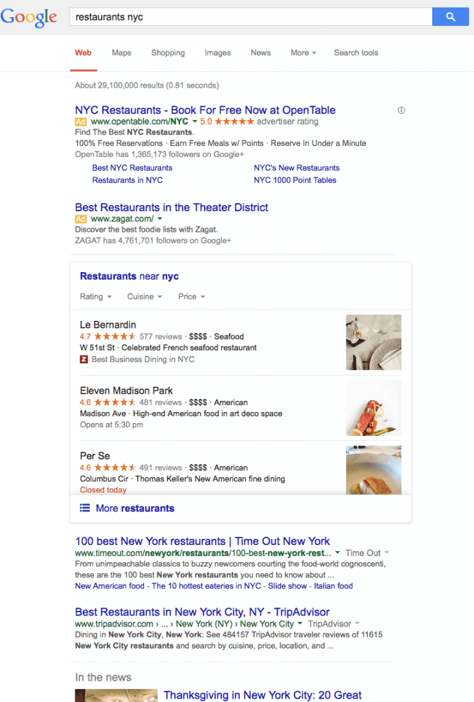
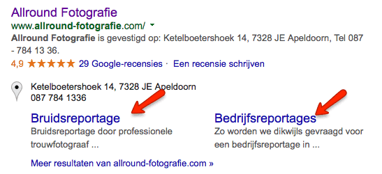
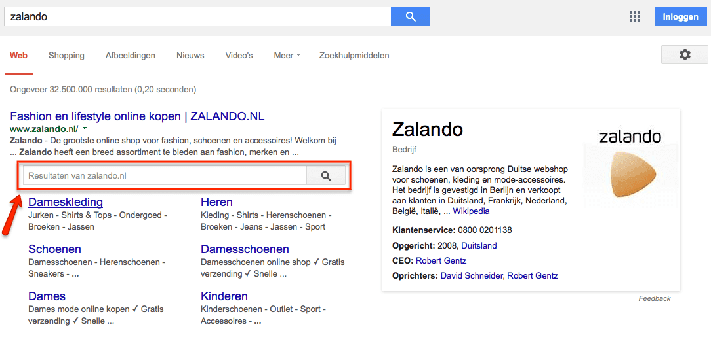
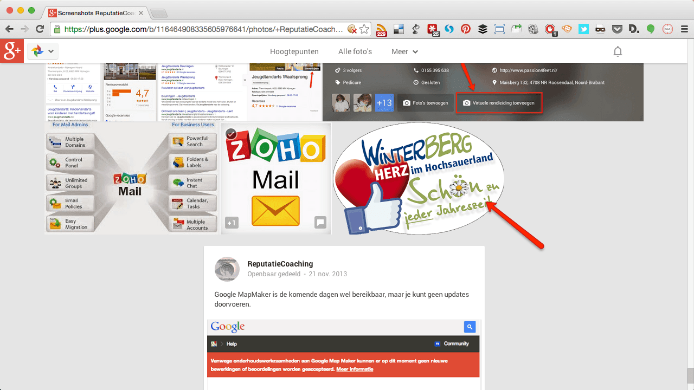
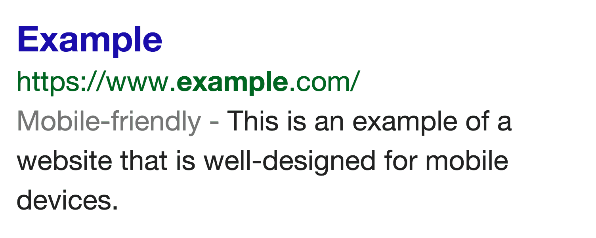
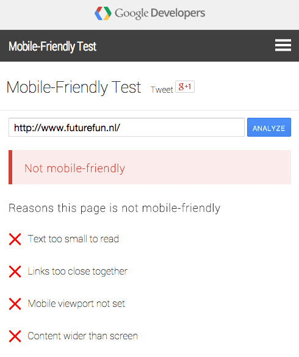

> **Historisch archief.** Deze aflevering verscheen op 20-11-2014 als onderdeel van ReputatieCoaching (2012–2016). De oorspronkelijke tekst is hieronder historisch bewaard. Diensten, contactgegevens, links, tools en adviezen kunnen inmiddels verouderd zijn.

**Transcriptiestatus:** Volledige transcriptie uit het oorspronkelijke archief.

***Historische afbeelding niet beschikbaar: ReputatieCoaching Podcast*
In Winterberg (Duitsland) is men nog niet zichtbaar actief met reviews. Dat ervoer ik afgelopen weekend. En dan lijkt het erop, alsof we in Nederland binnenkort ook de carrousel voor lokale resultaten gaan krijgen, terwijl Google in de Verenigde Staten is begonnen de carrousel weer weg te halen. Het wordt er niet duidelijker op. Maar wat verandert er dan wellicht in de toekomst? Ik vertel het je zometeen!**

**Ik ben aan het experimenteren met de zogenaamde “sitelinks search box”; dat is het volgende onderwerp voor vandaag. Websites die mobielvriendelijk zijn, worden binnenkort mogelijk hoger vertoond in de zoekresultaten. Dat heeft Google eergisteren aangekondigd. Twitter heeft afgelopen week aangekondigd alle tweets ooit te ontsluiten met een nieuwe, eigengebouwde zoekmachine en ik sluit de podcast voor vandaag af met 23 minder bekende toepassingen voor Twitter lists.**

Hallo en hartelijk welkom bij deze aflevering van de ReputatieCoaching Podcast. Ik ben Eduard de Boer, ReputatieCoach. Dit is dé podcast die jou helpt om meer business te genereren, doordat jouw website beter gevonden wordt, zowel lokaal als landelijk en doordat ik je uitleg hoe je je online reputatie kunt verbeteren. Hierdoor zet je je bedrijf en jezelf beter op de online kaart.

De podcast kun je vinden op [www.reputatiecoaching.nl/103](/nl/archief/reputatiecoaching/103/). Daar vind je niet alleen de tekst, maar ook video’s waar ik het in deze uitzending over heb, alsmede afbeeldingen, links enzovoorts. Bovendien is de podcast te beluisteren in [iTunes](https://web.archive.org/web/*/https://www.reputatiecoaching.nl/itunes), op [Stitcher](https://web.archive.org/web/*/https://www.reputatiecoaching.nl/stitcher) en ook op [TuneIn Radio](http://tunein.com/radio/ReputatieCoaching-Podcast-p655084/)103. Daar kun je je dus ook abonneren op de wekelijkse podcast. Veel mensen vinden het ideaal om de wekelijkse afleveringen van de podcast op hun gemak te beluisteren, terwijl ze autorijden, fietsen, wandelen of trainen in de sportschool.

Laat ik dan nu overgaan op de onderwerpen voor vandaag…

## Geen reviews in Winterberg

Degenen die mij volgen op Instagram of Facebook hebben kunnen zien dat ik afgelopen weekend er even tussenuit was. Samen met mijn vrouw Suzanne ben ik naar Winterberg in Sauerland (Duitsland) afgereisd. Daar hebben we twee nachten overnacht in een hotel. Overdag hebben we veel gewandeld en veel in de omgeving bekeken. We hebben zelfs nog even in de sneeuw gestaan, ook al was dat kunstmatige sneeuw.

Tussendoor hebben we links en rechts gegeten en gedronken. Wat mij opviel was dat we eigenlijk nergens iets zagen wat riekte naar het opbouwen van een reputatie of het onderhouden van contacten via de social media. Bij geen enkele winkel in de hoofdstraat van Winterberg zag ik een Foursquare of Yelp sticker, noch enige andere associatie met een review site.

Geen enkel restaurant waar we zijn geweest communiceerde actief de Facebookpagina of probeerde fans te werven. Ook zagen we nergens QR-codes of URLs waar we reviews konden achterlaten.

[](https://lh3.googleusercontent.com/-3l7-Wa9XUGs/VG2ki0QA2DI/AAAAAAAABTU/X3namz5GQh0/w800-h524-no/20141120-Winterberg-Like.png)

In deze tijd kun je je dat toch niet meer voorstellen! Ik zou denken dat alle etablissementen in een populair dorp als Winterberg juist elkaar in figuurlijke zin zouden “doodconcurreren” op dit gebied.

Het kan natuurlijk zijn dat mij iets is ontgaan, maar ik ben in elk geval geen enkele poging om een review te verkrijgen of om een fan te werven, tegengekomen.

## Tips voor een reissite

Van ons weekendje weg naar Winterberg kom ik op een andersoortige reissite: een site met tips en aanbiedingen uit een bepaalde regio in een land. De details doen op dit moment even niet terzake.

Ik werd benaderd om adviezen te geven over hoe deze site, die eigenlijk enig in zijn soort is, beter gevonden kan worden, zonder een complete linkwervingscampagne op te hoeven starten etc.

Tja, mijn mantra om jezelf op Internet te onderscheiden is nog steeds “Content is king”. Dus in essentie was mijn advies ook om meer relevante, interessante, unieke en geografisch georiënteerde content te publiceren. Ik ben ervan overtuigd dat je uiteindelijk links naar je site gaat verdienen, als je publiek vindt dat je goede content produceert.

En zeker als je een site uit de reisbranche wilt laten scoren, dan volstaat het niet als je eens per twee weken of zo eens een nieuw berichtje post. Zoekmachines zien jouw site dan meer als een soort semi-inactief persoonlijk weblog.

Ik heb de beller om te beginnen verteld over de essentie van goede, unieke, relevante en interessante content. Vervolgens ben ik wat meer de diepte in gegaan. Zo heb ik onder andere de volgende adviezen gegeven die mijns inziens snel tot enig resultaat kunnen leiden, maar waar veel mensen niet zo gemakkelijk op komen:

```
  * Omgeving-/regiospecifieke artikelen, voorzien van geotagged foto’s (hierover publiceer ik binnenkort een gastblog ergens…)
  * Tekstuele interviews met lokale bekendheden
  * Video of audio interviews met bijvoorbeeld hoteldirecteuren, F&B managers, wijnboeren, burgemeesters, slagers, restauranteigenaren en andere mogelijk interessante personen in de plaatsen die worden gepromoot
  * Video reviews van attracties in de regio
  * Evaluaties van andere websites over de regio
```

De beller verkeerde ook nog in de veronderstelling dat zij massaal links moest gaan verzamelen. Dat heb ik gelukkig uit haar hoofd kunnen praten met het argument dat je tegenwoordig links moet verdienen op basis van de kwaliteit van de content die je aanbiedt.

Het viel haar aardig rauw op het dak dat ze wekelijks toch wel een paar nieuwe artikelen zou moeten publiceren, wil ze de site de aandacht laten krijgen die hij volgens haar verdient.

Ze gaat nu brainstormen wat ze van mijn adviezen zoal kan realiseren en wie ze daarvoor kan inschakelen. Want zelf is ze druk bezig met diverse andere zakelijke activiteiten. We hebben afgesproken om binnen nu en ongeveer een week weer contact te hebben. Dan zou ze met een aantal concrete uitwerkingen komen op basis van mijn suggesties en ik hoop dat ik haar dan verder op weg kan helpen.

Tot zover over de promotie van een reis-informatie-site.

## “To carrousel or NOT to carrousel?”

Laatst had ik de lokale [Google carrousel voor het eerst in de Nederlandstalige zoekresultaten](https://web.archive.org/web/*/https://www.reputatiecoaching.nl/google-carrousel-in-nederland/) op google.nl gespot. Daar heb ik toen ook meteen een video van gemaakt. Lange tijd heb ik geroepen dat de carrousel ook naar Nederland zou komen. En ja, in zekere zin heb ik daar dus gelijk in gekregen.

Maar inmiddels is de carrousel in de Verenigde Staten alweer op zijn retour! De markt was er niet blij mee en ook Google wilde naar een andere weergave van lokale bedrijven. Daar is het nu mee begonnen, lijkt het.

Want in een aantal marktsegmenten zie je nu dus geen carrousel meer. Zo zie je voor restaurants bijvoorbeeld een afbeelding, zoals ik die in de show notes heb opgenomen:

[](https://lh4.googleusercontent.com/-_jfr5OJfzRU/VG2nqrmEZKI/AAAAAAAABUc/mKEjZHF9050/h1024/20141120-new-google-3pak.png)*(Screenshot: Mike Blumenthal)*

Let wel, dat ook deze weergave vooralsnog niet in Nederland beschikbaar is.

Mede gelet op het feit dat de carrousel in de achtergrond in Nederland en ook in andere landen enigszins zichtbaar wordt, denk ik dat Google bezig is haar output in een groot aantal landen gelijk te trekken. Dus eerst wordt de carrousel ook hier zichtbaar, waarna bijvoorbeeld met CSS deze later anders weergegeven wordt, op de wijze, zoals je die in de afbeeldingen hiervoor hebt gezien.

Op die manier gaat Google meer eenduidigheid uitstralen en zo kan ze ook waarschijnlijk kosten besparen, omdat er minder verschillende versies van de software en/of stylesheets etc. onderhouden hoeven te worden.

## Sitelinks search box

Nu ik het toch over Google heb… Heb jij al een sitelinks search box in de zoekresultaten? Nou, ik had er al wel over gelezen, maar ik had hem nog niet. En ik heb de sitelinks search box ook nog niet. Maar ik heb eerder deze week wel de vereiste actie ondernomen, om mijn kans *dat* die wordt vertoond, te vergroten.

Om te beginnen: wat is de sitelinks search box? Dit is een extra zoekveld, dat je krijgt in de zoekresultaten, als er bij jouw website vermelding de zogenaamde sitelinks worden vertoond. In de show notes heb ik een afbeelding opgenomen, waarop je een voorbeeld van sitelinks kunt zien:

[](https://lh6.googleusercontent.com/-_nOBRcPFNrE/VG2ozMGAsjI/AAAAAAAABVw/QVqUw7Ty5b8/w547-h250-no/20141120-sitelinks-allround-fotografie.png)

Begin september heb ik voor het eerst over de sitelinks search box gelezen. Op het Google Webmaster Central Blog werd toen op 5 september een artikel gepubliceerd, met de titel “[An improved search box within the search results](http://googlewebmastercentral.blogspot.nl/2014/09/improved-sitelinks-search-box.html)”. Daarin werden toen screenshots van een mobiele weergave vertoond. Later doken er ook screenshots van desktopversies op.

Het komt erop neer dat Google een tweede zoekveld vertoont in de zoekresultaten, als er bij jouw site de zogenaamde sitelinks worden vertoond. Dat is het gemakkelijkste te testen door je bedrijfsnaam in te toetsen, zoals ik in de afbeelding van de sitelinks voor Allround Fotografie heb gedaan.

In dit zoekveld kun je dan een zoekterm ingeven voor de desbetreffende site. Als je dan op ENTER klikt, wordt de zoekpoging op die site uitgevoerd en worden de relevante resultaten vertoond.

Om dit in te stellen moet je een paar zaken regelen op je site. Zo moet je een site-eigen zoekmogelijkheid hebben op de homepagina van je site. Vervolgens moet je wat extra code in het header-deel van je site opnemen.

Op diverse sites las ik dat het daarna gemiddeld tot zo’n 48 uur kan duren, tot de sitelinks search box verschijnt. Nu heb ik zo’n 36 uur geleden de vereiste code op de site gezet en tot net vóór het inspreken van de podcast was die nog niet te zien. Ik wacht dus geduldig. Het is volgens mij in dit geval niet zo dat het alleen voor Engelstalige sites beschikbaar is. Want als je in Google “zalando” invoert, zie je precies wat ik bedoel:

[](https://lh6.googleusercontent.com/-oCxuzUD6KYs/VG2ozeRTg9I/AAAAAAAABV4/_KPQ3jNISp8/w1084-h532-no/20141120-sitelinks-search-box-zalando.png)

Dus het is ook beschikbaar voor Nederlandstalige sites. Zoals elke keer als ik een experiment uitvoer, zeg ik ook nu weer: “Zodra ik nieuws erover heb, laat ik je het weten!”…

## Google als GRATIS CDN (Content Delivery Network)

Ik vertelde je al in [podcast 65](/nl/archief/reputatiecoaching/065/) dat ik Google+ voor mijn site [www.reputatiecoaching.nl](https://web.archive.org/web/*/https://www.reputatiecoaching.nl/) gebruik als een Content Delivery Network, afgekort “CDN”, voor vrijwel al mijn afbeeldingen. Hoe ik dat doe, wil ik je in deze podcast kort uitleggen. En ik zal er binnenkort ook een instructievideo over maken.

Maar waarom zou je überhaupt de afbeeldingen in jouw berichten, op jouw website, vanaf een andere website willen laten vertonen?

Om te beginnen scheelt dat bandbreedte op de server, waar jouw website op staat. Daardoor kan de webserver meer gelijktijdige bezoekers bedienen. En natuurlijk kost het je minder opslag op je webserver. Een bijkomend voordeel is, vooral als je een beperkte bandbreedte hebt bij je hosting provider, dat deze zo minder snel opgesoupeerd wordt. Want bijna altijd is de grafische content veel groter, dan de tekstuele content van een webpagina.

Bovendien hebben Content Delivery Networks meestal servers in diverse werelddelen staan, waardoor de bestanden over het algemeen sneller geladen zijn door gebruikers uit de buurt. Ook zijn CDN’s geoptimaliseerd voor snelheid en om dat te doen, waar ze voor staan: content zo snel mogelijk sturen naar degene die erom vraagt.

Webpagina’s waarin afbeeldingen zijn opgenomen, die fysiek op een CDN staan, laden dus veelal sneller. Dat komt ook, doordat de meeste webbrowsers slechts een beperkt aantal simultane verbindingen naar één en dezelfde webserver kunnen openen, om te voorkomen dat de desbetreffende webserver overladen wordt.

Een heel bekend CDN is Akamai, dat was ook één van de eerste bedrijven die pionierde met Content Delivery in de hele wereld. Bedrijven als Apple, Adobe, Microsoft, BBC, Honda, Sony, Fiat, Rabobank en andere grote namen hebben hier jarenlang gebruik van gemaakt. Sommige gebruiken het nog steeds, terwijl ik het gerucht heb gelezen dat Apple bezig is met een eigen Content Delivery Network op te bouwen.

Een paar andere bekende CDN’s zijn:

```
  * Amazon Cloudfront
  * CloudFlare CDN
  * MaxCDN
  * Highwinds
  * iWeb
  * Edgecast
```

En als je gaat zoeken, kun je er zo nog tientallen vinden. Maar eigenlijk hebben al die diensten één ding gemeen… Dat is dat ze geld kosten! Vaak veel geld!

Stel nu eens dat je helemaal GRATIS een supersnel en wereldomvattend CDN kunt gebruiken? Een CDN dat laagdrempelig is, gemakkelijk in gebruik en binnen het bereik van vrijwel elke webmaster ligt?

Welkom in de mooie wereld van Google+! Ik gebruik Google+ inmiddels al ongeveer een jaar voor het hosten van alle afbeeldingen die ik in mijn weblogartikelen en podcasttranscripties plaats. En tot mijn volle tevredenheid! Webpagina’s laden snel, evenals de afbeeldingen.

Om te beginnen moet je een Google+ account hebben, ofwel een persoonlijk Google+ profiel, of een Google+ pagina. Zo heb ik voor ReputatieCoaching een aparte Google+ pagina, die je trouwens kunt vinden op: [plus.google.com/+ReputatieCoachingNL](https://plus.google.com/+ReputatieCoachingNL). Daar sla ik de afbeeldingen op, die ik in de artikelen gebruik. Natuurlijk zorg ik ervoor dat afbeeldingen welluidende bestandsnamen hebben, die bij voorkeur wat relevante zoektermen bevatten.

Maar voordat ik de afbeeldingen upload, optimaliseer ik ze eerst met compressor.io. De instructievideo hiervoor heb ik nogmaals opgenomen in de show notes, op [www.reputatiecoaching.nl/103](/nl/archief/reputatiecoaching/103/):

Ik vind overigens het verkleinen van de resolutie en de bestandsgrootte van een afbeelding normaliter een goede gewoonte, om zo de bandbreedte te beperken, de laadtijd van pagina’s te verkorten en dus de gebruikerservaring te verhogen. Maar… Op Google+ upload ik bij voorkeur afbeeldingen met een zo hoog mogelijke resolutie. Waarom? Dat leg ik je zometeen uit.

Laat ik beginnen met het uploaden:



[](https://lh6.googleusercontent.com/-0HdRTqVy85s/VG2noPuMdbI/AAAAAAAABUs/BxlZKecpSvo/s400-no/20141120-gplus-upload-2.png)

Eenmaal opgeslagen in een map open ik de gewenste afbeelding door erop te klikken:

[](https://lh4.googleusercontent.com/-wnu7emxuGcU/VG2nosqTlnI/AAAAAAAABUY/fGHSnZEXEPw/w1280/20141120-gplus-upload-4.png)

Daarna open ik de afbeelding met een rechter muisklik in een nieuw tabblad. In dat tabblad zie je in de adresbalk de URL van de afbeelding:

[](https://lh4.googleusercontent.com/-uLps9atA2tQ/VG2npQqqGaI/AAAAAAAABUQ/ureD3HXhyvs/w1280/20141120-gplus-upload-6.png)

Die selecteer je en kopieer je naar het klembord met CTRL-C (Windows) of CMD-C (Apple). In WordPress kies je op de gewenste plek “Media toevoegen”, waarna je links klikt op “Invoegen via URL”:

[](https://lh6.googleusercontent.com/-HHnrfeJ7cNg/VG2np9lWpaI/AAAAAAAABUM/F7I61jL1_Aw/w874-h689-no/20141120-gplus-upload-8.png)Dan plak je met CTRL-V of CMD-V de URL in het veld en eventueel vul je de overige velden van de afbeelding in. Als je dan je pagina bekijkt, zie je dat de afbeelding is opgenomen in je blogbericht, terwijl die jou geen opslagcapaciteit kost en ook geen bandbreedte van je server. Zo simpel is het!

Maar ik had je beloofd uit te leggen waarom ik afbeeldingen eerst met compressor.io in bestandsgrootte verklein en dan in een zo hoog mogelijke resolutie naar Google+ upload. Dat komt, doordat Google zelf afbeeldingen kan verkleinen en de afbeelding in precies de juiste resolutie naar de eindgebruiker kan sturen.

Dat doe je door in de URL iets te veranderen:

[](https://lh4.googleusercontent.com/-llVmhP_ZrSk/VG2qqNCUarI/AAAAAAAABWs/c8ilNvraQiA/w1280/20141120-gplus-upload-10.png)

Op de afbeelding die je kunt vinden in de show notes van deze podcast op [www.reputatiecoaching.nl/103](/nl/archief/reputatiecoaching/103/) zie je staan “W” of “S” en dan nog wat getallen en letters. Verander dat in bijvoorbeeld W200 om een afbeelding te krijgen die slechts 200 pixels breed is. Daarmee kun je dus de grootte van de afbeelding aanpassen.

Zo voorkom je dat een *te grote* afbeelding naar de browser wordt gestuurd, die dan vervolgens daar softwarematig wordt verkleind. Dat is iets wat je koste wat het kost wilt voorkomen.

Mocht je er niet uitkomen, schroom dan niet en post je vraag onderaan de show notes van deze podcast.

## Hogere ranking voor mobielvriendelijke websites?

Tja, het zat er al een tijdje aan te komen en nu heeft Google het ook daadwerkelijk zelf min of meer bevestigd: mobielvriendelijke sites kunnen hoger gaan scoren in de zoekmachines dan sites die minder goed worden weergegeven op mobiele apparaten… Echt waar!

Google is namelijk begonnen om op mobiele apparaten in de zoekresultaten te laten zien of een site mobielvriendelijk is. Dit heeft Google 18 november jongstleden bekendgemaakt. Je kunt dit nalezen in het artikel “[Helping users find mobile-friendly pages](http://googlewebmastercentral.blogspot.nl/2014/11/helping-users-find-mobile-friendly-pages.html)” op het Google Webmaster Central Blog.

In de show notes heb ik een screenshot opgenomen, waarin je kunt zien hoe dit er uit komt te zien:

[](https://lh3.googleusercontent.com/-gv6UD8ScpsY/VG2oyMiJl7I/AAAAAAAABVo/3aLZ2fbNoQg/w400/20141120-mobile-friendly.png)Het komt erop neer dat voor het stukje introtekst onder de URL in de vermelding in de zoekresultaten een grijze tekst wordt vertoond, die luidt: “Mobile-friendly”. Dat is in elk geval, wat Google zegt over de Engelse zoekresultaten.

En Google stelt jou ook in staat om nu meteen te testen of jouw site mobielvriendelijk is. Daarvoor heeft het bedrijf namelijk de “[Mobile-Friendly Test](https://www.google.com/webmasters/tools/mobile-friendly/)” ontwikkeld. De link hier naartoe vind je natuurlijk in de show notes van deze podcast, op [www.reputatiecoaching.nl/103](/nl/archief/reputatiecoaching/103/).

Ik heb direct een aantal sites getest, want ik wil natuurlijk wel dat mijn sites het label van mobielvriendelijk krijgen toebedeeld van Google. Gelukkig kwamen alle sites door de test:



Maar diverse andere sites kwamen niet door de test. Zo heb ik de site getest van een luchtballonbedrijf en daarop had Google toch wel wat opmerkingen. Zo meldde de tool onder andere het volgende:

```
  * Tekst is te klein om te lezen
  * Links staan te dicht bij elkaar
  * Mobile viewport is niet ingesteld
  * Content is breder dan het scherm
```

Hoe dit wordt vertoond in de testtool, kun je zien in de show notes:

[](https://lh3.googleusercontent.com/-VFVQ7_fI_VA/VG2oyGyPZmI/AAAAAAAABWE/2HU0MgDZU_8/w490-h585-no/20141120-google-mobile-friendly-test-ff.png)Maar de tool geeft niet alleen maar commentaar. Het kan je namelijk ook helpen met het mobielvriendelijk maken van je site. Als je advies wilt, kan de tool je op dit moment helpen met sites die zijn gemaakt in één van de volgende Content Management Systemen:

```
  * WordPress
  * Joomla!
  * Drupal
  * Blogger
  * vBulletin
  * Tumblr
  * DataLife Engine
  * Magento
  * Prestashop
  * Bitrix
  * Google Sites
```

Dat is wel heel vriendelijk van Google. Het geeft maar aan dat het bedrijf je op elke manier wil helpen om ook jouw site mobielvriendelijk te maken. En ik denk dat ze dat alleen maar doet om geen negatieve feedback te krijgen op het moment dat mobielvriendelijkheid van sites gaat meewegen als ranking factor voor de positie in de zoekresultaten.

Want Google sluit het artikel waar ik zojuist naar verwees af met de volgende tekst:

Daar heb je het. Als Google zegt dat ze ermee experimenteert… Hmmm… Dan kun je er aardig zeker van zijn dat de testfase al in een vergevorderd stadium is en op het punt staat om live te gaan. Dus, wat ik al zovaak heb geroepen: “*Maak je site mobielvriendelijk! Zo snel mogelijk!*”.

## Twitter gaat alle tweets ontsluiten!

In het verleden was er een verbinding tussen Google en Twitter, waardoor Google alle tweets van Twitter kon zien en indexeren. Op een bepaald moment in tijd zijn beide partijen uit elkaar gegaan en vanaf dat moment kon Twitter niet meer dan je een zoekmogelijkheid geven in de tweets die niet ouder waren dan een week.

Maar daar komt nu weer verandering in, want Twitter gaat zich opwerpen als een soort van zoekmachine, maar dan zonder hulp van Google: het gaat alle openbare en dus publiek toegankelijke tweets doorzoekbaar maken. Moet je je eens voorstellen wat dat voor schat aan informatie kan ontsluiten!

Yi Zhuang van Twitter (ik hoop dat ik de naam goed uitspreek!) publiceerde eerder deze week een artikel op het Twitter blog, met als titel “[Building a complete Tweet index](https://blog.twitter.com/2014/building-a-complete-tweet-index)”. Hij schrijft hierin onder andere:

Hij schrijft verder dat Twitter erin is geslaagd om de meer dan een half triljoen tweets te doorzoeken met een gemiddelde zoektijd van minder dan 100 ms.

Onderschat het niet: er komen wekelijks een paar miljard tweets bij! Moet je je voorstellen wat dat aan processingkracht en opslag vereist! Ik moet er niet aan denken om een dergelijk systeem te moeten ontwerpen! Gelukkig hoef ik dat ook niet!

Als je werkzaam bent in het ontwikkelen van informatiesystemen, dan zul je smullen van het artikel, waar ik in de show notes naar link. Daarin wordt uit de doeken gedaan hoe het systeem is ontworpen en is opgebouwd.

## 23 minder bekende toepassingen voor Twitter lists

Het laatste topic voor vandaag gaat ook over Twitter. Op de site van Buffer kwam ik een tijdje geleden een leuk artikel tegen over bijzondere toepassingen van Twitter lists. In podcasts [3](/nl/archief/reputatiecoaching/003/), [12](/nl/archief/reputatiecoaching/012/) en [35](/nl/archief/reputatiecoaching/035/) vertelde ik je al eens over Twitter lists, maar dit artikel op het weblog van Buffer vond ik dermate leuk dat ik het graag met je wilde delen.

```
  1. _Maak een lijst van alle personeelsleden van je bedrijf_ – Dit is een goede motivatie voor nieuwe medewerkers die nog niet op Twitter zitten, om ook op Twitter te gaan en kennis te delen.
  2. _Deelnemers aan een evenement_ – Zo kun je gemakkelijk volgen wat er precies op het evenement allemaal wordt getweet, voor het geval hashtags niet toereikend zijn.
  3. _Mini-communities of interessegroepen_ – Zo kun je de interactie met een doelgroep nog intensiever maken.
  4. _Relevante hulpmiddelen voor je klanten_ – Maak een list van relevante bedrijven/twitteraars voor jouw klanten.
  5. _Tweeps die jij aanbeveelt_ – Kleine variatie op de vorige. Maak een lijst van mensen die jij aanraad om ook te volgen.
  6. _Klantenlijst_ – Maak een list van je klanten. Maar maar dat wel een **privélijst**!
  7. _Let op mij-lijst_ – Maak een lijst van mensen waarvan jij graag wilt dat ze jou gaan volgen. Zo houd je een overzicht van hun tweets en kun je gemakkelijk de interactie aangaan.
  8. _Concurrenten-lijst_ – Maak een lijst van al je concurrenten, om zo gemakkelijk te zien waar zij allemaal mee bezig zijn en wat voor tweets zij de wereld in blazen.
  9. _Industrie/marktsegement-lijst_ – Analoog aan de lijst van concurrenten: maak een lijst van iedereen die in dezelfde branche werkzaam is, om zo gemakkelijk een overzicht te houden van ontwikkelingen in jouw competentie.
  10. _Thoughtleaders_ – Door die in een lijst te plaatsen kun je zelf continu inspiratie opdoen uit hun veelal wijze woorden.
  11. _Beroemdheden_ – Als het je interesseert, maak dan een lijst van beroemdheden waarvan je graag de meest recente digitale roddels en opmerkingen leest.
  12. _Collega’s_ – Bijvoorbeeld collega-bloggers, ontwerpers, programmeurs, fotografen, weddingplanners en wat dies meer zij. Volg ze in een list.
  13. _Waardevolle klanten_ – Want aandacht voor en interesse in je klanten is extreem waardevol.
  14. _Locatiegerelateerde lijsten_ – Bijvoorbeeld met accounts die alleen lokaal nieuws tweeten, of regionaal nieuws enz.
  15. _Live tweeters_ – Voor het volgen van live evenementen.
  16. _Gelieerde groepen of organisaties_ – Dat kan elke verzameling mensen zijn, waar jij in zeker opzicht mee verbonden bent op welke manier dan ook.
  17. _Goede vrienden en familie_ – Door een list te maken van goede vrienden en familieleden loop je niet het risico dat hun tweets verloren gaan in de waterval van tweets die soms over je tijdlijn scrollen.
  18. _Mensen die jou retweeten_ – Plaats mensen die jou dikwijls retweeten ook in een lijst, zodat je kunt volgen wat zij tweeten. Zo kun jij hen ook gemakkelijk retweeten, als zij iets interessants melden.
  19. _Mensen met wie jij regelmatig contact hebt op Twitter_ – Ook weer om hen gemakkelijk te volgen en geen updates te missen.
  20. _Twitter chat deelnemers_ – In Nederland zie ik ze niet zoveel, maar in andere landen zijn Twitter chats populair. Plaats de deelnemers in een list en volg hen gemakkelijk op die manier.
  21. _Twitteraars die het waard zijn om te volgen_ – Om welke reden dan ook: plaats die in een aparte privé-list.
  22. _Nieuwe Twitter homepage_ – Maak een lijst van alle Twitter-accounts die jou het meeste aanspreken.
  23. _Interessegroepen of bepaalde categorieën mensen_ – Bijvoorbeeld de spelers van je voetbalteam, je favoriete auteurs, aanbiedingssites etc.
```

Dan nog een algemene tip: Houd de lijsten actueel… Werk ze steeds bij met nieuwe accounts die je tegenkomt of ontvolg accounts die je niet meer aanspreken. En als je merkt dat je een bepaalde lijst lange tijd niet meer raadpleegt, verwijder ’m dan gewoon.

En met deze 23 minder bekende toepassingen voor Twitter lists kom ik dan ook vandaag weer aan het einde van deze podcast.

Als je de podcast leuk vindt en je wilt nog meer op de hoogte blijven, volg me dan ook op Twitter, via [@reputatiecoach1](https://twitter.com/reputatiecoach1).

Heb je inderdaad wat aan alle informatie die ik met je deel, help mij dan met het verder verbeteren en promoten van deze podcast. Surf daarvoor naar [iTunes](https://web.archive.org/web/*/https://www.reputatiecoaching.nl/itunes) of [Stitcher](https://web.archive.org/web/*/https://www.reputatiecoaching.nl/stitcher), geef de podcast een sterrenbeoordeling en laat ook je reactie achter. Door de podcast te beoordelen op iTunes en/of Stitcher breng je de podcast onder de aandacht van een breder publiek.

Je kunt me verder helpen, door de podcast aan te bevelen bij vrienden of collega’s, waarvan je denkt dat ze er hun voordeel mee kunnen doen, of door ’m te delen op Twitter, like’n en delen op Facebook of een “+1” te geven op Google+.

En vergeet niet: ik ben hier om je te helpen! Als je een vraag of een probleem hebt met betrekking tot je online reputatie of de vindbaarheid van je website, kun je een mailtje sturen naar [podcast@reputatiecoaching.nl](mailto:podcast@reputatiecoaching.nl).

Als je dat te lastig vindt, of als je de podcast beluistert terwijl je in de auto zit en je hebt acuut een vraag, spreek dan een boodschap in op de ReputatieCoaching Hotline, op nummer: 084 - 883 15 56. Mogelijk behandel ik je vraag of probleem dan in een artikel of in de podcast.

En je kunt ook rechtstreeks op de website een voicemail achterlaten, door op de tab aan de rechterkant van elke pagina te klikken, en je bericht in te spreken. Dit was [ReputatieCoaching Podcast aflevering 103](/nl/archief/reputatiecoaching/103/) en mijn naam is [Eduard de Boer](http://nl.linkedin.com/in/eduarddeboer/nl).

Ik wens je de komende week weer succes met het werken aan je reputatie, zodat je meteen je reputatie voor jou kunt laten werken!

Tot volgende week!

Doei!

Links naar content die in deze podcast aan bod komt:

```
  * [ReputatieCoaching Podcast in iTunes](https://web.archive.org/web/*/https://www.reputatiecoaching.nl/itunes)
  * [ReputatieCoaching Podcast op Stitcher](https://web.archive.org/web/*/https://www.reputatiecoaching.nl/stitcher)
  * [ReputatieCoaching Podcast op TuneIn Radio](http://tunein.com/radio/ReputatieCoaching-Podcast-p655084/)
  * [ReputatieCoaching Podcast RSS-feed](https://feeds.reputatiecoaching.nl/ReputatieCoachingPodcast)
  * [Google Mobile-Friendly Test](https://www.google.com/webmasters/tools/mobile-friendly/)
  * “[Sitelinks Search Box](https://developers.google.com/webmasters/richsnippets/sitelinkssearch)” (Google Developers)
  * “[23 Seldom-Used Ideas for How to Use Twitter Lists](https://blog.bufferapp.com/twitter-lists)” (BufferSocial, 20 oktober 2014)
  * “[Helping users find mobile-friendly pages](http://googlewebmastercentral.blogspot.nl/2014/11/helping-users-find-mobile-friendly-pages.html)” (Google Webmaster Central Blog, 18 november 2014)
  * “[Building a complete Tweet index](https://blog.twitter.com/2014/building-a-complete-tweet-index)” (Twitter Blog, 18 november 2014)
```
