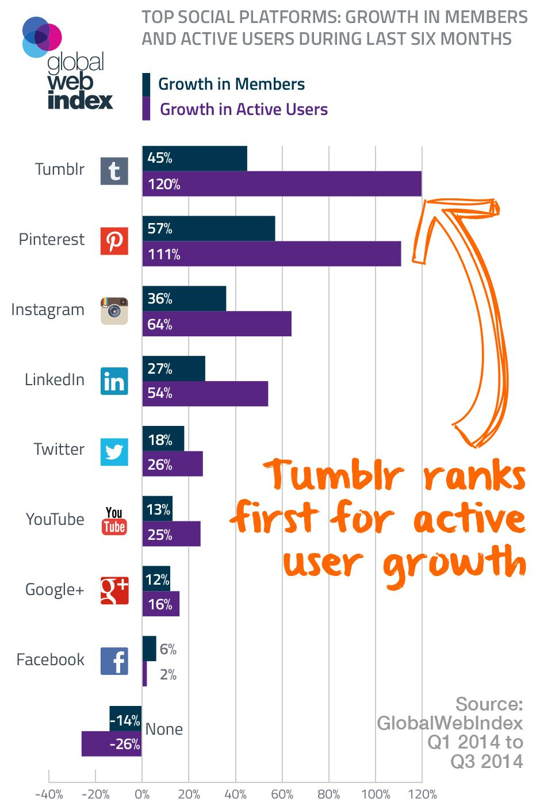
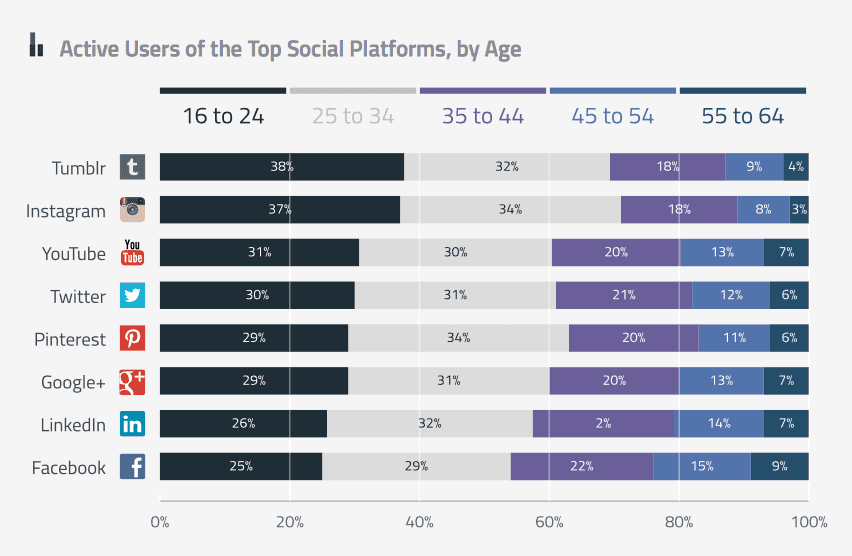

> **Historisch archief.** Deze aflevering verscheen op 27-11-2014 als onderdeel van ReputatieCoaching (2012–2016). De oorspronkelijke tekst is hieronder historisch bewaard. Diensten, contactgegevens, links, tools en adviezen kunnen inmiddels verouderd zijn.



**Transcriptiestatus:** Volledige transcriptie uit het oorspronkelijke archief.

*Historische afbeelding niet beschikbaar: ReputatieCoaching Podcast*
**Laatst vond ik de honderdste podcast een mijlpaal en ook deze aflevering is best een mijlpaaltje. Want met 52 weken in een jaar, betekent dit dat ik nu precies twee jaar de ReputatieCoaching Podcast uitbreng! Zometeen even kort wat statistieken… En eerder deze week meldde ik je dat [www.reputatiecoaching.nl](http://www.reputatiecoaching.nl) nu officieel volgens Google “mobile-friendly” is. Een paar weken geleden heb ik wat adviezen gegeven voor het beter positioneren van een babywinkel in Noord-Holland… De adviezen werpen nu al vruchten af!**

**Vanaf de zomer 2015 kun je gratis een SSL/TLS-certificaat voor je website krijgen. Waar en hoe? Dat vertel ik je zometeen! Verder adviseert Forrester om niets zakelijks meer te doen met Facebook en Twitter en ik sluit de podcast van vandaag af met 14 tips om je mailinglist te laten groeien.**

Hallo en hartelijk welkom bij deze aflevering van de ReputatieCoaching Podcast. Ik ben Eduard de Boer, ReputatieCoach. Dit is dé podcast die jou helpt om meer business te genereren, doordat jouw website beter gevonden wordt, zowel lokaal als landelijk en doordat ik je uitleg hoe je je online reputatie kunt verbeteren. Dit helpt je om je bedrijf en jezelf beter op de online kaart te plaatsen.

De podcast kun je vinden op [www.reputatiecoaching.nl/104](https://www.reputatiecoaching.nl/104/). Daar vind je niet alleen de tekst, maar ook video’s waar ik het in deze uitzending over heb, alsmede afbeeldingen, links enzovoorts. Bovendien is de podcast te beluisteren in [iTunes](https://www.reputatiecoaching.nl/itunes), op [Stitcher](https://www.reputatiecoaching.nl/stitcher) en ook op [TuneIn Radio](http://tunein.com/radio/ReputatieCoaching-Podcast-p655084/). Daar kun je je dus ook abonneren op de wekelijkse podcast. Veel mensen vinden het ideaal om de wekelijkse afleveringen van de podcast op hun gemak te beluisteren, terwijl ze autorijden, fietsen, wandelen of trainen in de sportschool.

## Terugblik podcast 103: de sitelinks search box

[Vorige week](https://www.reputatiecoaching.nl/103/) vertelde ik je dat ik de Sitelinks Search Box in elk geval technisch had gerealiseerd. Dat klopte. Wat echter niet klopte, was de verwachting die ik uitsprak dat het gemiddeld zo’n 48 uur duurt, voordat de search box zichtbaar wordt. Want inmiddels ben ik ruim een week verder en is de search box nog steeds niet zichtbaar in de zoekresultaten, niet voor Allround Fotografie en ook niet voor ReputatieCoaching.nl.

Ik ben eens verder gaan lezen en kwam op Google+ een citaat tegen van Pierre Far, een Google Webmaster Trends Analyst. Hem werd gevraagd of je gegarandeerd de sitelinks search box te zien krijgt, als je alles implementeert, zoals Google dat eist.

Pierre antwoordde met als korte versie voor een antwoord: “Nee”. Maar het ligt iets genuanceerder en intelligenter dan dat.

Hij zegt ook dat veel webmasters een zoekmogelijkheid op hun site implementeren, naarmate de site groeit doordat er meer en meer content wordt gepubliceerd. Dat probeert Google na te bootsen in haar algoritmes. Die kijken dus naar veel signalen, die zowel gerelateerd zijn aan de site en aan de specifieke zoekopdrachten waarvoor de site wordt vertoond. Op basis daarvan wordt bepaald of de search box zichtbaar wordt of niet.

Dit betekent dus dat je de markup moet toevoegen als je een site-specifieke zoekmogelijkheid hebt. Op die manier stel je de zoekmachines in staat om naar de zoekfunctie te wijzen, als er voldoende reden is om die te vertonen.

OK, dus op basis hiervan kan ik me voorstellen dat er sowieso geen search box wordt vertoond voor Allround Fotografie. Want hoewel daar een flink aantal fotoreportages worden vertoond, is de content op zich vrij dun.

Aan de andere kant acht ik de kans dat de search box wordt vertoond voor [www.reputatiecoaching.nl](/) dan ook een stuk groter. Daar heb ik meer dan 200 posts en in totaal meer dan 400.000 woorden. Om je een idee te geven: het aantal woorden in het Oude Testament in de Bijbel bedraagt 592.419. Daarmee vergeleken zit ik dus al over de 80%.

Ik heb voor de site geen Concordantie nodig om alle content te ontsluiten, maar een sitelinks search box zou wel handig zijn…

Laat ik dan nu overgaan op de onderwerpen voor vandaag…

## Twee jaar ReputatieCoaching Podcast


Ik zei het al in de intro: de ReputatieCoaching Podcast bestaat twee jaar. En zojuist vergeleek ik de omvang van de content met die van het Oude Testament. De plugin “[Word Stats](https://wordpress.org/plugins/word-stats/)” vertelde mij, dat ik voor het live gaan van deze 104e podcast in totaal 408.987 woorden heb gepubliceerd op de site.

Ook vertelt de plugin iets over de leesbaarheid van de berichten. Daarvoor worden verschillende algoritmes gebruikt. Het blijkt dat 96% van mijn berichten qua leesbaarheid “intermediate”, ofwel gemiddeld, scoort.

Mijn piekmaand qua tekstproductie is februari 2014, toen heb ik 22.347 woorden gepubliceerd. Op het moment zit ik gemiddeld zo rond de 16.000 woorden per maand.

Het aantal unieke bezoekers neemt ook fors toe. Het groeit nu al maandenlang met gemiddeld 9% per maand. Natuurlijk zou iedereen zijn of haar content het liefst altijd meteen viraal willen zien gaan. Maar dat is gewoon een utopie. Jezelf op de kaart zetten met goede content om zo een groep trouwe lezers op te bouwen kost tijd en energie.

Hetzelfde geldt voor de podcast. Ook daar zie ik een gestage groei, waar ik tevreden over ben.

Ik heb de indruk dat lezers van Nederlandstalige weblogs veel minder de interactie opzoeken met de blogger, dan Engelstalige lezers. Op Engelstalige sites zie je veel meer reacties op blogposts. Ik heb geen idee of dat te maken heeft met onze cultuur of met onze manier van contentconsumptie.

Heb jij een weblog? En heb jij veel interactie met je doelgroep? Wat doe jij om interactie met je doelgroep op je blogartikelen te realiseren? Vertel het onderaan de show notes van deze podcast, op [www.reputatiecoaching.nl/104](https://www.reputatiecoaching.nl/104/).

## [www.reputatiecoaching.nl](http://www.reputatiecoaching.nl) is “mobile-friendly” volgens Google

Vorige week vertelde ik ook over de nieuwe rankingsignalen van Google en dan met name met betrekking tot de mobielvriendelijkheid van je site. Het blijkt dat Google de mobielvriendelijkheid van je site dus gaat meewegen in haar algoritmes die de positie van je webpagina’s in de zoekresultaten bepalen.

[Historische afbeelding: Website is mobile-friendly volgens Google](https://lh4.googleusercontent.com/YS2r8SrkZZzAzkE5b8XO-pQY0o_LUIoGUInlCGh0ytg=w431-h768-no)

[Vorige week](https://www.reputatiecoaching.nl/103/) vertelde ik je ook al dat [www.reputatiecoaching.nl](/) door de “Mobile Friendly Test” van Google kwam. En eerder deze week ben ik eens gaan experimenteren met de instellingen op mijn iPhone. Ik heb de taalinstellingen voor Google gewijzigd in Engels. Daarna ging ik op zoek naar “ReputatieCoach” en zag dat in de Engelstalige resultaten de site ook al daadwerkelijk wordt aangemerkt als “Mobile-friendly”.

Twee dagen geleden heb ik hier een kort artikeltje over gepubliceerd: “[ReputatieCoaching.nl is ‘Mobile-Friendly’ volgens Google!](https://www.reputatiecoaching.nl/reputatiecoaching-mobile-friendly-volgens-google/)”.

## Verschillende vermeldingen van dezelfde site bij dezelfde zoekterm?

Gisteren kreeg ik een vraag van Dennis, de [tandarts uit Culemborg](http://www.tpculemborg.nl/). Hij schreef mij het volgende:

Gaat er hier iets mis? Zie de verschillende tekst onder tpculemborg.nl op de iphone en op de pc/ie9
Zie screenshot.

De tekst hoort toch uniform weergegeven te worden op alle apparaten?

Met vriendelijke groet, Dennis

Mogelijk is het jou ook wel eens opgevallen, dat je met dezelfde zoektermen op verschillende apparaten of zelfs in verschillende browsers op dezelfde computer, verschillende toelichtende teksten ziet onder de URL in de zoekresultaten.

In de prehistorie van de zoekmachines werd daar de META-tag “description” vertoond, maar dat is al lang niet meer het geval.

De tekst die Google bij je paginavermelding vertoont is van veel factoren afhankelijk, waaronder: je zoekgeschiedenis, het feit of je bent ingelogd op Google+ of niet, het apparaat waar je op zoekt, de browser waar je mee zoekt enzovoorts.

Wat je namelijk ook al helemaal niet weet, is waar je zoekopdracht precies wordt uitgevoerd, in welk land, in welk datacenter, in welk cluster van computers en op welke CPU. Ook dat varieert continu. Daarnaast spelen ook continu het zoek- en klikgedrag van andere Internetters, alsmede signalen uit de social media en weet ik wat welke andere factoren een rol.

Dus je moet niet raar opkijken dat je dus verschillende resultaten te zien krijgt voor dezelfde zoektermen op verschillende apparaten.

Dennis, ik hoop dat ik je vraag hiermee voldoende hebt beantwoord.

## Snel resultaat voor een babywinkel in Noord-Holland

Brenda Kok ken je nog wel: ik had haar een tijdje geleden in de podcast, waarin ik haar onder andere interviewde over videomarketing. In het gesprek voorafgaand aan dat interview hebben Brenda en ik gezellig gekletst over lokale SEO. Daarbij werd haar nieuwsgierigheid geprikkeld.

Een goede vriendin van haar heeft namelijk een babywinkel in Noord-Holland en ze helpt haar vriendin af en toe met het beter laten scoren van die babywinkel in de zoekresultaten. Om organisch goed te scoren met een lokale winkel adviseer ik ondernemers zich altijd eerst te focussen op lokale SEO, dus het goed scoren in de lokale zoekresultaten. Want vaak gaat een significante stijging in de lokale resultaten gepaard met een stijging in de organische zoekresultaten.

Zo ook hier. Brenda en ik hebben na het interview af en toe nog overleg over de acties. En ook doe ik soms nog wat onderzoek hier en daar en dan meld ik dat in bestanden die staan in een gedeelde folder op Google Drive. Ook geef ik wel eens concrete adviezen over het aanpassen van een HTML title et cetera.

Het gemakkelijke van die werkwijze vind ik namelijk dat je zelfs tegelijkertijd in documenten en spreadsheets kunt werken en ze ook niet steeds via mail of een ander mechanisme hoeft te delen. Elke wijziging die wordt aangebracht kan zelfs iemand aan de andere kant van de wereld in real-time volgen!

Helaas heb ik geen screenshot van de tijd voordat Brenda met mijn adviezen aan de slag is gegaan. Maar inmiddels staat de babywinkel op de relevante zoektermen al op de “B”-positie in de lokale resultaten en scoort de website zelfs de tweede plaats in de organische resultaten op Google!

Nu zegt een positie natuurlijk niet bijster veel voor een ondernemer. Wat wel een rol speelt is het aantal bezoekers dat op een website komt en natuurlijk wat onder de streep aan omzet en winst wordt gegenereerd. In de korte tijd dat er aan deze site wordt gewerkt ziet de vriendin van Brenda al daadwerkelijk een stijging in webverkeer en omzet. Dus dat is een positief teken!

Hieruit blijkt wederom dat je vaak met een aantal relatief simpele acties een significant resultaat kunt bewerkstelligen. En ja, de winkel staat nu op “B”, maar doel is natuurlijk om die op de “A”-positie te laten landen. Keep you posted!

## Gratis SSL-certificaten van ‘LetsEncrypt’ in 2015

Een tijdje geleden vertelde John Mueller van Google dat het bieden van een beveiligde SSL-verbinding met je site een ranking factor is die meespeelt in het bepalen van de positie in de zoekresultaten. Tegelijkertijd deelde hij ook mee dat het effect ervan minimaal is en waarschijnlijk voor niemand echt zichtbaar.

Maar om op je website HTTPS te bieden heb je een zogenaamd SSL-certificaat nodig. Die kun je zelf uitgeven, maar als je dat doet, dan krijgen bezoekers vaak een waarschuwing dat het geen officieel erkend certificaat is, die is uitgegeven door een officieel erkende instantie. En het nadeel van officiëel erkende SSL-certificaten is dat ze geld kosten. Vaak € 100 of meer per jaar.


Daar komt nu verandering in. Want de EFF (dat staat voor “Electronic Frontier Foundation”) heeft een nieuwe organisatie opgericht, met de naam “[Let’s Encrypt](http://www.letsencrypt.org/)”. In het artikel “[New, Free Certificate Authority to Dramatically Increase Encrypted Internet Traffic](https://www.eff.org/press/releases/new-free-certificate-authority-dramatically-increase-encrypted-internet-traffic)” kun je lezen dat deze nieuwe organisatie vanaf de zomer 2015 gratis certificaten gaat uitgeven voor webservers om beveiligde verbindingen mogelijk te maken.

[Let’s Encrypt](http://www.letsencrypt.org/) wordt gecontroleerd door de ‘Internet Security Research Group’ en werkt samen met onder andere Mozilla, Cisco Systems Inc., Akamai, EFF en andere bedrijven en organisaties.

De basisprincipes van Let’s Encrypt zijn:

```
  * **GRATIS** – Iedereen die een domeinnaam heeft kan gratis een officieel gevalideerd SSL/TLS-certificaat krijgen.
  * **AUTOMATISCH** – Het hele proces moet automatisch en eenvoudig verlopen, tot en met de automatische vernieuwing in de achtergrond.
  * **VEILIG** – Het platform dient voor het implementeren van hedendaagse beveiligingstechnieken en best practices.
  * **TRANSPARANT** – Uitgegeven en ingetrokken certificaten zijn voor iedereen inzichtelijk.
  * **OPEN** – Het geautomatiseerd uitgeven en vernieuwen van certificaten verloopt via open standaarden en zoveel mogelijk van alle code wordt vrijgegeven als open source.
  * **SAMENWERKING** – Evenals de meeste onderliggende protocollen is Let’s Encrypt in het leven geroepen voor de gemeenschap, buiten de invloedssfeer van om het even welke organisatie.
```

Het is dus nog even wachten, maar over een paar maanden kun jij dus ook gratis een officieel certificaat voor je website aanvragen om daarmee alle verkeer van en naar je website te kunnen versleutelen, zodat in principe “niemand” je meer kan afluisteren.

Je kunt het niet zien, maar tijdens het inspreken van deze podcast maakte ik zojuist in de lucht van die aanhalingstekentjes bij het woord “niemand”. Want ik heb natuurlijk geen idee waar organisaties als de NSA en andere veiligheidsorganen allemaal toe in staat zijn. In elk geval wordt het voor bijvoorbeeld mensen in een Internetcafé heel moeilijk om jouw verkeer te onderscheppen en de decoderen.

## Rechtbank in VS: “Google mag met zoekresultaten alles doen”

*Historische afbeelding niet beschikbaar: Logo Google*
Nog steeds zijn er ondernemers bij wie het bedrijfsresultaat geheel afhankelijk is van de toppositie in de zoekresultaten. Zodra resultaten wijzigen stappen met name Amerikaanse bedrijven naar de rechter om bijvoorbeeld Google te beschuldigen van monopolistische praktijken en wat dies meer zij.

Waar we in Europa Google en andere zoekmachines aan banden leggen, is door de rechtbank in San Fransisco uitgesproken, dat Google met de zoekresultaten alles mag doen en ze op elke gewenste manier mag weergeven zoals het haar goeddunkt. Google heeft in de Verenigde Staten ook alle vrijheid van meningsuiting in de zoekresultaten.

Dit was vorige week te lezen in het artikel “[Google has free speech right in search results, court confirms](https://gigaom.com/2014/11/17/google-has-free-speech-right-in-search-results-court-confirms/)” op GigaOM. Vooral in de Verenigde Staten is dit een belangrijke uitspraak. Want bedrijven als Yelp en TripAdvisor beschuldigen Google van het boycotten van hun content in de zoekresultaten.

## Tumblr snelst groeiende sociale mediaplatform


Volgens een [onderzoek van de Global Web Index](http://cdn2.hubspot.net/hub/304927/file-2095457964-pdf/Reports/GWI_Social_Summary_Q3_2014.pdf?submissionGuid=cf9bf5eb-810b-4f4d-8365-94e6db712d6e) (afgekort “GWI”) is Tumblr in de afgelopen zes maanden het snelst groeiende sociale netwerk. Het aantal gebruikers groeide in die periode namelijk met 120%.

Het minst snel groeiende sociale netwerk is… Facebook! Dat is op zich wel logisch, want met meer dan een miljard gebruikers is er niet zo bijster veel ruimte om nog echt hard te groeien.

Pinterest staat op de tweede plaats, met een groei van 57%, gevolgd door Instagram, LinkedIn ,Twitter, YouTube en Google+.

[](https://lh6.googleusercontent.com/-0tcY6taQR4E/VHXaPrAbBuI/AAAAAAAABXw/fJNVEh8xEvo/w939/20141127-top-social-platforms.jpg)

En wat bij Tumblr het snelste groeit, is het aantal video posts. Dat groeit namelijk tweemaal zo hard, als berichten met foto’s. Als jij bezig bent met video, zou je dan ook eens serieus moeten overwegen om je video’s ook op Tumblr te posten, omdat een deel van je doelgroep zich best wel eens op Tumblr zou kunnen bevinden.

Nu ik het over Tumblr heb: heb jij een account op Tumblr? Ben je er actief? Of ben je er veel te vinden als informatieconsument? Vertel het me onderaan de show notes van deze podcast, op [www.reputatiecoaching.nl/104](https://www.reputatiecoaching.nl/104/).

## Tieners vinden Facebook “saai” worden

In het [rapport van GWI](http://cdn2.hubspot.net/hub/304927/file-2095457964-pdf/Reports/GWI_Social_Summary_Q3_2014.pdf?submissionGuid=cf9bf5eb-810b-4f4d-8365-94e6db712d6e) waar ik het zojuist over had kun je ook lezen dat 64% van de internetters in de leeftijd van 16 tot en met 19 in het Verenigd Koninkrijk en de VS steeds minder Facebook gebruiken. De hoofdreden hiervoor is dat ze het “saai” vinden worden en dat het niet meer zo “cool” is, als het in het begin was.

[](https://lh3.googleusercontent.com/-OpERSzue0g4/VHYSqD34PoI/AAAAAAAABYE/Kso6kx5Nvlo/w852-h556-no/20141126-users-social-platforms-by-age.png)

Steeds meer mensen gebruiken Facebook passief; dat wil zeggen dat ze wel de updates lezen, maar minder foto’s posten en elkaar berichten sturen. Deze laatste twee activiteiten zijn zo’n 20% gedaald.

Desalniettemin heeft gemiddeld 80% van de Internetters buiten China een Facebook account en in Latijns Amerika is dit zelfs 93%!

Wat opmerkelijk is, is dat maar liefst 91% van de Internetters in de categorie van 16 tot 64 jaar vorige maand YouTube *of* Facebook *of* Twitter *of* Google+ bezocht. En maar liefst 19% bezocht alle vier de sociale mediaplatformen!

## Forrester: “Marketeers verdoen hun tijd op Facebook en Twitter!”

*Historische afbeelding niet beschikbaar: Bedrijfspagina maken op Facebook*
En we gaan nog even door met de social media. Nate Elliot van onderzoeksbureau Forrester publiceerde vorige week het rapport “[Social Relationship Strategies That Work](https://www.forrester.com/Social+Relationship+Strategies+That+Work/fulltext/-/E-RES113002)”. Het volledige rapport kost US$499, als je het helemaal wilt inzien. Maar je kunt er genoeg informatie *over* vinden op Internet.

De ondertitel van dit rapport is niet voor niets: “How To Succeed In Social As Organic Reach Falls Toward Zero”. Dat zegt genoeg, zeker als je dat combineert met de titels van hoofdstukken, als “Your Social Relationship Strategies Aren’t Working” en “Facebook And Twitter Are No Longer The Center Of The Social Universe”.

Nate Elliot beweert dat bedrijven veel teveel aandacht en budget spenderen aan het creëren van een following op Facebook en Twitter. Dit is nagenoeg zinloos, doordat updates op Facebook meestal minder dan 2% van alle fans bereiken. En dat getal was nota bene van februari 2014. Inmiddels ligt het percentage nog lager en per januari 2015 gaat het zelfs nog verder omlaag.

*Historische afbeelding niet beschikbaar: Twitter*
Dat is het gevolg van de maatregel die Facebook bijna twee weken geleden heeft aangekondigd. Dat kun je lezen in het artikel “[News Feed FYI: Reducing Overly Promotional Page Posts in News Feed](http://newsroom.fb.com/news/2014/11/news-feed-fyi-reducing-overly-promotional-page-posts-in-news-feed/)” op het Facebook blog.

En de betrokkenheid van de fans is extreem laag: op Facebook reageert 0.073% van de fans, terwijl dit op Twitter nog minder is, namelijk: 0.035%!

Als je deze getallen hoort of leest, dan geeft dat meer context aan de uitspraak van Forrester en snap je ook dat jij als ondernemer beter je pijlen kunt richten op andere kanalen dan Facebook en Twitter.

Welke dat zijn? Volgens hetzelfde rapport creëer je veel meer betrokkenheid op platformen als Instagram en Pinterest. Uit cijfers die in het rapport staan, blijkt dat de engagement per volger op Instagram 58 maal hoger ligt dan die op Facebook en zelfs 120x hoger dan die op Twitter.

Een ander advies uit het rapport is om je mailinglist verder uit te bouwen. Want het blijkt dat in de Verenigde Staten volwassenen tweemaal zo snel zich abonneren op een mailinglist, dan dat ze een fan worden van een bedrijf op Facebook. Als je daarbij optelt dat gemiddeld zo’n 90% van je e-mails worden bezorgd bij je abonnees, versus die magere 2% of minder op Facebook, moet de keus voor jou toch makkelijk worden. Dus als je moet kiezen voor een abonnee op je mailinglist of voor een fan op Facebook, kies dan **elke keer** voor een abonnee op je mailinglist!

Op de site van [Wall Street Journal](http://blogs.wsj.com/cmo/2014/11/17/brands-are-wasting-money-on-facebook-and-twitter-forrester-says/) kun je een aantal leuke reacties lezen op deze berichtgeving dat Facebook en Twitter vrijwel zinloos worden voor bedrijven. Ik geef je er een paar:

```
  * “Finally, an organization with a loud enough voice is stating that the emperor is naked.”
  * “I also remember when Forrester said the Internet was just a fad. Sorry not buying.”
  * “Long Live Newspapers! We’re doing great, please buy ads here.”
  * “I could have told them this five years ago for a fraction of the price that they pay for the research firms.”
```

## 14 tips om je mailinglist te laten groeien

*Historische afbeelding niet beschikbaar: Hoe schrijf je een review?*
Als je besluit aan het werk te gaan om je mailinglist verder uit te bouwen, dan heb ik 14 tips voor je, om je daarbij of daarmee te helpen:

```
  1. _Schrijf unieke content_ – anders zullen mensen zich snel uitschrijven. Lever iets unieks en ze zijn bovendien sneller bereid het door te sturen naar collega’s, vrienden of familie.
  2. _Gebruik een cadeautje om mensen om te kopen_ – zoals bijvoorbeeld een e-book of whitepaper. Stuur dit toe, nadat mensen je hun mailadres hebben gegeven.
  3. _Organiseer een webinar_ – om zo abonnees voor je mailinglist te werven.
  4. _Ontwikkel een gratis, online tool_ – om zo mensen zich te laten inschrijven.
  5. _Voeg een QR code toe aan je gedrukte materiaal_ – zodat mensen die kunnen scannen en zich abonneren op je mailinglist.
  6. _Organiseer een online wedstrijd_ – met een leuke hoofdprijs en laat mensen zich inschrijven met hun mailadres.
  7. _Maak een inschrijfpagina op Facebook_ – om op die manier je fans zo snel mogelijk van Facebook te leiden naar je eigen content en website.
  8. _Verzamel adressen op beurzen_ – en andere bijeenkomsten. Importeer die in je mailing software, stuur de mensen een vriendelijke welkomstmail, waarin je ze verzoekt zich te abonneren.
  9. _Moedig je huidige abonnees aan om de mail te verspreiden_ – om zo meer abonnees te krijgen.
  10. _Segmenteer je lijst_ – om abonnees op die manier meer gerichte en relevante content te bieden. Daarmee voorkom je dat ze zich uitschrijven.
  11. _Gebruik een gastblog_ – door in je bio-stukje ook de mogelijkheid te bieden om je te abonneren op je nieuwsbrief.
  12. _Creëer Calls to Action in video’s_ – op YouTube om mensen te motiveren zich in te schrijven.
  13. _Begin je eigen offline evenementen_ – zoals meetups, congressen, hackathons, trainingen om op die manier mailadressen te verzamelen.
  14. _Gebruik een oude lijst om een nieuwe te maken_ – Heb je nog ergens een oude mailinglist liggen, die je al tijden niet meer gebruikt? Start een opt-in campagne naar alle abonnees, waarin je de nieuwe mailinglist promoot en belooft om iedereen die niet binnen een bepaalde periode reageert, uit te schrijven.
```

Ik ben niets roomser dan de paus, trouwens! Ik heb op dit moment ook nog moeite met het onderhouden van mijn mailinglist. Er komen wel nieuwe abonnees bij, maar ik ben me ervan bewust dat hier nog ruimte is om te verbeteren, evenals op zoveel andere fronten. Maar goed, al doende leert men! En helaas gaan er nog maar steeds slechts 24 uur in een dag!

Hoedanook ga ik in elk geval met deze tips aan de slag voor mijn eigen mailinglist! En jij? Heb jij een actieve of inactieve mailinglist? Vertel er eens iets over!

Met deze 14 tips om je mailinglist te laten groeien, kom ik dan weer aan het einde van de podcast van deze week.

Als je de podcast leuk vindt en je wilt nog meer op de hoogte blijven, volg me dan ook op Twitter, via [@reputatiecoach1](https://twitter.com/reputatiecoach1).

Heb je inderdaad wat aan alle informatie die ik met je deel, help mij dan met het verder verbeteren en promoten van deze podcast. Surf daarvoor naar [iTunes](https://www.reputatiecoaching.nl/itunes) of [Stitcher](https://www.reputatiecoaching.nl/stitcher), geef de podcast een sterrenbeoordeling en laat ook je reactie achter. Door de podcast te beoordelen op iTunes en/of Stitcher breng je de podcast onder de aandacht van een breder publiek.

Je kunt me verder helpen, door de podcast aan te bevelen bij vrienden of collega’s, waarvan je denkt dat ze er hun voordeel mee kunnen doen, of door ’m te delen op Twitter, like’n en delen op Facebook of een “+1” te geven op Google+.

En vergeet niet: ik ben hier om je te helpen! Als je een vraag of een probleem hebt met betrekking tot je online reputatie of de vindbaarheid van je website, kun je een mailtje sturen naar [podcast@reputatiecoaching.nl](mailto:podcast@reputatiecoaching.nl).

Als je dat te lastig vindt, of als je de podcast beluistert terwijl je in de auto zit en je hebt acuut een vraag, spreek dan een boodschap in op de ReputatieCoaching Hotline, op nummer: 084 - 883 15 56. Mogelijk behandel ik je vraag of probleem dan in een artikel of in de podcast.

En je kunt ook rechtstreeks op de website een voicemail achterlaten, door op de tab aan de rechterkant van elke pagina te klikken, en je bericht in te spreken. Dit was [ReputatieCoaching Podcast aflevering 104](https://www.reputatiecoaching.nl/104/) en mijn naam is [Eduard de Boer](http://nl.linkedin.com/in/eduarddeboer/nl).

Ik wens je de komende week weer succes met het werken aan je reputatie, zodat je meteen je reputatie voor jou kunt laten werken!

Tot volgende week!

Doei!

Links naar content die in deze podcast aan bod komt:

```
  * [ReputatieCoaching Podcast in iTunes](https://www.reputatiecoaching.nl/itunes)
  * [ReputatieCoaching Podcast op Stitcher](https://www.reputatiecoaching.nl/stitcher)
  * [ReputatieCoaching Podcast op TuneIn Radio](http://tunein.com/radio/ReputatieCoaching-Podcast-p655084/)
  * [ReputatieCoaching Podcast RSS-feed](https://feeds.reputatiecoaching.nl/ReputatieCoachingPodcast)
  * [Word Stats (plugin voor WordPress)](http://www.tpculemborg.nl/)
  * [Let’s Encrypt](http://www.letsencrypt.org/) (GRATIS SSL/TLS certificaten)
  * “[News Feed FYI: Reducing Overly Promotional Page Posts in News Feed](http://newsroom.fb.com/news/2014/11/news-feed-fyi-reducing-overly-promotional-page-posts-in-news-feed/)” (Facebook blog, 14 november 2014)
  * “[Social Relationship Strategies That Work](https://www.forrester.com/Social+Relationship+Strategies+That+Work/fulltext/-/E-RES113002)” (Forrester, 17 november 2014)
  * “[Brands Are Wasting Money on Facebook and Twitter, Forrester Says](http://blogs.wsj.com/cmo/2014/11/17/brands-are-wasting-money-on-facebook-and-twitter-forrester-says/)” (Wall Street Journal, 17 november 2014)
  * “[Forrester Advises Advertisers To Abandon Facebook Because It Is Biased Against Them](http://www.businessinsider.com/forrester-facebook-social-relationship-strategies-that-work-report-2014-11)” (Business Insider, 18 november 2014)
  * “[ReputatieCoaching.nl is “Mobile-Friendly” volgens Google!](https://www.reputatiecoaching.nl/reputatiecoaching-mobile-friendly-volgens-google/)” (ReputatieCoaching, 25 november 2014)
```
