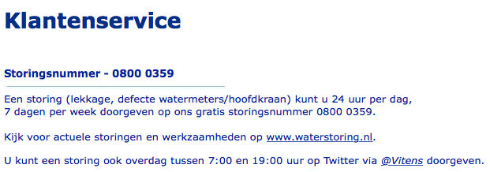
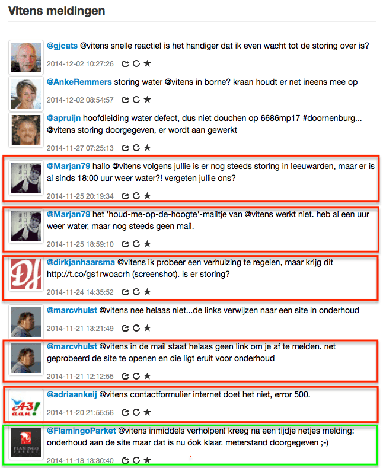
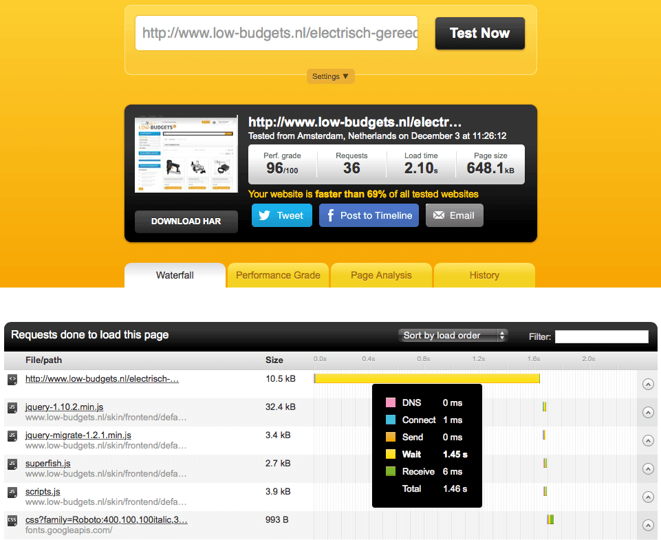
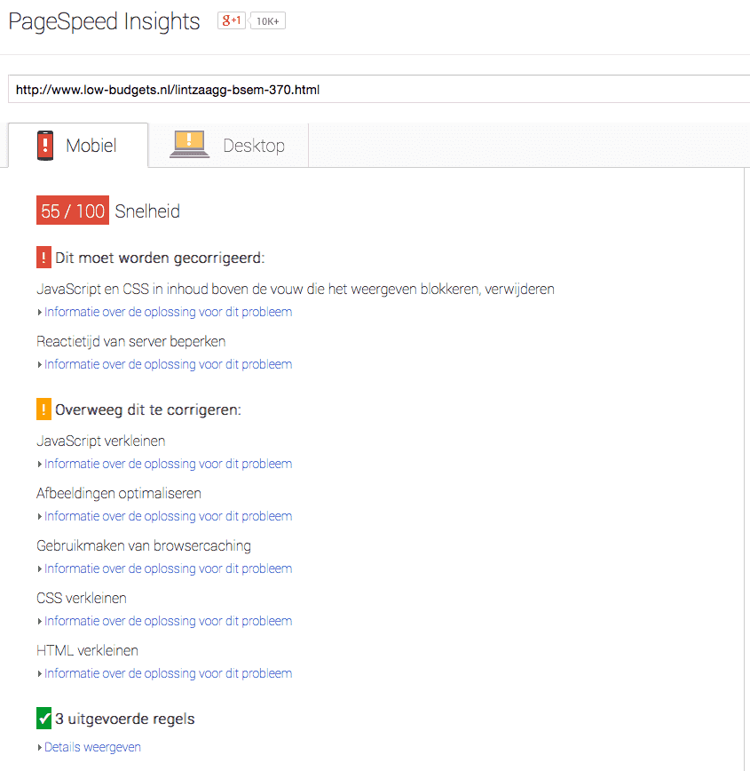
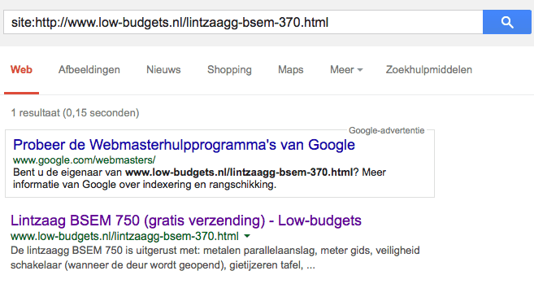

> **Historisch archief.** Deze aflevering verscheen op 4-12-2014 als onderdeel van ReputatieCoaching (2012–2016). De oorspronkelijke tekst is hieronder historisch bewaard. Diensten, contactgegevens, links, tools en adviezen kunnen inmiddels verouderd zijn.

**Transcriptiestatus:** Volledige transcriptie uit het oorspronkelijke archief.

***Historische afbeelding niet beschikbaar: ReputatieCoaching Podcast*
De onderwerpen voor vandaag, de dag voor Sinterklaas. Dus daar begin ik vandaag mee… althans met online business. Afgelopen week ontving ik een voicemail van Jerry over het optimaliseren van een webshop. Daarover zometeen meer. Google heeft haar kwaliteitsrichtlijnen voor Google+ Mijn Bedrijf aangepast. De grote verschillen deel ik straks met je. En hoe scoort jouw site op Bing? Of op DuckDuckGo? Waarom dat belangrijk kan worden, hoor je ook in deze podcast. En als je wilt scoren in Bing, heb ik 10 tips voor je, om je daarbij te helpen.**

Hallo en hartelijk welkom bij deze aflevering van de ReputatieCoaching Podcast. Ik ben Eduard de Boer, ReputatieCoach. Dit is dé podcast die jou helpt om meer business te genereren, doordat jouw website beter gevonden wordt, zowel lokaal als landelijk en doordat ik je uitleg hoe je je online reputatie kunt verbeteren. Dit alles helpt je om je bedrijf en jezelf beter op de online kaart te plaatsen.

De podcast kun je vinden op [www.reputatiecoaching.nl/105](/nl/archief/reputatiecoaching/105/). Daar vind je niet alleen de tekst, maar ook video’s waar ik het in deze uitzending over heb, alsmede afbeeldingen, links enzovoorts. Bovendien is de podcast te beluisteren in [iTunes](https://web.archive.org/web/*/https://www.reputatiecoaching.nl/itunes), op [Stitcher](https://web.archive.org/web/*/https://www.reputatiecoaching.nl/stitcher) en ook op [TuneIn Radio](http://tunein.com/radio/ReputatieCoaching-Podcast-p655084/). Daar kun je je dus ook abonneren op de wekelijkse podcast. Veel mensen vinden het ideaal om de wekelijkse afleveringen van de podcast op hun gemak te beluisteren, terwijl ze autorijden.

## #FAIL voor @Vitens webcare

Voordat ik begin met de onderwerpen voor vandaag, eerst even een #FAIL. Deze week is de #FAIL voor @Vitens. Ik zal je kort uitleggen waarom…

Gisteren hadden we hier opeens geen water meer, als we de kraan opendraaiden. Even zoekend op Google leerde ik het mooie woord “waterstoring”. Vervolgens zocht ik de website van Vitens op, om de waterstoring te melden.

[](https://lh4.googleusercontent.com/-KQnRVkAW_d4/VIAo6gdG5EI/AAAAAAAABYY/D1mxfhYvrrY/w621-h218-no/20141204-vitens-contact.png)

Op hun contactpagina staat dat je storingen via Twitter kunt melden aan @vitens. Dat heb ik dan dus ook gedaan. Mijn eerste tweet was om 14:59 en circa een kwartier daarna heb ik er nog een gestuurd. Tot op heden moet ik nog steeds een reply krijgen. Dat vind ik echt een ondermaatse prestatie van Vitens en dus een #FAIL waard!

In de show notes heb ik een lijstje van recente tweets aan Vitens staan en het blijkt dat mijn ervaring niet uniek was. Bovendien lijkt het erop alsof Vitens niet alleen slecht communiceert via Twitter, maar ook lijken contactformulieren op de site niet te werken:

[](https://lh6.googleusercontent.com/-xkVXv2Fd5dI/VIApadTrqbI/AAAAAAAABYs/gHQ_GyNmYzg/w646-h789-no/20141204-vitens-webcare.png)

Foei, Vitens! Je kunt dan weliswaar waterleverancier zijn voor 5,5 miljoen huishoudens, maar dit kan echt niet!

Laat ik dan nu overgaan op de onderwerpen voor vandaag…

## Stijging online aankopen

Morgen is het Sinterklaas en volgens mij hebben de goedheiligman evenals alle multicolor pieten en hulpklazen dit jaar massaal *online* ingekocht. De verkoopcijfres en statistieken over online versus offline business zullen we de komende dagen wel horen en lezen.

De afgelopen jaren zie je een sterke groei in de online aankopen rond de feestdagen. Als hulpsinterklaas heb ik alle cadeaus voor onze dochter online gekocht, om zo tijd te besparen, doordat ik niet in lange rijen voor kassa’s hoef te wachten. Vanuit mijn bureaustoel heb ik binnen één uur een selectie van de verlanglijstjes online besteld. En volgens de bevestigingsmails wordt alles vandaag bezorgd, inclusief pakpapier. Keurig op tijd, dus. Ik hoef het dan alleen nog maar in te pakken.

Voor mij is het heel simpel: de producten op de verlanglijst waren helder gespecificeerd; er kan eigenlijk geen misverstand over ontstaan. Dus dan hoef ik niet naar de lokale winkel om de objecten in de handen te nemen en daarmee vervolgens naar de kassa te lopen, af te rekenen om zo met afgeladen tassen de auto in een overvolle parkeergarage op te moeten zoeken.

Een deel van de inkopen heb ik gedaan bij Intertoys, omdat één van de verlanglijstjes daarop was afgestemd, inclusief verwijzing naar de bladzijden in het grote speelboek. Dat maakte het voor mij gemakkelijk, want sommige artikelen die niet bij Intertoys verkrijgbaar waren, kon ik zo snel en gemakkelijk bij bol.com bestellen.

Hoe wrang het ook moge zijn voor de detailhandel: ik denk dat er steeds meer online besteld zal worden en dat deze stijging ten koste zal gaan van de lokale speelgoedwinkeliers in dit geval. Maar hetzelfde geldt straks voor Kerstmis en de Kerstinkopen. Ook daar zal de lokale detailhandel een knauw voelen, vrees ik.

Hoe zit het met jou? Of als je een lokale winkelier bent: heb jij dit jaar iets gemerkt van een daling van verkopen in je winkel? En voor alle hulpklazen en hulppieten: heb jij inkopen gedaan bij lokale winkels, of ook al meer online? Wat was daarvoor je beweegreden? Daar ben ik heel benieuwd naar. Geef eens je reactie onderaan de transcriptie van deze podcast, op [www.reputatiecoaching.nl/105](/nl/archief/reputatiecoaching/105/).

## Online promotie van een webshop

Eerder deze week ontving ik een vraag van Jerry. Hij sprak het volgende in op de ReputatieCoaching voicemail:

Ik luister met veel aandacht naar je podcasts en ik vraag me af of het interessant en leuk is om een keer een artikel te wijden aan webshops.

Ik heb de afleveringen gehoord over tandartsen en restaurants en daar kun je gericht op adverteren, laat ik maar zeggen, om je vindbaarheid groter te maken.

Maar wat als je meerdere artikelen hebt, bijvoorbeeld een webshop met 200 artikelen.

Ik zou het wel interessant vinden om eens te horen wat daar de mogelijkheden voor zijn.

Misschien vind je het leuk om daar eens wat aandacht aan te besteden.

Alvast bedankt!

Nou Jerry, leuk dat je contact opneemt. Inderdaad, een webshop is heel anders dan een restaurant, tandartspraktijk of kapper en wat dies meer zij. Want met een webshop krijg je alleen bestellingen online, die je dan moet versturen naar de koper; je klanten komen niet naar een lokale vestiging.

Om te beginnen heb ik natuurlijk eens gekeken naar je website, een mooie en overzichtelijke website, kan ik wel zeggen. Maar wat mij als eerste opviel, was de lange laadtijd van de pagina’s. Het was dat je mij had benaderd om eens wat tips te geven, anders was ik al naar een volgende site gegaan in de hoop daar te kunnen vinden, waar ik naar op zoek was.

Ik begon namelijk je site te bekijken, terwijl ik ’s avonds op de bank zat. En toen had ik alleen mijn iPhone in de buurt. Mijn indruk op mobiel was dat het heel lang leek te duren, voor er maar iets gebeurde als ik van pagina naar pagina ging.

Ik heb op de desktop met de [Pingdom Website Speed Test](http://www.pingdom.com/tools) eens getest hoelang het duurde om sommige pagina’s te laden en ik kwam meestal tussen de 2 en 5 seconden uit:

[](https://lh6.googleusercontent.com/-hxTIP5v444U/VIAp151PbYI/AAAAAAAABY8/wznqNDvJPBw/w961-h785-no/20141204-pingdom-low-budgets.png)

In de show notes heb ik een screenshot opgenomen, waarin ik meet hoelang het duurt om de pagina voor “electrisch gereedschap” te laden. Zoals je kunt zien duurt dat 2,1 seconde, dat is nog acceptabel. Maar wat daaronder opvalt is de lange wachttijd voordat de data wordt ontvangen! Je ziet dat het 1,45 seconde duurt, tot jouw webserver begint met het versturen van gegevens, nadat de URL is opgevraagd. Dat is extreem lang, vind ik. Die bijna anderhalve seconde zit iemand naar zijn of haar scherm te staren, terwijl er niets lijkt te gebeuren. Moet je je voorstellen: als je die kunt reduceren tot 200 milliseconden, dan worden je pagina’s opeens binnen een seconde geladen en vertoond!

Waar precies die vertraging in zit, is niet 1–2–3 te zeggen. Mijn gevoel zegt dat het de onderliggende database is, die de bottleneck is. Daar zou ik als eerste gaan zoeken. Verder kan het tijdelijk cachen van content ook een substantiële versnelling opleveren.

De laadtijd is in elk geval een belangrijke factor voor de gebruikerservaring, evenals natuurlijk de mobielvriendelijkheid. Die is bij jouw site bijna goed. Het enige minpuntje vind ik, dat de afbeeldingen verkeerd schalen: die worden op mijn iPhone horizontaal teveel verkleind en niet in proportie met de verticale verkleining.

Wat ik ook eens heb gedaan, is testen wat Google vindt van de snelheid van je site, zowel op desktops, als op mobiele apparaten. De resultaten daarvan vind je terug in de show notes:

[](https://lh3.googleusercontent.com/-SufMcNdc1WM/VIAqUscYcUI/AAAAAAAABZM/w8P3Ab9Sdhk/w845-h868-no/20141204-pagespeed-desktop-low-budgets-lintzaag.png)

Op de desktop geeft Google Pagespeed jouw site op snelheid 69 punten van de 100. Dat is laag. Je moet zien dat je de adviezen van Google opvolgt, om toch echt boven de 85 te komen, als je je wilt onderscheiden van collega’s, denk ik.

[](https://lh5.googleusercontent.com/-xxJgMB-8FcQ/VIAq12I5LFI/AAAAAAAABZY/MAZmNEd8ohM/w845-h868-no/20141204-pagespeed-mobiel-low-budgets-lintzaag.png)

Ook vindt Google de snelheid van mobiel te traag: die staat met 55 van de 100 punten zelfs in het rood. Daar moet je dus echt aan werken! Google zegt verder dat de reactietijd van je server 2,4 seconden is, wat ik hiervoor ook al constateerde. Als je doorklikt op de Pagespeed tool, dan kun je lezen dat deze trage reactietijd kan komen door tientallen verschillende factoren, waarbij je kunt denken aan:

```
  * langzame app-logica
  * langzame databasequery’s
  * langzame routering
  * frameworks
  * bibliotheken
  * CPU-gebrek voor resources
  * onvoldoende geheugen
  * etc.
```

Nu terug naar je vraag, want jij wilt weten hoe je nu jouw producten beter vindbaar kunt maken, dan die van andere webshops. Dat is en blijft een lastige klus. Want waarschijnlijk is elke webshop-eigenaar daar op uit en dus daarmee bezig.

Laat ik eens een paar zaken langslopen, waar je optimalisatie kunt behalen:

```
  * **Foto URL’s** – Deze bevatten alleen maar hexadecimale strings, dus je mist daarmee een kans om bijvoorbeeld je lintzaagafbeelding ook hoog te kunnen laten scoren op trefwoord “lintzaag” in Google afbeeldingen.
  * **Product URL’s** - Die heb je wel aardig goed, maar ik zie bijvoorbeeld spelfouten, zoals “lintzaagg” met dubbel “g” in de URL. Dan bevat de URL een andere type aanduiding, dan dat er op de productpagina staat. Op de pagina staat de “BSEM 750”, terwijl in de URL “BSEM–370” wordt vermeld. Als nu mensen zoeken op de BSEM 370, dan kan het zijn dat jouw pagina over de 750 wordt vertoond, hetgeen niet de gewenste lintzaag kan zijn voor de bezoeker.
  * **Typefouten** – Dezelfde typefout (“lintzaagg” met dubbel “g”) heb je ook op de pagina en in de META description.
  * **“description”-tag** – Je “description” META-tag nodigt niet echt uit tot doorklikken, is mijn mening. Je probeert die vol te stouwen met alle features van de lintzaag. Eigenlijk is dit gewoon gekopieerde tekst die elders ook op de pagina staat. Als je de lintzaag vermelding in Google controleert, zie je wat ik bedoel. Ik heb hiervan ook een screenshot opgenomen in de show notes:
```

[](https://lh4.googleusercontent.com/-U_G5SpkMD4Y/VIArmtZuykI/AAAAAAAABZs/ukKHcOlXon0/w657-h349-no/20141204-serp-low-budgets-lintzaag.png)

```
  * **“keywords”-tag** – Ondanks dat de “keywords” META-tag niet meer wordt gebruikt, heb jij ’m gevuld met spam. Ik zie trefwoorden als “laagste prijsgarantie”, “kortingen”, “lets make things cheaper” enzovoorts. Die hele regel zou ik gewoon weghalen.
```

[](https://lh6.googleusercontent.com/-Z0gOEri5EqQ/VIAsHHS10jI/AAAAAAAABaA/9xuSVFbtiqQ/w646-h159-no/20141204-keywords-low-budgets-lintzaag.png)

Feitelijk zijn al deze maatregelen goed webmasterschap. Laten we nu eens kijken hoe je je zou kunnen onderscheiden van andere sites, waar bijvoorbeeld dezelfde lintzaag wordt aangeboden. Ik heb er een aantal bekeken en ik zag dat ze allemaal vrijwel dezelfde tekst hebben, namelijk alle technische specificaties.

Nu ontkom je er niet aan om die te noemen, maar het is de kunst om een beter pakkende omschrijving bij elk product te plaatsen, waarin je over het product of artikel schrijft.

Verder zou je video’s bij elk product kunnen plaatsen, die je host op YouTube. Dan kun je denken aan:

```
  * Unboxing video’s, dat zijn dus video’s waarin het product wordt uitgepakt
  * HOW-TO video’s waarin wordt uitgelegd hoe je het product gebruikt
  * Review-video’s, waarin mensen vertellen hoe tevreden ze zijn over het product
  * Promotievideo, waarin je het product aanprijst met alle features en mogelijkheden
```

Wist je trouwens dat de links naar je social media niet werken? Ik zie als URL alleen het hekje (“#”).

Over social media gesproken: je zou ook foto’s van je producten met links naar de productpagina op je website kunnen pinnen op Pinterest. Want als ik daar bijvoorbeeld zoek op lintzaag, vind ik maar een stuk of 16 pins. Daar liggen dus kansen. Kansen die overigens andere webshops al wel mondjesmaat benutten… Want zoek op Pinterest maar eens naar “accuboormachine”, dan zie je wat ik bedoel.

Als je dan toch bezig bent met foto’s, ga dan ook op Instagram je producten promoten met mooie foto’s. En gebruik eventueel ook Facebook om je producten onder de aandacht te brengen.

Zoals ik altijd zeg: ga content produceren over je producten. Breng die content onder de aandacht van je potentiële publiek.

Tja en tenslotte voor de lokale vindbaarheid, zou ik toch ook een zakelijke Google+ Mijn Bedrijf pagina maken, waar je foto’s van je producten uploadt. Ook zou ik je producten promoten op Google+. Want vergeet niet, dat die content op Google+ vaak heel goed scoort in de zoekresultaten!

Tot zover mijn adviezen in een notendop. Jerry, ik hoop dat je er iets aan hebt. Mocht je meer advies of concrete hulp willen, neem dan gerust contact op.

## Google past richtlijnen Google+ Mijn Bedrijf aan

20 februari van dit jaar meldde Google dat je in de bedrijfsnaam van een vermelding op Google+ Mijn Bedrijf toevoegingen mocht doen, binnen bepaalde voorwaarden. Vanaf deze week is dat weer helemaal teruggedraaid. Het enige wat er mag staan in de zakelijke bedrijfsvermelding op Google+ is de bedrijfsnaam. Punt! Niets meer dus!

Naast dat je geen toevoegingen meer mag hebben in de bedrijfsnaam zijn er nog meer wijzigingen:

```
  * Je moet altijd de specifieke categorie kiezen en niet de algemene vader-categorie. Dus bijvoorbeeld “kindertandarts” en niet “tandarts”.
  * Meer consistentie in categorie en bedrijfsnaam in geval van bedrijven met meerdere vestigingen
  * Twee of meer merken op dezelfde locatie moeten één naam kiezen
  * Als verschillnde bedrijfsonderdelen elk hun eigen Google+ pagina hebben, moeten ze verschillende categorieën gebruiken.
  * In geval van gezamenlijke praktijken met meerdere locaties en meerdere specialisten, dan moet iedereen zijn eigen naam gebruiken en niet de naam van de praktijk.
  * Virtuele kantoren zijn niet toegestaan, tenzij ze bemenst zijn tijdens kantooruren.
```

Tja, zoals je ziet worden ook de richtlijnen voor lokale bedrijfsvermeldingen steeds verder aangescherpt. Gelukkig wordt hiermee de kans op misbruik ook verder verkleind. Dat kan ook voor veel ondernemers weer een verademing betekenen, omdat ze dan mogelijk hoger in de lokale resultaten kunnen scoren.

Ik heb het overigens nagekeken en de Nederlandse kwaliteitsrichtlijnen zijn nog niet bijgewerkt, analoog aan de Engelstalige.

## Google indexeert “verborgen” content niet meer

Er zijn nog steeds sites die bepaalde content pas vertonen, als een gebruiker bijvoorbeeld naar beneden of naar rechts scrollt, als die op een “Lees meer” link klikt of naar een ander tabblad gaat. Dat zijn sites die de komende tijd mogelijk lager kunnen gaan scoren in Google.

Dat komt doordat Google webcontent die initieel wordt verborgen tijdens het “onLoad” event in de browser, niet meer indexeert. Als een pagina als gevolg hiervan dus weinig content bevat, neemt voor Google de relevantie van die pagina af en kan die dus lager gaan scoren.

De reden die John Mueller van Google hiervoor geeft, is dat als je initieel tekst verbergt, Google dit niet als de meest relevante content beschouwt. Ik laat je eventjes het stukje horen, waarin John er op in gaat…

Dus: maak je content zo min mogelijk verborgen en laat in elk geval je meest relevante content direct zien bij het laden van je pagina’s.

## Europees parlement wil Google opsplitsen

Vorige week vertelde ik je dat Google in de VS juist een rechtzaak heeft gewonnen, waarbij is uitgesproken dat Google zo’n beetje alles kan en mag doen met haar zoekresultaten. Dat was een forse overwinning.

Aan de andere kant wordt Google in Europa impliciet gedwongen om het bedrijf dusdanig op te splitsen, dat de zoekmachine los wordt gemaakt van de overige Google diensten. Dit is vorige week besloten in het Europese parlement, niet alleen voor Google, maar ook voor andere zoekmachinegiganten.

In een artikel op Computable stond onder andere het volgende te lezen:

Hoewel het Europees Parlement geen opsplitsing bij Google kan afdwingen, heeft het via de Europese Commissie wel de mogelijkheid om nieuwe wetgeving in te voeren die mogelijk invloed heeft op de werkzaamheden en rechten van de zoekgigant.

Deze actie heeft niet alleen in Europa, maar vooral in de Venigde Staten gezorgd voor veel rumoer. Hoe dit alles verder verloopt, moeten we nog zien. Ik houd een vinger aan de pols!

## Hoe scoort jouw site in Bing? En in DuckDuckGo?

Dat was over Google en ik weet bijna zeker dat alle luisteraars het meest geïnteresseerd zijn om te weten, hoe zij hoger kunnen scoren in Google. Sites als Bing en DuckDuckGo interesseren ze niet. En hoe zit jij daarin? Kijk jij wel eens hoe jouw site scoort in Bing? Nee? Dan zou ik dat toch maar eens gaan doen!

Ik hoor je denken: “Hoezo moet ik mij verdiepen in hoe ik rank op Bing? Daar komt toch vrijwel geen enkele bezoeker vandaan?”. Dat klopt… Inderdaad… Nog wel!

Let op… Ik zeg bewust: “Nog wel!”. Want inderdaad komt meer dan 90% van al het zoekverkeer van Google. Echter, per 2015 loopt er een contract tussen Google en Apple af. Apple verdiende de afgelopen jaren namelijk zo’n slordige 1 miljard dollar aan Google, doordat het Google als standaard zoekmachine in Safari aanbood. Daardoor maakt 45% van de mobiele markt wereldwijd gebruik van Google als standaard zoekmachine vanaf alle iOS apparaten, zoals iPhones, iPads en iPods.

Maar als dat contract afloopt, kunnen zaken wel eens veranderen. Dan zou het zomaar kunnen zijn dat Apple verder gaat met Bing… Of met DuckDuckGo… Ook gaan er geruchten dan Apple zelf een zoekmachine aan het optuigen is. Wat het ook moge worden: het kan dus geen kwaad om eens te controleren, of jouw site ook goed te vinden is op Bing en DuckDuckGo.

## Yahoo ziet grote stijging zoekverkeer als gevolg van “standaard” instelling in Firefox

Apple is niet de enige organisatie die banden heeft met bepaalde zoekmachines die aan veranderingen onderhevig kunnen zijn. Vorige maand nog werd bekendgemaakt dat Firefox in de Verenigde Staten niet meer standaard Google instelt als zoekmachine, maar Yahoo!

Deze instelling is operationeel sinds Firefox 34, de meest recente versie die onlangs uitkwam. Hoewel Firefox 34 nog niet wijd verbreid is, krijgt Yahoo! al driemaal meer zoekverkeer door Firefox 34, dan door versie 33.

Volgens StatCounter is het zoekaandeel van Yahoo! in slechts twee weken gestegen van 9,6% naar maar liefst 29,4%! Daarentegen is het gebruik van Google in Firefox 34 gedaald van net iets meer dan 82% naar zo’n 63,5%! Dat is een forse daling!

[[Historische afbeelding: StatCounter Yahoo! growth thanks to Firefox 34!](https://lh5.googleusercontent.com/-JczWTDlW3BM/VIAsiuxUC_I/AAAAAAAABaQ/rv-TypDpNu8/w800-h494-no/20141204-StatCounter-Yahoo-Bing-Google.png)](https://lh5.googleusercontent.com/-JczWTDlW3BM/VIAsiuxUC_I/AAAAAAAABaQ/rv-TypDpNu8/w800-h494-no/20141204-StatCounter-Yahoo-Bing-Google.png)

Nog steeds blijft Google ook in de USA oppermachtig, maar er wordt overduidelijk wel aan haar virtuele stoelpoten gezaagd…

Dus, nog even terugkomend op de mogelijke verandering van de standaard zoekmachine in Safari op mobiele apparaten van Apple… Hmmm… Gezien de penetratie van iOS-devices kan dat muisje ook nog wel eens een staartje krijgen… Ik ben heel benieuwd!

## Optimaliseer je site voor Bing

Stel nu eens dat Apple voor Safari op iOS niet meer kiest voor Google, als standaard zoekmachine… En omdat Firefox al Yahoo! gebruikt neem ik aan dat Apple daar ook niet voor zal kiezen. Dit is mede ingegeven door het feit dat Yahoo! in lang niet zoveel landen operationeel is.

Dan blijven er feitelijk nog twee zoekmachines over: Bing en DuckDuckGo. Dat is ook de reden dat ik zopas vroeg of je wel eens kijkt hoe je site op die twee zoekmachines scoort.

Hoewel DuckDuckGo sinds een tijdje wel als mogelijkheid is ingebouwd in Safari, staat die nog wel onderaan het rijtje. Ik heb geen idee of dat ook de visie van Apple op het belang weergeeft. Het kan ook een onderbewuste misleiding zijn, dat weet je nooit.

Maar stel nu eens dat Apple kiest voor Bing, in plaats van Google, als standaard zoekmachine in Safari op mobiele apparaten: waar moet je dan zoal rekening mee houden, om je site te laten scoren in Bing?

Tja, originele, unieke, relevante en interessante content spreekt natuurlijk voor zich! Ook Bing is heel goed geworden in het detecteren van webspam. Nee, wat zijn factoren die helpen bij het ranken van jouw site in Bing? Ik noem je er een aantal.

```
  1. **Leeftijd van de domeinnaam** – Waar Google vaak voorkeur heeft voor nieuwe en populaire sites, lijkt Bing meer waarde te hechten aan de leeftijd van de domeinnaam. Dus als je begint met een nieuwe site, zou het interessant kunnen zijn om een oudere domeinnaam te kopen. Daarnaast lijken .edu en .gov sites ook sneller hoger te kunnen scoren in Bing.
  2. **Zorg dat je site wordt geïndexeerd** – Dus [zend je site in bij Bing](http://www.bing.com/toolbox/submit-site-url) en begin met wachten. Helaas actualiseert Bing haar index niet zo vaak als Google, dus je moet geduld betrachten.
  3. **Juiste technische vereisten** – Er zijn zes gebieden waar Bing zich voornamelijk op richt bij het scoren van je site in de zoekresultaten:

    * _Laadtijd van de pagina_ – Hoe sneller, des te beter!
    * _robots.txt_ – Zorg dat robots.txt leesbaar is voor Bing.
    * _Sitemap_ – Onderhoud je sitemap met alle URL’s van je site en houd de sitemap actueel. Verwijder irrelevante URL’s.
    * _Site technologie_ – Gebruik van sommige media op je site kan voorkomen dat Bing je pagina’s goed kan crawlen. Dus ondersteun ook altijd een soort van degradatiescenario.
    * _Redirects_ – Als je content tussen websites verplaatst, ziet Bing graag dat je de ‘301 permanent redirect’ gebruikt.
    * _Canonical tags_ – Als meerdere URL’s dezelfde content bevatten, helpt het “rel=canonical” element om Bing uit te laten zoeken wat de originele content is. Logischerwijs moet je dit niet gebruiken als je content tussen sites verhuist.


  4. **Title tags zijn cruciaal** – Bing lijkt veel meer nadruk te leggen op title tags, dan Google. Dus moet je relevante zoektermen voor je site in meerdere titels in je site gebruiken. Vermijd dus algemene titels, als “Home” en “Over ons”.
  5. **Gebruik simpele keywords** – Want Bing lijkt het niet zo goed te doen als Google, als het gaat om zogenaamde brede zoektermen. Dus gebruik ook meer synoniemen. Gebruik je keywords ook in correct geformuleerde H1 en H2 tags, de title tag en de META-description.
  6. **Verzamel links** – Het is nog steeds legitiem om links naar je site te verzamelen, alleen niet meer dankzij blackhat technieken. Bing lijkt de meeste waarde te hechten aan backlinks, maar minder aan andere factoren, zoals “NO FOLLOW” links etc. Maar nogmaals: houd het legaal!
  7. **Content is King!** – Daar begon ik ook al mee. Ook Bing wil, evenals Google, content van hoge kwaliteit. Bing adviseert bovendien dat je niet teveel advertenties op je site plaatst, noch een groot aantal affiliate links. Bovendien moet je site gemakkelijk door te klikken zijn, rijk aan content, interessant zijn voor de bezoeker en hem de informatie bieden, waar hij naar op zoek is.
  8. **Wees sociaal** – Waar Google niet altijd even helder en consistent is in haar beweringen over de waarde van social signals, is Bing dat wel. Bing zegt duidelijk: “Sociale media spelen vandaag de dag een belangrijke rol om een site goed te laten ranken in de zoekresultaten”.
  9. **Gebruik van Flash** – Google is nooit echt gecharmeerd geweest van Flash, maar het lijkt Bing niet echt uit te maken, als een site Flash gebruikt. Als je gebruik maakt van Flash, wordt geadviseerd om aparte sitemaps te maken voor je Flash media, omdat Bing haar uiterste best doet om die te indexeren.
  10. **Acteer lokaal** – Waar Google haar Google+ Mijn Bedrijf heeft voor lokale zoekresultaten, lijkt Bing voorrang te geven aan sites met een sterke lokale bedrijfsvermelding. Helaas kunnen Nederlandse bedrijven zich nog niet aanmelden bij Bing Local. Maar onthoud dit!
```

Want op dit moment is Bing Local alleen nog maar actief in de volgende landen:

```
  * Verenigde Staten
  * Australië
  * Oostenrijk
  * Brazilië
  * Canada
  * China
  * Duitsland
  * Hong Kong
  * India
  * Italië
  * Mexico
  * Spanje
  * Zwitserland
  * Taiwan
  * Verenigd Koninkrijk
```

Gezien de aanwezigheid van andere Europese landen, verwacht ik dat het ook niet zo lang zal duren, tot Nederland aan dit rijtje wordt toegevoegd.

Oh ja, nog een paar tips, wat je beslist niet moet doen op Bing. De meeste ken je natuurlijk al, maar ik wil het voor de volledigheid toch nog even duidelijk maken, waar Bing beslist een hekel aan heeft:

```
  * **Cloacking** – Dat is een andere website laten zien aan de gebruiker, dan dat je een Bing toont.
  * **Link schema’s** – Bing wil, net als Google, kwalitatief goede links.
  * **Social media schema’s** – Vermijd ook het illegaal beïnvloeden van sociale signalen naar jouw content. Bing wil dat je een echte autoriteit bent.
  * **Meta refresh redirect** – Gebruik daarvoor in de plaats een 301 redirect.
  * **Dubbele content** – Als je op je site veel content biedt, die elders ook wordt vertoond, dan verliest Bing mogelijk het vertrouwen in je site en kun je uit de zoekresultaten verdwijnen.
  * **Keyword stuffing** – Dit is al zo oud als de weg naar Rome… Dat doet toch niemand meer? Want dat is iets wat elke zoekmachine al jaren verbiedt in haar kwaliteitsrichtlijnen!
```

Nu ik zoveeel heb verteld over Bing en je mogelijke kansen… Heb je op basis hiervan al eens gekeken hoe jouw site scoort op Bing? Verschilt het erg met Google en DuckDuckGo? Vertel het me, onderaan de show notes van deze podcast, op [www.reputatiecoaching.nl/105](/nl/archief/reputatiecoaching/105/). Ik ben benieuwd naar je bevindingen!

Met deze “koffiedikkijkerij” over de toekomstige standaard zoekmachine in 45% van alle mobiele apparaten in de wereld, kom ik aan het einde van deze podcast.

Als je de podcast leuk vindt en je wilt nog meer op de hoogte blijven, volg me dan ook op Twitter, via [@reputatiecoach1](https://twitter.com/reputatiecoach1).

Heb je inderdaad wat aan alle informatie die ik met je deel, help mij dan met het verder verbeteren en promoten van deze podcast. Surf daarvoor naar [iTunes](https://web.archive.org/web/*/https://www.reputatiecoaching.nl/itunes) of [Stitcher](https://web.archive.org/web/*/https://www.reputatiecoaching.nl/stitcher), geef de podcast een sterrenbeoordeling en laat ook je reactie achter. Door de podcast te beoordelen op iTunes en/of Stitcher breng je de podcast onder de aandacht van een breder publiek.

Je kunt me verder helpen, door de podcast aan te bevelen bij vrienden of collega’s, waarvan je denkt dat ze er hun voordeel mee kunnen doen, of door ’m te delen op Twitter, like’n en delen op Facebook of een “+1” te geven op Google+.

En vergeet niet: ik ben hier om je te helpen! Als je een vraag of een probleem hebt met betrekking tot je online reputatie of de vindbaarheid van je website, kun je een mailtje sturen naar [podcast@reputatiecoaching.nl](mailto:podcast@reputatiecoaching.nl).

Als je dat te lastig vindt, of als je de podcast beluistert terwijl je in de auto zit en je hebt acuut een vraag, spreek dan een boodschap in op de ReputatieCoaching Hotline, op nummer: 084 - 883 15 56. Mogelijk behandel ik je vraag of probleem dan in een artikel of in de podcast.

En je kunt ook rechtstreeks op de website een voicemail achterlaten, net als Jerry afgelopen week deed met zijn vraag over de optimalisatie van een webshop. Wil jij ook een voicemail inspreken, klik dan op de tab aan de rechterkant van elke pagina en spreek je bericht in.

Dit was [ReputatieCoaching Podcast aflevering 105](/nl/archief/reputatiecoaching/105/) en mijn naam is [Eduard de Boer](http://nl.linkedin.com/in/eduarddeboer/nl).

Ik wens je de komende week weer succes met het werken aan je reputatie, zodat je meteen je reputatie voor jou kunt laten werken!

Tot volgende week!

Doei!

Links naar content die in deze podcast aan bod komt:

```
  * [ReputatieCoaching Podcast in iTunes](https://web.archive.org/web/*/https://www.reputatiecoaching.nl/itunes)
  * [ReputatieCoaching Podcast op Stitcher](https://web.archive.org/web/*/https://www.reputatiecoaching.nl/stitcher)
  * [ReputatieCoaching Podcast op TuneIn Radio](http://tunein.com/radio/ReputatieCoaching-Podcast-p655084/)
  * [ReputatieCoaching Podcast RSS-feed](https://web.archive.org/web/*/https://www.reputatiecoaching.nl/ReputatieCoachingPodcast)
  * “[Yahoo Replaces Google As Default Search Provider in Firefox](http://searchengineland.com/yahoo-becomes-default-search-engine-firefox-browser-209267)” (Search Engine Land, 19 november 2014)
  * “[Europees Parlement wil Google opsplitsen](http://www.computable.nl/artikel/nieuws/overheid/5202376/1277202/europees-parlement-wil-google-opsplitsen.html)” (Computable, 28 november 2014)
  * “[Yahoo Sees Big Search Bump From Firefox “Default” Relationship](http://searchengineland.com/yahoo-becomes-default-search-engine-firefox-browser-209267)” (Search Engine Land, 3 december 2014)
```
