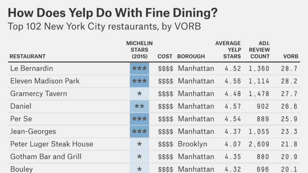

> **Historisch archief.** Deze aflevering verscheen op 11-12-2014 als onderdeel van ReputatieCoaching (2012–2016). De oorspronkelijke tekst is hieronder historisch bewaard. Diensten, contactgegevens, links, tools en adviezen kunnen inmiddels verouderd zijn.



**Transcriptiestatus:** Volledige transcriptie uit het oorspronkelijke archief.

***Historische afbeelding niet beschikbaar: ReputatieCoaching Podcast*
Gisteravond presenteerde ik deel 1 van een een serie van twee webinars met als titel “Internetmarketing voor Fotografen”. Daar begin ik zometeen mee. Maar dat is tegelijkertijd ook de reden dat deze podcast iets later uit is gekomen, dan dat je gewend bent. Door enorme drukte had ik eerder deze week ook niet de gelegenheid om al veel voor te bereiden voor deze podcast, omdat ik druk was met het webinar.**

**Maar goed, ook podcast 106 is dus weer uit! Ik heb vandaag aardig wat nieuws voor je, over Google. Om te beginnen: Google vermeld nu daadwerkelijk óók in de Nederlandstalige zoekresultaten op mobiele apparaten of een site geschikt is voor een mobiel apparaat! Dat zal webmasters van wie de site nog niet geschikt is voor mobiel flink hoofdpijn bezorgen. Zo meer daarover!**

**Ook worden Penguin updates nu doorlopend doorgevoerd. En Google is op zoek naar nieuwe zogenaamde Top Contributors. Ik vertel je zometeen wat dat zijn en wat ik daarmee te maken heb. En dan iets luchtigs: Yelp is net zo betrouwbaar als Michelin, met haar sterrenbeoordeling. Oh ja, Google News stopt trouwens in Spanje, als gevolg van veranderde wet- en regelgeving.**

Hallo en hartelijk welkom bij deze aflevering van de ReputatieCoaching Podcast. Ik ben Eduard de Boer, ReputatieCoach. Dit is dé podcast die jou helpt om meer business te genereren, doordat jouw website beter gevonden wordt, zowel lokaal als landelijk en doordat ik je uitleg hoe je je online reputatie kunt verbeteren. Dit alles helpt jou om jouw bedrijf en jezelf beter op de online kaart te plaatsen.

De podcast kun je vinden op [www.reputatiecoaching.nl/106](https://www.reputatiecoaching.nl/106/). Daar vind je niet alleen de tekst, maar ook video’s waar ik het in deze uitzending over heb, alsmede afbeeldingen, links enzovoorts. Bovendien is de podcast te beluisteren in [iTunes](https://www.reputatiecoaching.nl/itunes), op [Stitcher](https://www.reputatiecoaching.nl/stitcher) en ook op [TuneIn Radio](http://tunein.com/radio/ReputatieCoaching-Podcast-p655084/). Daar kun je je dus ook abonneren op de wekelijkse podcast. Veel mensen vinden het ideaal om de wekelijkse afleveringen van de podcast op hun gemak te beluisteren, terwijl ze autorijden, hardlopen, fietsen of trainen in de sportschool.

## Terugblik op podcast 105

Herinner je je Jerry nog, die in [podcast 105](https://www.reputatiecoaching.nl/105/) vroeg hoe je een webshop kon optimaliseren? Hij heeft afgelopen week ook geluisterd naar mijn tips en heeft er meteen een aantal ter harte genomen en de spreekwoordelijke koe bij de horens gevat.

Ik ontving vorige week vrijdag al meteen het mailtje, waarin Jerry onder andere schreef:

Je hebt er deze avond voor gezorgd dat ik een uur lang met een rode kop door Arnhem heb gereden… :-)
Ik heb naast de webshop Low-Budgets.nl een fulltime job als buschauffeur en luister altijd naar jouw podcasts.
Ik was op de radio, jeuhhhh.

Leuk dat je mijn verzoek hebt ingewilligd.
Buiten het feit dat er een hoop nog niet in orde is met de webshop toch bedankt voor de bruikbare tips.
Nu is het zo dat ik het finetune’n nooit echt belangrijk heb gevonden, maar ik moet daar toch na een paar jaar op terugkomen.

Zeker nu er steeds meer webshops bij komen.
Ik heb er dan ook niet veel kaas van gegeten en heb eigenlijk alles in en rondom de shop zelf gedaan mede om de prijs laag te houden, om zo toch met de grote jongens mee te kunnen doen als je begrijpt wat ik bedoel.
Maar dat heeft dus ook zijn nadelen, zoals je in de podcast hebt omschreven.
Om een lang verhaal kort te maken, want ik moet weer wat passagiers ophalen en wegbrengen…
Heb je zin/tijd/interesse om mij te helpen de spreekwoordelijke puntjes op de ‘i’ te zetten?

Tot zover een stuk uit de mail van Jerry. Naar aanleiding van mijn beperkte analyse heeft hij wel meteen de volgende zaken op orde gebracht:

```
  * Google+ Mijn Bedrijf zakelijke pagina aangemaakt
  * Pinterest account gemaakt
  * De keywords META-tag verwijderd
```

Hij beseft ook dat je tegenwoordig er niet meer onderuit komt, om je website te voorzien van goede, relevante, unieke en interessante content die mensen graag lezen, beluisteren of bekijken.

Jerry, ik ben op dit moment druk met een aantal activiteiten en mijn agenda zit tot het eind van het jaar zo goed als vol. Ik heb wel een leuk idee, maar dat wil ik eerst tegen jou aanhouden. Stuur me een mailtje, wanneer we dit liefst op korte termijn kunnen bespreken. Meld gelijk ook een paar momenten dat jij kunt, want volgens mij heb jij onregelmatiger werktijden dan ik.

Hopelijk kunnen we vanaf begin 2015 een start maken met het optimaliseren van je site en je content.

Laat ik dan nu overgaan op de onderwerpen voor vandaag…

## Webinar “Internetmarketing voor Fotografen (deel 1)”

Ik heb je al eens verteld dat ik in oktober heb gefotografeerd voor de stichting “Against Cancer”. Tijdens die vier dagen in Duitsland heb ik een andere fotograaf leren kennen, te weten Martin Stevens uit Rotterdam. Hij vond het zo interessant wat ik allemaal kon vertellen over scoren in de zoekmachines op verschillende manieren, het belang van citations en reviews en ga maar door.

Daarom vroeg hij mij recentelijk om hem en een paar van zijn companen uit het Westen eens iets meer hierover te vertellen. Dat hebben we gepland en gisteravond vond het eerste webinar plaats. In iets meer dan 42 minuten heb ik verteld over verschillende vormen van vindbaarheid.

Deze webinar ging voornamelijk over het “Wat?”, het “Waarom?” en “Waar?”. Het “Hoe?”-deel heb ik er nog bewust buiten gelaten, omdat ik eerst een gemeenschappelijke basis voor de kennis wilde creëren. Want als die er niet is, heeft volgens mij alle overige informatie en kennisdeling weinig zin.

Ik had in eerste instante gepland om volgende week dan in te gaan op het “Hoe?”. Maar gaande het eerste webinar bekroop mij al het gevoel dat er nog wel eens wat meer webinars in combinatie met actielijsten, flowcharts en instructievideo’s nodig zijn om de materie uit te leggen en deze fotografen maximaal te positioneren voor online succes.

Dit webinar over “Internetmarketing voor Fotografen” was voor mij het eerste live webinar voor een groep onbekenden en dat vond ik wel enigszins spannend. Grappig genoeg verdween mijn spanning op het moment dat ik op de knop drukte om live te gaan. Toen kwam ik op mijn praatstoel en kon ik dus over mijn passie vertellen.

Na afloop kreeg ik veel positieve feedback van de mensen die het webinar hadden bijgewoond. En niet alleen bij hen smaakte het naar meer omdat ze de materie interessant vonden, ook ik vond het zo leuk dat ik heb besloten veel meer webinars te gaan organiseren. Die zal ik dan wel iets langer vooraf aankondigen, zodat meer mensen de webinars tijdig in hun agenda’s kunnen plannen.

Om je een idee te geven van het webinar, heb ik de opname die automatisch is gemaakt op YouTube, opgenomen in de show notes, op [www.reputatiecoaching.nl/106](https://www.reputatiecoaching.nl/106/):

## Fundament van je succes op Internet

In het webinar vertelde ik een stuk over het fundament van je succes op Internet. Dat bestaat uit vier onderdelen:

```
  1. Content / Content Marketing
  2. Vindbaarheid
  3. Reputatie
  4. Conversie
```

In de podcast heb ik een stukje hierover uit het webinar opgenomen. Let op dat de geluidskwaliteit even iets slechter wordt, omdat ik de audio uit de videoopname van de Google+ Hangout heb gehaald.

Het zal jou ook wel duidelijk zijn dat ik het “Hoe?” van deze vier onderdelen echt niet volgende week in een uurtje of zo kan uitleggen. Dus er zullen nog meer webinars volgen. Actieve participatie aan de webinars is alleen op basis van uitnodiging. Wel wordt elke webinar tegelijkertijd uitgezonden op Google+ en op YouTube, dus je kunt gewoon met een wijntje of biertje in de hand, lekker onderuit gezakt op de bank meeluisteren en er je voordeel mee doen.

Elk webinar blijft na afloop 24 uur online staan op YouTube om nog eens te bekijken. Daarna neem ik de content –in elk geval voorlopig– offline.

Ik kan me goed voorstellen dat jij ook dolgraag wil dat ik bepaalde onderwerpen behandel met screenshots, en andere voorbeelden. Dus: heb jij bepaalde onderwerpen, waarvan je graag wil dat ik er eens in een webinar op in ga, laat het me dan weten. Dan ga ik kijken wat ik ten aanzien van jouw verzoek kan realiseren.

## Google zegt: “Voor mobiel” … of niet…

[[Historische afbeelding: bekijk bron](https://lh3.googleusercontent.com/8n3J2HEFMF6t2Lm0ovxSKq6_DVqhR_2zvQAF2n2Iuapa=w587-h1042-no)](https://lh3.googleusercontent.com/8n3J2HEFMF6t2Lm0ovxSKq6_DVqhR_2zvQAF2n2Iuapa=w587-h1042-no)Een paar weken geleden meldde ik je het al: Google begon in de Engelstalige zoekresultaten op mobiele apparaten duidelijk te maken of een bepaalde webpagina wèl geschikt was voor het mobiele apparaat, of dat het níet specifiek geschikt was voor mobiele apparaten, zoals een smartphone of iPod en dergelijke.

Waar het voorheen vaak maanden duurde, voordat Google bepaalde veranderingen in de Engelstalige sites ook toonde in andere talen, duurt het nu maar een paar weken. Want eerder deze week is voor het eerst de tekst “*Voor mobiel*” gespot in de Nederlandstalige mobiele zoekresultaten.

In de transcriptie van deze podcast op [www.reputatiecoaching.nl/106](https://www.reputatiecoaching.nl/106/) heb ik een screenshot van mijn iPhone opgenomen, die je te zien krijgt als je zoekt op “reputatiecoaching”. Daarbij is duidelijk te zien dat de omschrijving bij het zoekresultaat wordt voorafgegaan door de grijze tekst “Voor mobiel”.

Vanaf nu vrees ik echt dat een groot aantal webmasters van wie de site nog niet mobielvriendelijk is, het verkeer naar hun site aanzienlijk zullen zien dalen. Dat komt doordat zo’n 54% van alle zoekpogingen wordt gedaan vanaf een mobiel apparaat. En nu zullen Internetters sneller een site aanklikken die wel geschikt is voor mobiele apparaten, dan sites die er niet speciaal voor zijn gemaakt.

Als je als ondernemer al dat verkeer kwijtraakt? Ouch! Dat kan pijn doen in je portemonnee! Ik ben benieuwd of het de soort genadeslag wordt die ik denk dat het kan betekenen, of niet.

Maar wanneer jouw site nog niet mobielvriendelijk is en je wilt dat je bedrijf blijft voortbestaan, is het nú het moment om je site geschikt te maken voor mobiele apparaten. Nou, eerlijk gezegd ben je te laat! Als jouw site nu –met de Kerstdagen voor de deur– nog niet mobielvriendelijk is en je had hoge verwachtingen van je online business, dan adviseer ik je om je verwachtingen maar iets te temperen… Met zo’n 54%…

Een klein lichtpuntje … Dat hoop ik althans… Google heeft gezegd dat het op dit moment websites die wel geschikt zijn voor mobiele apparaten niet hoger laat scoren dan vergelijkbare sites die nog niet mobielvriendelijk zijn.

Dus de mobielvriendelijkheid wordt volgens Google nog niet meegenomen als ranking factor. Ergens in september was dit namelijk te lezen op Internet. Echter, inmiddels heeft Zineb Ait Bahajji van Google deze uitspraak iets genuanceerd… In een Google Webmaster Help thread schrijft hij dat Google responsive websites niet hoger laat scoren, dan andere mobiele sites. Hiermee ontkent hij dus *niet*, dat mobielvriendelijkheid van sites al in het algoritme wordt meegenomen.

Mijn gevoel is dat het er al wel inzit, maar dat de waarde ervan nog niet erg hoog is ingesteld, evenals dat voorbeeld van HTTPS, waar ik het een paar weken geleden over had. Maar ik verwacht wel, dat de kans groot is dat in de nabije toekomst de weging van deze rankingfactor wordt verhoogd.

## Doorlopende Google Penguin updates

Er heerste al een tijdje veel onrust in de diverse SEO-gerelateerde online discussiegroepen, als gevolg van de veranderingen die veel webmasters bespeurden in de zoekresultaten. Ze zagen veel fluctuaties en met de feestdagen voor de deur werden de meesten daar niet vrolijk van.

Eerst werd gedacht dat dit een soort van naijl-effect was van Penguin 3.0, die een aantal weken geleden live ging. In het verleden waren er maar heel zelden updates. Maar Google heeft bekendgemaakt dat zij tegenwoordig continu kleine veranderingen of updates doorvoert, om zo de zoekresultaten steeds verder te verbeteren.

Dus in het verleden bepaalde Google een groot deel van de ranking eerst offline, waarna de resultaten online werden gepushed. Maar de algoritmische veranderingen die nu plaatsvinden, worden dus op direct in de online omgeving doorgevoerd.

Dit kan in je voordeel werken, maar ook in je nadeel. Want je site kan dus opeens hogerop komen, of plotsklaps verzinken in het moeras van resultaten vanaf pagina 5 en verder… Een uithoek die de meeste Internetters niet eens willen of durven te bezoeken…

## Google zoekt nieuwe Top Contributors

[Historische afbeelding: Google Top Contributors](https://lh4.googleusercontent.com/-4KYJEGcT3kk/AAAAAAAAAAI/AAAAAAAAAA4/nXC0fArPDb0/w200/photo.jpg)
Google zoekt nieuwe zogenaamde Top Contributors. Dat zijn mensen met veel kennis van een bepaald product van Google, die actief participeren in de productforums of -fora en daarmee andere gebruikers helpen. Dit neemt Google veel werk uit handen. In de show notes heb ik een video van Google opgenomen, waarin precies wordt uitgelegd wat Top Contributors zijn:

Ik heb mij gedurende zo’n 30 minuten met mijn Chromebook tijdelijk afgezonderd om de eerste (algemene) Google Hangout erover bij te wonen. Eerder deze week heb ik vanuit mijn interesse voor Google Maps de Maps-specifieke Hangout bijgewoond en ook de Hangout over Google+ Hangouts.

Graag zou ik ook willen participeren in het Google Search productforum om daar mogelijk een Top Contributor te worden, maar helaas heb ik door alle drukte dat webinar gemist.

Het valt überhaupt nog te bezien of ik zoveel tijd ervoor kan vrijmaken om actief in die twee fora deel te nemen, maar ik ga mijn best doen. In een ander Google forum, dat weliswaar afgesloten is, ben ik al wel een Top Contributor. Dat is het forum dat gaat over “Google Maps Business View”.

## Yelp sterren net zo betrouwbaar als die van Michelin

Er wordt altijd heel bijzonder gedaan over Michelin sterren. Maar wist je dat de Yelp sterren net zo betrouwbaar zijn als de veel prestigieuzere Michelin sterren? In New York althans. Dat las ik in een leuk artikel op Lifehacker, met als titel “[Yelp Is Just as Good As Michelin at Rating Expensive Restaurants](https://lifehacker.com/yelp-is-just-as-good-as-michelin-at-rating-expensive-re-1656048652)”.

[](https://lh4.googleusercontent.com/-RC69ENIp0qI/VIn_rs_Ah4I/AAAAAAAABao/BHiWlMHpWXI/w636-h358-no/20141211-Yelp-Michelin-stars.png)

De scores komen aardig overeen, althans voor de duurdere restaurants. Lees ook eens het artikel, dat hieraan ten grondslag ligt. Dat is al iets ouder: het stamt van 2 oktober dit jaar. De titel van dat artikel is “[Yelp And Michelin Have The Same Taste In New York Restaurants](http://fivethirtyeight.com/features/yelp-and-michelin-have-the-same-taste-in-new-york-restaurants/)”.

## Google News stopt in Spanje

Oh, voordat ik aan het einde kom van deze podcast nog even terug naar Google… Dit nieuwtje is heet van de naald: ik las het zojuist en het is eerder vandaag gepubliceerd.

In Spanje is namelijk een nieuwe regelgeving van kracht gegaan. Die bepaalt dat uitgevers en nieuwsdiensten geld moeten vragen voor diensten als Google Nieuws. En omdat Google niet wil betalen, trekt Google op 16 december de stekker uit news.google.es, de Spaanse nieuwsdienst.

Dit was afgelopen week te lezen op [Emerce](http://www.emerce.nl/nieuws/google-stopt-nieuwszoekmachine-spanje).

En met dit nieuwtje over Google News kom ik dan weer aan het einde van de podcast van vandaag. Het is een iets kortere podcast dan je normaal van me gewend bent, maar ik verwacht dat er de komende paar weken als gevolg van de feestdagen niet zoveel nieuws zal zijn. Dus ik wil graag nog het één en ander voor je bewaren voor de laatste paar podcasts van dit jaar. Mocht er wel veel nieuws verschijnen, dan ga ik daar natuurlijk weer in grasduinen om jou bij te praten. Maar voor vandaag houd ik het dus even hierbij.

Als je de podcast leuk vindt en je wilt nog meer op de hoogte blijven, volg me dan ook op Twitter, via [@reputatiecoach1](https://twitter.com/reputatiecoach1).

Heb je inderdaad wat aan alle informatie die ik met je deel, help mij dan met het verder verbeteren en promoten van deze podcast. Surf daarvoor naar [iTunes](https://www.reputatiecoaching.nl/itunes) of [Stitcher](https://www.reputatiecoaching.nl/stitcher), geef de podcast een sterrenbeoordeling en laat ook je reactie achter. Door de podcast te beoordelen op iTunes en/of Stitcher breng je de podcast onder de aandacht van een breder publiek.

Je kunt me verder helpen, door de podcast aan te bevelen bij vrienden of collega’s, waarvan je denkt dat ze er hun voordeel mee kunnen doen, of door ’m te delen op Twitter, like’n en delen op Facebook of een “+1” te geven op Google+.

En vergeet niet: ik ben hier om je te helpen! Als je een vraag of een probleem hebt met betrekking tot je online reputatie of de vindbaarheid van je website, kun je een mailtje sturen naar [podcast@reputatiecoaching.nl](mailto:podcast@reputatiecoaching.nl).

Als je dat te lastig vindt, of als je de podcast beluistert terwijl je in de auto zit en je hebt acuut een vraag, spreek dan een boodschap in op de ReputatieCoaching Hotline, op nummer: 084 - 883 15 56. Mogelijk behandel ik je vraag of probleem dan in een artikel of in de podcast.

En je kunt ook rechtstreeks op de website een voicemail achterlaten, door op de tab aan de rechterkant van elke pagina te klikken, en je bericht in te spreken. Dit was [ReputatieCoaching Podcast aflevering 106](https://www.reputatiecoaching.nl/106/) en mijn naam is [Eduard de Boer](http://nl.linkedin.com/in/eduarddeboer/nl).

Ik wens je de komende week weer succes met het werken aan je reputatie, zodat je meteen je reputatie voor jou kunt laten werken!

Tot volgende week!

Doei!

Links naar content die in deze podcast aan bod komt:

```
  * [ReputatieCoaching Podcast in iTunes](https://www.reputatiecoaching.nl/itunes)
  * [ReputatieCoaching Podcast op Stitcher](https://www.reputatiecoaching.nl/stitcher)
  * [ReputatieCoaching Podcast op TuneIn Radio](http://tunein.com/radio/ReputatieCoaching-Podcast-p655084/)
  * [ReputatieCoaching Podcast RSS-feed](https://feeds.reputatiecoaching.nl/ReputatieCoachingPodcast)
  * “[Yelp And Michelin Have The Same Taste In New York Restaurants](http://fivethirtyeight.com/features/yelp-and-michelin-have-the-same-taste-in-new-york-restaurants/)” (FiveThirtyEight, 2 oktober 2014)
  * “[Yelp Is Just as Good As Michelin at Rating Expensive Restaurants](https://lifehacker.com/yelp-is-just-as-good-as-michelin-at-rating-expensive-re-1656048652)” (Lifehacker, 7 november 2014)
  * “[Google stopt met nieuwszoekmachine in Spanje](http://www.emerce.nl/nieuws/google-stopt-nieuwszoekmachine-spanje)” (Emerce, 11 december 2014)
```
