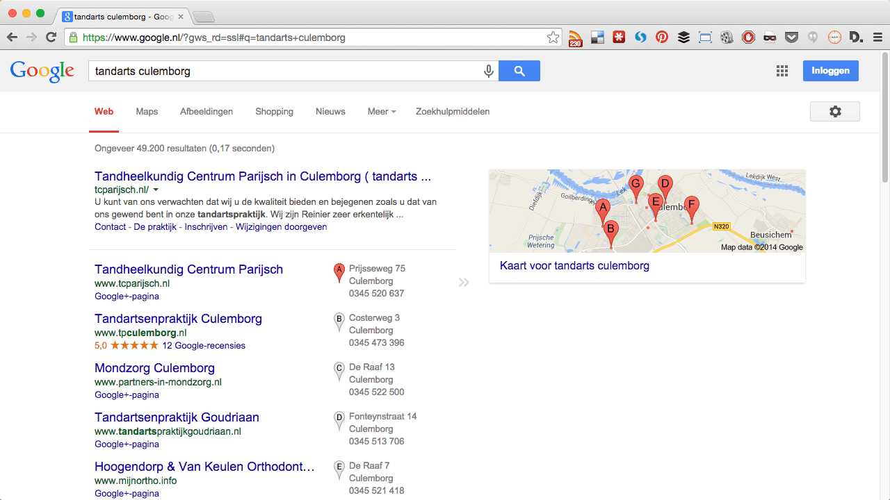
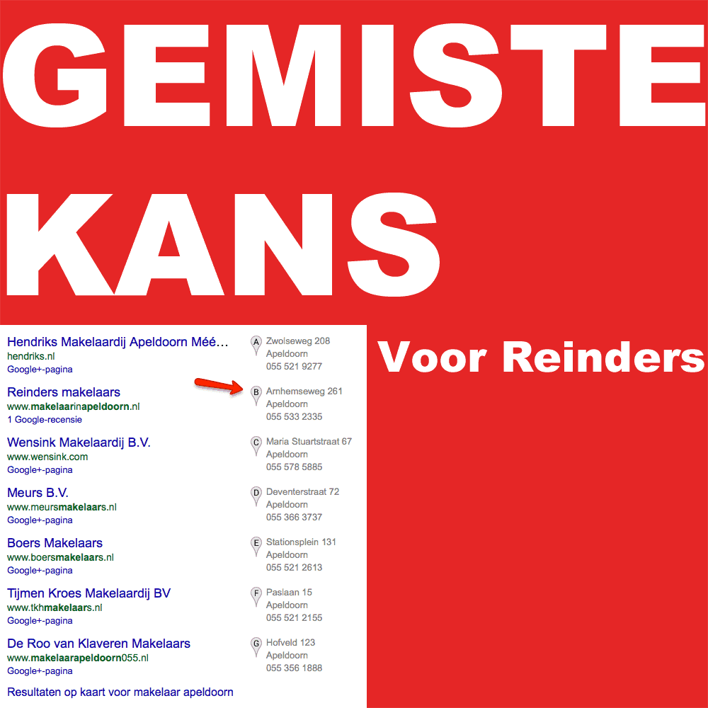
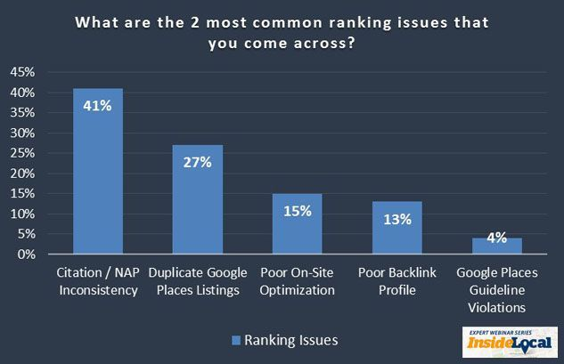
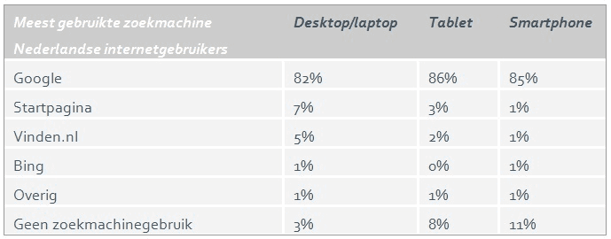

> **Historisch archief.** Deze aflevering verscheen op 27-12-2014 als onderdeel van ReputatieCoaching (2012–2016). De oorspronkelijke tekst is hieronder historisch bewaard. Diensten, contactgegevens, links, tools en adviezen kunnen inmiddels verouderd zijn.



**Transcriptiestatus:** Volledige transcriptie uit het oorspronkelijke archief.

***Historische afbeelding niet beschikbaar: ReputatieCoaching Podcast*
Ik weet dat belofte schuld maakt en ik had vorige week toegezegd dat ik op 1e Kerstdag toch een podcast zou uitbrengen. Helaas is dat door alle drukte toch niet gelukt. Bovendien kreeg ik van diverse kanten te horen dat tijdens Kerstmis waarschijnlijk toch niemand zou gaan luisteren. Dus breng ik nu op 3e Kerstdag alsnog de podcast uit. Excuses voor deze vertraging!**

**Ik begin deze podcast met je een kadootje te geven. AdBlock is een zegening voor Internetters, maar een nachtmerrie voor uitgevers; daarover zo meer. Afgelopen dinsdag was alweer webinar 3 van de serie “Internetmarketing voor Fotografen”. In deze webinar ben ik verder ingegaan op citations, daar vertel ik je zometeen het één en ander over en ik vertel je hoe je snel een groot aantal bestemmingen voor citations kunt verzamelen. Vlak voor Kerstmis had ik ook een interessant gesprek met Paul Hottinga, van de Review Media Company, waar ik je graag iets meer over vertel. Ook vertel ik je hoe Makelaar Jeroen Reinders in Apeldoorn social media inzet voor zijn activiteiten, en wat de nummer 1 oorzaak is van slechte rankings in de lokale zoekresultaten. Als laatste heb ik de resultaten voor je van het “Nationale Search Engine Monitor onderzoek”.**

Hallo en hartelijk welkom bij deze aflevering van de ReputatieCoaching Podcast. Ik ben Eduard de Boer, ReputatieCoach. Dit is dé podcast die jou helpt om meer business te genereren, doordat jouw website beter gevonden wordt, zowel lokaal als landelijk en doordat ik je uitleg hoe je je online reputatie kunt verbeteren. Dit alles helpt je om je bedrijf en jezelf beter op de online kaart te plaatsen.

De podcast kun je vinden op [www.reputatiecoaching.nl/108](https://web.archive.org/web/20150312095217/http://www.reputatiecoaching.nl/108/). Daar vind je niet alleen de tekst, maar ook video’s waar ik het in deze uitzending over heb, alsmede afbeeldingen, links enzovoorts. Bovendien is de podcast te beluisteren in iTunes, op Stitcher en ook op [TuneIn Radio](http://tunein.com/radio/ReputatieCoaching-Podcast-p655084/). Daar kun je je dus ook abonneren op de wekelijkse podcast. Veel mensen vinden het ideaal om de wekelijkse afleveringen van de podcast op hun gemak te beluisteren, terwijl ze wandelen, fietsen, trainen in de sportschool of autorijden.

Laat ik dan nu overgaan op de onderwerpen voor vandaag…

## Kerstcadeau: podcast 1 t/m 100 te downloaden

*Historische afbeelding niet beschikbaar: 100e podcast*
Bij Kerstmis horen cadeaus en dus kan ik niet achterblijven. Ik heb ook een cadeau voor je. Zoals je weet zit ik inmiddels over de 100 podcasts. Als je gaat kijken naar de eerste 100 podcasts, is dat bij elkaar zo’n 1,8 Gigabyte. Als je die allemaal stuk voor stuk wilt downloaden, dan ben je een flinke tijd bezig.

Daarom heb ik het een stuk gemakkelijker voor je gemaakt. Eerder deze week heb ik een mail gestuurd naar alle abonnees van mijn onregelmatig uitkomende Nieuwsbrief, met daarin een link waarmee je in één keer de podcasts 1 tot en met 100 kunt downloaden.

Als je wilt kun je bijvoorbeeld die verzameling podcasts op een USB-stick zetten, zodat je ze gemakkelijk op je autoradio kunt afluisteren, vermits die een USB-aansluiting heeft. Of je kunt ze allemaal op je computer of tablet zetten, om ze daarop af te luisteren. Enfin, bepaal zelf maar, hoe en waar je ze wilt beluisteren, want dat is nu net de charme van podcasts.

Schrijf je nu alsnog in op de website voor de ReputatieCoaching mailinglist en ontvang binnen 15 minuten na je inschrijving een mail met daarin de link om de eerste honderd ReputatieCoaching podcasts in één klap te downloaden!

Wellicht ten overvloede, maar ik heb minstens net zo’n hekel aan spam en andere ongewenste e-mail als jij, dus ik beloof je geen spam te zullen sturen!

## AdBlock nachtmerrie voor uitgevers

Steeds meer gebruikers installeren plugins en extensies die advertenties blokkeren. Dat surft vaak een stuk rustiger, omdat je veel minder reclame ziet en bovendien laden webpagina’s vaak veel sneller, omdat al die MB’s aan zinloze ballast niet wordt opgehaald.

Zelf werk ik het meeste met Chrome en ik heb in Chrome maar liefst twee extensies geïnstalleerd. Hierdoor worden niet alleen de meeste popups tegengehouden, maar ook de meeste advertenties. Zo hoef ik nu ook nooit meer te wachten in YouTube, als ik een video wil kijken. Voorheen werd altijd de tekst getoond dat ik over een aantal seconden pas verder kon, maar nu zie ik die melding nooit meer en kan ik altijd meteen beginnen met het kijken van video’s.

In de show notes heb ik twee screenshots: de eerste is van Safari op MacOS X, waarin ik dus geen AdBlocker of iets dergelijks heb draaien en de tweede is van Chrome, waarin ik twee extensies actief heb, te weten:

```
  * [AdBlock](https://chrome.google.com/webstore/detail/adblock/gighmmpiobklfepjocnamgkkbiglidom?hl=nl)
  * [Disconnect](https://chrome.google.com/webstore/detail/disconnect/jeoacafpbcihiomhlakheieifhpjdfeo)
```

### Safari (zonder AdBlock / Disconnect-achtige plugins)

[[Historische afbeelding: Safari zonder advertentieblocker](https://lh3.googleusercontent.com/M27H7clDV6rX0tr5XXjfl0Br3yyFY80HMrZ0Rv7FRiM=w1040-h640-no)](https://lh3.googleusercontent.com/M27H7clDV6rX0tr5XXjfl0Br3yyFY80HMrZ0Rv7FRiM=w1040-h640-no)

### Chrome (met AdBlock en Disconnect extensie)

[](https://lh5.googleusercontent.com/-ND9RoPpgu2M/VJ8HVSle17I/AAAAAAAABjY/qxO_sdFObj8/w1040-h585-no/20141227-Chrome-AdBlock.png)

Je ziet meteen het verschil! Waar het Safari-venster bol staat met AdWords advertenties, zie je in het screenshot van Chrome geen enkele advertentie. Zoals ik al zei: al deze inhoud van advertenties hoeft niet te worden opgehaald en naast dat je dus advertentievrij surft, gaat het ook nog eens een stuk sneller!

Een bijkomend voordeel is dat jouw surfactiviteiten meteen veel minder traceerbaar zijn, omdat deze extensies ook de trackingcodes onderscheppen. Heb niet de illusie dat je meteen anoniem surft, maar dergelijke tooltjes installeren draagt wel bij tot het minder achterlaten van een broodkruimelspoor door Internet, van welke sites jij allemaal hebt bezocht!

De keerzijde van deze extensies is de inkomstenderving voor adverteerders. Want als steeds meer mensen advertentieblockers installeren, worden er steeds minder advertenties vertoond, klikken mensen steeds minder op advertenties (simpelweg omdat ze ze niet zien) en dus hebben adverteerders minder omzet.

Nou ja, laten we eerlijk zijn: vaak zie je een overdosis aan advertenties en popus op websites, dus iets minder is prima! Je moet voor jezelf besluiten wat jij belangrijker vindt: dat de adverteerders hun geld kunnen blijven verdienen, of dat jij:

```
  1. Sneller surft
  2. Minder goed te traceren bent op Internet
  3. Minder advertenties ziet
  4. Sneller bijvoorbeeld YouTube video’s kunt bekijken, doordat je niet meer hoeft te wachten tot de reclame voorbij is.
```

De keus is aan jou. Doe hier je voordeel mee. Vertel me eens? Waar gaat jouw voorkeur naar uit? Laat het weten onderaan de show notes, op [www.reputatiecoaching.nl/108](https://web.archive.org/web/20150312095217/http://www.reputatiecoaching.nl/108/).

## Webinar “Internetmarketing voor Fotografen (deel 3)” : Citations

In het webinar “Internetmarketing voor Fotografen (deel 3)” heb ik afgelopen week verteld over citations. Ik heb daarin laten zien hoe je citations kunt vinden met de gratis extensie “[N.A.P. Hunter Lite](https://chrome.google.com/webstore/detail/nap-hunter/ligeiippheclogiddffemogcgpjmieao)” voor Chrome en ook hoe je met de “[Local Citation Finder](http://whitespark.z1e.nl)” van het Canadese bedrijf Whitespark snel en gemakkelijk nieuwe bestemmingen voor citations kunt vinden.

Van een deel van de webinar, namelijk dat deel waarin ik laat zien hoe je met behulp van de gratis extensie “[N.A.P. Hunter Lite](https://chrome.google.com/webstore/detail/nap-hunter/ligeiippheclogiddffemogcgpjmieao)” gemakkelijk en snel citations kunt vinden, heb ik een aparte instructievideo gemaakt. Deze heb ik ook in de show notes opgenomen:

Simpel gezegd doorloop je de volgende stappen:

```
  1. Installeer [N.A.P. Hunter Lite](https://chrome.google.com/webstore/detail/nap-hunter/ligeiippheclogiddffemogcgpjmieao) in Chrome
  2. Zet de instellingen goed
  3. Kopieer/plak de gewenste bedrijfsgegevens
  4. Laat de extensie zijn werk doen
  5. Importeer het gegenereerde CSV-bestand in een spreadsheet en ga ermee aan de slag
```

Het leuke is overigens dat [Martin Stevens, een fotograaf uit Rotterdam](http://www.martstevens.com), tijdens het webinar liet weten dat hij in twee weken tijd in de lokale resultaten voor “fotograaf Rotterdam” is gestegen van positie 26 naar positie 13. En dat door alleen maar mijn adviezen uit de webinars op te volgen, dus door reviews te verzamelen en citations te creëren op de juiste websites. Mocht je nog twijfelen: de adviezen werken echt!

En als Martin zo doorgaat, verwacht ik dat hij begin 2015 in de eerste zeven vermeldingen zal staan. We zullen het zien…

## Reviews van makelaars, tandartsen en plastische chirurgieklinieken

Afgelopen week had ik een ontzettend goed gesprek met Paul Hottinga van de Review Media Company uit Breukelen. Via-via was ik bij hen terechtgekomen en hij wilde graag eens mijn mening over, en visie op reviewsites, reviewstrategieën en online reputatiemanagement.


Zo kwam ter sprake dat ondernemers in veel bedrijfstakken het belang van reviews totaal onderschatten. Die denken dat hun doelgroep wel automatisch naar hen komt en in de nabije toekomst ook wel zal bijven komen. Want zolang ze een website hebben en maar lid zijn van bijvoorbeeld een vakorganisatie of branchevereniging, dan hoeven ze niets extra’s te doen… Denken ze…

Een groep van dergelijke ondernemers zijn de NVM-makelaars. NVM is natuurlijk bekend als eigenaar en exploitant van de site Funda. NVM bestaat bij de gratie van de makelaars die lid zijn. Daarom is het verzamelen en publiceren van reviews van makelaars op Funda wat mij betreft vergelijkbaar met de bekende TV-slogan: “Wij van WC-eend, adviseren WC-eend”… En zo zijn er natuurlijk wel meer brancheverenigingen die hun leden in staat stellen reviews te verzamelen. De leden van dergelijke organisaties en verenigingen zie je dan ook niet vaak actief met het elders verzamelen van reviews.

Maar het is natuurlijk veel krachtiger naar je doelgroep om recensies en beoordelingen op andere en dan met name onafhankelijke reviewsites te verzamelen. Dan kun je ervoor kiezen om je reviews te verzamelen op generieke sites, zoals de TelefoonGids, AlleBedrijvenIn, Yelp en dergelijke, of voor branchespecifieke reviewsites.

Mijn advies is altijd om het verzamelen van reviews te spreiden over meerdere sites. Begin altijd met je Google+ vermelding, zodat je daar zo snel mogelijk minstens vijf reviews hebt, waardoor je de sterretjes bij je bedrijfsvermelding te zien krijgt.

Ga vervolgens verder op Facebook, een paar algemene reviewsites en enkele branchespecifieke reviewsites. Lang geleden had ik bijvoorbeeld Robert Spakman van “MeetingRoomReview” in de show. Dat is een uiterst specifieke reviewsite, bestemd voor vergaderlocaties. Een paar podcasts geleden had ik het over een reviewsite, specifiek voor golfbanen.

De oprichters van de Review Media Company exploiteren maar liefst *enkele* ultraspecifieke reviewsites, te weten:

```
  1. [Kliniekervaringen.nl](http://www.kliniekervaringen.nl/) – voor beoordelingen van klinieken voor plastische chirurgie
  2. [Makelaarsbeoordelingen.nl](http://www.makelaarsbeoordelingen.nl/) – voor het onafhankelijk beoordelen van makelaars
  3. [Tandartsbeoordelingen.nl](http://www.tandartsbeoordelingen.nl/) – zoals de naam al suggereert, is die voor tandartsen
```

Paul Hottinga van de Review Media Company gaf aan dat hij het op dit moment nog even te druk heeft, maar dat hij graag binnenkort in de podcast iets over zijn bedrijf en de reviewsites komt vertellen. Ik blijf hem najagen, tot ik hem een keer heb gestrikt. En dan krijg je natuurlijk het interview zo snel mogelijk te horen.

## Telegraaf op Instagram

Vorige week vertelde ik je al over de snelle groei in populariteit van Instagram en dat Instagram inmiddels al groter is dan Twitter. Die snelle groei zal voor de Telegraaf ook wel de reden zijn geweest, dat zij ook via dat kanaal haar nieuws wil verspreiden. Op 19 december schreef de Telegraaf in een artikel:

“De uitdaging is dat ieder platform nieuwe mogelijkheden geeft om onze verhalen te vertellen. Soms in mooie lange verhalen, en soms, zoals in het geval van Instagram met een prachtige foto of een korte video.”

Dus naast foto’s, vind je bij de Telegraaf op Instagram ook dagelijks een video met een nieuwsupdate van maximaal 15 seconden. Je kunt de Telegraaf op Instagram volgen via “[@telegraafinbeeld](https://instagram.com/telegraafinbeeld)”.

## Makelaar Reinders uit Apeldoorn erg actief op Instagram, Twitter, Google+, Pinterest en Facebook

Ik blijf nog even bij Instagram en andere sociale media. En ik kom nog even terug op het stukje over makelaars. Niet alle makelaars zijn grijze muizen en leunen achterover in de illusie dat hun klanten altijd wel zonder al teveel inspanning zullen blijven komen…

Makelaar Jeroen Reinders uit Apeldoorn is een makelaar die pas ècht uitblinkt, als het gaat om het creëren van een online presence! Reden dat ik in deze podcast net na Kerstmis erop kwam om hem als voorbeeld te nemen, is dat zijn companykleur rood is. En rood is natuurlijk ook de kleur die we associëren met Kerstmis.

Ik heb heel veel respect voor hem, als ik zie hoe hij zich inspant op vrijwel alle social media kanalen, om niet alleen zijn “objecten” te promoten, maar nog veel meer het merk “Reinders”. Je ziet links en rechts ook dikwijls foto’s ván hem, waarin hij voorovergebogen staat te typen op zijn smartphone. Maar hij doet ook komische dingen die helemaal niets met woningen of kantoren te maken hebben, en ook niets met makelaars. Wel zorgt hij met al zijn acties ervoor, dat hij zich onderscheidt, opvalt en ook lokaal op de kaart zet.

Zo zag ik laatst een video van hem op YouTube, waarin hij water uit het Apeldoorns Kanaal drinkt om te laten zien hoe schoon het water is. Dat is een fantastisch voorbeeld van een video met een hoge mate van lokaalgebonden informatiewaarde: de kwaliteit van het drinkwater van het kanaal in Apeldoorn:


> [Fijne kerstdagen allemaal namens het gehele team van #reinders #huisvanreinders #kerst bij #reindersmakelaars #kerstbalreinders #like #reindersrood #reindershuizen #woneninapeldoorn #makelaarinapeldoorn #arnhemseweg261 #apeldoorn](https://instagram.com/p/wyaoukx_X-/)

> Een foto die is geplaatst door jeroenreinders (@jeroenreinders) op Dec 12, 2014 at 4:08 PST


Naast dat je makelaar Jeroen Reinders actief ziet op Instagram, is hij ook alom en continu tegenwoordig op Twitter, Pinterest, Facebook en Google+, om maar eens een paar sociale media te noemen.

Ondanks al deze inspanningen, lukt het Reinders niet om op de eerste plaats te komen in de lokale resultaten. Die plaats wordt ingenomen door een veel behoudender makelaardij, te weten “Hendriks Makelaardij”. Deze degelijke makelaar zie je absoluut niet de dingen doen, die Reinders doet om in de picture te komen.

Ik weet bijna zeker dat Reinders bovenaan kan komen in de lokale zoekresultaten op de zoekterm “makelaar apeldoorn”, of zelfs als mensen binnen Apeldoorn zoeken op alleen het zoekwoord “makelaar”. Dat zou hem volgens diverse onderzoeken toch zo’n 54% van alle kliks op die zoekterm kunnen leveren… Wat hij ervoor moet doen, is niets anders, dan dat ik altijd in mijn podcasts vertel: bedrijfsvermeldingen consistent maken, citations verzamelen op relevante sites, reviews verzamelen en de interactie op de sociale media aangaan.

[](https://lh6.googleusercontent.com/-W7_S5spJ5Xo/VJ8HWUwpduI/AAAAAAAABjk/3xWAz9kkdbE/s923-no/20141227-gemiste-kans-voor-Reinders.png)

Zoals ik al zei zit het bij hem meer dan snor met de interactie op de sociale media, maar zoals ik eerder ook al vertelde, zijn veel makelaars nog niet actief met reviews verzamelen. Zo heeft Reinders op dit moment ook nog maar één review op Google+. Dat is een gemiste kans… voor Reinders!

Bovendien zag ik al snel dat hij hier en daar inconsistentie heeft in zijn bedrijfsvermeldingen en ik zie kansen voor verdere optimalisatie van zijn huidige sociale mediakanalen.

## Citation inconsistentie #1 factor voor slechte lokale vermelding

Zojuist haalde ik het al aan voor Makelaar Reinders in Apeldoorn: inconsistente gegevens in de citations. Mijn advies voor elke verbeteringsactie voor een lokaal bedrijf is ook te beginnen met het opschonen en consistent maken van de citations. Wat ik zo snel zag voor Reinders, is dat die sowieso een inconsistentie heeft in de openingstijden hier en daar. Veel verder heb ik nog niet gekeken.

Terugkomend op het verbeteren van de ranking in de lokale zoekresultaten. In november was er een serie webinars van BrightLocal over alles wat maar met het verbeteren van lokale vindbaarheid te maken had. Tijdens die webinars werd het publiek ook vragen gesteld. Het publiek bestond uit meer dan 500 specialisten op het gebied van het verbeteren van lokale vindbaarheid. Toegegeven, zo’n 95% kwam uit de VS, dus de resultaten kunnen enigszins vertekend zijn.

De eerste vraag van de enquête luidde: “***Wat zijn de belangrijkste oorzaken van problemen die bedrijven kunnen hebben met hun lokale vindbaarheid / ranking?***”

336 mensen hebben op deze vraag geantwoord en maar liefst 41% wees inconsistente NAPT-gegevens en onjuiste citations als belangrijkste oorzaak aan. 27% vond dat het dubbele bedrijfsvermeldingen in Google+ Mijn Bedrijf waren, 15% weet het aan slechte on-site optimalisatie, 13% aan onvoldoende backlinks en 4% vond dat het door het overtreden van de kwaliteitsrichtlijnen van Google kwam.

[](https://lh6.googleusercontent.com/-HSB-SoCH_DM/VJ8HWjYAD4I/AAAAAAAABjg/iKyoxPgGerM/w633-h409-no/20141227-local-ranking-issues.jpg)

In het artikel “[Citation Inconsistency Is No.1 Issue Affecting Local Ranking](http://searchengineland.com/citation-inconsistency-no1-issue-affecting-local-ranking-210643)” kun je nog veel meer interessante gegevens nalezen over ranking in de lokale zoekresultaten en gerelateerde zaken.

## Alternatieven voor Google

Vaak haal ik DuckDuckGo aan als potentieel alternatief voor Google. Google is en blijft ook nog steeds de grootste in Nederland, ook in 2014. Dat blijkt uit het “Nationale Search Engine Monitor onderzoek 2014”, dat jaarlijks wordt uitgevoerd door iProspect.

Uit het onderzoek van dit jaar blijkt onder andere, dat Google wel iets in gebruik afneemt, terwijl het gebruik van Startpagina toeneemt. Vooral 50+’ers gebruiken graag Startpagina, maar liefst 12%!

In de show notes heb ik een tabel opgenomen, waarin je de verdeling van het gebruik van zoekmachines en directorysites in Nederland kunt bekijken:

[](https://lh5.googleusercontent.com/-_apuUlSpNaU/VJ8HWmHC2fI/AAAAAAAABjc/wwvBTrsSyZQ/w689-h270-no/20141227-tabel-zoekmachinegebruik.png)

Ook kun je daar een video bekijken, waarin de resultaten van het onderzoek worden weergegeven:

Als je de podcast leuk vindt en je wilt nog meer op de hoogte blijven, volg me dan ook op Twitter, via [@reputatiecoach1](https://twitter.com/reputatiecoach1).

Heb je inderdaad wat aan alle informatie die ik met je deel, help mij dan met het verder verbeteren en promoten van deze podcast. Surf daarvoor naar iTunes of Stitcher, geef de podcast een sterrenbeoordeling en laat ook je reactie achter. Door de podcast te beoordelen op iTunes en/of Stitcher breng je de podcast onder de aandacht van een breder publiek.

Je kunt me verder helpen, door de podcast aan te bevelen bij vrienden of collega’s, waarvan je denkt dat ze er hun voordeel mee kunnen doen, of door ’m te delen op Twitter, like’n en delen op Facebook of een “+1” te geven op Google+.

En vergeet niet: ik ben hier om je te helpen! Als je een vraag of een probleem hebt met betrekking tot je online reputatie of de vindbaarheid van je website, kun je een mailtje sturen naar [podcast@reputatiecoaching.nl](mailto:podcast@reputatiecoaching.nl).

Als je dat te lastig vindt, of als je de podcast beluistert terwijl je in de auto zit en je hebt acuut een vraag, spreek dan een boodschap in op de ReputatieCoaching Hotline, op nummer: 084 - 883 15 56. Mogelijk behandel ik je vraag of probleem dan in een artikel of in de podcast.

En je kunt ook rechtstreeks op de website een voicemail achterlaten, door op de tab aan de rechterkant van elke pagina te klikken, en je bericht in te spreken. Dit was [ReputatieCoaching Podcast aflevering 108](https://web.archive.org/web/20150312095217/http://www.reputatiecoaching.nl/108/) en mijn naam is [Eduard de Boer](http://nl.linkedin.com/in/eduarddeboer/nl).

Ik wens je de komende week weer succes met het werken aan je reputatie, zodat je meteen je reputatie voor jou kunt laten werken!

Tot volgende week!

Doei!

Links naar content die in deze podcast aan bod komt:

```
  * ReputatieCoaching Podcast in iTunes
  * ReputatieCoaching Podcast op Stitcher
  * [ReputatieCoaching Podcast op TuneIn Radio](http://tunein.com/radio/ReputatieCoaching-Podcast-p655084/)
  * [ReputatieCoaching Podcast RSS-feed](https://web.archive.org/web/20141223114514/http://feeds.reputatiecoaching.nl:80/ReputatieCoachingPodcast)
  * Review Media Company
  * “[Citation Inconsistency Is No.1 Issue Affecting Local Ranking](http://searchengineland.com/citation-inconsistency-no1-issue-affecting-local-ranking-210643)” (SearchEngineLand, 22 december 2014)
  * “[Nationale Search Engine Monitor onderzoek 2014](https://web.archive.org/web/20141225001853/http://www.iprospect.com:80/nl/nl/press-room/nationale-search-engine-monitor-onderzoek/)” (iProspect, 22 december 2014)
```
