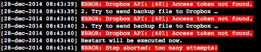
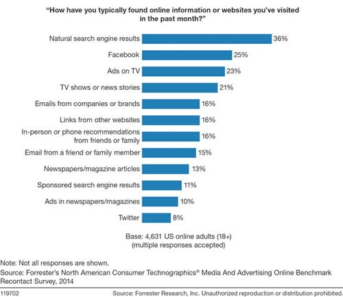

> **Historisch archief.** Deze aflevering verscheen op 1-01-2015 als onderdeel van ReputatieCoaching (2012–2016). De oorspronkelijke tekst is hieronder historisch bewaard. Diensten, contactgegevens, links, tools en adviezen kunnen inmiddels verouderd zijn.



**Transcriptiestatus:** Volledige transcriptie uit het oorspronkelijke archief.

***Historische afbeelding niet beschikbaar: ReputatieCoaching Podcast*
Allereerst een fantastisch, gezond, succesvol en mooi 2015 gewenst. Ik wens je toe, dat dit jaar al je dromen (of in elk geval een aantal ervan) mogen uitkomen! Welkom bij de eerste ReputatieCoaching Podcast van 2015: nummer 109.**

**Ik heb in 2012 al wel eens een podcast uitgebracht op Oudjaarsdag, maar dit is de eerste keer dat ik een podcast publiceer op Nieuwjaarsdag. Nu moet ik eerlijkheidshalve wel melden dat ik deze podcast reeds iets eerder heb gemaakt, want ik zag het niet zo zitten om meteen op Nieuwjaarsdag een halve dag achter de computer en de microfoon te kruipen.**

**Desalniettemin heb ik ook nu weer een aantal onderwerpen voor je. Sinds lange tijd heb ik weer eens problemen met BackWPup: het bleek namelijk dat sinds 29 oktober 2014 er geen backups meer waren gemaakt! Wil je trouwens weten wat de vijf populairste ReputatieCoaching podcasts van 2014 waren? Ik vertel het je zo! Per vandaag zijn de nieuwe gebruikersvoorwaarden voor Facebook van kracht. Maar zijn ze wel zo nieuw? Ik duik erin en vertel je erover! Ook overweegt Facebook JOUW content zelf te gaan hosten, waardoor je geen bezoekers meer op je eigen website krijgt.**

**Sinds enige tijd is de update met de naam “Pigeon” actief buiten de Verenigde Staten. Wat betekent dat straks voor Nederland, als de duif hier landt? Oh ja, WordPress 4.1 is ook nog vlak voor het einde van het oude jaar uitgekomen. Hoor straks wat er zoal is veranderd en verbeterd…**

**En tenslotte: het wereldwijde web bestaat al meer dan 23 jaar en het Internet is al meer dan 45 jaar oud. Maar wist je dat 20% van alle Europeanen nog nooit gebruik heeft gemaakt van Internet? Zometeen meer hierover!**

Hallo en hartelijk welkom bij deze aflevering van de ReputatieCoaching Podcast. Ik ben Eduard de Boer, ReputatieCoach. Dit is dé podcast die jou helpt om meer business te genereren, doordat jouw website beter gevonden wordt, zowel lokaal als landelijk en doordat ik je uitleg hoe je je online reputatie kunt verbeteren. Dit alles helpt je om je bedrijf en jezelf beter op de online kaart te plaatsen.

De podcast kun je vinden op [www.reputatiecoaching.nl/109](https://www.reputatiecoaching.nl/109/). Daar vind je niet alleen de tekst, maar ook video’s waar ik het in deze uitzending over heb, alsmede afbeeldingen, links enzovoorts. Bovendien is de podcast te beluisteren in [iTunes](https://www.reputatiecoaching.nl/itunes), op [Stitcher](https://www.reputatiecoaching.nl/stitcher) en ook op [TuneIn Radio](http://tunein.com/radio/ReputatieCoaching-Podcast-p655084/). Daar kun je je dus ook abonneren op de wekelijkse podcast.

Laat ik dan nu overgaan op de onderwerpen voor vandaag…

## Geen backups door BackWPup sinds 29 oktober 2014

Bij de timmerman thuis piepen de deuren! Ik vertel vaak in presentaties dat je frequent een aantal zaken moet controleren op je site. De belangrijkste twee zijn mijns inziens de werking van het contactformulier en de backups. Zelf controleer ik het contactformulier niet zovaak, omdat ik bijna wekelijks berichten via het contactformulier ontvang.

Maar dan backups… Dat is een ander verhaal! Die zouden als het goed is automatisch in de achtergrond moeten lopen. Zoals je mogelijk een tijd geleden hebt meegekregen heb ik eerder problemen gehad met BackWPup. Toen werden de geplande backups gedurende langere tijd niet uitgevoerd.

Zoals ik wel vaker doe was ik weer eens de prestaties van de website aan het controleren, evenals die van de plugins. Zo kwam ik ook weer eens bij de logfiles van BackWPup en tot mijn grote schrik zag ik dat die sinds 29 oktober 2014 niet meer had gedraaid. In de logfiles zag ik dat er iets fout ging met de upload naar Dropbox, de cloudservice die ik gratis gebruik voor het opslaan van de backups van de website.

[](https://lh3.googleusercontent.com/-faL73N1KBdI/VKEtbRUBRqI/AAAAAAAABlI/LsyH8La6hqQ/w536-h107-no/20141228-BackWPup-errorlog.png)De error die ik in de logs vond, luidde:

Dat was in elke logfile sinds 29 oktober driemaal te lezen, waarna de rode melding te lezen was, die zei:

Dit bracht mij op de idee, dat Dropbox mogelijk haar API had aangepast, waardoor je op een andere manier programma’s moest instellen om toegang te krijgen tot Dropbox, zoals de plugin BackWPup. Ik ging in WordPress naar de instellingen voor de jobs die gebruik maakten van Dropbox, trok de autorisatie in en probeerde opnieuw te autoriseren. Dat ging goed en ik kreeg daarna een sleutel die ik kon kopiëren/plakken in de plugin. Vanaf dat moment kon ik in elk geval de backups weer handmatig opstarten en draaiden deze probleemloos tot en met het versturen van de backup naar Dropbox.

Ik ga er een beetje van uit dat de automatische backups het nu ook wel weer zullen doen, maar de komende twee of drie weken houd ik een vinger aan de pols en zal ik om de paar dagen de logs inspecteren, om te zien of het allemaal nu weer naar behoren draait.

Laat dit niet alleen een les voor mij zijn, maar ook voor jou! Ik heb in elk geval een tweewekelijkse taak in mijn agenda gezet, om de logfiles van BackWPup te controleren om te zien of alles nog goed gaat. Want ik moet er niet aan denken dat ik alle content vanaf 29 oktober kwijt zou zijn geweest als gevolg van een storing, een virus, een hack of iets anders…

## Top–5 podcasts van 2014

Het einde van elk jaar en ook het begin van een nieuw jaar is vaak een moment van lijstjes… de Top-X lijstjes. Ik heb ook een lijst samengesteld en wel een lijst met de Top–5 podcasts van 2014. Ik vertel je zo over de samenstelling van deze top 5 en ik bied je ook meteen de mogelijkheid deze podcasts te beluisteren, mocht je ze nog nooit gehoord hebben.

Dit brengt mij trouwens even op het bericht uit de vorige podcast. Als jij je nu inschrijft voor de ReputatieCoaching mailinglist, dan ontvang je van mij als welkomstcadeau een link naar de eerste honderd uitzendingen. Die kun je in één keer downloaden en ergens opslaan, om ze achter elkaar te beluisteren. In die 100 podcasts zitten ook de volgende top–5 afleveringen:

### 1: Podcast 100

Op de eerste plaats staat [podcast 100](https://www.reputatiecoaching.nl/100/), met vlag en wimpel. In die podcast had ik Emile Ratelband te gast. Hij vertelde gedurende zo’n 24 minuten over reputatie, imago en de reputatieschade die hij zoal in zijn leven heeft geleden.

### 2: Podcast 94

Het interview met [Brenda Kok in podcast 94](https://www.reputatiecoaching.nl/94/) staat op de tweede plaats in de top–5 podcasts van 2014. Zij vertelde over het nut en belang van video en videomarketing. Ook kondigde zij de 14-daagse Video Challenge aan, waar ik aan heb deelgenomen. Mede dankzij die actie (waar ik helaas maar 10 dagen aan kon deelnemen) ben ik van mijn schroom af om voor de video te verschijnen en organiseer ik nu webinars over Internetmarketing, onder andere voor fotografen.

### 3: Podcast 77

Op de derde plaats vinden we [podcast 77](https://www.reputatiecoaching.nl/77/). Daarin vertel ik over de Top–5 lokale SEO fabels en de psychische belemmeringen voor lokale SEO. Bovendien behandel ik de toen net uitgekomen “Swarm”-app van Foursquare en ook vertel ik je over Buenoo, een nieuwe reviewsite voor bedrijven. Podcast 77 sluit ik af met een stuk informatie over gehackte WordPress installaties.

### 4: Podcast 67

[Podcast 67](https://www.reputatiecoaching.nl/67/) staat op de vierde plaats van meestbeluisterde podcasts van 2014. Daarin vertel ik over hoe ik iemand uit Koudekerke heb geholpen om haar bedrijf van opendi.nl te verwijderen. Bovendien vertel ik hoe je je bedrijf in het algemeen van Internet kunt verwijderen, bijvoorbeeld als je bent gestopt met je bedrijfsactiviteiten.

Verder leg ik je uit hoe je negatieve reviews in je voordeel kunt laten werken en ik heb nieuws van Getty Images, die al haar afbeeldingen gratis beschikbaar stelt.

### 5: Podcast 65

Ook [podcast 65](https://www.reputatiecoaching.nl/65/) was populair in 2014. Dat kwam mogelijk, doordat in deze podcast erg veel onderwerpen aan bod kwamen. Want ik behandelde de volgende onderwerpen:

```
  * #SMC055 in Apeldoorn over social media trends en de “ditzo” YouTube Case
  * Google Publishership in WordPress instellen
  * “Delen is het nieuwe vermenigvuldigen” over het gratis delen van kennis
  * Video over aankondiging Contest Google Glass toepassingen in de praktijk
  * Marketing voor Tandartsen
  * WhatsApp voor US$16 miljard gekocht door Facebook
  * Telegram speelt handig in op overname WhatsApp door Facebook
  * Google Maps uit “Bèta”-fase
  * GRATIS 7 + 3 GB bij OneDrive van Microsoft
  * BackWPup doet het weer: uit zichzelf!?
  * Mijn online storage gebruik
  * Hoe zien de zoekresultaten van Google eruit, zonder backlinks?
  * Google Glass Do’s & Don’t’s
```

Tot zover de top–5 van populairste afleveringen van de ReputatieCoaching podcast in 2014.

## Facebook concurrent voor Google

Facebook wordt meer en meer een concurrent voor Google. Dan bedoel ik niet Google+, maar Google als zoekmachine. In [podcast 108](https://www.reputatiecoaching.nl/108/) vertelde ik je vorige week al dat onder andere Startpagina.nl en vinden.nl in populariteit stijgen, ten koste van het gebruik van Google.

Maar uit een onderzoek van Forrester blijkt dat ook Facebook aan een opmars bezig is. Dat las ik in een artikel op Emerce. In dat artikel staat ook een staafdiagram, waarin werd vertoond hoe de 4.631 geïnterviewde Amerikanen online informatie en websites hebben gevonden:

[](https://lh3.googleusercontent.com/-SPF6-AHmsfo/VKEtbTHoGsI/AAAAAAAABlM/Oqd_ZLFFPFQ/w500-h433-no/20150101-staafdiagram-forrester.jpg)

Hieruit blijkt dat 36% van de Internetters online content zoekt en vindt via zoekresultaten in zoekmachines, 25% via Facebook, 23% op basis van TV-advertenties, 21% door TV-shows en nieuws. Kranten en tijdschriften scoren 13%, gevolgd door betaalde online advertenties met 11%, advertenties in gedrukte media met 10% en Twitter met 8%.

De boodschap van het artikel evenals van het rapport van Forrester is dat marketeers zich op het moment vaak alleen maar richten op marketing via zoekmachines, terwijl ze nog steeds veel breder moeten kijken.

## Nieuwe Facebook voorwaarden per vandaag echt nieuw?

*Historische afbeelding niet beschikbaar: Bedrijfspagina maken op Facebook*
Per vandaag zijn binnen Facebook de nieuwe gebruikersvoorwaarden van kracht. Ondanks dat die in het verleden al vaker voor gespreksstof hebben gezorgd, werpen ze nu wel heel veel stof op. Ironisch genoeg zijn ze helemaal niet bijzonder veel aangepast, vergeleken met hoe ze waren tot en met gisteren, oftewel: 31 december 2014.

Toch stonden de media er de afgelopen weken bol van en de kans is klein dat het je is ontgaan. Daarom wil ik even één en ander aantippen…

Want ben je je ervan bewust dat ook gisteren en de jaren daarvoor Facebook jouw Internetgedrag kan en mag volgen, zowel op Facebook als andere websites? Dus als jij je al aan het verdiepen bent in je vakantiebestemming voor de komende zomervakantie of goede skigebieden zoekt voor de voorjaarsvakantie, dan is de kans groot dat Facebook dit weet en dat je dit terugziet in de advertenties op Facebook. Dat is dus al jaren zo; daarom hoef je je er geen zorgen over te maken. Als het goed is, wist je dit al en zie je vaak al gepersonaliseerde advertenties.

En Facebook volgde je ook al lange tijd niet alleen online, maar ook via GPS, Bluetooth en WiFi. De Facebook-app kan dit altijd doen, zelfs als je de app niet hebt geopend. Facebook houdt dus ook bij met wie jij waar en wanneer bent en ook wat je doet. Installeer de app “Moves”, die overigens ook eigendom is van Facebook en ze weten het hoedanook, zelfs als je de Facebook app verwijdert. Ook WhatsApp is van Facebook en wie weet wat ze daar allemaal over je uit weten te halen? Want als jij WhatsApp gebruikt, dan weet ik vrijwel zeker dat je daarop nog andere dingen deelt, dan dat je op je tijdlijn op Facebook plaatst…

Wist je overigens dat Facebook al jarenlang jouw profielfoto en andere foto’s van jou mag vertonen bij advertenties, alsof jij een ambassadeur bent van het aangeprezen product of de vertoonde dienst? Dus dat is ook helemaal niet nieuw. Bovendien wordt Facebook niet de eigenaar van jouw foto’s: dat blijf jij! Facebook heeft het niet-exclusieve gebruiksrecht van alle foto’s die jij uploadt.

Dus op de keeper beschouwd is het eigenlijk een storm in een glas water. Want de meeste zaken zijn onveranderd. Maar doordat ze nu beter en helderder beschreven staan, gaan mensen er opeens over struikelen en denken ze dat het allemaal nieuw is.

Als je je hier nu zorgen over begint te maken, verwijder dan je Facebook account en stop in elk geval die vorm van Internetstalking. Alleen denk ik dat je een zware dobber krijgt als jij helemaal niet meer gevolgd wilt worden. Want dan zul je je smartphone moeten wegdoen, je tablet verkopen en nooit meer online gaan. Maar zelfs dan is de vraag of je privacy gewaarborgd blijft…

Aan de andere kant kun je ook gewoon de veranderingen in de offline en online wereld om je heen accepteren en doorgaan met je leven. Want dacht je werkelijk dat je tegenwoordig nog ergens anoniem kunt zijn? Volgens mij moet je daarvoor in een lemen hutje op de savanne in Afrika of in een blokhut op de toendra wonen… Maar zelfs dan vliegen er satellieten op grote hoogte over je heen, met camera’s die details tot 10 cm kunnen herkennen…

Privacy?? Vergeet het maar: jij geeft delen van je leven prijs in ruil voor leuke, handige of interessante diensten als Facebook, WhatsApp, Moves, Google, Twitter en wat dies meer zij.

## Facebook overweegt jouw content zelf te hosten

Nu ik het toch over Facebook heb… En hoever het bedrijf wil gaan om haar eigen ecosysteem te creëren, waarin gebruikers steeds meer gaan leven, waardoor ze niet meer naar de buitenwereld (lees: de rest van Internet) hoeven…

Op 26 oktober verscheen er een artikel in de New York Times, waarin Facebook de idee oppert om content van uitgevers te hosten op haar eigen platform en servers, zodat het “gemakkelijk kan worden geïntegreerd met advertenties”…

Ik hoop van ganser harte dat dit een opt-in mogelijkheid is, dus dat je er zelf voor kunt kiezen of je wilt dat JOUW blogartikelen, JOUW foto’s, JOUW presentaties en dus AL JOUW content door Facebook wordt gekopieerd en vertoond vanaf haar infrastructuur.

Want daarmee zou je de mogelijkheid om een EIGEN platform op te bouwen, een platform dat van jou is, namelijk je eigen website, geheel kwijtraken en dus zijn overgeleverd aan de grillen van een commercieel bedrijf, genaamd Facebook…

## Google Pigeon algoritme update buiten USA actief

Mogelijk heb je al eens gehoord van de update van Google, genaamd “Pigeon”. In [podcast 88](https://www.reputatiecoaching.nl/88/) schreef ik er kort over. Maar toen werd Pigeon alleen uitgerold in de Verenigde staten. Sinds een goede twee weken rolt Google deze algoritmische update ook uit naar andere Engelstalige landen, te weten het Verenigd Koninkrijk, Canada en Australië. India moet volgens Google nog iets langer op Pigeon wachten.

Dit lijkt erop te duiden dat wij ook in Nederland ons langzaamaan moeten voorbereiden op de komst van Pigeon, de update die de lokale zoekresultaten op haar grondvesten zal doen laten schudden. Mijn verwachting is, dat we ergens in de loop van dit jaar de update operationeel zien worden.

Het is inmiddels bekend dat de ranking van lokale zoekresultaten steeds meer gelijk wordt getrokken met die van de organische zoekresultaten. Dat kun je vaak ook wel zien: de lokale bedrijfsvermelding die op “A” staat, staat nu ook al in Nederland meestal bovenaan in de organische resultaten, direct onder eventuele AdWords advertenties.

Maar wat zijn nu de belangrijkste veranderingen in Google Pigeon? Wat kunnen wij tegemoet zien, zodra deze update ook voor de Nederlandstalige resultaten wordt doorgevoerd? De carrousel is sinds november vorig jaar in de VS alweer verdwenen voor hotels, restaurants en diverse andere bedrijfstakken. De kans bestaat dat wij die hoogstwaarschijnlijk helemaal niet gaan zien, ondanks dat de [carrousel al wel vertoond kan worden in de Nederlandstalige zoekresultaten](https://www.reputatiecoaching.nl/google-carrousel-in-nederland/).

Ik geef je de belangrijkste veranderingen die tot op heden zijn waargenomen in de Verenigde Staten, waar de update dus al het langst actief is.

```
  1. _Geen 7 lokale resultaten meer, maar slechts 3_ – Als je nu niet in de top–3 staat, is de kans groot dat je straks buiten de lokale zoekresultaten zult vallen, omdat er nagenoeg geen zogenaamde 7-packs meer worden vertoond. Werk je bedrijf omhoog met de tips die ik je altijd overal geef. In de VS is al gezien dat het aantal kliks naar de drie bedrijven die vermeld staan, toeneemt.
  2. _Kleinere straal waarin wordt gezocht_ – Er wordt in een kleinere straal om de geografische locatie gezocht. Dat houdt dus ook in dat als mensen een bepaald type bedrijf zoeken vanaf een smartphone, zij hoogstwaarschijnlijk dichterbij gelegen resultaten bovenaan vermeld zien staan.
  3. _Andere volgorde van de lokale resultaten_ – Dit pakt goed uit voor sommige bedrijven, maar minder goed voor andere. Het wijst erop dat ook de daadwerkelijke ranking verandert en dus niet citations en reviews meer de boventoon voeren.
  4. _Hogere ranking voor sites als Yelp en TripAdvisor_ – Dus meld je aan op zoveel mogelijk (lokale) directorysites die een grote mate van autoriteit hebben. Wat hiervan het exacte effect in Nederland is, zullen we moeten afwachten, tot we de postduif in het echt spotten…
```

Omdat de ranking van lokale resultaten meer gelijk wordt getrokken met de ranking van de organische resultaten, zullen factoren als “leeftijd van een domein”, “domeinautoriteit”, “aantal inkomende links” en andere ook een grotere rol gaan spelen.

Het jaar is nu nog maar één dag oud, maar laat dit een waarschuwing zijn om jouw positie in de lokale zoekresultaten nauwlettend in de gaten te houden. Meld je aan op alle grote directorysites en zorg ervoor dat in 2015 je bedrijfsgegevens overal consistent zijn!

## WordPress 4.1 is uitgekomen!

*Historische afbeelding niet beschikbaar: Waarom WordPress?*
Minder dan twee weken voor het eind van 2014 kwam WordPress met een update, te weten versie 4.1 met de codenaam “Dinah”, ter nagedachtenis aan de jazz-zangeres Dinah Washington. De belangrijkste vernieuwingen zijn in een notendop:

```
  * _Nieuw thema, “Twenty Fifteen”_ – Dit thema maakt gebruik van het lettertype “Google Noto” en is goed leesbaar op schermen van elke grootte.
  * _Schrijven zonder afleiding_ – Als je je wilt concentreren op het schrijven en niet afgeleid wilt worden, dan kun je de zogenaamde “Distraction-free writing mode” inschakelen, waardoor alle niet-relevante poespas van je browservenster verdwijnt en je alleen de editor overhoudt.
  * _Meer dan 40 talen beschikbaar_ – Voor het geval je liever de interface in een andere taal hebt.
  * _Overal uitloggen_ – Mocht je vergeten zijn om ergens op een gedeelde computer waar dan ook in de wereld uit te loggen, dan kun je dat nu vanaf je eigen profielpagina doen.
  * _Vine embeds_ – Vine video’s worden steeds populairder en nu kun je gewoon de URL van een Vine video in de editor plakken om een Vine video op te nemen in je blogpost of op een pagina.
  * _Plugin aanbevelingen_ – WordPress geeft je nu soms suggesties voor bepaalde plugins, op basis van de plugins die jij en anderen in combinaties gebruiken.
```

Natuurlijk zijn er ook weer veel veranderingen en verbeteringen onder de motorkap doorgevoerd. Wil je alles in detail weten, lees dan het artikel “[WordPress 4.1 “Dinah”](https://wordpress.org/news/2014/12/dinah/)” op WordPress.org.

## 20% van de Europeanen nog nooit op Internet geweest

Zet vijf mede-Europeanen in de leeftijdscategorie van 16 tot en met 74 op een rij en de kans is dat één van hen nog nooit op Internet is geweest. Geloof het of niet, maar zo staan de statistieken ervoor! Dat bleek uit een [onderzoek van Eurostat, het CBS van de EU, waarover ik las in de Wall Street Journal](http://blogs.wsj.com/digits/2014/12/17/1-in-5-europeans-has-never-used-the-internet/).

Toegegeven, het is al een stuk minder dan bij het vorige onderzoek in 2006. Toen antwoordde maar liefst 43% dat het nog nooit op Internet was geweest. Aan de andere kant is sindsdien het aantal mensen dat dagelijks gebruik maakt van Internet gestegen van 31% naar 65%. Maar er is toch nog steeds eenderde van alle Europeanen, die zegt niet dagelijks Internet te gebruiken.

Duik je iets verder in de statistieken, dan vind je onder andere de volgende karakteristieken:

```
  * Slechts 1% van alle inwoners in IJsland is nog nooit online geweest, tegenover 39% in Roemenië.
  * Minder dan 5% van de inwoners van Noorwegen, Denemarken en Luxemburg heeft nog nooit Internet gebruikt.
  * Wereldwijd heeft 40% van de totale populatie de afgelopen maand tenminste eenmaal gebruik gemaakt van Internet.
```

Met deze statistieken over het Internetgebruik door Europeanen kom ik dan aan het einde van deze eerste podcast van 2015. De kop is eraf en nog 51 te gaan! Ik kijk ernaar uit om jou ook dit jaar weer van interessante content, wetenswaardig nieuws en nuttige tips te voorzien om jou te helpen met het verbeteren van je online vindbaarheid en je reputatie.

Als je de podcast leuk vindt en je wilt nog meer op de hoogte blijven, volg me dan ook op Twitter, via [@reputatiecoach1](https://twitter.com/reputatiecoach1).

Heb je inderdaad wat aan alle informatie die ik met je deel, help mij dan met het verder verbeteren en promoten van deze podcast. Surf daarvoor naar [iTunes](https://www.reputatiecoaching.nl/itunes) of [Stitcher](https://www.reputatiecoaching.nl/stitcher), geef de podcast een sterrenbeoordeling en laat ook je reactie achter. Door de podcast te beoordelen op iTunes en/of Stitcher breng je de podcast onder de aandacht van een breder publiek.

Je kunt me verder helpen, door de podcast aan te bevelen bij vrienden of collega’s, waarvan je denkt dat ze er hun voordeel mee kunnen doen, of door ’m te delen op Twitter, like’n en delen op Facebook of een “+1” te geven op Google+.

En vergeet niet: ik ben hier om je te helpen! Als je een vraag of een probleem hebt met betrekking tot je online reputatie of de vindbaarheid van je website, kun je een mailtje sturen naar [podcast@reputatiecoaching.nl](mailto:podcast@reputatiecoaching.nl).

Als je dat te lastig vindt, of als je de podcast beluistert terwijl je in de auto zit en je hebt acuut een vraag, spreek dan een boodschap in op de ReputatieCoaching Hotline, op nummer: 084 - 883 15 56. Mogelijk behandel ik je vraag of probleem dan in een artikel of in de podcast.

En je kunt ook rechtstreeks op de website een voicemail achterlaten, door op de tab aan de rechterkant van elke pagina te klikken, en je bericht in te spreken. Dit was [ReputatieCoaching Podcast aflevering 109](https://www.reputatiecoaching.nl/109/) en mijn naam is [Eduard de Boer](http://nl.linkedin.com/in/eduarddeboer/nl).

Ik wens je de komende week weer succes met het werken aan je reputatie, zodat je meteen je reputatie voor jou kunt laten werken!

Tot volgende week!

Doei!

Links naar content die in deze podcast aan bod komt:

```
  * [ReputatieCoaching Podcast in iTunes](https://www.reputatiecoaching.nl/itunes)
  * [ReputatieCoaching Podcast op Stitcher](https://www.reputatiecoaching.nl/stitcher)
  * [ReputatieCoaching Podcast op TuneIn Radio](http://tunein.com/radio/ReputatieCoaching-Podcast-p655084/)
  * [ReputatieCoaching Podcast RSS-feed](https://feeds.reputatiecoaching.nl/ReputatieCoachingPodcast)
  * “[Facebook Offers Life Raft, but Publishers Are Wary](http://www.nytimes.com/2014/10/27/business/media/facebook-offers-life-raft-but-publishers-are-wary.html)” (New Yourk Times, 26 oktober 2014)
  * “[1 in 5 Europeans Has Never Used the Internet](http://blogs.wsj.com/digits/2014/12/17/1-in-5-europeans-has-never-used-the-internet/)” (Wall Street Journal, 17 december 2014)
  * “[Facebook steeds grotere concurrent voor zoekmachines](http://www.emerce.nl/nieuws/facebook-steeds-grotere-concurrent-zoekmachines)” (Emerce, 22 december 2014)
```
