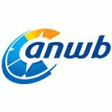

> **Historisch archief.** Deze aflevering verscheen op 8-01-2015 als onderdeel van ReputatieCoaching (2012–2016). De oorspronkelijke tekst is hieronder historisch bewaard. Diensten, contactgegevens, links, tools en adviezen kunnen inmiddels verouderd zijn.



**Transcriptiestatus:** Volledige transcriptie uit het oorspronkelijke archief.

***Historische afbeelding niet beschikbaar: ReputatieCoaching Podcast*
Zelfs ik heb wel eens een pech-gevalletje, waardoor WordPress mij buitensluit en dus niet meer toelaat. Ik vertel je er zo meer over. Sinds april vorig jaar biedt de ANWB de reviewservice voor garages, onder de welluidende naam “garagereviews”. Leeft dit een beetje bij autogarages? Ik vertel het na mijn probleem met WordPress.**

**Van Martin kreeg ik de vraag hoe een persoonlijk Google+ profiel hoger kan scoren dan een bedrijfspagina, dus daar ga ik op in en ook op het webinar dat ik gisteravond organiseerde over “reviews”, gevolgd door een aantal tips voor originele bronnen om reviews te vinden zonder ze te hoeven vragen.**

**WhatsApp heeft 700 miljoen gebruikers wereldwijd en ik sluit de podcast van vandaag af met een topic over een tool die ik al maandenlang naar volle tevredenheid gebruik voor het plannen en indelen van een groot deel van mijn werk.**

Hallo en hartelijk welkom bij deze aflevering van de ReputatieCoaching Podcast. Ik ben Eduard de Boer, ReputatieCoach. Dit is dé podcast die jou helpt om meer business te genereren, doordat jouw website beter gevonden wordt, zowel lokaal als landelijk en doordat ik je uitleg hoe je je online reputatie kunt verbeteren. Dit alles draagt ertoe bij dat je bedrijf en jezelf beter op de online kaart wordt geplaatst.

De podcast kun je vinden op [www.reputatiecoaching.nl/110](https://web.archive.org/web/20150312095249/http://www.reputatiecoaching.nl/110/). Daar vind je niet alleen de tekst, maar ook video’s waar ik het in deze uitzending over heb, alsmede afbeeldingen, links enzovoorts. Bovendien is de podcast te beluisteren in iTunes, op Stitcher en ook op [TuneIn Radio](http://tunein.com/radio/ReputatieCoaching-Podcast-p655084/). Daar kun je je dus ook abonneren op de wekelijkse podcast.

Laat ik dan nu overgaan op de onderwerpen voor vandaag…

## HELP! Ik kan niet meer inloggen in WordPress!

*Historische afbeelding niet beschikbaar: Waarom WordPress?*
Ook ik heb wel eens een typisch pech-gevalletje… Zo’n moment, dat je denkt: “Waar heb ik iets fout gedaan?”. Afgelopen week overkwam het me weer eens. Ik vertelde je in [podcast 109](https://web.archive.org/web/20150312095234/http://www.reputatiecoaching.nl/109/) al dat ik weer eens had zitten experimenteren met de performance van de website.

Mijn doel is namelijk om ervoor te zorgen dat liefst elke pagina binnen 1 seconde laadt. Nu is dat voor mij op dit moment nog niet helemaal bereikbaar, maar ik kom goed in de buurt. De homepagina van de site laadt in zo’n 0,7 seconden, terwijl achterliggende pagina’s er nog wat langer over doen.


Maar goed, ik had dus zitten experimenteren met de CDN-instellingen in de plugin W3 Total Cache. CDN staat overigens voor: “Content Delivery Network”. Ik had een trial-account aangemaakt op [MaxCDN](https://www.maxcdn.com), om te zien of dat mogelijk beter presteerde dan Amazon Cloudfront. Dat ging allemaal goed en de site leek wat sneller te werken. Dus heb ik uitgelogd en kort na Nieuwjaar heb ik niet echt ingelogd. Want zoals ik je vertelde had ik podcast 109 al tussen Kerst en Nieuwjaar ingesproken.

Ik probeerde pas weer voor het eerst in te loggen op 2 januari. Toen bleek dat niet te werken. Ik wist zeker dat ik de goede gegevens had, maar toch was ik met al mijn accounts buitengesloten van de WordPress backend. Want elke login leidde zonder waarschuwing weer naar de loginpagina. Gelukkig kon ik met Safari wel inloggen en dat zette mij aan het denken. Ik had de idee dat het mogelijk aan cookies kon liggen, want ik maak bijna dagelijks de instellingen van Safari leeg, voor mijn diverse experimenten.

En ik realiseerde me, dat ik een instelling bij de MaxCDN-configuratie had aangevinkt, die betrekking had op cookies. Die zette ik uit, bewaarde de instellingen en maakte alle caches van W3 Total Cache leeg. Vervolgens kon ik zowel met Chrome, als met Firefox gewoon weer inloggen. Pheeewww… Ik zag al allerlei scenario’s voor me, waarbij ik een backup moest gaan terugzetten etc. Maar dat bleek dus allemaal niet nodig.

Mocht jij ooit om voor jou onverklaarbare redenen buitengesloten zijn van je WordPress site, verwijder dan eerst eens je cookies en probeer het nogmaals. Mogelijk lukt het dan wel. Anders zijn er verschillende artikelen op Internet te vinden, waarin goed wordt beschreven wat je dan wel moet doen, als het inloggen niet meer werkt.

Tot zover mijn perikelen met het inloggen op WordPress…

## Garagereviews van de ANWB


Mijn advies is altijd om het verzamelen van reviews te spreiden over verschillende sites. Daarbij moet je allereerst denken aan algemene directorysites die reviews ondersteunen en die gratis zijn, zoals Google+ Mijn Bedrijf, Telefoonboek, Wugly, Yelp et cetera. Het is ook mogelijk om reviews te verzamelen op commerciële reviewsites, zoals Trustpilot, Ekomi, klantenvertellen.nl, Buenoo en dergelijke.

Daarnaast moet je natuurlijk reviews verzamelen op lokale reviewsites, zoals AlleBedrijvenIn en andere lokale sites, die ik hier niet allemaal wil noemen.

Tenslotte moet je ook aandacht besteden aan het verzamelen van reviews op branchespecifieke sites. Die zijn er voor de zorg in het algemeen, zoals bijvoorbeeld ZorgkaartNederland en Independer, maar ook voor specifieke doelgroepen, zoals bijvoorbeeld tandartsbeoordelingen.nl voor tandartsen, leadingcourses.com voor golfbanen, fotografen-gids.nl, zoover.nl voor hotels, iens.nl voor restaurants enzovoorts.

Zo biedt de ANWB al sinds 3 april 2014 de mogelijkheid om autogarages te beoordelen. Dat zij daar waarde aan hecht, blijkt wel uit het feit dat ik een tijdje geleden zelfs een commercial op de radio hoorde van de ANWB, waarin deze dienst werd gepromoot.

Zo zie je maar eens temeer dat reviews niet meer weg te denken zijn uit onze maatschappij en dat het belang ervan toeneemt.

Natuurlijk was ik nieuwsgierig of mensen ook daadwerkelijk reviews hebben gepost op anwb.nl/garagereviews. Nu wonen wij op een bedrijventerrein, waarop nogal wat autobedrijven zijn gevestigd. Dus zocht ik naar garagebedrijven binnen een straal van een paar honderd meter, om te zien wat ik daar zoal over kon vinden. Er bleken negen bedrijfsvermeldingen van acht garages: eentje had twee vermeldingen, omdat die een tijdje terug is verhuisd.

Van de acht garages die ik heb onderzocht, hadden drie al reviews: een garage had vier reviews, eentje twee en de laatste had er eentje. De reviews varieerden van één tot vijf sterren.

De reviews die waren gepost, varieerden van een oneliner van iemand die erg ontevreden was, tot hele verhalen van mensen die zeer positief waren en daarom een lovende review schreven. Ik was benieuwd of de lokale garagebedrijven er überhaupt van op de hoogte waren, dat er reviews over hen zijn geschreven op o.a. dus de site van de ANWB. Vaak is het niet weten waar er wat over je wordt geschreven riskanter voor een ondernemer, dan wel te weten wat er wordt geschreven…

Dus nam ik de proef op de som en ben de bedrijven langsgegaan om de bedrijfsleider, of degene die gaat over marketing en communicatie of over “Internet” te vragen of ze hiervan op de hoogte waren en of ze een actief reviewbeleid hebben. Dat was voor mij niet meer dan een rondje door de buurt en tevens een leuke mogelijkheid eens wat veldwerk buiten de deur te doen…

Ik had een drietal vragen opgesteld:

```
  1. Was je ervan op de hoogte dat de ANWB aan jouw klanten de mogelijkheid biedt om reviews over jouw bedrijf te posten?
  2. Volg je wat er online over jouw bedrijf wordt geschreven?
  3. Heb je een actief reviewbeleid? Met andere woorden: ben je actief met het verzamelen van reviews?
```

Alledrie de bedrijven waren ervan op de hoogte, maar slechts eentje had de reviews bij de ANWB ook gelezen. Geen van de garages doen serieus moeite om te volgen wat er online over hen wordt geschreven en slechts eentje is actief met het verzamelen van reviews. Daarvoor gebruikt het bedrijf de dienst “klantenvertellen.nl”. Op die site zag ik dat het gemiddeld een 8,8 scoort uit 17 beoordelingen: een hele goede score. De hoofdreden dat deze garage beoordelingen verzamelt is dat zij veel handel doet in occasions, die ze natuurlijk ook online aanbiedt. En in die markt vergelijken potentiële kopers natuurlijk bedrijven online met elkaar…

De overige twee bedrijven zijn voornamelijk gericht op reparatie en onderhoud. De reden die zij beiden gaven om niet actief met reviews bezig te zijn, was dat ze al bijna teveel business hadden en ze niet verder wilden groeien. En de omvang van hun huidige business was voornamelijk te danken aan mond-tot-mond reclame, de traditionele versie van reviews!

Tja, dat kan natuurlijk ook een reden zijn om *niet* bezig te zijn met reviews. Maar ook al wil je als bedrijf niet verder groeien, toch kunnen reviews een goede indicatie zijn, een soort van thermometer die aangeeft hoe jouw klanten jouw producten en/of dienstverlening beleven.

Mede daarom is toch altijd mijn advies om in de gaten te houden wat er overal over jouw bedrijf wordt geschreven, want er kan eens een moment komen dat iemand een negatieve review schrijft, terwijl jij het niet in de gaten hebt. En zo’n situatie kan een enorm negatieve impact hebben op je business, waarvan je dacht dat je niet met reviews bezig hoefde te zijn…

## Persoonlijke Google+ profiel boven Mijn Bedrijf pagina?

*Historische afbeelding niet beschikbaar: Google*
Martin vroeg mij via WhatsApp hoe het kwam dat hij zijn persoonlijke Google+ profiel hoger zag scoren in de zoekresultaten, dan zijn bedrijfspagina. Hij stuurde mij een screenshot en ik zag al meteen wat de oorzaak was. Tussen de zoekresultaten stonden namelijk enkele posts uit Google+. Hoewel Google+ berichten geïndexeerd worden door Google, worden ze niet vaak vertoond, zeker niet van Google+ accounts die nog vrij nieuw zijn.

De oorzaak lag er dus in, dat Martin ingelogd was in Google+. Dat kan een groot verschil maken met zoeken. Want als je zoekt terwijl je bent ingelogd op Google+, zoekt Google namelijk beduidend meer in je eigen Google+ berichten en in Google+ berichten van anderen; veel meer dan wanneer je niet bent ingelogd.

Soms zie je wel eens Google+ berichten in de zoekresultaten, als je niet bent ingelogd op Google+, maar dat zijn meestal berichten van mensen met een grote mate van autoriteit, of berichten die heel veel +1’s hebben ontvangen en/of vaak gedeeld zijn.

## Webinar “Internetmarketing voor Fotografen (deel 4): reviews”

*Historische afbeelding niet beschikbaar: Webinar Internetmarketing voor Fotografen*
Gisteravond organiseerde ik alweer het vierde webinar in de serie “Internetmarketing voor Fotografen”. In dit webinar vertelde ik over reviews. Het is overduidelijk dat het belang van reviews toeneemt, want steeds meer mensen vergelijken bedrijven en dienstverleners online, voordat ze een product kopen of een dienst afnemen.

In dit webinar kwamen de volgende onderdelen aan bod:

```
  * **WAT** zijn reviews?
  * **WAAROM** je reviews moet verzamelen
  * **WAAR** je zoal reviews kunt verzamelen
  * **HOE** je op verantwoorde wijze veel reviews verzamelt
  * **HOE** je reviews zoal verder kunt gebruiken
```

Als je kijkt op Wikipedia, vind je de volgende definitie voor “[recensie](http://nl.wikipedia.org/wiki/Recensie)”, het officiële Nederlandse woord voor het Engelse “review”:

In de wereld van Internetmarketing vallen we dus meestal in het laatste deel: “… een ander product of andere dienst”.

De beschrijving op Wikipedia gaat verder:


```
  1. De analyse (een bespreking van de inhoud van het boek, de film enz.)
  2. De interpretatie
  3. De evaluatie (positieve en negatieve kritiek)
  4. Is het objectief of subjectief
```

Een recensie bevat dus een (liefst met argumenten onderbouwd) waardeoordeel over het culturele product. Daarnaast kan het besprokene in een ruimere context worden gesitueerd (bijvoorbeeld het oeuvre van een schrijver, ontwikkelingen in de literatuur, de tijdgeest), de voorstelling wordt beschreven of de korte inhoud van een film wordt weergegeven.

Bij films en videospellen bevat de recensie over het algemeen een rapportcijfer of een aantal sterren (meestal van 1 tot 5), om in één blik een algemeen oordeel te kunnen zien. Ook kunnen er voor bepaalde aspecten (zoals de grafische kwaliteiten bij een spel of het acteerwerk in een film) aparte cijfers worden vermeld, met eventuele toelichting.

Ook kun je in hetzelfde artikel op Wikipedia lezen over de effecten van een recensie:

Grappig dat recensies dus de bezoekersaantallen bij films niet lijken te beïnvloeden. De vraag is alleen hoe lang geleden dat onderzoek is uitgevoerd… Want tegenwoordig blijken recensies of reviews toch wel serieus invloed te hebben op de populariteit (lees: het aantal gasten) dat naar een restaurant gaat of het aantal aanmeldingen van nieuwe patiënten bij een tandartspraktijk.

## GRATIS webinar organiseren m.b.v. commerciële plugin “Webinar Ignition”

Voor het webinar van gisteravond had ik iets meer tijd voor alle voorbereiding. Dus heb ik de plugin “Webinar Ignition” gebruikt, die ik al meer dan een jaar ongebruikt op de plank had liggen. Met behulp van die plugin kun je in combinatie met bijvoorbeeld Google+ Hangouts on Air snel en eenvoudig professioneel ogende landingspagina’s maken in je WordPress blog, waardoor je je webinar meteen een veel betere presentatie geeft. En dit draagt bij tot een groter aantal kijkers.

Ik had bovendien een introductievideo gemaakt, waarin ik vertelde wat in dit webinar aan bod kwam. Dankzij “Webinar Ignition” was die ook gemakkelijk op te nemen op de landingpagina.

Verder stelt de plugin je ook in staat om mensen zich op die landingspagina te laten inschrijven voor het webinar. Deze mailadressen worden automatisch toegevoegd aan je mailinglist op Aweber, Mailchimp, iContact, SendReach of om het even welke andere mailprovider je gebruikt.

Daarnaast stuurt de plugin de mensen die zich hebben ingeschreven vóór aanvang van het webinar korte herinneringsmails vanaf het door jou ingestelde e-mailaccount. Bij deze eerste webinar die ik via Webinar Ignition heb georganiseerd leek het erop alsof de herinneringsmails niet op de juiste tijdstipppen werden verstuurd. Daar moet ik nog even induiken. Het kan zoiets simpels zijn als een tijdzone probleem of weet ik wat.

Met de plugin kun je tijdens het webinar vragen verzamelen en die tijdens of aan het einde van het webinar beantwoorden. En wat ook mooi is, is dat de plugin de replay van de opname een beperkte tijd online kan laten staan, inclusief een countdown timer. Zo kies ik ervoor om de video na afloop nog 24 uur online te laten staan. Daarna wil ik dat die verdwijnt. Dat regelt de plugin allemaal! Natuurlijk wordt de video niet verwijderd, maar hij wordt niet meer getoond… Dat is wezenlijk anders!

Door deze uitgebreide functionaliteit is de plugin niet gratis, maar dat is ook wel te begrijpen als je hoort en ziet wat er allemaal mogelijk is. Want wat ik je tot nu toe heb verteld is namelijk nog niet eens alles, wat de plugin kan! Je kunt er meer over vinden op de website van “Webinar Ignition”. In de show notes heb ik hier een link naartoe opgenomen. Omwille van de transparantie moet ik je melden dat dat een affiliate link is; dat wil zeggen dat ik een commissie ontvang als iemand de plugin via die link bestelt.

Laat me weten, als je eventueel interesse hebt in een Nederlandstalige instructievideo of demonstratievideo over het gebruik van de plugin. Meld dit onderaan de show notes, op [www.reputatiecoaching.nl/110](https://web.archive.org/web/20150312095249/http://www.reputatiecoaching.nl/110/).

## Originele bronnen voor recensies

In het webinar vertelde ik waar je zoal recensies kunt verzamelen. Daarbij maakte in onderscheid in:

```
  * Offline
  * Eigen site / eigen omgeving
  * Algemene sites (gratis / betaald)
  * Lokale sites
  * Branchespecifieke sites
  * Eigen app
```

Je hoeft natuurlijk helemaal niet per se online reviews te verzamelen. Het is goed om ook offline reviews te verzamelen. Zo kun je overal je oor goed te luisteren leggen en daar positieve opmerkingen uit oppikken. Zo hoor ik soms tijdens trouwreportages mensen onderling positief praten over onze werkwijze en ons voorkomen. Die opmerkingen probeer ik zoveel mogelijk te onthouden, zodat ik ze later nog weer eens kan gebruiken.

Een andere manier om offline een beoordeling te krijgen die nèt een stapje verder gaat: is mensen mondeling naar hun mening vragen.

Of je kunt kaartjes meegeven aan gasten, klanten of patiënten, waarop ze hun mening kunnen schrijven. Daarbij moet je dan wel vermelden, dat je ze mogelijk op je site of elders gebruikt. De reacties die je dan krijgt toegestuurd kun je prima op je eigen site vertonen.

Maar ook online kun je creatief recensies zoeken, die mogelijk niet zo voor de hand liggen. Zo kun je eens kijken wat mensen schrijven in de reacties op bijvoorbeeld foto’s op Facebook. Een dergelijke reactie kun je importeren op je website, door ’m te kopiëren/plakken of een screenshot te maken.

Verder kun je ook eens zoeken in tweets of bij reacties op Instagram foto’s. Helaas is het niet meer mogelijk om recensies voor een bedrijf op LinkedIn te verzamelen, maar natuurlijk kun je wel eens kijken wat mensen op jouw persoonlijke pagina hebben geschreven als recensie over jou. Laat dit ook een subtiele hint voor je zijn om eens wat vaker op je eigen naam aanbevelingen te vragen aan mensen voor wie je iets hebt gedaan.

Een aantal maanden geleden vertelde ik je dat gebruikers op diverse platformen hun aanbevelingen, recensies of reviews ook weer kunnen weghalen. Daarom is mijn advies om ze te kopiëren met bronvermelding naar bijvoorbeeld een Word-document of een document of spreadsheet op Google Drive.

## WhatsApp heeft 700 miljoen gebruikers

Op Emerce las ik dat WhatsApp inmiddels meer dan 700 miljoen actieve gebruikers heeft. Daarmee is het het op één na grootste platform, na Facebook dat natuurlijk ver over het miljard zit. En WhatsApp is zelfs ook van Facebook.

Hierdoor is WhatsApp groter dan Twitter (met 284 miljoen gebruikers) en Instagram (met 300 miljoen gebruikers) bij elkaar.

Maakt dit WhatsApp tot een soort van sociaal netwerk? Ja, in zekere zin wel: mensen kunnen zowel individuen berichten en multimediale bestanden sturen, evenals naar afgesloten groepen. Dus er is een grote mate van sociale interactie tussen de gebruikers.

Maar zie ik meteen mogelijkheden voor online marketing om deze doelgroep van 700 miljoen te bereiken? Nou, nee… Je kunt mensen tenslotte alleen toevoegen op basis van telefoonnummer (als ze in je contacten zitten) en ik heb niet het telefoonnummer van al die 700 miljoen mensen… Maar zal Facebook op den duur advertenties of andere vormen van marketing richting het WhatsApp-platform sturen? Ik verwacht het wel, maar de tijd zal het leren…

Wel zijn er recentelijk twee leuke initiatieven op WhatsApp gelanceerd: de “[online voedingscoach](http://www.emerce.nl/nieuws/foodcoach-via-whatsapp)” en de “[klantenservice van DeOnlineDrogist.nl](http://www.emerce.nl/nieuws/klantenservice-deonlinedrogistnl-via-whatsapp)”.

## TIP: Trello voor meer structuur en planning in je business


Tenslotte heb ik een tip voor je… Eentje waar je zeker zo aan het begin van het jaar hopelijk echt je voordeel mee kunt doen! Zelf maak ik al maanden gebruik van [Trello](http://www.trello.com). Mocht je Trello nog niet kennen: het is een GRATIS online service, waar je lijstjes kunt bijhouden.

“Nou, nou… wat spannend en enorm nuttig…”, hoor ik je denken. Of niet? Ik kan je vertellen dat ik zelf uitermate enthousiast ben over Trello. Want ik gebruik het voor een heleboel verschillende soorten lijstjes… Van onderwerpen voor te schrijven artikelen, tot boodschappen die ik moet doen, acties die ik voor bepaalde opdrachtgevers moet uitvoeren en actielijsten voor het gezin.

Het mooie is ook dat er een app voor de iPhone en Android is, waarop je bij je lijstjes kunt. Recentelijk heb ik voor de Kerstinkopen ook weer dankbaar gebruik gemaakt van Trello. Zo had ik via de browserinterface op mijn Chromebook lijstjes gemaakt met de gerechten, de ingrediënten, links naar recepten, boodschappenlijstjes enzovoorts. In de diverse supermarkten en winkels streepte ik dan de boodschappen af, zodra ik die in de winkelwagen had liggen.

En doordat je borden met lijsten kunt delen met anderen, was het voor mijn vrouw Suzanne ook mogelijk om eventueel boodschappen die zij in een andere winkel deed, op dezelfde lijstjes door te strepen, zodat we niet per ongeluk tweemaal hetzelfde kochten.

Maar goed, boodschappen is één ding… En niet de focus van de ReputatieCoaching Podcast, noch van de bijbehorende website. Dus laat ik een beetje inzoomen op datgene waarvoor ik Trello gebruik voor mijn commerciële werkzaamheden.

Daarvoor wil ik eerst nog kort duiken in het conceptuele model van Trello. In Trello begin je met het maken van een zogenaamde “organisatie”. In eerste instantie bestaat een organisatie slechts uit één persoon, namelijk degene die de organisatie heeft aangemaakt… Jij dus.

Binnen een organisatie maak je “borden”, vergelijkbaar met prikborden. In principe is een bord privé, maar je kunt het delen met anderen, zodat zij er ook toegang toe krijgen. Ook kun je organisaties en borden publiekelijk beschikbaar stellen.

Op borden definieer je lijsten… En in de lijsten maak je kaarten aan. Die kaarten kunnen heel veel verschillende soorten content bevatten. Ze hebben in elk geval allemaal een titel. Maar verder kun je attachments of aanhangels in een kaart zetten, links, een afvinklijst (bijvoorbeeld voor acties). Ook kun je aan een kaart een “Due date” toekennen. Dat is de datum/tijd dat er iets gebeurt, of dat de taak op de kaart afgerond moet zijn of iets dergelijks. Daarnaast kun je meerdere verschillende labels aan een kaart hangen.

Begin je een gevoel te krijgen bij wat ik probeer te beschrijven? Begin je mogelijkheden te zien? Binnenkort maak ik een instructievideo, waarin ik precies laat zien hoe ik Trello gebruik voor mijn werkzaamheden!

Met dit stuk over Trello kom ik dan weer aan het einde van deze podcast. Als je de podcast leuk vindt en je wilt nog meer op de hoogte blijven, volg me dan ook op Twitter, via [@reputatiecoach1](https://twitter.com/reputatiecoach1).

Heb je inderdaad wat aan alle informatie die ik met je deel, help mij dan met het verder verbeteren en promoten van deze podcast. Surf daarvoor naar iTunes of Stitcher, geef de podcast een sterrenbeoordeling en laat ook je reactie achter. Door de podcast te beoordelen op iTunes en/of Stitcher breng je de podcast onder de aandacht van een breder publiek.

Je kunt me verder helpen, door de podcast aan te bevelen bij vrienden of collega’s, waarvan je denkt dat ze er hun voordeel mee kunnen doen, of door ’m te delen op Twitter, like’n en delen op Facebook of een “+1” te geven op Google+.

En vergeet niet: ik ben hier om je te helpen! Als je een vraag of een probleem hebt met betrekking tot je online reputatie of de vindbaarheid van je website, kun je een mailtje sturen naar [podcast@reputatiecoaching.nl](mailto:podcast@reputatiecoaching.nl).

Als je dat te lastig vindt, of als je de podcast beluistert terwijl je in de auto zit en je hebt acuut een vraag, spreek dan een boodschap in op de ReputatieCoaching Hotline, op nummer: 084 - 883 15 56. Mogelijk behandel ik je vraag of probleem dan in een artikel of in de podcast.

En je kunt ook rechtstreeks op de website een voicemail achterlaten, door op de tab aan de rechterkant van elke pagina te klikken, en je bericht in te spreken. Dit was [ReputatieCoaching Podcast aflevering 110](https://web.archive.org/web/20150312095249/http://www.reputatiecoaching.nl/110/) en mijn naam is [Eduard de Boer](http://nl.linkedin.com/in/eduarddeboer/nl).

Ik wens je de komende week weer succes met het werken aan je reputatie, zodat je meteen je reputatie voor jou kunt laten werken!

Tot volgende week!

Doei!

Links naar content die in deze podcast aan bod komt:

```
  * ReputatieCoaching Podcast in iTunes
  * ReputatieCoaching Podcast op Stitcher
  * [ReputatieCoaching Podcast op TuneIn Radio](http://tunein.com/radio/ReputatieCoaching-Podcast-p655084/)
  * [ReputatieCoaching Podcast RSS-feed](https://web.archive.org/web/20141223114514/http://feeds.reputatiecoaching.nl:80/ReputatieCoachingPodcast)
  * Webinar Ignition (voor het zelf organiseren van webinars)
  * [Trello](http://www.trello.com)
  * “[Klantenservice DeOnlineDrogist.nl via WhatsApp](http://www.emerce.nl/nieuws/klantenservice-deonlinedrogistnl-via-whatsapp)” (Emerce, 14 november 2014)
  * “[Voedingcoach nu ook via WhatsApp](http://www.emerce.nl/nieuws/foodcoach-via-whatsapp)” (Emerce, 17 decemboer 2014)
  * “[WhatsApp heeft 700 miljoen gebruikers](http://www.emerce.nl/nieuws/whatsapp-heeft-700-miljoen-gebruikers)” (Emerce, 7 januari 2014)
```
