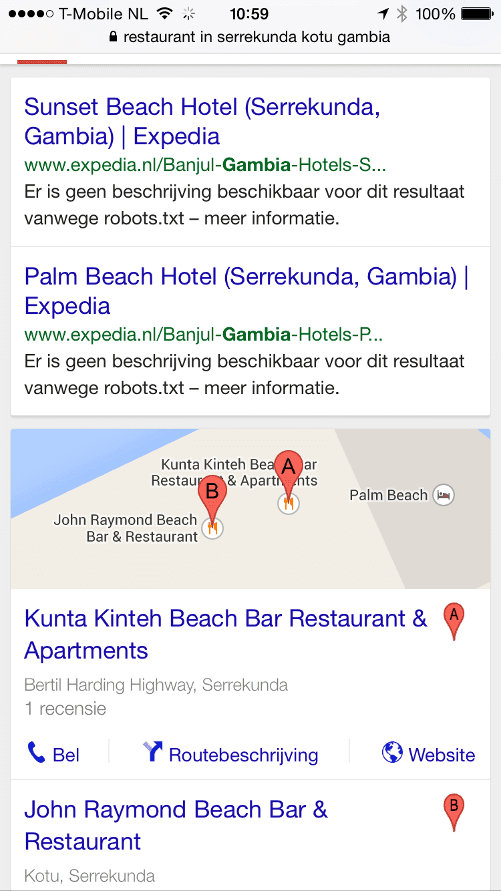
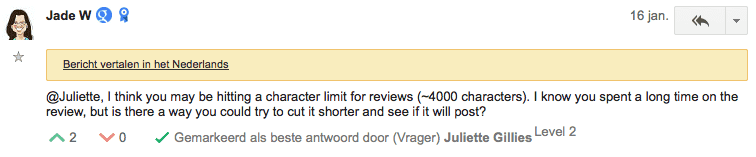
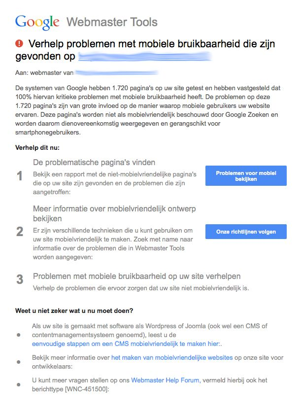
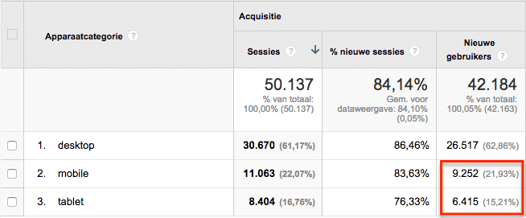
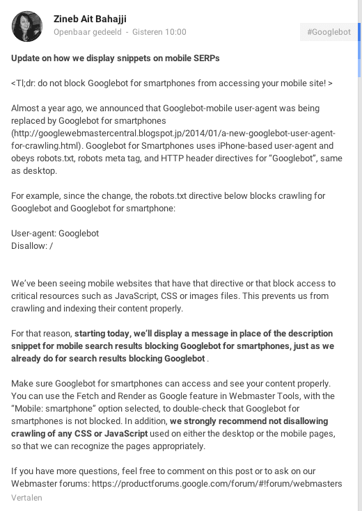
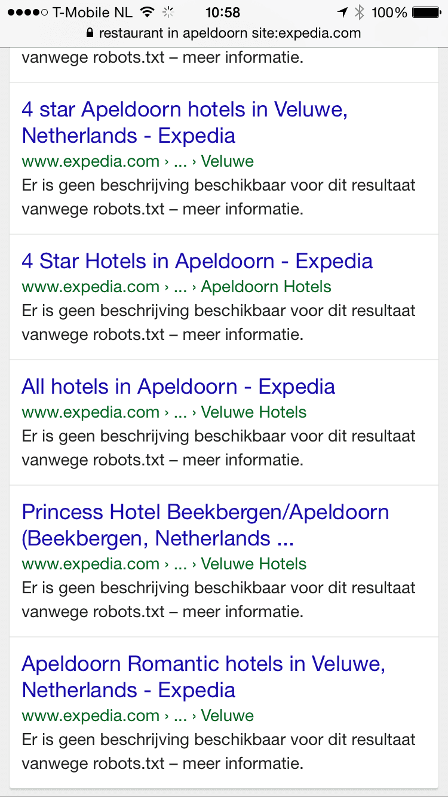
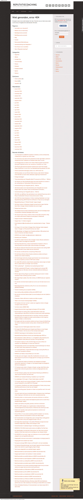

> **Historisch archief.** Deze aflevering verscheen op 29-01-2015 als onderdeel van ReputatieCoaching (2012–2016). De oorspronkelijke tekst is hieronder historisch bewaard. Diensten, contactgegevens, links, tools en adviezen kunnen inmiddels verouderd zijn.



**Transcriptiestatus:** Volledige transcriptie uit het oorspronkelijke archief.

***Historische afbeelding niet beschikbaar: ReputatieCoaching Podcast*
Vorige week heb ik mijn werkplek in Apeldoorn verruild voor een remote werkplek: een ligbed op het strand in Gambia, met WiFi! Zometeen dan ook meer over lokale SEO in Gambia. Verder heb ik een aantal positieve reacties gekregen op de mail die ik eerder deze week naar alle abonnees heb verstuurd. Als gevolg daarvan had ik gisteren een interessant onderhoud met “De Automotive Coach” van Nederland. Voor de rest is de podcast van vandaag behoorlijk Google-centrisch. Zo heb ik twee wetenswaardige feitjes over reviews op Google+ en nu ik het toch over Google heb: gisteren ontving ik een waarschuwing dat een bepaalde site niet “mobielvriendelijk was” en dat dit een negatief effect kan hebben op de zoekresultaten. Bovendien worden volgens John Mueller van Google 404-error pagina’s niet geïndexeerd. Tenslotte weigert Google het Europese recht om vergeten te worden wereldwijd door te voeren.**

Hallo en hartelijk welkom bij deze aflevering van de ReputatieCoaching Podcast. Ik ben Eduard de Boer, ReputatieCoach. Dit is dé podcast die jou helpt om meer business te genereren, doordat jouw website beter gevonden wordt, zowel lokaal als landelijk en doordat ik je uitleg hoe je je online reputatie kunt verbeteren. Dit alles draagt ertoe bij dat je je bedrijf en jezelf beter op de online kaart plaatst..

De podcast kun je vinden op [www.reputatiecoaching.nl/113](https://www.reputatiecoaching.nl/113/). Daar vind je niet alleen de tekst, maar ook video’s waar ik het in deze uitzending over heb, alsmede afbeeldingen, links enzovoorts. Bovendien is de podcast te beluisteren in [iTunes](https://www.reputatiecoaching.nl/itunes), op [Stitcher](https://www.reputatiecoaching.nl/stitcher) en ook op [TuneIn Radio](http://tunein.com/radio/ReputatieCoaching-Podcast-p655084/). Daar kun je je dus ook abonneren op de wekelijkse podcast.

Laat ik dan nu overgaan op de onderwerpen voor vandaag…

## Lokale SEO in Gambia

In de intro zei ik het al: ik had mijn kantoorwerkplek in Apeldoorn gedurende acht dagen verruild voor een ligbed aan het strand in Gambia. Natuurlijk kruipt het bloed waar het niet gaan kan en heb ik dankzij de WiFi op het strand een lokaal SEO onderzoekje en experiment uitgevoerd.

Ons favoriete restaurant “[Kunta Kinteh Beach Bar Restaurant & Apartments](http://www.kuntakinteh.com)” was nog niet op Google Maps te vinden in Gambia. Dus heb ik het via Google MapMaker aangemeld:

[](https://lh6.googleusercontent.com/-0WBmdN849FM/VMkkcA3jCTI/AAAAAAAABrQ/IPbDJwwWwtE/w627-h443-no/20150129-kunta-kinteh-map.png)

Volgens mij heb ik het wel eens eerder verteld in een podcast, maar voor alle zekerheid vertel ik je het nog een keertje. Stel je zoekt een bedrijf op Google+ en het is duidelijk dat er nog geen “Google+ Mijn Bedrijf”-pagina bestaat, gebruik dan [Google MapMaker](https://www.google.com/mapmaker). Log daarop in met je Google account en maak een nieuw lokaal bedrijf aan. Zodra de wijziging (of in dit geval toevoeging) is goedgekeurd, wordt er ook meteen een zakelijke Google+ pagina aangemaakt.

Dat was nu ook het geval en een paar minuten later was de bijgehorende “Google+ Mijn Bedrijf”-pagina voor het restaurant aangemaakt en vindbaar. Helaas heb ik toen geen screenshots gemaakt, van de lokale resultaten vóór en ná mijn actie. Maar als je nu daar in de buurt een restaurant zoekt op Google, dan scoort het restaurant in elk geval de “A”-positie. Ik heb tot een paar kilometer om het restaurant daar in Gambia ook alleen op trefwoord “restaurant” gezocht en in bijna alle gevallen scoorde het restaurant de “A”-positie.

[](https://lh5.googleusercontent.com/-tTkVkd3rcro/VMklPSSd1HI/AAAAAAAABr4/wvoL2q9tdtg/w480/20150129-Kunta-Kintah-serp.png)

En ik moest natuurlijk dan ook meteen het eerste review schrijven, in de hoop dat andere bezoekers van het restaurant dit lezen en worden gestimuleerd om er ook eentje te posten.

Hieruit blijkt dat de lokale SEO op Google echt universeel is. In elk geval in de landen waar de Pigeon-update nog niet is doorgevoerd. Wat die update tot gevolg zal hebben voor de Nederlandstalige lokale zoekresultaten, blijft nog koffiedik kijken.

## Praktijkvoorbeeld van gebrek aan “owned content” : De Automotive Coach

Zoals je als trouwe luisteraar van de podcast of lezer van het weblog weet krijg ik af en toe vragen uit diverse uithoeken in Nederland en zelfs daarbuiten, die betrekking hebben op het verbeteren van je online zichtbaarheid, vindbaarheid en reputatie. En in plaats van de vragen af te wachten heb ik eerder deze week een mail gestuurd naar alle abonnees van de mailinglist met de vraag tegen welke problemen zij NU oplopen, die een obstakel zijn in het verder uitbreiden van hun business. De tekst van de mail die ik stuurde, was als volgt:

Inmiddels is 2015 bijna 1 maand oud en hebben we nog 11 maanden te gaan en dan is dit jaar ook weer voorbij…

Daarom ben ik ontzettend benieuwd waar ik JOU dit jaar mee kan helpen. Dus mijn vraag aan jou is: “Wat is je grootste probleem of obstakel, waar je tegenaan loopt bij het uitbreiden van je online business?”.

Laat ik meteen vanaf het begin eerlijk zijn: ik heb heus niet alle wijsheid in pacht en ik weet ook niet de oplossing voor elk probleem of het antwoord op elke vraag die je hebt!

Maar laat mij weten wat JOUW grootste probleem of obstakel is, dat de oorzaak is van het stagneren (of nog erger: achteruit lopen) van jouw business! En natuurlijk mogen het er ook meer zijn dan eentje.

Stuur je reactie naar: [podcast@reputatiecoaching.nl](mailto:podcast@reputatiecoaching.nl) en ik ga kijken wat ik kan doen om JOU te helpen! Vergeet niet je contactgegevens mee te sturen, als je wilt dat we mogelijk samen de uitdaging aangaan om je probleem te tacklen!

Ik zie je reactie met grote belangstelling tegemoet! Bedankt alvast!

Met vriendelijke groet,
Eduard – ReputatieCoach

Daarop kreeg ik minder dan een uur na het verzenden van de mail de eerste reactie. Die was van Herman Houwing, de [Automotive Coach van Nederland](http://www.deautomotivecoach.nl/). Ik ga nu even niet zijn hele antwoord en vragen citeren, maar hij had mijn hulp nodig.

In het kort komt het neer op het volgende: hij heeft een mailinglijst met meer dan duizend abonnees. Stipt elke twee weken verstuurt hij een eZine (dat is een ander woord voor “mailing”) naar al deze adressen. Elke mail bevat originele tekst, is goed geschreven, leerzaam, educatief en meestal langer dan 1.000 woorden.

De zogenaamde “open rate” van die mailing lijkt mij aardig marktconform: iets meer dan 30%. Natuurlijk zou hij die graag nog hoger hebben, maar dat voert nu even te ver om daar in te duiken.

Verder ziet hij dat hij dagelijks slechts zo’n 5 bezoekers op zijn site krijgt via de organische zoekresultaten. Daarbij zijn er geen uitschieters voor bepaalde pagina’s.

Ik ben zijn site gaan bekijken en zag meteen twee quick wins… OK, dat moet nog blijken, maar ik zag twee verbeterpunten die in elk geval alleen maar positief konden uitwerken.

Het eerste punt betrof de voorpagina van zijn site. Die begint meteen met heel veel tekst over wat Herman kan betekenen. Het komt er op neer dat hij autobedrijven bedrijfsmatig adviezen geeft en helpt te verbeteren. Ik heb hem aangeraden te beginnen met een korte introductievideo van 2–3 minuten, waarin hij dit vertelt. Zonder respectloos te worden, denk ik dat zijn doelgroep (mensen uit de autobranche) over het algemeen liever een video kijken, dan een hele lap tekst lezen. Een voordeel dat je met een goed gepubliceerde video ook nog hebt, is dat die extra voor jou kan ranken in de zoekresultaten, waardoor je meer exposure krijgt, dan wanneer je alleen een vermelding van je website krijgt.

Het tweede punt was veel kritischer en heeft volgens mij een grote impact op de vindbaarheid van de content. Herman gebruikt de dienst “[Autorespond](http://www.autorespond.nl/site/)” als mailingservice. De mails die hij verstuurd, worden niet alleen per mail verspreid, maar ook gepubliceerd op de site “e-act.nl”, maar dan ergens onder een hele lange complexe URL. Als je rechtstreeks de domeinnaam “e-act.nl” intypt, kom je overigens ook terecht bij “Autorespond”. En alle mailings van Herman zijn aardig goed te vinden in Google, maar dan allemaal op e-act.nl. En dat is niet zijn eigen site!

Een week nadat Herman zijn mailing verstuurt, publiceert hij een linkje op zijn website naar de tekst op e-act.nl. En daar zit zijn probleem. Het blogbericht op zijn site heeft alleen een titel en als body slechts de tekst “klik hier voor het artikel”, verder niet!

Mijn advies aan Herman was nu het volgende… In plaats van een week na het verzenden van de mail alleen een blogpost op zijn site te maken met een link naar het artikel op e-act.nl, moet hij de tekst publiceren als blogbericht op zijn eigen site en de post bij e-act.nl verwijderen. Op die manier voorkomt hij duplicate content.

Zo trekt hij alle verkeer op de zoektermen dat anders naar e-act.nl gaat, naar zijn eigen site. Ik heb er alle vertrouwen in dat dit een aanzienlijke boost zal geven aan het verkeer naar zijn website. Want hij verstuurt al nieuwsbrieven sinds februari 2013! Moet je nagaan wat voor een partij aan additionele content dat oplevert op zijn site! Volgens mij wordt zijn site dan meteen gezien als een autoriteit op zijn vakgebied!

Dit is weer een schoolvoorbeeld van het belang van “owned content”. Natuurlijk is het prima om te gastbloggen, maar zorg ervoor dat het grootste deel van jouw eigen unieke, interessante en waardevolle content op je eigen site staat, zodat het door de zoekmachines kan worden geassocieerd met jouw site en jouw bedrijf. Zo zorg je ervoor dat jouw bedrijf dus veel beter zichtbaar en vindbaar wordt!

Dan heb ik nog een bonustip, die ik ook al eens in [podcast 17](https://www.reputatiecoaching.nl/17/) heb genoemd. Als je eenmaal een aantal blogberichten online hebt staan op je WordPress site, installeer dan de plugin YARPP. Dat staat voor “Yet Another Related Posts Plugin”. Deze plugin vertoont op basis van je tags, categorieën en content onderaan elke blogpost een door jou opgegeven aantal gerelateerde berichten. Dit leidt vaak tot meer bezochte pagina’s en langere verblijfsduur van bezoekers op je site.

## Wetenswaardige feitjes over reviews op Google+

Dan liep ik eerder deze week tegen een interessante issue aan binnen reviews op Google+ Mijn Bedrijf. Een deelnemer van de webinarserie “Internetmarketing voor Fotografen” had namelijk een review gepost. Daarvan kreeg ik keurig van Google een mail om mij daarop attent te maken. In die mail van Google stond een link naar de review, zodat ik erop zou kunnen reageren.

Echter, tot mijn grote verbazing leidde de mail naar een lege pagina op Google, waar in elk geval GEEN review werd vertoond. Ook na een aantal minuten te hebben gewacht, was de review nog steeds niet te vinden. Dat had ik nog nooit eerder meegemaakt! Ik stuurde een mailtje naar de poster van de review met de vraag of hij de review wellicht had verwijderd. Maar dat was niet het geval.

Hij vertelde dat hij de adresgegevens van zijn bedrijf in de review had geplaatst: een volwaardige citation dus. En dat vindt Google blijkbaar niet goed, want toen hij die uit de review verwijderde, zag ik ’m meteen online staan en kon ik erop reageren.

Dus je mag geen citation plaatsen in reviews die je post op Google+. Maar als je nu op enigerlei wijze een review die je ergens post, wilt associëren met jouw bedrijf, dan moet je eerst je identiteit op Google+ wijzigen in die van je zakelijke “Google+ Mijn Bedrijf”-pagina, vervolgens het bedrijf waar je de recensie wilt posten opzoeken in Google+, waarna je de review schrijft. Dan zie je bovenaan de review als poster de naam van je zakelijke Google+ pagina staan.

Een andere wetenswaardigheid ten aanzien van reviews: het aantal karakters dat je tot je beschikking hebt voor het schrijven van een review, is beperkt tot 4.000. Dat las ik in een antwoord van Jade Wang in het “[Google and Your Business Help Forum](https://productforums.google.com/forum/#!topic/business/X9xD-ti-kMM/discussion)”:

[](https://lh6.googleusercontent.com/-Y7n9U7iROEc/VMkkc5lTCLI/AAAAAAAABrY/C3RBhL1Z4Ys/w756-h157-no/20150129-review-4000-karakters.png)

## Google waarschuwt mobielonvriendelijke sites

Ja, het is vandaag een beetje een Google-centrische podcast, dat heb ik al aangekondigd. Gistermorgen ontving ik een mailtje in mijn inbox van Google, dat een site van iemand anders die ik via Google Webmaster Tools in de gaten houdt, problemen heeft met de mobiele bruikbaarheid:

[](https://lh4.googleusercontent.com/-V00aZA5X9Sc/VMkkc4ZvNCI/AAAAAAAABro/nrdgBDzf2tE/w640/20150129-mobiele-bruikbaarheid.jpg)

De volledige mail heb ik opgenomen in de show notes op [www.reputatiecoaching.nl/113](https://www.reputatiecoaching.nl/113/), maar ik geef je hier in de podcast alleen even de intro:

Zoals je verder kunt zien in de mail in de show notes geeft Google meteen ook een aantal adviezen over hoe je je site wèl mobielvriendelijk kunt maken.

Het klopt ook, want ik ben inderdaad met de eigenaar van de desbetreffende site in overleg voor een responsive redesign van zijn WordPress site.

Het is duidelijk: mobielvriendelijke sites gaan beter ranken in de mobiele zoekresultaten, dan sites die niet mobielvriendelijk zijn! Mogelijk is het nu nog niet zo, maar dan zal dat op korte termijn echt worden doorgevoerd! En is jouw site dan de pisang? Heb je wel eens gekeken hoeveel mobiel verkeer je eigenlijk op je site krijgt?

Want ook de eigenaar van de site waarvoor ik dit mailtje kreeg wat ik zojuist citeerde, dacht dat hij niet bijster veel verkeer vanaf mobiele apparaten kreeg. Een korte tour door de Google Analytics van zijn site bracht het volgende naar voren…

Van de 42.184 nieuwe bezoekers die de site de afgelopen 30 dagen had getrokken, bekeken er 26.517 de site via een desktop. Dat is zo’n 63%. De resterende 37% kwam dus vanaf mobiel of tablet.

[](https://lh4.googleusercontent.com/-juUUzCIlmqQ/VMkkcipqeWI/AAAAAAAABrc/w4_vLxX1Xgk/w654-h271-no/20150129-mobiele-stats.png)

En twee dagen geleden verscheen er op Google+ een post van Zineb Ait Bahajji. In de show notes heb ik een screenshot van haar bericht opgenomen.

[](https://lh3.googleusercontent.com/-pH_CHmdLVC0/VMkkcNWgOjI/AAAAAAAABrM/ltgE3UELOeE/w520-h735-no/20150127-google-mobile-serps.png)

Zij schreef dat Google websites ziet die de toegang tot het mobiele deel voor Google afschermen. Dat kan alle content zijn, of CSS, Javascript of afbeeldingen. Op die manier kan Google het mobiele deel van de site dus niet goed crawlen en indexeren.

Daartoe vertoont Google dan voor die sites sinds eergisteren in de mobiele zoekresultaten de beschrijving:

Een site waar ik dit toevallig direct zag, was Expedia. Die lijdt hier echt onder, zoals je kunt zien in de screenshot van mijn iPhone, die ik in de show notes heb opgenomen:

[](https://lh4.googleusercontent.com/-Uf1IKxenlyU/VMkkdZcaT0I/AAAAAAAABrk/2f__gUiRZ-k/w422-h750-no/20150129-robotstxt-serp.png)

Dit alles heeft nogal impact! Zo kregen we een paar weken geleden de tekst “Voor mobiel” bij de zoekresultaten om aan te geven dat een site mobielvriendelijk is, en nu dit! Als je site niet mobielvriendelijk is, lijkt mij de kans groot dat binnen afzienbare tijd je site zal zakken in de zoekresultaten, omdat andere gelijkwaardige sites wèl mobielvriendelijk zijn!

Stel dat jij opeens meer dan 35% aan bezoekers kwijtraakt! Dat is nogal wat! Het kan voor een e-commerce site of een bedrijf dat voor een groot deel van haar omzet afhankelijk is van organisch zoekverkeer de nekslag betekenen, als de omzet opeens met meer dan 35% afneemt! Trek lering hieruit en onderneem actie om je site zo snel mogelijk mobielvriendelijk te maken!

Oh, en als je adverteert met Google AdWords, dan moet je ook nog eens zorgen dat je site extreem snel laadt, beduidend sneller dan alle concurrenten die op dezelfde zoektermen bieden. Google wil namelijk de ervaring van bezoekers van de bestemmingspagina die ze krijgen vertoond na te hebben geklikt op een advertentie, maximaliseren. Op de pagina “[Inzicht in de ervaring op de bestemmingspagina](https://support.google.com/adwords/answer/2404197?hl=nl)” op Google kun je onder andere het volgende lezen:


```
  * relevante, nuttige en originele inhoud te leveren;
  * de transparantie en betrouwbaarheid van uw site te bevorderen (bijvoorbeeld door uitleg te geven over uw producten of services voordat u uw bezoekers vraagt een formulier in te vullen om hun gegevens door te geven);
  * bezoekers van uw site een gebruiksvriendelijke navigatie te bieden (dit geldt ook voor mobiele sites);
```

bezoekers aan te moedigen tijd op uw site door te brengen (bijvoorbeeld door ervoor te zorgen dat uw pagina snel laadt, zodat mensen die op uw advertentie klikken, niet hun geduld verliezen en uw site voortijdig verlaten).

Dat is nog vrij algemeen. Maar als je verder gaat lezen, dan vind je de volgende passage:

Ik raad je aan de pagina, waarvan ik een link heb opgenomen in de show notes, eens aandachtig te lezen. Want de adviezen die daar worden gegeven, gelden ook voor je gewone ranking in de zoekresultaten. Reden dat ik je ernaar verwijs is dat ik natuurlijk dit allemaal wel kan roepen en aan je vertellen, maar het is natuurlijk veel krachtiger wanneer je dit leest in de voorwaarden en adviezen van Google zelf!

## Google negeert alles na een 404/410 status code

Als iemand op jouw website een niet-bestaande URL wil raadplegen, stuurt je website, of beter gezegd de webserver waarop jouw website draait, een bepaalde status code terug. Het nummer van die code is een error, te weten: 404.

Veel webservers vertonen dan de standaard tekst: “404 NOT FOUND”. Dat is natuurlijk niet erg gebruikersvriendelijk. Bovendien is het een gemiste kans, want de meeste gebruikers zullen dan de “Back”-knop klikken, of het venster sluiten en naar een andere site gaan. Die ben je dan kwijt!

Daarom is het een zogenaamde “best practice” of goed gebruik om een bezoekersvriendelijke 404 errorpagina te maken, waarop je links zet naar diverse relevante delen van je site, zoals je contactpagina, de categorieën, mogelijk diverse recente blogberichten en wat dies meer zij.

In de show notes op [www.reputatiecoaching.nl/113](https://www.reputatiecoaching.nl/113/) heb ik een screenshot opgenomen van de pagina die op ReputatieCoaching.nl wordt vertoond, als een niet bestaande URL wordt geraadpleegd:

[](/wp-content/uploads/2015/01/Pagina-niet-gevonden-ReputatieCoaching.png)

Zoals je ziet is dat een hele lange pagina in dit geval. Deze screenshot is meer dan 7.000 pixels hoog!

In het verleden werd vaak geadviseerd om deze pagina te misbruiken om te ranken in de zoekresultaten en dergelijke. Dat werkt echter niet, of beter gezegd: niet meer. Dus voor de zoekmachines hoef je dit niet te doen. John Mueller van Google schrijft hierover het volgende op Twitter:

Mogelijk wist je dit al, ik wilde het echter toch even met je delen.

Ik raad je ten sterkste aan om wel een goede, mooie en bruikbare 404-errorpagina te maken. De reden hiervoor is, dat het je de kans biedt om een bezoeker van je site die daar terechtkomt via een nietbestaande link, toch naar de juiste content te leiden.

## Google verwijdert geen resultaten uit de wereldwijde index

In Europa hebben we sinds mei 2014 het recht om vergeten te worden. Daarbij kunnen we bij zoekmachines het verzoek indienen om content over ons te verwijderen. Tot op heden heeft Google zo’n 200.000 aanvragen ontvangen, die hebben geresulteerd in het verwijderen van een slordige 740.000 URL’s.

Echter, de URL’s worden alleen weggelaten in de Europese versies van Google. Zo kun je de niet-vertoonde content gewoon vinden, zodra je je standaard zoekmachine instelt op google.com. De EU wil daar een stokje voor steken en van Google eisen dat deze resultaten wereldwijd worden verwijderd.

Dat gaat natuurlijk wel erg ver, vindt Google. David Drummond, de Chief Legal Officer van Google, zegt hierover: “It’s our strong view that there needs to be some way of limiting the concept, because it is a European concept.”. Als het aan Google ligt, blijft het dus zo.

Inmiddels heeft de EU in december vorig jaar een gedetailleerde lijst met criteria opgesteld voor de zoekgiganten die ze kunnen hanteren bij de evaluatie van elke aanvraag om vergeten te worden.

Deze criteria luiden als volgt:

```
  1. Verwijst het zoekresultaat naar een natuurlijk persoon – een individu? En komt het zoekresultaat naar voren bij een zoekpoging op de naam van de persoon in kwestie?
  2. Speelt de persoon een publieke rol? Is het een publieke figuur?
  3. Is de persoon in kwestie minderjarig?
  4. Is de data accuraat?
  5. Is de data relevant en niet overdreven?
  6. Is de informatie gevoelig met betrekking tot artikel 8, richtlijn [95/46/EG](http://eur-lex.europa.eu/LexUriServ/LexUriServ.do?uri=CELEX:31995L0046:nl:HTML)?
  7. Is de data actueel? Is de data langer beschikbaar gesteld dan noodzakelijk is voor de verwerking ervan?
  8. Geeft de data een vooroordeel over de persoon? Heeft de data een buitenproportionele negatieve impact op de privacy van de persoon?
  9. Wijst het zoekresultaat naar informatie waardoor de persoon een zeker risico loopt?
  10. In welke context is de informatie gepubliceerd?
  11. Is de originele content gepubliceerd in journalistieke context?
  12. Heeft degene die de data heeft gepubliceerd het (legale) recht of verplichting de persoonlijke informatie publiekelijk te maken?
  13. Verwijst de data naar een criminele actie of wetsovertreding?
```

Waar richtlijn [95/46/EG](http://eur-lex.europa.eu/LexUriServ/LexUriServ.do?uri=CELEX:31995L0046:nl:HTML) precies over gaat, moet je maar eens nalezen. Dat wil ik hier niet citeren, want de titel van die pagina alleen al, luidt: “Richtlijn 95/46/EG van het Europees Parlement en de Raad van 24 oktober 1995 betreffende de bescherming van natuurlijke personen in verband met de verwerking van persoonsgegevens en betreffende het vrije verkeer van die gegevens”.

Verschillende landen hebben verschillende wetgevingen rondom vrijheid van meningsuiting en privacy. Dus lijkt het mij ontzettend lastig voor de EU om het “recht om vergeten te worden” wereldwijd op te leggen aan Google. Lukt het wel? We zullen het zien!

Met deze update over het “recht om vergeten te worden” kom ik dan weer aan het einde van deze podcast. Hij is vrij lang geworden, doordat ik vorige week verder geen nieuws met je heb gedeeld.

En heb je het helemaal tot hier volgehouden met luisteren, help mij dan de podcast onder de aandacht te brengen van een breder publiek. Ik weet namelijk zeker dat meer mensen in jouw omgeving echt hun voordeel kunnen doen met wat ik zoal vertel en publiceer.

Volg mij daartoe op Twitter, via [@reputatiecoach1](https://twitter.com/reputatiecoach1). Surf naar [iTunes](https://www.reputatiecoaching.nl/itunes) of [Stitcher](https://www.reputatiecoaching.nl/stitcher), geef de podcast een sterrenbeoordeling en laat ook je reactie achter. Dat helpt echt!

Oh en voordat ik het vergeet: ik kreeg eerder deze week ook de vraag waar de RSS-feed van de podcast te vinden is… Blijkbaar heb ik die niet duidelijk weergegeven, want die staat namelijk onderaan elke podcast. Op die manier kun je ook al het nieuws en alle podcasts in de gaten houden! Vanaf dit moment heeft de RSS-feed een prominentere plaats, want hij staat nu bovenaan elke pagina tussen de overige social media icoontjes! Er is er eentje weggevallen en dat is die van Flickr, maar als ik eerlijk ben had die eigenlijk niet veel nut. De RSS-feed is veel belangrijker!

Je kunt me verder helpen, door de podcast aan te bevelen bij vrienden of collega’s, waarvan je denkt dat ze er hun voordeel mee kunnen doen. Deel ’m ook op Twitter, like’n en deel de podcast op Facebook en geef een “+1” op Google+.

En vergeet niet: ik ben hier om ook JOU te helpen! Als JIJ een vraag of een probleem hebt met betrekking tot JOUW online reputatie of de vindbaarheid van JOUW website, stuur dan een mailtje naar [podcast@reputatiecoaching.nl](mailto:podcast@reputatiecoaching.nl).

Als je dat te lastig vindt, of als je de podcast beluistert terwijl je in de auto zit en je hebt acuut een vraag, spreek dan een boodschap in op de ReputatieCoaching Hotline, op nummer: 084 - 883 15 56. Mogelijk behandel ik je vraag of probleem dan in een artikel of in de podcast.

En je kunt ook rechtstreeks op de website een voicemail achterlaten, door op de tab aan de rechterkant van elke pagina te klikken, en je bericht in te spreken. Dit was [ReputatieCoaching Podcast aflevering 113](https://www.reputatiecoaching.nl/113/) en mijn naam is [Eduard de Boer](http://nl.linkedin.com/in/eduarddeboer/nl).

Ik wens je de komende week weer succes met het werken aan je reputatie, zodat je meteen je reputatie voor jou kunt laten werken!

Tot volgende week!

Doei!

Links naar content die in deze podcast aan bod komt:

```
  * [ReputatieCoaching Podcast in iTunes](https://www.reputatiecoaching.nl/itunes)
  * [ReputatieCoaching Podcast op Stitcher](https://www.reputatiecoaching.nl/stitcher)
  * [ReputatieCoaching Podcast op TuneIn Radio](http://tunein.com/radio/ReputatieCoaching-Podcast-p655084/)
  * [ReputatieCoaching Podcast RSS-feed](https://feeds.reputatiecoaching.nl/ReputatieCoachingPodcast)
  * [Google MapMaker](https://www.google.com/mapmaker)
  * [Inzicht in de ervaring op de bestemmingspagina](https://support.google.com/adwords/answer/2404197?hl=nl) (Google AdWords Help)
  * [De Automotive Coach](http://www.deautomotivecoach.nl/) (Herman Houwing)
  * [Richtlijn 95/46/EG van het Europees Parlement en de Raad van 24 oktober 1995 betreffende de bescherming van natuurlijke personen in verband met de verwerking van persoonsgegevens en betreffende het vrije verkeer van die gegevens](http://eur-lex.europa.eu/LexUriServ/LexUriServ.do?uri=CELEX:31995L0046:nl:HTML)
```
