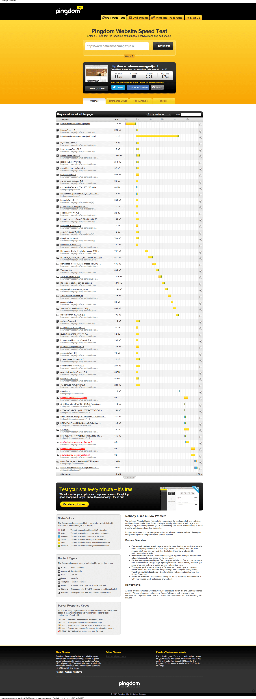
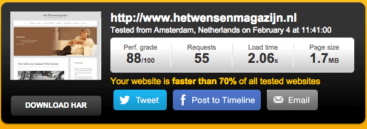
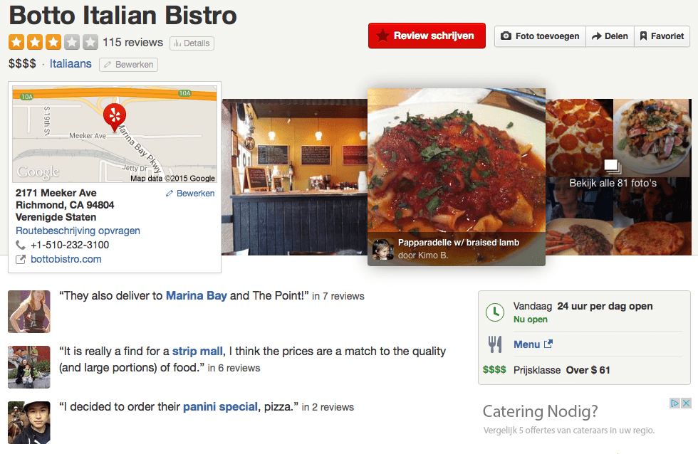

> **Historisch archief.** Deze aflevering verscheen op 5-02-2015 als onderdeel van ReputatieCoaching (2012–2016). De oorspronkelijke tekst is hieronder historisch bewaard. Diensten, contactgegevens, links, tools en adviezen kunnen inmiddels verouderd zijn.



**Transcriptiestatus:** Volledige transcriptie uit het oorspronkelijke archief.

\*\*[*Historische afbeelding niet beschikbaar: ReputatieCoaching Podcast*](https://www.reputatiecoaching.nl/wp-content/uploads/2012/12/Reputatie-Coaching-Podcast-logo-200x200.jpg)Afgelopen week heb ik een tweetal instructievideo’s gemaakt om de laadtijd van je website te meten en te verbeteren of te versnellen. Daarover zometeen meer. Luisteraar Chris kwam bij mij, omdat zijn site zo traag was. Hoe ik dat heb opgelost, vertel ik je zo. Soms gebruik ik een CDN, dat is de afkorting voor Content Delivery Network voor websites en ik vertel je kort iets over Amazon Cloudfront.\*\*

**Ik wil meer webinars gaan organiseren, waarin ik in ga op vragen of problemen van luisteraars. Dus blijf mij mailen en bellen met je problemen en vragen! Verder heb ik nog twee terugblikken die ik je vorig jaar al had toegezegd en een interview met Bill Tancer, de wereldwijde reviewexpert en New York Times bestselling auteur. Als laatste onderwerp voor vandaag heb ik een nieuwtje waar jij als lokaal opererende ondernemer of zorgverlener je voordeel mee kunt doen!**

Hallo en hartelijk welkom bij deze aflevering van de ReputatieCoaching Podcast. Ik ben Eduard de Boer, ReputatieCoach. Ik leer je hoe je je online zichtbaarheid, vindbaarheid en je online reputatie kunt verbeteren, waardoor je als bedrijf meer business kunt doen.

De podcast kun je vinden op [www.reputatiecoaching.nl/114](https://www.reputatiecoaching.nl/114/). Daar vind je niet alleen de tekst, maar ook video’s waar ik het in deze uitzending over heb, alsmede afbeeldingen, links enzovoorts. Bovendien is de podcast te beluisteren in [iTunes](https://www.reputatiecoaching.nl/itunes) en op [Stitcher](https://www.reputatiecoaching.nl/stitcher). Daar kun je je dus ook abonneren op de wekelijkse podcast.

Laat ik dan nu overgaan op de onderwerpen voor vandaag…

## Laadtijd van je website meten en verbeteren of versnellen

Zoekmachines bieden mensen die op zoek zijn naar informatie, graag de sites met de beste gebruikerservaring. Daarvoor gebruikt Google honderden factoren die allemaal in meer of mindere mate een rol spelen.

Een onderdeel van de gebruikerservaring is de tijd die het kost, tot een webpagina wordt vertoond nadat iemand de URL heeft ingetypt of op een link heeft geklikt. Dat noemen we de laadtijd van een pagina. Je wilt de laadtijd van de pagina’s op je site natuurlijk dus zo laag mogelijk houden. Er wordt vaak gesproken over een maximale laadtijd van zo’n 2 seconden…

Liever nog heb je een laadtijd van minder dan een seconde. Reden hiervoor is dat mensen steeds ongeduldiger worden en ze dus steeds minder lang willen wachten op content. Als die niet op tijd verschijnt, klikken ze de “Back”-knop en gaan ze naar je concurrent toe, van wie de site mogelijk wel snel laadt.

Of de laadtijd nu wel of geen rankingfactor is bij Google maakt niet uit. Je wilt dat je site zo snel mogelijk is. Maar om te weten of er voor jou werk aan de winkel is om de performance van je site te verbeteren, moet je eerst meten hoe snel je site is en onderzoeken waar je mogelijk verbeteringen kunt doorvoeren.

Afgelopen week heb ik daarvoor twee instructievideo’s gemaakt. De eerste video laat zien hoe je de snelheid van je site meet met behulp van de Website Speed Test van Pingdom. Deze video heb ik in de show notes opgenomen:

Een andere nuttige tool is PageSpeed Insights van Google. Ook de instructievideo waarin ik laat zien hoe je die moet gebruiken, heb ik voor je opgenomen in de transcriptie:

## Vraag van Chris: Help mijn site is traag!

Dat deed Chris ook. Hij stuurde mij een tijdje geleden de vraag of ik eens kon onderzoeken hoe het kwam dat de site van zijn vrouw zo traag is. Dus begon ik, zoals ik eigenlijk altijd begin met het onderzoeken van een trage website, ook met het testen van de site in de Pingdom Website Speed Test.

Ik zag onder de tab “History”, dat iemand deze site al eens eerder had getest, namelijk op 31 december. Toen was de laadtijd nog 13,7 seconden. Maar dat bleek te komen door een afbeelding die veel te groot was geüpload naar de webserver en daardoor maar liefst 12 MB groot was. Dat had vanzelfsprekend een enorm negatieve impact op de laadtijd.

Ik testte de performance van de site vanuit Amsterdam, omdat het een Nederlandstalige site is en de kans dus erg groot is dat meer dan 99% van de bezoekers uit Nederland zal komen. Dit leverde mij de statistieken die je in de show notes kunt zien:

[](https://lh5.googleusercontent.com/-n5kwBmiHN3c/VNNl5ssruoI/AAAAAAAABvk/Ut7MkhhdGys/w605-h213-no/20150204-pingdom-wensenmagazijn-ams.png)

De pagina laadde in 2,06 seconden. Nog steeds waren alle componenten voor de site (dus de HTML, Javascript, CSS en afbeeldingen) bij elkaar goed voor 1,7MB. Dat vind ik eigenlijk teveel.

Wat ook hier meteen weer bleek, was de ballast van de foto’s. Ik heb een paar grote foto’s gedownload en met behulp van [compressor.io](http://compressor.io) gekeken hoeveel daarop valt te bezuinigen, zonder kwaliteitsverlies. De foto’s die ik had gedownload waren bij elkaar 714 kilobyte en na ze te hebben verkleind met behulp van compressor.io waren ze nog maar 473 kilobyte. Dat scheelt in één keer 241 kilobyte, ofwel 14% van de totale omvang van alle content van de voorpagina!

Verder zag ik dat de officiële Mailchimp plugin wel was geïnstalleerd en geactiveerd, maar niet werd gebruikt, dus die heb ik gedisabled, daardoor was ik ook weer een erg vertragend component kwijt.

Vervolgens heb ik de [W3 Total Cache plugin](https://wordpress.org/plugins/w3-total-cache/) geïnstalleerd en geconfigureerd. Na wat te hebben gespeeld met de instellingen kwam ik op een laadtijd van 979 milliseconden.

[](https://lh3.googleusercontent.com/-2M2XpcWraVg/VNNl5un9DfI/AAAAAAAABu0/eY77jelebe4/w605-h213-no/20150204-pingdom-wensenmagazijn-ams-979msec.png)

Dus binnen 3 minuten rommelen had ik de laadtijd teruggebracht naar minder dan een seconde. Alleen variëren de resultaten van de metingen erg: de ene keer zit ik onder de seconde en de andere keer duurt het soms nog een paar seconden voor een pagina is geladen.

Als ik zo de resultaten van Pingdom bekijk valt er niet meer eer aan te halen. Want de beperkende factor is nu de tijd die de webbrowser moet wachten op data. Die vertraging zit aan de kant van de hostingprovider, waar de webserver staat. Mijn gevoel zegt dat die server lichtelijk overbelast is met een groot aantal sites, waarvan deze website dus hinder ondervindt:

[](https://lh4.googleusercontent.com/-rebccc6HTfc/VNNl6O6Vj6I/AAAAAAAABu8/bfBFXY-SoLU/w964-h308-no/20150204-pingdom-wensenmagazijn-waterval-2.png)

In het plaatje dat ik heb opgenomen in de show notes zie je allemaal gele balkjes… dat is tijd dat de server van Pingdom in Amsterdam moet wachten… Gedurende die tijd gebeurt er dus niets… Moet je je voorstellen hoeveel sneller de site zou kunnen zijn, als de server waarop de site draait, de data sneller zou aanbieden en je dus geen 329 milliseconden voor niets zou hoeven te wachten!

En dat is alleen nog maar de wachttijd voor de HTML van de voorpagina. De wachttijd bij alle andere onderdelen is ook groot. Als je de Page Analysis bij Pingdom bekijkt, zie je dat 86,61% van alle tijd, wachttijd is. Dat is gewoon veel te veel! Dat je af en toe moet wachten is logisch, maar ruim 86% van de totale tijd is onacceptabel.

[](https://lh5.googleusercontent.com/-5zR2KdzuoA8/VNNl5nqRS5I/AAAAAAAABvc/ZC4vfhbqkJc/w966-h752-no/20150204-pingdom-wensenmagazijn-pageanalysis.png)

Als je de content van de site zou verhuizen naar een snellere server en daarnaast gebruik zou maken van een CDN, een Content Delivery Netwerk, dan verwacht ik dat de laadtijd onder de halve seconde te brengen valt.

## Amazon Cloudfront als CDN

Ik heb het al eens verteld: ik gebruik Amazon Cloudfront als Content Delivery Network, dikwijls in combinatie met Google+. De standaard website bestanden worden geüpload naar de webserver, die ze doorzet naar Amazon, en de meeste afbeeldingen vertoon ik op de website vanaf Google+.

Een maandje geleden heb ik geëxperimenteerd met MaxCDN als Content Delivery Network, maar daar was ik niet zo tevreden over. De minimale kosten waren zelfs ook nog hoger dan die van Amazon en ik vond de performance van de site minder goed. Dat was niet alleen een gevoelskwestie, maar diverse meetresultaten met de Pingdom Website Speed Test gaven ook duidelijk aan dat MaxCDN trager was dan Amazon.

Wil jij ook je website versnellen door gebruik te gaan maken van Amazon Cloudfront, maar je hebt geen idee hoe je dat moet doen? Neem dan contact met me op via de website of één van de andere kanalen die ik je aan het einde van deze podcast vertel.

Vaak kun je een tijdje gratis gebruik maken van de dienst om diverse tests uit te voeren om te zien of het een verbetering voor je site oplevert. En voor de eventuele additionele kosten hoef je het niet te laten. Ik betaal voor de diverse sites waar ik Cloudfront voor gebruik, in totaal per maand minder dan US$ 10.

## Webinars over problemen en vragen van lezers en luisteraars

[*Historische afbeelding niet beschikbaar: Webinar Internetmarketing voor Fotografen*](https://www.reputatiecoaching.nl/wp-content/uploads/2014/12/Webinar.png)De feedback op de serie van vijf webinars over “Internetmarketing voor Fotografen” was ver boven verwachting. De mensen die de webinars hebben gekeken waren vol lof over de content en de kwaliteit van de inhoud. Ze hebben er allemaal veel van opgestoken en de eerste successen worden nu ook geboekt.

Het leuke is dat twee fotografen inmiddels vanuit de kelder van de lokale resultaten bijna in het 7-pack staan. Dat is het lijstje met zeven lokale bedrijven, gelabeld “A” tot en met “G”.

Naast dat de deelnemers erg positief erover waren, vond ik het ook erg leuk om voor te bereiden en om de presentaties te geven. Wat de meeste mensen echter niet wisten, was dat we na afloop van elk webinar ook nog een soort van online afterparty hadden, waarin nog meer kennis werd uitgewisseld!

Ergo… dit smaakt naar meer… Dat zei ik laatst ook al. Daarom heb ik het verzoek aan jullie: stuur mij al je vragen, problemen, obstakels etc. waar jij tegenaan loopt bij het verder uitbouwen van jouw website. Blaas mijn mailbox vol met vragen en toeter je problemen op de ReputatieCoaching Hotline. Zo weet ik wat er bij jullie speelt en zo kan ik telkens webinars organiseren met leuke, leerzame onderwerpen en problemen die jullie raken!

Mijn idee is om half maart het eerste webinar te organiseren, dus maak mij deelgenoot van je problemen, vragen en andere online ellende. Ik ga dan een planning van de webinars maken en de onderwerpen en vragen inplannen.

Kom op! Je hebt vorige week al gehoord dat Herman uit Hazerswoude zijn problemen bij mij heeft neergelegd en deze week was het Chris die mij om hulp vroeg. Je ziet het: ik ben hier echt om jou te helpen!

## Terugkoppeling “Haat ons restaurant”

Herinner je je nog het restaurant “Botto Italian Bistro” uit [podcast 95](https://www.reputatiecoaching.nl/95/)? Toen vertelde ik dat dat restaurant het niet eens is de praktijken van Yelp in de Verenigde Staten die bijna lijken op chantage en daarom iedereen vraagt het restaurant te haten op Yelp en te beoordellen met slechts één ster.

In podcast 95 had het restaurant op Yelp maar liefst 1.111 reviews en had het inderdaad maar één ster. Het is duidelijk dat Yelp heeft ingegrepen, want toen ik zojuist ging kijken zag ik dat het restaurant op dit moment op Yelp slechts 115 reviews heeft met een gemiddelde score van drie sterren:

[](https://lh6.googleusercontent.com/-TkY9Mk683mg/VNNl7YjWkTI/AAAAAAAABvY/nwFWqT1MPvg/w980-h638-no/20150205-yelp-botto-italian-bistro-compressor.png)

Dus het lukt de eigenaar van het restaurant blijkbaar niet om op die gemiddelde score van één ster uit te komen. Op Google heeft het restaurant sinds september 2014 drie reviews erbij gekregen, waarmee het nu op dertien reviews zit. De gemiddelde score is gestegen met 0,1 punt naar een 4,7 uit 5:

[](https://lh4.googleusercontent.com/-2iRRpLrcas0/VNNl6xqhwrI/AAAAAAAABvI/Hj5OSwwf_5I/w453-h355-no/20150205-google-botto-italian-bistro.png)

Wat kunnen we uit dit alles leren? Laten we het eens langslopen…

Het is moeilijk de reviews op een overdreven manier te beïnvloeden… Zodra Yelp er lucht van krijgt, grijpt het bedrijf in. Ik vind dat terecht vanuit mijn achtergrond: je hoort op generlei wijze een vertekend beeld te creëren met je reviews: niet overdreven positief, maar ook niet negatief. Reden is, dat je hierdoor mogelijk ook voor een lokale buurt of een regio het beeld kunt vertekenen en andere bedrijven in alle ontwetendheid schade berokkent.

Je kunt iedereen blijven vragen om 1-ster reviews, maar de Yelp community wil graag trouw blijven aan de ware spirit van Yelp: eerlijke, interessante en waardevolle reviews. Dus je krijgt niet iedereen zover dat hij of zij een 1-ster review plaatst.

Dat blijkt wel uit het intro van een Yelpie die ook 25 andere reviews online heeft. Zij schrijft: “*Like other reviewers have said, I don’t want to give this place 1 star just because the owner is trying to be spiteful. I was tempted to do as another reviewer did and give it an ironic 5 star rating but I decided to do a truthful review as I have benefited from many honest Yelpers in the past.*”.

En een andere Yelpie schreef: “*What the heck. Yelp decided to delete my previous first hand real dining experience at this place. Not sure how it was considered to be outside the yelp guidelines since it was a real review consisted of a review of their food, atmosphere, and customer service. Wish I saved a copy of my review.*”

En een Elite 2015 Yelpie met 485 reviews op zijn konto schreef het volgende intro: “*Due to the recent anti-Yelp campaign and questionable publicity tactics from the owners of Botto, I’m giving them a “tongue in cheek” 5 star “update” rating. (It’s really a 3-star place) I’m not interested in their meal discount bribe in exchange for a 1-star rating, and most importantly, for over 4 years, HONEST Yelp reviews have almost never led me wrong in choosing a restaurant or business.*”

Op die manier houdt Yelp haar site waardevol. Want als meer ondernemers dit soort praktijken erop na zouden houden, dan zou Yelp de dienst wel kunnen sluiten.

Tenslotte wil ik ten sterkste benadrukken dat dit incident, waar de restauranthouder met zijn actie de aandacht op probeert te vestigen, behoorlijk op zichzelf lijkt te staan. Als je online gaat zoeken naar soortgelijke problemen met Yelp, dan vind je er wel het één en ander over… Echter, al die meldingen komen uit de Verenigde Staten; in Nederland heb ik hier nog nooit van gehoord.

## Terugkoppeling analyse bandenbedrijf uit Apeldoorn

Dan een andere terugkoppeling die ik je nog schuldig was vanuit een podcast van vorig jaar. In [podcast 96](https://www.reputatiecoaching.nl/96/) van 2 oktober 2014 vertelde ik je dat ik een korte analyse had gedaan van de site van een autobandenbedrijf uit Apeldoorn. Ook zou ik toen nog eens een avond op bezoek gaan om wat ideeën door te spreken. Daar is het door diverse omstandigheden nooit van gekomen en die afspraak is verplaatst naar het voorjaar. Dus dat is uitgesteld en hou je nog van me tegoed.

## Interview met Bill Tancer

Laat ik meteen duidelijk zijn: ik heb zelf Bill Tancer niet geïnterviewd. De vragen en antwoorden die ik je hier geef las ik gisteren in een artikel op Marketing Land, in het artikel “[What Brands Need To Know About Online Reviews: 5 Questions With NYT Bestselling Author Bill Tancer](http://marketingland.com/brands-need-know-online-reviews-5-questions-nyt-bestselling-author-bill-tancer-116921)”.

[[Historische afbeelding: Bill Tancer: Everyone’s a Critic](https://lh5.googleusercontent.com/-nZxqKOPxFMI/VNNl7gBN22I/AAAAAAAABvU/Lvvmf6-D7YU/w800-h450-no/Bill-Tancer-SMX-Keynote-compressor.jpg)](https://lh5.googleusercontent.com/-nZxqKOPxFMI/VNNl7gBN22I/AAAAAAAABvU/Lvvmf6-D7YU/w800-h450-no/Bill-Tancer-SMX-Keynote-compressor.jpg)

Bill Tancer wordt wereldwijd gezien als DE autoriteit op het gebied van online reviews. Oktober vorig jaar kwam zijn boek “Everyone’s a Critic: Winning Customers in a Review-Driven World” uit. Bill is een New York Times bestselling auteur, dus dat wil wel wat zeggen.

In het artikel op Marketing Land staan een paar interessante uitspraken van Tancer, voorafgaand aan het interview:

```
  * “Meer dan 80% van de consumenten bekijken online reviews, voordat ze besluiten een bepaald product of een specifieke dienst aan te schaffen.”
  * “Reviews spelen ontegenzeggelijk een cruciale rol bij aankoopbeslissingen.”
  * “Bedrijven of merken die reviews negeren, missen de boot.”
  * “Geen enkel ander sociaal medium is zo invloedrijk als online reviews.”
  * “Veel bedrijven deinzen terug voor online reviews omdat het buiten hun invloedssfeer lijkt.”
```

Dan geef ik je nu een samenvatting van de vragen en antwoorden van het interview, dat is afgenomen door Amy Gesenhues…

**V**: “Wat kunnen bedrijven maar niet begrijpen aan online klantgedrag?”

**Bill Tancer**: “Samenvattend kun je stellen als online klantengedrag nauwlettend wordt bestudeerd en geanalyseerd, dit waardevolle inzichten kan geven in hoe consumenten aankoopbeslissingen nemen.

Tot op de dag van vandaag vertrouwen marketeers op hun buikgevoel ten aanzien van besluiten over marketingacties, maar hun kansen worden aanzienlijk vergroot, als deze besluiten worden gevoed door waargenomen klantgedrag.

De grootste fout van de meeste bedrijven is dat ze niet actief bezig zijn met reviews.

Als je kijkt naar een gepaste reactie, een ongepaste reactie of helemaal geen reactie op een negatieve review, dan blijkt dat de reputatie van een bedrijf het meest wordt geschaad door het uitblijven van een reactie op een review, oftewel reviews negeren.”

**V**: “Kun je uitleggen hoe slechte reviews goed kunnen zijn voor bedrijven?”

**Bill Tancer**: “De belangrijkste reden dat bedrijven reviews negeren, is dat de meeste mensen moeite hebben met het omgaan met kritiek. Onderzoek van de Universiteit van New York heeft uitgewezen dat slechte reviews goed kunnen zijn voor een bedrijf, in het bijzonder als die negatieve reviews geen regelrechte showstoppers of dealbreakers zijn.

Een paar negatieve of minder goede reviews geven meer geloofwaardigheid aan een bedrijf, want alleen maar positieve reviews lijkt al snel fake.”

**V**: “Welke merken of bedrijven snappen het wel en welke missen op dit moment de boot volgens jou?”

**Bill Tancer**: “Ik denk dat Sephora het bedrijf is dat het beste begrijpt hoe het moet omgaan met reviews. (Even ter informatie van mij: Sephora is een Amerikaans bedrijf dat zowel vanuit fysieke winkels, als online makeup en andere producten voor persoonlijke verzorging verkoopt).

Sephora gebruikt online reviews om de kloof tussen online en offline te dichten. In sommige van haar fysieke winkels heeft het bedrijf touchscreens staan, waarin klanten die de winkels bezoeken, kunnen bladeren door online reviews van producten.

Recent onderzoek wijst uit dat consumenten meer waarde hechten aan online reviews, dan aan meningen van het verkopend personeel in een winkel. Gecombineerd met het feit dat online reviews op de website van een retailer helpen bij online conversie, is deze offline publicatie van online reviews een geniale zet.

Er zijn nog steeds retailbedrijven die niet eens reviews op hun productpagina’s hebben geactiveerd.

Als je weet dat het tonen van reviews op je site de conversie met 3 tot 5 procent kan verhogen, dan laat je als bedrijf dus veel geld links liggen.”

**V**: “Wat vind je het meest fascinerend aan hoe klanten online communiceren met bedrijven?”

**Bill Tancer**: “Ik denk de motivatie van consumenten om online reviews te schrijven. Terwijl ik het boek schreef had ik het voorrecht om een aantal verschillende reviewers te interviewen, variërend van Yelp Elite, tot TripAdvisor’s top reviewers en de nummer 1 reviewer op Amazon.com.

Wat ik fascinerend vond was wat deze mensen bewoog om zo veel tijd te spenderen aan het schrijven van reviews. Ik ontdekte dat hun beweegredenen erg verschilden. Zo wilde de ene reviewer iets onterechts corrigeren, een andere wilde iets delen met de community, weer een ander wilde een bepaald statusniveau bereiken en voor anderen is het simpelweg een manier om hun creativiteit te ontplooien.

De meeste bedrijfseigenaren die ik heb gesproken bleken geen idee te hebben van deze verschillende motivaties.”

**V**: “Welke ontwikkelingen zie je ten aanzien van hoe consumenten de dialoog aangaan met bedrijven en hoe zal dit van invloed zijn op de manier waarop bedrijven zakendoen?”

**Bill Tancer**: Hoewel het lezen van reviews een serieuze online activiteit is geworden, zal het schrijven van reviews ook toenemen, voornamelijk ingegeven door de sharing community.

Dit leidt tot een nog grotere waarde van online reviews en de noodzaak voor betere tools voor consumenten om online reviews te vinden en te vergelijken.

Tot zover de vijf vragen en antwoorden uit het interview. Ik kende het boek nog niet, maar heb het wel meteen gekocht en als e-book gedownload op mijn Kindle e-reader.

## Verhoog je online zichtbaarheid en laat je citations creëren door de specialist: jouw eigen ReputatieCoach!

Dat reviews belangrijk zijn blijkt dus wel. Daarmee bouw je aan je online reputatie. Natuurlijk wil je tegelijkertijd werken aan je online zichtbaarheid om zo ook beter gevonden te kunnen worden.

Als je de podcast trouw beluistert, dan weet je hoe belangrijk het is om zoveel mogelijk vermeldingen van je bedrijfsnaam, adres, postcode, plaats en telefoonnummer te hebben op zoveel mogelijk sites.

En als je daar überhaupt ooit al mee bent begonnen, dan weet je ook hoeveel werk het is! Je moet zóveel onderzoeken, opzoeken, corrigeren, registeren, administreren en bevestigen, dat je al snel je buik ervan vol hebt.

Ik bied je vanaf volgende maand de oplossing! Want dan kan ik dat voor je doen!

Ben je ondernemer? Heb je een winkel of restaurant? Heb je een praktijk als zorgverlener? Ben je vooral afhankelijk van klanten, gasten of patiënten uit de buurt of de regio en wil je groeien?

Neem dan nu alvast contact op voor meer informatie over deze dienst die uniek is in Nederland!

Na het invullen van een korte vragenlijst en een overleg op Skype ga ik voor jou aan de slag met het massaal creëren van citations en zo mijn best voor jou doen om jouw bedrijf omhoog te helpen in de lokale zoekresultaten om er zo voor te zorgen dat je veel meer verkeer naar je site krijgt.

Wacht niet te lang. De belangrijkste reden hiervoor is dat ik maar één ondernemer of zorgverlener van elk type per plaats kan helpen. Dus per plaats of stad kan ik slechts één tandarts, één bloemist, één trouwlocatie, één restaurant, één fysiotherapeut of opticien en dergelijke helpen. Want er is maar plaats voor één vermelding aan de top. Bovendien kan ik natuurlijk niet tegen mijzelf gaan concurreren!

Dus, als jij er ook van overtuigd bent dat je naar de top van de lokale zoekresultaten moet stijgen, neem dan contact op. Dan kan ik je vertellen of ik mogelijkheden zie, wat het ongeveer gaat kosten enzovoorts… Nogmaals: wacht niet te lang!

En met deze kleine commercial kom ik dan aan het einde van deze podcast. Ik hoop dat je ook hier weer wat van hebt opgestoken. Laat me eens weten wat jij uit deze podcast hebt meegenomen om iets mee te doen in jouw bedrijf! Reageer onderaan de show notes op [www.reputatiecoaching.nl/114](https://www.reputatiecoaching.nl/114/).

Als je de podcast leuk vindt en je wilt nog meer op de hoogte blijven, volg me dan ook op Twitter, via [@reputatiecoach1](https://twitter.com/reputatiecoach1).

Heb je inderdaad wat aan alle informatie die ik met je deel, help mij dan met het verder verbeteren en promoten van deze podcast. Surf daarvoor naar [iTunes](https://www.reputatiecoaching.nl/itunes) of [Stitcher](https://www.reputatiecoaching.nl/stitcher), geef de podcast een sterrenbeoordeling en laat ook je reactie achter. Door de podcast te beoordelen op iTunes en/of Stitcher breng je de podcast onder de aandacht van een breder publiek.

Je kunt me verder helpen, door de podcast aan te bevelen bij vrienden of collega’s, waarvan je denkt dat ze er hun voordeel mee kunnen doen, of door ’m te delen op Twitter, like’n en delen op Facebook of een “+1” te geven op Google+.

En vergeet niet: ik ben hier om je te helpen! Als je een vraag of een probleem hebt met betrekking tot je online reputatie of de vindbaarheid van je website, kun je een mailtje sturen naar [podcast@reputatiecoaching.nl](mailto:podcast@reputatiecoaching.nl).

Als je dat te lastig vindt, of als je de podcast beluistert terwijl je in de auto zit en je hebt acuut een vraag, spreek dan een boodschap in op de ReputatieCoaching Hotline, op nummer: 084 - 883 15 56. Mogelijk behandel ik je vraag of probleem dan in een artikel of in de podcast.

En je kunt ook rechtstreeks op de website een voicemail achterlaten, door op de tab aan de rechterkant van elke pagina te klikken, en je bericht in te spreken. Dit was [ReputatieCoaching Podcast aflevering 114](https://www.reputatiecoaching.nl/114/) en mijn naam is [Eduard de Boer](http://nl.linkedin.com/in/eduarddeboer/nl).

Ik wens je de komende week weer succes met het werken aan je reputatie, zodat je meteen je reputatie voor jou kunt laten werken!

Tot volgende week!

Doei!

Links naar content die in deze podcast aan bod komt:

```
  * [ReputatieCoaching Podcast in iTunes](https://www.reputatiecoaching.nl/itunes)
  * [ReputatieCoaching Podcast op Stitcher](https://www.reputatiecoaching.nl/stitcher)
  * [ReputatieCoaching Podcast RSS-feed](https://feeds.reputatiecoaching.nl/ReputatieCoachingPodcast)
  * [W3 Total Cache Plugin voor WordPress](https://wordpress.org/plugins/w3-total-cache/)
  * “[What Brands Need To Know About Online Reviews: 5 Questions With NYT Bestselling Author Bill Tancer](http://marketingland.com/brands-need-know-online-reviews-5-questions-nyt-bestselling-author-bill-tancer-116921)” (Marketing Land, 4 februari 2015)
```
