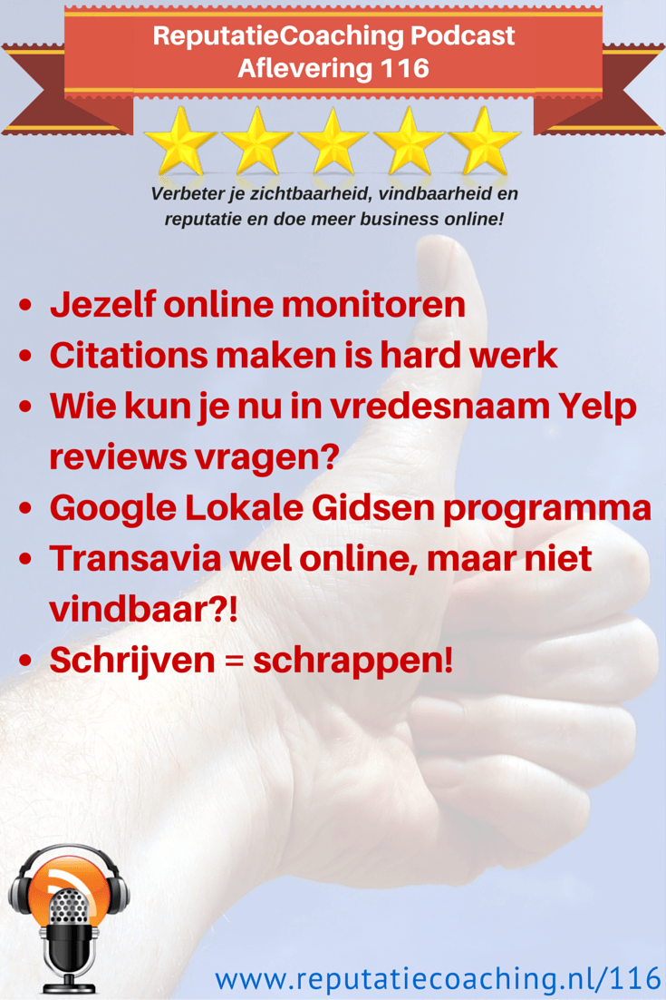
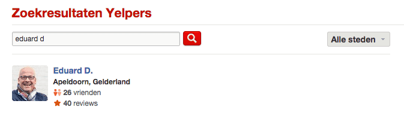
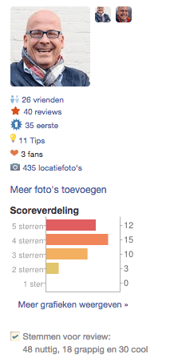
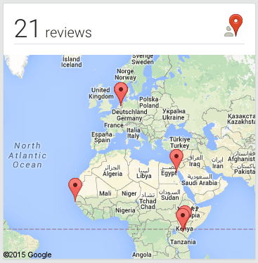

> **Historisch archief.** Deze aflevering verscheen op 19-02-2015 als onderdeel van ReputatieCoaching (2012–2016). De oorspronkelijke tekst is hieronder historisch bewaard. Diensten, contactgegevens, links, tools en adviezen kunnen inmiddels verouderd zijn.



**Transcriptiestatus:** Volledige transcriptie uit het oorspronkelijke archief.

**
Een paar dagen geleden praatte ik kort bij met Diana Albrink. Daarover vertel ik je zometeen het een en ander. Het tweede onderwerp gaat over het maken van citations of bedrijfsvermeldingen en hoeveel werk dat is. Wat ook een lastig karwei is, is reviews op Yelp verzamelen, die blijven staan. Daar heb ik zometeen wat tips voor. Vorige week vertelde ik je over Google Local Guides / Lokale Gidsen. Vlak daarna kreeg ik mail van Google over het programma.**

**Transavia communiceert via WhatsApp en heeft een nieuwe website die zoekmachinetechnisch “offline” is. Snap jij het nog? Ik vertel je er meer over in deze podcast… Tenslotte is het kopje van het laatste onderwerp: “Schrijven is schrappen”. Daarin vertel ik over het zinloos gebruik van bijwoorden en geef ik je 11 praktische tips voor het schrijven van betere teksten.**

Hallo en hartelijk welkom bij deze aflevering van de ReputatieCoaching Podcast. Ik ben Eduard de Boer, ReputatieCoach. Dit is dé podcast die jou helpt meer business te genereren, doordat jouw website beter gevonden wordt, zowel lokaal als landelijk en doordat ik je uitleg hoe je je online reputatie kunt verbeteren. Dit alles helpt je jouw bedrijf en jezelf beter op de online kaart te plaatsen.

De podcast kun je vinden op [www.reputatiecoaching.nl/116](https://web.archive.org/web/20150312092025/http://www.reputatiecoaching.nl/116/). Daar vind je niet alleen de tekst, maar ook video’s waar ik het in deze uitzending over heb, alsmede afbeeldingen, links enzovoorts. Bovendien is de podcast te beluisteren in iTunes, op Stitcher en op [TuneIn Radio](http://tunein.com/radio/ReputatieCoaching-Podcast-p655084/). Ik raad je aan je op één van die drie kanalen te abonenneren op de podcast, zodat je geen aflevering hoeft te missen!

Laat ik dan nu overgaan op de onderwerpen voor vandaag…

## Jezelf online monitoren

Eerder deze week sprak ik weer eens met Diana Albrink, de auteur van het boek “New York in 40 dates” dat in juni uitkomt. Zij was blij met de tip die ik haar had gegeven in [podcast 115](https://web.archive.org/web/20150312095417/http://www.reputatiecoaching.nl/115/) over het installeren van de plugin “Jetpack for WordPress”. Want nu konden mensen zich tenminste abonneren op nieuwe artikelen die ze op haar site publiceert. Ze heeft dus niet voor de route via Mailchimp en een RSS-campagne gekozen.

Maar de huidige oplossing werkt prima voor haar! Ze was blij dat ze opeens de voor haar bekende functionaliteit van wordpress.com erbij kreeg.

In de aanloop van de publicatie van haar eerste boek had ik nog een praktische tip voor haar. Zet alle diensten in, die je gratis kunt gebruiken voor het online monitoren op basis van zoektermen. Dus denk aan:

```
  1. [Google Alerts](https://www.google.com/alerts)
  2. [Talkwalker Alerts](http://www.talkwalker.com/)
  3. [Mention](https://en.mention.com/)
```

Google Alerts is gratis, maar de andere twee bieden naast gratis monitoring bovendien commerciële monitoring aan. Voor Diana volstaan de gratis versies van zowel Talkwalker als Mention.

Ik raadde haar aan nu reeds alerts in te gaan stellen. En dan niet alleen voor haar naam, maar ook voor de titel van haar boek! Reden hiervoor is dat zodra er straks online over Diana of haar boek wordt geschreven, zij hier direct van op de hoogte wordt gesteld. Zo kan ze adequaat reageren op wat er links en rechts wordt gepubliceerd.


Daarnaast kan ze recensies en dergelijke zo snel vinden vlak nadat ze online zijn verschenen en daarvan stukken overnemen op haar site, of naar verwijzen vanuit blogartikelen. Hierop voortbordurend heb ik haar aangeraden een aparte categorie aan te maken voor de blogartikelen, iets in de trant van “In de media”.

De website van haar boek is inmiddels live. Die kun je dus vinden op [newyorkin40dates.nl](http://newyorkin40dates.nl). Daar publiceert Diana elke week een additioneel artikel met meer achtergrondinformatie over New York.

## Citations maken is hard werk

Als je er al eens mee bezig bent geweest dan weet je hoeveel werk het is citations aan te maken. Voor een cursus die ik aan het ontwikkelen ben, maak ik op dit moment een groot aantal extra instructievideo’s over hoe je op verschillende websites citations kunt aanmaken. Maar het is hard werk en loopt soms moeizaam. Dat ervaar ik elke dag weer.

Zo is op sommige sites de mogelijkheid je aan te melden heel goed verstopt, ofwel: heel klantonvriendelijk ergens onderaan of op een diepliggende pagina klein vermeld in een hoekje etc. Sommige sites halen automatisch hun gegevens van bijvoorbeeld de Kamer van Koophandel en die kun je dus niet wijzigen.

Weer andere sites sturen je een kaartje met een PIN-code, andere zeggen toe je te mailen, maar dat duurt soms twee weken, tot je een mail krijgt.

Je moet dus een gedegen administratie bijhouden, de mogelijkheid hebben opvolgacties te registreren, gebruikersnamen en wachtwoorden op te slaan en dergelijke.

En je moet continu op zoek naar nieuwe sites waar jij je bedrijf kunt aanmelden. Want als je een tijdje je collega’s die in de lokale resultaten worden vertoond, niet in de gaten houdt, kan het zomaar zijn dat zij boven jou stijgen. Als zij namelijk op een aantal extra (en mogelijk nieuwe) sites bedrijfsvermeldingen aanmaken en jij niet, kan dat dus gevolgen hebben voor jouw vermelding in de lokale zoekresultaten!

Maar zoals Mart in de [vorige podcast](https://web.archive.org/web/20150312095417/http://www.reputatiecoaching.nl/115/) merkte, moet je toch echt eerst je citations opschonen. Daarvoor heb ik een werkinstructie geschreven. In de show notes op [www.reputatiecoaching.nl/116](https://web.archive.org/web/20150312092025/http://www.reputatiecoaching.nl/116/) vind je een link naar deze [Werkinstructie “opschonen citations”](https://web.archive.org/web/20150915133010/http://www.reputatiecoaching.nl:80/werkinstructie-opschonen-citations/).

En als je er aan toe bent citations of bedrijfsvermeldingen te gaan maken, raad ik je aan de Chrome-extensie “NAP Hunter Lite” te installeren en te gaan gebruiken. Hoe je die plugin gebruikt, kun je nog eens op je gemak nakijken in de instructievideo die ik in de show notes heb opgenomen:

## Wie kun je nu in vredesnaam Yelp reviews vragen?

*Historische afbeelding niet beschikbaar: Logo Yelp*
Pffff… Als je bezig bent geweest om voor je bedrijf reviews op Yelp te verzamelen weet je hoe moeilijk dat is. Ik heb een paar opdrachtgevers die hebben maar liefst 9 reviews op Yelp, maar die worden allemaal niet weergegeven! Dat komt doordat Yelp denkt dat ze spam zijn.

OK, van een aantal reviews snap ik dat ze worden tegengehouden door het spamfilter. Want die zijn bijvoorbeeld gepost door mensen die ooit een account op Yelp hebben aangemaakt en slechts één review hebben gepost. Verder is hun profiel zo goed als leeg, hebben ze geen of geen goede profielfoto’s en dergelijke.

Dus maar in het wilde weg mensen vragen reviews te posten op Yelp is zinloos, zowel voor jou, als voor je klanten of opdrachtgevers. Maar hoe moet je het wel aanpakken?

Ik zou het als volgt aanpakken… Exporteer je adressenbestand en importeer dat in bijvoorbeeld je Gmail- of Outlook.com account. Login op Yelp en ga op zoek naar vrienden. Kies je gewenste e-mail provider en controleer wie je allemaal kunt benaderen om Yelp-vrienden mee te worden. Zoek mensen die tenminste 10 vrienden hebben, een goede foto op hun profiel hebben en meer dan 10 reviews hebben gepost.

Benader die personen. Het maakt niet uit of het er slechts ééntje is, of een handje vol. Dat maakt echt niet uit! Want het gaat erom dat je reviews op de Yelp-pagina van je bedrijf krijgt, die blijven staan! Want daar heb je tenminste iets aan!



Je zou eens kunnen kijken naar de verdeling van de reviewscores: hoe beoordeelt die persoon standaard? Is het iemand die frequent 5 sterren geeft, of voornamelijk 4… of alleen maar 3 of minder sterren? Doe dus een beetje onderzoek naar de persoon die je een review wilt vragen.


Om dat te bekijken moet je doorklikken naar de profielpagina van iemand. Als je mijn profiel op [eduarddeboer.yelp.nl](http://eduarddeboer.yelp.nl) bekijkt, zie je bijvoorbeeld de volgende karakteristieken:

```
  * Op dit moment heb ik 26 vrienden op Yelp
  * Ik heb 40 reviews geschreven, waarvan ik bij 35 bedrijven de eerste Yelpie was die daar een review postte
  * Ik heb 11 tips gepost, heb 3 fans en heb in totaal 435 locatiefoto’s gepost
  * Van mijn 40 reviews waren er 12 die 5 sterren van mij kregen, 15 kregen er 4 sterren, 10 ontvingen 3 sterren en 3 bedrijven beoordeelde ik echt niet hoger dan 2 sterren.
  * Ik heb bovendien reviews van anderen beoordeeld. Zo heb ik er 48 bestempeld als nuttig, 18 als grappig en 30 als cool.
```

Ben jij trouwens al actief op Yelp? Of heb je je ooit eens aangemeld? Blaas eens wat nieuw leven in je Yelp-activiteiten. En als je het leuk vindt, kun je mij toevoegen als vriend. Het moet wel raar lopen als ik je aanvraag niet honoreer…

## Google Lokale Gidsen programma



Het “[Lokale Gidsen](https://www.youtube.com/watch?v=RRujRhxLBSE)”-programma van Google bestaat nu zo’n twee tot drie weken. Het is de wereldwijde opvolger van het “City Experts”-programma, dat tot voor kort in slechts een beperkt aantal steden in de wereld beschikbaar was.

En zoals ik je in de video van vorige week vertelde, heb ik me meteen aangemeld als “[Google Local Guide](https://web.archive.org/web/20190718121012/https://www.reputatiecoaching.nl/google-local-guides-google-lokale-gidsen-instructievideo/)”, toen ik erover las. Op dat moment had ik in totaal 10 reviews op mijn konto staan. Dat kon ik zien op mijn eigen Google+ pagina. Ondertussen heb ik voor diverse bedrijven reviews gepost en staat de teller op iets meer dan 20. In de show notes van deze podcast heb ik hier een afbeelding van opgenomen.

De paar uren nadat ik me had aangemeld voor het [“Lokale Gidsen”-programma](https://www.google.com/local/guides/?hl=nl) voelde ik me een beetje in de steek gelaten door Google… Of beter gezegd: “In het ongewisse gelaten.”. Want ik had me aangemeld, maar hoorde of las verder niets.

Maar een dag later, om 19:23 uur ontving ik de eerste mail van Google, waarin ik werd verwelkomd! Deze mail heb ik in de show notes weergegeven:

Omdat u al tussen de 5 en 49 reviews heeft geschreven, begint u nu als Lokale gids niveau 2. U beschikt daarmee over alle voordelen van niveau 1, plus de extra voordelen die beschikbaar zijn voor lokale gidsen van niveau 2.


```
  * U kunt via Hangouts contact leggen met smaakmakers, kenners en Googlers overal ter wereld
  * U kunt uw eigen bijeenkomsten voor lokale gidsen indienen voor promotie
  * U kunt uw profiel voltooien en u aanmelden als Betrouwbare tester van Google-producten en -functies voordat deze openbaar worden uitgebracht.
```

Schrijf reviews om een Lokale gids niveau 3 te worden en te profiteren van nog meer voordelen.

Yippeee!! Ik hoorde er dus vanaf dat moment echt bij! Iemand anders die ik had aangeraden zich in te schrijven ontving een paar uur later een soortgelijke mail.

Het leuke was dat ik vier minuten na de welkomstmail, weer een mail van Google kreeg. Dit keer met de tekst:

Omdat u uw vijfde review op Google heeft geschreven, bent u nu een Lokale gids niveau 2.

U kunt nog steeds profiteren van alle voordelen van niveau 1. Bovendien profiteert u van de aanvullende voordelen van Lokale gidsen niveau 2:


```
  * U kunt via Hangouts contact leggen met smaakmakers, kenners en Googlers overal ter wereld
  * U kunt uw eigen bijeenkomsten voor lokale gidsen indienen voor promotie
  * U kunt uw profiel voltooien en u aanmelden als Betrouwbare tester van Google-producten en -functies voordat deze openbaar worden uitgebracht.
```

Schrijf reviews om een Lokale gids niveau 3 te worden en te profiteren van nog meer voordelen.

Bedankt dat u lid bent van onze community. We hopen dat u deze prestatie met uw vrienden deelt.

Nou, dat laatste doe ik hierbij: het delen van deze prestatie met m’n vrienden of beter gezegd: “luisteraars van de podcast” en “lezers van het weblog”.

Afgelopen weekend was ik aan het bowlen en sprak ik Andreas op de bowlingbaan. Hij is een trouwe luisteraar van de podcast en een lezer van het blog. Hij had de video over het “[Google Lokale Gidsen](https://www.youtube.com/watch?v=RRujRhxLBSE)”-programma bekeken, maar hij vroeg zich af wat ondernemers hier aan hebben, zich in te schrijven als lokale gids.

Het korte antwoord is: “Niets”. Dus een ondernemer heeft er in eerste instantie niets aan om zich aan te melden als Lokale Gids en reviews te gaan posten. Maar waar je wel je voordeel mee kunt doen, is hetzelfde als ik zojuist over Yelp vertelde… Je kunt eerst kijken wie van je klanten of patiënten een Gmail-account hebben. Vervolgens zoek je van die mensen de Google+ pagina op en je kijkt hoeveel reviews ze hebben gepost en naar de algemene toon van hun reviews.

Als je iemand hebt gevonden die een aantal reviews heeft gepost, dan kun je die benaderen met de vraag of die persoon een review voor jouw product of dienstverlening wil posten op jouw Google+ bedrijfspagina.

Van Yelp is het bekend dat reviews door Elite Yelpies zwaarder meewegen dan reviews van de mindere goden op Yelp. Niemand buiten Google zelf weet of het aantal reviews dat een Google Lokale Gids heeft gepost bepalend is voor een stukje extra gewicht dat eraan wordt gegeven. En of dit nu of in de toekomst effect heeft op de ranking in de lokale zoekresultaten en mogelijk zelfs in de organische resultaten? Dat blijft koffiedik kijken…

Maar het kan nooit kwaad eerst de Lokale Gidsen met de meeste online reviews te benaderen met het verzoek een review te posten en zo de lijst af te lopen in volgorde van afnemend aantal geposte reviews.

Dit was het tot op heden over de Google Lokale Gidsen. Zodra ik meer nieuws heb, laat ik je het weer weten!

## Transavia wel online, maar niet vindbaar?!

Eerder deze maand las ik op Emerce dat [Transavia nu WhatsApp gaat inzetten voor haar klantenservice](http://www.emerce.nl/nieuws/transavia-zet-whatsapp-klantenservice), want volgens commercieel directeur Roy Scheerder verwachten klanten nog sneller reactie dan bij Twitter en Facebook. De reden dat Transavia ervoor kiest haar klanten te bedienen via WhatsApp, is dat WhatsApp zo groot is in Nederland.

Dat is een loffelijk streven. Teneinde haar klanten nog beter te bedienen heeft de vliegmaatschappij vorige week haar website totaal vernieuwd. Daarbij lag volgens Transavia de focus op conversieverbetering, passenger experience en de verkoop van andere producten dan vliegtickets. Bovendien is de website responsive en daardoor beter te bekijken op tablets en smartphones. Volgens haar eigen zeggen is het bedrijf twee jaar bezig geweest met de ontwikkeling van het nieuwe e-commerceplatform.

Ik kwam op Marketingfacts een leuk artikel tegen, geschreven voor @hendrikvanzwol. Als onlinemarketingconsultant was hij benieuwd in hoeverre Transavia heeft nagedacht over SEO en gerelateerde zaken.

Als eerste ging hij kijken hoeveel pagina’s van de site van Transavia waren geïndexeerd door Google. Dat bleken er 12.700 te zijn. Helaas voor Transavia heeft de webbouwer totaal andere URLs gegenereerd voor de nieuwe site, terwijl de oude URLs niet doorverwijzen naar de content op de nieuwe site. Hierdoor resulteren zo goed als alle Nederlandstalige en Franstalige pagina’s in een 404 “Page not found” error.

Tja, iemand is bij de livegang van de site ook nog eens vergeten de zoekmachines toegang te geven… In de HTML-code op de homepage van de site staat namelijk “noindex, nofollow”. Hierdoor worden zoekmachines totaal geblokkeerd voor de hele site. Als resultaat hiervan zal straks het aantal van 12.700 door Google geïndexeerde pagina’s gereduceerd worden tot eentje, namelijk de hoofdpagina. Daarbij komt als omschrijving in de zoekresultaten te staan dat als gevolg van “robots.txt” er geen omschrijving beschikbaar is.

Dit is een algemene beginnersfout. Het is logisch dat je tijdens de ontwikkeling zoekmachines geen toegang geeft tot je ontwikkelsite. Daardoor voorkom je dat deze ongewenste inhoud indexeren en ontsluiten. Maar een webbouwer die enigszins kijk heeft op de techniek zou in het draaiboek voor livegang van de site hiervoor een actie moeten hebben staan…

En iedereen weet dat titels voor pagina’s belangrijk zijn. Om als titel voor de homepage van een bedrijf als Transavia alleen “Homepage” te hebben, is bijzonder mager.

Verder zijn er fouten gemaakt bij het doorverwijzen van transavia.nl naar de .com-site. Als gevolg hiervan krijgen gebruikers allerhande wazige foutmeldingen over het feit dat wachtwoorden of creditcardgegevens niet veilig zijn enzovoorts. Dat zal veel bezoekers afschrikken en hen stimuleren een andere vliegmaatschappij te bezoeken.

Hendrik van Zwol heeft natuurlijk Transavia van al deze tekortkomingen op de hoogte gebracht en vervolgens wel geconstateerd dat bepaalde zaken zijn opgepakt en verbeterd.

Ik vraag me echter af hoe dit soort fouten gemaakt hebben kunnen worden. Ik neem toch aan dat Transavia geen webbouwer van de hoek van de straat heeft geplukt om de nieuwe site te maken, maar een gerespecteerd bedrijf. En dat zulke fouten worden gemaakt? Wauw! Ondenkbaar in deze tijd! Ik hoop voor de reputatie van dit bedrijf dat niet bekend wordt gemaakt, welk bedrijf het is…

## Schrijven is schrappen

Vrijwel iedereen kent de uitdrukking “Schrijven is de kunst van het schrappen”. En als je toch gaat schrappen, kun je dit samenvatten in: “Schrijven is schrappen”. Dit besprak ik al met Bea van de Bovenkamp in [podcast 30](https://web.archive.org/web/20150312092851/http://www.reputatiecoaching.nl/30/). Ook in het interview met Nathan Veenstra in [podcast 98](https://web.archive.org/web/20150312094937/http://www.reputatiecoaching.nl/98/) kwam dit aan bod.

Dit advies komt niet alleen van hedendaagse bloggers, maar dit soort uitspraken worden gedaan door bekende en wereldwijd gerespecteerde schrijvers als Mark Twain en Roald Dahl.

Voor “krachtiger” teksten adviseren zij bijwoorden waar mogelijk te schrappen. Zo las ik het volgende over bijwoorden, toen ik hier iets meer indook:

Ik betrap me er dikwijls op dat mijn teksten vol zitten met schrapbare bijwoorden. Ik geef je een voorbeeld: in de transcriptie van deze podcast heb ik een zoekopdracht gedaan naar het woordje “ook”. Dat heb ik maar liefst 34 keer kunnen schrappen, waardoor ik de tekst niet beperkter, maar juist zinniger, meer to-the-point en beter leesbaar heb kunnen maken.

Dus “ook” ik hanteer veelvuldig bijwoorden in zowel de podcast, als in blogberichten die ik schrijf. Daar ben ik me terdege van bewust, na me hier wat meer in verdiept te hebben. Ik geef je hier een lijstje van Nederlandse bijwoorden die je beter kunt schrappen uit je teksten:

```
  * dan,
  * om,
  * maar,
  * al,
  * dus,
  * te,
  * veel,
  * vaak,
  * ook,
  * vooral,
  * wel,
  * heel,
  * erg,
  * misschien,
  * eigenlijk,
  * tevens,
  * best,
  * wel,
  * wellicht,
  * zeker.
```

Zelf gebruikte ik in het verleden veelvuldig het woordje “om”. Om heeft feitelijk maar twee betekenissen waarin het kan worden gebruikt: 1) als voorzetsel in een zin als: “hij rijdt een rondje om de kerk” en 2) in de betekenis van “teneinde”, ofwel redegevend. Een voorbeeld hiervan is: “Jan doet elke avond tenminste 30 pushups om meer kracht te ontwikkelen voor het roeien”. In dit geval is “om” redegevend, het verklaart waarom Jan elke avond tenminste 30 pushups uitvoert. En je kunt “om” in deze zin vervangen door het woordje “teneinde”. Dus als je “om” hier schrapt, verliest de zin haar waarde.

Natuurlijk kon ik het niet nalaten de transcriptie voor deze podcast te doorzoeken op het woordje “om”. OK, ik moet je eerlijkheidshalve opbiechten dat ik het 28 keer probleemloos kon schrappen, zonder de zin te hoeven herschrijven. Verder heb ik het één keer vervangen door het woordje “teneinde”, waardoor de desbetreffende zinn opeens veel duidelijker en scherper is.

Ik ga de komende tijd mijn uiterste best doen mijn teksten nóg verder aan te scherpen door zoveel mogelijk zinloze bijwoorden weg te laten. Daardoor hoop ik dat ik het schrappen van bijwoorden tot een tweede natuur maak, waardoor mijn toekomstige teksten scherper, relevanter en meer “to-the-point” worden.

Zoals ik in het intro van dit onderwerp reeds vertelde: bekende schrijvers als Mark Twain en Roald Dahl zeggen dat je zoveel mogelijk moet schrappen. Mark Twain zegt hierover: “bijwoorden zijn het gereedschap voor de luie schrijver”.

Als antwoord op een brief met vragen van een student antwoordde Mark Twain:

En in 1980 schreef de toen 17-jarige Engelse literatuurstudent Jay Williams een brief aan Roald Dahl voor adviezen en tips met betrekking tot de schrijfkunst. Daarop ontving hij zowaar antwoord van Roald Dahl:

Ga op zoek naar de zinloze bijwoorden die ik je zojuist heb gegeven, in je eerstvolgende blogbericht. Heb je de bijwoorden gemist of wil je precies weten welke dat zoal zijn? Lees dan nog eens de transcriptie van deze podcast door, op [www.reputatiecoaching.nl/116](https://web.archive.org/web/20150312092025/http://www.reputatiecoaching.nl/116/). Begin vervolgens met schrappen, zoals ik dat naar beste kunnen heb gedaan in de transcriptie voor deze podcast.

Dan sluit ik af met 11 praktische tips voor het schrijven van betere teksten (en geloof me, ik ga die net zo lang repeteren en toepassen, tot ze ook voor mij een tweede natuur zijn geworden):

```
  1. Wees niet lui! De juiste bewoordingen kiezen is nooit tijdverspilling;
  2. Houd je verre van het benadrukken van overduidelijke zaken. “Luid schreeuwen” is bijvoorbeeld erg dubbelop, want schreeuwen gaat altijd gepaard met een hoog volume;
  3. Als een zin te kort lijkt, ga ’m dan niet aanvullen met bijwoorden om ’m langer te maken;
  4. Train jezelf in het spotten en herformuleren van overbodige “fluffy” woorden en zinsconstructies;
  5. Probeer een zin te herschrijven, als die een zinloos bijwoord bevat;
  6. Als je een bijwoord spot, doe dan je uiterste best de zin te herschrijven zonder dat bijwoord;
  7. Gebruik alleen bijwoorden als het niet anders kan;
  8. Vermijd vage of zinloze bijwoorden. Bedenk eens of je het bijwoord kunt illustreren aan de lezer door beelden of een betere beschrijving;
  9. Soms moet je een zin herformuleren als je zinloze bijwoorden schrapt. Dat maakt niet uit;
  10. Als je bijwoorden gebruikt, gebruik ze bewust en met een doel;
  11. Stel jezelf ten doel woorden als “erg” en “veel” te vermijden en te vervangen door relevantere woorden.
```

Je kunt nooit alle bijwoorden schrappen, of zinnen reduceren tot een absoluut minimum. Dus je zult ze moeten gebruiken en toepassen in de praktijk. Maar waar ik nu extreem benieuwd naar ben is: heb ik je voldoende geprikkeld om kortere, meer “to-the-point” en relevantere teksten te schrijven? Dus in andere woorden: heb jij met deze tips jouw voordeel kunnen doen?

Het lijkt me leuk om eens van jou, de luisteraar, te vernemen hoe jij dit ziet en wat jij ervan vindt. Vind jij dit zinloos? Laat het me weten in de show notes, die je kunt vinden op [www.reputatiecoaching.nl/116](https://web.archive.org/web/20150312092025/http://www.reputatiecoaching.nl/116/).

Met deze tips voor enthousiast schrappen van bijwoorden om betere en scherpere teksten te produceren kom ik vandaag weer aan het einde van deze podcast. Als je de podcast leuk vindt en je wilt nog meer op de hoogte blijven, volg me dan op Twitter, via [@reputatiecoach1](https://twitter.com/reputatiecoach1).

Heb je inderdaad wat aan alle informatie die ik met je deel, help mij dan met het verder verbeteren en promoten van deze podcast. Abonneer je op de podcast, zodat je altijd meteen de nieuwste uitzending krijgt voorgeschoteld.

Zoek de podcast op, in iTunes of Stitcher, geef de podcast een sterrenbeoordeling en laat je reactie achter. Door de podcast te beoordelen op iTunes en/of Stitcher breng je de podcast onder de aandacht van een breder publiek.

Je kunt me verder helpen, door de podcast aan te bevelen bij vrienden of collega’s, waarvan je denkt dat ze er hun voordeel mee kunnen doen, of door ’m te delen op Twitter, like’n en delen op Facebook of een “+1” te geven op Google+.

En vergeet niet: ik ben hier om je te helpen! Als je een vraag of een probleem hebt met betrekking tot je online reputatie of de vindbaarheid van je website, kun je een mailtje sturen naar [podcast@reputatiecoaching.nl](mailto:podcast@reputatiecoaching.nl).

Als je dat te lastig vindt, of als je de podcast beluistert terwijl je in de auto zit en je hebt acuut een vraag, spreek dan een boodschap in op de ReputatieCoaching Hotline, op nummer: 084 - 883 15 56. Mogelijk behandel ik je vraag of probleem dan in een artikel of in de podcast.

En je kunt rechtstreeks op de website een voicemail achterlaten, door op de tab aan de rechterkant van elke pagina te klikken, en je bericht in te spreken. Dit was [ReputatieCoaching Podcast aflevering 116](https://web.archive.org/web/20150312092025/http://www.reputatiecoaching.nl/116/) en mijn naam is [Eduard de Boer](http://nl.linkedin.com/in/eduarddeboer/nl).

Ik wens je de komende week weer succes met het werken aan je reputatie, zodat je meteen je reputatie voor jou kunt laten werken!

Tot volgende week!

Doei!

Links naar content die in deze podcast aan bod komt:

```
  * ReputatieCoaching Podcast in iTunes
  * ReputatieCoaching Podcast op Stitcher
  * [ReputatieCoaching Podcast op TuneIn Radio](http://tunein.com/radio/ReputatieCoaching-Podcast-p655084/)
  * [ReputatieCoaching Podcast RSS-feed](https://web.archive.org/web/20150228235938/http://feeds.reputatiecoaching.nl:80/ReputatieCoachingPodcast)
  * [Werkinstructie “Opschonen citations”](https://web.archive.org/web/20150915133010/http://www.reputatiecoaching.nl:80/werkinstructie-opschonen-citations/)
  * “[Transavia zet WhatsApp in voor klantenservice](http://www.emerce.nl/nieuws/transavia-zet-whatsapp-klantenservice)” (Emerce, 2 februari 2015)
  * “[Nieuwe website Transavia niet vindbaar in Google](http://www.marketingfacts.nl/berichten/nieuwe-website-transavia-niet-vindbaar-in-google1)” (Marketingfacts, 16 februari 2015)
```
