> **Historisch archief.** Deze aflevering verscheen op 26-02-2015 als onderdeel van ReputatieCoaching (2012–2016). De oorspronkelijke tekst is hieronder historisch bewaard. Diensten, contactgegevens, links, tools en adviezen kunnen inmiddels verouderd zijn.



**Transcriptiestatus:** Volledige transcriptie uit het oorspronkelijke archief.

**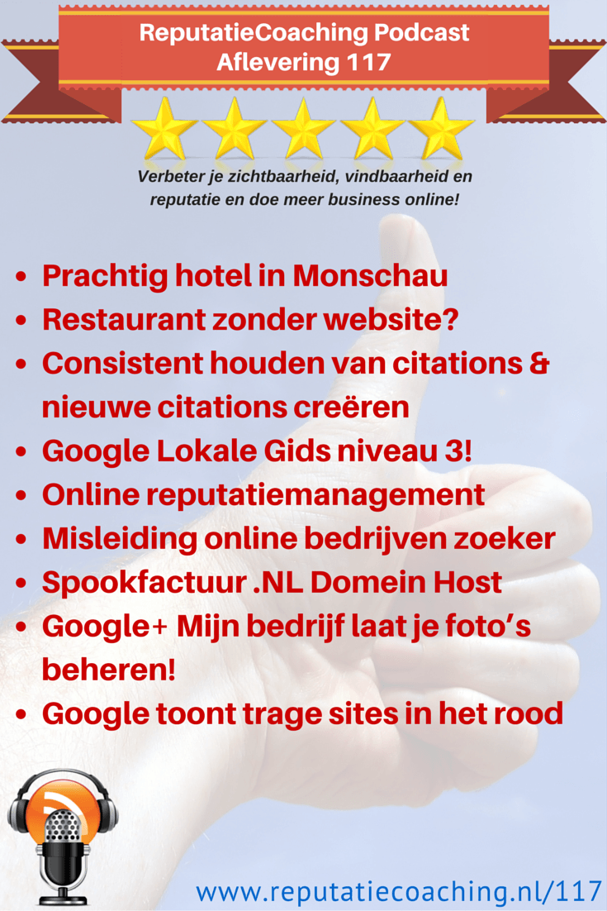
Afgelopen weekend zat ik in een prachtig hotel in Monschau dat het belang van reviews echt begrijpt. Tijdens dat weekend heb ik gegeten in een restaurant in Spa, dat nog niet eens een website had. Over tegenstellingen gesproken! Het consistent houden van citations blijft lastig evenals het vinden van nieuwe bestemmingen, waar je citations voor je bedrijf kunt creëren.**

**Vorige week was ik nog een Google Lokale Gids niveau 2 en inmiddels heb ik niveau 3 bereikt. Zo meer daarover. Vanmiddag zit ik in Amsterdam voor het bijwonen van een sessie over reputatiemanagement. Verder heb ik in de uitzending van vandaag twee topics over online misleiding en potentiële fraude voor je, inclusief een paar praktische en simpele tips hoe je dit zelf snel kunt herkennen. Google lanceert Google Bedrijfsfoto’s en gaat mobiele gebruikers met rode teksten waarschuwen voor trage websites. Dit alles en meer in deze podcast!**

Hallo en hartelijk welkom bij deze aflevering van de ReputatieCoaching Podcast. Ik ben Eduard de Boer, ReputatieCoach. Dit is dé podcast die jou helpt om meer business te genereren, doordat jouw website beter gevonden wordt, zowel lokaal als landelijk en doordat ik je uitleg hoe je je online reputatie kunt verbeteren. Dit alles helpt je om je bedrijf en jezelf beter op de online kaart te plaatsen.

De podcast kun je vinden op [www.reputatiecoaching.nl/117](https://www.reputatiecoaching.nl/117/). Daar vind je niet alleen de tekst, maar ook video’s waar ik het in deze uitzending over heb, alsmede afbeeldingen, links enzovoorts. Bovendien is de podcast te beluisteren in [iTunes](https://www.reputatiecoaching.nl/itunes), op [Stitcher](https://www.reputatiecoaching.nl/stitcher) en ook op [TuneIn Radio](http://tunein.com/radio/ReputatieCoaching-Podcast-p655084/). Ik raad je aan om je op één van die drie kanalen te abonneren op de podcast, zodat je geen aflevering hoeft te missen!

Laat ik dan nu overgaan op de onderwerpen voor vandaag…

## Prachtig hotel in Monschau

Afgelopen weekend was ik met mijn schoonvader een weekendje weg. Ik had via Travelbird twee overnachtingen geboekt bij Hotel de Lange Man net buiten Monschau. Dit hotel overtrof in alle opzichten mijn verwachtingen. Het was duidelijk dat zowel de eigenaar als zijn personeel de ultieme perfectie nastreefden.

Dat dat niet alleen onze mening was, bleek wel uit de posters aan de muur. Hier prijkten allemaal oorkonden en gemiddelde jaarbeoordelingen van TripAdvisor, Zoover en Booking.com van 8,0 en hoger, jaar in, jaar uit:

[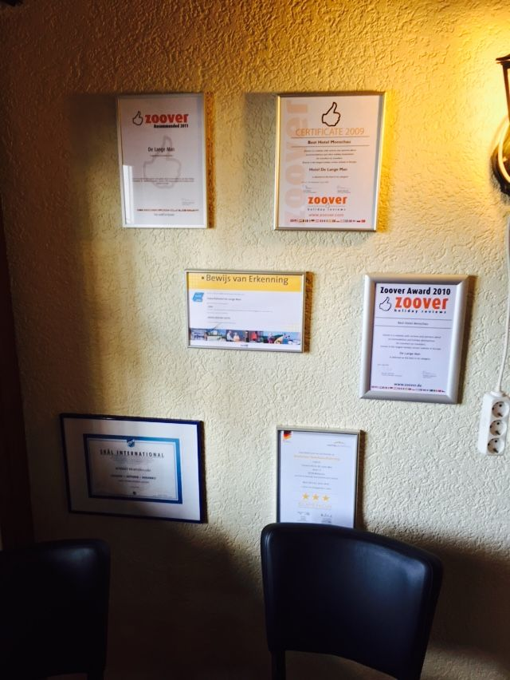](https://lh3.googleusercontent.com/-WfHyeLZjvzk/VO7MZRDZN_I/AAAAAAAABxo/uatDAxvkqVM/w541-h720-no/Posterwand-Lange-Man.jpg)

De eigenaar en al het personeel deed ook haar uiterste best om het volledig naar het zin te maken. Ik had een leuk gesprek met de eigenaar, Robert Hoevenaars. Hij begreep goed hoe Internet marketing werkt en hij zag ook het belang van reviews. Hij gaf bij het uitchecken ook een kaartje mee met daarop een link en het verzoek om via die link een review te posten. Dat doet hij bij alle gasten!

Natuurlijk heb ik bij thuiskomst het hotel een goede beoordeling gegeven. Voor mij was dat review nummer 55. Ik wil de tekst van de review hier even met je delen:

[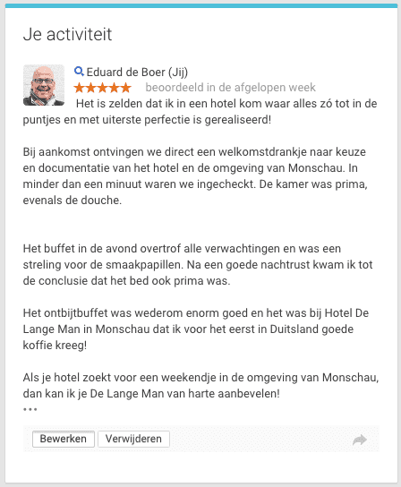](https://lh4.googleusercontent.com/-f4knmryaq5E/VO7MULnrATI/AAAAAAAABzI/3cTz6mKxk7E/w448-h544-no/20150226-Review-Lange-Man.png)

Dit was voor mij dus zo’n hotel, waar ik met alle plezier nog eens een keertje naar terug zou willen om nog eens lekker te wandelen in de heuvelen rondom Monschau.

## Restaurant zonder website!?

Tja, het kan ook heel anders. Waar de ene ondernemer volledig het nut en de noodzaak van Internet en reviews inziet, heeft de andere ondernemer er totaal geen sjoege van. Tijdens diezelfde trip naar de Eifel hebben mijn schoonvader en ik tijdens een rondrit in Spa geluncht in een klein restaurantje, genaamd “Le Relais”:

[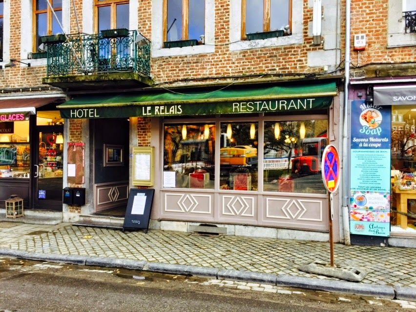](https://lh6.googleusercontent.com/-Z9s3h1rJjRI/VO7MZC2zE8I/AAAAAAAABxw/3IQx075T3cM/w852-h640-no/Hotel-restaurant-Le-Relais-Spa.jpg)

Zo op het eerste gezicht zag het er netjes uit en uiteindelijk selecteerden we het restaurant voornamelijk op basis van de prijzen op de menukaart. Die lagen lager dan de omringende restaurants. Desalniettemin betaalden we iets meer dan EUR 35 voor twee kleine voorgerechtjes en drie biertjes. Dus als je het dan hebt over prijs-/kwaliteitverhouding, dan was die volgens mij in dit geval uit balans…

Maar wat ik helemaal onbegrijpelijk vond, was dat we na afloop een visitekaartje meekregen met daarop de naam van het restaurant, het adres en het telefoonnummer. Het restaurant bleek geen eigen website te hebben en het e-mailadres dat op het kaartje stond, was gewoon een Gmail-adres!

Hoe schril zijn dan de tegenstellingen, als je dit vergelijkt Hotel de Lange Man, waar ik het zojuist over had?! Ongelofelijk dat een restaurant in deze tijd totaal nog niet aan Internet marketing doet, geen reviews verzamelt en geen eigen website heeft om potentiële gasten te interesseren en te stimuleren om een keertje te komen eten.

## Consistent houden van citations en nieuwe citations creëren

Het consistent houden van citations blijft lastig. Je moet echt zo’n goede administratie hebben, waarin je alle sites waar jij met je bedrijf vermeld staat, bijhoudt. Want ik kreeg een paar weken geleden van een tandarts het verzoek de nieuwe openingstijden van de tandartspraktijk te vermelden op “alle” sites.

Gelukkig heb een spreadsheet met daarop gegevens van alle voor mij bekende sites. Dus de grote sites, zoals Google+, Facebook, Yelp en dergelijke waren snel aangepast, evenals de andere sites van de spreadsheet.

Op een gegeven moment dacht ik dat ik alle sites had aangepast. En prompt liep ik eerder deze week alsnog tegen een site, waar de oude openingstijden nog stonden vermeld. Wat bleek nu? Daar heeft de tandarts zelf de praktijk ooit aangemeld, maar hij was vergeten de gegevens in de spreadsheet te zetten!

Hiermee wil ik maar aangeven hoe snel je inconsistente gegevens kunt creëren: als iemand met de beste bedoelingen ergens een citation creëert zonder de gegevens te registeren, loop je het risico dat je bij een verandering van bedrijfsgegevens dus die site per ongeluk overslaat.

Tot zover over het consistent houden van citations. Maar hoe vind je nu steeds nieuwe bestemmingen voor citations? Je kunt natuurlijk maandelijks al je concurrenten onderzoeken met behulp van de Chrome extensie “NAP Hunter Lite”, waar ik het de vorige keer ook over had. Maar als je die een maand of twee tot drie hebt gebruikt en je concurrenten zijn niet echt actief in het aanmelden van hun bedrijf op een aantal sites, dan droogt je voorraad sites langzaamaan op…

Als jij een continue stroom van bestemmingen voor citations wilt hebben, gebruik dan ook Google Alerts daarvoor! Ik vertelde je vorige week over Diana Albrink, die ik had aangeraden om haar eigen naam, alsmede de titel van haar boek te monitoren met behulp van Google Alerts. Maar je kunt Google Alerts nog veel creatiever gebruiken!!

Is het je opgevallen wat de meeste sites waar je citations kunt plaatsen als gemeenschappelijke tekst hebben? Nee? Laat ik je het verklappen… Het is: “bedrijf aanmelden”. Stel dus dat in als zoekterm op Google Alerts:

[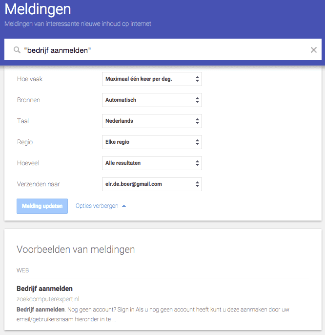](https://lh6.googleusercontent.com/-iPb8Y5DuqA4/VO7MU5yc7cI/AAAAAAAAByA/jeWs3zQOaT0/w666-h685-no/20150226-bedrijf-aanmelden-alert.png)

## Google Lokale Gids niveau 3 bereikt

Vorige week vertelde ik je nog dat ik op niveau 2 zat van het Lokale Gidsen programma van Google. Toen had ik iets meer dan 20 reviews gepost. Inmiddels zit ik op 55 reviews en dus heb ik niveau 3 bereikt. Van Google ontving ik de onderstaande mail:

[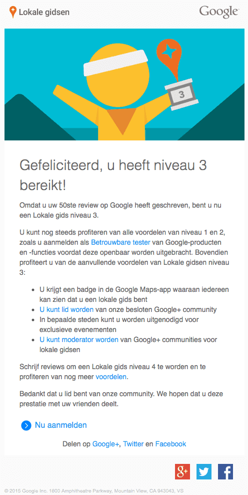](https://lh3.googleusercontent.com/-GMsHAnUjMmQ/VO7Mbq2f5TI/AAAAAAAAByM/92UDU50oeZQ/w496-no/20150222-Lokale-Gidsen-niveau-3.png)

Ik zie op dit moment nog nergens de badge, die je als Lokale Gids niveau 3 bij je naam vermeld krijgt. Ik denk dat dat komt, doordat Google de badges nog aan het uitrollen is. Zo schijnt de Google Maps app voor Android bijvoorbeeld dus ook al wel de badges te vertonen, maar die voor iOS nog niet. Dus in Google Maps op mijn iPhone zie ik sowieso nog geen badges, ook niet bij mensen waarvan ik weet dat ze niveau 3 of 4 zijn.

Maar goed, voordat ik niveau 4 bereik, moet ik nog wel wat recensies posten. Nog zo’n 145 om precies te zijn.

Ik wil je trouwens laten weten dat dat beta-testen klopt. Ik mag niet in detail treden, maar ik ontving gisteravond voor het eerst een mailtje om een nieuw product, dat nog in beta-status is, uit te proberen.

## F5-sessie over online reputatiemanagement

Vanmiddag zit ik in Pakhuis de Zwijger in Amsterdam. Daar is een zogenaamde F5-sessie, die wordt georganiseerd door Lubbers en de Jong. Het onderwerp van deze sessie is “online reputatiemanagement”. Volgens de aankondiging op Internet komen de volgende sprekers een verhaal houden:

```
  * **Guido Berens** (assistant professor aan de Rotterdam School of Management van de Erasmus Universiteit) – Guido plaatst online reputatiemanagement in een wetenschappelijk perspectief en geeft antwoord op de vraag: “Hoe open moet je als bedrijf zijn?”.
  * **Joost Galema** (Manager External Affairs van Vodafone) – Joost laat zien wat Vodafone’s visie op reputatiemanagement is.
  * **Rob Wijnberg** (oprichter en hoofdredacteur van De Correspondent) – Rob vertelt over de beweegredenen achter dit vernieuwende journalistieke platform. De Correspondent wil het begrip ‘actualiteit’ herdefiniëren.
```

Ik ben benieuwd wat ik kan verwachten. Als je de gastenlijst bekijkt, zie je een uiteenlopend publiek. Wat velen van hen wel gemeenschappelijk hebben, is de functie. In de meeste functieomschrijvingen zie je woorden als: “communicatie”, “PR” en “marketing”. Om wat namen te geven van bedrijven waar de gasten zoal vandaan komen… Ik zie bijvoorbeeld: Vodafone, Salesforce, AutomatiseringGids, Dell, KPN, Unicef, HP, BT en andere bekende bedrijfsnamen.

In de podcast van volgende week kom ik hierop terug.

## Misleiding door onlinebedrijvenzoeker.nl

Eerder deze week ontving ik van twee bedrijven die ik help met het hogerop komen in de zoekresultaten een typisch gevalletje van misleiding en fraude. De eerste kwam van Joris Aben Fotografie uit Leiden. Hij stuurde mij de volgende mail:

Tjongejonge, ongelofelijk dat bedrijven dit nog steeds proberen. En zal ik je wat vertellen: ze komen er vaak ook nog mee weg! Er zijn altijd wel ondernemers die erin trappen en bereid zijn te betalen voor dit soort wildwest-praktijken.

Als je door dit soort bedrijven wordt gebeld is bijna steevast het verhaal dat het ontzettend helpt bij je ranking in Google, dat hun pagina’s goed scoren in de zoekresultaten, dat ze partner zijn van Google en dergelijke.

Maar ik heb eens een kijkje genomen op de site “onlinebedrijvenzoeker.nl” en gezocht op “fotograaf Leiden”. Toen zag ik onder andere het scherm, zoals ik dat in show notes op [www.reputatiecoaching.nl/117](https://www.reputatiecoaching.nl/117/) heb opgenomen:

[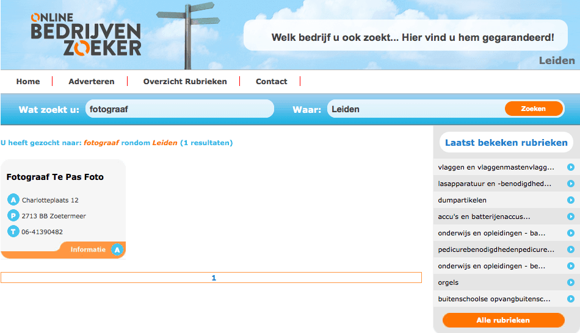](https://lh6.googleusercontent.com/-IKdxvzKx-LY/VO7MYK2z_pI/AAAAAAAABxY/D19bk0Ds6H4/w950-h546-no/20150226-online-bedrijvenzoeker.png)

Wat valt je als eerste op? Zie je die fout rechtsboven? Wat klungelig! Daar staat de tekst “Welk bedrijf u ook zoekt… Hier vind u hem gegarandeerd!”. En dan is “vind” geschreven zonder “t”. Ik vind het echt onvoorstelbaar dat bedrijven dit soort fouten maken op hun websites! Het is tevens een signaal voor de kwaliteit en professionaliteit van een dergelijke site… Dit moet je toch voldoende zeggen?

OK, vergeef de knullige spelfout. Als het bedrijf pretendeert dat je alle bedrijven die je zoekt, gegarandeerd op deze site kunt vinden… Hoe komt het dan dat het zoeken zo moeizaam gaat? Op zoekterm “fotograaf Leiden” vond ik slechts één fotograaf. Maar al die fotografen doen aan fotografie. Grappig genoeg geeft de zoekterm “fotografie Leiden” maar liefst 5 vermeldingen van fotografen in Leiden. En dat terwijl er toch echt veel meer fotografen in Leiden zijn. Maar waarschijnlijk worden alleen bedrijven die gegarandeerd € 385 per jaar betalen ook gegarandeerd vertoond… Als je er op zoekt met de juiste zoekterm…

Ik dacht handig te zijn en te gaan zoeken via de rubrieken op de site. Zo zag ik de rubriek “fotografie - algemeen”. Maar toen ik daarop klikte kreeg ik een lijst waarin onder andere een audiozaak, een juwelier, een restaurant, een legerdump, een lijstenmakerij en een antiquariaat in voorkwamen, maar weer geen fotografen.

Dus dat je gegarandeerd het bedrijf vindt, wat je zoekt… Dat maakt “onlinebedrijvenzoeker.nl” niet waar, ondanks de leus in hun banner die je dit wel belooft.

Mijn advies is bijna nooit geld te betalen voor je basis bedrijfsvermeldingen. Een gewone vermelding van je bedrijf met de bedrijfsnaam, het adres, de postcode, plaats en telefoonnummer moet gratis zijn, vind ik. Indien een website of directory je extra wil laten betalen als je méér wilt, vind ik dat vanzelfsprekend! Dat is ook het meest gehanteerde model van de betere directory- en reviewsites.

## Spookfactuur van .NL Domein Host

Het tweede fraudegeval van deze week kwam van .NL Domein Host. De Jeugdtandarts in Beuningen ontving een factuur van .NL Domein Host voor een bedrag van EUR 98,80 inclusief BTW. Het bijzondere is, dat de Jeugdtandarts haar domeinen bij een heel ander bedrijf heeft geregistreerd. De factuur heb ik trouwens opgenomen in de show notes:

[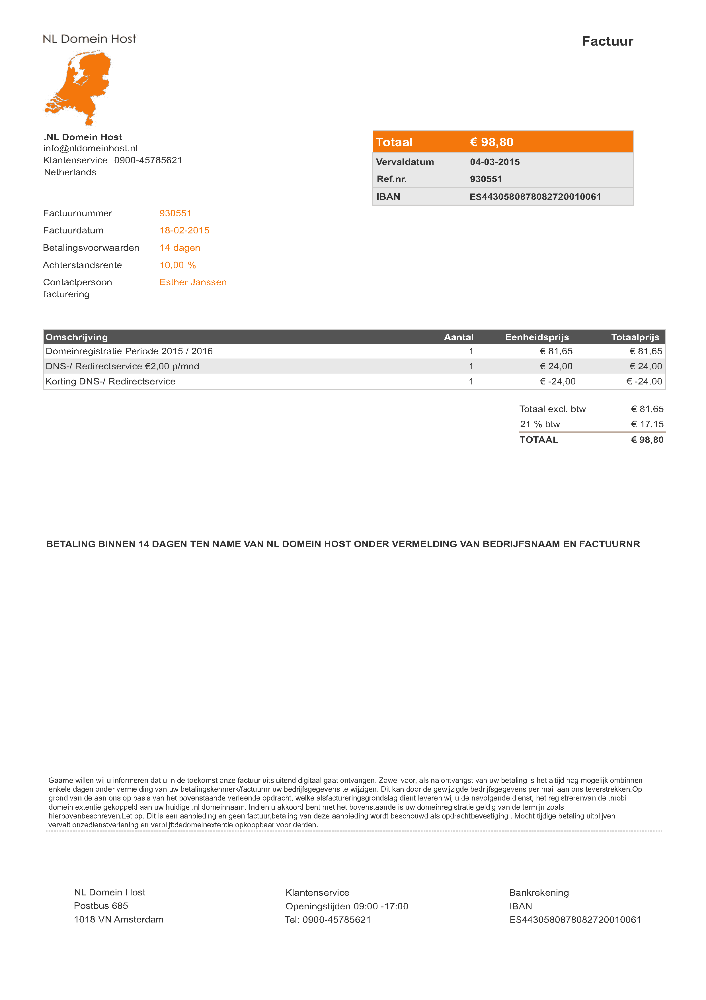](https://lh5.googleusercontent.com/-msX3JHj1OE4/VO7MYrPOFaI/AAAAAAAABxk/qrWbMcEd9H4/w1240-no/20150226-spookfactuur-nl-domein-host.png)

Op de factuur stond een 0900-nummer vermeld. Dat schrikt vaak mensen af, omdat men bang is dat het een erg duur nummer is. Maar ik liet me niet afschrikken. Ik had wel een paar vragen paraat, zoals:

```
  1. Ik ontving een factuur van EUR 98,80 voor domeinregistratie periode 2015 / 2016. Kunt u mij vertellen over welke domeinen het gaat? Want we hebben er zoveel…
  2. Oh en het viel mij op dat u wel BTW in rekening brengt, maar geen BTW-nummer heeft vermeld. Kunt u dat nog even geven voor mijn administratie?
  3. Dan heb ik nog een laatste vraag… U gaat over .NL domeinnamen en bent gevestigd in Amsterdam. Waarom heeft u een Spaans bankrekeningnummer?
```

Maar helaas was het vermelde 0900-nummer niet in gebruik…

Dat waren de eerste zaken die mij opvielen. Maar het grappigste vond ik, dat hoewel het een domeinhostingbedrijf pretendeert te zijn, op de factuur geen URL van een website staat vermeld. Wel staat er een e-mailadres op het domein nldomeinhost.nl vermeld.

Als ik de bijbehorende website zoek, krijg in Safari de foutmelding:

[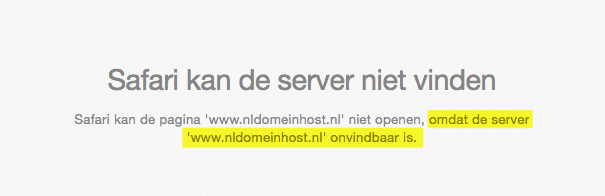](https://lh3.googleusercontent.com/-qOS9N6UWdvQ/VO7MXAIeeVI/AAAAAAAABxQ/p8a0oM8uF60/w605-h196-no/20150226-nldomeinhost-onvindbaar.png)

Ik raad het mensen ook altijd aan om een domeinnaam even te controleren. Zo kun je .nl-domeinnamen controleren op de website van de SIDN, de [Stichting Internet Domeinregistratie Nederland](https://www.sidn.nl). Als je daar nldomeinhost.nl intoetst, dan kun je lezen dat de domeinnaam is geblokkeerd vanwege spam en abuse:

[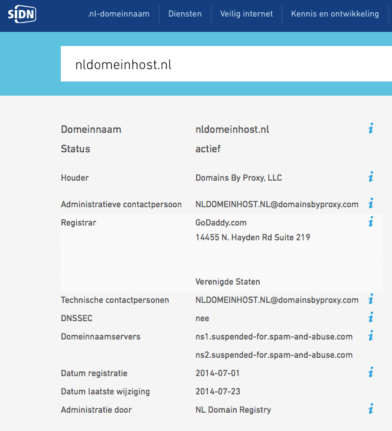](https://lh3.googleusercontent.com/-Tgr0wV2zFLo/VO7MXtLY0mI/AAAAAAAABx4/xiwXTU1mCs0/w655-h720-no/20150226-nldomeinhost-sidn.png)

Deze paar simpele signalen zetten je toch wel aan het denken… Toch?

Mocht je dit allemaal niet hebben gedaan, maar je als alleen de footer van de factuur aandachtig leest, dan valt je wel iets anders op. Zo leest de footer moeilijk vanwege ontbrekende spaties en is het taalgebruik klungelig en gekunsteld om het officieel te laten lijken. Ik zal je de footer even voorlezen. In de show notes heb ik de tekst letterlijk gekopieerd en geplakt, inclusief de ontbrekende spaties. Kijk het maar eens na op [www.reputatiecoaching.nl/117](https://www.reputatiecoaching.nl/117/):

Daaruit blijkt dus wat het bedrijf biedt: het registreren van de .mobi domeinnaam en die doorlussen naar je eigen .nl-domein.

Och… is het je opgevallen?? In die kleine lettertjes? Ik zal het nog even aanhalen: “Dit is een aanbieding en geen factuur, betaling van deze aanbieding wordt beschouwd als opdrachtbevestiging.”. Het is dus helemaal geen factuur!

Ik hoop dat ik je hiermee een paar nuttige handvatten heb gegeven waarmee jij in de toekomst dit soort spookfacturen snel daadwerkelijk als zodanig kunt herkennen en je dus niet in dit soort frauduleuze praktijken trapt.

## Google+ Mijn bedrijf laat je foto’s beheren!

Sinds een paar dagen biedt Google je in Google+ Mijn Bedrijf de mogelijkheid om foto’s te uploaden in diverse categorieën. Als je inlogt op je zakelijke Google+ pagina, zie je opeens een nieuwe button in de header staan. In de show notes op [www.reputatiecoaching.nl/117](https://www.reputatiecoaching.nl/117/) heb ik daar een afbeelding van opgenomen:

[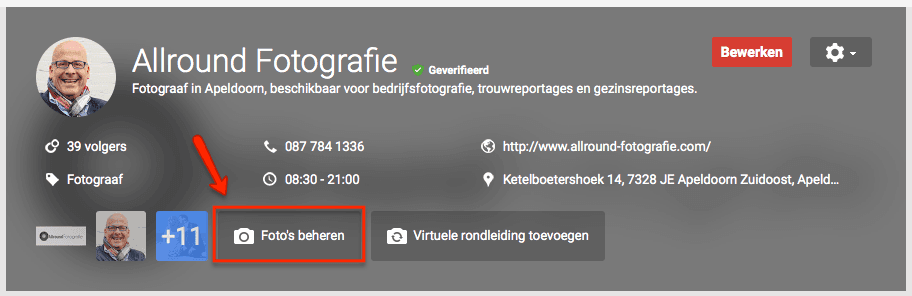](https://lh3.googleusercontent.com/-FcT5pw2y7C8/VO7MWTkH4eI/AAAAAAAABx8/3X5N3YW4i7s/w912-h296-no/20150226-google-plus-fotosbutton.png)

Daar heb je nu zes categorieën, waaronder je foto’s kunt toevoegen. Deze categorieën zijn:

```
  1. **Identiteitsfoto’s** – profiel, logo en omslag
  2. **Foto’s van interieur** – voor het laten zien van de sfeer en inrichting van je bedrijf
  3. **Foto’s van buitenkant** – helpt klanten je bedrijf te herkennen wanneer ze uit verschillende richtingen naderen
  4. **Foto’s van mensen aan het werk** – helpt klanten snel een beeld te krijgen van het soort werk dat je doet
  5. **Teamfoto’s** – voor het tonen van de meer persoonlijke kant van je bedrijf
  6. **Extra foto’s** – voor het tonen van unieke en interessante aspecten van je bedrijf die niet in één van de andere fotocategorieën passen.
```

Ik moest er gisteravond natuurlijk meteen mee aan de slag en ben begonnen om voor [Wijsman en Koster Tandartsen in Apeldoorn](https://plus.google.com/+WKTandartsenNL/) foto’s te uploaden en in te delen volgens de nieuwe categorieën.

Als je gaat kijken op de Google+ pagina vind je de foto’s vervolgens terug in het album “Plakboekfoto’s”. Zo heet het tenminste in het albumoverzicht. Maar als je erop klikt, dan zie je als titel verschijnen: “Business photos”. Daar vind je dus alle foto’s die je volgens de nieuwe indeling uploadt:

[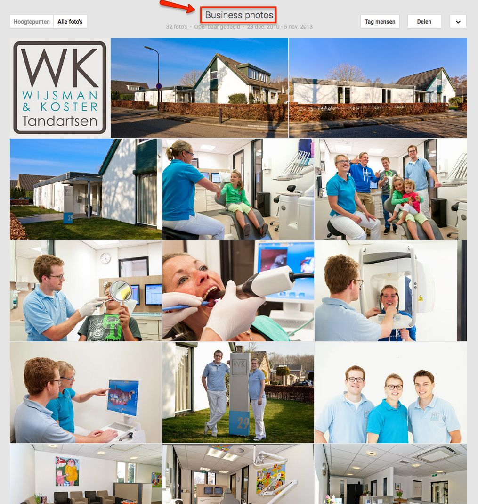](https://lh6.googleusercontent.com/-IGl5eq-S5Sk/VO7MWXigLGI/AAAAAAAABxE/KgiCBSAIC00/w684-h720-no/20150226-google-plus-business-photos.jpg)

Het enige wat ik verder nog heb ontdekt, is dat als je op de drie puntjes rechts in het kader van de “Identiteitsfoto’s” klikt, je kunt kiezen welke afbeelding als eerste moet worden weergegeven op Google Maps en Google Zoeken. Daarbij kun je kiezen uit de profielfoto, het logo of het omslag. Voor Wijsman en Koster Tandartsen heb ik gekozen voor het logo.

Verder is het natuurlijk de vraag wat Google hiermee gaat doen; waarvoor ze de foto’s gaan gebruiken. Vooralsnog wordt er op dit moment door Google niets speciaals mee gedaan voor bezoekers van de Google+ pagina van een bedrijf. Ik houd het in de gaten en als ik in de nabije toekomst er iets opvallends mee zie gebeuren, dan laat ik je het meteen weten.

## Google toont trage sites in het rood

Google waarschuwt al tijden niet voor niets dat je je websites moet optimaliseren voor gebruikerservaring. Het begon met het apart tonen van sites die Flash bevatten. Sinds een tijdje hebben we daar nu de extra aanduiding “Voor mobiel” bij… Deze grijze tekst geeft aan dat de getoonde website geschikt is voor mobiele apparaten.

Het zat er al een lange tijd aan te komen… Sinds 2010 maakt Google gebruik van PageSpeed voor het ranking algoritme. In welke mate, dat weet natuurlijk alleen Google.

Google gaat nu een stapje verder en waarschuwt je zelfs met een rode tekst als websites traag zijn. In de zoekresultaten in de VS zijn deze tests opgedoken. In de show notes op [www.reputatiecoaching.nl/117](https://www.reputatiecoaching.nl/117/) heb ik een screenshot hiervan opgenomen:

[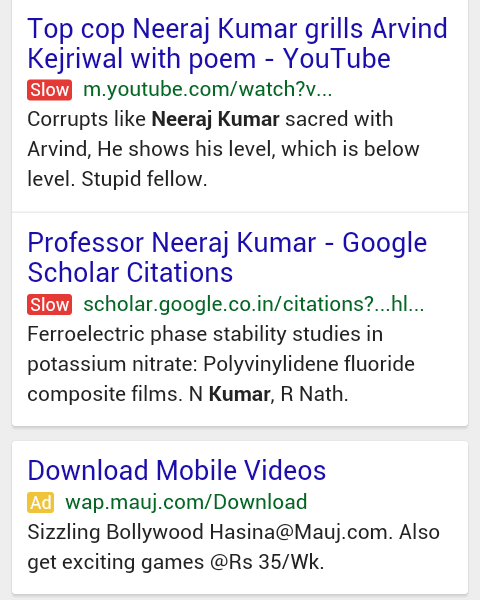](https://lh6.googleusercontent.com/-q8NvUMaiAFA/VO7MZyBbMpI/AAAAAAAABx0/31UjVuxzewU/w480-h600-no/google-mobile-slow-label.png)

Al zou de weging van de laadtijd van een pagina nog op nul staan in het ranking algoritme, dan is dit duidelijk een signaal voor gebruikers om weg te blijven van de desbetreffende website, omdat die “traag” is.

Wauw! Dit zal duidelijk minder bezoekers opleveren, ook al sta je hoog in de zoekresultaten! Begin dus alvast met het meten en verbeteren van de laadtijd van je pagina’s. Toevallig heb ik daar een tijdje geleden in [podcast 114](https://www.reputatiecoaching.nl/114/) twee instructievideo’s voor gepubliceerd. Kijk die nog naar eens terug.

Ik heb een video van het [meten van de laadtijd van je website met Pingdom](https://www.youtube.com/watch?v=F_SeN1MnErE) en een video van het [meten van de laadtijd van je website met Google PageSpeed Insights](https://www.youtube.com/watch?v=GlmQmNJWMB4). Ik zou beginnen met de tweede en de adviezen gaan implementeren, die Google je geeft. De kans is echter groot dat je daar zelf niet uitkomt. In dat geval raad ik je aan contact op te nemen met je webbouwer.

En met dit nieuwtje hoe Google aan het testen is voor het weergeven van trage sites in de mobiele zoekresultaten, kom ik dan weer aan het einde van deze podcast.

Als je de podcast leuk vindt en je wilt nog meer op de hoogte blijven, volg me dan ook op Twitter, via [@reputatiecoach1](https://twitter.com/reputatiecoach1).

Heb je inderdaad wat aan alle informatie die ik met je deel, help mij dan met het verder verbeteren en promoten van deze podcast. Abonneer je op de podcast, zodat je altijd meteen de nieuwste uitzending krijgt voorgeschoteld.

Zoek de podcast op, in [iTunes](https://www.reputatiecoaching.nl/itunes) of [Stitcher](https://www.reputatiecoaching.nl/stitcher), geef de podcast een sterrenbeoordeling en laat ook je reactie achter. Door de podcast te beoordelen op iTunes en/of Stitcher breng je de podcast onder de aandacht van een breder publiek.

Je kunt me verder helpen, door de podcast aan te bevelen bij vrienden of collega’s, waarvan je denkt dat ze er hun voordeel mee kunnen doen, of door ’m te delen op Twitter, like’n en delen op Facebook of een “+1” te geven op Google+.

En vergeet niet: ik ben hier om je te helpen! Als je een vraag of een probleem hebt met betrekking tot je online reputatie of de vindbaarheid van je website, kun je een mailtje sturen naar [podcast@reputatiecoaching.nl](mailto:podcast@reputatiecoaching.nl).

Als je dat te lastig vindt, of als je de podcast beluistert terwijl je in de auto zit en je hebt acuut een vraag, spreek dan een boodschap in op de ReputatieCoaching Hotline, op nummer: 084 - 883 15 56. Mogelijk behandel ik je vraag of probleem dan in een artikel of in de podcast.

En je kunt ook rechtstreeks op de website een voicemail achterlaten, door op de tab aan de rechterkant van elke pagina te klikken, en je bericht in te spreken. Dit was [ReputatieCoaching Podcast aflevering 117](https://www.reputatiecoaching.nl/117/) en mijn naam is [Eduard de Boer](http://nl.linkedin.com/in/eduarddeboer/nl).

Ik wens je de komende week weer succes met het werken aan je reputatie, zodat je meteen je reputatie voor jou kunt laten werken!

Tot volgende week!

Doei!

Links naar content die in deze podcast aan bod komt:

```
  * [ReputatieCoaching Podcast in iTunes](https://www.reputatiecoaching.nl/itunes)
  * [ReputatieCoaching Podcast op Stitcher](https://www.reputatiecoaching.nl/stitcher)
  * [ReputatieCoaching Podcast op TuneIn Radio](http://tunein.com/radio/ReputatieCoaching-Podcast-p655084/)
  * [ReputatieCoaching Podcast RSS-feed](https://feeds.reputatiecoaching.nl/ReputatieCoachingPodcast)
  * [Stichting Internet Domeinregistratie Nederland](https://www.sidn.nl)
  * [Pingdom : Laadtijd website meten](https://www.youtube.com/watch?v=F_SeN1MnErE)
  * Google PageSpeed Insights: Laadtijd website meten
```
